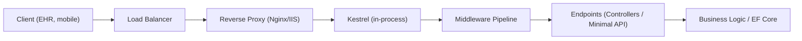
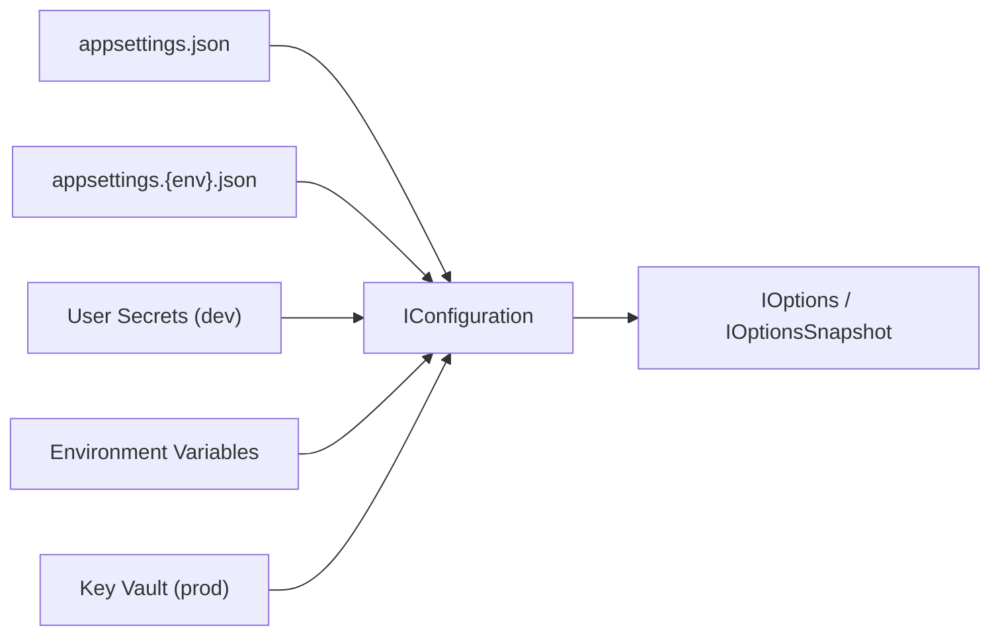
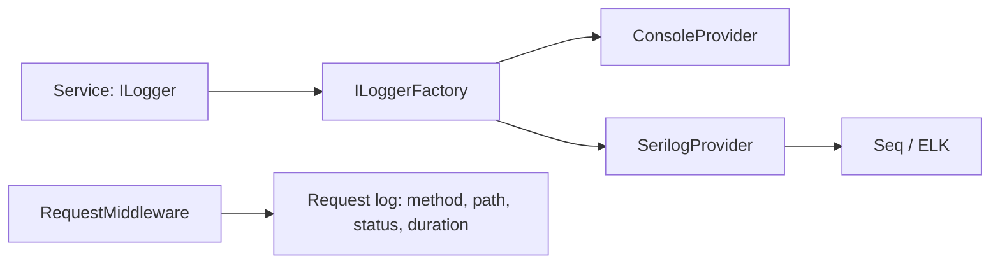
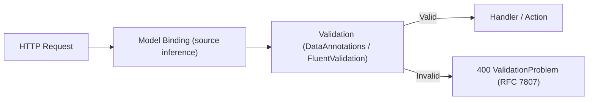
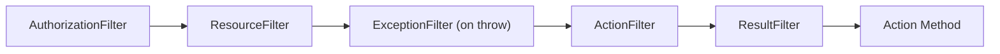
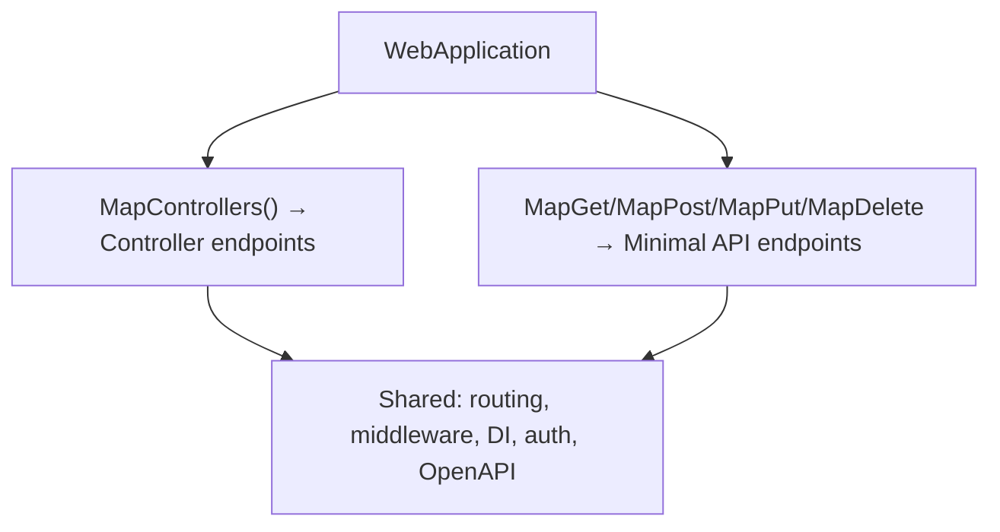
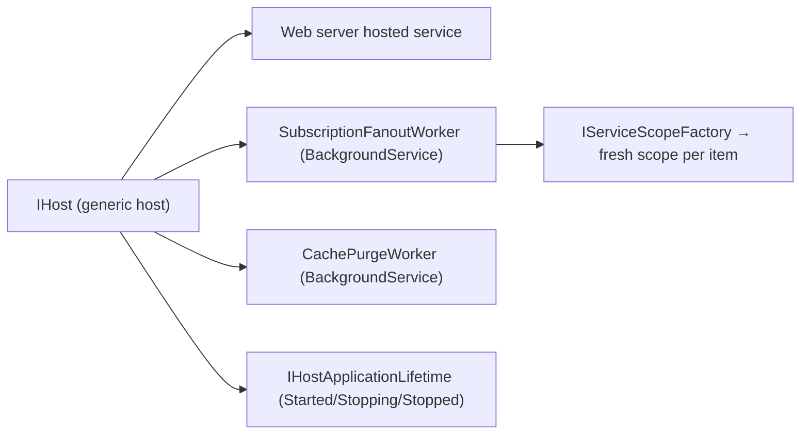
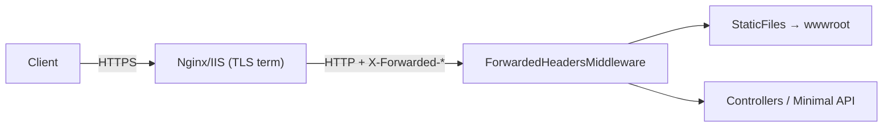
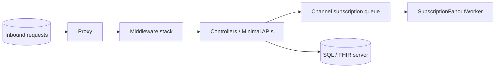

# Chapter 9: ASP.NET Core

> **Audience:** Experienced .NET developers (5+ years) preparing for an L2 (Mid/Senior) interview at a Healthcare company.
> **Scope:** What ASP.NET Core is and how it differs from the old ASP.NET Framework, the minimal hosting model, Kestrel, the request pipeline and middleware, the configuration system, structured logging, model binding and validation, MVC filters, controllers vs. minimal APIs, hosting and background services — all framed around FHIR/HL7 EHR integration and HIPAA-grade production systems.

---

## 9.1 ASP.NET Core Fundamentals and Hosting

### Interview Answer (30–45 seconds)

> "ASP.NET Core is a cross-platform, high-performance, open-source framework for building web apps and services. Unlike classic ASP.NET Framework (Windows-only, System.Web-based, tied to IIS), it runs on .NET 8+, uses Kestrel as its cross-platform HTTP server, and composes everything — config, DI, logging, middleware — through a single `WebApplicationBuilder`. The minimal hosting model in Program.cs has collapsed what used to be Startup.cs + configuration wiring into one file. For a healthcare API I care about three things here: Kestrel is the production web server (IIS is just a reverse proxy in front), every request flows through a middleware pipeline I control, and the host wires configuration, DI, and logging before the first request."

### Detailed Explanation

**ASP.NET Core vs. ASP.NET Framework:**

| Concern | ASP.NET Framework (classic) | ASP.NET Core |
|---|---|---|
| Runtime | .NET Framework (Windows) | .NET 8+ (cross-platform) |
| HTTP server | IIS (or IIS Express) | Kestrel (cross-platform, in-process) |
| Request abstraction | `System.Web.HttpContext` | `Microsoft.AspNetCore.Http.HttpContext` (middleware-friendly) |
| Hosting | `Global.asax`, `web.config`, IIS pipeline | `WebApplicationBuilder`/minimal hosting |
| Config | `web.config` (XML) | appsettings.json + environment variables + providers |
| DI | Manual (Unity, Autofac bolted on) | Built-in container, first-class |
| OWIN compatibility | N/A | Kestrel + `Owin` interfaces supported |
| Cross-platform | No | Yes (Linux, macOS, containers) |

**The three generations of hosting:**

1. **WebHostBuilder (2.x):** `Startup` class split into `ConfigureServices` + `Configure`; the beginning of "configuration as code."
2. **HostBuilder (3.x):** added generic host (`IHost`), background services, consolidated config/logging.
3. **WebApplicationBuilder (6+):** minimal hosting — `Program.cs` is the whole app; builder exposes `Services`, `Configuration`, `Logging`, `Environment`; `app.MapGet`/`app.MapControllers()` attach endpoints.

**Kestrel:**
- Cross-platform HTTP server library (`Microsoft.AspNetCore.Server.Kestrel`).
- In-process with ASP.NET Core; high throughput (ASP.NET Core regularly tops TechEmpower benchmarks).
- Can be fronted by IIS, Nginx, or Apache as a *reverse proxy* for TLS termination, load balancing, and public exposure — but Kestrel itself is production-capable.
- Supports HTTP/1.1, HTTP/2, and (with configuration) HTTP/3.

**The request is handled outside IIS's process**, so classic `web.config` HTTP modules/handlers and AppDomain semantics are gone; everything is middleware.

### Real World Example (Healthcare)

A hospital's FHIR API (e.g., `GET /fhir/Patient/1234`) runs as an ASP.NET Core app on Kestrel inside a Linux Docker container, behind an Nginx reverse proxy that terminates TLS and does OAuth2 token validation at the edge. The same container image runs in dev (Docker Compose), staging, and prod (Kubernetes). In the old world this would have been a Windows IIS deployment with `web.config` transformation files per environment.

### Production Code Example

```csharp
// Program.cs — minimal hosting model (net8)
var builder = WebApplication.CreateBuilder(args);

builder.Services.AddControllers();
builder.Services.AddHttpClient<IFhirClient, FhirClient>();
builder.Services.AddHealthChecks().AddDbContextCheck<ClinicalDbContext>();

var app = builder.Build();

app.UseHsts();                       // dev-only safe defaults
app.UseHttpsRedirection();
app.UseRouting();
app.UseAuthentication();             // JWT bearer from chapters 11-12
app.UseAuthorization();
app.MapControllers();
app.MapHealthChecks("/health");

app.Run();
```

**Key lines explained:**

- `builder.Services.AddControllers()` registers MVC; `app.MapControllers()` maps attribute-routed controllers to endpoints.
- `app.UseRouting()`/`UseAuthorization()` show the explicit middleware ordering (see 9.2).
- `app.MapHealthChecks("/health")` exposes liveness/readiness probes for Kubernetes and load balancers — standard for a production healthcare deployment.

### Internal Working

- `WebApplicationBuilder` reads config providers (appsettings, env vars, launchSettings), sets up the `IServiceCollection`, and builds a `WebApplication` that owns an `IHost` + `IServiceProvider`.
- On startup, the framework builds the middleware pipeline from the ordered `app.Use*()` calls into a linked list of `RequestDelegate`s (`Func<HttpContext, Task>`).
- Kestrel accepts a TCP connection, adapts it into `HttpContext`, and pushes it through the pipeline; the response unwinds back out.
- Endpoints (from `MapControllers`/`MapGet`) are matched after routing middleware and executed by the terminal endpoint middleware.

### Advantages

- Cross-platform and container-friendly (Linux + Docker = the standard healthcare cloud deploy).
- Fast: Kestrel in-process, no IIS overhead.
- Unified, first-class config, DI, logging, and pipeline — no magic XML config.
- Self-contained deployment (no server framework needed) and small images.
- Massive ecosystem: EF Core, SignalR, gRPC, health checks, OpenTelemetry.

### Disadvantages

- Ecosystem/behavior differences from classic ASP.NET — legacy `System.Web` apps and old libraries don't port automatically.
- Middleware ordering mistakes are easy and often only surface as 500s in prod.
- More moving parts than a single framework: you choose your own auth, validation, and background-jobs story.

### Best Practices

- Use the minimal hosting model (`WebApplicationBuilder`); no Startup class unless you must.
- Treat Kestrel as the production server; use a reverse proxy for TLS and load balancing in front.
- Build with containers in mind: config via environment variables, health checks, `UseSerilogRequestLogging` or similar for request logs.
- Pin versions and use `.NET 8` LTS for healthcare platforms (long support window).

### Common Mistakes

- Keeping `Startup.cs` ceremony when the minimal model is available.
- Relying on IIS for things Kestrel already does (or deploying Kestrel directly without any proxy, then hand-wiring TLS).
- Mixing app config, secrets, and infrastructure config into one provider without a hierarchy.
- Letting `web.config`/`appsettings` from a legacy app get copied over wholesale.

### Interview Follow-up Questions

1. When would you *not* put a reverse proxy in front of Kestrel?
2. How do you run two ASP.NET Core apps on one Linux host?
3. What changed between WebHostBuilder, HostBuilder, and WebApplicationBuilder?
4. How does `IHost` differ from `IWebHost`?

### Senior Level Talking Points

- "Kestrel handles the HTTP workload; the proxy handles TLS, compression, and routing to multiple apps. That split lets the .NET tier stay horizontally scalable behind a load balancer."
- "The generic host decoupled the web part from the hosting part — that's why background services and gRPC share the same host."
- "For a multi-tenant EHR platform, I'd configure the host once and rely on environment variables + a config service per tenant rather than `web.config` per environment."

### Diagram



### Comparison Table

| Feature | ASP.NET Framework | ASP.NET Core |
|---|---|---|
| Platforms | Windows | Windows, Linux, macOS |
| Web server | IIS | Kestrel (+proxy) |
| Config | web.config | appsettings.json + providers |
| DI | Third-party | Built-in |
| Deployment | IIS pool | Self-contained, containers |
| Performance | Good | Excellent (TechEmpower top tier) |

### Memory Trick

**"KIP-CD"**: **K**estrel, **I**n-process, **P**ipeline = **C**ross-platform **D**I — ASP.NET Core's four pillars.

### Summary

ASP.NET Core is the cross-platform, Kestrel-hosted successor to ASP.NET Framework. The minimal hosting model wires config, DI, logging, and the middleware pipeline through `WebApplicationBuilder`; Kestrel is production-capable, optionally fronted by a reverse proxy.

### Interview Confidence Score

**High.** Fundamentals questions on ASP.NET Core vs Framework and the hosting model are near-certain. The senior signal is demonstrating you know Kestrel's role, the minimal hosting model, and containerized deployment.

---

## 9.2 The Request Pipeline and Middleware

### Interview Answer (30–45 seconds)

> "Every request in ASP.NET Core flows through a pipeline of middleware components — `Func<HttpContext, Task>` delegates composed in the order I register them. Each middleware decides to invoke the next component (short-circuiting when it doesn't) or to handle the request itself. Order is everything: exception handling must be outermost, then HTTPS/static files/routing/authentication/authorization, then endpoints. A classic bug is `UseRouting`/`UseAuthorization` out of order, which silently lets authorization run before routing. For a healthcare API I use middleware for cross-cutting concerns like audit logging, correlation IDs, and HIPAA-sensitive header scrubbing — each as a small, testable component."

### Detailed Explanation

**Middleware anatomy:**

```csharp
// A middleware is a method taking HttpContext + next delegate
public async Task InvokeAsync(HttpContext context, RequestDelegate next)
{
    // before next() — request phase
    await next(context);
    // after next() — response phase
}
```

**How the pipeline works:**
- Components are composed into a chain; each holds a reference to the next via the `next` delegate.
- A component can **short-circuit**: not call `next()` and instead write directly to the response (e.g., a caching middleware, an auth challenge, static files).
- The pipeline unwinds in reverse for the response phase.

**Built-in middleware (typical order in an API):**

1. `UseExceptionHandler` / `UseDeveloperExceptionPage` — catch unhandled exceptions (outermost).
2. `UseHsts` / `UseHttpsRedirection`.
3. `UseStaticFiles` (if serving frontend).
4. `UseRouting` — matches the request to an endpoint.
5. `UseAuthentication` — establishes the identity (does not block).
6. `UseAuthorization` — enforces policies on the matched endpoint.
7. Custom domain middleware (audit, correlation ID, tenant resolution).
8. `MapControllers`/`MapGet` — the terminal endpoint middleware.

**Custom middleware — three styles:**

1. Class-based: `InvokeAsync(HttpContext, RequestDelegate)` (dependencies injected into the ctor, but note a convention: per-request services go into the `InvokeAsync` signature).
2. Factory-based: implements `IMiddleware`/`IMiddlewareFactory` — enabled when the middleware itself has scoped dependencies.
3. Inline: `app.Use(async (ctx, next) => { ...; await next(); })` for small blocks.

### Real World Example (Healthcare)

A **correlation-ID and audit middleware** for a FHIR API. Every request gets a `X-Correlation-Id`; the middleware logs the clinical system name, endpoint, and processing time, and scrubs `Authorization` headers from logs so PHI/bearer tokens never leak into Serilog. This is exactly what an EHR audit trail requirement (e.g., under HIPAA) demands.

```csharp
public sealed class CorrelationIdMiddleware
{
    private readonly RequestDelegate _next;
    public CorrelationIdMiddleware(RequestDelegate next) => _next = next;

    public async Task InvokeAsync(HttpContext context)
    {
        var correlationId = context.Request.Headers["X-Correlation-Id"].FirstOrDefault()
                            ?? Guid.NewGuid().ToString("N");
        context.TraceIdentifier = correlationId;          // tie into logs
        context.Response.Headers["X-Correlation-Id"] = correlationId;
        await _next(context);
    }
}
```

Registered early: `app.UseMiddleware<CorrelationIdMiddleware>();`.

### Production Code Example

```csharp
var builder = WebApplication.CreateBuilder(args);

var app = builder.Build();

if (app.Environment.IsDevelopment())
{
    app.UseDeveloperExceptionPage();
}
else
{
    app.UseExceptionHandler("/error");   // structured error contract, no stack traces
}

app.UseHttpsRedirection();
app.UseMiddleware<CorrelationIdMiddleware>();
app.UseMiddleware<RequestAuditMiddleware>();     // logs verb, path, status, duration
app.UseRouting();
app.UseAuthentication();
app.UseAuthorization();

app.MapControllers();
app.MapHealthChecks("/health");

app.Run();
```

**Key lines explained:**

- Exception middleware is *outermost* so it can catch everything downstream.
- Audit/correlation middleware sits before routing so even unroutable requests are traced.
- Authentication before authorization; authorization after routing so the endpoint's policy is known.

### Internal Working

- `app.Use(...)` appends a `MiddlewareFilter`/`UseMiddlewareExtensions` wrapper that builds the chain by embedding `next` as a closure.
- At build time the framework walks the registered order and constructs one `RequestDelegate` per middleware, creating a nested delegate call chain.
- When Kestrel delivers a request, the `Application` invokes the outermost delegate; each middleware either calls `next(context)` or short-circuits.
- `UseRouting` sets `context.GetEndpoint()`; `UseAuthorization` later inspects that endpoint's `IAllowAnonymous`/`Authorize` metadata.

### Advantages

- Cross-cutting concerns (auth, logging, error handling, CORS, correlation) in one place, order-controlled.
- Each middleware is independently testable via `DefaultHttpContext`.
- Minimal overhead — just delegate invocation.

### Disadvantages

- Wrong order produces subtle, hard-to-debug failures (e.g., auth before routing).
- Easy to bloat the pipeline with many tiny `Use` lambdas.
- Middleware running after a short-circuit never executes — surprising when misread.

### Best Practices

- Register exception handling first; authentication before authorization; routing before either.
- Put order-sensitive middleware in extension methods with clear names (`UseCorrelationId()`).
- Use `UseWhen`/branching (`app.MapWhen`) to apply middleware conditionally (e.g., only for `/api`).
- Keep middleware stateless for scalability; inject scoped per-request services via `InvokeAsync` parameters, not the constructor.

### Common Mistakes

- `UseAuthorization` before `UseAuthentication`.
- `UseRouting` after `UseEndpoints`/`MapControllers`.
- Forgetting `next(context)` and silently swallowing requests.
- Creating a new `IServiceScope` inside middleware to resolve scoped services instead of relying on the request scope.
- Throwing synchronous exceptions inside middleware (handle them in the exception middleware).

### Interview Follow-up Questions

1. How do you add a middleware that only runs for `/api/*` paths?
2. What happens if a middleware writes to the response *and* calls `next()`?
3. How do you unit-test a custom middleware?
4. Difference between `Run`, `Use`, and `Map`?
5. When is `IMiddleware` (factory) preferable to the conventional class?

### Senior Level Talking Points

- "I treat the middleware pipeline as the single choke point for cross-cutting policy — audit, correlation, scrubbing of PHI from logs — so individual controllers stay thin."
- "Middleware order is part of our security review checklist; we even have a test that asserts `Authentication` precedes `Authorization` in the pipeline."
- "For performance, middleware that short-circuits (static files, caching) should run early; anything that must see every request (audit) runs later to avoid double work."

### Diagram


### Comparison Table

| Middleware | Runs before auth? | Typical role |
|---|---|---|
| ExceptionHandler | Yes (outermost) | Convert errors to responses |
| Hsts/HttpsRedirection | Yes | Enforce TLS |
| StaticFiles | Yes | Serve wwwroot |
| Routing | No | Match endpoint |
| Authentication | No | Set identity |
| Authorization | No | Enforce policy |

### Memory Trick

**"EDRAA"** = **E**xceptions → **D**ata/static → **R**outing → **A**uthentication → **A**uthorization — the canonical order; everything else slots around it.

### Summary

Middleware is a composable chain of delegates every request flows through. Correct ordering (exceptions → static → routing → auth → authz → endpoints) and short-circuiting semantics are the two things interviewers probe, plus the ability to write a testable custom middleware for cross-cutting concerns like audit and correlation IDs.

### Interview Confidence Score

**High.** Middleware and pipeline ordering is one of the most-asked ASP.NET Core topics. Show an example, state the canonical order, and explain a short-circuit scenario.

---

## 9.3 Configuration System

### Interview Answer (30–45 seconds)

> "ASP.NET Core configuration is a layered key-value system built from ordered providers — appsettings.json, appsettings.{Environment}.json, environment variables, user secrets, command line — where later providers override earlier ones. Everything funnels into `IConfiguration`, which I read strongly-typed through the options pattern (`IOptions<T>`/`IOptionsSnapshot<T>`). The killer property is `Environment.GetEnvironmentVariable` and `ASPNETCORE_ENVIRONMENT` switching config per environment with zero rebuilds. For a healthcare API, the boundary rule is: non-secrets in appsettings, secrets (DB passwords, signing keys, FHIR server creds) in environment variables or a managed key vault — never in the repo."

### Detailed Explanation

**Provider chain (default for WebApplicationBuilder):**

1. `Microsoft.Extensions.Configuration.Json` — `appsettings.json`
2. `appsettings.{Environment}.json` (e.g., `appsettings.Production.json`)
3. User Secrets (Development only)
4. Environment variables (`EnvironmentVariablesConfigurationProvider`)
5. Command-line arguments

Later = higher precedence. `env:VAR` prefix mapping lets Azure App Service / Docker / Kubernetes inject config seamlessly.

**Environment selection:** `ASPNETCORE_ENVIRONMENT` (web) or `DOTNET_ENVIRONMENT` (host). Values: `Development`, `Staging`, `Production` (or any custom).

**Access patterns:**

```csharp
// 1. Raw access (stringly-typed, fragile)
var conn = builder.Configuration.GetConnectionString("ClinicalDb");

// 2. Options pattern (strongly-typed, validated) — preferred
builder.Services.Configure<FhirOptions>(builder.Configuration.GetSection("Fhir"));
```

**The options pattern (see chapter 8):**
- `IOptions<T>` — snapshot at startup, cached.
- `IOptionsSnapshot<T>` — per-request values (re-read each request).
- `IOptionsMonitor<T>` — singleton that observes file changes; `OnChange` notifications.

**Environment-aware secrets handling:**
- Development: user secrets (`secrets.json`) — not committed.
- Production: environment variables or Azure Key Vault / AWS Secrets Manager / GCP Secret Manager; never stored in appsettings.

### Real World Example (Healthcare)

```json
// appsettings.json — non-secret baseline
{
  "Logging": { "LogLevel": { "Default": "Information" } },
  "Fhir": {
    "BaseUrl": "https://fhir.internal.example.com/r4",
    "OrganizationId": "MSH-HOSP",
    "MaxPageSize": 200,
    "Scopes": ["patient/*.read", "Observation.read"]
  }
}
```

```json
// appsettings.Production.json — overrides only what differs
{
  "Logging": { "LogLevel": { "Default": "Warning", "Microsoft.AspNetCore": "Warning" } },
  "Fhir": { "MaxPageSize": 50 }
}
```

Secrets like `ConnectionStrings:ClinicalDb` come from environment variables or Key Vault; CI never writes them into the repo.

### Production Code Example

```csharp
var builder = WebApplication.CreateBuilder(args);

// Key Vault provider (Azure) layered last — highest precedence for secrets
if (builder.Environment.IsProduction())
{
    builder.Configuration.AddAzureKeyVault(
        new Uri(builder.Configuration["KeyVaultUri"]),
        new DefaultAzureCredential());
}

// Strongly typed options with startup validation
builder.Services.AddOptions<FhirOptions>()
    .Bind(builder.Configuration.GetSection("Fhir"))
    .Validate(o => !string.IsNullOrWhiteSpace(o.BaseUrl),
              "FHIR BaseUrl is required.")
    .ValidateOnStart();

// Per-environment connection strings
var conn = builder.Configuration.GetConnectionString("ClinicalDb");
```

**Key lines explained:**

- Secrets provider is added *last* so it wins over appsettings.
- `ValidateOnStart` fails fast in prod if required config is missing (a classic HIPAA-adjacent concern: never run with misconfigured auth).
- `GetConnectionString` reads `ConnectionStrings:*` keys from any provider.

### Internal Working

- Each provider is a `IConfigurationProvider` that loads key-value pairs into a dictionary (with support for `:` as a hierarchy separator).
- `IConfiguration` is a composite view: reads walk providers in reverse registration order and return the first hit.
- The options pattern uses `IConfigurationBinder.Bind()` to map sections to properties; the binder supports lists, dictionaries, and arrays.
- Environment variable names use `__` (double underscore) as the separator (e.g., `ConnectionStrings__ClinicalDb`).

### Advantages

- Layered, environment-aware, zero-rebuild switching.
- Strongly typed via the options pattern; validated at startup.
- Provider ecosystem: JSON, XML, INI, env, command line, Azure/AWS/GCP secrets.
- Perfect for containers: inject config as env vars.

### Disadvantages

- Stringly-typed access is error-prone (typos silently yield nulls).
- Too many providers/layers → "which value wins?" confusion.
- Secrets in appsettings accidentally committed is a recurring security leak.

### Best Practices

- Always bind to options classes; never pass `IConfiguration` around as a service.
- Validate options at startup (`ValidateOnStart`); fail fast in production.
- Keep non-secrets in appsettings; secrets in env vars / vaults.
- Treat config as code: review changes, never log resolved secrets.

### Common Mistakes

- Committing `secrets.json` or prod connection strings.
- Using `IConfiguration["Key"]` everywhere instead of the options pattern.
- Missing `ValidateOnStart` → prod boots with null config.
- Relying on `appsettings.json` for secrets because "it worked locally."

### Interview Follow-up Questions

1. What is the precedence order of configuration providers?
2. How do you read an array from config?
3. Why use the options pattern over direct `IConfiguration` access?
4. How does `ASPNETCORE_ENVIRONMENT` affect config loading?

### Senior Level Talking Points

- "I define a contract between code and ops: non-secret config in appsettings with `ValidateOnStart`, secrets injected via environment variables from the vault, and a startup test that ensures production can't boot without required keys."
- "For tenants, `IOptionsSnapshot` re-reads per request so a tenant config change takes effect immediately without restarting the process."
- "The provider order is a security control: environment variables and the vault always win over what's in source."

### Diagram



### Comparison Table

| Provider | Precedence | Typical use |
|---|---|---|
| appsettings.json | Lowest | Baseline, non-secrets |
| appsettings.{env}.json | Low | Environment tweaks |
| User Secrets | Dev only | Local dev secrets |
| Environment variables | High | Container/CI secrets |
| Key Vault / CLI | Highest | Production secrets |

### Memory Trick

**"JUE-C"** — **J**SON, **U**ser secrets, **E**nvironment, **C**ommand line, then Key Vault on top: *later providers win*.

### Summary

Configuration is a layered key-value system of providers where later wins. The senior practice is strongly-typed `IOptions<T>` with startup validation, environment-based overrides, and secrets outside the repo.

### Interview Confidence Score

**High.** Configuration questions are common and easy to impress on: name the provider order, show the options pattern, and mention secrets-in-vault for production.

---

## 9.4 Logging in ASP.NET Core

### Interview Answer (30–45 seconds)

> "ASP.NET Core ships a logging abstraction: `ILogger<T>` injected into services, with log levels (Trace..Critical), structured messages, and a provider system — Console, Debug, EventSource, and third parties like Serilog. Providers and levels are configured in appsettings `Logging` sections with category filters like `Microsoft.AspNetCore: Warning`. The senior move is *structured logging*: log objects and correlation IDs so a query in the logging backend returns the full request chain, and a *request logging middleware* that emits one log per request with duration and status. For a HIPAA-sensitive API, I log metrics and outcomes, not PHI payloads — patient identifiers where required, but never protected data or bearer tokens."

### Detailed Explanation

**Core types:**
- `ILogger<T>` — `T` is the category (usually the class).
- `LogInformation`, `LogWarning`, `LogError`, `LogCritical`, `LogDebug`, `LogTrace`.
- `LogLevel` default `Information`; scopes and structured templates.
- Providers: `Console`, `Debug`, `EventSource`, `AzureAppServices`, `Serilog`, `NLog`.

**Filters and categories:**
```json
"Logging": {
  "LogLevel": {
    "Default": "Information",
    "Microsoft.AspNetCore": "Warning",
    "Microsoft.EntityFrameworkCore": "Warning"
  }
}
```

**Structured logging (Serilog):**

```csharp
Log.Information("Order {OrderId} submitted for patient {PatientId}",
                order.Id, order.PatientId);
```

The `{OrderId}` placeholder is captured as a named field, enabling `where OrderId = 123` queries in Seq/Elasticsearch.

**Request logging:** Serilog's `UseSerilogRequestLogging()` or a custom middleware emits one line per request: method, path, status, duration, correlation ID.

**Scopes:** `logger.BeginScope(...)` groups logs from one request into a unit (e.g., all logs tagged with the same correlation ID).

### Real World Example (Healthcare)

```csharp
var logger = app.Logger;
logger.LogInformation(
    "FHIR search {ResourceType} filtered by {FilterCount} criteria for tenant {TenantId}, took {ElapsedMs}ms",
    resourceType, filters.Count, tenantId, sw.ElapsedMilliseconds);

// HIPAA-aware: no patient PHI beyond the required identifier,
// no Authorization header, no query-string PHI.
```

### Production Code Example

```csharp
var builder = WebApplication.CreateBuilder(args);

builder.Host.UseSerilog((context, cfg) => cfg
    .ReadFrom.Configuration(context.Configuration)
    .Enrich.WithCorrelationId()
    .WriteTo.Console()
    .WriteTo.Seq("http://seq.internal:5341")
    .Enrich.WithProperty("Environment", builder.Environment.EnvironmentName));

var app = builder.Build();

app.UseSerilogRequestLogging();   // one log line per request

// In a handler:
_logger.LogInformation("Received FHIR interaction {Method} {Path} for patient {PatientId}",
                       method, path, patientId);
```

**Key lines explained:**

- Serilog replaces the default provider via `UseSerilog` but keeps `ILogger<T>` injection — no code changes in services.
- `Enrich.WithCorrelationId()` ties every line in a request chain together.
- Request logging middleware + structured fields = the observability story.

### Internal Working

- `ILoggerFactory` creates `ILogger<T>`; each logger fans out to all registered `ILoggerProvider`s.
- `Logger` computes the minimum level for the category; messages below it are dropped early (cheap filtering).
- Structured values are stored in a `MessageTemplate` with named holes; providers render them (console) or keep them structured (Seq/ES).
- `BeginScope` creates a scope object propagated to providers for enrichment.

### Advantages

- Unified API across providers; swap providers without touching business code.
- Category-based filtering keeps noise down.
- Structured logging gives queryable, correlated observability.

### Disadvantages

- Default providers are plain text; structured backend needs a sink (Seq, ELK, Loki) and money/infra.
- Over-logging PHI data is a compliance risk.
- Log volume is expensive at scale if not filtered well.

### Best Practices

- Never log secrets, tokens, or full patient records.
- Use structured placeholders, not string concatenation.
- Filter `Microsoft.AspNetCore` to Warning in prod.
- Correlate with `TraceIdentifier`/correlation ID; include tenant and operation IDs.
- Use request logging middleware for per-request telemetry.

### Common Mistakes

- `logger.LogInformation($"Order {x} failed {err}")` — string interpolation defeats structure.
- Logging patient PHI (SSN, full DOB) into centralized logs.
- Leaving Debug/Trace level on in production → log flooding and cost.
- Forgetting to correlate distributed calls (missing Trace ID).

### Interview Follow-up Questions

1. How do you filter logs by category and level?
2. What's the difference between scopes and structured fields?
3. How do you redact sensitive data from logs?
4. Why is string interpolation bad in logging calls?

### Senior Level Talking Points

- "Logging is telemetry, not just text: correlation IDs, structured fields, and a request-logging middleware give us the same query surface as our APM tooling."
- "I treat log content as a HIPAA review artifact — we have a rule that PHI is limited to identifiers required for diagnosis and everything else is redacted at the boundary."
- "Per-request scopes let me group the whole DB/HTTP/cache trail under one correlation ID in Seq."

### Diagram



### Comparison Table

| Concern | Plain logging | Structured logging (Serilog) |
|---|---|---|
| Output | Formatted text | Key-value fields |
| Queryability | grep only | Field search, dashboards |
| Correlation | manual strings | Enriched + scoped |
| Cost | low volume | volume needs management |

### Memory Trick

**"No PII in logs"** — the healthcare logging law: Patient info, Passwords/tokens, and Payloads stay out of the log stream.

### Summary

ASP.NET Core logging is a provider-based abstraction with category filters and structured templates. The senior lever is structured, correlated logging with request-level telemetry and strict no-PHI rules.

### Interview Confidence Score

**High.** Expect "how does logging work / how do you make it structured" — answer with Serilog, request logging middleware, correlation IDs, and the HIPAA log hygiene angle.

---

## 9.5 Model Binding and Validation

### Interview Answer (30–45 seconds)

> "Model binding maps incoming request data — route values, query strings, form data, and JSON bodies — onto controller action parameters or minimal-API parameters. Sources are inferred from the parameter (e.g., `[FromBody]` for JSON, `[FromRoute]`, `[FromQuery]`), and complex types bind recursively by property name. Validation then runs on the bound model: DataAnnotations attributes on the model (`[Required]`, `[MaxLength]`, custom validators) are checked automatically in controllers, or via FluentValidation. Invalid models return `400` with a validation problem detail. For a healthcare API, I validate aggressively at the boundary — resource types, codes, dates, and IDs — because garbage in becomes bad clinical data."

### Detailed Explanation

**Binding sources:**
- `[FromRoute]` — `{id}` in the route.
- `[FromQuery]` — query string.
- `[FromBody]` — request body (JSON by default).
- `[FromForm]` — form-encoded.
- `[FromHeader]`, `[FromServices]` (DI), `[FromKeyedServices]`.
- Implicit rules: simple types ← route/query, complex types ← body.

**Binding details:**
- Complex objects bind by matching property names (case-insensitive) to request keys; nested objects recurse.
- JSON uses `System.Text.Json`; can swap to `Newtonsoft.Json` via `AddNewtonsoftJson`.
- Collections, dictionaries, and enum binding are supported; `DateTime` parsing is culture-aware.

**Validation:**
- DataAnnotations (`System.ComponentModel.DataAnnotations`): `[Required]`, `[Range]`, `[StringLength]`, `[RegularExpression]`, `[EmailAddress]`, custom `ValidationAttribute`.
- `ModelState.IsValid` in controllers; MVC auto-returns `400` with `ProblemDetails`.
- Minimal APIs: `.AddEndpointFilter<ValidationFilter<T>>` or explicit validation.
- FluentValidation: fluent rules, cross-property validation, better separation — pairs nicely with `AddValidatorsFromAssembly`.

**Enabling validation in minimal APIs (net7+):**
- `builder.Services.AddProblemDetails()` and `IEndpointFilter` for validation.

### Real World Example (Healthcare)

```csharp
public sealed record CreatePatientRequest(
    [property: Required, MaxLength(64)] string FamilyName,
    [property: Required, MaxLength(64)] string GivenName,
    [property: Required, CustomDate] string BirthDate,   // ISO 8601 (FHIR date)
    [property: Required, RegularExpression(@"^[MFOXU]$")] char Gender,  // FHIR gender codes
    string? MRN);
```

A FHIR `Patient` create validates against a CDM (SNOMED/LOINC) and HL7 naming rules before the repository is touched.

### Production Code Example

```csharp
// Controller style — automatic validation
[HttpPost]
[ProducesResponseType(typeof(PatientResource), StatusCodes.Status201Created)]
[ProducesResponseType(StatusCodes.Status400BadRequest)]
public async Task<IActionResult> Create(
    [FromBody] CreatePatientRequest request, CancellationToken ct)
{
    if (!ModelState.IsValid)                       // usually handled by filter
        return ValidationProblem(ModelState);
    // ...
}

// Minimal API style — endpoint filter validation (net7+)
app.MapPost("/fhir/Patient", CreatePatient)
   .AddEndpointFilter<ValidationFilter<CreatePatientRequest>>();
```

**Key lines explained:**

- Controllers auto-respond `400` with `ValidationProblem` details when `[ApiController]` is applied.
- Minimal APIs need the explicit filter (or manual validation) — a common gotcha.
- Producing `201 Created` with the Location header is FHIR-spec behavior.

### Internal Working

- MVC builds a `ModelBinder` per parameter at startup from metadata (attributes + type shape).
- Binding populates the model; validation attributes are evaluated by `DataAnnotationsModelValidator`.
- `ModelState` records errors; `[ApiController]` automatically returns `BadRequest` when invalid — unless the action short-circuits.
- Minimal-API filters run around the handler; a validation filter can return `TypedResults.ValidationProblem`.

### Advantages

- Declarative binding + validation keeps controllers thin.
- Standard `400` problem details contract for API consumers.
- FluentValidation/DataAnnotations both integrate cleanly.

### Disadvantages

- Attribute metadata clutters domain models.
- Over-validation at every layer causes duplication.
- Custom complex validation can be slow if it hits the DB.

### Best Practices

- Validate at the API boundary; keep internal models trusted.
- Prefer explicit `[FromBody]`/`[FromQuery]` on minimal APIs.
- Use FluentValidation for cross-property/custom rules.
- Return `ProblemDetails` (RFC 7807) consistently.

### Common Mistakes

- Forgetting `[ApiController]` behavior differences between MVC and minimal APIs.
- Trusting model binding for complex nested DTOs without tests.
- Swallowing validation errors → 500s instead of 400s.
- Binding PHI in query strings (should be body/route per FHIR audit rules).

### Interview Follow-up Questions

1. How does `[ApiController]` change validation behavior?
2. When would you write a custom `ValidationAttribute` vs FluentValidation?
3. How do you validate a minimal API without MVC?
4. What's the difference between `[FromQuery]` and `[FromRoute]` for a GUID parameter?

### Senior Level Talking Points

- "Validation lives at the boundary and is code-reviewed: we validate clinical codes against the terminology server before they reach the database, and never trust client-sent IDs or codes."
- "I keep the API DTO separate from the domain model precisely so validation attributes don't leak into persistence entities."
- "Consistent `ProblemDetails` errors mean our EHR clients parse errors programmatically rather than screen-scraping messages."

### Diagram



### Comparison Table

| Aspect | MVC Controllers | Minimal APIs |
|---|---|---|
| Validation | Automatic via [ApiController] | Endpoint filter / manual |
| Binding hints | `[FromBody]` etc. | Inferred or explicit |
| Error response | `ValidationProblem` | `TypedResults.ValidationProblem` |
| Boilerplate | More (controller class) | Less (lambda) |

### Memory Trick

**"Bind then Validate, 400 on fail"** — the two-step contract for every API input.

### Summary

Model binding infers sources and populates parameters; validation checks the bound model; invalid input returns `400` `ProblemDetails`. Know the `[ApiController]` automatic behavior and the minimal-API filter story.

### Interview Confidence Score

**Medium-High.** Validation questions surface frequently. Nail the `[ApiController]` automatic-400 behavior and the minimal-API difference to stand out.

---

## 9.6 MVC Filters

### Interview Answer (30–45 seconds)

> "Filters are attributes/classes that run code around action execution — before or after authorization, model binding, action invocation, and result execution. The main kinds are `IResourceFilter`, `IAuthorizationFilter`, `IActionFilter`, `IExceptionFilter`, and `IResultFilter`, plus their async versions. They run in a defined order per scope: authorization filters first, then resource, action, exception, result. For a healthcare API I use action filters for audit metadata and result filters to normalize FHIR responses, and I keep business logic out of filters entirely."

### Detailed Explanation

**Filter kinds (execution order):**

1. `IAuthorizationFilter` / `IAsyncAuthorizationFilter` — run before authorization decision.
2. `IResourceFilter` / `IAsyncResourceFilter` — around model binding + action; good for caching.
3. `IActionFilter` / `IAsyncActionFilter` — directly around the action method.
4. `IExceptionFilter` / `IAsyncExceptionFilter` — when an action throws.
5. `IResultFilter` / `IAsyncResultFilter` — around result execution (e.g., add headers).

**Ordering rules:**
- Within a scope, ordering: `IOrderedFilter.Order` asc, then scope (Global → Controller → Action).
- `TypeFilterAttribute`/`ServiceFilterAttribute` inject dependencies; plain attributes can't.

**Cancellation tokens** are passed to action filters and can short-circuit the pipeline by setting `context.Result`.

### Real World Example (Healthcare)

An **audit action filter** that stamps every FHIR write with the requesting clinical system, user, and timestamp — satisfying audit-trail requirements (HIPAA `§164.308`-style logging) without touching each handler.

```csharp
public sealed class AuditActionFilter : IAsyncActionFilter
{
    private readonly IAuditLogger _audit;
    public AuditActionFilter(IAuditLogger audit) => _audit = audit;

    public async Task OnActionExecutionAsync(ActionExecutingContext context,
                                             ActionExecutionDelegate next)
    {
        var stopwatch = Stopwatch.StartNew();
        var executed = await next();
        stopwatch.Stop();
        _audit.Log(new AuditEvent(
            context.HttpContext.User.Identity?.Name,
            context.HttpContext.Request.Path,
            executed.Exception == null ? "Success" : "Failure",
            stopwatch.ElapsedMilliseconds));
    }
}
```

### Production Code Example

```csharp
[ApiController]
[Route("api/[controller]")]
public class ObservationsController : ControllerBase
{
    [HttpPost]
    [Audit("Observation.Create")]           // custom audit filter attribute
    [ProducesResponseType(typeof(Observation), StatusCodes.Status201Created)]
    public async Task<IActionResult> Create(ObservationRequest request)
    {
        // ...
    }
}

// Registration for DI-backed filters
builder.Services.AddScoped<AuditActionFilter>();
```

### Internal Working

- MVC builds the filter chain from metadata (attributes) + global conventions at startup.
- Each filter becomes a node in the `ResourceInvoker` pipeline; they wrap like middleware but are endpoint-scoped.
- `ActionExecutingContext` lets a filter short-circuit (`context.Result = ...`) before the action runs.
- Exceptions thrown by a filter propagate to the next outer filter/exception middleware.

### Advantages

- Cross-cutting behavior at the action level without touching handlers.
- Declarative via attributes; DI-injectable via `ServiceFilter`/`TypeFilter`.
- Precise ordering control (`Order`, scope).

### Disadvantages

- Filters are easy to overuse → hidden behavior and surprises.
- Attribute-based dependency injection is awkward (needs `ServiceFilterAttribute`).
- Execution-order subtleties confuse developers.

### Best Practices

- Prefer middleware for app-wide concerns, filters for action-scoped concerns.
- Inject dependencies through `ServiceFilter`/`TypeFilter`, not constructor args in attributes.
- Keep filters stateless and fast.
- Use `IAsync*` versions to avoid sync-over-async.

### Common Mistakes

- Putting DI-dependent logic directly in an attribute constructor.
- Overlapping middleware and filter responsibilities.
- Forgetting filters run per-action, not per-request — cached/mis-scoped state leaks.

### Interview Follow-up Questions

1. Middleware vs filters — when do you use which?
2. How do you inject a service into an attribute-based filter?
3. What's the execution order of the filter types?

### Senior Level Talking Points

- "Middleware is app-wide policy; filters are endpoint policy. Audit that must exist for every endpoint goes in middleware, while per-controller shaping belongs in a result filter."
- "I prefer `IAsyncActionFilter` for anything I/O-bound and keep filters exception-light — real error policy stays in the exception middleware."

### Diagram



### Comparison Table

| Filter | Runs | Typical use |
|---|---|---|
| Authorization | First | Policy checks |
| Resource | Around binding | Caching |
| Action | Around method | Audit, timing |
| Exception | On throw | Error mapping |
| Result | Around result | Header shaping |

### Memory Trick

**"A-REAR"** = **A**uthorization → **R**esource → **E**xception → **A**ction → **R**esult.

### Summary

Filters are endpoint-scoped hooks running around authorization, binding, action, and result execution. Use them for action-scoped cross-cutting concerns; middleware for app-wide policy.

### Interview Confidence Score

**Medium.** Filters are less commonly probed than middleware, but a clean audit-filter example for a healthcare API is a strong differentiator.

---

## 9.7 Controllers vs. Minimal APIs

### Interview Answer (30–45 seconds)

> "Controllers give you the full MVC framework — model binding, validation, filters, `IActionResult`, OpenAPI integration out of the box — and suit large, convention-heavy APIs. Minimal APIs are lambda-based endpoints with less ceremony and faster startup, ideal for small services, health checks, and microservices. My rule: for a big FHIR or EHR API I default to controllers for resource endpoints that need filters and rich contracts, and use minimal APIs for the thin glue — `/health`, webhooks, simple CRUD proxying FHIR reads. Both compile to the same endpoint routing and share middleware, DI, and auth."

### Detailed Explanation

**Controllers:**
- Attribute routing (`[Route]`, `[HttpGet]`), `ControllerBase` helpers (`Ok()`, `Created()`, `BadRequest()`, `NoContent()`).
- Automatic `[ApiController]` behaviors: model validation → 400, binding source inference, `ProblemDetails`.
- Filters, model binding, action results, OpenAPI attributes.
- Convention: one controller per resource or bounded context.

**Minimal APIs:**
- Lambda `app.MapGet("/fhir/Patient/{id}", handler)`.
- Inferred parameters (route/query/body), `TypedResults`.
- `IEndpointFilter`s for cross-cutting endpoint logic.
- `AddEndpointFilter`, `.RequireAuthorization()`, `.WithOpenApi()`.
- Perfect for: health checks, webhooks, small standalone services, lambdas-in-the-cloud.

**When to use which:**
- Controllers: rich domain APIs, teams that like MVC conventions, heavy filter/validation use, large surface.
- Minimal APIs: small services, low ceremony, performance-sensitive startup, simple CRUD/glue.
- It's a spectrum; many real apps mix both in one `WebApplication`.

### Real World Example (Healthcare)

- `/fhir/**` → controllers (`PatientController`, `ObservationController`) for full FHIR resource interactions.
- `/internal/ping`, `/internal/config-reload`, `/webhooks/fhir-notifications` → minimal API lambdas, because they're thin and don't need MVC machinery.

### Production Code Example

```csharp
// Minimal API: thin webhook endpoint
app.MapPost("/webhooks/fhir/{subscriptionId}",
    async (Guid subscriptionId,
           [FromBody] SubscriptionEvent evt,
           INotificationProcessor processor,
           CancellationToken ct) =>
{
    await processor.HandleAsync(subscriptionId, evt, ct);
    return Results.Accepted();
})
.RequireAuthorization("WebhookClient")
.WithOpenApi();

// Controller: full FHIR resource
[ApiController]
[Route("fhir/[controller]")]
public sealed class PatientController : ControllerBase
{
    [HttpGet("{id}")]
    [ProducesResponseType(typeof(Patient), StatusCodes.Status200OK)]
    public async Task<ActionResult<Patient>> Get(string id, CancellationToken ct)
        => Ok(await _patients.GetAsync(id, ct));
}
```

### Internal Working

- Both register endpoints into the same `EndpointDataSource`; `MapControllers` adds controller endpoints, `MapGet/MapPost` add lambda endpoints.
- `RequestDelegate` is generated for each: controllers via `ControllerActionInvoker`, minimal APIs via a compiled delegate.
- Ordering/conflicts resolved by endpoint routing metadata; a controller and a lambda can share a route if you're careful.

### Advantages

- Controllers: framework power, filters, model binding, familiar conventions.
- Minimal APIs: less code, faster startup, easy to read, great for microservices.

### Disadvantages

- Controllers: ceremony, more files.
- Minimal APIs: fewer built-ins (validation, filters), less structure for large teams.

### Best Practices

- Match the tool to the surface: rich API → controllers; thin glue → minimal APIs.
- Keep endpoint handlers thin; delegate to services.
- Be explicit about binding sources in minimal APIs.
- Use one style consistently per service to avoid confusion.

### Common Mistakes

- Hand-rolling validation in every minimal API instead of using filters.
- Mixing both styles in one route with overlapping patterns.
- Putting business logic directly in lambda handlers (hard to test).

### Interview Follow-up Questions

1. Can you use both in one app?
2. How do you add OpenAPI to a minimal API?
3. When would controllers be the wrong choice?

### Senior Level Talking Points

- "The framework choice is about team ergonomics and API shape, not performance — both are fast. I choose controllers for resource-heavy clinical APIs and minimal APIs for integration glue like webhooks and health."
- "I standardize on one style per bounded context so new engineers don't guess."

### Diagram



### Comparison Table

| Aspect | Controllers | Minimal APIs |
|---|---|---|
| Ceremony | High (class, attributes) | Low (lambda) |
| Validation | Automatic ([ApiController]) | Filter / manual |
| Filters | Built-in | Endpoint filters |
| Startup | Slightly slower | Faster |
| Use case | Rich domain APIs | Thin services, glue, webhooks |

### Memory Trick

**"Controllers for contracts, lambdas for glue"** — rich FHIR resources → controllers; `/health` and webhooks → minimal APIs.

### Summary

Controllers and minimal APIs share the same endpoint pipeline but differ in ceremony and framework features. Choose controllers for rich resource APIs, minimal APIs for thin endpoints, and don't be afraid to mix them in one app.

### Interview Confidence Score

**Medium-High.** The "controllers vs minimal APIs" discussion is a favorite for L2+. Have a clear decision rule and one production example of each.

---

## 9.8 Hosting, App Lifetime, and Background Services

### Interview Answer (30–45 seconds)

> "The generic host (`IHost`) is what runs an ASP.NET Core app: it wires configuration, DI, logging, and hosts `IHostedService`s — the unit of background work. `WebApplication` extends it with web-specific bits. `IHostedService.StartAsync/StopAsync` manage the process lifecycle; `BackgroundService` is the convenient base class for `ExecuteAsync`-style long-running loops. I use background services for healthcare jobs like clinical document cleanup, FHIR subscription fan-out, and stale-request purges, each creating its own DI scope per work item. Graceful shutdown (`StopAsync` with cancellation tokens) is what lets in-flight FHIR requests drain on deploy."

### Detailed Explanation

**The host:**
- `IHost`/`IHostBuilder` — configuration, DI, logging, hosted services.
- `WebApplication` = host + web server + middleware.
- `app.StartAsync()`/`app.RunAsync()` vs `app.Run()` (blocking).

**App lifetime:**
- `IHostApplicationLifetime` events: `ApplicationStarted`, `ApplicationStopping`, `ApplicationStopped`.
- `IHostEnvironment` (environment name), `IHostApplicationBuilder`.

**Hosted services:**
- `IHostedService` — `StartAsync`/`StopAsync`, invoked at startup/shutdown.
- `BackgroundService` — abstract base implementing `ExecuteAsync(CancellationToken)` run in a background task; `StopAsync` cancels and awaits it.
- `Startup` timing: services start in registration order; the web server starts after hosted services start (unless `WaitForStartup` options change it).

**Graceful shutdown:**
- SIGTERM/`app.Shutdown()` → `ApplicationStopping` → hosted services receive `CancellationToken` → complete in-flight work → exit.
- In Kubernetes this is the drain signal before `terminationGracePeriodSeconds`.

### Real World Example (Healthcare)

A `BackgroundService` that purges expired FHIR search caches and rotates audit files nightly, plus a "subscription worker" that reads a `Channel<SubscriptionEvent>` and fan-outs notifications to EHR subscribers. Each work item resolves a fresh scoped `DbContext` via `IServiceScopeFactory` (never a captive scoped dependency).

### Production Code Example

```csharp
public sealed class SubscriptionFanoutWorker : BackgroundService
{
    private readonly IServiceScopeFactory _scopeFactory;
    private readonly ILogger<SubscriptionFanoutWorker> _logger;

    public SubscriptionFanoutWorker(IServiceScopeFactory scopeFactory,
                                    ILogger<SubscriptionFanoutWorker> logger)
    {
        _scopeFactory = scopeFactory;
        _logger = logger;
    }

    protected override async Task ExecuteAsync(CancellationToken stoppingToken)
    {
        while (!stoppingToken.IsCancellationRequested)
        {
            try
            {
                using var scope = _scopeFactory.CreateScope();
                var handler = scope.ServiceProvider
                    .GetRequiredService<ISubscriptionHandler>();
                await handler.ProcessNextAsync(stoppingToken);
            }
            catch (Exception ex) when (ex is not OperationCanceledException)
            {
                _logger.LogError(ex, "Subscription worker iteration failed");
                await Task.Delay(TimeSpan.FromSeconds(5), stoppingToken);
            }
        }
    }
}

// Registration
builder.Services.AddHostedService<SubscriptionFanoutWorker>();
```

**Key lines explained:**

- Singleton worker + `IServiceScopeFactory` = safe scoped `DbContext` per item (chapter 8 pattern).
- The `catch` guard + delay prevents a crash-loop killing the worker.
- `stoppingToken` is honored for graceful shutdown.

### Internal Working

- On `StartAsync`, the host builds the service provider and starts each `IHostedService` in registration order.
- `BackgroundService` starts `ExecuteAsync` via `Task.Run`; `StopAsync` requests cancellation then awaits the task with a shutdown timeout.
- The web server's `IHostedService` starts after others by default, so the app accepts traffic only when infrastructure services are ready.
- `IHostApplicationLifetime.StopApplication()` initiates the whole shutdown dance.

### Advantages

- One hosting model for web + workers.
- Clean lifecycle hooks for startup/shutdown and graceful drain.
- DI + config + logging shared with the web app.

### Disadvantages

- Background-service failure handling is on you (retries, backoff, observability).
- Long-running work in hosted services delays shutdown if it ignores cancellation.
- Scope/lifetime confusion (captive scoped deps) is a common bug.

### Best Practices

- Use `BackgroundService` + scope-per-item; never a scoped dep injected into the worker ctor.
- Honor `CancellationToken` everywhere; bound long work items.
- Wrap iterations in try/catch with backoff to avoid crash loops.
- Monitor with health checks and metrics; log start/stop.

### Common Mistakes

- Injecting `DbContext` (scoped) into a singleton worker (captive dependency).
- Ignoring the stopping token → slow/unclean shutdown, pod evictions.
- Letting one exception kill the whole loop.

### Interview Follow-up Questions

1. `IHostedService` vs `BackgroundService`?
2. How do you do a graceful shutdown in Kubernetes?
3. How do you run background jobs with a scoped DbContext?
4. What runs before the web server accepts requests?

### Senior Level Talking Points

- "Hosted services give me worker processes with first-class DI, config, and logging — the same container can run an API and its schedulers."
- "Graceful shutdown is an SLA feature: honoring `stoppingToken` means zero-dropped FHIR writes on rolling deploys."
- "I separate 'what to process' (queued events) from 'who processes' (the worker) using a `Channel<T>` — backpressure for free."

### Diagram



### Comparison Table

| Aspect | IHostedService | BackgroundService |
|---|---|---|
| Contract | StartAsync/StopAsync | ExecuteAsync |
| Boilerplate | More | Less |
| Typical use | One-off startup/shutdown tasks | Long-running loops |
| Cancellation | Manual | Built into ExecuteAsync |

### Memory Trick

**"Host first, then server"** — infrastructure hosted services start before the web server; honoring cancellation is what makes shutdown graceful.

### Summary

The generic host runs configuration, DI, logging, and hosted services. `BackgroundService` is the idiomatic base for background loops; scope-per-item and token-honoring are the two correctness rules. Graceful shutdown on deploy is the production-grade differentiator.

### Interview Confidence Score

**Medium-High.** Hosting and background services questions are common for senior roles, especially with Docker/Kubernetes on the stack.

---

## 9.9 Serving Static Files, HTTPS, and Environment Handling

### Interview Answer (30–45 seconds)

> "Static files come from `wwwroot` via `UseStaticFiles`, with `UseDefaultFiles`/`UseFileServer` for index pages. HTTPS is enforced with `UseHttpsRedirection` plus `UseHsts` in production; in a containerized deployment the reverse proxy usually terminates TLS and forwards plain HTTP to Kestrel, so you must configure the forwarded-headers middleware to keep scheme and client IP correct. Environments are driven by `ASPNETCORE_ENVIRONMENT`, and I use `app.Environment` to branch dev-only conveniences (developer exception page, Swagger) from hardened prod behavior."

### Detailed Explanation

**Static files:**
- Default `wwwroot`; custom roots via `UseStaticFiles(new StaticFileOptions { FileProvider = ... })`.
- `UseDefaultFiles` serves `default.html`/`index.html` for directory requests.
- SPA fallback (`app.MapFallbackToFile("index.html")`) for client-side routing.

**HTTPS:**
- `UseHttpsRedirection` (dev convenience) redirects HTTP → HTTPS.
- `UseHsts` sends the `Strict-Transport-Security` header (prod only — HSTS in dev breaks localhost).
- Behind a proxy, the app sees HTTP unless `ForwardedHeadersMiddleware` rewrites `X-Forwarded-Proto`/`X-Forwarded-For` into `HttpRequest.Scheme` and `RemoteIpAddress` (critical for redirects and IP-based audit).

**Environments:**
- `ASPNETCORE_ENVIRONMENT`/`DOTNET_ENVIRONMENT` (Development/Staging/Production).
- `app.Environment.IsDevelopment()`, `.IsProduction()`, `.EnvironmentName`.
- `appsettings.{Environment}.json` auto-loaded.
- `launchSettings.json` sets env in local dev.

### Real World Example (Healthcare)

An SPA front-end (for clinicians) served from `wwwroot` with a fallback to `index.html`, HSTS on in production, and `ForwardedHeadersMiddleware` configured because Nginx terminates TLS in front of Kestrel — otherwise every redirect would drop to HTTP and audit IPs would all read as the proxy.

### Production Code Example

```csharp
var builder = WebApplication.CreateBuilder(args);

var app = builder.Build();

// Behind Nginx: trust the proxy headers
app.UseForwardedHeaders(new ForwardedHeadersOptions
{
    ForwardedHeaders = ForwardedHeaders.XForwardedFor | ForwardedHeaders.XForwardedProto,
    KnownNetworks = { new IPNetwork(IPAddress.Parse("10.0.0.0"), 8) }
});

app.UseStaticFiles();               // serve SPA from wwwroot
app.UseDefaultFiles();

if (!app.Environment.IsDevelopment())
{
    app.UseHsts();                  // Strict-Transport-Security in prod only
}
app.UseHttpsRedirection();
app.MapFallbackToFile("index.html");
app.MapControllers();

app.Run();
```

### Internal Working

- `StaticFileMiddleware` maps URL → physical file under the provider root, sets content types from a mapping table, and short-circuits with the file if found.
- `ForwardedHeadersMiddleware` reads `X-Forwarded-*`, and (with `KnownNetworks`/`KnownProxies`) updates the request; misconfiguration can let clients spoof headers.
- HSTS is applied only over HTTPS and tells browsers to upgrade for `max-age`.

### Advantages

- Serving a front-end + API in one deploy simplifies ops.
- HTTPS/HSTS is declarative.
- Environment branching keeps dev ergonomic and prod hardened.

### Disadvantages

- Proxy misconfiguration (trusting all forwarded headers) is a security hole.
- HSTS mis-set (long `max-age` before HTTPS is solid) bricks users.
- SPA fallback can mask 404s for real API paths if ordered wrong.

### Best Practices

- `UseForwardedHeaders` only when behind a proxy, and restrict `KnownNetworks`/`KnownProxies`.
- HSTS in production only; keep `max-age` sane and include `includeSubDomains` consciously.
- Order `UseDefaultFiles` before `UseStaticFiles`.
- Branch Swagger/dev exception page on `IsDevelopment()`.

### Common Mistakes

- Trusting arbitrary `X-Forwarded-For` (IP spoofing in audit logs).
- HSTS enabled in dev → localhost breaks.
- Missing `ForwardedHeaders` → wrong scheme in redirects behind a proxy.

### Interview Follow-up Questions

1. Why do redirects break behind a reverse proxy without forwarded-headers?
2. When should you NOT use `UseHttpsRedirection`?
3. How do you serve a SPA and an API from one app?

### Senior Level Talking Points

- "TLS termination at the proxy is a deliberate security boundary; the forwarded-headers configuration is reviewed as part of that boundary so audit IPs stay trustworthy."
- "Environment branching is where I draw the dev/prod line — the same image, different `ASPNETCORE_ENVIRONMENT`."

### Diagram



### Comparison Table

| Middleware | Purpose | Order |
|---|---|---|
| ForwardedHeaders | Rewrite scheme/IP from proxy | First |
| Hsts | Strict-Transport-Security | Early |
| HttpsRedirection | HTTP→HTTPS 307 | After Hsts |
| StaticFiles | Serve wwwroot | Before routing |

### Memory Trick

**"Proxy → Forward → Static → Routes"** — trust forwarded headers first, then serve files, then route APIs.

### Summary

Static files serve the front-end; HTTPS is handled by HSTS + redirect with forwarded headers for proxy deployments; environment branching drives dev vs. prod behavior. Misordered or over-trusted forwarded headers are the classic security mistake.

### Interview Confidence Score

**Medium.** Expect at least a "how do you serve an SPA and handle HTTPS behind a proxy" question; the forwarded-headers security angle impresses senior reviewers.

---

## 9.10 A Realistic Healthcare ASP.NET Core API

### Interview Answer (30–45 seconds)

> "A production EHR integration service in ASP.NET Core is one `WebApplication` with the whole stack: Kestrel behind a proxy, the canonical middleware order, `IOptions`-based configuration with secrets in the vault, Serilog request logging, controllers for FHIR resources plus minimal APIs for webhooks, an audit filter, background workers for subscriptions and cache purging, and health checks for Kubernetes. Everything is testable — `WebApplicationFactory` spins up the pipeline in integration tests with fake repositories."

### Detailed Explanation

**Putting 9.1–9.9 together (the full Program.cs):**

```csharp
var builder = WebApplication.CreateBuilder(args);

// config + secrets
builder.Configuration.AddAzureKeyVault(
    new Uri(builder.Configuration["KeyVaultUri"]), new DefaultAzureCredential());

// DI
builder.Services.AddControllers();
builder.Services.AddHttpClient<IFhirClient, FhirClient>();
builder.Services.AddScoped<IPatientRepository, SqlPatientRepository>();
builder.Services.AddSingleton<ISubscriptionQueue, ChannelSubscriptionQueue>();
builder.Services.AddHostedService<SubscriptionFanoutWorker>();

// options
builder.Services.AddOptions<FhirOptions>()
    .Bind(builder.Configuration.GetSection("Fhir"))
    .ValidateOnStart();

var app = builder.Build();

if (app.Environment.IsDevelopment())
{
    app.UseDeveloperExceptionPage();
    app.UseSwagger(); app.UseSwaggerUI();
}
else
{
    app.UseHsts();
    app.UseExceptionHandler("/error");
}

app.UseForwardedHeaders();
app.UseHttpsRedirection();
app.UseMiddleware<CorrelationIdMiddleware>();
app.UseSerilogRequestLogging();
app.UseRouting();
app.UseAuthentication();
app.UseAuthorization();

app.MapControllers();
app.MapHealthChecks("/health", new HealthCheckOptions
{
    ResponseWriter = WriteHealthReportJson
});
app.Run();
```

**What an interviewer listens for:**
- Ordering reasoning (exceptions first, auth before authz).
- Secrets not in source.
- Observability (correlation + request logging).
- Background work and health checks for Kubernetes.
- Test strategy (`WebApplicationFactory`).

### Real World Example (Healthcare)

The same pattern powers: FHIR R4 API for Patient/Observation, HL7v2-to-FHIR ingestion, a webhook relay for `Subscription` notifications, and scheduled cache purge — one container image, Kestrel, behind Nginx, health-checked on `/health`.

### Production Code Example

See the consolidated `Program.cs` above; each layer maps to a section of this chapter.

### Internal Working

- Endpoint routing resolves `/health` and controller routes from metadata.
- Middleware wraps every request with audit/correlation/observability.
- Hosted workers consume a bounded `Channel<T>` fed by API handlers (backpressure).
- Shutdown token drains in-flight work.

### Advantages

- One coherent, reviewable composition root.
- Operational ready: health, logging, secrets, graceful shutdown.
- Every layer independently testable.

### Disadvantages

- Getting all pieces right requires cross-cutting knowledge.
- Over-engineering risk if the service is tiny.

### Best Practices

- Keep `Program.cs` readable; extract extension methods (`AddClinicalServices()`, `UseClinicalMiddleware()`).
- Health checks reflect real dependencies (DB ping, FHIR server reachability).
- Integration tests via `WebApplicationFactory` for the pipeline.

### Common Mistakes

- Copy-pasting a huge `Program.cs` without understanding ordering.
- Health checks that never hit real dependencies (always green → silent outages).
- No integration test asserting the middleware order.

### Interview Follow-up Questions

1. How would you integration-test this pipeline?
2. What does `/health` need to check for a healthcare API?
3. How do you rotate the vault secret without restarting the app?

### Senior Level Talking Points

- "I design the composition root as the single artifact an ops engineer and a security reviewer both read — every cross-cutting concern is visible in one file."
- "Our health checks fail on degraded dependencies and the orchestrator reacts; that's the difference between monitoring and alerting."

### Diagram



### Comparison Table

| Concern | Chosen tool (this chapter) |
|---|---|
| Web server | Kestrel behind Nginx |
| Config | appsettings + Key Vault |
| Logging | Serilog + request logging |
| Background work | BackgroundService + Channel<T> |
| Health | Health checks middleware |

### Memory Trick

**"Program.cs is the contract"** — a healthcare service's whole operational posture should be readable in its composition root.

### Summary

A production ASP.NET Core healthcare API composes this chapter's pieces into one `WebApplication`: canonical middleware order, vault-backed config, Serilog, controllers + minimal APIs, hosted workers, and real health checks.

### Interview Confidence Score

**High.** The integrated scenario is the most common senior interview ask — show you can assemble middleware, DI, config, logging, background work, and tests into a coherent system.

---

## Chapter 9 Wrap-Up

### Top 10 Questions You Should Be Ready For

1. How is ASP.NET Core different from ASP.NET Framework?
2. What is the request pipeline and why does middleware order matter?
3. How do you write and test a custom middleware?
4. How does the configuration provider chain work, and where do secrets go?
5. How do you make logging structured and correlated?
6. How does model binding and validation work in controllers vs minimal APIs?
7. What are MVC filters and their execution order?
8. When do you choose controllers vs minimal APIs?
9. How do hosted services and graceful shutdown work?
10. How do you serve an SPA + API behind a proxy with HTTPS?

### Revision Notes (1 page)

- **Fundamentals:** ASP.NET Core = cross-platform, Kestrel in-process, config/DI/logging first-class; minimal hosting (`WebApplicationBuilder`) collapsed Startup into Program.cs. Legacy ASP.NET Framework = Windows/IIS/System.Web.
- **Middleware:** chain of `RequestDelegate`s; order = exceptions → static → routing → authentication → authorization → endpoints; short-circuit by not calling `next()`; test with `DefaultHttpContext`.
- **Config:** providers layered, later wins: appsettings.json → appsettings.{env}.json → user secrets → env vars → CLI/Key Vault; bind to `IOptions<T>`; `ValidateOnStart`.
- **Logging:** `ILogger<T>` + providers; Serilog structured logging; correlation IDs; request logging middleware; never log PHI/tokens.
- **Binding/Validation:** sources inferred (`[FromBody]`, `[FromQuery]`); `[ApiController]` auto-400s invalid; minimal APIs need endpoint filters; FluentValidation for complex rules.
- **Filters:** order = Authorization → Resource → Exception → Action → Result; DI via `ServiceFilter`/`TypeFilter`; use middleware for app-wide policy.
- **Controllers vs Minimal APIs:** controllers for rich resource APIs; lambdas for glue/webhooks/health; both share routing, DI, auth.
- **Hosting:** `IHost` runs config/DI/logging/hosted services; `BackgroundService` + `IServiceScopeFactory` scope-per-item; honor `stoppingToken` for graceful shutdown.
- **Static/HTTPS/Env:** `wwwroot` + `UseStaticFiles`/`UseDefaultFiles`; HSTS prod-only; `UseForwardedHeaders` (restrict `KnownNetworks`) behind proxies; branch on `app.Environment`.

### Things Interviewers Expect From 5+ Years Experience

- Middleware ordering articulated with *consequences* (not memorized).
- Production posture: secrets in vault, health checks, correlation/audit logging, graceful shutdown.
- Controllers vs minimal APIs decided with a rationale, not fashion.
- An integrated scenario: assemble the full stack and defend each choice.
- Awareness of proxy forwarding as both a deployment need and a security risk.

### Cheat Sheet

```
MIDDLEWARE ORDER:
  Exceptions → ForwardedHeaders → HttpsRedirection/Hsts
  → StaticFiles → Correlation/Audit → Routing
  → Authentication → Authorization → Endpoints
  SHORT-CIRCUIT: don't call next()

CONFIG (later wins):
  appsettings.json → appsettings.{env}.json
  → user secrets (dev) → env vars → CLI / Key Vault
  USE: options pattern + ValidateOnStart; secrets in vault

LOGGING:
  ILogger<T> injection; Serilog: ReadFrom.Configuration
  UseSerilogRequestLogging(); Enrich.WithCorrelationId()
  RULE: no PHI, no tokens, no full payloads

VALIDATION:
  Controllers: [ApiController] auto 400
  Minimal APIs: IEndpointFilter / manual
  FluentValidation for cross-property rules

FILTERS ORDER: Authorization → Resource → Exception → Action → Result
HOSTED SERVICES:
  BackgroundService + IServiceScopeFactory (scope per item)
  Honor CancellationToken → graceful drain on deploy

PROXY:
  UseForwardedHeaders + restrict KnownNetworks/KnownProxies
  HSTS only in prod; HTTPS term at proxy

CHOICE: controllers = rich resources, minimal APIs = glue/webhooks/health
```

### Flash Cards

**Q1:** Kestrel vs IIS? **A:** Kestrel = cross-platform in-process server; IIS/Nginx = reverse proxy in front.

**Q2:** Middleware order? **A:** Exceptions → static → routing → auth → authz → endpoints; auth before authz.

**Q3:** How to short-circuit? **A:** Don't call `next(context)`; write the response yourself.

**Q4:** Config precedence? **A:** Later providers win: JSON → env-specific JSON → user secrets → env vars → CLI/Key Vault.

**Q5:** Where do secrets live? **A:** Environment variables or Key Vault — never appsettings/repo.

**Q6:** `[ApiController]` validation? **A:** Auto-returns 400 `ValidationProblem` when `ModelState` invalid.

**Q7:** Minimal API validation? **A:** Endpoint filter (`IEndpointFilter`) or manual check.

**Q8:** Filter execution order? **A:** Authorization → Resource → Exception → Action → Result.

**Q9:** Controllers or minimal APIs? **A:** Controllers for rich resource APIs; minimal APIs for glue/webhooks/health.

**Q10:** Worker needs scoped DbContext? **A:** `IServiceScopeFactory.CreateScope()` per work item; never captive scoped dep.

**Q11:** Graceful shutdown? **A:** Honor `stoppingToken`; drain in-flight work before exiting.

**Q12:** Redirects wrong behind proxy? **A:** Missing `UseForwardedHeaders` — add and restrict `KnownNetworks`.

### Interview Confidence Score

**High.** ASP.NET Core is the backbone of the interview. Master middleware ordering, config/options, structured logging, validation differences, and the integrated architecture scenario, and this chapter alone covers a large share of the questions.

---

*Continue → Chapter 10: Authentication and Authorization*
