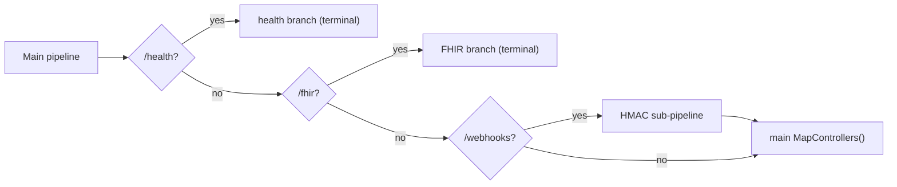
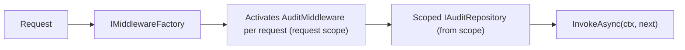
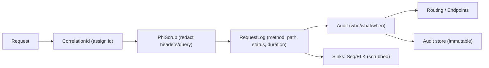
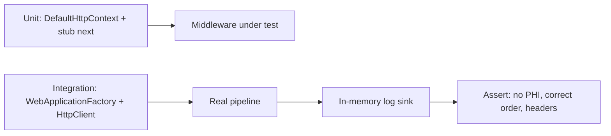
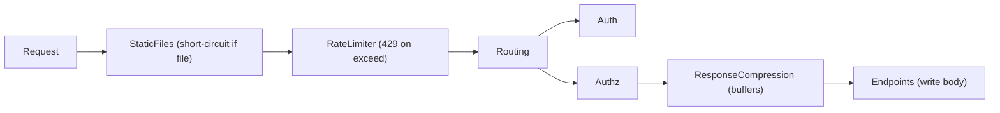
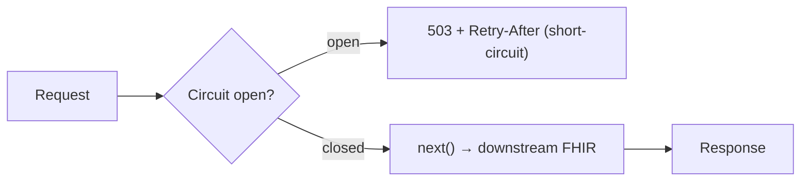

# Chapter 10: Middleware

> **Audience:** Experienced .NET developers (5+ years) preparing for an L2 (Mid/Senior) interview at a Healthcare company.
> **Scope:** The full middleware story — anatomy, ordering, branching, terminal middleware, the `IMiddleware` factory pattern, dependency injection, testing, third-party middleware, and performance — built on the request-pipeline overview from Chapter 9, with healthcare examples (PHI scrubbing, audit, tenant resolution, rate limiting, correlation).

---

## 10.1 Middleware Anatomy and Execution Model

### Interview Answer (30–45 seconds)

> "Middleware is any class or lambda that participates in processing an HTTP request — each component is a `Func<HttpContext, Task>` that either calls the next delegate or short-circuits. The framework composes them in registration order into a chain, like Russian dolls. The two phases matter: code before `await next()` runs on the request in, and code after runs on the response out. Every ASP.NET Core app is just a pipeline of middleware — even endpoints are terminal middleware. In a healthcare API, I place exception handling and correlation middleware first, audit in the middle, and routing/endpoints last."

### Detailed Explanation

**Core delegate types:**

- `RequestDelegate` — `Func<HttpContext, Task>`; the fundamental request handler.
- `RequestDelegate next` — the remainder of the pipeline.
- `app.Use(...)` — adds a middleware component.
- `app.Run(...)` — adds a **terminal** middleware (never calls `next`).
- `app.Map/MapWhen/UseWhen` — branch the pipeline.

**The three middleware creation styles:**

1. **Conventional class** — public constructor taking `RequestDelegate`, plus `InvokeAsync(HttpContext, RequestDelegate)` (or `Invoke`). Dependencies in the constructor are resolved at app startup (long-lived); per-request services go in the method signature.
2. **Factory-based** — implement `IMiddleware` (single `InvokeAsync(HttpContext, RequestDelegate)`) and register with `AddMiddleware<MyMiddleware>()`. Enabled because the middleware itself can then have *scoped* dependencies in the constructor.
3. **Inline lambda** — `app.Use(async (context, next) => { ...; await next(); })` — for short, app-specific glue.

**Execution phases:**

```csharp
app.Use(async (context, next) =>
{
    // REQUEST phase — runs on the way in
    var sw = Stopwatch.StartNew();
    context.Items["startedAt"] = sw;

    await next(context);   // <-- hand off to the rest of the pipeline

    // RESPONSE phase — runs on the way out
    context.Response.Headers["X-Duration-ms"] = sw.ElapsedMilliseconds.ToString();
});
```

### Real World Example (Healthcare)

A **request-time + tenant stamping** middleware: on the way in it resolves the clinical tenant from the `X-Tenant` header (validated against an allowlist), stores it in `HttpContext.Items`, and on the way out stamps the tenant ID and duration on the response. Every downstream component reads the tenant from `Items` — no repeated header parsing.

### Production Code Example

```csharp
public sealed class TenantResolutionMiddleware
{
    private readonly RequestDelegate _next;

    public TenantResolutionMiddleware(RequestDelegate next) => _next = next;

    public async Task InvokeAsync(HttpContext context, ITenantCatalog tenants)
    {
        var header = context.Request.Headers["X-Tenant"].FirstOrDefault();
        if (!string.IsNullOrWhiteSpace(header) && await tenants.IsKnownAsync(header))
        {
            context.Items[TenantContext.TenantKey] = header;   // request-scoped state
        }
        else
        {
            context.Response.StatusCode = StatusCodes.Status400BadRequest;
            await context.Response.WriteAsJsonAsync(new { error = "Unknown tenant." });
            return;                                            // short-circuit
        }

        await _next(context);
    }
}
```

**Key lines explained:**

- `ITenantCatalog` is injected via `InvokeAsync` — resolved per request (scoped), not from the singleton constructor.
- Short-circuiting on an invalid tenant keeps unknown tenants out of the clinical pipeline entirely.
- `HttpContext.Items` is the idiomatic request-scoped dictionary for middleware hand-offs.

### Internal Working

- `WebApplicationBuilder`/`IApplicationBuilder` collects middleware in a list.
- At build, the framework folds the list into a single `RequestDelegate` by wrapping each component's `next` with the remainder — last registered becomes the innermost (closest to the endpoint).
- The app stores this as `IApplicationBuilder.Build()`; `app.Run()` invokes the outermost delegate per request.
- Middleware is instantiated once (conventional) or per request (factory/`IMiddleware`), so constructor-injected singletons are safe but scoped deps in constructors are not (that's the factory pattern's job).

### Advantages

- Cross-cutting behavior in one ordered place.
- Independent, testable components.
- Zero framework magic — a chain of plain delegates.

### Disadvantages

- Order mistakes are runtime-only (no compiler safety).
- Hard to reason about once you have dozens of components.
- Middleware runs for *every* matching request — misuse can cost latency.

### Best Practices

- Keep components single-purpose and small.
- Name extension methods (`app.UseTenantResolution()`).
- Resolve per-request services from the method signature, not the constructor.
- Prefer `InvokeAsync` (not `Invoke`) for async work.

### Common Mistakes

- Injecting a scoped service into a conventional middleware's constructor (throws at startup with `ValidateScopes`).
- Forgetting `await next(context)` → silent empty responses.
- Doing heavy blocking work (file I/O, sync crypto) inside middleware.

### Interview Follow-up Questions

1. What's the difference between `Use`, `Run`, and `Map`?
2. When does a conventional middleware's constructor run vs its `InvokeAsync`?
3. Why can't a scoped service go into a conventional middleware constructor?

### Senior Level Talking Points

- "I treat middleware like a transaction: the request phase acquires context (tenant, correlation, principal), the response phase completes observability and, if needed, commits audit."
- "Middleware is the right home for *policy*; controllers and handlers stay thin because policy never varies per endpoint."

### Diagram


### Comparison Table

| Component | Calls next? | Typical use |
|---|---|---|
| `app.Use(...)` | Optional | Cross-cutting logic |
| `app.Run(...)` | Never (terminal) | Terminal endpoint, 404 handler |
| `app.Map(...)` | Branches | Path-based sub-pipelines |
| `IMiddleware` | Optional | Middleware needing scoped deps |

### Memory Trick

**"In-out, onion-style"** — the request phase unwraps layers going in; the response phase re-wraps them coming out.

### Summary

Middleware is a chain of `RequestDelegate`s executing in registration order with an in/out two-phase model. Short-circuiting, dependency injection rules, and the three creation styles are the core knowledge.

### Interview Confidence Score

**High.** Anatomy questions ("what is middleware, how does it execute") are near-guaranteed after the ASP.NET Core chapter.

---

## 10.2 Middleware Ordering — The Canonical Pipeline

### Interview Answer (30–45 seconds)

> "Order is the contract of the pipeline. Exception handling must be outermost so it catches everything; HTTPS/static files come early; routing matches the endpoint; authentication establishes identity; authorization enforces policy; and endpoint middleware is terminal. A concrete trap: `UseAuthorization` before `UseAuthentication` makes every request fail with `401`, and authorization before routing means the policy can't see the endpoint's metadata. In a healthcare API, my audit and correlation middleware sit after static/HTTPS but before routing so even bad requests are traced, and a security-critical middleware like 'scrub PHI from logs' must come before any logging component."

### Detailed Explanation

**Canonical order for an API:**

1. `UseExceptionHandler` / `UseDeveloperExceptionPage` (outermost — catches everything below).
2. `UseHsts` / `UseHttpsRedirection` (security scheme).
3. `UseForwardedHeaders` (proxy trust).
4. `UseStaticFiles` (only if serving a front-end).
5. **App-specific cross-cutting:** correlation, audit, PHI scrubbing, tenant resolution.
6. `UseRouting` — matches request to an endpoint (`context.GetEndpoint()`).
7. `UseAuthentication` — sets `context.User` from the token/cookie.
8. `UseAuthorization` — evaluates endpoint policies.
9. `UseEndpoints`/`MapControllers`/`MapGet` — terminal; executes the handler.

**Why this order specifically:**

- Exceptions first: an exception thrown anywhere downstream is caught and turned into a response; nothing after it needs to know about exceptions.
- Authentication before authorization: authorization is meaningless without an identity.
- Routing before both: authorization needs the matched endpoint's `[Authorize]` metadata; authentication doesn't strictly need it, but running both after routing is conventional.
- `UseStaticFiles` before routing: static files short-circuit without endpoint matching overhead.

**Ordering mistakes and their symptoms:**

| Mistake | Symptom |
|---|---|
| Authorization before Authentication | Every secured route returns 401 even with a valid token |
| Endpoints before UseRouting/UseAuthorization | `context.User` null, policies never evaluated |
| Static files after routing | Routing overhead on static assets |
| Exception handler added last | Unhandled exceptions become raw 500s, stack traces leak |

### Real World Example (Healthcare)

A FHIR API where an **audit middleware** must log every interaction, including ones that fail authentication. If audit is placed after `UseAuthentication`, failed-token requests short-circuit before audit ever runs — a compliance gap. Placing audit before routing (and before authentication) guarantees full coverage of the audit trail, which HIPAA-style review expects.

### Production Code Example

```csharp
var app = builder.Build();

if (app.Environment.IsDevelopment())
{
    app.UseDeveloperExceptionPage();           // 1. exceptions (dev)
}
else
{
    app.UseExceptionHandler("/error");          // 1. exceptions (prod)
    app.UseHsts();                              // 2. security
}

app.UseForwardedHeaders();                      // 3. proxy trust
app.UseMiddleware<CorrelationIdMiddleware>();   // 5. cross-cutting
app.UseMiddleware<AuditMiddleware>();           // 5. cross-cutting (before auth!)
app.UseMiddleware<PhiScrubMiddleware>();        // 5. log safety
app.UseRouting();                               // 6. routing
app.UseAuthentication();                        // 7. identity
app.UseAuthorization();                         // 8. policy
app.MapControllers();                           // 9. terminal
app.MapHealthChecks("/health");
```

**Key lines explained:**

- `PhiScrubMiddleware` sits before any logging so request bodies/headers that reach loggers are already redacted.
- Audit before authentication guarantees 100% coverage of failed-auth attempts.
- The ordering is visible in one file — reviewable, and testable (see 10.6).

### Internal Working

- `UseRouting` sets `context.SetEndpoint(...)` after matching; `UseAuthorization` reads that endpoint's `IAuthorizeData` metadata.
- Middleware before routing has no endpoint context — it must rely on `context.Request.Path`.
- Authentication middleware's `HandleAuthenticateAsync` sets `context.User` and may short-circuit with a challenge/forbid.
- Terminal middleware (the endpoint) is the last node; after it, the response unwinds through all the response phases.

### Advantages

- Deterministic, reviewable policy flow.
- Failures happen in a predictable layer (exception handler outermost).
- Security-relevant middleware can be ordered to cover auth failures too.

### Disadvantages

- No compile-time enforcement — requires tests to lock order.
- Some components (auth) are order-sensitive in ways that aren't obvious.
- Adding a middleware late usually means re-reviewing the whole order.

### Best Practices

- Maintain a documented, commented pipeline order in `Program.cs`.
- Write an integration test asserting relative order (see 10.6).
- Put order-agnostic, cheap middleware early; expensive, selective middleware later.
- Keep `UseRouting`→`UseAuthentication`→`UseAuthorization` as an inseparable triad.

### Common Mistakes

- `UseAuthorization()` before `UseAuthentication()` — the single most common auth bug.
- Adding `UseExceptionHandler` after endpoints (it must be outermost).
- Letting `UseStaticFiles` run after routing for SPA apps.
- Placing audit after auth → silent audit gaps.

### Interview Follow-up Questions

1. What breaks if authorization runs before routing?
2. Why must the exception handler be first?
3. How do you make pipeline order testable?

### Senior Level Talking Points

- "Pipeline order is a security control, so I treat the composition root like a firewall rule set — documented, reviewed, and covered by an integration test that fails on reorder."
- "Audit must observe attempts, not just successes; that's why it runs before authentication."

### Diagram


### Comparison Table

| Position | Middleware | Rationale |
|---|---|---|
| 1 | Exception handler | Catch all downstream errors |
| 2–4 | HSTS/HTTPS/Proxy | Security posture |
| 5 | Cross-cutting app policy | Coverage incl. failed auth |
| 6–8 | Routing→Auth→AuthZ | Identity + policy on endpoint |
| 9 | Endpoints | Terminal execution |

### Memory Trick

**"E.H.F.C.R.A.A.E"** = **E**xceptions, **H**TTPS, **F**orwarded, **C**ross-cutting, **R**outing, **A**uthentication, **A**uthorization, **E**ndpoints.

### Summary

Ordering is the middleware contract. The canonical order (exceptions → security → cross-cutting → routing → auth → authz → endpoints) and the failure modes of reordering are exactly what interviewers probe.

### Interview Confidence Score

**High.** This is the most important middleware interview topic; a confident, consequence-driven ordering answer with the auth-before-authz trap is a strong senior signal.

---

## 10.3 Branching the Pipeline: Map, MapWhen, and UseWhen

### Interview Answer (30–45 seconds)

> "Not every request should run the same pipeline. `app.Map(path, ...)` creates an independent sub-pipeline for requests whose path matches a prefix — that branch is terminal and never returns to the main pipeline. `app.MapWhen(predicate, ...)` branches on a predicate (method, header, query). `app.UseWhen(predicate, ...)` is different: it runs a sub-pipeline and then *continues* back into the main pipeline. I use `Map` for `/health` (a tiny, self-contained branch), `MapWhen` for a `/api/v1/fhir` region that needs stricter middleware, and `UseWhen` to add a middleware only for specific paths without terminating."

### Detailed Explanation

**`Map(path)` — hard branch, terminal:**
- Matches by path prefix (`/api` matches `/api/patients`).
- The matched branch runs *instead of* the rest of the main pipeline; it's terminal.
- Great for isolated sub-apps (health checks, versioned API roots).

**`MapWhen(predicate, app => ...)` — predicate branch, terminal:**
- Branch based on method, header, query string, etc.
- Also terminal — execution doesn't return to the main pipeline.

**`UseWhen(predicate, app => ...)` — predicate sub-pipeline, re-joins:**
- Runs the sub-pipeline, then **returns** to the main pipeline.
- Ideal for conditionally applying middleware (e.g., PHI scrub only for `/api`).

**Subtlety:** `Map` and `MapWhen` strip the matched path segment (via `PathString.StartsWithSegments`), which can surprise middleware that reads `context.Request.Path`. `UseWhen` does **not** strip the path.

### Real World Example (Healthcare)

A healthcare gateway that serves:
- `/health` and `/metrics` → a minimal `Map` branch (no auth, no audit).
- `/fhir` → `MapWhen` branch with FHIR-specific middleware (SMART-on-FHIR token validation, resource-level audit).
- `/webhooks` → main pipeline with HMAC signature validation via `UseWhen`, then continuing into the normal pipeline.

### Production Code Example

```csharp
app.Map("/health", healthApp =>            // terminal sub-pipeline
{
    healthApp.Run(async ctx => await ctx.Response.WriteAsync("ok"));
});

app.MapWhen(ctx => ctx.Request.Path.StartsWithSegments("/fhir"),
    fhirApp =>
    {
        fhirApp.UseMiddleware<FhirAuditMiddleware>();     // FHIR-specific
        fhirApp.UseRouting();
        fhirApp.UseAuthentication();
        fhirApp.UseAuthorization();
        fhirApp.MapControllers();
    });

app.UseWhen(ctx => ctx.Request.Path.StartsWithSegments("/webhooks"),
    whApp => whApp.UseMiddleware<HmacSignatureMiddleware>());   // re-joins

app.MapControllers();   // main pipeline continues for everything else
```

**Key lines explained:**

- The `/health` branch is fully isolated — no auth or audit overhead on probes.
- The `/fhir` branch is terminal: requests starting `/fhir` never reach the main `MapControllers()`.
- `UseWhen` on `/webhooks` adds HMAC validation *then returns* to the main pipeline for handling.

### Internal Working

- `Map`/`MapWhen` create a new `IApplicationBuilder` with the branch's own middleware list; when matched, the framework invokes that branch's built `RequestDelegate` and returns.
- `UseWhen` builds a sub-pipeline but the main builder stores it as a middleware component whose `next` is the *rest of the main pipeline*.
- Path-based matching uses `StartsWithSegments` which handles the boundary correctly (`/api` doesn't match `/apiary`).

### Advantages

- Isolate expensive/specialized middleware to the requests that need it.
- Clean segmentation: health, API, webhooks, SPA.
- Performance: unrelated branches don't pay each other's middleware cost.

### Disadvantages

- Terminal branches are easy to misunderstand (no return to main pipeline).
- Path-stripping surprises with `Map`/`MapWhen`.
- Too many branches make the pipeline hard to trace.

### Best Practices

- Use `Map` for genuinely independent surfaces (`/health`, `/metrics`).
- Use `UseWhen` for conditional *additive* middleware.
- Prefer explicit predicates over fragile path strings when possible.
- Document which branch is terminal.

### Common Mistakes

- Expecting a `Map` branch to fall through to the main pipeline afterward.
- Reading `context.Request.Path` inside a `Map` branch after the prefix was stripped.
- Using `UseWhen` where `MapWhen` was meant (or vice versa).

### Interview Follow-up Questions

1. What's the key behavioral difference between `MapWhen` and `UseWhen`?
2. When would you choose branching over a single pipeline with an `if`?
3. How does path-stripping affect middleware inside a `Map` branch?

### Senior Level Talking Points

- "Branching is how I keep one process honest: health probes pay almost no middleware cost, FHIR pays the full clinical stack, webhooks pay signature validation then flow on."
- "Terminal branches and `UseWhen` are documented in the composition root because their semantics differ subtly."

### Diagram



### Comparison Table

| API | Terminal? | Strips path? | Re-joins? |
|---|---|---|---|
| `Map(path)` | Yes | Yes | No |
| `MapWhen(pred)` | Yes | Yes | No |
| `UseWhen(pred)` | No | No | Yes |

### Memory Trick

**"Map cuts, When conditions"** — `Map` *terminates* into a branch; `When` *conditions* whether to apply (and with `UseWhen`, return).

### Summary

`Map`/`MapWhen` create terminal branches; `UseWhen` conditionally runs a sub-pipeline that rejoins the main flow. Know the terminal-vs-rejoin and path-stripping differences.

### Interview Confidence Score

**Medium.** Branching is a favorite trick question — nail the `MapWhen` vs `UseWhen` distinction and path-stripping behavior.

---

## 10.4 The IMiddleware Factory Pattern and DI in Middleware

### Interview Answer (30–45 seconds)

> "Conventional middleware resolves per-request services from the `InvokeAsync` signature, because the constructor runs once and can only hold singletons. When a middleware genuinely needs a *scoped* dependency in its constructor — or wants a clean, injectable class — I implement `IMiddleware` and register it with `AddMiddleware<MyMiddleware>()`. The container then instantiates it per request through `IMiddlewareFactory`, so scoped services work naturally. I use this for middleware that needs a `DbContext`, a scoped tenant resolver, or heavy configuration to be injectable and unit-testable."

### Detailed Explanation

**The problem with conventional middleware:**
- Constructor dependencies are resolved at app startup (when the middleware is instantiated once).
- Injecting a scoped service (`DbContext`, scoped tenant store) into the constructor throws with `ValidateScopes` enabled — a captive dependency.
- Workaround: inject `IServiceScopeFactory` or declare the scoped service as a parameter of `InvokeAsync` (per-request resolution).

**The `IMiddleware` pattern:**

```csharp
public interface IMiddleware
{
    Task InvokeAsync(HttpContext context, RequestDelegate next);
}
```

- Implement the interface; the class becomes a normal DI-registered service.
- Register via `builder.Services.AddMiddleware<MyMiddleware>()` (resolves through `IMiddlewareFactory` per request).
- Scoped dependencies inject cleanly into the constructor.
- The framework's `MiddlewareFactory` activates the type via the container per request.

**Comparison:**

| Aspect | Conventional class | IMiddleware factory |
|---|---|---|
| Instantiation | Once at startup | Per request (scoped) |
| Constructor deps | Singletons only | Scoped allowed |
| Activation | `ActivatorUtilities` | DI container + factory |
| Per-request services | `InvokeAsync` parameters | Constructor |
| Overhead | Minimal | Tiny per-request activation |

### Real World Example (Healthcare)

An **audit middleware** that must write to the audit log via a scoped `IAuditRepository` (backed by a `DbContext`). With the conventional pattern you'd inject the repository into `InvokeAsync`; with `IMiddleware` you get it in the constructor — both valid, the factory style reads cleaner and keeps the class fully DI-friendly.

### Production Code Example

```csharp
public sealed class AuditMiddleware : IMiddleware
{
    private readonly IAuditRepository _audit;      // scoped — works because per-request activation
    private readonly ILogger<AuditMiddleware> _logger;

    public AuditMiddleware(IAuditRepository audit, ILogger<AuditMiddleware> logger)
    {
        _audit = audit;
        _logger = logger;
    }

    public async Task InvokeAsync(HttpContext context, RequestDelegate next)
    {
        var sw = Stopwatch.StartNew();
        try
        {
            await next(context);
        }
        finally
        {
            sw.Stop();
            await _audit.RecordAsync(new AuditEvent(
                context.Request.Method,
                context.Request.Path,
                context.Response.StatusCode,
                sw.ElapsedMilliseconds),
                context.RequestAborted);
        }
    }
}

// Registration
builder.Services.AddScoped<IAuditRepository, SqlAuditRepository>();
builder.Services.AddMiddleware<AuditMiddleware>();
var app = builder.Build();
app.UseMiddleware<AuditMiddleware>();
```

**Key lines explained:**

- `IAuditRepository` is scoped; the factory activates `AuditMiddleware` within the request scope so the constructor injection is valid.
- Same registration flows into unit tests: `new AuditMiddleware(fakeRepo, NullLogger)`.
- `UseMiddleware<AuditMiddleware>()` now resolves from the container (factory path) instead of `ActivatorUtilities`.

### Internal Working

- `MiddlewareFilter`/`UseMiddlewareExtensions` detect the `IMiddleware` interface at build time and route activation through the registered `IMiddlewareFactory`.
- Default `ActivatorUtilitiesMiddlewareFactory` pulls the type from `IServiceProvider` (which is the request scope during request handling).
- Because activation is per request, the middleware gets a fresh scoped dependency graph each time.

### Advantages

- Scoped dependencies in constructors — clean and idiomatic.
- The class is a first-class DI citizen (easy unit tests with fakes).
- Removes the awkward `InvokeAsync` parameter-injection convention.

### Disadvantages

- Slightly more allocation per request (per-request activation).
- Requires remembering to register via `AddMiddleware` *and* `UseMiddleware`.
- Some teams find the conventional style more familiar.

### Best Practices

- Use `IMiddleware` when the middleware needs scoped constructor dependencies.
- Prefer conventional + `InvokeAsync` params for simple, singleton-only middleware (less overhead).
- Always register the implementation in DI, or `UseMiddleware` will fail at startup.

### Common Mistakes

- Forgetting `AddMiddleware<MyMiddleware>()` → `Unable to resolve service` at startup.
- Mixing styles: putting scoped services into a conventional constructor anyway.
- Using `UseMiddleware<T>()` with a concrete T not registered in DI.

### Interview Follow-up Questions

1. When is the conventional constructor resolved?
2. Why does a scoped service fail in a conventional middleware constructor?
3. What does `IMiddlewareFactory` do?

### Senior Level Talking Points

- "DI in middleware is about matching lifetime to lifecycle: singletons for pipeline-wide services, per-request activation (`IMiddleware`) whenever the middleware touches the request scope."
- "I standardize on `IMiddleware` for anything that writes to storage — it keeps the class trivially unit-testable."

### Diagram



### Comparison Table

| Concern | Conventional | IMiddleware |
|---|---|---|
| Scoped ctor deps | No | Yes |
| Per-request cost | Low | Small activation |
| Unit testing | Pass fakes to InvokeAsync params | Construct with fakes |
| Startup failure modes | Captive-dependency errors | Missing registration |

### Memory Trick

**"Ctor once for singletons, factory per request for scoped"** — the lifetime rule of middleware DI.

### Summary

Conventional middleware holds singletons and receives per-request services as `InvokeAsync` parameters; `IMiddleware` factory middleware is activated per request so scoped constructor dependencies work. Choose by lifetime need.

### Interview Confidence Score

**Medium.** The DI-in-middleware question separates juniors from seniors; explain the captive-dependency issue and the factory remedy.

---

## 10.5 Middleware for Logging, PHI Scrubbing, and Audit

### Interview Answer (30–45 seconds)

> "Three middleware components are non-negotiable in a healthcare ASP.NET Core service. Correlation middleware assigns one ID to a request and every log line it produces. Request-logging middleware emits a single structured line per request with method, path, status, and duration. And a PHI-scrubbing middleware sanitizes anything sensitive — Authorization headers, patient identifiers in query strings, full payloads — before it ever reaches a logger or audit store. Together they give full traceability without leaking protected data, which is the essence of HIPAA-style operational logging."

### Detailed Explanation

**Correlation middleware:**
- Accepts or generates `X-Correlation-Id` (also set as `TraceIdentifier`).
- Enriches every downstream log via `BeginScope` or Serilog's `WithCorrelationId()`.
- Lets ops correlate one user action across API, DB, and background workers.

**Request-logging middleware:**
- Wraps `next()`; logs on the way out: method, path, status, duration, correlation ID.
- Serilog's `UseSerilogRequestLogging()` does this with enrichment.
- Should log *metadata*, never the body (body logging is opt-in and dangerous with PHI).

**PHI-scrubbing middleware:**
- Runs **before** any logging/audit component.
- Redacts: `Authorization` header, cookies, patient identifiers in URLs, sensitive query strings.
- Ensures even exception messages reaching logs don't carry PHI (paired with an exception handler that also strips details).

**Audit middleware (see 10.4):**
- Records who did what, when, from where — the clinical audit trail.

### Real World Example (Healthcare)

A FHIR `Patient` search: correlation middleware tags the request `7f3a`, the request-logging middleware records `GET /fhir/Patient?birthdate=...` with duration 212ms and status 200, PHI-scrub ensures the query string and any `Authorization` value are redacted in that log, and the audit middleware writes a separate audit event with the *minimal* identifier needed (patient MRN hash, tenant, action) to the audit store.

### Production Code Example

```csharp
// Serilog correlation enrichment
builder.Host.UseSerilog((ctx, cfg) => cfg
    .Enrich.WithCorrelationId()
    .ReadFrom.Configuration(ctx.Configuration));

var app = builder.Build();

app.UseMiddleware<CorrelationIdMiddleware>();      // must precede request logging
app.UseMiddleware<PhiScrubbingMiddleware>();       // sanitize before any sink
app.UseSerilogRequestLogging();                    // one line per request
app.UseMiddleware<AuditMiddleware>();              // audit trail

// elsewhere, in a handler:
_logger.LogInformation("Search patients by {CriteriaCount} criteria, took {Ms}ms",
                       criteriaCount, ms);          // structured, PHI-free
```

**Key lines explained:**

- `PhiScrubbingMiddleware` is placed before `UseSerilogRequestLogging` so the request log never sees raw headers.
- Correlation enrichment is at the host level; the middleware sets the actual header value.
- Audit is a separate store from logs — logs are searchable telemetry, audit is an immutable trail.

### Internal Working

- Correlation: sets `HttpContext.TraceIdentifier` (used by Serilog enrichment) and a response header.
- Scrubbing: copies/modifies `context.Request.Headers` and `context.Response.Headers` for downstream read; actual sinks are what matter, so scrub must precede them.
- Request logging: `next()` then reads `context.Response.StatusCode` and writes the structured event.

### Advantages

- One mechanism covers traceability, observability, and compliance.
- Scrubbing centralizes a policy that would otherwise scatter across log calls.
- Structured request logs dramatically reduce debugging time.

### Disadvantages

- Scrubbing is easy to bypass if placed late or if logs are written by code running before it.
- Logging middleware adds a small per-request cost.
- Correlation headers from clients must be validated (length, charset) to avoid log injection.

### Best Practices

- Order: correlation → scrub → request-log → audit.
- Redact before any sink; validate incoming correlation IDs (no newlines, bounded length).
- Never log request/response bodies by default.
- Log structured fields, not interpolated strings.

### Common Mistakes

- Placing scrub after request logging (defeats the purpose).
- Logging full request bodies "for debugging" → PHI in logs.
- Accepting arbitrary user-supplied correlation IDs unvalidated (log injection / spoofing).

### Interview Follow-up Questions

1. Why must scrubbing come before request logging?
2. How do you prevent log injection via a correlation header?
3. What's the difference between audit logs and application logs?

### Senior Level Talking Points

- "Logs and audit trails are different artifacts: logs are high-volume telemetry (searchable, short-lived), audit is low-volume immutable evidence (retained per policy). Middleware enforces both at the boundary."
- "The scrub middleware is the enforcement point for our 'no PHI in logs' rule — code review and a log-content test back it up."

### Diagram



### Comparison Table

| Middleware | Records | Retains? | Contains PHI? |
|---|---|---|---|
| Request logging | method/path/status/duration | Short | No (scrubbed) |
| Audit | actor, action, tenant, time | Long (policy) | Minimal identifier only |
| Correlation | request id | n/a (enrichment) | No |

### Memory Trick

**"Correlate, Scrub, Log, Audit"** — the four-step observable request lifecycle.

### Summary

Correlation, PHI-scrubbing, request logging, and audit middleware deliver traceability without leaking protected data. Order (scrub before log) and structured fields are the correctness details.

### Interview Confidence Score

**High** for healthcare interviews. This trio — correlation, scrub, audit — is exactly what a clinical platform needs and a great place to show domain awareness.

---

## 10.6 Testing Middleware

### Interview Answer (30–45 seconds)

> "I unit-test middleware with a `DefaultHttpContext` and a stub `next` delegate — that validates in/out behavior, short-circuiting, and header manipulation in isolation. Then I add integration tests with `WebApplicationFactory` that hit a real pipeline endpoint and assert the ordering invariants: the exception handler returns problem details, audit ran even on 401s, and the correlation header is always present. For a healthcare API I also keep a 'no PHI in logs' test that feeds a request with a sensitive header through the pipeline and asserts the captured log stream never contains it."

### Detailed Explanation

**Unit testing a conventional middleware:**

```csharp
var context = new DefaultHttpContext();
context.Request.Method = "GET";
context.Request.Path = "/fhir/Patient";

var response = "";
var next = new RequestDelegate(ctx => Task.CompletedTask);

var middleware = new CorrelationIdMiddleware(next);
await middleware.InvokeAsync(context);

Assert.Equal(36, context.Response.Headers["X-Correlation-Id"].Count);
```

- `DefaultHttpContext` gives an in-memory `HttpContext` with `Request`/`Response` collections.
- The `next` delegate is a stub — assert it was or wasn't called to test short-circuiting.
- Per-request dependencies (`InvokeAsync` params) are passed explicitly.

**Testing short-circuiting:**

```csharp
var context = new DefaultHttpContext();
var calledNext = false;
RequestDelegate next = ctx => { calledNext = true; return Task.CompletedTask; };

var mw = new TenantResolutionMiddleware(next, fakeCatalog);
await mw.InvokeAsync(context);   // fakeCatalog says tenant unknown

Assert.False(calledNext);                       // short-circuited
Assert.Equal(400, context.Response.StatusCode);
```

**Integration tests with `WebApplicationFactory`:**
- Spin up the real `Program` (or a test `WebApplication`), send requests via `HttpClient`, assert headers/status/ordering side-effects.
- Override services (`ConfigureTestServices`/`ConfigureServices`) to swap storage.

**Ordering assertion technique:** register a marker middleware that records its position in a shared list, then assert the recorded order equals the expected one.

### Real World Example (Healthcare)

The "no-PHI-in-logs" regression test: configure the test pipeline with Serilog writing to an in-memory sink, send `GET /fhir/Patient` with an `Authorization: Bearer <real-looking-token>`, then assert the sink's captured events contain no `Bearer` token and no `SSN=`-style query values. Any future middleware ordering change that exposes PHI fails CI.

### Production Code Example

```csharp
// In-memory log sink
public sealed class MemorySink : ILogEventSink
{
    public List<string> Rendered { get; } = new();
    public void Emit(LogEvent e) => Rendered.Add(e.RenderMessage());
}

[Fact]
public async Task Phi_scrub_removes_bearer_token_from_logs()
{
    var sink = new MemorySink();
    await using var app = new TestPipelineFactory(sink);  // helper WebApplicationFactory

    var client = app.CreateClient();
    client.DefaultRequestHeaders.Authorization =
        new AuthenticationHeaderValue("Bearer", "super-secret-token");

    await client.GetAsync("/fhir/Patient");

    Assert.DoesNotContain("super-secret-token", sink.Rendered);
    Assert.Contains("X-Correlation-Id", app.ResponseHeadersSeen);
}
```

**Key lines explained:**

- The test drives the real pipeline through `WebApplicationFactory`.
- `MemorySink` captures what would actually be logged — the enforcement target.
- Asserting the token never appears catches ordering regressions.

### Internal Working

- `WebApplicationFactory<Program>` reuses the app's DI and pipeline, exposing `CreateClient()`; `ConfigureServices` allows targeted overrides before the host builds.
- `DefaultHttpContext` exercises middleware without a server — fast, deterministic unit tests.
- Middleware under test receives `next` as an explicitly constructed delegate, so no container is needed.

### Advantages

- Middleware is the most easily testable layer (pure `HttpContext` in/out).
- Ordering regressions get caught in CI, not production.
- Compliance rules (no PHI in logs) become executable tests.

### Disadvantages

- Full `WebApplicationFactory` tests are slower and heavier.
- Realistic `HttpContext` details (streams, `RequestAborted`) need care.
- Over-testing implementation details makes tests brittle.

### Best Practices

- Unit-test each middleware with `DefaultHttpContext` + stub `next`.
- Test both branches: normal flow and short-circuit.
- One integration test per ordering invariant.
- Prefer assertions on observable behavior (headers, status, captured logs) over internal state.

### Common Mistakes

- Testing via live HTTP when `DefaultHttpContext` suffices.
- Not testing the short-circuit path.
- Forgetting `RequestAborted`/cancellation behavior in long middleware.
- Asserting implementation details (e.g., "middleware was called") instead of effects.

### Interview Follow-up Questions

1. How do you test that middleware short-circuits?
2. What does `WebApplicationFactory` give you that unit tests don't?
3. How would you assert middleware ordering?

### Senior Level Talking Points

- "Middleware order is a security contract, so it's covered by integration tests that fail loudly on reorder — that's how ordering survives ten refactors."
- "The PHI-in-logs regression test is my favorite example of turning a compliance requirement into executable CI."

### Diagram



### Comparison Table

| Approach | Speed | Fidelity | Best for |
|---|---|---|---|
| `DefaultHttpContext` unit test | Fast | Low (isolated) | Component behavior |
| `WebApplicationFactory` | Slower | High (real pipeline) | Ordering, end-to-end policy |
| Live HTTP (local/test server) | Slowest | Full | Smoke tests |

### Memory Trick

**"Unit for logic, factory for order"** — unit-test component behavior; integration-test pipeline invariants.

### Summary

Middleware is highly testable: `DefaultHttpContext` for component unit tests, `WebApplicationFactory` for pipeline-ordering and compliance integration tests. Turn the "no PHI in logs" rule into a CI regression test.

### Interview Confidence Score

**Medium-High.** Testing strategy questions are common at L2+; middleware testing is the perfect concrete example.

---

## 10.7 Third-Party and Performance Considerations

### Interview Answer (30–45 seconds)

> "Beyond custom middleware, most ASP.NET Core apps compose built-in and third-party components: CORS, response compression, static files, health checks, rate limiting (built-in since .NET 7), OpenTelemetry instrumentation, and Swagger. On performance, the rules are: run cheap, high-hit-rate middleware early (static files, caching, rate limiting); run expensive, selective middleware late; short-circuit aggressively; and avoid sync-over-async. Every middleware has a cost per request, so I profile with request durations and keep the pipeline as lean as correctness allows."

### Detailed Explanation

**Common third-party/built-in middleware:**

| Middleware | Package | Purpose |
|---|---|---|
| CORS | `Microsoft.AspNetCore.Cors` | Cross-origin browser policy |
| Response Compression | `Microsoft.AspNetCore.ResponseCompression` | gzip/brotli payloads |
| Static Files | `Microsoft.AspNetCore.StaticFiles` | Serve `wwwroot` |
| Health Checks | `Microsoft.AspNetCore.Diagnostics.HealthChecks` | `/health` probes |
| Rate Limiting | `Microsoft.AspNetCore.RateLimiting` (built-in) | Sliding/fixed window |
| Swagger | `Swashbuckle.AspNetCore` / NSwag | OpenAPI docs + UI |
| OpenTelemetry | `OpenTelemetry.*` | Distributed tracing |
| Custom auth | `Microsoft.AspNetCore.Authentication.*` | Bearer/Cookie/External |

**Performance guidance:**
- Middleware that frequently short-circuits should be early (static files, caching).
- Middleware that must run for every request but is cheap (correlation) can be early too.
- Expensive middleware (compression of large payloads, heavy logging) should be selective (`UseWhen`) or late.
- Avoid `Task.Run`/sync-over-async in middleware; use `IHttpContextFactory` default.
- Response compression: enable only for compressible content types, and watch for double-compression with the proxy.

**Ordering for compression:** compression must run after static files and after any middleware that sets headers, but before the response body is written — practically, place it before endpoints so the buffered body can be compressed, and disable it if the proxy already compresses.

### Real World Example (Healthcare)

A FHIR bulk-export endpoint (`$export`) streams large patient bundles. Compression middleware is configured with `ExcludedMimeTypes` so JSON ndjson streams aren't double-compressed, and rate limiting is applied with `UseWhen` only on `/fhir` to protect the clinical search endpoint from abuse while `/health` stays free.

### Production Code Example

```csharp
builder.Services.AddResponseCompression(options =>
{
    options.EnableForHttps = true;
    options.MimeTypes = ResponseCompressionDefaults.MimeTypes.Concat(
        new[] { "application/fhir+json", "application/ndjson" });
});

builder.Services.AddRateLimiter(options =>
{
    options.RejectionStatusCode = StatusCodes.Status429TooManyRequests;
    options.AddPolicy("fhir", http => RateLimitPartition.GetFixedWindowLimiter(
        partitionKey: http.User.Identity?.Name ?? http.Connection.RemoteIpAddress?.ToString(),
        factory: _ => new FixedWindowRateLimiterOptions
        {
            PermitLimit = 100, Window = TimeSpan.FromMinutes(1)
        }));
});

var app = builder.Build();

app.UseStaticFiles();
app.UseRateLimiter();                    // before routing is fine (policy keys on endpoint)
app.UseRouting();
app.UseAuthentication();
app.UseAuthorization();
app.UseResponseCompression();            // before endpoints so body is buffered/compressed
app.MapControllers().RequireRateLimiting("fhir");
```

**Key lines explained:**

- Compression is registered as a service *and* added via `UseResponseCompression` before endpoints.
- Rate limiting keys on authenticated user or IP; fixed window of 100/min for FHIR.
- `RequireRateLimiting("fhir")` applies the policy only to mapped endpoints (minimal APIs use `.RequireRateLimiting(...)` too).

### Internal Working

- `ResponseCompressionMiddleware` wraps the response body stream; compression happens when the stream is flushed, so it must wrap *before* the endpoint writes.
- `RateLimiterMiddleware` evaluates the policy against the endpoint's metadata and either enqueues/rejects or allows the request; `429` on rejection.
- Compression is skipped for `Range` requests, `Content-Encoding` already set, and excluded MIME types.

### Advantages

- Battle-tested components instead of hand-rolled policy.
- Performance levers (compression, rate limiting, caching) are drop-in.
- Health checks and tracing make operations-grade observability easy.

### Disadvantages

- Every component adds configuration surface (CORS origins, compression types, rate-limit policies).
- Mis-ordered (e.g., compression after streaming) silently breaks behavior.
- Over-configuration slows startup and review.

### Best Practices

- Apply rate limiting and caching early; compression late but before endpoints.
- Exclude already-compressed and streaming MIME types from compression.
- Keep the pipeline as short as correctness allows.
- Profile per-request middleware cost before adding more.

### Common Mistakes

- Double compression (app + proxy both gzip).
- Rate limiting applied to `/health` → probes get throttled.
- Compression wrapping a streaming response → buffering defeats streaming.
- Stacking dozens of middleware without measuring.

### Interview Follow-up Questions

1. Where does response compression sit in the pipeline and why?
2. How does the built-in rate limiter decide to reject a request?
3. When would you *not* compress a response?

### Senior Level Talking Points

- "I measure before I add middleware: request-latency percentiles by pipeline position tell me where the cost actually is."
- "Rate limiting is policy, so it lives at the edge of the FHIR surface with a 429 contract clients are documented against."

### Diagram



### Comparison Table

| Middleware | Position | Cost | Short-circuits? |
|---|---|---|---|
| StaticFiles | Early | Low | Yes |
| RateLimiter | Early | Low | Yes (429) |
| CORS | Early | Low | No |
| Auth | After routing | Medium | On failure |
| Compression | Late, before endpoints | Medium (CPU) | No |
| HealthChecks | Terminal branch | Low | Yes (branch) |

### Memory Trick

**"Cheap and rejecting early, expensive and streaming late"** — where each middleware belongs in the pipeline.

### Summary

Compose battle-tested middleware (CORS, compression, rate limiting, health) deliberately: short-circuiting components early, compression before endpoints, and rate limiting off `/health`. Measure before adding more.

### Interview Confidence Score

**Medium-High.** "Which middleware would you add for X and where?" is a common scenario question — reasoning about position and cost is the differentiator.

---

## 10.8 Middleware Anti-Patterns and Advanced Scenarios

### Interview Answer (30–45 seconds)

> "The anti-patterns I watch for: doing blocking or async-void work inside middleware, swallowing exceptions so the exception handler never sees them, injecting scoped services into singleton middleware constructors, short-circuiting without writing a response, and building a 'god middleware' that does five things. Advanced patterns I do use: wrapping an entire pipeline with retry/circuit-breaker logic in a single middleware, using `UseWhen` to apply expensive middleware selectively, and implementing an endpoint that is itself middleware via `Map` for internal tools. The discipline is: one middleware, one job, and always flow to `next` unless you have a reason to stop."

### Detailed Explanation

**Anti-patterns to name in an interview:**

1. **Sync-over-async / blocking:** `.Result`/`.Wait()` in middleware → thread-pool starvation under load.
2. **Swallowed exceptions:** catching everything and returning `200` hides failures from the exception handler and monitoring.
3. **God middleware:** logging + auth + caching + audit in one class → untestable, unreadable.
4. **Captive scoped dependency** in a conventional constructor (see 10.4).
5. **Short-circuit without a response** → hanging clients / empty 200s.
6. **Modifying the response after it started:** once the body stream starts, you can't safely change status/headers.

**Advanced scenarios:**

- **Circuit-breaker / retry middleware:** a single middleware that wraps `next()` with Polly policy — app-wide resilience without touching handlers (paired with typed `HttpClient` policies).
- **Middleware-orchestrated transactions:** begin a DB transaction before `next()`, commit/rollback after — but keep it scoped to specific branches via `UseWhen`.
- **Middleware-as-endpoint:** implement a custom terminal middleware behind `Map` for internal diagnostics (e.g., a memory-dump or thread-count endpoint, gated by auth).
- **Streaming gate:** middleware that buffers or caps response size to protect against runaway payloads.

### Real World Example (Healthcare)

A **circuit-breaker middleware** protecting the FHIR integration endpoint: if the downstream FHIR server is failing, the middleware short-circuits with a `503` (and a `Retry-After` header) instead of letting every request time out downstream. Implemented via Polly policy injected into the middleware — no handler changes, and it applies uniformly.

### Production Code Example

```csharp
public sealed class CircuitBreakerMiddleware : IMiddleware
{
    private readonly AsyncCircuitBreakerPolicy<HttpResponseMessage> _policy;
    private readonly ILogger<CircuitBreakerMiddleware> _logger;

    public CircuitBreakerMiddleware(ILogger<CircuitBreakerMiddleware> logger)
    {
        _logger = logger;
        _policy = Policy
            .HandleResult<HttpResponseMessage>(r => (int)r.StatusCode >= 500)
            .CircuitBreakerAsync(
                exceptionsAllowedBeforeBreaking: 5,
                durationOfBreak: TimeSpan.FromSeconds(30));
    }

    public async Task InvokeAsync(HttpContext context, RequestDelegate next)
    {
        if (_policy.CircuitState == CircuitState.Open)
        {
            context.Response.StatusCode = StatusCodes.Status503ServiceUnavailable;
            context.Response.Headers["Retry-After"] = "30";
            return;                                  // short-circuit before calling next
        }
        await next(context);
    }
}
```

**Key lines explained:**

- The breaker state lives in the singleton middleware (app-wide, thread-safe via Polly).
- When open, every request short-circuits fast with `503` + `Retry-After` — protects the FHIR dependency.
- Because it's `IMiddleware`, it could inject a scoped metric writer if needed.

### Internal Working

- Polly's circuit breaker is thread-safe and transitions states (Closed → Open → Half-Open) based on failure counts and cooldown.
- Middleware runs per request; the singleton policy state persists across requests.
- Short-circuiting before `next()` avoids the expensive downstream path entirely while the circuit is open.

### Advantages

- App-wide resilience and policy without handler changes.
- Fast failure (circuit open) instead of slow timeouts.
- Single, testable place for cross-cutting policy.

### Disadvantages

- Middleware-level policy can't see per-endpoint nuance unless it checks the path/endpoint.
- Buffering or transaction middleware adds latency and memory.
- Over-abstraction risk: too much logic living in the pipeline.

### Best Practices

- One middleware, one concern.
- Never swallow exceptions — let the exception handler respond.
- Avoid sync-over-async; use `ValueTask`-aware, async-only paths.
- Check `context.Response.HasStarted` before writing/modifying.
- Keep advanced middleware gated (`UseWhen`) to affected surfaces.

### Common Mistakes

- Catching everything → 200s with hidden failures.
- Writing to the response after it has started → `InvalidOperationException`.
- Blocking with `.Result` under load → thread starvation.
- One middleware doing five jobs → impossible to test.

### Interview Follow-up Questions

1. How do you implement retry/circuit-breaking at the pipeline level?
2. What happens if you modify the response after it's started?
3. When would a middleware-based transaction be a bad idea?

### Senior Level Talking Points

- "Middleware is the right place for app-wide resilience because handlers shouldn't each implement a circuit breaker — that's exactly what we don't want to repeat."
- "The pipeline is my one-stop shop for policy: resilience at the edge, audit at the boundary, correlation everywhere, and strict discipline about one-concern-per-component."

### Diagram



### Comparison Table

| Anti-pattern | Consequence | Fix |
|---|---|---|
| Sync-over-async | Thread starvation | Pure async middleware |
| Swallowing exceptions | Hidden failures | Let exception handler respond |
| God middleware | Untestable | One concern per component |
| Captive scoped dep | Frozen/incorrect state | `IMiddleware` or `InvokeAsync` params |
| Late response writes | InvalidOperationException | Check `HasStarted` |

### Memory Trick

**"One job, always async, let exceptions flow"** — the middleware commandments.

### Summary

Avoid blocking, exception-swallowing, god-middleware, and late-write bugs; use advanced patterns (circuit breaker, gated transactions) deliberately and testably. Discipline beats cleverness in the pipeline.

### Interview Confidence Score

**Medium.** Anti-pattern and advanced-scenario questions appear in senior rounds; the circuit-breaker middleware example is a memorable, domain-appropriate answer.

---

## Chapter 10 Wrap-Up

### Top 10 Questions You Should Be Ready For

1. What is middleware and how does the pipeline execute?
2. What is the canonical middleware order, and why?
3. What breaks if authorization runs before authentication?
4. `Map`, `MapWhen`, `UseWhen` — what's the difference?
5. When do you use the `IMiddleware` factory pattern?
6. How do you inject scoped services into middleware?
7. How do you test middleware?
8. How do you prevent PHI from leaking into logs?
9. Where do compression and rate limiting sit in the pipeline?
10. Name three middleware anti-patterns and their fixes.

### Revision Notes (1 page)

- **Anatomy:** middleware = `RequestDelegate` chain; request phase before `await next()`, response phase after; `Use` (optional next), `Run` (terminal), `Map`/`MapWhen` (terminal branches), `UseWhen` (rejoining sub-pipeline).
- **Order:** exceptions → HSTS/HTTPS → forwarded headers → static files → cross-cutting (correlation, audit, PHI scrub) → routing → authentication → authorization → endpoints. The classic bug: `UseAuthorization` before `UseAuthentication`.
- **DI:** conventional middleware ctor = once (singletons only); per-request services via `InvokeAsync` params or the `IMiddleware`/`AddMiddleware` factory pattern for scoped ctor deps.
- **Branching:** `Map`/`MapWhen` strip the path segment and are terminal; `UseWhen` does not strip and returns to the main pipeline.
- **Observability:** correlation → scrub → request-log → audit ordering; redact before any sink; never log bodies; structured fields.
- **Testing:** `DefaultHttpContext` + stub `next` for units (test short-circuit too); `WebApplicationFactory` for ordering and "no PHI in logs" regression tests.
- **Components/performance:** static files and rate limiting early (short-circuit), compression before endpoints (buffer body), exclude streaming/compressed MIME types; measure before adding middleware.
- **Anti-patterns:** sync-over-async, swallowed exceptions, god middleware, captive scoped deps, response writes after `HasStarted`.

### Things Interviewers Expect From 5+ Years Experience

- Ordering explained with failure *consequences*, not a memorized list.
- A concrete healthcare middleware story (correlation, audit, PHI scrub).
- DI/lifetime reasoning specific to middleware.
- A testing strategy that includes ordering and compliance regression tests.
- Judgment on where third-party middleware goes and what it costs.

### Cheat Sheet

```
PIPELINE ORDER:
  Exceptions → HSTS/HTTPS → ForwardedHeaders → StaticFiles
  → Correlation/Audit/PHI-scrub → Routing → Authentication
  → Authorization → Endpoints
  TRAP: authz before auth = everything 401
  TRAP: exception handler not outermost = raw 500s

BRANCHING:
  Map(path)      → terminal branch, strips prefix
  MapWhen(pred)  → terminal branch, strips prefix
  UseWhen(pred)  → sub-pipeline then RETURN to main
  Remember: Map cuts, When conditions

DI IN MIDDLEWARE:
  Conventional ctor = once → singletons only
  Per-request deps  → InvokeAsync(.., scopedService) params
  Scoped ctor deps  → IMiddleware + AddMiddleware<T>()
  Register or UseMiddleware<T>() throws at startup

OBSERVABILITY ORDER: Correlate → Scrub → RequestLog → Audit
  scrub BEFORE any log sink; never log bodies/tokens

TESTING:
  Unit: DefaultHttpContext + stub next (+ short-circuit case)
  Integration: WebApplicationFactory → ordering + no-PHI regression

PERF: cheap+rejecting early, expensive+streaming late
  rate limit / static files early; compression before endpoints

NO-NO: sync-over-async, swallowed exceptions, god middleware,
  captive scoped dep, writes after HasStarted
```

### Flash Cards

**Q1:** `Run` vs `Use`? **A:** `Run` is terminal (no `next`); `Use` may call `next`.

**Q2:** Why authz before auth fails? **A:** No identity yet → every secured route 401.

**Q3:** `MapWhen` vs `UseWhen`? **A:** `MapWhen` is terminal; `UseWhen` returns to the main pipeline.

**Q4:** Scoped dep in conventional middleware ctor? **A:** Captive dependency — use `InvokeAsync` params or `IMiddleware`.

**Q5:** Why must the exception handler be first? **A:** So it can catch errors from everything downstream.

**Q6:** Where must PHI scrub sit? **A:** Before every log sink / request-log middleware.

**Q7:** How to unit-test short-circuiting? **A:** Stub `next` records whether it was called; assert false.

**Q8:** Compression position? **A:** Before endpoints, after static files; exclude already-compressed MIME types.

**Q9:** Rate limiting on `/health`? **A:** Don't — put it on the FHIR/API surface only.

**Q10:** Response already started — can I write headers? **A:** No — check `Response.HasStarted` first.

**Q11:** `IMiddleware` per-request activation benefit? **A:** Scoped constructor deps, clean DI, testability.

**Q12:** Circuit-breaker middleware role? **A:** App-wide fast-fail (503 + Retry-After) when downstream FHIR is down.

### Interview Confidence Score

**High.** Middleware is one of the most heavily tested ASP.NET Core topics and this chapter maps directly onto healthcare concerns (audit, PHI, tenant, rate limits). The combination of ordering mastery, the factory pattern, and a compliance-test story is a strong senior signal.

---

*Continue → Chapter 11: Authentication & Authorization*
