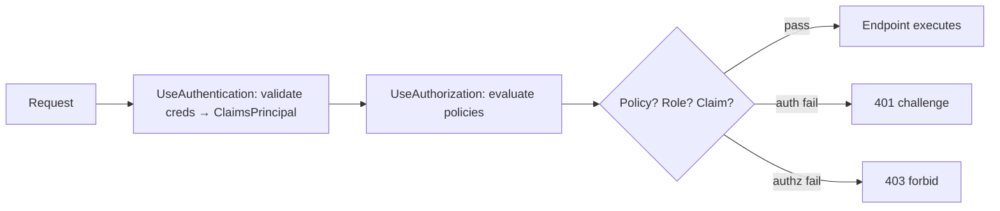
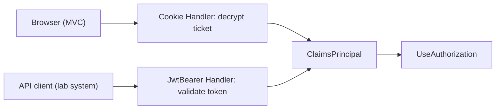
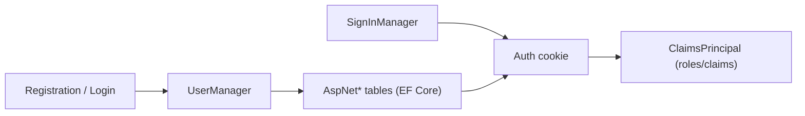
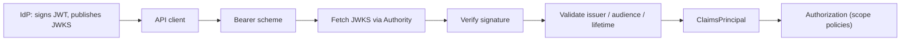
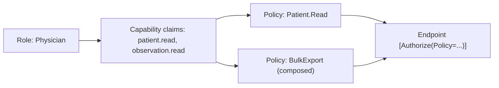
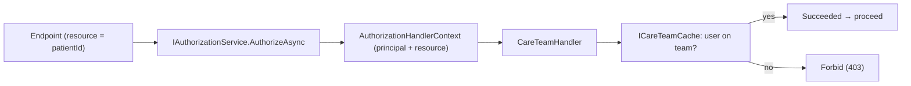
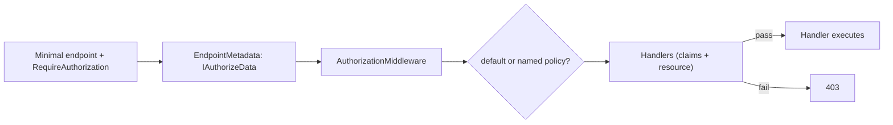
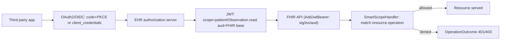

# Chapter 11: Authentication & Authorization

> **Audience:** Experienced .NET developers (5+ years) preparing for an L2 (Mid/Senior) interview at a Healthcare company.
> **Scope:** The authentication/authorization model in ASP.NET Core — authentication schemes, `ClaimsPrincipal`/`ClaimsIdentity`, cookies vs. bearer tokens, ASP.NET Core Identity, JWT bearer setup, policies, role-based and claims-based authorization, custom authorization handlers, resource-based authorization, authorization in minimal APIs, and SMART-on-FHIR / OAuth scopes for healthcare APIs.

---

## 11.1 Authentication vs. Authorization — The Mental Model

### Interview Answer (30–45 seconds)

> "Authentication answers *who are you*; authorization answers *what are you allowed to do*. In ASP.NET Core these are separate middleware and separate concepts. Authentication runs first and produces a `ClaimsPrincipal` — a set of claims about the user (name, roles, IDs) — attached to `HttpContext.User`. Authorization then consults that principal against policies: roles, claims, or custom logic. The key architectural point for a healthcare API is the separation: authentication is about *proving identity*, authorization is about *enforcing access to clinical data*. A nurse and a doctor can both be authenticated, but authorization decides which FHIR resources each may read."

### Detailed Explanation

**Authentication:**
- *Who are you?* — verify credentials, then emit an identity.
- Result: `ClaimsPrincipal` with one or more `ClaimsIdentity` objects, each holding `Claim`s.
- Mechanisms (schemes): cookie, JWT bearer, external OAuth (Google, Azure AD), basic, etc.
- In ASP.NET Core: `UseAuthentication` middleware reads credentials from the request (cookie/header), validates them, and sets `context.User`.

**Authorization:**
- *What can you do?* — evaluate the authenticated principal against policies.
- Models: role-based, claims-based, policy-based, resource-based.
- In ASP.NET Core: `[Authorize]` attributes, `IAuthorizationService`, `AuthorizationHandler<TRequirement>`.
- `UseAuthorization` middleware runs after authentication and checks the endpoint's requirements.

**Claims terminology:**
- `Claim` — a name/value pair: `ClaimTypes.Name`, `ClaimTypes.Role`, `ClaimTypes.NameIdentifier`, custom claims (`"tenant_id"`, `"clinical_role"`).
- `ClaimsIdentity` — a named collection of claims with an authentication type.
- `ClaimsPrincipal` — the user; may carry multiple identities (e.g., both `AzureAD` and `local`).

**The golden rule:** never trust the client. Claims must come from your trusted authority (the token issuer, validated signature), not from request input.

### Real World Example (Healthcare)

A clinician logs into the EHR portal. Authentication validates their credentials (or an external SSO token) and builds a principal:
- `NameIdentifier` = clinician's user GUID
- `Role` = `Physician`
- `"tenant"` = `StMarysHospital`
- `"specialty"` = `Cardiology`

Authorization then enforces: `[Authorize(Roles = "Physician")]` on the FHIR `Observation` endpoints, and a custom requirement `MustBeTreatingProvider` that checks the requesting clinician is on the patient's care team before returning records.

### Production Code Example

```csharp
// Authentication produces the principal
var app = builder.Build();
app.UseAuthentication();   // sets context.User from validated token/cookie
app.UseAuthorization();    // evaluates policies against context.User

// Authorization is declarative at the endpoint
[HttpGet("patients/{patientId}/observations")]
[Authorize(Roles = "Physician, Nurse")]          // role-based
public async Task<IActionResult> GetObservations(string patientId) { ... }

// And imperative when you need data-dependent checks
public class ObservationsController : ControllerBase
{
    private readonly IAuthorizationService _authz;

    public async Task<IActionResult> Get(string patientId)
    {
        var patient = await _patients.GetAsync(patientId);
        var allowed = await _authz.AuthorizeAsync(
            User, patient, new TreatingProviderRequirement(patientId));
        if (!allowed.Succeeded) return Forbid();
        return Ok(patient);
    }
}
```

**Key lines explained:**

- `UseAuthentication` before `UseAuthorization` — the ordering contract from Chapter 10.
- Attribute-based authorization for coarse role gates; `IAuthorizationService` for data-dependent resource checks.
- The same principal flows through both — authentication produces it, authorization consumes it.

### Internal Working

- `AuthenticationMiddleware` calls `IAuthenticationHandler` for the default scheme (or the one the endpoint declares), which reads the cookie/JWT, validates it, and constructs the principal.
- `AuthorizationMiddleware` inspects the endpoint's `IAuthorizeData` metadata, builds `AuthorizationPolicy`s, and evaluates them via `IAuthorizationPolicyProvider` + `IAuthorizationHandler`s.
- If authentication fails, the handler can *challenge* (401, redirect to login); if it succeeds but authorization fails, it *forbids* (403).

### Advantages

- Clear separation of concerns — identity vs. access.
- Declarative authorization keeps endpoints readable.
- Extensible: custom schemes, requirements, and handlers.

### Disadvantages

- The two-step model is subtle — auth vs. authz failures look different (401 vs 403).
- Misconfiguration of scheme defaults causes confusing behavior.
- Resource-based authorization requires discipline to implement consistently.

### Best Practices

- Distinguish `401 Unauthorized` (not authenticated) from `403 Forbidden` (not permitted).
- Keep claims minimal and from the token/authority — never from request input.
- Use policies for reusable authorization rules instead of role strings everywhere.

### Common Mistakes

- Using "authorization" to mean authentication in design discussions.
- Checking `User.IsInRole(...)` scattered through controllers instead of policies.
- Trusting client-supplied claims or role headers.

### Interview Follow-up Questions

1. When is a 401 returned vs a 403?
2. How does `UseAuthentication` differ from `UseAuthorization` in effect?
3. What's a claim vs an identity vs a principal?

### Senior Level Talking Points

- "Authentication proves identity once; authorization is the *policy engine* that decides access to each resource. In healthcare, the two must be designed independently because the same authenticated user has wildly different permissions across roles, tenants, and care teams."
- "I model permissions as claims and policies, never as role strings sprinkled in code — that's how RBAC survives growth."

### Diagram



### Comparison Table

| Concern | Authentication | Authorization |
|---|---|---|
| Question | Who are you? | What can you do? |
| Produces | ClaimsPrincipal | Allow/Deny decision |
| Failure | 401 challenge | 403 forbid |
| ASP.NET Core | `UseAuthentication` | `UseAuthorization` |
| Config | Schemes, token validation | Policies, requirements |

### Memory Trick

**"Authenticate = identity, Authorize = access"** — the who vs. what split; failure 401 vs 403 mirrors it.

### Summary

Authentication establishes identity (the principal); authorization enforces access on it. Design them separately, keep claims authoritative, and use policies for reusable access rules.

### Interview Confidence Score

**High.** The auth vs. authz distinction is a near-certain opening question; make the 401/403 and policy points crisply.

---

## 11.2 Authentication Schemes, Cookies, and Bearer Tokens

### Interview Answer (30–45 seconds)

> "ASP.NET Core authentication is scheme-based: each scheme bundles an `IAuthenticationHandler` that knows how to read and validate a particular credential format. `AddCookie` handles cookie payloads for browser apps; `AddJwtBearer` validates `Authorization: Bearer <token>` for APIs; `AddOpenIdConnect` and OAuth handlers delegate to external providers. The default scheme decides which handler runs when `UseAuthentication` sees no explicit scheme. For a healthcare API I use JWT bearer for machine-to-machine and SPA-to-API traffic, and cookies for the internal clinician portal when it's a same-origin MVC app — never both on the same endpoint without an explicit scheme."

### Detailed Explanation

**Schemes and handlers:**
- `AuthenticationScheme` — name (e.g., `"Bearer"`, `"Cookies"`), handler type, options.
- `IAuthenticationHandler` — `AuthenticateAsync()` (read+validate), `ChallengeAsync()` (401/login redirect), `ForbidAsync()` (403).
- `AddAuthentication(defaultScheme).AddJwtBearer().AddCookie()` — register multiple; pick a default.

**Cookie authentication:**
- `AddAuthentication("Cookies").AddCookie(options => ...)`.
- Server-issued cookie contains a protected ticket (encrypted by default) with the principal.
- Browser-friendly; CSRF considerations; same-origin.
- `LoginPath`/`LogoutPath`/`AccessDeniedPath` config.

**JWT bearer authentication:**
- `AddJwtBearer(options => ...)` — reads `Authorization: Bearer <token>`.
- `TokenValidationParameters`: `ValidateIssuer`, `ValidateAudience`, `ValidateIssuerSigningKey`, `ValidateLifetime` — all should be on.
- `Events.OnMessageReceived` for tokens in cookies/query (SignalR, gRPC).

**Default scheme semantics:**
- `AddAuthentication()` default drives the challenge scheme (which handler responds to 401 with a login redirect vs a bare 401).
- When an endpoint declares no scheme, the default is used; mixed cookie+JWT apps often need per-endpoint schemes.

**Choosing:**
- Browser-first MVC/Blazor → cookies.
- API/SPA/mobile/third-party → bearer tokens.
- Hybrid → register both, set defaults carefully, decorate endpoints with the right scheme.

### Real World Example (Healthcare)

The clinical portal is an MVC app using cookie authentication (browser UX: login redirect, logout). The same domain hosts a public FHIR API consumed by a partner lab system, authenticated with JWT bearer tokens. The two schemes coexist: default is `"Cookies"` for the portal, and FHIR API controllers declare `[Authorize(AuthenticationSchemes = JwtBearerDefaults.AuthenticationScheme)]`.

### Production Code Example

```csharp
builder.Services
    .AddAuthentication(options =>
    {
        options.DefaultScheme = CookieAuthenticationDefaults.AuthenticationScheme;
        options.DefaultChallengeScheme = CookieAuthenticationDefaults.AuthenticationScheme;
        options.DefaultAuthenticateScheme = CookieAuthenticationDefaults.AuthenticationScheme;
    })
    .AddCookie(CookieAuthenticationDefaults.AuthenticationScheme, options =>
    {
        options.LoginPath = "/Account/Login";
        options.LogoutPath = "/Account/Logout";
        options.AccessDeniedPath = "/Account/AccessDenied";
        options.ExpireTimeSpan = TimeSpan.FromHours(8);
        options.SlidingExpiration = true;
        options.Cookie.SecurePolicy = CookieSecurePolicy.Always;   // HTTPS-only
        options.Cookie.HttpOnly = true;                            // no JS access
        options.Cookie.SameSite = SameSiteMode.Strict;
    })
    .AddJwtBearer(JwtBearerDefaults.AuthenticationScheme, options =>
    {
        options.Authority = "https://auth.example.com";
        options.Audience = "fhir-api";
        options.RequireHttpsMetadata = true;
        options.TokenValidationParameters = new TokenValidationParameters
        {
            ValidateIssuer = true,
            ValidateAudience = true,
            ValidateLifetime = true,
            ValidateIssuerSigningKey = true,
            ClockSkew = TimeSpan.FromSeconds(30)
        };
    });
```

**Key lines explained:**

- Cookies default for the browser portal; JWT bearer for the API.
- Hardened cookie options: `SecurePolicy.Always`, `HttpOnly`, `SameSite=Strict` — standard for PHI-bearing apps.
- JWT validation is fully enforced (issuer, audience, lifetime, signing key).

### Internal Working

- Each scheme's handler runs when invoked; `AuthenticateAsync` returns an `AuthenticateResult` (success, no result, or failure).
- Cookie handler decrypts the protected ticket using `DataProtection` and rebuilds the principal; failed decryption → challenge.
- JWT bearer handler parses the header token, validates signature/claims via the token handler, and builds the principal from claims.
- The default scheme determines which handler a bare `[Authorize]` endpoint uses.

### Advantages

- One framework, many credential formats.
- Per-endpoint scheme selection for mixed apps.
- Well-hardened defaults (encrypted cookies, token validation).

### Disadvantages

- Multi-scheme config is easy to get subtly wrong (wrong default → wrong challenge behavior).
- Cookie+JWT on one app complicates CSRF and logout semantics.
- Scheme/option mismatches produce cryptic 401s.

### Best Practices

- Set all three defaults (`DefaultAuthenticateScheme`, `DefaultChallengeScheme`, `DefaultScheme`) explicitly.
- Declare schemes on endpoints that must use a specific credential type.
- Cookies: HTTPS-only, HttpOnly, SameSite; JWT: full `TokenValidationParameters`.

### Common Mistakes

- Only setting `DefaultScheme` and leaving challenge behavior inconsistent.
- Forgetting `TokenValidationParameters` → tokens accepted without audience/lifetime checks.
- Setting `Cookie.SecurePolicy = Never` in production.

### Interview Follow-up Questions

1. What is a default scheme for, exactly?
2. Cookie vs JWT for a SPA?
3. How do you mix cookie auth and bearer auth in one app?

### Senior Level Talking Points

- "Scheme selection is a threat-model decision: cookies for browser sessions with CSRF/SameSite handling, bearer tokens for API clients that can store them securely. The default scheme must match the app's primary shape."
- "For FHIR APIs I standardize on bearer + scope validation (SMART-on-FHIR), so partner systems integrate through one credential model."

### Diagram



### Comparison Table

| Concern | Cookies | JWT Bearer |
|---|---|---|
| Transport | Cookie header | Authorization header |
| Storage | Server-encrypted ticket | Client-held token |
| Best for | Browser, same-origin | APIs, SPA, mobile, services |
| CSRF | Risk (mitigate SameSite/anti-forgery) | Low (not auto-sent) |
| Logout | Server-side invalidation | Requires revocation |
| Expiry | Cookie/rolling | Token lifetime |

### Memory Trick

**"Cookies for browsers, bearer for APIs"** — pick by who holds the credential.

### Summary

Schemes abstract credential formats behind one authentication model. Cookies suit browser apps; JWT bearer suits APIs. Set defaults explicitly, harden options, and pick schemes per endpoint in mixed apps.

### Interview Confidence Score

**High.** Scheme selection and cookie hardening are common questions; the mixed-portal-plus-FHIR-API example shows senior judgment.

---

## 11.3 ASP.NET Core Identity

### Interview Answer (30–45 seconds)

> "ASP.NET Core Identity is the built-in membership system: user storage (EF Core `UserManager`/`RoleManager`), password hashing, two-factor authentication, lockout, external login integration, and claims/roles — all first-party. It's the right starting point for an app that manages its own users rather than delegating to an external IdP. For a healthcare platform I'd typically use Identity for the internal clinician portal, then issue application tokens/scopes (or federate to an enterprise IdP like Azure AD) for the API — Identity itself isn't the token authority for third parties."

### Detailed Explanation

**Identity building blocks:**
- `IdentityDbContext<TUser>` — EF Core context for users/roles/claims/logins/tokens.
- `UserManager<TUser>` — create/find/confirm/validate users, password ops, lockout, 2FA.
- `RoleManager<TRole>` — create/manage roles.
- `SignInManager<TUser>` — cookie sign-in/sign-out, password checks.
- Default user type `IdentityUser`; claims, roles, external logins stored as related entities.

**Data model:**
- `AspNetUsers`, `AspNetRoles`, `AspNetUserRoles`, `AspNetUserClaims`, `AspNetUserLogins`, `AspNetUserTokens`.

**Flow:**
- Register user → `UserManager.CreateAsync(user, password)` (hashes via PBKDF2).
- Sign in → `SignInManager.PasswordSignInAsync` → validates + issues cookie principal.
- Two-factor → `TOTP` or phone; lockout after N failures.

**Password security:** Identity hashes with PBKDF2 (bcrypt-class work factor) — never store plaintext or reversible hashes.

**Integration:** `AddIdentity<TUser, TRole>()`, `AddEntityFrameworkStores<AppDbContext>()`, `AddDefaultTokenProviders()`.

### Real World Example (Healthcare)

The internal staff portal uses ASP.NET Core Identity for clinician accounts with roles (`Physician`, `Nurse`, `Administrator`), lockout after failed attempts (a HIPAA-adjacent control), and optional 2FA for remote access. Users and roles map to a `Staff` domain table; the portal's session cookie is the Identity sign-in.

### Production Code Example

```csharp
builder.Services.AddDbContext<AppDbContext>(o =>
    o.UseSqlServer(builder.Configuration.GetConnectionString("IdentityDb")));

builder.Services
    .AddIdentity<IdentityUser, IdentityRole>(options =>
    {
        options.Password.RequiredLength = 12;
        options.Password.RequireDigit = true;
        options.Lockout.MaxFailedAccessAttempts = 5;
        options.Lockout.DefaultLockoutTimeSpan = TimeSpan.FromMinutes(15);
        options.User.RequireUniqueEmail = true;
        options.SignIn.RequireConfirmedAccount = true;
    })
    .AddEntityFrameworkStores<AppDbContext>()
    .AddDefaultTokenProviders();

// Register a user
var user = new IdentityUser { UserName = email, Email = email };
var result = await _userManager.CreateAsync(user, password);
if (result.Succeeded)
    await _userManager.AddToRoleAsync(user, "Physician");

// Sign in
var signIn = await _signInManager.PasswordSignInAsync(
    email, password, isPersistent: true, lockoutOnFailure: true);
if (signIn.Succeeded) { /* redirect */ }
```

**Key lines explained:**

- Password policy and lockout configured at registration — security posture in one place.
- `RequireConfirmedAccount` forces email confirmation before sign-in.
- `PasswordSignInAsync` handles hashing comparison and lockout bookkeeping.

### Internal Working

- `UserManager` performs all user mutations through EF Core stores.
- Passwords are hashed with PBKDF2 (`PasswordHasher<TUser>`) with a per-user salt.
- `SignInManager` issues the cookie authentication ticket containing the principal with role/claim rows loaded.
- Lockout counters and 2FA tokens live in `AspNetUserTokens`/claim tables.

### Advantages

- Full membership out of the box: registration, login, roles, 2FA, lockout, external logins.
- First-party and well integrated with EF Core + cookies.
- Extensible: custom user type, custom stores, custom token providers.

### Disadvantages

- Schema and API surface are large — overkill for pure API token auth.
- Coupled to EF Core (custom stores are painful).
- Not a replacement for an enterprise IdP (Azure AD/Okta) or an OAuth token authority for third parties.

### Best Practices

- Use Identity for self-managed user bases; federate to an IdP when the org owns identities.
- Enforce strong password/lockout policies; enable 2FA for privileged/remote access.
- Don't store PHI in Identity tables; keep clinical data in domain tables keyed by user ID.

### Common Mistakes

- Using Identity where an IdP/OAuth is appropriate (partner access).
- Weakening default password/lockout settings.
- Exposing `IdentityUser` DTOs that leak password hash fields.

### Interview Follow-up Questions

1. When do you choose Identity vs. an external IdP?
2. How does Identity hash passwords?
3. What's the role of `SignInManager`?

### Senior Level Talking Points

- "Identity is for the *user directory* problem; OAuth/IdP is for the *token authority* problem. In healthcare I often use both — Identity for internal staff, an enterprise IdP (or Identity as the token issuer via OpenIddict) for everything else."
- "Password policy, lockout, and 2FA are non-negotiable for clinical staff access; Identity gives them to me without building them."

### Diagram



### Comparison Table

| Concern | ASP.NET Core Identity | External IdP (Azure AD/Okta) |
|---|---|---|
| User directory | Own DB | IdP-managed |
| Passwords | PBKDF2 hashed locally | IdP handles |
| SSO | External login supported | Native |
| Tokens for APIs | Via OpenIddict/custom | OAuth2/OIDC ready |
| Best for | Self-managed staff apps | Enterprise/partner access |

### Memory Trick

**"Users: Identity; identity: IdP"** — manage your own staff with Identity, delegate enterprise/partner identities to an IdP.

### Summary

ASP.NET Core Identity provides user/role membership, hashing, lockout, and 2FA on EF Core. Choose it for self-managed users; an IdP for enterprise/partner identity. Never store PHI in Identity tables.

### Interview Confidence Score

**Medium.** Identity questions appear in app-development interviews; the "when to use vs IdP" judgment is the senior signal.

---

## 11.4 JWT Bearer Configuration and Validation

### Interview Answer (30–45 seconds)

> "The JWT bearer scheme validates the `Authorization: Bearer <token>` header. The critical piece is `TokenValidationParameters` — I turn on issuer, audience, lifetime, and signing-key validation, set the `Authority` so the framework fetches the JWKS endpoint for signature verification, and keep `ClockSkew` small. The signature check is what makes the token trustworthy; the issuer/audience checks are what bind it to my API. For a healthcare FHIR API, audience must be the resource server (e.g., `fhir-api`), and I validate scopes as authorization, not authentication."

### Detailed Explanation

**JWKS and token validation:**
- The issuer publishes its public keys at the JWKS URI (`/.well-known/openid-configuration` → `jwks_uri`).
- `AddJwtBearer` with `Authority` auto-discovers the metadata and caches the signing keys.
- `TokenValidationParameters` — the five switches:
  - `ValidateIssuerSigningKey = true` — verify the cryptographic signature.
  - `ValidateIssuer = true` (+ `ValidIssuer`) — token came from the right authority.
  - `ValidateAudience = true` (+ `ValidAudience`) — token was minted for this resource server.
  - `ValidateLifetime = true` — `nbf`/`exp` honored.
  - `ClockSkew` — leeway for clock drift (default 5 min; tighten to ~30s for APIs).
- Alternatively, validate against a local symmetric key or a self-signed cert — but `Authority`/JWKS is the standard for OIDC providers.

**Events:**
- `OnTokenValidated` — post-validation hook (e.g., add claims, cache).
- `OnAuthenticationFailed` — log/handle failures.
- `OnMessageReceived` — read the token from a query string/cookie (SignalR, gRPC, or the classic `access_token` query for the SPA challenge).

**Scopes and audience:**
- `aud` claim → which resource server.
- `scope` claim (space-delimited) → which permissions — validated by your policy handlers, not the bearer scheme itself.

### Real World Example (Healthcare)

A partner lab posts lab results to the hospital's FHIR API. The hospital's IdP issues a JWT with `aud: "fhir-api"` and `scope: "Observation.write patient.read"`. The FHIR API's JWT bearer validates signature/issuer/audience/lifetime, and an authorization policy checks the `scope` claim before allowing the write. Signature validation is automatic via the IdP's JWKS endpoint.

### Production Code Example

```csharp
builder.Services
    .AddAuthentication(JwtBearerDefaults.AuthenticationScheme)
    .AddJwtBearer(options =>
    {
        options.Authority = "https://auth.example.com";       // OIDC metadata + JWKS
        options.Audience = "fhir-api";
        options.RequireHttpsMetadata = true;

        options.TokenValidationParameters = new TokenValidationParameters
        {
            ValidateIssuer = true,
            ValidIssuers = new[] { "https://auth.example.com" },
            ValidateAudience = true,
            ValidateLifetime = true,
            ValidateIssuerSigningKey = true,
            ClockSkew = TimeSpan.FromSeconds(30)
        };

        options.Events = new JwtBearerEvents
        {
            OnTokenValidated = async ctx =>
            {
                // enrich the principal, e.g., load tenant/care-team claims from cache
                var svc = ctx.HttpContext.RequestServices.GetRequiredService<IClaimEnricher>();
                await svc.EnrichAsync(ctx.Principal);
            },
            OnAuthenticationFailed = ctx =>
            {
                _ = ctx.Exception;   // log; return 401 with generic message
                return Task.CompletedTask;
            }
        };
    });
```

**Key lines explained:**

- `Authority` enables automatic JWKS key discovery — no manual key rotation.
- All five validation switches on; `ClockSkew` tightened for an API.
- `OnTokenValidated` is where you attach authorization-relevant claims (tenant, care-team) after signature validation.

### Internal Working

- On first request, the handler fetches OIDC metadata and caches signing keys from JWKS.
- Each token: decode header/payload, validate signature against cached keys, then run the claim validators (issuer, audience, lifetime, etc.).
- A valid token → `ClaimsPrincipal` from the payload claims; failure → `AuthenticateResult.Fail` → 401 challenge.
- Key rotation is handled transparently via `kid` lookup + `RefreshOnIssuerKeyNotFound`.

### Advantages

- Stateless validation — the API doesn't call back to the IdP per request.
- Industry standard for APIs and SPAs.
- Automatic key discovery/rotation with `Authority`.

### Disadvantages

- Revocation is impossible without a token-blacklist/refresh flow.
- Configuration errors (validation switches off) silently weaken security.
- Key-fetch latency on cold start.

### Best Practices

- Always validate signature, issuer, audience, and lifetime.
- Prefer JWKS (`Authority`) over hardcoded keys.
- Tighten `ClockSkew`; keep `ValidIssuers` explicit.
- Treat scope claims as authorization, checked in policies.

### Common Mistakes

- `ValidateAudience = false` → tokens meant for another API accepted.
- `ValidateLifetime = false` (often copied from samples) → expired tokens valid.
- Trusting tokens without signature validation (local decode only).
- Leaving `ClockSkew` at 5 minutes in a security-sensitive API.

### Interview Follow-up Questions

1. What is JWKS and why do you need it?
2. What do the five `TokenValidationParameters` switches protect against?
3. How do you handle token revocation?

### Senior Level Talking Points

- "Stateless JWT validation is a performance/scale decision, but it trades away instant revocation — so I use short lifetimes plus refresh tokens, and for high-risk actions we check a revocation list."
- "Audience is the resource-server binding; scope is the permission. Validating audience but ignoring scope is like checking the envelope but not the letter."

### Diagram



### Comparison Table

| Check | Protects against | If disabled |
|---|---|---|
| IssuerSigningKey | Forged tokens | Any token accepted |
| Issuer | Tokens from other IdPs | Cross-tenant forgery |
| Audience | Tokens meant for other APIs | Replay across services |
| Lifetime | Expired/replayed tokens | Expired tokens valid |
| ClockSkew tuning | Clock drift | Small (fine) vs risk window |

### Memory Trick

**"S.I.A.L"** = **S**ignature, **I**ssuer, **A**udience, **L**ifetime — the four JWT trusts; all four on, always.

### Summary

JWT bearer authentication hinges on rigorous `TokenValidationParameters`: signature via JWKS, plus issuer, audience, and lifetime checks. Scope claims are authorization and belong in policies.

### Interview Confidence Score

**High.** JWT validation details are a favorite follow-up; recite the four checks and the revocation trade-off confidently.

---

## 11.5 Policies, Roles, and Claims-Based Authorization

### Interview Answer (30–45 seconds)

> "Authorization in ASP.NET Core is policy-driven: a policy is a named bundle of requirements, and endpoints declare which policies they need. Role-based (`[Authorize(Roles=...)]`) and claims-based (`[Authorize(Policy=...)]`) are both sugar over the same requirement engine. The senior design is to encode *capabilities* as claims and define policies over them — for example a `CanAdministerPatients` claim — rather than hard-coding role names in controllers. Policies are registered once in `ConfigureServices` and reused everywhere, which keeps access rules auditable."

### Detailed Explanation

**The policy model:**
- `AuthorizationPolicy` — collection of `IAuthorizationRequirement`s, plus optional scheme list.
- `IAuthorizationHandler` — evaluates a requirement against a principal and a resource.
- `AuthorizationHandlerContext` — carries principal, resource, requirements, and results.

**Role-based authorization:**
```csharp
[Authorize(Roles = "Physician")]                  // simple sugar
```
- Requires the principal to have a role claim equal to the role.

**Claims-based authorization:**
```csharp
[Authorize(Policy = "CardiologistOnly")]
```
```csharp
builder.Services.AddAuthorization(options =>
{
    options.AddPolicy("CardiologistOnly", policy =>
        policy.RequireClaim("specialty", "Cardiology"));
});
```
- Requires a claim with the exact type/value.

**Policy composition:**
```csharp
options.AddPolicy("ClinicalData", policy =>
    policy.RequireAuthenticatedUser()
          .RequireRole("Physician", "Nurse")
          .RequireClaim("tenant"));
```
- Multiple requirements → all must pass (AND).
- `.Combine(policy1, policy2)` for reuse.

**Custom requirements (11.6):**
- Implement `IAuthorizationRequirement` + `AuthorizationHandler<T>` for logic (resource-based, dynamic rules).

### Real World Example (Healthcare)

Roles are broad buckets; the platform defines *capability claims*: `patient.read`, `patient.write`, `observation.read`, `report.export`. Policies map roles to capabilities at configuration time (`Administrator` ⇒ all, `Physician` ⇒ read+write clinical, `Auditor` ⇒ read-only + audit). Endpoints reference capability policies, not role names — so a future role change is a config change, not a code search.

### Production Code Example

```csharp
builder.Services.AddAuthorization(options =>
{
    options.AddPolicy("Patient.Read", policy => policy.RequireClaim("patient.read"));
    options.AddPolicy("Patient.Write", policy => policy.RequireClaim("patient.write"));
    options.AddPolicy("BulkExport", policy => policy
        .RequireClaim("patient.read")
        .RequireClaim("observation.read")
        .RequireRole("Administrator", "Physician"));
});

[HttpGet("patients/{id}")]
[Authorize(Policy = "Patient.Read")]          // capability, not role
public async Task<IActionResult> Get(string id) { ... }

[HttpGet("patients/$export")]
[Authorize(Policy = "BulkExport")]            // composed policy
public async Task<IActionResult> Export() { ... }
```

**Key lines explained:**

- Capability claims map to fine-grained policies; endpoints declare capabilities.
- `BulkExport` composes multiple requirements — all must pass.
- Roles appear only in policy composition, not scattered as attribute strings.

### Internal Working

- `IAuthorizationPolicyProvider` supplies the policy for a policy name.
- `AuthorizationMiddleware` calls `IAuthorizationService.AuthorizeAsync(principal, resource, policy)`.
- Handlers run in order; a requirement passes if any handler `Succeed`s it; all requirements must succeed for the policy to pass.
- Failures produce `ForbidAsync` (403).

### Advantages

- Reusable, declarative access rules.
- Capability-based design scales beyond fixed roles.
- Testable: policies are plain objects.

### Disadvantages

- Policy sprawl if over-engineered.
- Role strings can still creep into claims if not enforced.
- Requires upfront capability modeling.

### Best Practices

- Define policies over capability claims, not raw role checks.
- Compose and reuse policies; avoid copy-paste attributes.
- Audit policy definitions in one file.

### Common Mistakes

- Mixing role checks and policies inconsistently.
- `RequireClaim("role", ...)` duplicating `RequireRole`.
- Forgetting that multiple requirements AND together.

### Interview Follow-up Questions

1. What's the difference between role-based and claims-based authorization?
2. How do policies AND-compose requirements?
3. Why encode capabilities instead of roles?

### Senior Level Talking Points

- "Roles drift; capabilities are stable. When the hospital adds a 'Consultant' role, I change one policy mapping instead of touching fifty controllers."
- "Policies are the single source of truth for access — that's what a compliance reviewer can read."

### Diagram



### Comparison Table

| Style | Declared as | Granularity | Flex |
|---|---|---|---|
| Role-based | `[Authorize(Roles=...)]` | Coarse | Low |
| Claims-based | `[Authorize(Policy=...)]` + `RequireClaim` | Medium | Medium |
| Policy/composed | Policy definitions | Fine (capabilities) | High |

### Memory Trick

**"Policies over capabilities, not roles"** — encode what the user *can do*, and let roles be a config mapping.

### Summary

Policies are named requirement bundles; role- and claims-based authorization are sugar over them. Modeling capability claims and composing policies keeps access rules auditable and evolvable.

### Interview Confidence Score

**High.** Policy-vs-role and capability modeling are core senior topics in healthcare (where permissions are fine-grained and audited).

---

## 11.6 Custom Authorization Handlers and Resource-Based Authorization

### Interview Answer (30–45 seconds)

> "When access depends on the *data*, not just the identity, I use custom requirements and handlers. A requirement is a marker class implementing `IAuthorizationRequirement`; a handler implements `AuthorizationHandler<MyRequirement>` and inspects the principal *and* the resource to decide. I trigger it with `IAuthorizationService.AuthorizeAsync(user, resource, requirement)` from within a handler/controller. In healthcare this is exactly the *care-team* rule: a nurse may read a patient record only if they're on that patient's care team — a data-dependent decision no static attribute can express."

### Detailed Explanation

**The mechanics:**
1. Define a requirement class:
```csharp
public sealed class TreatingProviderRequirement(string patientId) : IAuthorizationRequirement
{
    public string PatientId { get; } = patientId;
}
```
2. Implement a handler:
```csharp
public sealed class TreatingProviderHandler : AuthorizationHandler<TreatingProviderRequirement>
{
    private readonly ICareTeamService _careTeams;
    public TreatingProviderHandler(ICareTeamService careTeams) => _careTeams = careTeams;

    protected override async Task HandleRequirementAsync(
        AuthorizationHandlerContext context, TreatingProviderRequirement requirement)
    {
        var userId = context.User.FindFirstValue(ClaimTypes.NameIdentifier);
        var isOnTeam = await _careTeams.IsOnTeamAsync(userId, requirement.PatientId);
        if (isOnTeam)
            context.Succeed(requirement);
    }
}
```
3. Register the handler:
```csharp
builder.Services.AddScoped<IAuthorizationHandler, TreatingProviderHandler>();
```
4. Trigger resource-based checks:
```csharp
var authz = await _authz.AuthorizeAsync(User, patient, new TreatingProviderRequirement(patient.Id));
if (!authz.Succeeded) return Forbid();
```

**Handler semantics:**
- Multiple handlers may evaluate the same requirement; `context.Succeed(requirement)` from any handler passes it.
- `context.Fail()` (or no handler succeeding) fails the requirement.
- Handlers can `context.Fail()` to short-circuit other handlers.

**Policy + resource combination:**
- Register the requirement in a policy, then use `AuthorizeAsync(User, resource, policy)` — the policy's static checks plus the resource-dependent handler both run.

### Real World Example (Healthcare)

A patient portal request for `/patients/{id}/labs` passes `[Authorize(Policy = "Patient.Read")]`, but that's not enough — HIPAA's minimum-necessary principle means a treating clinician should only see records for *their* patients. The handler looks up the care-team membership (cached) and succeeds the `TreatingProviderRequirement` only if the user is assigned to the patient.

### Production Code Example

```csharp
// Requirement + handler
public sealed record MustBeCareTeamMember(string PatientId) : IAuthorizationRequirement;

public sealed class CareTeamHandler(IUserContext users, ICareTeamCache careTeams)
    : AuthorizationHandler<MustBeCareTeamMember>
{
    protected override async Task HandleRequirementAsync(
        AuthorizationHandlerContext context, MustBeCareTeamMember requirement)
    {
        var userId = users.GetCurrentUserId(context.User);
        var onTeam = await careTeams.IsMemberAsync(userId, requirement.PatientId);
        if (onTeam) context.Succeed(requirement);
    }
}

// Registration
builder.Services.AddScoped<IAuthorizationHandler, CareTeamHandler>();
builder.Services.AddSingleton<ICareTeamCache, CareTeamCache>();

// Usage in a controller
public async Task<IActionResult> GetLabResults(string patientId)
{
    var allowed = await _authz.AuthorizeAsync(
        User, patientId, new MustBeCareTeamMember(patientId));
    if (!allowed.Succeeded) return Forbid();

    var results = await _labs.GetForPatientAsync(patientId);
    return Ok(results);
}
```

**Key lines explained:**

- The requirement carries the resource identifier — the handler compares it against live/cached data.
- `IAuthorizationService` (via `[FromServices]`/constructor) runs the handler with the principal *and* resource.
- `return Forbid()` produces a 403 without leaking whether the record exists.

### Internal Working

- `AuthorizeAsync` builds an `AuthorizationHandlerContext` with principal, resource, and requirement(s).
- Registered `IAuthorizationHandler`s are evaluated; the pipeline short-circuits on `Fail`.
- Handlers are resolved from DI — so they can depend on scoped services (`DbContext`, caches).
- Result is an `AuthorizationResult` (`Succeeded` or failure reasons).

### Advantages

- Data-dependent access control (the "minimum necessary" rule).
- Reusable across endpoints.
- Combines cleanly with static policies.

### Disadvantages

- Per-request resource lookups add latency (mitigate with caching).
- Needs discipline to avoid inconsistent checks across endpoints.
- Handlers doing heavy work can make auth slow.

### Best Practices

- Cache expensive lookups (care-team membership, tenant access).
- Combine static policy + resource handler for layered checks.
- Prefer `Forbid()` over throwing/404ing to avoid resource existence leaks (or return 404 deliberately for privacy).

### Common Mistakes

- Skipping the static policy and doing everything in the handler.
- Forgetting to register the handler (`IAuthorizationHandler` not in DI → requirement never succeeds).
- Returning 404 for forbidden data in some endpoints and 403 in others (inconsistent).

### Interview Follow-up Questions

1. How do handlers combine with policies?
2. When is resource-based auth required?
3. How do you avoid the latency of per-request resource checks?

### Senior Level Talking Points

- "Static policies handle *who can*, resource handlers enforce *which data they can* — together they implement minimum-necessary access in FHIR without leaking existence."
- "I cache care-team memberships and use the handler result for consistent 403 semantics across all patient endpoints."

### Diagram



### Comparison Table

| Concern | Static policy | Resource handler |
|---|---|---|
| Inputs | Principal only | Principal + resource |
| Example | Has `patient.read` claim | On this patient's care team |
| Cost | Cheap (claims) | Data lookup (cache!) |
| Used for | Capabilities | Minimum-necessary rules |

### Memory Trick

**"Static for capability, resource for data"** — policies answer "can they at all?"; handlers answer "can they for *this* record?"

### Summary

Custom requirements + handlers enable data-dependent authorization via `IAuthorizationService.AuthorizeAsync`. They're the mechanism for care-team and minimum-necessary rules in healthcare. Cache the lookups.

### Interview Confidence Score

**High.** Custom handlers and resource-based auth are classic senior questions, and the care-team example lands well in healthcare interviews.

---

## 11.7 Authorization in Minimal APIs and Common Pitfalls

### Interview Answer (30–45 seconds)

> "Minimal APIs use the same `IAuthorizationService` under the hood — you attach `.RequireAuthorization()` to endpoints, optionally with a policy name, and it works because the endpoint's metadata carries the requirements and the authorization middleware evaluates them. The catch is that `AuthorizationHandler`s and resource checks work the same way but you wire the resource check inside the handler with `context.Resource`. The common pitfalls I watch for: forgetting the middleware order (auth before authz), `RequireAuthorization` without authentication configured, and resource-based checks that swallow the resource or return 404 instead of 403."

### Detailed Explanation

**Minimal API authorization:**

```csharp
app.MapGet("/fhir/Patient/{id}", GetPatient)
   .RequireAuthorization();                      // requires authenticated user
app.MapGet("/fhir/Observation", GetObservations)
   .RequireAuthorization("Patient.Read");        // named policy
```

- `.RequireAuthorization(policyName)` adds `IAuthorizeData` metadata to the endpoint.
- The `AuthorizationMiddleware` reads that metadata at request time and evaluates it.
- Multiple calls add multiple policies (all must pass).
- `[AllowAnonymous]` equivalent: `.AllowAnonymous()`.

**Resource in minimal APIs:**
- In the handler, `context.Resource` inside a custom handler is the endpoint's route values or the `Endpoint` object — for true resource-based checks, resolve the resource inside the handler (e.g., parse `HttpContext.Request.RouteValues["patientId"]` or use `HttpContext.Items`).

**Pitfalls:**

1. `UseAuthorization()` without `UseAuthentication()` → every secured endpoint 401s.
2. `RequireAuthorization` on a minimal API but the default scheme is cookies → wrong challenge behavior.
3. Resource handler that doesn't know the resource → pass it via `HttpContext.Items` or route values.
4. Return 404 instead of 403 for forbidden (inconsistent privacy semantics).
5. Forgetting `AllowAnonymous` on genuinely public endpoints (health, metadata) → everything locked down.

### Real World Example (Healthcare)

The FHIR `Patient` search endpoint uses `.RequireAuthorization("Patient.Read")`; the SMART-on-FHIR capability statement endpoint is `.AllowAnonymous()` (it must be public per spec); and the resource handler for `GET /fhir/Patient/{id}` resolves `patientId` from route values to check care-team membership.

### Production Code Example

```csharp
app.MapGet("/fhir/Patient/{patientId}", async (
        string patientId,
        IAuthorizationService authz,
        ClaimsPrincipal user,
        IPatientService patients) =>
{
    var patient = await patients.GetAsync(patientId);
    if (patient is null) return Results.NotFound();

    var allowed = await authz.AuthorizeAsync(
        user, patient, new MustBeCareTeamMember(patient.PatientId));
    if (!allowed.Succeeded) return Results.Forbid();

    return Results.Ok(patient);
})
.RequireAuthorization("Patient.Read")          // static policy + resource handler
.Produces<Patient>(StatusCodes.Status200OK);

app.MapGet("/fhir/metadata", () => Results.Ok(CapabilityStatement.Build()))
   .AllowAnonymous();                           // SMART-on-FHIR public metadata
```

**Key lines explained:**

- Static policy gates capability; the resource handler inside the lambda enforces minimum-necessary per record.
- `Results.Forbid()` gives a clean 403; `Results.NotFound()` deliberately when the record doesn't exist.
- Public metadata explicitly `AllowAnonymous`.

### Internal Working

- `RequireAuthorization` appends `AuthorizeAttribute`-like metadata to `EndpointMetadata`.
- `AuthorizationMiddleware` builds an `AuthorizationPolicy` (default policy or named) from that metadata and evaluates it via `IAuthorizationService` with `context.Resource = endpoint`.
- Resource checks inside handlers can dig into `HttpContext` for route values or item-resolved entities.

### Advantages

- Same authorization engine as controllers — one mental model.
- Concise per-endpoint policy declarations.
- Public endpoints explicitly opt out.

### Disadvantages

- Resource passing is more manual than in MVC (no convenient controller resource).
- Policy metadata on lambdas is easy to forget.
- Debugging 401/403 requires knowing the middleware order.

### Best Practices

- Always pair `RequireAuthorization` with authentication configured.
- Resolve the resource inside the handler and use `HttpContext.Items` for cross-middleware hand-off.
- Keep public endpoints explicit with `AllowAnonymous`.
- Use named policies to avoid repeating `RequireRole` chains.

### Common Mistakes

- Locking down `/health` and `/fhir/metadata` (spec-required public endpoints).
- Resource handler receiving `Endpoint` instead of the entity → always-fail checks.
- Missing `UseAuthentication` before `UseAuthorization`.

### Interview Follow-up Questions

1. How does `RequireAuthorization` work for minimal APIs?
2. How do you pass a resource to a handler in a minimal API?
3. What's the default policy if none is specified?

### Senior Level Talking Points

- "Minimal APIs and controllers share the same authorization engine, so a policy written once is honored everywhere — that's the consistency story a compliance review needs."
- "For resource checks I make the handler resolve the entity from route values or a cache, never trust the client to tell us the resource."

### Diagram



### Comparison Table

| Aspect | MVC controller | Minimal API |
|---|---|---|
| Declare | `[Authorize(Policy=...)]` | `.RequireAuthorization(...)` |
| Public | `[AllowAnonymous]` | `.AllowAnonymous()` |
| Resource | Action argument | Route values / HttpContext.Items |
| Engine | `IAuthorizationService` | Same |

### Memory Trick

**"Require it, allow what's public, authenticate first"** — the minimal-API auth recipe.

### Summary

Minimal APIs use the same policy engine via `.RequireAuthorization()`. Handle resource passing explicitly, keep public endpoints `AllowAnonymous`, and respect middleware order.

### Interview Confidence Score

**Medium-High.** Expect a minimal-API auth question now that minimal APIs are mainstream; the resource-resolution detail is the differentiator.

---

## 11.8 SMART-on-FHIR and OAuth Scopes for Healthcare APIs

### Interview Answer (30–45 seconds)

> "SMART-on-FHIR is the OAuth 2.0 / OIDC profile the healthcare industry standardized for third-party app access to FHIR servers. Apps register with the EHR, get an authorization code (or client credentials for backend services), and receive a token whose `scope` claim encodes exactly which FHIR resources and operations are allowed — e.g., `patient/Observation.read`. The FHIR server validates the token's scope on every request and serves only the authorized resources. As a .NET developer, I implement this with `AddJwtBearer` plus a scope-validation policy: validate signature/issuer/audience like any OAuth token, then enforce the SMART `scope` format as authorization. For the EHR side you'd stand up an authorization server (e.g., OpenIddict) issuing those scopes."

### Detailed Explanation

**SMART-on-FHIR scope grammar:**

`[patient|user|system]/[ResourceType].[read|write|*]`

- Launch context: `patient/` (patient-scoped), `user/` (user-scoped), `system/` (backend service).
- Resource type: `Patient`, `Observation`, `AllergyIntolerance`, `*` (all).
- Operation: `read`, `write`, `*`.
- Examples: `patient/Observation.read`, `user/Patient.write`, `system/*.*`.

**Token contents (SMART):**
- `scope` claim with the space-delimited scope strings.
- `aud` = FHIR base URL (the resource server).
- `fhirUser` claim — the FHIR user resource reference.
- `patient` claim (patient launch) — the in-context patient.

**Two client types:**
1. **Confidential/backend:** `client_credentials` grant → `system/` scopes (machine-to-machine, e.g., a lab system posting results).
2. **Interactive app:** authorization code + PKCE → `patient/` or `user/` scopes (e.g., a patient-facing mobile app).

**Implementation on the resource server (.NET):**
- `AddJwtBearer` with `Audience = fhir base URL`.
- A custom requirement/handler that validates the SMART scope string against the requested operation.
- Return `401`/`403` with FHIR `OperationOutcome` on failures.

### Real World Example (Healthcare)

A third-party diabetes-management app connects to the hospital FHIR API via SMART-on-FHIR. It performs the OAuth code+PKCE flow, receives a token with `scope: patient/Observation.read patient/Condition.read`, and the FHIR server's scope handler allows only those reads — never writes, never other resources.

### Production Code Example

```csharp
// Scope requirement + handler (authorization layer)
public sealed record SmartScopeRequirement(string ResourceType, string Operation) : IAuthorizationRequirement;

public sealed class SmartScopeHandler : AuthorizationHandler<SmartScopeRequirement>
{
    protected override Task HandleRequirementAsync(
        AuthorizationHandlerContext context, SmartScopeRequirement requirement)
    {
        var scopes = context.User.FindAll("scope")
            .SelectMany(c => c.Value.Split(' ', StringSplitOptions.RemoveEmptyEntries));

        var allowed = scopes.Any(s =>
            s.StartsWith("system/") || s.StartsWith("user/") || s.StartsWith("patient/"))
            && scopes.Any(s => Matches(s, requirement.ResourceType, requirement.Operation));

        if (allowed) context.Succeed(requirement);
        return Task.CompletedTask;
    }

    private static bool Matches(string scope, string resource, string operation)
    {
        // e.g. "patient/Observation.read" or "user/*.*"
        var parts = scope.Split('/');
        if (parts.Length != 2) return false;
        var r = parts[1].Split('.');
        if (r.Length != 2) return false;
        return (r[0] == resource || r[0] == "*") && (r[1] == operation || r[1] == "*");
    }
}

// Endpoint
app.MapGet("/fhir/Observation/{id}", GetObservation)
   .RequireAuthorization("SmartObservationRead");

// Policy registration
options.AddPolicy("SmartObservationRead", policy =>
    policy.AddRequirements(new SmartScopeRequirement("Observation", "read")));
```

**Key lines explained:**

- The handler parses the SMART `scope` claim and matches resource + operation.
- Policies declare the required resource/operation per endpoint — declarative, reviewable.
- Token signature/issuer/audience are handled by JWT bearer; scope is authorization.

### Internal Working

- On the FHIR server, `AddJwtBearer` validates the token cryptographically and binds `aud` to the FHIR base URL.
- The scope handler inspects the `scope` claim and applies the SMART grammar.
- Failures translate to FHIR `OperationOutcome` (a 401/403 with a structured diagnostic) per SMART spec.
- On the authorization-server side, scopes are granted by consent/registration and minted into tokens by OpenIddict/Auth0/Okta.

### Advantages

- Interoperable, standards-based — the industry norm for FHIR access.
- Fine-grained, auditable permissions (`ResourceType.operation`).
- Enables third-party ecosystems safely (least privilege).

### Disadvantages

- Scope-matching logic must be implemented carefully (wildcard handling).
- Launch context (`patient`, `fhirUser`) adds state to manage.
- Requires an authorization server for the EHR side.

### Best Practices

- Validate SMART scope grammar at the resource server.
- Bind `aud` to the FHIR base URL.
- Support wildcards deliberately (`*`); log scope grants.
- Return `OperationOutcome` on auth failures.

### Common Mistakes

- Treating `scope` as authentication instead of authorization.
- Ignoring wildcard semantics → over/under-permission.
- Not binding `aud` to the FHIR server → token replay across endpoints.

### Interview Follow-up Questions

1. What does `patient/Observation.read` mean?
2. How do backend services vs interactive apps get tokens?
3. Where does scope validation happen — auth or authz?

### Senior Level Talking Points

- "SMART-on-FHIR gives us a standard permission model: scopes encode resource-level capability, JWT bearer validates trust, and policies enforce both. That's the security story an interoperability review wants to see."
- "Wildcard scopes (`*`) are granted only for trusted system integrations; patient/user scopes stay narrow by default."

### Diagram



### Comparison Table

| Client | Grant | Scope prefix | Example |
|---|---|---|---|
| Patient app | auth code + PKCE | `patient/` | `patient/Observation.read` |
| Clinician app | auth code + PKCE | `user/` | `user/Patient.write` |
| Backend service | client_credentials | `system/` | `system/*.*` |

### Memory Trick

**"[patient|user|system]/[Resource].[operation]"** — the SMART scope formula; validate it as authorization.

### Summary

SMART-on-FHIR layers OAuth scopes over JWT bearer for standardized FHIR access. The .NET implementation validates the token (auth) and enforces the scope grammar (authz) via policies. It's the flagship healthcare security pattern — speak it fluently.

### Interview Confidence Score

**High (healthcare).** SMART-on-FHIR knowledge is a standout for a healthcare L2 interview; the scope-grammar + policy implementation shows real domain depth.

---

## Chapter 11 Wrap-Up

### Top 10 Questions You Should Be Ready For

1. Authentication vs authorization — and 401 vs 403?
2. What are schemes and how do cookie vs JWT differ?
3. When do you choose ASP.NET Core Identity vs an external IdP?
4. What does the JWT bearer scheme validate, and how?
5. Role-based vs claims-based vs policy-based authorization?
6. How do custom requirements and handlers work?
7. What is resource-based authorization, and when is it needed?
8. How do you authorize minimal APIs?
9. What are the common authorization pitfalls?
10. How does SMART-on-FHIR scope validation work?

### Revision Notes (1 page)

- **Auth vs Authz:** authentication proves identity (claims principal); authorization enforces access. 401 = not authenticated, 403 = not permitted. `UseAuthentication` then `UseAuthorization`.
- **Schemes:** cookie (browser, encrypted ticket) vs JWT bearer (API, header token). Set all three defaults explicitly; declare schemes per endpoint in mixed apps. Harden cookies: Secure, HttpOnly, SameSite.
- **Identity:** user/role stores on EF Core, PBKDF2 hashing, lockout, 2FA. Use for self-managed staff; IdP (Azure AD/Okta) for enterprise/partner identity. No PHI in Identity tables.
- **JWT validation:** S.I.A.L — Signature (JWKS via `Authority`), Issuer, Audience, Lifetime; small `ClockSkew`. Scopes are authorization, checked in policies.
- **Policies:** named requirement bundles; role/claims sugar over them. Model capability claims, compose policies, one file of policy definitions.
- **Resource auth:** requirement + `AuthorizationHandler<T>` + `IAuthorizationService.AuthorizeAsync(user, resource, requirement)`; cache lookups; consistent 403 (or deliberate 404) semantics.
- **Minimal APIs:** `.RequireAuthorization([policy])`, `.AllowAnonymous()`; resolve resources via route values/`HttpContext.Items`.
- **Pitfalls:** authz before auth; missing auth config; public endpoints locked down; resource handler not receiving the resource.
- **SMART-on-FHIR:** scope grammar `[patient|user|system]/[Resource].[read|write|*]`; validate token in bearer scheme, enforce scope in a policy handler; bind `aud` to the FHIR base URL; `OperationOutcome` on failure.

### Things Interviewers Expect From 5+ Years Experience

- Instant 401-vs-403 clarity and the middleware-order reason.
- Scheme choice justified (cookie vs bearer) with security hardening details.
- JWT validation switches enumerated and defended.
- Policy/capability modeling rather than role-string sprinkling.
- A resource-based authorization example (care team) — the healthcare differentiator.
- Familiarity with SMART-on-FHIR/OAuth scopes if the role is FHIR-facing.

### Cheat Sheet

```
AUTH vs AUTHZ:
  401 = who are you?  (authentication failed → challenge)
  403 = what can you do? (authorization failed → forbid)
  ORDER: UseAuthentication → UseAuthorization

SCHEMES:
  Cookie  → browser, encrypted ticket, SameSite/HttpOnly/Secure
  JWT     → API, Authorization: Bearer
  Set: DefaultAuthenticateScheme/ChallengeScheme/DefaultScheme explicitly

JWT CHECKLIST (S.I.A.L):
  Signature (JWKS via Authority) · Issuer · Audience · Lifetime
  ClockSkew ~30s; scopes = authorization (policies), not auth

IDENTITY:
  Self-managed staff → Identity (UserManager/SignInManager)
  Enterprise/partner → IdP (Azure AD/Okta); no PHI in Identity tables

POLICIES:
  Capability claims (patient.read) → policies → endpoints
  [Authorize(Policy="Patient.Read")] · compose · one definition file

RESOURCE AUTH:
  Requirement class → AuthorizationHandler<T> → AuthorizeAsync(user, resource, req)
  Care-team example; cache lookups; consistent 403

MINIMAL APIS:
  .RequireAuthorization("Policy") · .AllowAnonymous() for public
  Resource via route values / HttpContext.Items

SMART-ON-FHIR:
  scope = [patient|user|system]/[Resource].[read|write|*]
  bearer validates token; policy handler enforces scope
  aud = FHIR base URL; failure → OperationOutcome
```

### Flash Cards

**Q1:** 401 vs 403? **A:** 401 not authenticated; 403 not permitted.

**Q2:** Cookie vs JWT? **A:** Cookies for browser sessions; bearer tokens for APIs/clients.

**Q3:** Four JWT checks? **A:** Signature, Issuer, Audience, Lifetime (S.I.A.L), small ClockSkew.

**Q4:** When Identity vs IdP? **A:** Identity for self-managed staff; IdP for enterprise/partner identities.

**Q5:** Policy vs role attribute? **A:** Policy = named requirement bundle; role check is sugar over it.

**Q6:** How does resource-based auth work? **A:** Requirement + `AuthorizationHandler<T>` + `AuthorizeAsync(user, resource, req)`.

**Q7:** Care-team rule implements? **A:** Minimum-necessary access — handler checks team membership for the specific patient.

**Q8:** Minimal API auth? **A:** `.RequireAuthorization("Policy")`; public endpoints `.AllowAnonymous()`.

**Q9:** Authz before auth symptom? **A:** Every secured route 401.

**Q10:** What is `aud` in SMART? **A:** The FHIR base URL the token is bound to.

**Q11:** SMART scope for patient observations read? **A:** `patient/Observation.read`.

**Q12:** Why not trust client-supplied roles? **A:** Claims must come from the validated token/authority, never request input.

### Interview Confidence Score

**High.** Authentication and authorization are asked in essentially every interview. Master the 401/403 split, JWT validation details, policy modeling, and resource-based (care-team) authorization; add SMART-on-FHIR for a healthcare-specific edge.

---

*Continue → Chapter 12: JWT & OAuth*
