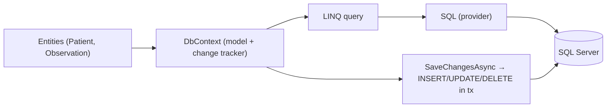
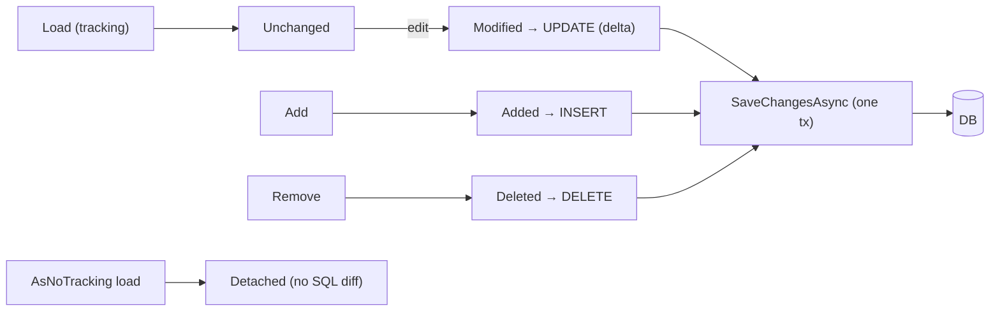
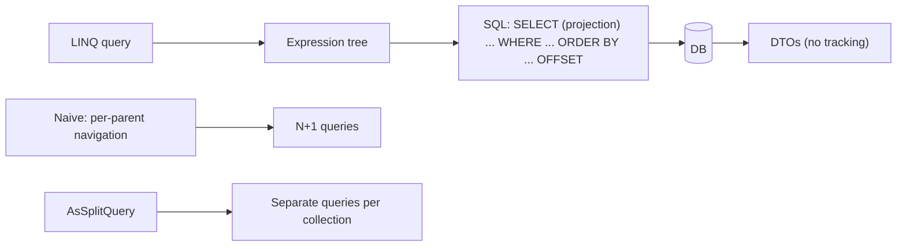
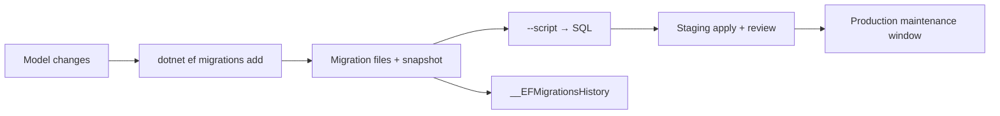
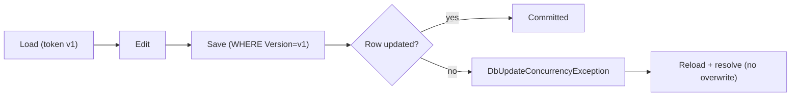
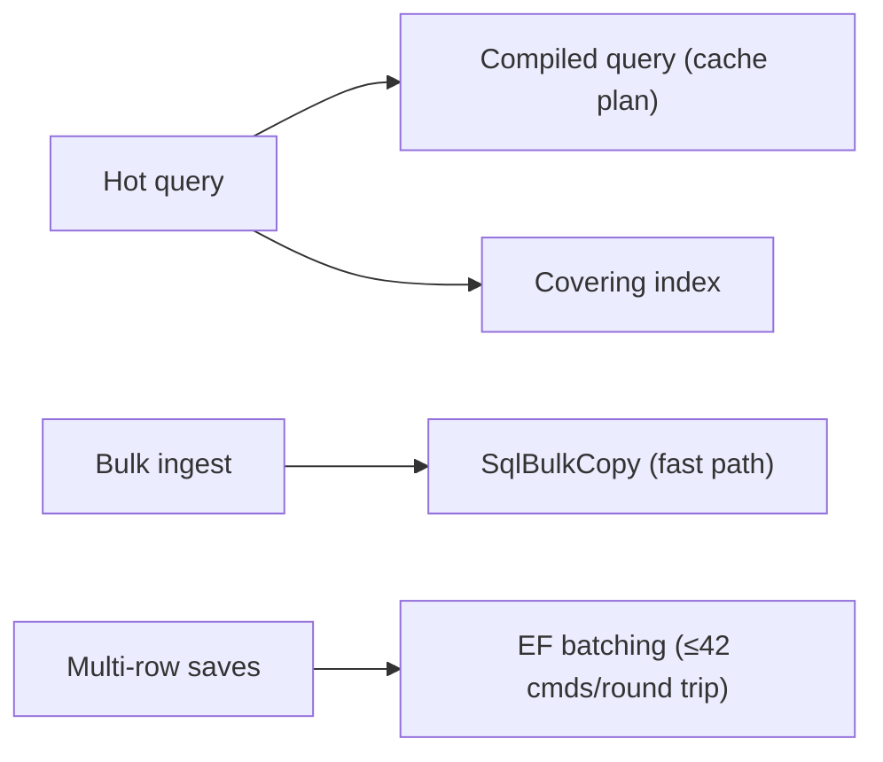
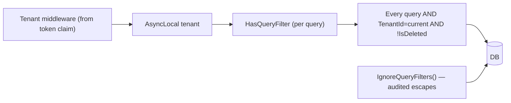
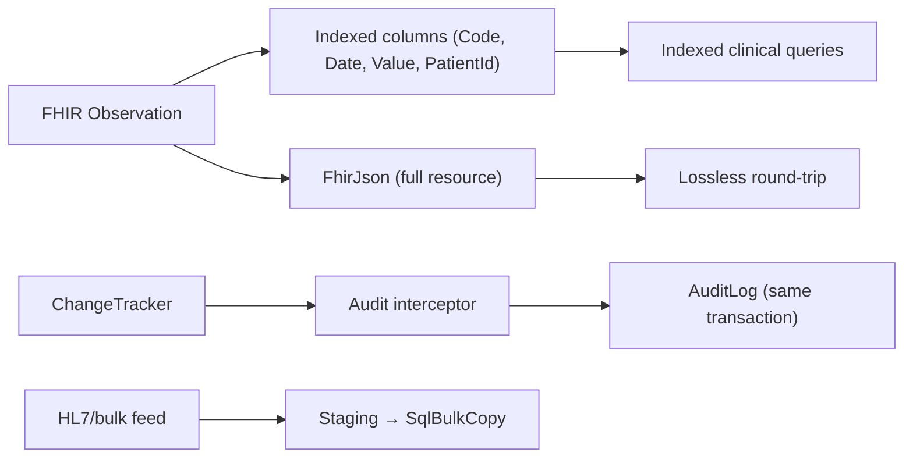

# Chapter 13: Entity Framework Core

> **Audience:** Experienced .NET developers (5+ years) preparing for an L2 (Mid/Senior) interview at a Healthcare company.
> **Scope:** EF Core fundamentals, the object-relational mapping model, DbContext lifetimes and design, change tracking, migrations, querying (LINQ, projections, splitting queries), tracking vs. no-tracking, raw SQL, transactions, concurrency handling, the N+1 problem, performance (indexing, batching, compiled queries), and healthcare-specific patterns (FHIR flat vs. normalized models, clinical audit, row-level security with tenant filters).

---

## 13.1 EF Core Fundamentals — ORM, DbContext, and DbSet

### Interview Answer (30–45 seconds)

> "EF Core is Microsoft's open-source object-relational mapper for .NET. It maps my domain classes to database tables, translates LINQ queries into SQL, tracks entity changes, and saves them back with `SaveChangesAsync`. The heart is the `DbContext` — a unit-of-work + repository façade: `DbSet<T>` properties model tables, the model is configured with data annotations or the fluent API, and one context instance tracks all loaded entities for one logical operation. In a healthcare system I use it for the clinical store, but I always think about the mapping cost: a FHIR `Patient` with nested resources maps carefully, and bulk clinical ingestion rarely maps to per-row `SaveChanges`."

### Detailed Explanation

**Core concepts:**

- **`DbContext`** — represents a session with the database: querying, change tracking, saving. Unit-of-work semantics (all changes in one `SaveChanges` become one transaction).
- **`DbSet<TEntity>`** — a typed collection property; queries start from it (`context.Patients.Where(...)`).
- **Entities** — POCOs; `[Key]`/`Id` conventions identify keys; navigation properties model relationships.
- **Model configuration:**
  - Data annotations: `[Table]`, `[Column]`, `[Required]`, `[MaxLength]`, `[Index]`.
  - Fluent API (`OnModelCreating`): more expressive — relationships, shadow properties, conversions, indexes, query filters. **Preferred for complex models.**
- **Providers:** SQL Server, SQLite, PostgreSQL, Cosmos DB, InMemory (tests), and others — the same model maps to different SQL dialects.

**The query/save lifecycle:**
1. LINQ query → expression tree → provider translates to SQL → results materialize into tracked (or untracked) entities.
2. Entities are modified; `DbSet.Update`/`Add`/`Remove` mark states.
3. `SaveChangesAsync` computes `INSERT`/`UPDATE`/`DELETE` from tracked state and executes in a transaction.

**Key decisions for a healthcare store:**
- Normalize clinical data into relational tables, or store FHIR JSON in a column and index select fields (a "hybrid" model).
- Design indexes around the query patterns (patient lookup, search by code/date).
- Consider tenant/row-level filtering via global query filters (multi-hospital deployments).

### Real World Example (Healthcare)

A clinical data service models `Patient`, `Encounter`, and `Observation` as EF entities. `Patient` has a unique `MRN` (medical record number); `Observation` references a `Code` (LOINC) and `PatientId`, indexed on `(PatientId, EffectiveDate)`. Searches like "last 10 observations for patient X with code 2093-3" become indexed LINQ queries. Bulk FHIR ingestion, by contrast, uses a bulk-copy path (see 13.8), not EF rows.

### Production Code Example

```csharp
public sealed class ClinicalDbContext : DbContext
{
    public ClinicalDbContext(DbContextOptions<ClinicalDbContext> options) : base(options) { }

    public DbSet<Patient> Patients => Set<Patient>();
    public DbSet<Encounter> Encounters => Set<Encounter>();
    public DbSet<Observation> Observations => Set<Observation>();

    protected override void OnModelCreating(ModelBuilder modelBuilder)
    {
        modelBuilder.Entity<Patient>(e =>
        {
            e.HasKey(p => p.Id);
            e.HasIndex(p => p.Mrn).IsUnique();
            e.Property(p => p.BirthDate).HasColumnType("date");
        });

        modelBuilder.Entity<Observation>(e =>
        {
            e.HasKey(o => o.Id);
            e.HasIndex(o => new { o.PatientId, o.Code, o.EffectiveDate });
            e.Property(o => o.Code).HasMaxLength(20);      // LOINC
        });
    }
}

// Registration (scoped — the correct lifetime)
builder.Services.AddDbContext<ClinicalDbContext>(o =>
    o.UseSqlServer(builder.Configuration.GetConnectionString("ClinicalDb"),
                   sql => sql.EnableRetryOnFailure(5)));
```

**Key lines explained:**

- Configuration lives in `OnModelCreating` — indexes and lengths are data-model decisions made explicitly.
- `EnableRetryOnFailure` gives transient-fault resilience for SQL Server (azure), important for clinical uptime.
- Scoped registration ties one context to one HTTP request (Chapter 8 lifetime rules).

### Internal Working

- EF builds a **model** at startup (`IModel`) from conventions, annotations, and fluent config; this is cached and reused.
- Queries: LINQ → `Expression` → provider-specific SQL via query pipeline; results hydrate entities.
- `SaveChangesAsync` diffs tracked entries against original values and generates commands in dependency order; executes inside a transaction (via `IDbContextTransaction`).

### Advantages

- Productivity: LINQ + strong typing + change tracking.
- Migrations keep schema in version control.
- Testable with InMemory/SQLite providers.

### Disadvantages

- Generated SQL can be inefficient if queries are written carelessly (N+1, giant selects).
- Full ORM overhead vs. Dapper for hot paths.
- Model/DB mismatch management (migrations) needs discipline.

### Best Practices

- Register `DbContext` as scoped; never singleton.
- Configure the model explicitly (indexes, lengths) rather than relying on defaults.
- Use `AsNoTracking` for read-only queries; use tracking where you'll save.
- Keep `SaveChanges` per logical unit of work; avoid per-item loops.

### Common Mistakes

- Singleton `DbContext` → stale change tracking, concurrency corruption.
- Tracking every read query → memory bloat and unintended updates.
- No indexes on query columns → table scans on clinical data.

### Interview Follow-up Questions

1. Why is `DbContext` scoped?
2. `DbSet` vs the repository pattern — when do you wrap EF?
3. How does EF decide the SQL for a LINQ query?

### Senior Level Talking Points

- "The DbContext is my unit of work — one request, one context, one transaction boundary. Anything else is where stale data bugs come from."
- "The model is a contract: indexes and query patterns are designed together, not discovered in production."

### Diagram



### Comparison Table

| Aspect | EF Core | Dapper |
|---|---|---|
| Abstraction | Full ORM | Micro-ORM (SQL) |
| Change tracking | Yes | No |
| Productivity | High | Medium |
| Control over SQL | Medium | Full |
| Perf ceiling | Good (tunable) | Higher |
| Best for | Complex domain models | Hot, explicit SQL paths |

### Memory Trick

**"Context = unit of work, DbSet = table, SaveChanges = transaction"** — the EF triad.

### Summary

EF Core maps entities to tables through a scoped `DbContext`, translates LINQ to SQL, and tracks changes for transactional saves. Explicit model config and correct lifetime are the foundation.

### Interview Confidence Score

**High.** EF Core fundamentals are a guaranteed topic; scoped-context reasoning and model-config awareness are the senior signals.

---

## 13.2 Change Tracking and Entity States

### Interview Answer (30–45 seconds)

> "Every entity a `DbContext` loads or attaches gets an entry in its change tracker with one of five states: `Added`, `Modified`, `Deleted`, `Unchanged`, and `Detached`. When I call `SaveChangesAsync`, EF diffs the *current* values against the *original* snapshot to emit the right SQL — `Modified` rows generate `UPDATE` statements that only include changed columns. The subtle part is that even a no-op change tracking costs memory, so for pure reads I use `AsNoTracking()`, and for bulk loads I detach. The classic bugs: stale tracking when the same entity is loaded twice, and unintended overwrites when reusing a tracked graph."

### Detailed Explanation

**The five states:**

| State | Meaning | SQL on Save |
|---|---|---|
| `Detached` | Not tracked | none |
| `Unchanged` | Tracked, no changes since load | none |
| `Added` | New, will be inserted | `INSERT` |
| `Modified` | Value changed | `UPDATE` (changed columns) |
| `Deleted` | Marked for removal | `DELETE` |

**Transition methods:**
- `context.Add(entity)` → `Added`.
- `context.Update(entity)` → `Modified` (whole graph by default).
- `context.Remove(entity)` → `Deleted`.
- `context.Entry(entity).State = ...` — manual override.

**How modification detection works:**
- **Snapshot change tracking** (default): EF stores original values on first load; at `SaveChanges`, current vs original are compared. Reliable, but compares every tracked property.
- **Change-tracking proxies** (`UseChangeTrackingProxies`): virtual properties notify on setter. Lighter comparisons, but requires proxy-friendly entities.
- **`ChangeTracker.AutoDetectChangesEnabled = false`** + manual `DetectChanges()` — a perf lever for bulk scenarios.

**The pitfalls:**
- Loading the same entity twice in one context returns the *same tracked instance* (identity resolution) — mutations affect the shared instance.
- `Update` on a graph marks *everything* modified — accidental overwrites of untouched fields.
- `NoTracking` entities returned to the context later need explicit `Attach`/`Update` to be tracked correctly.

### Real World Example (Healthcare)

A FHIR `Observation` update handler: load the existing record with tracking, apply only changed fields from the DTO, and save. Because snapshot tracking computes a delta, an update that only changes `value` won't overwrite `status`/`performedBy` that arrived unchanged in the request — a correctness concern in clinical records where every field matters for audit.

### Production Code Example

```csharp
public async Task UpdateObservationAsync(Guid id, ObservationUpdateDto dto, CancellationToken ct)
{
    var observation = await _db.Observations
        .Include(o => o.Components)                 // tracking on (default)
        .SingleAsync(o => o.Id == id, ct);

    // Copy only the fields the client may change — never blanket-replace.
    observation.Status = dto.Status;
    observation.Value = dto.Value;
    observation.UpdatedAt = DateTime.UtcNow;

    // Remove stale children: mark ones no longer present as Deleted
    foreach (var comp in observation.Components
                 .Where(c => dto.ComponentIds?.Contains(c.Id) != true).ToList())
        _db.Observations.Entry(observation).Collection(o => o.Components).TargetEntry(comp);
    // (in practice: _db.Remove(comp) per child — see EF docs on owned vs related)

    await _db.SaveChangesAsync(ct);
}
```

**Key lines explained:**

- Tracking is on (default) — the loaded entity *is* the change set.
- Only intentional fields are copied — a domain rule, not an EF rule.
- `SaveChangesAsync` emits an `UPDATE` with only the changed columns.

### Internal Working

- The change tracker holds `EntityEntry` objects keyed by reference identity.
- Snapshot tracking stores original values; `SaveChanges` compares current values to produce `PropertyValues` diffs.
- SQL generation uses the diff: `SET [Status] = @p0, [Value] = @p1` — untouched columns stay out of the `SET` clause.
- All tracked changes within `SaveChanges` execute atomically.

### Advantages

- Declarative updates — no hand-written SQL.
- Delta-based `UPDATE`s reduce write surface (audit-friendly).
- Identity resolution prevents duplicate instances.

### Disadvantages

- Memory overhead of tracking.
- Whole-graph `Update` surprises.
- Complexity around detached graphs (re-attach semantics).

### Best Practices

- Use tracking when you'll save; `AsNoTracking` for reads.
- Update field-by-field from DTOs; avoid `context.Update(wholeGraph)` for partial edits.
- Call `DetectChanges()` once before `SaveChanges` in hot loops (or disable auto-detect).
- Beware double-loading causing "another instance with same key is already being tracked."

### Common Mistakes

- `AsNoTracking()` everywhere then calling `SaveChanges` → nothing happens.
- `context.Update(entity)` overwriting fields the client shouldn't set.
- Tracking thousands of read entities → memory pressure.

### Interview Follow-up Questions

1. What is snapshot vs proxy change tracking?
2. What does `AsNoTracking` do to state?
3. How do you avoid the double-instance tracking exception?

### Senior Level Talking Points

- "Change tracking is the contract for correctness: I track only what I'll save, update only intentional fields, and treat `SaveChanges` as the transaction boundary — that's how clinical edits stay auditable."
- "For bulk ingestion I bypass tracking entirely (bulk copy) because per-row `SaveChanges` with tracking would be a memory and latency disaster."

### Diagram



### Comparison Table

| State | Tracked? | Save behavior |
|---|---|---|
| Detached | No | none |
| Unchanged | Yes | none |
| Added | Yes | INSERT |
| Modified | Yes | UPDATE (changed cols) |
| Deleted | Yes | DELETE |

### Memory Trick

**"Track to save, no-track to read, Update marks all, Add inserts, Remove deletes"** — the five-state cheat.

### Summary

Change tracking gives EF its unit-of-work behavior. Master the five states, the delta-based UPDATE, and the tracking/no-tracking trade-off — plus the field-by-field update rule for clinical edits.

### Interview Confidence Score

**High.** Change-tracking questions are a top EF interview topic; the delta and whole-graph-update pitfalls are the senior details.

---

## 13.3 Querying: LINQ, Projections, and Splitting

### Interview Answer (30–45 seconds)

> "EF translates LINQ to SQL with three levers I use constantly: **filters** push work to the database (`Where`, `OrderBy`, `Take`), **projections** via `Select` pull only the columns I need and avoid loading full entities, and **Include**/`ThenInclude` pull related data — but eager-loading everything blindly is the N+1 and 'giant cartesian product' trap. For clinical reads I project to DTOs (`Select(o => new ObservationDto(...))`) so the SQL selects exactly what the client needs, and I use `AsSplitQuery` when a query has multiple collection includes to avoid row multiplication."

### Detailed Explanation

**Core querying patterns:**

```csharp
// Filter + project + page — all pushed to SQL
var observations = await _db.Observations
    .AsNoTracking()
    .Where(o => o.PatientId == patientId && o.Code == "2093-3")
    .OrderByDescending(o => o.EffectiveDate)
    .Select(o => new ObservationDto(
        o.Id, o.Code, o.Value, o.EffectiveDate))     // projection: SELECT only these
    .Skip(0).Take(20)
    .ToListAsync(ct);
```

**Loading related data:**
- **Eager** — `.Include(o => o.Patient).ThenInclude(p => p.Contacts)` → JOINs (or split queries).
- **Explicit** — `await context.Entry(patient).Collection(p => p.Observations).LoadAsync()`.
- **Lazy** — `UseLazyLoadingProxies` → implicit loads on navigation access. Convenient, but hides I/O and causes N+1; **generally avoid in production.**

**Projection vs entity loading:**
- Projection (`Select` to DTO/anonymous) = SELECT a few columns; no tracking; smaller payloads.
- Entity loading = SELECT all columns + tracking overhead.

**Split queries (`AsSplitQuery`):**
- Multiple collection `Include`s in one query → cartesian explosion (rows = rowsA × rowsB).
- `AsSplitQuery` runs separate queries per collection — avoids the product, at the cost of more round-trips.
- `.AsSingleQuery()` is the default for one-query consistency; use split for many-to-many heavy graphs.

**The N+1 problem:**
- Loading parent entities, then accessing a navigation per parent → one extra query each.
- Detection: `context.Database.CommandTimeout` + logging SQL; `EnableSensitiveDataLogging` during dev; watch query counts.
- Fix: `Include`/projection or `AsSplitQuery`.

### Real World Example (Healthcare)

A patient-summary screen needs, per patient, the latest 5 observations. Naive code loads patients then iterates `.Observations` → N+1. Correct code: a single indexed query that projects `PatientId`, name, and the top-5 observations per patient (using `Take` in a projection, or a windowed subquery). The SQL stays small and the response is exactly the summary the clinician sees.

### Production Code Example

```csharp
// Efficient: one round-trip, exact columns, no N+1
var summary = await _db.Patients
    .AsNoTracking()
    .Where(p => p.TreatingPractitionerId == practitionerId)
    .Select(p => new PatientSummaryDto(
        p.Id,
        p.Mrn,
        p.FamilyName + ", " + p.GivenName,
        p.Observations
            .Where(o => o.Code == "2093-3")
            .OrderByDescending(o => o.EffectiveDate)
            .Take(5)                                   // top-5 per patient in SQL
            .Select(o => new ObservationLiteDto(o.Id, o.Value, o.EffectiveDate))
            .ToList()))
    .ToListAsync(ct);
```

**Key lines explained:**

- The whole thing is one query — no per-patient round trips.
- Projection trims columns; no tracking needed.
- `.Take(5)` inside the projection pushes the "top 5 per patient" into SQL (window function).

### Internal Working

- The query pipeline parses the expression tree and produces a provider-level SQL string with parameters.
- `Include`s become JOINs; collection includes with `AsSingleQuery` produce correlated subqueries/JOINs that multiply rows.
- Projections translate to `SELECT col1, col2 ...`.
- `Take`/`Skip` become `TOP`/`OFFSET`; `OrderBy` pushes to `ORDER BY`.

### Advantages

- Database-side filtering/sorting keeps memory tiny.
- Projections deliver exactly the client contract.
- Split queries solve cartesian blow-up.

### Disadvantages

- Eager-loading everything is easy to overuse (huge SQL).
- Lazy loading hides N+1 until production.
- Split queries add round-trips and can go stale mid-request (isolation).

### Best Practices

- Prefer projection over entity loading for reads.
- Use `Include` deliberately; switch to `AsSplitQuery` for multi-collection graphs.
- Never lazy-load in production hot paths.
- Log generated SQL in development; check query counts.

### Common Mistakes

- N+1 via lazy loading or per-item loops.
- Multi-collection `Include` causing cartesian blow-up.
- `Select(p => new PatientDto { Observations = p.Observations })` without `Take` loading all children.

### Interview Follow-up Questions

1. What is the N+1 problem and how do you fix it?
2. Eager vs explicit vs lazy loading?
3. When do you use `AsSplitQuery`?

### Senior Level Talking Points

- "I treat the query as the contract: project exactly what the screen needs, push ordering/paging to SQL, and let the query plan decide joins — then measure. That's how a patient-summary API stays fast at scale."
- "Lazy loading is the only loading mode I forbid in production code reviews."

### Diagram



### Comparison Table

| Loading | SQL | N+1 risk | Use |
|---|---|---|---|
| Projection | Few columns | Low | Reads, DTOs |
| Eager (Include) | JOINs | Low | Fixed graphs |
| Split query | Multiple queries | Low | Multi-collection |
| Explicit | On demand | Medium | Rare graphs |
| Lazy | Implicit per access | High | Avoid in prod |

### Memory Trick

**"Project to DTOs, Include deliberately, split the collections"** — the querying recipe.

### Summary

Query well by projecting, filtering, and ordering in SQL; include related data deliberately; split multi-collection queries; and never let lazy loading create N+1 in production.

### Interview Confidence Score

**High.** Querying is the most-tested EF topic — N+1, projections, and split queries are guaranteed senior questions.

---

## 13.4 Migrations, Model Synchronization, and Schema Management

### Interview Answer (30–45 seconds)

> "Migrations are EF's way of versioning the database schema alongside the model. Each migration is a snapshot of the model plus `Up`/`Down` operations; `dotnet ef migrations add X` generates it, `database update` applies it, and `database update --script` produces a deployable SQL script. The workflow I follow for a healthcare system: code-first, migrations committed to the repo, reviewed like code (they touch clinical schema!), applied in CI and production with **explicit, reviewed SQL scripts** rather than auto-applying `database update` in prod. I never let two developers generate overlapping migrations on the same branch without resolving them."

### Detailed Explanation

**The workflow:**

```
dotnet ef migrations add AddObservationIndex        # generates migration + snapshot
dotnet ef database update                            # applies to a dev DB
dotnet ef migrations script 1.0.0 ToLatest          # SQL script for prod/CI
dotnet ef database update --connection <conn>        # apply elsewhere
```

**What a migration contains:**
- `{Timestamp}_Name.cs` — `Up`/`Down` with `CreateTable`, `AddColumn`, `CreateIndex`, etc.
- `{Timestamp}_Name.Designer.cs` — model snapshot.
- `ModelSnapshot` in `Data/Migrations` — the current full model shape used for diffing.

**Deployment strategies:**
- `Database.Migrate()` at startup — convenient, but runs DDL automatically (risk in prod, requires connectivity/role perms).
- Apply migration scripts in a controlled deploy step (release pipeline runs the SQL) — **preferred for prod clinical schema**.
- Use a `migrations` job in Kubernetes that runs `dotnet ef database update` once before scaling.

**Handling schema drift / prod data:**
- Never edit an applied migration; create a new one.
- `--script --idempotent` for re-runnable scripts.
- Back up before clinical schema changes; stage migrations on a copy first.

**Risks with clinical data:**
- `AddColumn` with `NOT NULL` on a large table locks the table — plan with defaults, staged updates, or `ONLINE` options where supported.
- Renames: EF doesn't detect rename intent; use `[Column(Name=...)]` or manual migration with `RenameColumn`.

### Real World Example (Healthcare)

Adding a `SnapshotId` column to the `Observations` table (a million rows): the team generates a migration, reviews the SQL, applies it to staging, verifies the index `CREATE` plan and lock behavior, then runs the scripted migration in production during a maintenance window — not `Database.Migrate()` at startup, which could collide with traffic.

### Production Code Example

```csharp
// Migration (generated, then edited for reviewability)
public partial class AddObservationSnapshot : Migration
{
    protected override void Up(MigrationBuilder migrationBuilder)
    {
        migrationBuilder.AddColumn<Guid>(
            name: "SnapshotId",
            table: "Observations",
            type: "uniqueidentifier",
            nullable: true);                       // nullable first for large tables

        migrationBuilder.CreateIndex(
            name: "IX_Observations_SnapshotId",
            table: "Observations",
            column: "SnapshotId");
    }

    protected override void Down(MigrationBuilder migrationBuilder)
    {
        migrationBuilder.DropIndex(name: "IX_Observations_SnapshotId", table: "Observations");
        migrationBuilder.DropColumn(name: "SnapshotId", table: "Observations");
    }
}
```

**Key lines explained:**

- Column added nullable → backfill data → then enforce `NOT NULL` in a follow-up migration (the staged pattern).
- `Down` is written for rollback; scripts are reviewed and tested before prod.
- Migrations are committed and code-reviewed like any schema-affecting change.

### Internal Working

- EF stores the current model in `ModelSnapshot`; `migrations add` diffs it against the last migration to generate operations.
- The migrations history table (`__EFMigrationsHistory`) records applied migration IDs; `database update` applies pending ones in order.
- SQL generation targets the provider's dialect (e.g., `datetime2` vs `timestamp`).

### Advantages

- Schema as version-controlled code.
- Reviewable, scriptable, repeatable deployments.
- Round-trippable (`Up`/`Down`).

### Disadvantages

- Generated migrations often need human review (indexes, locks).
- Diffing can miss intent (renames).
- Auto-migrate-at-startup is risky in production.

### Best Practices

- Commit migrations; review them like code.
- Apply prod schema via reviewed, scripted SQL, not startup `Migrate()`.
- Back up before clinical schema changes; test on staging.
- Prefer nullable-then-backfill patterns for large tables.

### Common Mistakes

- `Database.Migrate()` at startup in prod (uncontrolled DDL).
- Editing an already-applied migration (drift).
- Adding a non-nullable column with default to a huge clinical table in one step.

### Interview Follow-up Questions

1. How do you deploy schema changes to production?
2. What's in a migration file?
3. How do you handle a large-table column add?

### Senior Level Talking Points

- "Schema is clinical infrastructure: migrations get the same review as code, and production applies scripted SQL in a maintenance window — `Migrate()` at startup is a dev convenience, not a deploy strategy."
- "For a million-row observations table I stage the change: add nullable, backfill, then enforce the constraint — each step reviewable and reversible."

### Diagram



### Comparison Table

| Approach | Control | Risk | Use |
|---|---|---|---|
| `Migrate()` at startup | Auto | DDL at traffic time | Dev/CI only |
| Scripted migrations | Manual | Low (reviewed) | Production |
| `--idempotent` script | Manual | Low | Multi-env replay |

### Memory Trick

**"Commit, script, stage, backfill"** — the prod schema change pipeline.

### Summary

Migrations version the schema with the model. Keep them reviewed, apply prod via scripted SQL, and use nullable-then-backfill for large clinical tables.

### Interview Confidence Score

**Medium-High.** Migrations/deployment questions appear often; the "don't auto-migrate prod clinical schema" stance is a strong senior answer.

---

## 13.5 Transactions, Concurrency, and Consistency

### Interview Answer (30–45 seconds)

> "`SaveChanges` runs inside its own transaction, but for multi-step operations I use explicit transactions: `BeginTransactionAsync`, then the saves, then `CommitAsync` — with `RollbackAsync` on failure. Concurrency is handled two ways: **pessimistic** locking (`rowversion`/`timestamp` + `[Timestamp]` properties) gives optimistic concurrency on `UPDATE` — EF checks the concurrency token in the `WHERE` clause and throws `DbUpdateConcurrencyException` on conflict. For healthcare, every clinical edit needs that guard: two clinicians editing the same record must not silently overwrite each other. I handle the conflict by reloading, showing the diff, and letting the user resolve."

### Detailed Explanation

**Transactions:**
- `SaveChanges` already wraps all its commands in a transaction — atomicity per save.
- Explicit transactions (`BeginTransactionAsync`) span multiple saves/queries, e.g., "create patient + assign to care team + audit" as one atomic unit.
- `IDbContextTransaction.CommitAsync`/`RollbackAsync`; dispose auto-rolls back.
- Can't span multiple databases (needs distributed tx / outbox).

**Concurrency control:**

1. **Optimistic (default):**
   - Concurrency token: `[Timestamp]` (SQL Server `rowversion`) or `[ConcurrencyCheck]` on a column.
   - On `UPDATE`, EF includes the original token value in the `WHERE` clause.
   - If another transaction already changed it → 0 rows affected → `DbUpdateConcurrencyException`.
   - Resolution: `dbContext.Entry(entity).ReloadAsync()` and retry, or present the conflict.

2. **Pessimistic:**
   - `SELECT ... WITH (UPDLOCK)` via raw SQL, or `FromSql` with a lock hint.
   - Needed when you must hold a lock across multiple statements (e.g., assigning a scarce resource like a slot).
   - Rare in web apps (long-held locks kill concurrency).

**Tenant/row-level consistency:**
- Global query filters apply `Where` at the model level (multi-tenant row isolation).
- Writes must set tenant on creation (shadow property + filter).

### Real World Example (Healthcare)

Two physicians update the same medication order's dose. Both load it; physician A saves first (token v1 → v2). Physician B saves with the stale token → 0 rows → `DbUpdateConcurrencyException`. The UI reloads the current record, shows "this order was changed by Dr. A", and B chooses to review and re-apply. No silent clinical overwrite.

### Production Code Example

```csharp
public sealed class MedicationOrder
{
    public Guid Id { get; set; }
    public string Dose { get; set; }
    [Timestamp] public byte[] Version { get; set; }    // concurrency token
}

public async Task<UpdateResult> UpdateDoseAsync(Guid orderId, string newDose, CancellationToken ct)
{
    await using var tx = await _db.Database.BeginTransactionAsync(ct);
    try
    {
        var order = await _db.MedicationOrders.SingleAsync(o => o.Id == orderId, ct);
        order.Dose = newDose;

        try
        {
            await _db.SaveChangesAsync(ct);            // WHERE includes original Version
            await tx.CommitAsync(ct);
            return UpdateResult.Saved;
        }
        catch (DbUpdateConcurrencyException ex)
        {
            await tx.RollbackAsync(ct);
            await ex.Entries.Single().ReloadAsync(ct);  // load current state
            return UpdateResult.Conflict(_db.MedicationOrders.Local); // diff data
        }
    }
    catch
    {
        await tx.RollbackAsync(ct);
        throw;
    }
}
```

**Key lines explained:**

- `[Timestamp]` produces a `rowversion` — the concurrency token.
- `SaveChanges` fails atomically; the exception exposes the conflicting entry.
- `ReloadAsync` gives the caller current values to diff and resolve.

### Internal Working

- The token is read into the original snapshot on load; `SaveChanges` adds `WHERE [Version] = @origVersion`.
- Rows affected == 0 → EF throws `DbUpdateConcurrencyException` (wrapping `SqlException` with count mismatch).
- Explicit transactions issue `BEGIN TRAN`/`COMMIT` around the operation and honor `IsolationLevel`.
- Global query filters inject `WHERE` predicates at model level automatically.

### Advantages

- Atomic multi-step operations.
- Optimistic concurrency is cheap and scale-friendly.
- Filters enforce multi-tenant isolation by construction.

### Disadvantages

- Optimistic concurrency needs a retry/resolution UX.
- Pessimistic locks hurt throughput in web scenarios.
- Transactions don't span databases without distributed coordination.

### Best Practices

- Use explicit transactions only when a single `SaveChanges` isn't enough.
- Concurrency token on every mutable clinical aggregate.
- Handle `DbUpdateConcurrencyException` with reload-and-resolve, never silent overwrite.
- Use global query filters for tenant row isolation.

### Common Mistakes

- Swallowing `DbUpdateConcurrencyException` → silent lost updates.
- Long pessimistic locks in web requests.
- Multi-database writes without outbox/distributed tx.

### Interview Follow-up Questions

1. When is an explicit transaction necessary?
2. Optimistic vs pessimistic — when each?
3. How do you resolve a concurrency conflict in the UI?

### Senior Level Talking Points

- "Clinical writes are never silent-last-write-wins. The concurrency token plus a reload-and-resolve UX is the only acceptable model for shared patient records."
- "Global query filters give me tenant isolation at the model layer, so a coding mistake can't cross hospital boundaries."

### Diagram



### Comparison Table

| Concurrency | Mechanism | Blocking | Use |
|---|---|---|---|
| Optimistic | Token in WHERE | No | Default, web-friendly |
| Pessimistic | UPDLOCK | Yes | Scarce resources, short critical sections |
| None | — | — | Never for shared clinical data |

### Memory Trick

**"Token in the WHERE, conflict on zero rows"** — how optimistic concurrency actually works.

### Summary

Explicit transactions give atomicity across steps; optimistic concurrency via `[Timestamp]` prevents silent clinical overwrites. Handle conflicts by reload-and-resolve.

### Interview Confidence Score

**High.** Transactions and concurrency are core senior EF topics, and the clinical-editing example lands strongly.

---

## 13.6 Performance: N+1, Indexes, Batching, Compiled Queries, Raw SQL

### Interview Answer (30–45 seconds)

> "EF performance is won or lost on four fronts: **N+1** (fix with projections/includes), **indexes matching query patterns**, **batching** (EF 5+ batches multiple commands into one round-trip by default), and **not over-tracking**. For hot, read-heavy queries I use `AsNoTracking`, sometimes **compiled queries** (`EF.CompileAsyncQuery`) to skip expression-tree compilation, and I profile the generated SQL. When the ORM gets in the way — bulk clinical ingestion, complex reporting — I drop to raw SQL (`FromSqlRaw`/`ExecuteSqlInterpolated` or Dapper/BulkCopy) without leaving the DbContext. The discipline is: measure, then optimize the specific query."

### Detailed Explanation

**The four levers:**

1. **N+1 elimination** — `Include`/projection/`AsSplitQuery` (13.3).
2. **Indexes** — design from the query patterns:
   - `WHERE`/`JOIN`/`ORDER BY` columns.
   - Composite indexes for multi-column filters (`PatientId + Code + EffectiveDate`).
   - Covering indexes via `Include` (`INCLUDE (col)` in SQL Server) to avoid lookups.
   - Watch out: unnecessary indexes slow writes; measure the workload.
3. **Batching** — EF 5+ batches up to 42 commands (`MaxBatchSize`) into one round-trip; `SaveChanges` with many inserts is dramatically cheaper than per-command.
4. **Compiled queries** — `EF.CompileAsyncQuery((db, patientId) => ...)` avoids per-call expression-tree translation for hot queries; marginal but real at high QPS.

**Raw SQL when appropriate:**
- `FromSqlRaw`/`FromSqlInterpolated` for complex queries (window functions, CTEs).
- `ExecuteSqlInterpolatedAsync` for targeted DML.
- `SqlBulkCopy` for bulk clinical ingestion (thousands of rows) — bypasses EF, loads in seconds.

**Measurement:**
- Log generated SQL (`EnableSensitiveDataLogging` in dev; `ToQueryString()`).
- Use `Miniprofiler`/EF Core diagnostics listeners for per-query timing in dev.
- Check the actual query plan for missing-index hints in prod.

### Real World Example (Healthcare)

Nightly bulk import of 50,000 lab observations: a per-row `Add + SaveChanges` would take minutes (tracking + N commands). The production path uses `SqlBulkCopy` into a staging table, then a single indexed `MERGE`/`UPDATE` statement (or EF with batching + `AsNoTracking`-style detached inserts) — completing in seconds. Meanwhile a patient-dashboard query uses a compiled query + covering index to serve sub-10ms reads.

### Production Code Example

```csharp
// Compiled query for a hot read (avoid re-compiling the tree each call)
private static readonly Func<ClinicalDbContext, Guid, Task<PatientSummaryDto?>> PatientSummary =
    EF.CompileAsyncQuery((ClinicalDbContext db, Guid patientId) =>
        db.Patients.AsNoTracking()
          .Where(p => p.Id == patientId)
          .Select(p => new PatientSummaryDto(p.Id, p.Mrn, p.FamilyName, p.GivenName))
          .FirstOrDefault());

// Used as: var dto = await PatientSummary(_db, id, ct);

// Raw SQL for a reporting CTE that's awkward in LINQ
var rows = await _db.Observations
    .FromSqlInterpolated($@"
        WITH ranked AS (
          SELECT *, ROW_NUMBER() OVER (PARTITION BY PatientId ORDER BY EffectiveDate DESC) rn
          FROM Observations
          WHERE Code = {code})
        SELECT * FROM ranked WHERE rn <= {topN}")
    .AsNoTracking()
    .ToListAsync(ct);

// Bulk ingestion (outside EF's row-by-row path)
var bulk = new SqlBulkCopy(connection, SqlBulkCopyOptions.KeepIdentity, tx);
bulk.DestinationTableName = "ObservationStaging";
await bulk.WriteToServerAsync(dataTable, ct);
```

**Key lines explained:**

- Compiled query caches translation for the hottest read.
- `FromSqlInterpolated` (parameterized!) keeps the SQL injection-safe while expressing a window function cleanly.
- `SqlBulkCopy` is the right tool when EF's per-row model would be the bottleneck.

### Internal Working

- Batching groups multiple commands into a single `SqlCommand` batch; parameters are combined.
- Compiled queries cache the translation plan keyed by the query's shape.
- `FromSqlInterpolated` parameterizes interpolated values automatically.
- `SqlBulkCopy` streams data through a provider-specific bulk protocol (fast path).

### Advantages

- Order-of-magnitude gains for hot queries and bulk loads.
- Stays in one toolset (you don't abandon EF for Dapper everywhere).
- Measurement-driven optimization avoids premature complexity.

### Disadvantages

- Raw SQL forfeits model-level safety (typeless columns, no filters automatically).
- Compiled queries add code complexity.
- Batching has limits (huge batches need chunking).

### Best Practices

- Profile first; optimize the specific hot query.
- Design indexes from real query patterns; review missing-index hints.
- Use batching for multi-row saves; `SqlBulkCopy` for bulk ingest.
- Keep raw SQL parameterized.

### Common Mistakes

- Adding indexes blindly (write slowdown for no read gain).
- Per-row `SaveChanges` in loops.
- Unparameterized raw SQL (injection).
- Optimizing before measuring.

### Interview Follow-up Questions

1. When do you use raw SQL over LINQ?
2. How does EF batching work?
3. How do you decide what indexes to create?

### Senior Level Talking Points

- "I optimize the two hot paths — patient reads and bulk ingest — with measurement: covering indexes for the reads, `SqlBulkCopy` for the writes, and EF everywhere in between."
- "Compiled queries are the last 5%, not the first. The first 95% is projections, indexes, and batching."

### Diagram



### Comparison Table

| Technique | Cost | Payoff |
|---|---|---|
| Projections + AsNoTracking | Free | Memory + payload |
| Indexes | Write cost | Read speed |
| Batching | None | Fewer round-trips |
| Compiled queries | Code clutter | Small constant win |
| SqlBulkCopy | Tooling | Massive for bulk |

### Memory Trick

**"Measure, index, batch, then compile"** — the EF perf order of operations.

### Summary

EF performance = projections, indexes, batching, and selective raw SQL. Profile first, use compiled queries only for the hottest reads, and reach for `SqlBulkCopy` for bulk clinical ingestion.

### Interview Confidence Score

**High.** EF performance is a top senior interview topic; specific levers plus measurement discipline are the differentiators.

---

## 13.7 Global Query Filters, Tenancy, and Soft Deletes

### Interview Answer (30–45 seconds)

> "Global query filters are model-level `Where` clauses EF appends to every query for a given entity — I use them for multi-tenant row isolation (`TenantId == currentTenant`), soft deletes (`IsDeleted == false`), and clinical-data scoping. They're declared once in `OnModelCreating`, and EF automatically adds them to queries — with the escape hatch `IgnoreQueryFilters()` when I must cross them (admin, export). The two subtleties: the filter value must come from a resolvable source (I store the current tenant in a scoped `TenantContext` populated by middleware), and navigation-based filters need care. This is how I guarantee a coding mistake can't read another hospital's patients."

### Detailed Explanation

**Defining a filter:**

```csharp
modelBuilder.Entity<Patient>(e =>
{
    e.HasQueryFilter(p => p.TenantId == _tenantProvider.CurrentTenantId
                          && !p.IsDeleted);
});
```

- Applied to all queries (`ToList`, `First`, `Count`, includes).
- EF merges filters across entities in a join (AND).

**Sources of the filter value:**
- Static expression with a captured value is evaluated at compile — wrong for per-request tenancy.
- Correct: reference a property/field that the filter expression reads **at query time** (a `TenantProvider` singleton returning the scoped current tenant via `AsyncLocal`), or use `HasQueryFilter(p => p.TenantId == EF.Property<Guid>(...)` patterns.
- Common design: a singleton `ITenantProvider` backed by `AsyncLocal<Guid>` set by tenant middleware (Chapter 10).

**Soft deletes:**
- `IsDeleted` flag + filter `!IsDeleted`; hard delete becomes update.
- Implications: unique indexes must account for the flag; referential integrity semantics change.

**Escaping filters:**
- `.IgnoreQueryFilters()` — admin tooling, export jobs, cleanup workers.
- Explicit, deliberate, and audited.

**Writes and filters:**
- Filters apply to reads; writes must still set `TenantId` (shadow property + `HasQueryFilter` on the same property is a common pairing).

### Real World Example (Healthcare)

A multi-tenant hospital platform: every clinical table has `TenantId`. Tenant middleware resolves the hospital from the token's `tenant` claim and sets an `AsyncLocal`. All queries automatically filter by that tenant, and soft-deleted records disappear from clinical queries but remain for audit/retention. A cross-tenant bug becomes literally impossible at the query layer.

### Production Code Example

```csharp
public sealed class TenantContext
{
    private static readonly AsyncLocal<Guid?> Current = new();
    public Guid TenantId => Current.Value ?? throw new InvalidOperationException("No tenant in context");
    public static void SetTenant(Guid id) => Current.Value = id;
}

public sealed class TenantFilterProvider(ITenantAccessor tenant)
{
    public Guid CurrentTenantId => tenant.TenantId;   // resolves per-request at query time
}

// Middleware sets the tenant from the authenticated principal
app.Use(async (ctx, next) =>
{
    var tenantClaim = ctx.User.FindFirstValue("tenant");
    if (Guid.TryParse(tenantClaim, out var tenantId))
        TenantContext.SetTenant(tenantId);
    await next(ctx);
});

// Model applies the filter reading the provider at query time
modelBuilder.Entity<Patient>(e =>
{
    e.HasQueryFilter(p => p.TenantId == provider.CurrentTenantId);
});

// Escape hatch — export job only, audited
var all = await _db.Patients.IgnoreQueryFilters()
    .Where(p => p.UpdatedAt >= since)
    .ToListAsync(ct);
```

**Key lines explained:**

- The filter expression reads `provider.CurrentTenantId` **per query** — correct per-request behavior.
- `IgnoreQueryFilters` is the deliberate, rare escape.
- Middleware sets the tenant from the validated token claim.

### Internal Working

- `HasQueryFilter` stores a `LambdaExpression` in model metadata; the query pipeline composes it with user `Where`s (AND).
- Because the expression references the provider, EF evaluates it at translation time — so the current tenant is captured per request.
- Joins merge applicable filters so related entities are scoped too.

### Advantages

- Tenant isolation and soft deletes enforced by construction.
- One place to define the rule — impossible to forget.
- Composes with user filters automatically.

### Disadvantages

- A per-request filter requires the AsyncLocal/singleton plumbing.
- `.IgnoreQueryFilters()` misuse can leak data if not audited.
- Filters on every query add a tiny WHERE-clause cost.

### Best Practices

- Resolve filter values at query time (never a compile-time constant).
- Set tenant from validated token claims in middleware.
- Audit every `IgnoreQueryFilters()` usage.
- Pair soft-delete filters with the corresponding write logic.

### Common Mistakes

- Capturing a fixed tenant in the filter expression (all tenants collapse to one).
- `IgnoreQueryFilters()` scattered in production paths.
- Filtering reads but not enforcing `TenantId` on writes.

### Interview Follow-up Questions

1. How do you make a query filter per-request?
2. What are the trade-offs of soft deletes?
3. When do you use `IgnoreQueryFilters`?

### Senior Level Talking Points

- "Tenant filters are the enforcement point: even a buggy join can't cross hospital boundaries because the WHERE is composed by the model, not the developer."
- "Soft delete is a retention decision, not a convenience — the filter hides records from clinical queries while the audit trail keeps them."

### Diagram



### Comparison Table

| Concern | Without filter | With filter |
|---|---|---|
| Tenant isolation | Developer discipline | Enforced by model |
| Soft delete | Every query adds where | One declaration |
| Cross-tenant bug | Possible | Structurally blocked |
| Escape | n/a | Explicit + audited |

### Memory Trick

**"The model enforces what developers can forget"** — that's the value of query filters.

### Summary

Global query filters enforce tenant isolation and soft deletes at the model layer. Resolve values per request, audit escapes, and pair filter reads with write-side tenant enforcement.

### Interview Confidence Score

**Medium-High.** Tenancy/query-filter questions are common in multi-tenant healthcare platforms; the per-request resolution detail is the senior answer.

---

## 13.8 EF Core in Healthcare: FHIR Mapping, Audit, and Clinical Patterns

### Interview Answer (30–45 seconds)

> "Healthcare data poses two EF design questions: how to map FHIR's flexible resources, and how to satisfy audit/retention. For mapping, I use a **hybrid model**: strong relational tables for the queryable core (patient demographics, encounters, observation codes/dates/values) plus a JSON column (`JsonDocument`/`string`) storing the full FHIR resource for round-tripping — indexed on the relational fields that queries filter. For audit, every mutable clinical table carries `CreatedBy`, `CreatedAt`, `UpdatedBy`, `UpdatedAt`, and I write an **audit trail** (via an EF `SaveChanges` interceptor or outbox) capturing before/after diffs — the minimum-necessary, HIPAA-accountable story. Bulk HL7/FHIR ingest goes through `SqlBulkCopy`/staging, never row-by-row EF."

### Detailed Explanation

**FHIR mapping options:**

1. **Fully normalized** — every FHIR element as a column/table. Query-friendly but brittle: FHIR extensions break schema.
2. **Full JSON document** — store the resource as JSON, index a few fields (SQL Server JSON columns, `OPENJSON` queries). Flexible, but ad-hoc queries are awkward and indexing limited.
3. **Hybrid (recommended)** — core queryable fields as columns with indexes; full resource as JSON for fidelity. Best of both: fast clinical queries (LOINC code + date + patient) and lossless round-trip.

**EF specifics for hybrid:**
- Value converters / `Json` columns (`Microsoft.EntityFrameworkCore.Storage.Json` in EF8+; or `string` with `HasColumnType("nvarchar(max)")`).
- Computed/self-defined indexes on extracted fields (SQL Server can index JSON fields via computed columns).

**Clinical audit pattern:**
- Audit columns on tables + an `AuditLog` table.
- Implement via an `ISaveChangesInterceptor` (`SaveChangesAsync` hook) that computes before/after diffs from `ChangeTracker` and writes audit rows in the same transaction.
- Content: entity, key, actor, timestamp, changed properties (old→new). No PHI beyond what's operationally necessary; log actions not full records where possible.

**Bulk ingestion:**
- HL7 feeds/CSV → staging table → validated → `SqlBulkCopy` → reconcile. EF handles interactive CRUD; bulk paths bypass it.

**Row-level / retention:**
- Soft deletes + retention jobs (delete > N years per policy).
- Immutable audit log (append-only), possibly separate store.

### Real World Example (Healthcare)

An observation store keeps `Code` (LOINC), `EffectiveDate`, `Value`, `Status`, `PatientId` as indexed columns, plus `FhirJson` (nvarchar max) with the original FHIR `Observation` resource. Queries like "latest A1C (code 4548-4) for patient X" hit the index; when a client needs the full resource, EF returns `FhirJson` and deserializes. The `SaveChanges` interceptor writes every clinical change to `AuditLog` with actor/tenant/timestamp.

### Production Code Example

```csharp
public sealed class Observation
{
    public Guid Id { get; set; }
    public Guid PatientId { get; set; }
    public string Code { get; set; }            // LOINC
    public DateTimeOffset EffectiveDate { get; set; }
    public string? Value { get; set; }
    public string Status { get; set; }
    public string FhirJson { get; set; }         // full resource for round-trip
}

// Interceptor writing audit diffs atomically
public sealed class AuditSaveInterceptor(IAuditWriter audit) : SaveChangesInterceptor
{
    public override async ValueTask<int> SaveChangesAsync(
        SaveChangesInterceptorContext context,
        ValueTask<int> result, CancellationToken ct = default)
    {
        var entries = context.Context.ChangeTracker.Entries<IAuditedEntity>()
            .Where(e => e.State is EntityState.Added or EntityState.Modified or EntityState.Deleted)
            .ToList();

        var changes = entries.Select(e => new AuditRecord(
            Table: e.Entity.GetType().Name,
            Key: e.Property("Id").CurrentValue?.ToString(),
            Action: e.State.ToString(),
            Diff: BuildDiff(e))).ToList();

        if (changes.Count > 0)
            await audit.WriteAsync(changes, ct);      // same transaction / outbox

        return await base.SaveChangesAsync(context, result, ct);
    }
}

builder.Services.AddDbContext<ClinicalDbContext>(o =>
    o.UseSqlServer(conn).AddInterceptors(new AuditSaveInterceptor(...)));
```

**Key lines explained:**

- Hybrid mapping: indexed queryable columns + `FhirJson` fidelity.
- The interceptor observes the change tracker and writes audit in the same transaction — no separate code paths.
- Diff content is minimal (property names + old/new), PHI-conscious.

### Internal Working

- Interceptors hook the EF command pipeline; `SaveChangesAsync` interceptors run before the actual save.
- The change tracker exposes original vs current property values, enabling accurate diffs.
- JSON columns: EF 8+ supports `Json` column types with `ToJson()`; older providers use string columns with client-side serialize/deserialize.

### Advantages

- Fast indexed clinical queries + lossless FHIR fidelity.
- Audit as a cross-cutting interceptor (no per-repository code).
- Bulk paths keep ingest fast.

### Disadvantages

- Hybrid mapping needs disciplined code (keep JSON and columns in sync).
- JSON queries are less expressive than relational ones.
- Interceptor-based audit adds write-path complexity.

### Best Practices

- Index the queryable core; keep the full resource as JSON.
- Audit via interceptor in the same transaction; keep diffs minimal.
- Route bulk ingest through staging + `SqlBulkCopy`.
- Model soft deletes + retention jobs per policy.

### Common Mistakes

- Fully-normalized schema that breaks on FHIR extensions.
- JSON-only schema with unindexed queries (full scans on clinical search).
- No audit trail → can't answer "what changed and who did it."

### Interview Follow-up Questions

1. How do you map FHIR resources with EF?
2. How do you implement an audit trail?
3. When does EF not fit — and what do you use?

### Senior Level Talking Points

- "The hybrid model is a contract: the columns serve the query patterns, the JSON preserves the clinical source of truth — so neither the app nor the compliance review is short-changed."
- "Audit isn't a feature, it's a structural obligation: interceptor + same-transaction write means no code path can skip it."

### Diagram



### Comparison Table

| Model | Queries | FHIR fidelity | Complexity |
|---|---|---|---|
| Fully normalized | Great | Poor (extensions) | High |
| Full JSON | Weak | Excellent | Low |
| Hybrid | Great | Excellent | Medium (recommended) |

### Memory Trick

**"Columns for queries, JSON for truth, interceptor for audit"** — the healthcare EF triad.

### Summary

Map FHIR with a hybrid model (indexed queryable core + full JSON), enforce audit via a `SaveChanges` interceptor writing in the same transaction, and reserve bulk paths (SqlBulkCopy) for ingest. This is the EF answer a healthcare team wants to hear.

### Interview Confidence Score

**High (healthcare).** Hybrid FHIR mapping and interceptor-based audit are exactly the senior, domain-specific answers this interview rewards.

---

## Chapter 13 Wrap-Up

### Top 10 Questions You Should Be Ready For

1. What is EF Core and how does it map models to a database?
2. Why is `DbContext` scoped?
3. What are the entity states and how does change tracking work?
4. What is the N+1 problem and how do you fix it?
5. Eager vs explicit vs lazy loading — when each?
6. How do you manage migrations in production?
7. How does optimistic concurrency work in EF?
8. What are the four main EF performance levers?
9. How do global query filters enforce tenancy?
10. How do you map FHIR resources and audit clinical data with EF?

### Revision Notes (1 page)

- **Fundamentals:** `DbContext` = unit of work (scoped); `DbSet` = table; LINQ → SQL; `SaveChanges` = one transaction. Configure model explicitly (indexes, lengths, relationships).
- **States:** Detached/Unchanged/Added/Modified/Deleted; snapshot tracking diffs current vs original; `AsNoTracking` for reads; field-by-field updates (never whole-graph `Update` for partial edits).
- **Querying:** project to DTOs, filter/order/page in SQL; `Include` deliberately; `AsSplitQuery` for multi-collection; no lazy loading in prod (N+1).
- **Migrations:** code-first, commit + review; prod via scripted SQL (`--script`), not startup `Migrate()`; nullable-then-backfill for large tables; never edit applied migrations.
- **Transactions/concurrency:** explicit `BeginTransaction` spans steps; `[Timestamp]` + `DbUpdateConcurrencyException` = optimistic control; reload-and-resolve, never silent overwrite.
- **Performance:** measure first; projections, indexes (from query patterns), batching (EF 5+), compiled queries for hot reads, `SqlBulkCopy` for bulk ingest; parameterized raw SQL.
- **Tenancy/soft delete:** `HasQueryFilter` reading a per-request provider (AsyncLocal); `IgnoreQueryFilters` only for audited escapes.
- **Healthcare:** hybrid FHIR mapping (indexed columns + JSON), audit via `SaveChanges` interceptor in the same transaction, staging + `SqlBulkCopy` for bulk ingest.

### Things Interviewers Expect From 5+ Years Experience

- Scoped-DbContext and lifetime reasoning without hesitation.
- Change-tracking nuance (delta UPDATEs, detached-graph pitfalls).
- Query efficiency: N+1, projections, split queries — with examples.
- Production migrations discipline (no auto-migrate in prod).
- Optimistic concurrency + reload-resolve for shared clinical data.
- Tenancy via query filters and audit via interceptors.
- Knowing when EF is the wrong tool (bulk ingest → SqlBulkCopy).

### Cheat Sheet

```
CONTEXT: scoped (per request) = unit of work + transaction boundary
STATES: Detached / Unchanged / Added / Modified / Deleted
  reads → AsNoTracking | edits → tracking + field-by-field

QUERYING:
  project to DTOs (Select) · filter/order/page in SQL
  Include deliberately · AsSplitQuery for multi-collection
  NO lazy loading in prod (N+1)

MIGRATIONS: commit+review · prod = scripted SQL · backfill large tables

CONCURRENCY: [Timestamp] token in WHERE → 0 rows → DbUpdateConcurrencyException
  → Reload + resolve (never silent overwrite)

PERF (measure first):
  projections → indexes → batching → compiled queries → SqlBulkCopy

TENANCY: HasQueryFilter reading per-request provider (AsyncLocal)
  IgnoreQueryFilters() only audited escapes

HEALTHCARE:
  hybrid FHIR: indexed columns + FhirJson
  audit via SaveChangesInterceptor (same tx)
  bulk ingest via staging + SqlBulkCopy
```

### Flash Cards

**Q1:** Why scoped DbContext? **A:** One request, one context, one transaction boundary; singleton tracking would corrupt state.

**Q2:** Five entity states? **A:** Detached, Unchanged, Added, Modified, Deleted.

**Q3:** `AsNoTracking` use? **A:** Read-only queries — no snapshot/memory cost.

**Q4:** N+1 problem? **A:** Per-parent navigation queries; fix with Include/projection/split.

**Q5:** Lazy loading in prod? **A:** Avoid — hides N+1 until load.

**Q6:** Split query? **A:** Separate queries per collection include — avoids cartesian blow-up.

**Q7:** Optimistic concurrency token? **A:** `[Timestamp]` → rowversion; WHERE checks it; 0 rows → exception.

**Q8:** Migrations in prod? **A:** Reviewed scripted SQL, not startup `Migrate()`.

**Q9:** Big EF perf levers? **A:** Projections, indexes, batching, compiled queries, SqlBulkCopy.

**Q10:** Tenant isolation? **A:** Global query filter reading a per-request provider.

**Q11:** Soft delete? **A:** `IsDeleted` + filter; keeps audit/retention data.

**Q12:** FHIR mapping? **A:** Hybrid — indexed queryable columns + full JSON.

**Q13:** Audit trail? **A:** SaveChangesInterceptor writing diffs in the same transaction.

**Q14:** Bulk ingest tool? **A:** SqlBulkCopy to staging (EF row-by-row is wrong tool).

### Interview Confidence Score

**High.** EF Core is among the most-tested topics at L2+. This chapter covers the full arc — fundamentals, change tracking, querying, migrations, concurrency, performance, tenancy, and the healthcare-specific hybrid/audit patterns. Expect several EF questions in any .NET interview.

---

*Continue → Chapter 14: SQL Server*
