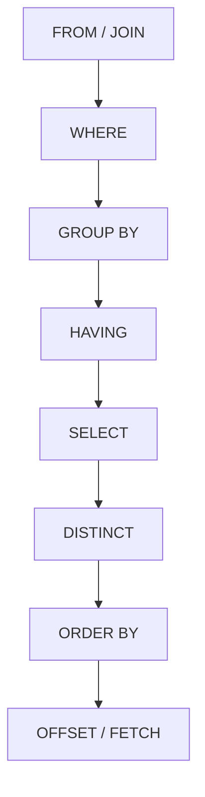
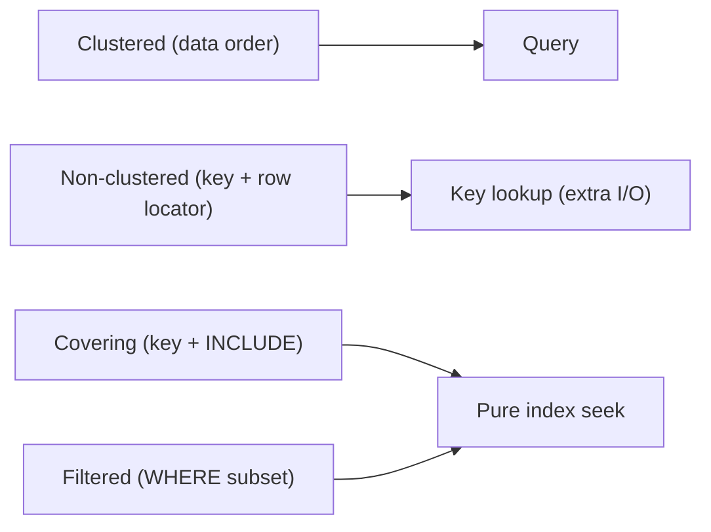
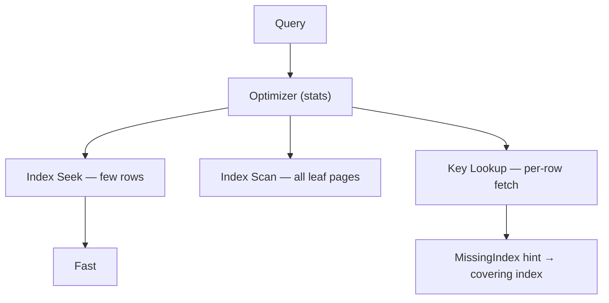
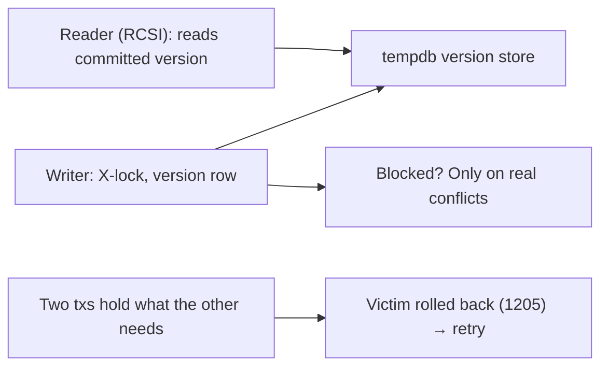
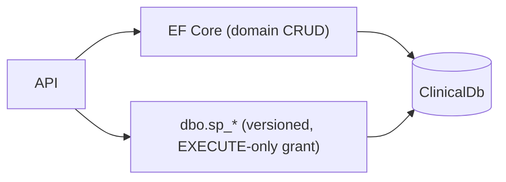
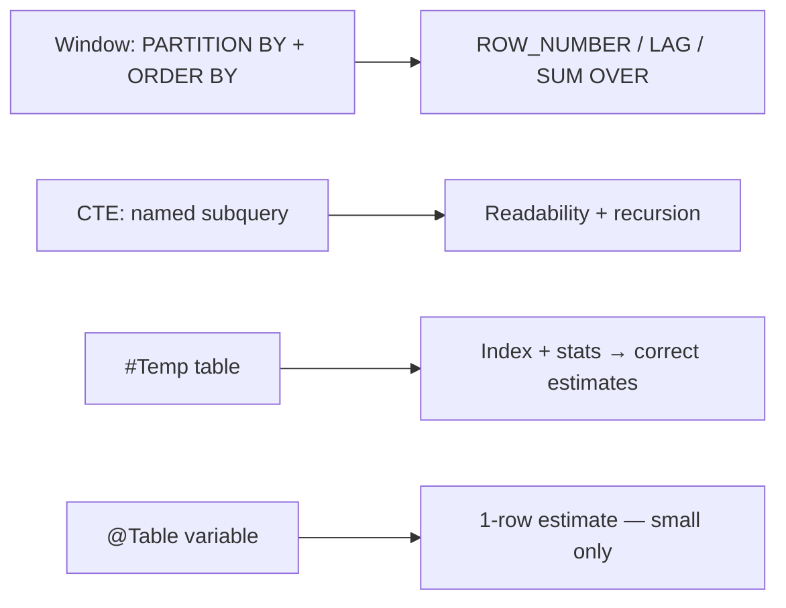
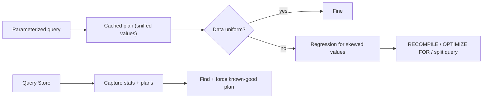
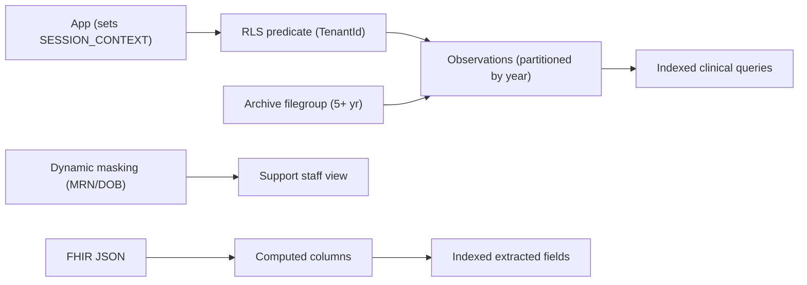

# Chapter 14: SQL Server

> **Audience:** Experienced .NET developers (5+ years) preparing for an L2 (Mid/Senior) interview at a Healthcare company.
> **Scope:** T-SQL fundamentals, indexing (clustered, non-clustered, covering, filtered), query plans, joins, transactions and isolation levels, locking and blocking, deadlocks, stored procedures vs. EF, CTEs and window functions, temp tables vs. table variables, and healthcare-specific concerns (clinical query tuning, row-level security, FHIR SQL Server mappings, large-table maintenance).

---

## 14.1 SQL Server Fundamentals and the T-SQL You Must Own

### Interview Answer (30–45 seconds)

> "SQL Server is a relational database engine that stores, indexes, and serves data with a client-server model. For an interview, the T-SQL I must own cold is `SELECT`/`WHERE`/`GROUP BY`/`HAVING`/`ORDER BY`, the set operations (`UNION`, `INTERSECT`, `EXCEPT`), `JOIN`s, subqueries and `EXISTS`, and the `OUTER APPLY`-style patterns that replace correlated subqueries. I think of the server as a cost-based optimizer: it turns my declarative query into an execution plan, and my job is to write queries whose plans can use indexes. In a clinical system, the same discipline governs everything from a patient search to the nightly reporting query."

### Detailed Explanation

**Execution order of a `SELECT` (logical):**

1. `FROM`/`JOIN` — build the working set.
2. `WHERE` — filter rows.
3. `GROUP BY` — group.
4. `HAVING` — filter groups.
5. `SELECT` — project columns/expressions.
6. `DISTINCT` — dedupe.
7. `ORDER BY` — sort.
8. `OFFSET/FETCH` — page.

**Join types and semantics:**

- `INNER JOIN` — matching rows only.
- `LEFT/RIGHT JOIN` — keep all from the preserved side, `NULL`-fill the other.
- `FULL OUTER JOIN` — both sides preserved.
- `CROSS JOIN` — cartesian product.
- `SELF JOIN` — join a table to itself (hierarchies, comparisons).

**Predicates:**
- `WHERE`, `AND/OR`, `NOT`, `IN`, `BETWEEN`, `LIKE`, `IS NULL`.
- **SARGable vs non-SARGable:** `WHERE Year(EffectiveDate) = 2024` prevents index use; `EffectiveDate >= '2024-01-01' AND < '2025-01-01'` is SARGable. Functions on the *column* side break seeks.

**Aggregation:**
- `GROUP BY`, `HAVING`, `COUNT`, `SUM`, `AVG`, `MIN`, `MAX`.
- `COUNT(*)` vs `COUNT(col)` (non-null only).
- `DISTINCT` with aggregate: `COUNT(DISTINCT PatientId)`.

**Set operations:**
- `UNION` (dedupes), `UNION ALL` (keeps all, faster), `INTERSECT`, `EXCEPT`.

**Windowing (14.6):** `ROW_NUMBER()`, `RANK()`, `DENSE_RANK()`, `LAG()/LEAD()`, `SUM() OVER (PARTITION BY ...)`.

### Real World Example (Healthcare)

"Find patients admitted in the last 30 days who have no observations" — a set-thinking problem:

```sql
SELECT p.MRN, p.FamilyName
FROM Patients p
WHERE p.AdmissionDate >= DATEADD(day, -30, GETUTCDATE())
  AND NOT EXISTS (
    SELECT 1 FROM Observations o
    WHERE o.PatientId = p.Id);
```

The `NOT EXISTS` short-circuits and is usually faster than `NOT IN` (which can misbehave with `NULL`s).

### Production Code Example

```sql
-- SARGable date-range filter + join + aggregation
SELECT
    o.Code,
    COUNT(DISTINCT o.PatientId) AS DistinctPatients,
    AVG(CONVERT(decimal(9,2), o.Value)) AS AvgValue
FROM Observations o
INNER JOIN Patients p ON p.Id = o.PatientId
WHERE p.TenantId = @tenantId
  AND o.EffectiveDate >= @fromDate AND o.EffectiveDate < @toDate
  AND o.Code IN ('4548-4', '2093-3')
GROUP BY o.Code
ORDER BY o.Code;
```

**Key lines explained:**

- Date-range predicates on the column are SARGable — indexes on `(TenantId, EffectiveDate)` get seeks.
- `IN` with a small literal list is fine; `COUNT(DISTINCT ...)` is precise for patient counts.
- Everything filterable is pushed before the aggregate.

### Internal Working

- The optimizer parses, binds, and normalizes the query, then explores join orders and index choices to estimate the cheapest plan.
- Execution plans are cached; parameterized queries reuse plans (parameter sniffing caveat, 14.7).
- Set-based T-SQL expresses the plan directly; cursors force row-by-row processing (avoid).

### Advantages

- Set-based semantics are concise and highly tunable.
- Rich indexing and query-plan tooling.
- Strong consistency (ACID) by default.

### Disadvantages

- Declarative power needs plan literacy (you can't always intuit the plan).
- Row-by-row thinking (cursors, per-row loops) destroys performance.
- Locking model needs understanding to avoid blocking.

### Best Practices

- Write SARGable predicates (no functions on the indexed column).
- Prefer set-based operations over loops.
- Use parameterized queries.
- Read the execution plan for hot queries.

### Common Mistakes

- `WHERE YEAR(col) = ...` or `WHERE CONVERT(varchar, date) = ...` — non-SARGable.
- `NOT IN` with nullable columns (empty result set surprises).
- `SELECT *` and `DISTINCT` used to paper over duplicates.

### Interview Follow-up Questions

1. What does SARGable mean and why does it matter?
2. `NOT IN` vs `NOT EXISTS`?
3. What's the logical order of a `SELECT`?

### Senior Level Talking Points

- "I read every hot query's plan before it ships — the optimizer rewards SARGable predicates and set-based logic, and the clinical queries I care about are no exception."
- "Execution order is how I reason about correctness: filters before grouping, grouping before projection."

### Diagram



### Comparison Table

| Clause | Role |
|---|---|
| WHERE | Filter rows pre-grouping |
| HAVING | Filter groups post-grouping |
| GROUP BY | Partition into groups |
| ORDER BY | Sort the result |
| OFFSET/FETCH | Paging |

### Memory Trick

**"FROM WHERE GROUP HAVING SELECT DISTINCT ORDER"** — the SQL mental pipeline.

### Summary

Master the SELECT pipeline, SARGable predicates, join semantics, and set-based thinking. That foundation governs every clinical query you'll tune.

### Interview Confidence Score

**High.** SQL fundamentals are asked in nearly every .NET/backend interview; SARGable reasoning is the senior differentiator.

---

## 14.2 Indexing: Clustered, Non-Clustered, Covering, Filtered

### Interview Answer (30–45 seconds)

> "Indexes are ordered structures (B-trees) that let SQL Server find rows without scanning. The **clustered index** orders the table's data itself — one per table, usually the primary key; it defines the leaf = the data rows. **Non-clustered indexes** store a key plus a row locator (the clustered key), so they're separate structures — you can have many. A **covering index** includes extra columns via `INCLUDE` so the index alone satisfies the query (no key lookups). A **filtered index** indexes a subset of rows (`WHERE IsDeleted = 0`), keeping it small and fast. For a clinical table I'd put the clustered key on `Id`, then add covering non-clustered indexes for the real query patterns like `(TenantId, PatientId, EffectiveDate) INCLUDE (Value, Code)`."

### Detailed Explanation

**Clustered index:**
- One per table; the leaf level *is* the data rows (ordered by the key).
- Choose carefully: narrow, static, unique, ever-increasing (e.g., `INT IDENTITY`/`uniqueidentifier` trade-offs). A GUID clustered key fragments heavily on inserts (use `NEWSEQUENTIALID` or cluster on `Id` with a different key).
- PK defaults to clustered in SQL Server.

**Non-clustered index:**
- Leaf holds index key columns + clustered key (row locator).
- A query that finds rows via the NC index then needs extra columns does a **key/RID lookup** — extra I/O.
- `INCLUDE` adds non-key columns to the leaf: the index becomes *covering* for those columns.

**Covering index:**
- Satisfies the whole query without touching the table/heap → pure index seeks, no lookups.
- Trade-off: larger index, more write cost, more storage.

**Filtered index:**
- `CREATE INDEX ... WHERE predicate` — indexes a subset (soft-delete filtering, active-only rows).
- Smaller, more selective, faster.

**Index usage decisions:**
- `WHERE`, `JOIN`, `ORDER BY`, `GROUP BY`, and equality-then-range column order.
- Composite key ordering: leading column first for the most selective / most-used pattern.
- Too many indexes → slow writes; measure.

### Real World Example (Healthcare)

Observations table (millions of rows): clustered on `Id`; a non-clustered covering index on `(TenantId, PatientId, Code, EffectiveDate DESC) INCLUDE (Value, Status)` serves the "latest A1C per patient" query entirely from the index — no lookups, sub-millisecond. A filtered index `WHERE IsDeleted = 0` keeps the clinical search index small despite years of retained (soft-deleted) records.

### Production Code Example

```sql
CREATE NONCLUSTERED INDEX IX_Obs_PatientCodeDate
ON dbo.Observations (TenantId, PatientId, Code, EffectiveDate DESC)
INCLUDE (Value, Status)
WHERE IsDeleted = 0;                    -- filtered + covering

-- Serves: WHERE TenantId=@t AND PatientId=@p AND Code=@c
--         ORDER BY EffectiveDate DESC
-- All columns needed are in the index → pure seek, no lookups.
```

**Key lines explained:**

- Column order = equality filters first (`TenantId`, `PatientId`, `Code`), then range/sort (`EffectiveDate DESC`).
- `INCLUDE` avoids key lookups — the index covers the query.
- `WHERE IsDeleted = 0` keeps the index lean (filtered).

### Internal Working

- B-tree index pages are read as the query walks from root to leaf; seeks use the ordered key to navigate, scans read every leaf page.
- The optimizer picks an index when the estimated cost (I/O) beats scanning.
- Key lookups are extra single-row I/O per row — covering indexes eliminate them.
- Clustered inserts go to the key position — GUIDs cause page splits/forwarding.

### Advantages

- Orders of magnitude faster reads when queries match indexes.
- Covering/filtered indexes give the most control over hot paths.
- Visible in the query plan (Index Seek vs Index Scan vs Key Lookup).

### Disadvantages

- Write cost per index; too many indexes slow ingest.
- Storage bloat from INCLUDE-heavy indexes.
- Mis-designed keys (GUID clustered) cause fragmentation.

### Best Practices

- Design indexes from real query patterns (not guesswork).
- Equality columns first, range/sort last; `INCLUDE` the leftovers.
- Use filtered indexes for hot subsets.
- Avoid GUID clustered keys on hot insert tables.

### Common Mistakes

- No covering index → pervasive key lookups.
- Composite index column order wrong → seek becomes scan.
- Indexing every column (write amplification) instead of query patterns.
- GUID clustered key on a high-write table.

### Interview Follow-up Questions

1. Clustered vs non-clustered — structural difference?
2. What is a covering index?
3. When do you use a filtered index?

### Senior Level Talking Points

- "I treat indexes as query contracts: the plan shows a seek with no lookups, and that's the definition of done for a hot clinical query."
- "A filtered index on the live subset is how soft-delete retention doesn't drag down the search path."

### Diagram



### Comparison Table

| Index | Structure | Best for |
|---|---|---|
| Clustered | Data itself | PK, range scans, inserts ordered |
| Non-clustered | Key + locator | Point lookups |
| Covering | Key + included cols | Hot queries, no lookups |
| Filtered | Subset of rows | Soft-delete/live-subset queries |

### Memory Trick

**"Cluster once, cover the hot path, filter the live set"** — the indexing trio.

### Summary

Indexes are B-trees that turn scans into seeks. Choose clustered keys wisely, build covering indexes for hot queries, and use filtered indexes for live subsets. Design from query patterns.

### Interview Confidence Score

**High.** Indexing is the most common SQL performance topic; covering/filtered knowledge plus key-choice reasoning is the senior edge.

---

## 14.3 Query Plans, Index Seeks vs. Scans, and Missing Indexes

### Interview Answer (30–45 seconds)

> "The execution plan is the optimizer's recipe for a query — I read it the same way I read a profiler. The three words I look for: **Index Seek** (good — few rows, uses an index), **Index Scan** (reads all leaf pages — bad on big tables), and **Key Lookup** (found rows but must fetch columns from the clustered index — fix with a covering index). The **Missing Index** hint in the plan even suggests the index the optimizer wanted. My workflow: run the query, capture the plan, look for scans/lookups, and turn them into the covering index from section 14.2 — then re-check the plan before and after."

### Detailed Explanation

**Plan reading basics:**
- `SET STATISTICS IO ON` / `SET STATISTICS TIME ON` — logical/physical reads, CPU time.
- Estimated vs actual plan; operator costs (%) are estimates — the *actual* plan shows real row counts.
- Key operator signals:
  - **Index Seek** — navigates the B-tree; selective.
  - **Index Scan** — reads every leaf row; acceptable for small tables/heaps, fatal on huge ones.
  - **Key/RID Lookup** — NC index found rows, then per-row fetch; batching possible (`WITH (NOLOCK)` no — that's isolation).
  - **Sort** — often from `ORDER BY` without matching index order.
  - **Table Spool / Nested Loop per row** — N+1-in-SQL smells.
- **Missing index DMV:** `sys.dm_db_missing_index_details` aggregates what the optimizer wants across the workload.
- **Index usage stats:** `sys.dm_db_index_usage_stats` — reads vs writes per index (find dead indexes).

**Plan caching & parameter sniffing (14.7):** plans are cached per parameterized query; first-execution values influence the cached plan.

### Real World Example (Healthcare)

A patient-search query reported 3-second latency. The actual plan showed an **Index Scan** on the `Observations` table (millions of rows) followed by **Key Lookups**. The missing-index hint suggested `(TenantId, PatientId, Code) INCLUDE (Value, Status)`. After creating it, the plan became a pure **Index Seek**; latency dropped to ~20ms and reads fell from 500k to ~5.

### Production Code Example

```sql
-- 1. Capture stats before
SET STATISTICS IO, TIME ON;
SELECT o.Value, o.Status
FROM dbo.Observations o
WHERE o.TenantId = 1 AND o.PatientId = 12345 AND o.Code = '4548-4';

-- 2. The plan (actual): shows scan + lookups; MissingIndexHint suggests columns
-- 3. Apply the suggested covering index (reviewed against writes)
CREATE NONCLUSTERED INDEX IX_Obs_Cover_Search
ON dbo.Observations (TenantId, PatientId, Code)
INCLUDE (Value, Status);

-- 4. Re-run: reads drop, plan = Index Seek
SELECT o.Value, o.Status
FROM dbo.Observations o
WHERE o.TenantId = 1 AND o.PatientId = 12345 AND o.Code = '4548-4';

-- 5. Watch for dead indexes (high reads vs zero writes)
SELECT i.name, us.user_seeks, us.user_scans, us.user_lookups, us.user_updates
FROM sys.dm_db_index_usage_stats us
JOIN sys.indexes i ON i.object_id = us.object_id AND i.index_id = us.index_id
WHERE us.database_id = DB_ID();
```

**Key lines explained:**

- `SET STATISTICS` gives hard numbers to compare before/after.
- The missing-index DMV and plan hint guide the covering index.
- `dm_db_index_usage_stats` exposes indexes nobody reads (write cost with no benefit).

### Internal Working

- The optimizer estimates row counts from statistics (histograms); stale stats → bad plans.
- Seeks cost ~1 I/O per level; scans cost all leaf pages.
- Lookups cost extra I/O per row — the plan shows their count.
- `sys.dm_db_missing_index_*` compiles optimizer feedback across cached plans.

### Advantages

- Data-driven tuning: plans and DMVs replace guessing.
- Before/after measurement proves the fix.
- Missing-index guidance shortens the loop.

### Disadvantages

- Plan reading has a learning curve.
- Optimizer hints/row-count estimates can mislead on skewed data.
- Stats need maintenance (auto-stats usually handle it).

### Best Practices

- Measure with `STATISTICS IO/TIME` and actual plans.
- Turn scans/lookups on hot queries into seeks via indexes.
- Trust missing-index suggestions but sanity-check write impact.
- Periodically drop dead indexes using `dm_db_index_usage_stats`.

### Common Mistakes

- Optimizing without measuring (or without a before/after).
- Copying a missing-index hint blindly onto a high-write table.
- Ignoring stale statistics (skewed data → wrong plans).

### Interview Follow-up Questions

1. Seek vs scan vs lookup — what do they mean?
2. How do you use missing-index hints responsibly?
3. What's `STATISTICS IO` telling you?

### Senior Level Talking Points

- "I don't argue about SQL performance — I read the plan and measure reads. Before/after `STATISTICS IO` is the whole argument."
- "Missing-index suggestions are the optimizer asking for what it wants; my job is to grant only the asks that earn their write cost."

### Diagram



### Comparison Table

| Operator | Reads | When it's OK | Fix |
|---|---|---|---|
| Index Seek | Few rows | Always | — |
| Index Scan | All rows | Small tables | Index |
| Key Lookup | Extra per row | Rare | Covering index |
| Sort | Memory/disk | Small sorts | Index order |

### Memory Trick

**"Seek good, scan suspect, lookup fixable"** — the three-word plan diagnosis.

### Summary

Read plans to find scans and lookups, apply measured index fixes, and use missing-index DMVs as a guide — always proving gains with before/after statistics.

### Interview Confidence Score

**High.** Plan literacy is the single most respected SQL skill; articulate seeks/scans/lookups and the measurement loop.

---

## 14.4 Transactions, Isolation Levels, and Locking

### Interview Answer (30–45 seconds)

> "ACID transactions guarantee atomicity, consistency, isolation, and durability. Isolation levels balance consistency against concurrency: **Read Committed** (SQL Server default) prevents dirty reads but allows non-repeatable reads and phantoms; **Repeatable Read** holds S-locks for the transaction (prevents non-repeatable reads); **Serializable** adds range locks (no phantoms, but heavy blocking); **Snapshot/Read Committed Snapshot** use row-versioning so readers never block writers. For a clinical system, I use **Read Committed Snapshot Isolation (RCSI)** as the default — reporting and interactive reads never block writes on the same tables — and reserve Serializable for true critical sections like slot assignment."

### Detailed Explanation

**Isolation levels (SQL Server):**

| Level | Dirty read | Non-repeatable read | Phantom | Blocking |
|---|---|---|---|---|
| Read Uncommitted | Yes | Yes | Yes | Minimal (reads skip locks) |
| Read Committed (default) | No | Yes | Yes | S-locks held to statement end |
| Repeatable Read | No | No | Yes | S-locks held to tx end |
| Serializable | No | No | No | Range locks |
| Snapshot / RCSI | No | No (RCSI: per-statement) | No | Readers don't block writers |

- **RCSI** — `READ_COMMITTED_SNAPSHOT ON`: read committed statements see a versioned snapshot per statement; writers are never blocked by readers (and vice versa). *Recommended baseline for OLTP.*
- **Snapshot isolation** — full transaction snapshot (whole tx consistent view).
- **Read Uncommitted (`NOLOCK`)** — dirty reads; sometimes used for reporting where approximate is acceptable — but risky for clinical data.

**Locking primitives:**
- Shared (S) locks on reads; exclusive (X) on writes; update (U) locks to prevent deadlock windows.
- Lock escalation, lock granularity (row → page → table) as lock count grows.
- **Blocking** — one tx holds a lock another needs → the second waits. Long blocks = pain.
- **Deadlock** — two txs hold locks the other needs → SQL Server kills one (victim) → `Error 1205`.

**In .NET/EF:**
- `context.Database.BeginTransactionAsync` with `IsolationLevel`.
- Connection string: `Transaction Isolation Level = Read Committed Snapshot` / `MultipleActiveResultSets` etc.

### Real World Example (Healthcare)

Nightly clinical reporting (long reads) used to block the real-time observation writes, spiking latency. Enabling **RCSI** (`ALTER DATABASE ... SET READ_COMMITTED_SNAPSHOT ON`) meant reports read versioned data while writes proceeded — no blocking, no dirty reads. A separate slot-booking path kept `Serializable` to serialize rare double-booking.

### Production Code Example

```sql
-- Enable RCSI (once, on the database)
ALTER DATABASE ClinicalDb SET READ_COMMITTED_SNAPSHOT ON;

-- Reporting read: takes a versioned snapshot — never blocks writers
SET TRANSACTION ISOLATION LEVEL READ COMMITTED;   -- honored as RCSI
BEGIN TRAN;
SELECT COUNT(*), AVG(...) FROM dbo.Observations WITH (READCOMMITTEDLOCK) OPTION (MAXDOP 4);
COMMIT;

-- Critical section: serialize slot assignment
SET TRANSACTION ISOLATION LEVEL SERIALIZABLE;
BEGIN TRAN;
SELECT 1 FROM dbo.AppointmentSlots WITH (UPDLOCK, HOLDLOCK)
WHERE SlotId = @slotId;                             -- hold until commit
-- update slot, commit — no double booking
COMMIT;
```

**Key lines explained:**

- RCSI is set once at the database level; then read-committed statements version without blocking.
- `UPDLOCK, HOLDLOCK` + `Serializable` prevents two concurrent slot bookings from both succeeding.
- `OPTION (MAXDOP)` limits a heavy reporting query's parallelism.

### Internal Working

- Row versioning keeps old versions in `tempdb`; RCSI statements read the committed version at statement start.
- S/X/U locks live on rows/pages/tables; lock managers arbitrate waits.
- Deadlock detection runs a background thread; the chosen victim aborts and its transaction rolls back (retry the victim).
- Version-store growth in `tempdb` needs sizing for high-write databases.

### Advantages

- RCSI dramatically reduces reader/writer blocking in mixed OLTP+reporting workloads.
- Explicit isolation levels put the concurrency guarantee in your hands.
- Deadlocks are survivable with retries.

### Disadvantages

- Version store grows `tempdb` (needs capacity planning).
- Serializable/Repeatable Read increase blocking and deadlock risk.
- `NOLOCK` gives wrong answers for clinical data — banned.

### Best Practices

- Default to RCSI for OLTP; keep critical sections (scarce resources) serializable and *short*.
- Keep transactions short; commit promptly.
- Handle deadlock 1205 with retry logic (Polly).
- Never use `NOLOCK` on clinical reads.

### Common Mistakes

- `NOLOCK` on clinical queries (dirty reads, torn reads).
- Long transactions holding locks across user I/O.
- No deadlock retry → random 500s under concurrency.

### Interview Follow-up Questions

1. What does RCSI change about Read Committed?
2. How do you fix a deadlock?
3. Why is `NOLOCK` dangerous?

### Senior Level Talking Points

- "RCSI is the default I push for: reporting and interactive reads coexist with writes, and the alternative — `NOLOCK` — trades correctness for speed, which is unacceptable with PHI."
- "Deadlocks are a design signal: the fix is shorter transactions and consistent lock order, not a bigger retry budget."

### Diagram



### Comparison Table

| Isolation | Readers see | Blocking | Use |
|---|---|---|---|
| Read Uncommitted | Uncommitted | Minimal | Never for PHI |
| Read Committed (RCSI) | Committed snapshot | Low | OLTP default |
| Repeatable Read | Stable reads | More | Consistency-sensitive |
| Serializable | Range-locked | Heavy | Scarce-resource critical |

### Memory Trick

**"RCSI for reads, short serializable for scarcity"** — the isolation-level policy.

### Summary

Isolation levels trade consistency for concurrency. Default to RCSI, keep critical sections serializable and short, and ban `NOLOCK` for clinical reads. Handle deadlocks with retry and design.

### Interview Confidence Score

**High.** Isolation levels and RCSI are favorite senior database questions; the clinical blocking example is memorable.

---

## 14.5 Stored Procedures vs. EF Core — and When Each Wins

### Interview Answer (30–45 seconds)

> "EF Core translates LINQ to SQL and keeps schema and queries in the app; stored procedures put SQL in the database with explicit control over performance and security. My rule: **EF Core for the application's domain CRUD and simple queries** (velocity, strong typing, migrations), **stored procedures for the operations where control matters** — heavy reporting, bulk operations, complex multi-step clinical logic, or when the DBA team owns critical SQL. EF can call procedures via `FromSql`/`ExecuteSqlInterpolated` or mapped result types. The anti-pattern I avoid is forcing *everything* through EF (generated SQL that underperforms) or moving simple CRUD into procedures just for ceremony."

### Detailed Explanation

**EF Core call patterns:**

```csharp
// Scalar/entity result from a procedure
var results = await _db.Observations
    .FromSqlInterpolated($"EXEC dbo.sp_LatestObservations @PatientId = {patientId}, @Code = {code}")
    .AsNoTracking()
    .ToListAsync(ct);

// Non-query (DML)
await _db.Database.ExecuteSqlInterpolatedAsync(
    $"EXEC dbo.sp_ArchiveObservations @Cutoff = {cutoff}", ct);

// Mapped to a keyless entity / view for shape control
```

**When procedures win:**
- Complex multi-statement logic (ETL, archive, reconciliation).
- Windowing/CTE reporting that's awkward in LINQ.
- Performance-critical paths where plan control matters.
- Security: grant `EXECUTE` only, no direct table access (defense-in-depth on PHI).

**When EF wins:**
- Domain CRUD with change tracking and validation.
- Migrations and model consistency.
- Testability and type safety.
- Rapid iteration.

**Governance considerations:**
- Keep procedures under source control (SQL projects/`dotnet tool` migrations) so schema and code stay in sync.
- Version them; deploy with the schema migrations.

### Real World Example (Healthcare)

The patient-summary report (`sp_PatientSummary`) is a stored procedure: it uses a CTE for latest-observation-per-code, applies tenant filtering, and returns a single result set — tuned once and granted `EXECUTE` to the API service account (no direct table grants). Domain CRUD (creating an encounter, updating a medication order) stays in EF Core with change tracking and audit interceptors.

### Production Code Example

```sql
-- Stored procedure: tuned, parameterized, tenant-scoped
CREATE OR ALTER PROCEDURE dbo.sp_PatientSummary
    @TenantId uniqueidentifier,
    @PatientId uniqueidentifier
AS
BEGIN
    SET NOCOUNT ON;
    SELECT p.MRN, p.FamilyName, p.GivenName
    FROM dbo.Patients p
    WHERE p.TenantId = @TenantId AND p.Id = @PatientId;

    WITH ranked AS (
        SELECT o.Code, o.Value, o.EffectiveDate,
               ROW_NUMBER() OVER (PARTITION BY o.Code
                                  ORDER BY o.EffectiveDate DESC) AS rn
        FROM dbo.Observations o
        WHERE o.TenantId = @TenantId AND o.PatientId = @PatientId)
    SELECT Code, Value, EffectiveDate
    FROM ranked
    WHERE rn = 1;                       -- latest value per code
END;
GO
GRANT EXECUTE ON dbo.sp_PatientSummary TO [ClinicalApiApp];   -- least privilege
```

**Key lines explained:**

- The procedure encapsulates a window-function query and returns multiple result sets (header + latest observations).
- Parameterized and tenant-scoped — no injection, no cross-tenant reads.
- `EXECUTE`-only grant keeps table data behind the API.

### Internal Working

- Procedures are compiled/optimized when first executed; plans cached.
- EF's `FromSqlInterpolated` parameterizes safely; raw `FromSqlRaw` is injection-prone (avoid).
- Result mapping requires the columns to match entity/keyless-type shapes.

### Advantages

- Procedures: full SQL control, plan stability, minimal DB grants.
- EF: velocity, typing, migrations, testability.

### Disadvantages

- Procedures: split-brain (logic in DB, harder to version/test), DBA dependency.
- EF: generated SQL can miss the perfect plan for complex queries.

### Best Practices

- Keep procedures under source control and versioned with schema.
- Use `FromSqlInterpolated`/`ExecuteSqlInterpolated` (parameterized) — never raw concatenation.
- Grant `EXECUTE`, not table-level access, for PHI tables.
- Reserve procedures for where they pay; keep domain CRUD in EF.

### Common Mistakes

- Moving every query to procedures (loses EF velocity) or none (loses control on hot paths).
- Unversioned procedures → schema/app drift.
- `FromSqlRaw` with string concatenation (injection).

### Interview Follow-up Questions

1. When is a stored procedure clearly the right choice?
2. How do you keep procedures in sync with EF migrations?
3. What are the security benefits of procedures?

### Senior Level Talking Points

- "The decision is about control vs. velocity: I keep the domain in EF for speed and safety, and isolate the few hot/operationally critical queries into versioned procedures with execute-only grants — the PHI tables never see a direct `SELECT` from the app."
- "Whatever the mechanism, parameterization and tenancy filtering are non-negotiable."

### Diagram



### Comparison Table

| Concern | EF Core | Stored procedures |
|---|---|---|
| SQL control | Generated | Full |
| Velocity | High | Lower |
| Versioning | Migrations | SQL projects/manual |
| Security grants | Table/EF | EXECUTE-only possible |
| Best for | Domain CRUD, simple reads | Hot/reporting/ops SQL |

### Memory Trick

**"EF for domain, procedures for control"** — match the tool to the need, keep both versioned.

### Summary

EF Core is the default for domain data; stored procedures win where SQL control, plan stability, and least-privilege grants matter. Version procedures like code and always parameterize.

### Interview Confidence Score

**Medium-High.** The EF-vs-procedures judgment call is a common senior question; the execute-only grant and versioning points are strong.

---

## 14.6 CTEs, Window Functions, Temp Tables vs. Table Variables

### Interview Answer (30–45 seconds)

> "CTEs are named, in-query subquery definitions that make complex SQL readable; window functions compute aggregates over partitions without collapsing rows (`ROW_NUMBER`, `LAG`, `SUM OVER`); and for multi-step staging I weigh temp tables against table variables. My rules: use CTEs for readability and window functions for top-N/lagged analytics; use a **#temp table** when I need an index, many rows, or reuse across batches (real table, statistics, can be indexed), and a **table variable** only for small, single-use sets (no stats — the optimizer may assume one row, hurting larger cases). For a clinical report, 'latest observation per code per patient' is a window function; 'staging 100k rows to merge' is a temp table."

### Detailed Explanation

**CTEs:**
```sql
WITH latest_per_patient AS (
    SELECT o.PatientId, o.Code, o.Value,
           ROW_NUMBER() OVER (PARTITION BY o.PatientId, o.Code
                              ORDER BY o.EffectiveDate DESC) AS rn
    FROM dbo.Observations o)
SELECT PatientId, Code, Value
FROM latest_per_patient
WHERE rn = 1;
```
- Scoped to the statement; not materialized (a "view-like" in-query construct, may be inlined or spooled by the optimizer).
- Recursive CTEs for hierarchies (care teams, org trees).

**Window functions:**
- `ROW_NUMBER()` — 1..n per partition.
- `RANK()/DENSE_RANK()` — rank with ties (gaps vs no gaps).
- `LAG()/LEAD()` — previous/next row value (deltas, trends).
- `SUM/AVG/MIN/MAX ... OVER (PARTITION BY ... ORDER BY ...)` — running/partition aggregates.

**#Temp tables vs table variables (@):**

| | #Temp table | Table variable |
|---|---|---|
| Statistics | Yes | No (1-row estimate) |
| Indexes | Can add | PK/unique only |
| Scope | Session/batch | Statement scope (mostly) |
| Recompile | On structure change | Sometimes |
| Best for | Large sets, reuse, indexing | Small (<1000 rows), one use |

- `#temp` supports `INSERT ... SELECT` + indexing for big staging; table variables are memory-friendly for tiny lookups.
- **Table hints:** don't add row-by-row (`#temp` is still set-based — no cursor!).

### Real World Example (Healthcare)

The "readmission risk" report needs, per patient, the last three A1C readings with the delta from the previous one. That's `ROW_NUMBER()` for ranking plus `LAG()` for the delta — one pass, no temp table. A nightly "flag patients with no encounter in 12 months" job stages matching IDs into a `#temp` table (indexed on `PatientId`), then `UPDATE`s the staging flags in one set-based statement.

### Production Code Example

```sql
-- Window functions: top-3 A1C readings + delta from prior reading
;WITH ranked AS (
    SELECT o.PatientId, o.Value, o.EffectiveDate,
           ROW_NUMBER() OVER (PARTITION BY o.PatientId ORDER BY o.EffectiveDate DESC) AS rn,
           LAG(o.Value) OVER (PARTITION BY o.PatientId ORDER BY o.EffectiveDate) AS prev_value
    FROM dbo.Observations o
    WHERE o.Code = '4548-4')
SELECT PatientId, Value, prev_value,
       CONVERT(decimal(9,2), Value) - CONVERT(decimal(9,2), prev_value) AS delta
FROM ranked
WHERE rn <= 3;

-- Temp table staging for a set-based merge
SELECT PatientId INTO #inactive
FROM dbo.Encounters
GROUP BY PatientId
HAVING MAX(AdmissionDate) < DATEADD(month, -12, GETUTCDATE());

CREATE INDEX IX_tmp_inactive ON #inactive(PatientId);

UPDATE p SET p.Flags |= @inactiveFlag   -- (SQL Server bit flags)
FROM dbo.Patients p
JOIN #inactive i ON i.PatientId = p.Id;
```

**Key lines explained:**

- `ROW_NUMBER` + `LAG` deliver ranking and deltas in one indexed query.
- The `#temp` table carries an index and statistics — ideal for a large set-based update.
- Everything is set-based; no cursors.

### Internal Working

- Window functions compute in a single pass using the `ORDER BY` within partitions (can leverage indexes for the partition/order).
- `#temp` tables live in `tempdb`, get statistics on creation, and can be indexed — the optimizer estimates correctly.
- Table variables have no statistics and default to a 1-row estimate, causing bad joins when large.

### Advantages

- CTEs + windows replace many cursors with set-based SQL.
- `#temp` tables enable indexed staging and reuse.
- Readable, testable query structure.

### Disadvantages

- Recursive CTEs are slow on deep hierarchies (alternatives: hierarchyid/iterative).
- `#temp` tables add `tempdb` I/O.
- Table variables misestimated when big → bad plans.

### Best Practices

- Prefer window functions over self-joins for ranking/lag.
- Use `#temp` for large staged sets needing indexes; table variables for tiny lists.
- Keep temp-table names short, drop or let batch scope clean them.
- Never use cursors where a window function works.

### Common Mistakes

- Using a table variable for 100k rows (1-row estimate → bad plan).
- Rewriting `ROW_NUMBER` logic with a cursor.
- Recursive CTEs for deep org hierarchies without limits.

### Interview Follow-up Questions

1. When does a window function beat a GROUP BY?
2. Temp table vs table variable?
3. What's a recursive CTE for?

### Senior Level Talking Points

- "Window functions are the set-based answer to 'rank and compare within a group' — they killed most of the cursors in our reporting layer."
- "For staging large clinical sets I choose `#temp` because the optimizer needs real statistics to join it correctly."

### Diagram



### Comparison Table

| Construct | Stats | Indexes | Scope | Best for |
|---|---|---|---|---|
| CTE | n/a | n/a | Statement | Readability, recursion |
| #Temp table | Yes | Yes | Session | Large staging, reuse |
| @Table var | No | PK/unique | Limited | Tiny single-use sets |

### Memory Trick

**"Windows for ranking, temp for staging, CTEs for reading"** — the query-construct menu.

### Summary

CTEs read well, window functions compute ranked/partitioned analytics set-based, and `#temp` tables carry statistics/indexes for real staging. Choose table variables only for tiny sets.

### Interview Confidence Score

**Medium-High.** Window functions are a frequent topic; the temp-vs-table-variable nuance is a strong senior signal.

---

## 14.7 Parameter Sniffing, Query Store, and Plan Troubleshooting

### Interview Answer (30–45 seconds)

> "Parameter sniffing is when SQL Server caches a plan for a parameterized query based on the *first* values seen — great when data is uniform, terrible when values are skewed (a '1-row' parameter plan gets reused for a '1-million-row' parameter, or vice versa). Fixes: `OPTION (RECOMPILE)` (recompile each time — right plan, higher CPU), `OPTION (OPTIMIZE FOR UNKNOWN)` (generic plan), or splitting the query for the different shapes. **Query Store** is the modern tool: it captures every plan per query, lets me see plan regressions, and force a known-good plan. For a clinical reporting query that degraded after an index change, Query Store is how I see and revert in seconds."

### Detailed Explanation

**Parameter sniffing mechanics:**
- Parameterized queries (`sp_executesql`) get a cached plan keyed by query text.
- The plan is built using the first-seen parameter values' cardinality estimates.
- Skewed data → the cached plan fits the sniffed values, not the current ones.

**Symptoms:** the same query is sometimes instant, sometimes minutes.

**Remedies:**
- `OPTION (RECOMPILE)` — plan each execution; good when values vary wildly and CPU can afford it.
- `OPTION (OPTIMIZE FOR (@p UNKNOWN))` — use average/unknown estimates; stable, generic.
- `OPTION (OPTIMIZE FOR (@p = <typical>))` — bias toward a representative value.
- Query redesign: separate "small parameter" and "large parameter" paths (`IF @id < threshold THEN ...`).

**Query Store:**
- `ALTER DATABASE ... SET QUERY_STORE = ON;`
- Captures runtime stats and plans per query (regression detection).
- `sys.query_store_plan` / forcing a plan: `sp_query_store_force_plan`.
- `USE PLAN` hints come from Query Store picks.

**Other troubleshooting:**
- `DBCC SHOW_STATISTICS` — histogram distribution.
- `UPDATE STATISTICS` — refresh stale stats (or auto-stats maintenance).
- `sys.dm_exec_query_stats` — top queries by duration/reads.
- `sys.dm_exec_query_plan` — get the cached plan XML.

### Real World Example (Healthcare)

A FHIR `$search` by `birthdate` was fast for rare birthdates but timed out for a common one. The sniffed plan used a narrow seek; the common value needed a scan. `OPTION (RECOMPILE)` on that endpoint fixed latency (at a small CPU cost). Query Store, enabled before the fix, documented the regression and confirmed the recovery plan.

### Production Code Example

```sql
-- Enable Query Store (helps capture regressions)
ALTER DATABASE ClinicalDb SET QUERY_STORE = ON (
    OPERATION_MODE = READ_WRITE,
    QUERY_CAPTURE_MODE = AUTO);

-- Skewed-parameter fix on a hot search
CREATE OR ALTER PROCEDURE dbo.sp_SearchObservations
    @TenantId uniqueidentifier,
    @Code nvarchar(20)
AS
BEGIN
    SET NOCOUNT ON;
    SELECT TOP (100) ...
    FROM dbo.Observations
    WHERE TenantId = @TenantId AND Code = @Code
    ORDER BY EffectiveDate DESC
    OPTION (RECOMPILE);          -- right plan per parameter value
END;

-- Find a plan regression via Query Store
SELECT qsq.query_id,
       CONVERT(datetime2, qsp.last_execution_time) AS last_run,
       qsrs.avg_duration
FROM sys.query_store_query qsq
JOIN sys.query_store_plan qsp ON qsp.query_id = qsq.query_id
JOIN sys.query_store_runtime_stats qsrs ON qsrs.plan_id = qsp.plan_id
ORDER BY qsrs.avg_duration DESC;
```

**Key lines explained:**

- Query Store is a per-database recorder of plan performance.
- `OPTION (RECOMPILE)` trades CPU for a plan that matches the parameter — right for skewed values.
- Query Store queries expose the regression to compare durations per plan.

### Internal Working

- Plan cache keys on normalized query text; parameter values are not part of the key (that's the sniffing).
- `OPTIMIZE FOR` injects a fixed estimate without changing values.
- Query Store persists plan+stats to disk, enabling "plan A was fast, plan B regressed" analysis and forced plans.

### Advantages

- Query Store turns plan regressions into findable, revertable data.
- `RECOMPILE`/`OPTIMIZE FOR` are surgical fixes.
- DMVs quantify the top-cost queries.

### Disadvantages

- `RECOMPILE` raises CPU; overuse harms throughput.
- Query Store adds storage/write overhead (tunable capture mode).
- Fixing sniffing without knowing the data distribution can misfire.

### Best Practices

- Enable Query Store on production databases.
- Diagnose with actual data (histograms) before choosing a fix.
- Use `RECOMPILE` sparingly; prefer `OPTIMIZE FOR UNKNOWN` or split queries for stable plans.
- Force a known-good plan (Query Store) rather than rewriting hot SQL.

### Common Mistakes

- Blindly adding `OPTION (RECOMPILE)` to every query (CPU cost).
- Fixing a sniffing symptom without looking at the histogram.
- Not enabling Query Store until after a production regression.

### Interview Follow-up Questions

1. What is parameter sniffing, exactly?
2. When is `OPTION (RECOMPILE)` the right fix?
3. How does Query Store help with plan regressions?

### Senior Level Talking Points

- "Sniffing is the optimizer doing its job; the fix is a *measured* plan strategy per query, and Query Store is the evidence base — I never tune blind."
- "Production databases ship with Query Store on; regression detection is a monitoring feature, not an afterthought."

### Diagram



### Comparison Table

| Fix | Plan | CPU | Use |
|---|---|---|---|
| `RECOMPILE` | Per execution | Higher | Highly skewed values |
| `OPTIMIZE FOR UNKNOWN` | Generic | Stable | Moderate skew |
| Split query | Tailored | Low | Two distinct shapes |
| Query Store force | Pinned | Lowest | Known regressions |

### Memory Trick

**"Sniff is a cache artifact; measure before you fix"** — parameters, plans, evidence.

### Summary

Parameter sniffing reuses a first-seen plan; fix with `RECOMPILE`, `OPTIMIZE FOR`, or query splitting, guided by Query Store evidence and histograms.

### Interview Confidence Score

**Medium-High.** Parameter sniffing and Query Store are respected senior topics; the measured-remediation story stands out.

---

## 14.8 SQL Server for Healthcare: Clinical Tuning, Security, and FHIR Data

### Interview Answer (30–45 seconds)

> "Healthcare SQL Server work has three non-negotiables: **query performance on huge clinical tables** (indexed, SARGable, measured), **security and least privilege** (row-level security for tenants, execute-only procedures, encryption of ePHI at rest via TDE), and **FHIR data modeling** (SQL Server JSON support for FHIR resources with computed-column indexing on queryable fields). I design for compliance: audit logging at the database layer where needed, retention/archive jobs, and monitoring (Query Store, DMVs) so a slow clinical query is caught before it hurts patient care."

### Detailed Explanation

**Clinical performance:**
- Huge `Observations`/`Encounters` tables: partition by date, filtered/covering indexes, archives to keep the hot table small.
- Partitioning (`CREATE PARTITION FUNCTION/SCHEME`) enables fast date-range pruning.
- Columnstore indexes for analytics (aggregations over millions of rows) on a reporting schema.
- **Archive strategy:** move old observations to an archive table/filegroup; keep hot table lean.

**Security & compliance:**
- **Row-level security (RLS):** security predicates on tables so `TenantId` filters are enforced by the database itself — defense in depth beyond app-layer filters (Chapter 13.7).
- **Dynamic data masking:** mask PHI columns (MRN, DOB) for non-privileged users.
- **Always Encrypted:** client-side encryption of sensitive columns (e.g., SSN) so the DB never sees plaintext.
- **TDE** at rest; TLS in transit.
- **Audit** (`AUDIT`/extended events) for privileged access.

**FHIR + SQL Server:**
- Store resource JSON in `nvarchar(max)`; use computed columns to extract indexed fields (e.g., `PatientId`, code, date) for SARGable queries.
- SQL Server JSON functions (`JSON_VALUE`, `OPENJSON`) for targeted extraction.
- Hybrid pattern (13.8) — columns for queries, JSON for fidelity.

### Real World Example (Healthcare)

A multi-tenant hospital platform: `Observations` partitioned by year with a filtered index on the active subset; **row-level security** enforces `TenantId` even if a buggy app query forgets it; MRN/DOB columns are dynamically masked for support staff; the FHIR resource JSON lives in a column with computed-column indexes on `PatientId` and code. Nightly archive moves 5-year-old data to the archive filegroup, keeping the hot table fast.

### Production Code Example

```sql
-- Row-level security: tenant predicate enforced by the DB
CREATE FUNCTION dbo.fn_TenantPredicate(@TenantId uniqueidentifier)
RETURNS TABLE
WITH SCHEMABINDING
AS RETURN SELECT 1 AS IsAllowed
WHERE @TenantId = CAST(SESSION_CONTEXT(N'TenantId') AS uniqueidentifier);

CREATE SECURITY POLICY dbo.sec_Observations
ADD FILTER PREDICATE dbo.fn_TenantPredicate(TenantId)
    ON dbo.Observations;
-- The app sets SESSION_CONTEXT after authentication:
--   EXEC sp_set_session_context N'TenantId', @tenantId;

-- Dynamic data masking on a PHI column
ALTER TABLE dbo.Patients
ALTER COLUMN Mrn ADD MASKED WITH (FUNCTION = 'partial(0, "XXX-", 0)');

-- Computed column + index for FHIR JSON extraction
ALTER TABLE dbo.FhirResources
ADD Code AS CAST(JSON_VALUE(FhirJson, '$.code.coding[0].code') AS nvarchar(20));

CREATE INDEX IX_Fhir_Code ON dbo.FhirResources(Code);
```

**Key lines explained:**

- RLS predicates make tenant isolation a database guarantee, not a developer habit.
- Masking hides PHI from non-privileged logins.
- Computed columns extract FHIR JSON fields into indexable, SARGable columns.

### Internal Working

- RLS predicates run on every access — the DB filters rows before returning them.
- Masking rewrites result values for masked users; unmasked roles see real data.
- Computed columns are persisted or indexed; `JSON_VALUE` extraction is deterministic enough to index.
- Partitioning routes queries to the right partitions via partition-elimination.

### Advantages

- Database-level enforcement closes app-layer gaps.
- Partitioning/archiving keeps huge clinical tables responsive.
- FHIR JSON + computed indexes reconcile flexibility with performance.

### Disadvantages

- RLS/Always Encrypted add complexity (and Always Encrypted limits querying).
- Partitioning has maintenance overhead (partition switching, filegroup management).
- Computed columns must be kept consistent with JSON updates.

### Best Practices

- Layer security: RLS + masking + execute-only procedures + TDE.
- Partition + archive to control hot-table size.
- Use computed-column indexes for FHIR JSON queries.
- Enable Query Store and monitor the top clinical queries.

### Common Mistakes

- Relying on the app alone for tenant isolation.
- Full scans on unindexed JSON fields in FHIR resources.
- No archive/retention → hot tables bloat until they're slow.

### Interview Follow-up Questions

1. How does RLS differ from app-level filters?
2. What's the archive strategy for a growing clinical table?
3. How do you query FHIR JSON efficiently in SQL Server?

### Senior Level Talking Points

- "The database is the last line of defense: RLS predicates mean a tenant filter can't be forgotten, and masking means support staff never see full MRNs unless they must."
- "A 5-year hot-table strategy — partition, index, archive — is what keeps clinical queries fast as data compounds."

### Diagram



### Comparison Table

| Concern | Mechanism |
|---|---|
| Tenant isolation | RLS + SESSION_CONTEXT |
| PHI visibility | Dynamic data masking |
| Query performance | Partitioning + covering/filtered indexes |
| FHIR flexibility | JSON + computed-column indexes |
| Data at rest | TDE |
| Retention | Archive filegroups + jobs |

### Memory Trick

**"RLS, mask, partition, archive, computed-index the JSON"** — the healthcare SQL Server checklist.

### Summary

Healthcare SQL Server work = database-enforced tenant isolation (RLS), PHI masking, partitioned/archived clinical tables, and FHIR JSON made queryable via computed-column indexes. Compliance and speed are designed together.

### Interview Confidence Score

**High (healthcare).** RLS, masking, partition/archive, and FHIR JSON indexing are exactly the domain-specific answers an L2 healthcare interview rewards.

---

## Chapter 14 Wrap-Up

### Top 10 Questions You Should Be Ready For

1. What is the logical execution order of a SELECT?
2. Clustered vs non-clustered index — and when is a covering index needed?
3. What do Index Seek, Scan, and Key Lookup mean?
4. How do isolation levels and RCSI work?
5. Stored procedures vs EF Core — how do you choose?
6. What is the N+1/blocking equivalent at the SQL level?
7. Temp table vs table variable — when each?
8. What is parameter sniffing and how do you fix it?
9. How do you use Query Store?
10. How do you secure and tune clinical tables (RLS, masking, partitioning, FHIR JSON)?

### Revision Notes (1 page)

- **Fundamentals:** SELECT pipeline (FROM→WHERE→GROUP→HAVING→SELECT→DISTINCT→ORDER→OFFSET); SARGable predicates; set-based over loops; `NOT EXISTS` over `NOT IN` with nulls.
- **Indexes:** clustered = data order (one, pick key well); non-clustered = key+locator; covering = INCLUDE columns (no lookups); filtered = subset (`WHERE IsDeleted=0`). Design from query patterns; equality cols first.
- **Plans:** seek (good), scan (bad on big tables), key lookup (fix with covering); measure with `STATISTICS IO/TIME`; use missing-index DMVs; drop dead indexes via usage stats.
- **Transactions:** default Read Committed; prefer RCSI (readers don't block writers); Serializable for short critical sections; ban NOLOCK on PHI; retry deadlock 1205.
- **EF vs procs:** EF for domain CRUD; versioned procedures (`EXECUTE`-only grants) for hot/reporting/ops SQL; always parameterized.
- **CTEs/windows/temp:** CTEs for readability/recursion; window functions (ROW_NUMBER, LAG, SUM OVER) for ranking; #temp (stats+indexes) for staging; table variables only for tiny sets.
- **Sniffing/Query Store:** cached plan from first values; fixes = RECOMPILE / OPTIMIZE FOR UNKNOWN / split query; Query Store captures regressions and can force plans.
- **Healthcare:** RLS via SESSION_CONTEXT, dynamic masking, TDE, partition + archive, FHIR JSON with computed-column indexes.

### Things Interviewers Expect From 5+ Years Experience

- SARGability and set-based reasoning stated naturally.
- Index choices tied to query plans and measured reads.
- RCSI as the default isolation posture, with reasoning.
- Judgment on EF vs procedures with security (execute-only) nuance.
- Window functions over cursors, #temp over table variables.
- Parameter sniffing fixed with evidence (Query Store).
- Healthcare specifics: RLS, masking, partitioning, FHIR JSON indexing.

### Cheat Sheet

```
SELECT ORDER: FROM → WHERE → GROUP BY → HAVING → SELECT → DISTINCT → ORDER BY → OFFSET
SARGABLE: no functions on the indexed column; use range predicates
  BAD: WHERE YEAR(d)=2024   GOOD: WHERE d >= '2024-01-01' AND d < '2025-01-01'

INDEXES:
  clustered = data order (1) · non-clustered = key + locator
  covering = + INCLUDE (no lookups) · filtered = WHERE subset
  equality cols first, range/sort last

PLAN WORDS: Seek(good) · Scan(reads all) · Lookup(fix with covering)
  measure: SET STATISTICS IO, TIME ON

ISOLATION: RCSI default (readers don't block writers)
  Serializable only for short critical sections · NO NOLOCK on PHI
  deadlock 1205 → retry

EF vs PROC: EF for domain CRUD · procs for hot/reporting/ops
  grant EXECUTE only · version procs like code · always parameterize

WINDOWS: ROW_NUMBER/LAG/SUM OVER (PARTITION BY ... ORDER BY ...)
TEMP vs @VAR: #temp = stats+indexes (staging) · @var = tiny only

SNIFFING: cached plan from first values
  fix: OPTION(RECOMPILE) | OPTIMIZE FOR UNKNOWN | split query
  evidence: Query Store (enable on prod)

HEALTHCARE: RLS (SESSION_CONTEXT) · dynamic masking · TDE
  partition + archive · FHIR JSON via computed-column indexes
```

### Flash Cards

**Q1:** Logical SELECT order? **A:** FROM→WHERE→GROUP BY→HAVING→SELECT→DISTINCT→ORDER BY→OFFSET.

**Q2:** SARGable example? **A:** `col >= x AND col < y`; avoid `YEAR(col) = y`.

**Q3:** Clustered vs non-clustered? **A:** Clustered orders the data (one); non-clustered is a separate key+locator structure.

**Q4:** Covering index? **A:** Includes all needed columns (INCLUDE) → no key lookups.

**Q5:** Filtered index? **A:** Indexes a subset (`WHERE IsDeleted=0`) — smaller, faster.

**Q6:** Key lookup fix? **A:** Covering index.

**Q7:** RCSI? **A:** Read Committed Snapshot Isolation — readers see committed versions, don't block writers.

**Q8:** NOLOCK? **A:** Dirty reads — banned for clinical data.

**Q9:** Deadlock error? **A:** 1205; fix with short tx + consistent lock order + retry.

**Q10:** EF vs proc? **A:** EF for domain CRUD; versioned procs with EXECUTE-only grants for hot/reporting SQL.

**Q11:** Window function for ranking? **A:** `ROW_NUMBER() OVER (PARTITION BY ... ORDER BY ...)`.

**Q12:** #temp vs table variable? **A:** #temp has stats+indexes (large staging); table variable assumes 1 row (tiny only).

**Q13:** Parameter sniffing fix? **A:** RECOMPILE / OPTIMIZE FOR UNKNOWN / split query; validate with Query Store.

**Q14:** DB-enforced tenant isolation? **A:** Row-level security with SESSION_CONTEXT.

**Q15:** FHIR JSON queryable? **A:** Computed columns extracting JSON fields + indexes.

### Interview Confidence Score

**High.** SQL Server knowledge is essential for backend roles and especially valued in healthcare (clinical data, compliance, scale). This chapter covers the full arc from fundamentals and indexes through plans, isolation, procedures, window functions, and the healthcare-specific security/performance patterns. Expect at least a few SQL questions in every interview.

---

*Continue → Chapter 15: Performance Optimization*
