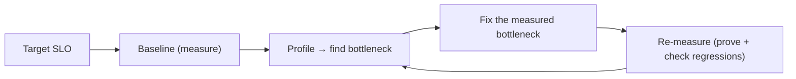
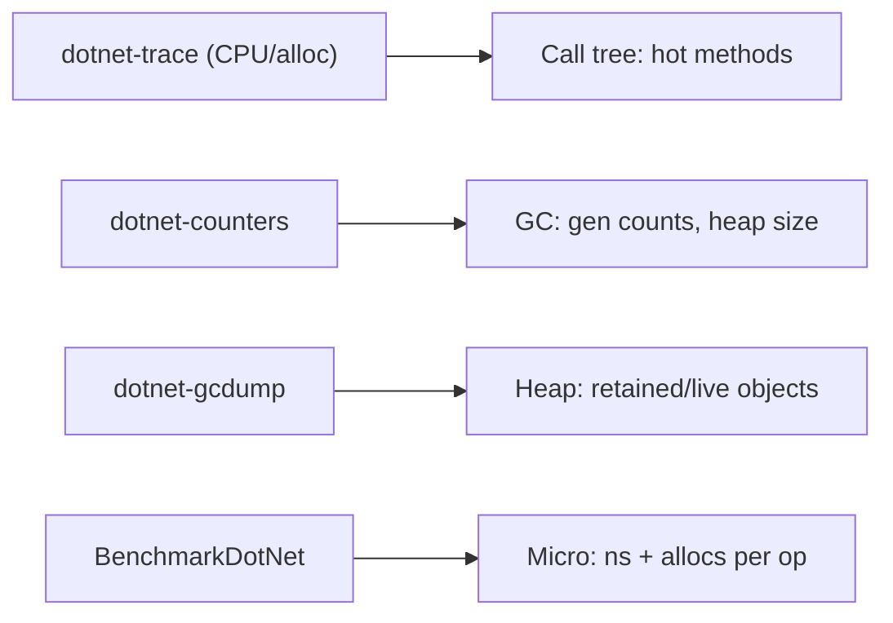
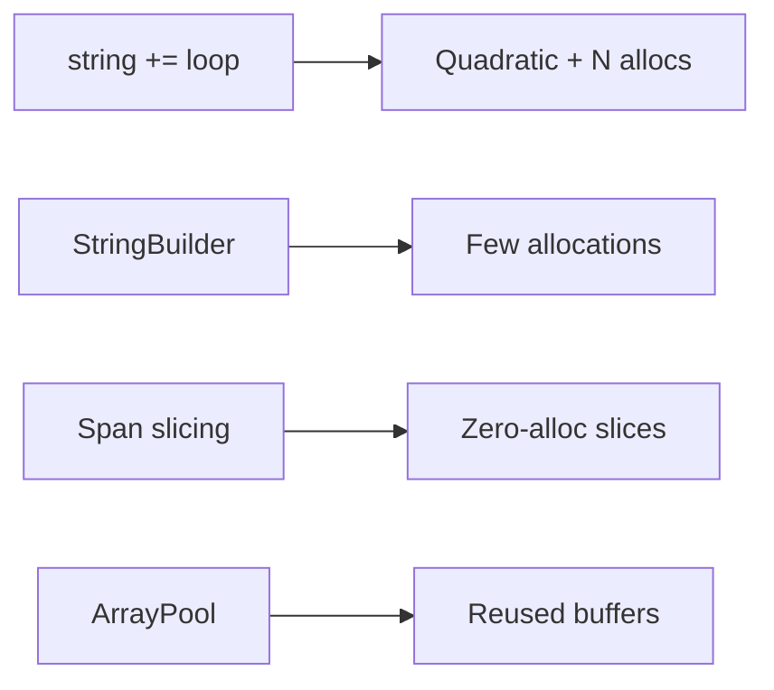
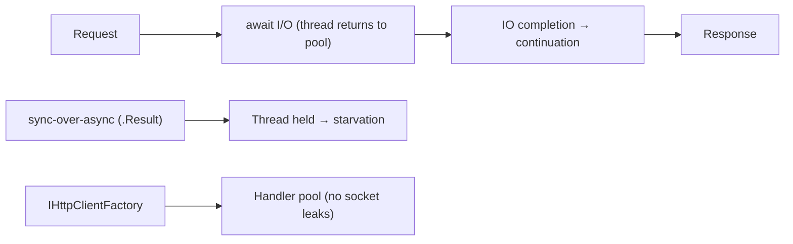
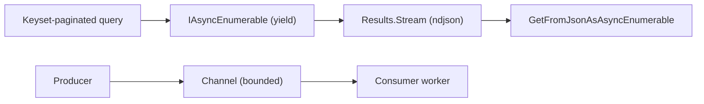
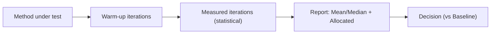
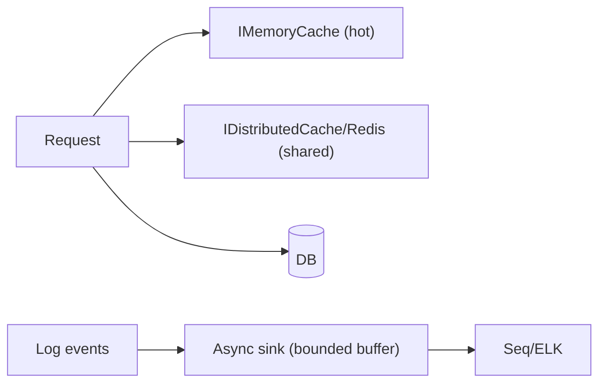
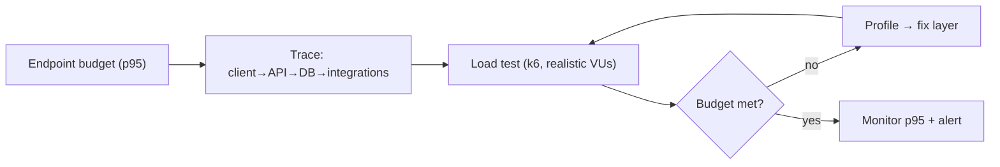

# Chapter 15: Performance Optimization

> **Audience:** Experienced .NET developers (5+ years) preparing for an L2 (Mid/Senior) interview at a Healthcare company.
> **Scope:** The performance mindset (measure first), CPU and memory profiling in .NET, allocations and the GC, async and thread-pool behavior, string/collection hot paths, `Span<T>`/`Memory<T>` and high-performance APIs, asynchronous streaming, EF/SQL query performance (Chapter 13/14 recap), caching and batching, benchmarking with BenchmarkDotNet, and the healthcare reality: clinical latency budgets, load testing, and avoiding premature optimization.

---

## 15.1 The Performance Mindset: Measure, Profile, Optimize

### Interview Answer (30–45 seconds)

> "Performance work is a loop: **measure, profile, optimize, re-measure** — never guess. I start from the business requirement (e.g., a patient-summary API must return in <300ms at p95), then profile to find the *real* bottleneck rather than optimizing what I assume is slow. Hot paths get profiled with a CPU profiler and checked for allocations; queries get execution-plan review. The discipline that separates senior work: I create a benchmark or baseline before changing anything, optimize the measured bottleneck, and prove the win with the same measurement. Premature optimization is a waste — but knowing *where* the time actually goes is the job."

### Detailed Explanation

**The loop:**
1. **Define the target:** measurable SLO (p50/p95 latency, throughput, GC pressure).
2. **Baseline:** capture before-numbers (profiler, BenchmarkDotNet, load test).
3. **Profile:** find the hot spot (CPU, allocations, I/O, DB).
4. **Optimize:** the smallest change that moves the measured bottleneck.
5. **Re-measure:** prove improvement and watch for regressions elsewhere.

**Layers of the stack and their tools:**

| Layer | Tool |
|---|---|
| CPU | Visual Studio profiler, `dotnet-trace` |
| Memory/GC | `dotnet-counters`, `dotnet-gcdump`, GC logs |
| Allocations | BenchmarkDotNet, `dotnet-trace` alloc counters |
| Async/I/O | `dotnet-trace`, async diagnostics, thread-pool analysis |
| Database | execution plans, `STATISTICS IO`, Query Store (Chapter 14) |
| HTTP | `HttpClient`/middleware timing, load tests (k6, JMeter) |
| End-to-end | OpenTelemetry, APM (Application Insights, Datadog) |

**The 90/10 rule:** ~90% of time is in ~10% of code. Profile to find that 10%.

**Async I/O reality:** most "slow" web requests wait on I/O (DB, external calls), not CPU. Optimizing allocations while the bottleneck is a blocking DB call is wasted effort — fix the DB first.

### Real World Example (Healthcare)

A FHIR `Observation` search endpoint reported p95 of 2.4s. Team instincts suggested caching and `Span` micro-optimizations. Profiling showed 80% of time in an N+1 EF query pattern (Chapter 13.6) against an unindexed table. The fix — a covering index + projection — took p95 to 120ms. The micro-optimizations were never needed. *Measure first.*

### Production Code Example

```csharp
// Baseline capture with .NET counters (outside the app)
//   dotnet-counters monitor --process-id 1234 --counters System.Runtime
// Focus: cpu-usage, gc-heap-size, threadpool-queue-length, time-in-gc

// In-app timing middleware (Chapter 10) for per-endpoint SLO telemetry
public sealed class SloMiddleware : IMiddleware
{
    public async Task InvokeAsync(HttpContext context, RequestDelegate next)
    {
        var sw = Stopwatch.GetTimestamp();
        try { await next(context); }
        finally
        {
            var ms = Stopwatch.GetElapsedTime(sw).TotalMilliseconds;
            _metrics.RecordEndpointDuration(
                context.Request.Path,
                context.Response.StatusCode,
                ms);   // drives p50/p95 dashboards + alerts
        }
    }
}
```

**Key lines explained:**

- System metrics (GC, thread pool) expose systemic pressure; per-endpoint timing exposes the SLO.
- The middleware approach keeps measurement consistent across every endpoint.

### Internal Working

- Profilers use sampling (CPU) or instrumentation (alloc); sampling is cheaper and usually enough.
- GC logs (`loggcdump`) reveal allocation patterns and collection frequency.
- Load tests (k6) drive concurrent requests to expose thread-pool/connection bottlenecks.

### Advantages

- Optimization is evidence-driven, not opinion-driven.
- Catches premature-optimization waste early.
- Creates a repeatable regression check.

### Disadvantages

- Profiling adds overhead and tooling discipline.
- Baselines go stale as the code evolves.
- SLOs need business buy-in to be meaningful.

### Best Practices

- Always capture before/after measurements.
- Fix the measured bottleneck (DB/I/O first), micro-optimize last.
- Automate a load test per release.
- Keep SLOs explicit and monitored.

### Common Mistakes

- Optimizing before measuring (the #1 performance anti-pattern).
- Micro-optimizing CPU while a DB call dominates.
- No baseline → "improvements" that aren't.

### Interview Follow-up Questions

1. Walk me through how you'd diagnose a slow endpoint.
2. When is micro-optimization worth it?
3. What tools do you use to profile .NET?

### Senior Level Talking Points

- "I treat performance like a bug report: reproducible measurement first, hypothesis, then a targeted fix — and the load test is my regression suite."
- "Most performance problems are I/O or data-shape problems. CPU micro-optimizations are the last 5%, and only on the measured hot path."

### Diagram



### Comparison Table

| Approach | Cost | Risk |
|---|---|---|
| Guess + optimize | Low | Wasted effort |
| Profile + targeted fix | Medium | Right target |
| Micro-optimize everything | High | Regressions, no wins |

### Memory Trick

**"Measure → profile → fix → prove"** — the only performance loop.

### Summary

Start with an SLO, measure a baseline, profile to find the real bottleneck (usually DB/I/O), fix it, and prove with re-measurement. Never optimize a guess.

### Interview Confidence Score

**High.** The "how do you approach performance" question is asked everywhere; the measure-first mindset with a concrete toolset is the answer.

---

## 15.2 CPU and Memory Profiling in .NET

### Interview Answer (30–45 seconds)

> "I profile .NET with a small toolkit: **`dotnet-trace`** for CPU sampling and allocations, **`dotnet-counters`** for live system metrics (GC, thread pool), **`dotnet-gcdump`** for heap analysis, and **BenchmarkDotNet** for isolated hot-path benchmarks. The workflow is: capture a trace under realistic load, find the method eating CPU or allocating most, drill into the call tree, and check the GC stats — high allocation rates mean Gen0/Gen1 pressure and pauses. For a healthcare API under load, I look for hidden allocations in the request path: LINQ closures, boxing, string concat in loops, and async hot paths that copy buffers."

### Detailed Explanation

**The tools:**

| Tool | What it shows |
|---|---|
| `dotnet-trace collect` | CPU sampling, allocation rate, async stacks |
| `dotnet-counters monitor` | Live: CPU, GC heap, gen0/1/2 collections, threadpool queue |
| `dotnet-gcdump collect` | Heap snapshot: what's alive, who references what |
| `dotnet-stack` | Immediate thread stacks (hung/blocked) |
| BenchmarkDotNet | Precise per-method timing + allocation |
| VS/PerfView | Rich call trees, flame charts |

**Reading the results:**
- **CPU:** the sampled call tree shows where instructions spend time — look for unexpected hot methods (string ops, LINQ, reflection, sync-over-async).
- **Allocations:** GC metrics (allocations/sec, gen counts) — sustained high allocation → GC pauses and cache pressure.
- **Async:** `dotnet-trace` async profiles show where async continuations stall (await chains, thread-pool starvation).

**Common findings in request paths:**
- String concatenation in loops (`+=` inside `for`).
- LINQ over hot collections with closures/lambdas (allocations).
- Boxing (`object` params, `ArrayList`, `IEnumerable` over value types).
- Reflection/expression compilation at runtime.
- Large async buffer copies (`MemoryStream` growth, `byte[]` churn).
- **Thread-pool starvation:** blocked threads (sync-over-async) → queue grows → latency spikes.

### Real World Example (Healthcare)

A patient-list endpoint allocated ~2 MB/request. A gcdump + trace showed: a LINQ `Select` over 10k patients materializing `DateTime`+string into anonymous objects, and a `string.Concat` in a formatting loop. The fix — `StringBuilder`, value-tuple projection, and `AsNoTracking` — cut allocations 70% and eliminated Gen1 pressure under load.

### Production Code Example

```bash
# Capture 30s of CPU/alloc under load
dotnet-trace collect -p <pid> --profile cpu-sampling --duration 00:00:30

# Live GC + threadpool telemetry
dotnet-counters monitor -p <pid> System.Runtime

# Heap snapshot for leak analysis
dotnet-gcdump collect -p <pid> -o dump.gcdump

# Isolated micro-benchmark (BenchmarkDotNet)
# [Benchmark] public string FormatPatient(Patient p) => BuildName(p);
# dotnet run -c Release -> accurate ns + allocs per op
```

**Key lines explained:**

- Trace under *realistic load* (not a single warm call) — that's where hot paths show.
- Benchmarks isolate the exact method cost with noise control.

### Internal Working

- `dotnet-trace` uses EventPipe — high-throughput, low-overhead sampling on the same machine.
- GC stats distinguish Gen0 (cheap, frequent), Gen1, Gen2 (expensive, rare) — allocation-heavy code drives Gen1/2.
- `gcdump` serializes the managed heap for analysis (who holds the data, leak detection).

### Advantages

- Finds the real CPU/allocation hot spot in minutes.
- Toolchain is free and works on Linux too (containers).
- Quantifiable evidence for fixes.

### Disadvantages

- Sampling profiles can miss short-lived spikes.
- Under-sampled single runs mislead; need load.
- Benchmarks require careful methodology to avoid false wins.

### Best Practices

- Profile under load representative of production.
- Look at the GC stats alongside CPU — allocations are often the true cost.
- Confirm suspected hot paths with a BenchmarkDotNet micro-benchmark.
- Re-measure after the fix.

### Common Mistakes

- Profiling a single warm request (cold starts dominate).
- Ignoring allocation data (CPU can look fine while GC churns).
- Trusting a micro-benchmark that doesn't match production usage.

### Interview Follow-up Questions

1. What tools do you use to find a CPU bottleneck?
2. How do you detect memory leaks in a .NET service?
3. What does high Gen0/Gen1 collection indicate?

### Senior Level Talking Points

- "I read the trace like a profiler report: CPU hot methods, allocation rates, and async stalls — the trio tells me whether it's compute, GC, or scheduling."
- "For leaks I look at 'what's alive after the work is done' with a gcdump — a growing retained set is a bug, not a tuning issue."

### Diagram



### Comparison Table

| Tool | Question answered |
|---|---|
| dotnet-trace | Where does CPU/alloc time go? |
| dotnet-counters | Is the runtime under GC/threadpool pressure? |
| dotnet-gcdump | What's alive / leaking? |
| BenchmarkDotNet | Exactly how fast/allocating is this method? |

### Memory Trick

**"Trace for hot code, counters for pressure, gcdump for leaks"** — the profiling toolkit.

### Summary

Profile with EventPipe tools under load, interpret CPU + GC + async together, and isolate hot methods with BenchmarkDotNet. Allocations, not just CPU, drive latency.

### Interview Confidence Score

**High.** Profiling fluency is a strong senior signal; name the tools and interpret their output.

---

## 15.3 Allocations, Strings, and Hot-Path .NET Techniques

### Interview Answer (30–45 seconds)

> "In hot paths, allocation is the tax: every allocation adds GC pressure. The techniques I use: **`StringBuilder`** for repeated concatenation, **`Span<T>`/`ReadOnlySpan<T>`** for slicing/parsing without new arrays, **`stackalloc`** for small buffers, **structs instead of classes** where value semantics fit, and **`string.Create`/`StringBuilder` pooling** where format-heavy. For collections: pre-size (`new List<T>(capacity)`), prefer `Array`/`List<T>` over LINQ pipelines in hot loops, and avoid boxing (no `object` params, no non-generic collections). `Span<T>` avoids heap arrays entirely — zero-alloc slicing is the biggest win for parse-heavy code like clinical report parsing."

### Detailed Explanation

**String techniques:**

```csharp
// BAD (hot loop): allocations each iteration
string s = "";
foreach (var item in items) s += item.Name + ", ";

// GOOD: StringBuilder
var sb = new StringBuilder();
foreach (var item in items) sb.Append(item.Name).Append(", ");

// GOOD: string.Create for known-shape formatting (single alloc)
var value = string.Create(buffer.Length, buffer, (span, bytes) =>
    { /* fill span directly, no intermediate strings */ });

// Slicing without allocation
ReadOnlySpan<char> name = fullLine.AsSpan().Slice(0, idx);  // no string copy
```

**`Span<T>` / `Memory<T>`:**
- `Span<T>` = ref struct over any contiguous memory (array, stack, native) — no allocation for slicing.
- `Memory<T>` = heap-safe counterpart (can live in fields/async).
- Parse/format hot paths: `int.TryParse(span)`, `Guid.TryParse(span)` (net8+), `Utf8Parser` for bytes.
- Great for protocol parsing (HL7 messages, FHIR bundles, log lines).

**Collections and boxing:**
- Prefer `List<T>`/`Array` over `IEnumerable` lazy chains in hot loops.
- `struct` value types avoid heap + indirection where copied semantics fit (small, immutable-ish).
- No `ArrayList`/non-generic `IEnumerable` (boxing); use `List<int>` etc.
- `ArrayPool<T>` for rent/return buffers in high-throughput code.

**Other hot-path techniques:**
- `ValueTask<T>` to avoid `Task` allocation when the result is often synchronous.
- `IAsyncEnumerable<T>` streaming to avoid buffering whole lists.
- Cached lambdas/`static` delegates instead of capturing closures.

### Real World Example (Healthcare)

Parsing HL7 v2 messages (pipe-delimited segments) in a gateway: the naive path splits into strings and joins — dozens of allocations per message. The optimized path uses `ReadOnlySpan<char>` slicing + `Utf8Parser`/`Guid.TryParse(span)` and `ArrayPool<byte>` for buffers — throughput improved ~5x and GC pressure collapsed, important at the ingestion rate of a hospital interface engine.

### Production Code Example

```csharp
// Span-based parsing of a simple HL7 segment: MSH|1|2|...
public static void ParseMsh(ReadOnlySpan<char> line)
{
    var parts = line.Slice(4);                 // skip "MSH|" — zero allocation
    // walk pipes manually or use IndexOf on spans
    var fieldIndex = parts.IndexOf('|');
    var sendingApp = fieldIndex >= 0 ? parts.Slice(0, fieldIndex) : default;

    // Only materialize a string when you must (store/emit)
    if (!sendingApp.IsEmpty && Guid.TryParseExact(sendingApp, "D", out var id))
        _lastGuid = id;                        // struct — no allocation
}

// ArrayPool for a scratch buffer in a high-QPS path
byte[] buf = ArrayPool<byte>.Shared.Rent(4096);
try
{
    // ... write bytes ...
}
finally
{
    ArrayPool<byte>.Shared.Return(buf);
}
```

**Key lines explained:**

- Span slicing defers allocation until you actually need a `string`.
- `Guid.TryParseExact(span)` parses without intermediate strings.
- `ArrayPool` reuses buffers instead of churning `byte[]`.

### Internal Working

- `Span<T>` is a `ref struct`: pointer + length + (optionally) managed ref — slices are just pointer arithmetic, no allocation.
- `string.Create` writes into the final string's buffer once.
- `ArrayPool<T>` keeps per-size buckets of rented arrays; `Return` makes them reusable.
- Gen0 collection cost scales with allocation rate — fewer/larger allocations beat many small ones.

### Advantages

- Order-of-magnitude reductions in allocation and GC time on parse/format hot paths.
- `Span<T>` enables high-throughput protocol handling.
- Techniques compose (spans, structs, ArrayPool).

### Disadvantages

- `ref struct` restrictions (can't be boxed/awaited across boundaries) require careful design.
- Readability takes a hit; only justified on measured hot paths.
- Premature use everywhere is a maintenance tax.

### Best Practices

- Reserve these techniques for profiled hot paths.
- Prefer `StringBuilder`/`string.Create` over `+=` in loops.
- Use `Span<T>` for parsing/slicing; `Memory<T>` for async buffering.
- Pre-size collections; avoid boxing and LINQ churn in hot loops.

### Common Mistakes

- `string +=` in a loop (quadratic copying + allocations).
- Boxing value types in generic-less code paths.
- Over-applying spans where readability matters more than measured gains.

### Interview Follow-up Questions

1. Why is `string +=` bad in a loop?
2. What's the difference between `Span<T>` and `Memory<T>`?
3. When do you choose a struct over a class?

### Senior Level Talking Points

- "Allocation is a GC tax — on a profiled hot path I pay it only once per logical operation, using spans and pooled buffers, and I measure the GC-pressure drop."
- "The discipline is applying these tools only where the trace says they matter."

### Diagram



### Comparison Table

| Technique | Allocations | Best for |
|---|---|---|
| `string +=` | Many | Never in loops |
| StringBuilder | Few | Concatenation |
| `string.Create` | One | Shaped formatting |
| `Span<T>` | Zero (slices) | Parsing, slicing |
| ArrayPool | Zero (reuse) | Scratch buffers |

### Memory Trick

**"Span slices free, StringBuilder joins cheap, ArrayPool reuses"** — the allocation-fighting trio.

### Summary

Hot-path .NET is about minimizing allocations: spans for slicing/parsing, StringBuilder for concatenation, ArrayPool for buffers, structs/ValueTask where they fit. Apply on measured hot paths only.

### Interview Confidence Score

**High.** Allocation/GC questions and string-loop traps are common; the span/ArrayPool fluency is the senior edge.

---

## 15.4 Async, Thread-Pool, and I/O Efficiency

### Interview Answer (30–45 seconds)

> "Async on the server is about not holding threads while waiting on I/O. `await` releases the thread back to the pool, so a DB or HTTP call costs almost nothing in threads. The failure mode is **sync-over-async**: blocking on `.Result`/`.Wait()` inside async code — it *holds* the thread *and* deadlock-risks, starving the pool under load. I audit for that, set an **explicit `HttpClient` timeout with `AddHttpClient`** (not `new HttpClient`), enable **`IHttpClientFactory`** for connection pooling, and watch the thread-pool queue length (`dotnet-counters`) as the canary for starvation. For a healthcare API doing FHIR integrations, bounded async I/O is the difference between graceful degradation and thread-pool collapse."

### Detailed Explanation

**The async model:**
- `async`/`await` = state machine; awaits yield the thread when the operation is incomplete.
- Server throughput scales with concurrent I/O, not threads — one thread per request would cap at ~1000s; async handles tens of thousands.
- `Task` completion via IO completion ports — no thread parked while waiting.

**Sync-over-async anti-patterns:**
- `.Result`, `.Wait()`, `.GetAwaiter().GetResult()`, `.WaitAsync().GetAwaiter().GetResult()` in request paths.
- Blocks the calling thread *and* risks deadlock when synchronization context flows (classic ASP.NET, UI).
- Under load → **thread-pool starvation**: queue grows, latency explodes, thread count climbs.

**HttpClient correctness:**
- `new HttpClient()` per call → socket exhaustion (TIME_WAIT) under load.
- Use `IHttpClientFactory`: pooled handlers, DNS rotation, `AddTimeout`, `AddPolly` resilience.
- Set explicit `Timeout`; use `CancellationToken` for per-request limits.

**I/O efficiency:**
- Stream responses (`IAsyncEnumerable<T>`, `Stream` responses) instead of buffering huge payloads.
- Avoid double-buffering (`ReadAsByteArrayAsync` for big bodies).
- Bounded parallelism (`SemaphoreSlim`/`Channel<T>`) for fan-out — not unbounded `Task.WhenAll`.

**Thread-pool tuning:**
- `ThreadPool.SetMinThreads` can raise the floor for known spikes (careful).
- Real fix: no sync-over-async, bounded parallelism, short I/O.

### Real World Example (Healthcare)

A gateway fan-outs to 20 FHIR queries per request using `Task.WhenAll` with a `SemaphoreSlim(5)` — bounded, non-blocking. Previously a `.Result` call in an internal lib had pushed the pool to hundreds of threads with 30s latency. Removing sync-over-async + using the factory restored p95 to 200ms.

### Production Code Example

```csharp
builder.Services.AddHttpClient<IFhirClient, FhirClient>(c =>
{
    c.BaseAddress = new Uri("https://fhir.example.com");
    c.Timeout = TimeSpan.FromSeconds(30);          // explicit bound
})
.AddPollyPolicy(Policy.TimeoutAsync<HttpResponseMessage>(5));   // per-request ceiling

public sealed class FhirFanOut(IFhirClient client, SemaphoreSlim limiter)
{
    public async Task<IReadOnlyList<Observation>> GetManyAsync(
        IReadOnlyList<string> ids, CancellationToken ct)
    {
        var results = new List<Observation>(ids.Count);
        var tasks = ids.Select(async id =>
        {
            await limiter.WaitAsync(ct);          // bounded parallelism (5)
            try { return await client.GetAsync(id, ct); }
            finally { limiter.Release(); }
        });
        foreach (var t in tasks) results.Add(await t);  // await as they complete
        return results;
    }
}
```

**Key lines explained:**

- Typed client from the factory — pooled handlers, no socket leaks.
- Semaphore bounds concurrency; nothing blocks (all await).
- Per-request timeout + client timeout = fast failure, no pile-up.

### Internal Working

- Awaits register continuations via the thread pool's IO completion; the thread returns to the pool.
- `IHttpClientFactory` pools `HttpMessageHandler`s keyed by client name/configuration; DNS respects TTL via `SocketsHttpHandler` pooling.
- Starvation appears as thread-pool queue growth (watch via counters).

### Advantages

- Massive concurrency with few threads.
- Factories/resilience policies make clients safe by default.
- Streaming/bounded fan-out keeps memory flat.

### Disadvantages

- Async code is harder to read/debug (state machines, async stacks).
- Sync-over-async is easy to reintroduce accidentally.
- Bounded parallelism needs tuning (limits vs. latency).

### Best Practices

- Zero sync-over-async in request paths (enforce with analyzer `CA2012`/custom).
- Use `IHttpClientFactory`; never `new HttpClient` in a request loop.
- Stream large payloads; bound fan-out.
- Monitor thread-pool queue length in production.

### Common Mistakes

- `.Result`/`.Wait()` in async code (starvation + deadlock risk).
- `new HttpClient()` per request (socket exhaustion).
- Unbounded `Task.WhenAll` over thousands of items.

### Interview Follow-up Questions

1. Why is sync-over-async dangerous on the server?
2. How does `IHttpClientFactory` prevent socket exhaustion?
3. How do you detect thread-pool starvation?

### Senior Level Talking Points

- "Async is the server's breathing: await yields threads so concurrency comes cheap. Starvation is the asthma — and it's almost always self-inflicted via sync-over-async."
- "Bounded, cancellable fan-out is how a FHIR integration stays graceful when a downstream service slows."

### Diagram



### Comparison Table

| Pattern | Threads | Risk |
|---|---|---|
| True async | Yielded during I/O | Low |
| sync-over-async | Held while waiting | Starvation/deadlock |
| new HttpClient | Per call sockets | Exhaustion |
| Factory + policies | Pooled | Low |

### Memory Trick

**"Await yields, .Result blocks, factory pools"** — the async three rules.

### Summary

Async lets servers scale with I/O, not threads. Eliminate sync-over-async, use `IHttpClientFactory`, bound fan-out, and monitor the thread pool as the starvation canary.

### Interview Confidence Score

**High.** Async/thread-pool behavior is a guaranteed senior topic; sync-over-async recognition is the classic test.

---

## 15.5 Async Streaming, Batching, and IAsyncEnumerable

### Interview Answer (30–45 seconds)

> "For large result sets, I stream instead of buffering: **`IAsyncEnumerable<T>`** lets the API push rows/items as they arrive, with the caller consuming incrementally — memory stays flat even for a 50k-row report. In ASP.NET Core, returning `IAsyncEnumerable<T>` (or a `Stream`) from an endpoint streams the response. On the write side, **batching** — `Channel<T>` for producers/consumers, and batched DB writes (EF batching, `SqlBulkCopy` from Chapter 13) — keeps throughput high without unbounded memory. The rule: don't materialize whole collections in memory when the contract is incremental."

### Detailed Explanation

**`IAsyncEnumerable<T>` server-side:**

```csharp
app.MapGet("/fhir/Observation/$export", async (PatientId p, CancellationToken ct) =>
{
    return Results.Stream(async stream =>
    {
        await foreach (var obs in _obs.StreamByPatientAsync(p, ct))
            await JsonSerializer.SerializeAsync(stream, obs, ct);   // incrementally
    });
});
```

- Producer yields items with `yield return` inside an `async` iterator.
- Consumer `await foreach` pulls as available — backpressure via enumeration rate.
- Memory: O(1) item buffer instead of full list.

**Client-side consumption:**
- `HttpClient.GetFromJsonAsAsyncEnumerable<T>()` (net7+) streams JSON deserialization.
- Process items one at a time — no full payload buffering.

**Channel<T> for producers/consumers:**
- Bounded `Channel` = queue with capacity + backpressure (`WaitToWriteAsync` blocks producers when full).
- Ideal for background workers (Chapter 25) feeding a bounded queue.

**DB-side batching (recap, Chapter 13):**
- EF batches multiple commands per round-trip.
- `SqlBulkCopy` for bulk ingestion.
- Page reads (`Take`/`Skip` or keyset pagination) rather than loading everything.

**When streaming is wrong:**
- When the consumer needs the whole set (aggregations, sorting across all rows).
- When the DB is the bottleneck (the query still materializes server-side).

### Real World Example (Healthcare)

A FHIR bulk-export endpoint (`$export` — the spec's bulk data operation) streams `ndjson` lines of patient bundles. Returning `IAsyncEnumerable` keeps memory flat for a hospital's 2M-record export while the client writes to object storage line-by-line. The DB query is keyset-paginated to avoid a giant single result.

### Production Code Example

```csharp
// Producer: async iterator over keyset-paginated rows
public async IAsyncEnumerable<PatientBundle> StreamPatientsAsync(
    Guid tenantId, [EnumeratorCancellation] CancellationToken ct)
{
    Guid? lastId = null;
    do
    {
        var page = await _db.Patients
            .AsNoTracking()
            .Where(p => p.TenantId == tenantId &&
                        (lastId == null || p.Id.CompareTo(lastId.Value) > 0))
            .OrderBy(p => p.Id)
            .Take(500)
            .ToListAsync(ct);

        foreach (var p in page)
            yield return Mapper.ToBundle(p);

        lastId = page.LastOrDefault()?.Id;
        if (page.Count < 500) break;
    } while (!ct.IsCancellationRequested);
}

// Consumer side (net7+ streaming JSON)
await foreach (var patient in client.GetFromJsonAsAsyncEnumerable<PatientBundle>(
    "/fhir/Patient/$export", ct))
{
    await writer.WriteAsync(JsonSerializer.Serialize(patient) + "\n", ct);
}
```

**Key lines explained:**

- Keyset pagination (`Id > lastId`) is the scalable paging pattern (no `OFFSET` blow-up).
- `IAsyncEnumerable` keeps both producer and consumer at O(page) memory.
- Cancellation flows through the iterator.

### Internal Working

- `IAsyncEnumerable<T>` is driven by an `IAsyncEnumerator` — `MoveNextAsync` returns a `ValueTask<bool>`; the DB query streams via `ExecuteReaderAsync` (no full materialization when using `AsAsyncEnumerable()` from EF).
- `Channel<T>` uses a bounded queue with semaphore signaling for backpressure.
- `Results.Stream`/`GetFromJsonAsAsyncEnumerable` compose the pipeline.

### Advantages

- Constant memory for arbitrarily large results.
- Natural backpressure (consumer speed controls producer).
- Clean cancellation semantics.

### Disadvantages

- More complex than buffering a list.
- Some operations (aggregation, random access) can't stream.
- DB connection stays open during the stream — needs the right isolation.

### Best Practices

- Stream big reads; buffer only what the contract needs.
- Use keyset pagination for the underlying DB query.
- Bound `Channel<T>` to avoid unbounded queues.
- Propagate `CancellationToken` end-to-end.

### Common Mistakes

- `ToListAsync` on a million rows "because it's easier" (memory spike).
- Unbounded `Channel` (queue grows to memory limit).
- Streaming with an open `SqlConnection` under a transaction that never completes.

### Interview Follow-up Questions

1. When do you stream a response vs buffer it?
2. How does keyset pagination differ from OFFSET?
3. What's the backpressure mechanism of a Channel?

### Senior Level Talking Points

- "Streaming is a memory contract: `IAsyncEnumerable` turns a 'load it all' endpoint into an 'as fast as you can consume it' endpoint — that's what bulk export requires."
- "Bounded channels give me producer/consumer decoupling with a hard memory ceiling."

### Diagram



### Comparison Table

| Pattern | Memory | Throughput | Use |
|---|---|---|---|
| ToList buffering | O(n) | Simple | Small sets |
| IAsyncEnumerable | O(1) | Streamed | Large exports |
| Channel<T> | O(bound) | Backpressured | Producer/consumer |
| Keyset paging | O(page) | Scalable | DB paging |

### Memory Trick

**"Stream big, bound queues, page by keyset"** — the three scalable patterns.

### Summary

Stream large results with `IAsyncEnumerable` + keyset paging, use bounded `Channel<T>` for producer/consumer decoupling, and avoid buffering entire collections on the server.

### Interview Confidence Score

**Medium-High.** Streaming/bulk-export questions are increasingly common, and the FHIR `$export` example is a strong healthcare tie-in.

---

## 15.6 Benchmarking with BenchmarkDotNet

### Interview Answer (30–45 seconds)

> "BenchmarkDotNet is the standard for micro-benchmarks in .NET: it runs warm-ups, statistically meaningful iterations, handles JIT noise, and reports precise ns/op and allocations per op. I use it to settle hot-path disputes — 'is `string.Create` really faster than interpolation here?' — with numbers, not opinion. The methodology rules: build **Release**, no debugger attached, isolate the code under test, use a single thread, and report the median not the min. I never benchmark the whole endpoint with it — that's a load test, not a micro-benchmark."

### Detailed Explanation

**The setup:**

```csharp
[MemoryDiagnoser]                       // report allocations too
[RankColumn]
public class NameFormatBenchmarks
{
    private Patient _patient = null!;

    [GlobalSetup]
    public void Setup() => _patient = new Patient { FamilyName = "Smith", GivenName = "Jane" };

    [Benchmark(Baseline = true)]
    public string Interpolation() => $"{_patient.FamilyName}, {_patient.GivenName}";

    [Benchmark]
    public string StringBuilder() =>
        new StringBuilder(24).Append(_patient.FamilyName).Append(", ").Append(_patient.GivenName).ToString();

    [Benchmark]
    public string StringCreate() => string.Create(24, _patient, (span, p) =>
        { /* manual span fill */ });
}
```

**Methodology:**
- Run in **Release**, no debugger, no profiler attached.
- `GlobalSetup` initializes data; parameters via `[Params]`.
- Multiple iterations + warm-ups; reports mean/median with confidence intervals.
- `[MemoryDiagnoser]` gives allocation info — often the deciding metric.
- Compare against a `Baseline = true` benchmark.

**Interpreting results:**
- Median (not min); look at *allocation* as much as time.
- Statistical noise is handled by the harness; don't cherry-pick runs.
- Validate the fix in the real system — micro-wins must still show up at the endpoint level.

**What NOT to benchmark:**
- I/O-bound methods (DB/network) — dominated by external latency; use load tests.
- Whole endpoints — use load tests (k6/JMeter).
- Cold-start paths.

### Real World Example (Healthcare)

Two candidate implementations for building an HL7 segment string were in a PR dispute. A 30-line BenchmarkDotNet harness measured them at 410ns vs 38ns per call with 64B vs 0B allocated. The decision was made on numbers, merged with the faster one, and the endpoint's allocation profile (15.3) validated the win.

### Production Code Example

```bash
# Run benchmarks (Release, no debugger)
dotnet run -c Release --project benchmarks/NameFormatBenchmarks
```

```csharp
// Key attributes and output interpretation
[MemoryDiagnoser]                              // adds Allocated per op column
[Orderer(SummaryOrderPolicy.FastestToSlowest)]
public class SpanParseBenchmarks { ... }

// Output:
// | Method        | Mean    | Error | Allocated |
// |---------------|---------|-------|-----------|
// | Interpolation | 41.9 ns | 0.3   | 40 B      |
// | StringCreate  | 38.2 ns | 0.2   | 0 B       |
```

**Key lines explained:**

- The harness normalizes JIT noise; comparisons are trustworthy.
- Allocation column often matters more than raw ns (GC cost is amortized).

### Internal Working

- BenchmarkDotNet forks the process, controls the environment, performs warm-ups, and statistically analyzes iterations (outlier removal, confidence intervals).
- Each benchmark gets its own process/JIT to avoid cross-contamination.
- `[MemoryDiagnoser]` instruments allocation via GC stats.

### Advantages

- Decision-grade numbers for hot-path disputes.
- Prevents regressions (can be wired into CI).
- Allocation visibility drives GC-pressure decisions.

### Disadvantages

- Not representative of whole-system performance.
- Easy to benchmark the wrong thing (I/O, cold paths).
- Time to set up properly.

### Best Practices

- Release mode, no debugger, realistic data in `GlobalSetup`.
- Compare against a baseline; prefer allocation metric.
- Use for CPU/allocation hot paths only.
- Validate micro-wins at the endpoint level.

### Common Mistakes

- Benchmarking in Debug mode or with a debugger.
- Benchmarking I/O-bound work (external latency swamps it).
- Cherry-picking the best run instead of trusting the median/CI.

### Interview Follow-up Questions

1. What methodology rules does BenchmarkDotNet enforce?
2. When would you *not* use a micro-benchmark?
3. Why report median instead of min?

### Senior Level Talking Points

- "BenchmarkDotNet turns performance debates into data — I benchmark the disputed method, report median and allocations, and merge on the evidence."
- "The hard part isn't running it; it's isolating the right thing and not over-trusting micro numbers over end-to-end load results."

### Diagram



### Comparison Table

| Concern | Micro-benchmark | Load test |
|---|---|---|
| Unit | One method | Endpoint/system |
| Answers | ns/op, allocs | throughput, p95 |
| Tool | BenchmarkDotNet | k6, JMeter |
| Noise | Controlled | Realistic |

### Memory Trick

**"Micro for methods, load for systems"** — pick the right measuring tool.

### Summary

BenchmarkDotNet gives precise method-level time and allocation data. Use it for CPU/allocation hot-path disputes; validate with endpoint load tests.

### Interview Confidence Score

**Medium-High.** Benchmarking methodology questions are common at senior level; the baseline + allocation + median discipline is the answer.

---

## 15.7 Caching Strategy and Async Logging Trade-offs (Performance-Wise)

### Interview Answer (30–45 seconds)

> "Two performance levers that sound simple but need design: **caching** and **logging**. Caching is the highest-leverage optimization — read-heavy clinical data (reference tables, patient demographics, FHIR capability statements) should be cached with a **layered strategy**: in-memory for hot singleton data, `IDistributedCache` (Redis) for shared across instances, and HTTP caching headers where the client can cache. Logging is a hidden tax: **synchronous logging on hot paths** blocks request threads. Structured logging to a fast sink, buffered async sinks (Serilog `Async` wrapper, batching to Seq/ELK), and log-level filtering keep observability without the latency cost. The rule: cache aggressively where correctness allows, log asynchronously and only what's needed."

### Detailed Explanation

**Caching strategy (full detail in Chapter 16):**
- **Layers:** in-process (`IMemoryCache`) → distributed (`IDistributedCache`/Redis) → HTTP (response caching/Cache-Control).
- **Read-heavy + rarely-changing** = best candidates: codes (LOINC/SNOMED), FHIR metadata, tenant config.
- **TTL vs. explicit invalidation:** clinical data needs correctness — prefer short TTL or event-driven invalidation over long TTL.
- **`IMemoryCache`** with `GetOrCreateAsync` + size limits; **`IDistributedCache`** for shared, instance-independent data.
- Cache-aside pattern with keys namespaced by tenant.

**Logging performance (full detail in Chapter 17/36):**
- Synchronous I/O sinks (writing to disk/network per event) block the pipeline.
- Use **async/buffered sinks**: Serilog `WriteTo.Async(a => a.Seq(...))` — events queue to a background thread.
- **Filter aggressively** in production (`Microsoft.*` at Warning).
- **Avoid string interpolation in log calls** (allocates even when filtered) — always use structured placeholders.
- **No logging in hot loops** unless sampled.

### Real World Example (Healthcare)

The FHIR metadata/capability-statement endpoint (frequently polled, ~never changes) is cached in `IMemoryCache` with a 15-minute TTL — response time dropped from 40ms to 0.4ms and DB load vanished. Meanwhile Serilog's async wrapper + `Seq` sink absorbs a 5x request-log volume with negligible added latency, and `Microsoft.AspNetCore` logs are filtered to Warning in prod.

### Production Code Example

```csharp
// Cache-aside for read-heavy reference data
public sealed class TerminologyCache(IMemoryCache cache, ITerminologySource source)
{
    public async Task<FhirValueSet?> GetValueSetAsync(string codeSystem, CancellationToken ct)
    {
        var key = $"vs:{codeSystem}";
        return await cache.GetOrCreateAsync(key, async entry =>
        {
            entry.AbsoluteExpirationRelativeToNow = TimeSpan.FromMinutes(15);
            return await source.GetValueSetAsync(codeSystem, ct);
        });
    }
}

// Async/buffered logging sink
builder.Host.UseSerilog((ctx, cfg) => cfg
    .MinimumLevel.Information()
    .Filter.ByExcluding(l =>
        l.Level == LogEventLevel.Information &&
        l.SourceContext?.StartsWith("Microsoft.AspNetCore") == true)
    .WriteTo.Async(a => a.Seq("http://seq:5341", batchPostingLimit: 100))
    .Enrich.WithCorrelationId());

// Hot path: structured, no interpolation
_logger.LogInformation("Cached lookup for {Code} in {Ms}ms", code, sw.ElapsedMilliseconds);
```

**Key lines explained:**

- `GetOrCreateAsync` is the standard cache-aside helper with TTL.
- The `Async` sink moves I/O off the request thread (bounded buffer).
- Structured logging avoids string interpolation allocations even when filtered.

### Internal Working

- `IMemoryCache` uses a concurrency-safe in-process store with size limits and expiration callbacks.
- Async sinks queue `LogEvent`s and a background thread drains them in batches — bounded buffer prevents unbounded memory.
- Log-level checks happen before rendering; structured templates only render when emitted.

### Advantages

- Caching turns DB/IO-heavy reads into sub-ms responses.
- Async logging removes a hidden per-request tax.
- Both are configurable per-environment.

### Disadvantages

- Caching adds invalidation complexity (stale clinical data is a risk).
- Async sinks can lose events on process kill if not flushed.
- Over-filtering can blind you to issues.

### Best Practices

- Cache read-heavy, rarely-changing data; short TTL or invalidation for clinical correctness.
- Use async/buffered logging sinks; filter aggressively in prod.
- Never interpolate in log calls; use structured placeholders.
- Avoid logging inside hot loops.

### Common Mistakes

- Caching mutable clinical data with long TTLs (stale reads).
- Synchronous logging on hot paths (latency tax).
- `$"..."` interpolation in logging (allocation even when dropped).

### Interview Follow-up Questions

1. How do you decide what to cache vs not?
2. Why is synchronous logging a performance problem?
3. When is a cache invalid?

### Senior Level Talking Points

- "Caching is a correctness decision first: clinical data gets short TTLs and event-driven invalidation; reference data can sit in memory happily."
- "Observability should cost the request almost nothing — async sinks and structured logging are how I keep the lights on without paying the tax."

### Diagram



### Comparison Table

| Layer | Scope | Use |
|---|---|---|
| IMemoryCache | Per instance | Hot singleton data |
| IDistributedCache | Shared | Multi-instance, tenant data |
| HTTP cache | Client/proxy | GET resources, etags |

### Memory Trick

**"Cache what's read-heavy and stable; log asynchronously and filtered"** — the two silent performance levers.

### Summary

Cache read-heavy stable data across layers with correct TTLs; make logging async, filtered, and structured. Both remove hidden per-request costs without changing behavior.

### Interview Confidence Score

**Medium-High.** Caching and logging trade-offs are common senior discussions; the async-sink and TTL-correctness points are the differentiators.

---

## 15.8 The Healthcare Performance Reality: Latency Budgets, Load Testing, and Premature Optimization

### Interview Answer (30–45 seconds)

> "Clinical systems have hard human constraints: a clinician waiting on a patient chart is waiting on a patient. So I design to **latency budgets** — the sum of each layer's budget must meet the endpoint SLO (e.g., UI 100ms → API 300ms → DB 150ms), and I load-test against realistic concurrency to find where it breaks. The discipline: no premature optimization (profile first, 15.1), but also no shipping without a load test on the hot clinical endpoints. The 'fast enough' bar is set by the clinical workflow, not by a benchmark score — a 300ms chart load is fine; a 3s one breaks the workflow."

### Detailed Explanation

**Latency budgets:**
- End-to-end target (clinician-perceived) → decompose: client render, network, API, DB, integrations.
- Each layer owns a budget; you enforce with middleware timing (15.1) and alerts.
- Tail latency matters: p95/p99, not just p50 — outliers break UX.

**Load testing:**
- Tools: k6 (scriptable), JMeter, Azure Load Testing.
- Scenarios: realistic clinical concurrency (e.g., 200 concurrent chart views + 50 FHIR searches), peak-hour spikes.
- Metrics: p50/p95/p99 latency, throughput, error rate, GC/threadpool behavior under load.
- **Gatling/k6 soak tests** (sustained) reveal leaks and degradation.

**What to measure in a clinical stack:**
- Endpoint durations by path (SLO middleware).
- DB query times (plan-level; missing indexes).
- External integrations (FHIR/HL7 calls) — their latency is yours.
- GC pressure and thread-pool queue under load.

**Premature optimization guardrail:**
- Optimize only the profiled bottleneck.
- Keep readability where there's no measured need.
- Re-measure after every optimization.

### Real World Example (Healthcare)

A chart-view API had a 500ms p95 budget. Load testing with 300 concurrent users revealed the p95 was 2.1s, driven by a per-request external FHIR call with a 15s client timeout. Fix: cache the FHIR demographics (15.7) and tighten the timeout to 3s with retries. Post-fix p95: 240ms — within budget, and the soak test showed no GC drift.

### Production Code Example

```bash
# k6 load test: realistic clinical concurrency
k6 run -e BASE_URL=https://api.example.com load/chart-view.js
# load/chart-view.js:
#   http.get(`${BASE_URL}/patients/${id}/chart`)  -- 300 VUs, 5m ramp
# report: http_req_duration p(95), http_req_failed, iterations

# Track endpoint budgets with the SLO middleware (15.1) feeding dashboards:
# p95 per endpoint < budget; alert when violated for 5 minutes
```

**Key lines explained:**

- Load tests use realistic concurrency, not just max-QPS.
- SLO middleware turns budgets into observable, alertable facts.
- Soak tests catch the degradation that spikes hide.

### Internal Working

- Load generators hold virtual users; the harness aggregates latency percentiles.
- Application Insights / OpenTelemetry traces stitch request → DB → external calls to attribute the budget spend.
- Profiling (15.2) re-enters only where the trace says the budget is spent.

### Advantages

- The endpoint either meets its budget or you know exactly which layer broke it.
- Prevents both over-engineering and under-engineering.
- Load test doubles as a regression suite for performance.

### Disadvantages

- Building realistic load models takes effort.
- Environments differ from production (hardware, data volume).
- Budgets need periodic re-validation as features grow.

### Best Practices

- Define endpoint budgets with the clinical workflow in mind.
- Load test hot endpoints with realistic concurrency and soak durations.
- Attribute latency by layer (trace).
- Re-measure after any optimization or notable feature.

### Common Mistakes

- Optimizing to a benchmark with no clinical context.
- Load testing a single endpoint at max QPS (not the real mix).
- No p99 monitoring — only averages.

### Interview Follow-up Questions

1. How do you decide when an endpoint is 'fast enough'?
2. What does a good load test scenario look like?
3. How do you attribute latency across layers?

### Senior Level Talking Points

- "The clinical workflow sets the budget — 300ms chart loads keep the clinic moving; 3s ones don't. I instrument to prove we hold the budget at p95 under realistic load."
- "Premature optimization and no-load-testing are the same failure: optimizing or shipping without evidence."

### Diagram



### Comparison Table

| Concern | Tuned how |
|---|---|
| Per-endpoint latency | SLO middleware + dashboards |
| DB queries | plans + indexes (Ch 14) |
| External integrations | timeouts, cache, resilience |
| Sustained behavior | soak tests, GC metrics |

### Memory Trick

**"Budget, load-test, attribute, then micro-optimize"** — the clinical performance workflow.

### Summary

Performance in healthcare is governed by clinical latency budgets, validated with realistic load tests, and improved only on profiled evidence. Never optimize to a score; optimize to the workflow.

### Interview Confidence Score

**High (healthcare).** The latency-budget + load-test + no-premature-optimization story is exactly the senior performance narrative a clinical platform wants.

---

## Chapter 15 Wrap-Up

### Top 10 Questions You Should Be Ready For

1. How do you approach making a slow endpoint fast?
2. What profiling tools do you use, and what do you look for?
3. Why is allocation a performance problem, and how do you reduce it?
4. What is sync-over-async and why is it dangerous?
5. How does `IHttpClientFactory` prevent socket exhaustion?
6. When do you stream with `IAsyncEnumerable` vs buffer?
7. How do you run a micro-benchmark correctly?
8. What's your caching strategy and invalidation policy?
9. Why is synchronous logging a latency tax?
10. How do you set and verify clinical latency budgets?

### Revision Notes (1 page)

- **Mindset:** measure → profile → fix → re-measure. SLOs first (p50/p95), baseline before any change, fix the measured bottleneck, prove with the same measurement.
- **Tooling:** `dotnet-trace` (CPU/alloc), `dotnet-counters` (GC/threadpool), `dotnet-gcdump` (heap/leaks), BenchmarkDotNet (micro), k6 (load).
- **Allocations:** GC tax; `StringBuilder` over `+=`; `Span<T>` zero-alloc slicing; `ArrayPool<T>`; structs/ValueTask where apt; apply on profiled hot paths only.
- **Async:** await yields threads; sync-over-async → starvation; `IHttpClientFactory` (no `new HttpClient`); bound fan-out; monitor thread-pool queue.
- **Streaming:** `IAsyncEnumerable` + keyset paging for large results; bounded `Channel<T>`; never buffer whole sets.
- **Benchmarking:** Release, no debugger, baseline, median + allocations, micro ≠ load.
- **Cache/log:** cache read-heavy stable data (short TTL/invalidation for clinical); async/buffered logging sinks; filtered + structured logs; no interpolation in log calls.
- **Healthcare reality:** latency budgets from the clinical workflow; realistic load tests (concurrency + soak); attribute latency by layer; no premature optimization.

### Things Interviewers Expect From 5+ Years Experience

- Measure-first instinct, with a concrete toolset named.
- Awareness that most bottlenecks are DB/I-O, not CPU.
- Sync-over-async and HttpClient misuse identified instantly.
- Streaming/batching patterns for large clinical data.
- Benchmark methodology (Release, baseline, median, allocations).
- Caching correctness (TTL/invalidation) over raw speed.
- Clinical latency-budget thinking, not benchmark worship.

### Cheat Sheet

```
LOOP: measure → profile → fix → re-measure (SLO/baseline first)

TOOLS: dotnet-trace (CPU/alloc) · dotnet-counters (GC/threadpool)
  dotnet-gcdump (heap) · BenchmarkDotNet (micro) · k6 (load)

ALLOCATIONS:
  += in loop → StringBuilder
  slicing/parsing → Span<T> (zero-alloc)
  scratch buffers → ArrayPool<T>
  boxing → generics/structs
  apply ONLY on profiled hot paths

ASYNC: await yields threads · .Result/.Wait = starvation
  IHttpClientFactory (NEVER new HttpClient per request)
  bound fan-out (SemaphoreSlim) · monitor threadpool queue

STREAMING: IAsyncEnumerable + keyset paging for big results
  bounded Channel<T> for producer/consumer · O(1) memory

BENCHMARK: Release · no debugger · baseline · median + allocs
  micro for methods, load tests for systems

CACHE: read-heavy stable data (in-memory → distributed → HTTP)
  clinical correctness → short TTL / event invalidation

LOGGING: async/buffered sinks · filter prod (Microsoft.* = Warning)
  structured placeholders (NO interpolation)

HEALTHCARE: latency budgets from clinical workflow
  realistic concurrency + soak tests · attribute by layer
```

### Flash Cards

**Q1:** Performance loop? **A:** Measure → profile → fix → re-measure, with a baseline.

**Q2:** Biggest bottleneck usually? **A:** DB/I-O, not CPU — profile to confirm.

**Q3:** Tools for CPU/alloc? **A:** dotnet-trace; counters for GC/threadpool.

**Q4:** Why allocations hurt? **A:** GC pressure/pauses; fewer bigger allocs beat many small.

**Q5:** Fix for string += in loop? **A:** StringBuilder.

**Q6:** Span<T> advantage? **A:** Zero-alloc slicing/parsing (ref struct over memory).

**Q7:** sync-over-async danger? **A:** Holds threads, starves pool, deadlock risk.

**Q8:** new HttpClient per request? **A:** Socket exhaustion — use IHttpClientFactory.

**Q9:** Stream big results with? **A:** IAsyncEnumerable + keyset paging.

**Q10:** Benchmark rules? **A:** Release, no debugger, baseline, median + allocations.

**Q11:** Cache invalidation for clinical data? **A:** Short TTL or event-driven — no long TTL on mutable clinical data.

**Q12:** Sync logging problem? **A:** Blocks request threads — use async/buffered sinks.

**Q13:** Interpolation in logs? **A:** Allocates even when filtered — use structured placeholders.

**Q14:** What drives the latency budget? **A:** The clinical workflow, validated with load tests at p95.

### Interview Confidence Score

**High.** Performance questions are universal, and this chapter's measure-first methodology plus healthcare-specific budget thinking is a strong senior narrative across every interview.

---

*Continue → Chapter 16: Caching*
