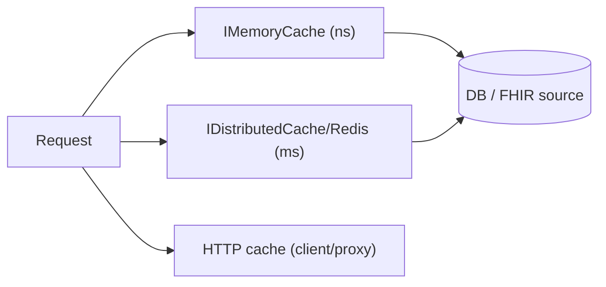
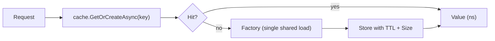
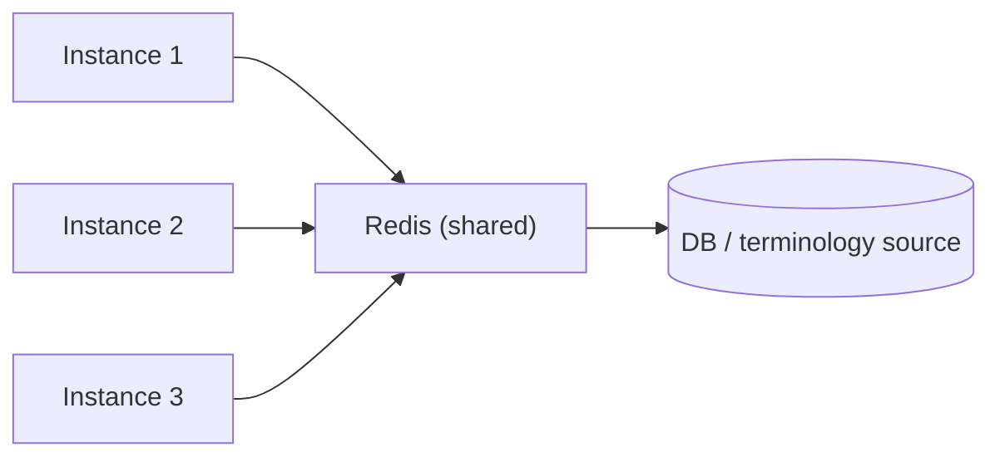
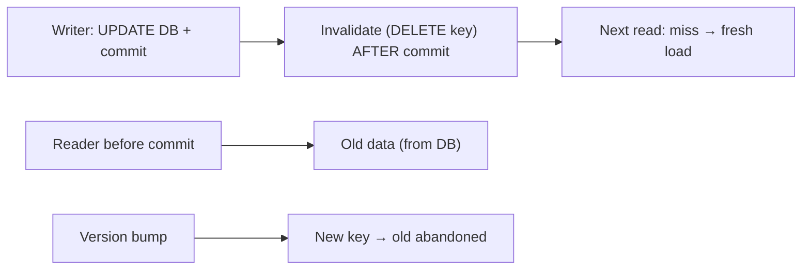
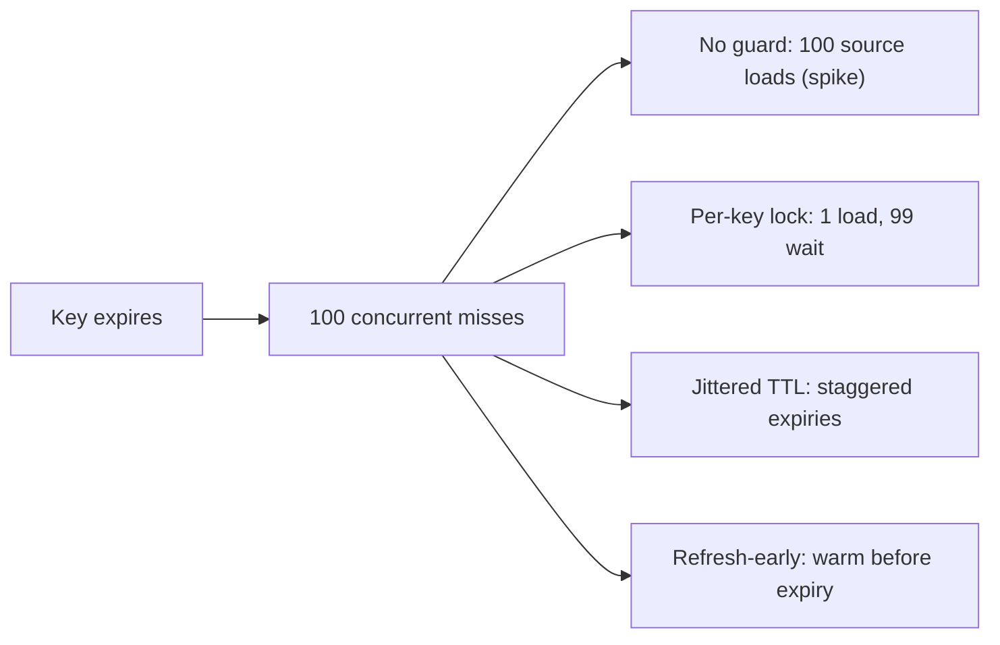
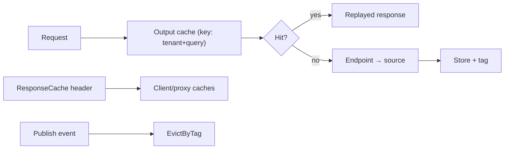
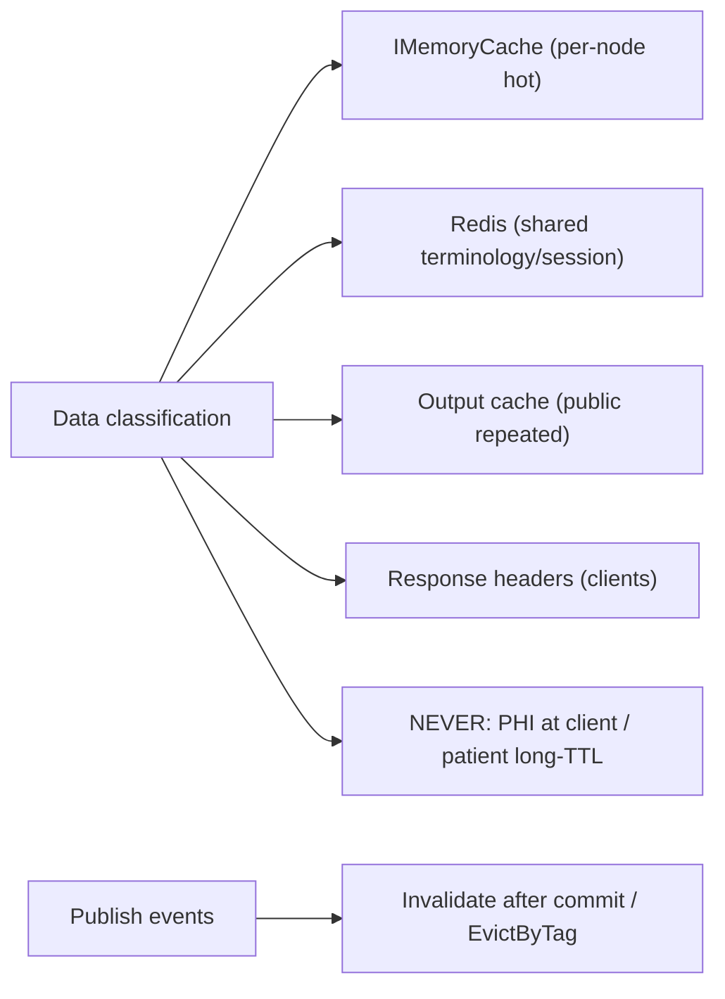

# Chapter 16: Caching

> **Audience:** Experienced .NET developers (5+ years) preparing for an L2 (Mid/Senior) interview at a Healthcare company.
> **Scope:** Why caching matters, the caching layers (in-memory, distributed, HTTP), `IMemoryCache`, `IDistributedCache` and Redis, cache-aside, TTL and eviction, cache invalidation, stampede protection, caching clinical data safely (correctness, PHI, per-tenant keys), output/response caching in ASP.NET Core, and a healthcare caching architecture.

---

## 16.1 Why Caching Matters — Layers and Trade-offs

### Interview Answer (30–45 seconds)

> "Caching trades a little staleness (or invalidation complexity) for big latency and throughput gains on read-heavy data. I think of it in layers: **in-memory** (fastest, per-instance), **distributed** (Redis — shared across instances), and **HTTP** (client/proxy-side). Each layer has a cost: memory uses local RAM but isn't shared; Redis shares but adds a network hop; HTTP caching helps clients but you lose server control. For healthcare, the correctness rule dominates: cache read-heavy, rarely-changing data (reference codes, tenant config, FHIR metadata), keep TTLs short or invalidate explicitly for mutable clinical data, and namespace keys by tenant so caches never cross hospital boundaries."

### Detailed Explanation

**The three layers:**

| Layer | Store | Latency | Shared? | Best for |
|---|---|---|---|---|
| In-memory | `IMemoryCache` | ~ns | No (per instance) | Hot per-node data |
| Distributed | Redis / `IDistributedCache` | ~0.1–1ms | Yes | Multi-instance data |
| HTTP | `Cache-Control`/response caching | n/a (client) | Yes (clients) | GET resources, static |

**Cache-aside (lazy load) pattern:**
1. Check cache → hit? return.
2. Miss → load from source (DB/API).
3. Store in cache with TTL.
4. Return.

**Cache-through / write-through / write-behind:**
- Write-through: update cache on every write (consistent, but write-cost).
- Write-behind: queue writes to cache then persist asynchronously (fast, but risk window).

**Benefits:**
- Sub-ms reads instead of DB/IO.
- Absorbs traffic spikes (protects DB).
- Reduces external integration cost (FHIR calls).

**Costs/risks:**
- Stale data (correctness).
- Invalidation complexity.
- Stampede (many missers at once).
- Memory pressure, cache poisoning, eviction surprises.

### Real World Example (Healthcare)

The FHIR **CapabilityStatement** (server metadata) is polled by every SMART app at startup and rarely changes — an ideal in-memory cache with a 15-minute TTL: 40ms DB/disk read becomes 0.4ms. Meanwhile a hospital-wide **LOINC code** directory is cached in Redis (shared by all API instances) so terminology lookups hit one shared store with a per-tenant key prefix.

### Production Code Example

```csharp
// Cache-aside with IMemoryCache
public sealed class CapabilityService(IMemoryCache cache, IFhirMetadataSource source)
{
    private static readonly TimeSpan Ttl = TimeSpan.FromMinutes(15);

    public async Task<CapabilityStatement> GetAsync(CancellationToken ct)
        => await cache.GetOrCreateAsync("fhir:capability", async entry =>
        {
            entry.AbsoluteExpirationRelativeToNow = Ttl;
            return await source.FetchCapabilityAsync(ct);
        });
}

// Register IMemoryCache
builder.Services.AddMemoryCache(o =>
{
    o.SizeLimit = 1024;                      // bound memory (needs Size set on entries)
    o.CompactionPercentage = 0.25;           // evict 25% when over limit
});
```

**Key lines explained:**

- `GetOrCreateAsync` is cache-aside without the boilerplate.
- TTL is explicit — the correctness boundary for stale data.
- `SizeLimit`/`CompactionPercentage` bound in-memory growth.

### Internal Working

- `IMemoryCache` is an in-process store with expiry, priority, size limits, and post-eviction callbacks.
- `IDistributedCache` abstracts any distributed store; Redis provider stores serialized blobs with TTL.
- HTTP caching relies on response headers (`Cache-Control`, `ETag`) honored by clients and proxies.

### Advantages

- Massive read-latency/throughput wins.
- Protects the DB and expensive integrations.
- Layered so you can scale the right part.

### Disadvantages

- Staleness and invalidation complexity.
- Per-instance caches diverge (until you go distributed).
- Stampede, memory pressure, and key-collision risks.

### Best Practices

- Cache read-heavy, rarely-changing data.
- Use cache-aside as the default; explicit invalidation for writes.
- Namespace keys by tenant.
- Bound cache size; monitor hit ratio and memory.

### Common Mistakes

- Caching mutable clinical data with long TTLs.
- Per-instance cache when instances must agree (need Redis).
- No key namespacing → cross-tenant cache leaks.
- Forgetting eviction/size limits → OOM.

### Interview Follow-up Questions

1. What are the caching layers and their trade-offs?
2. When is in-memory enough vs when do you need distributed?
3. How do you handle cache invalidation on writes?

### Senior Level Talking Points

- "The layer choice is a consistency decision: per-instance memory for per-node hot data, Redis for anything that must agree across instances, HTTP headers for what clients can safely hold."
- "In healthcare, caching is a correctness conversation first — TTL and invalidation are the design, not the speed."

### Diagram



### Comparison Table

| Layer | Latency | Shared | Correctness burden |
|---|---|---|---|
| In-memory | ~ns | No | Per-instance staleness |
| Distributed | ~ms | Yes | Cross-instance invalidation |
| HTTP | client | Yes | Client-controlled headers |

### Memory Trick

**"Memory for node, Redis for fleet, headers for clients"** — the layer rule.

### Summary

Caching layers (in-memory → distributed → HTTP) trade latency for consistency complexity. Use cache-aside with explicit TTLs, namespace by tenant, and bound sizes.

### Interview Confidence Score

**High.** The layers/trade-offs discussion is a favorite; the tenant-namespacing and correctness-first framing lands well in healthcare.

---

## 16.2 `IMemoryCache` — In-Process Caching Done Right

### Interview Answer (30–45 seconds)

> "`IMemoryCache` is the in-process cache: thread-safe, with TTL, sliding expiration, priorities, size limits, and post-eviction callbacks. I use it for per-node hot data — reference codes, tenant config, FHIR metadata, computed lookups — where each instance caching its own copy is fine. The correctness details: `GetOrCreateAsync` guards the factory so concurrent misses share one load (stampede protection); TTL is either `AbsoluteExpirationRelativeToNow` (fixed) or `SlidingExpiration` (reset on access); and I always set `Size` when a `SizeLimit` is configured, otherwise nothing is ever evicted by size. I also namespace keys and, where staleness matters, invalidate explicitly via `Remove`."

### Detailed Explanation

**Key API surface:**

```csharp
cache.Get<TKey,TValue>(key);                       // hit → value, miss → null
await cache.GetOrCreateAsync(key, factory);        // atomic miss handling
cache.Remove(key);                                 // explicit invalidation
cache.TryGetValue(key, out var value);
```

**Expiration semantics:**
- `AbsoluteExpirationRelativeToNow` — fixed lifetime from insertion; correct for scheduled/versioned data.
- `SlidingExpiration` — resets on every access; good for "accessed-recently" data but can pin hot items forever.
- `AbsoluteExpiration` (DateTimeOffset) for a fixed wall-clock time.
- **Warning:** sliding + absolute together — sliding must be shorter; sliding resets but absolute caps.

**Eviction & size:**
- `SizeLimit` caps entries (weighted); entries need `Size` set.
- `Priority` (Low/Normal/High/Removing) hints the eviction order under pressure.
- `CompactionPercentage` decides how much to evict when over the limit.
- Expired/evicted entries trigger `RegisterPostEvictionCallback` (cleanup, telemetry).

**Stampede protection:**
- `GetOrCreateAsync` runs the factory once per key — concurrent misses share the same load (per-key async lock).
- For very expensive loads, add a small jittered TTL or a "refresh early, serve stale" pattern.

**Key design:**
- Namespace: `"tenant:{id}:vs:{code}"` — never a bare string.
- Versioned keys when the schema/source changes.

### Real World Example (Healthcare)

A medication-interaction lookup (expensive computation, per-instance fine) is cached with `GetOrCreateAsync`, absolute 5-minute TTL, and a size weight of 1. When a formulary update lands, a `Remove("formulary:v2")` invalidates the old key and the next request reloads — bounded staleness, no manual flush.

### Production Code Example

```csharp
builder.Services.AddMemoryCache(o =>
{
    o.SizeLimit = 10_000;
    o.CompactionPercentage = 0.2;
});

public sealed class InteractionCache(IMemoryCache cache)
{
    private const string KeyPrefix = "interaction:";

    public async Task<IReadOnlyList<Interaction>> GetInteractionsAsync(
        string tenantId, string drugCode, CancellationToken ct)
    {
        var key = $"{KeyPrefix}{tenantId}:{drugCode}";     // tenant namespaced
        return await cache.GetOrCreateAsync(key, async entry =>
        {
            entry.AbsoluteExpirationRelativeToNow = TimeSpan.FromMinutes(5);
            entry.Size = 1;                                 // respects SizeLimit
            entry.Priority = CacheItemPriority.High;
            return await _engine.ComputeInteractionsAsync(drugCode, ct);
        }) ?? Array.Empty<Interaction>();
    }

    public void Invalidate(string tenantId) =>
        // domain-driven invalidation hook (called on formulary change)
        cache.Remove($"{KeyPrefix}{tenantId}:{drugCode}"); // per entry, or track a version key
}
```

**Key lines explained:**

- Tenant in the key — no cross-hospital contamination.
- Absolute TTL bounds staleness; `Size` enables size-limit eviction.
- Explicit `Invalidate` gives a write-path escape hatch.

### Internal Working

- `MemoryCache` uses a `ConcurrentDictionary`-based store with per-entry expiry timestamps and a priority/clock-based eviction sweep.
- `GetOrCreateAsync` uses an internal per-key `Lazy<Task<T>>`-style mechanism so concurrent misses share the factory.
- Expiry is checked on access; a background timer sweeps expired entries.

### Advantages

- Nanosecond hits; zero infrastructure.
- Thread-safe; atomic miss handling via `GetOrCreateAsync`.
- Size/priority/eviction controls.

### Disadvantages

- Per-instance only — instances diverge.
- Memory is finite and shared with the app.
- Stale data without explicit invalidation.

### Best Practices

- `GetOrCreateAsync` everywhere you'd hand-roll "check then set."
- Set `Size` when a `SizeLimit` exists.
- Prefer absolute TTL for correctness-bound data; sliding for hot-but-expirable.
- Namespace keys; provide invalidation hooks.

### Common Mistakes

- No `SizeLimit` (unbounded growth) or `Size` unset (nothing evicts).
- `SlidingExpiration` on data that must go stale on schedule.
- Sharing per-instance cache state assumptions across instances.

### Interview Follow-up Questions

1. Absolute vs sliding expiration?
2. How does `GetOrCreateAsync` prevent stampedes?
3. What does `SizeLimit` do without `Size` set?

### Senior Level Talking Points

- "`GetOrCreateAsync` is my default because it makes the race the library's problem, not mine — one load per key, not a stampede."
- "Sliding expiration is a foot-gun for correctness-bound data; I reach for absolute TTL unless 'recently used' genuinely matters."

### Diagram



### Comparison Table

| Expiration | Behavior | Use |
|---|---|---|
| Absolute | Fixed lifetime | Scheduled/versioned data |
| Sliding | Reset on access | Frequently-hit, expirable |
| Size/priority | Eviction on pressure | Bounded caches |

### Memory Trick

**"Absolute for correctness, sliding for hot, Size for safety"** — the MemoryCache triad.

### Summary

`IMemoryCache` is thread-safe, bounded, TTL-aware, and stampede-safe via `GetOrCreateAsync`. Choose expiration semantics per data, set sizes, namespace keys, and invalidate explicitly.

### Interview Confidence Score

**High.** `IMemoryCache` details (expiration, size, stampede) are common; the tenant-namespaced clinical example is a strong answer.

---

## 16.3 `IDistributedCache` and Redis

### Interview Answer (30–45 seconds)

> "`IDistributedCache` is the abstraction for a shared, out-of-process cache — with the Redis provider the standard in ASP.NET Core. It's the right layer when multiple instances must agree: any data that's expensive to load and identical across nodes (tenant config, terminology, session). The API is deliberately small: `Get/Set/Remove` with `byte[]`/string and TTL. I typically wrap it in typed services (cache-aside with `GetOrCreateAsync`-like semantics via `SemaphoreSlim`/locks), serialize with JSON/MessagePack, and namespace keys. The trade-off vs in-memory: correctness across instances wins over the nanosecond hit."

### Detailed Explanation

**Setup:**

```csharp
builder.Services.AddStackExchangeRedisCache(o =>
{
    o.Configuration = builder.Configuration.GetConnectionString("Redis");
    o.InstanceName = "clinical:";          // prefix all keys (shared Redis)
});
```

**The abstraction:**

```csharp
public interface IDistributedCache
{
    byte[]? Get(string key);
    Task<byte[]?> GetAsync(string key, CancellationToken ct);
    void Set(string key, byte[] value, DistributedCacheEntryOptions opts);
    Task SetAsync(string key, byte[] value, DistributedCacheEntryOptions opts, CancellationToken ct);
    void Refresh(string key);          // reset sliding TTL
    void Remove(string key);
    // ...
}
```

**Design patterns:**
- **Cache-aside with locking:** `Get` → miss → acquire a per-key lock (Redis `SET NX`/`Lock` or in-process `SemaphoreSlim` sharded by key) → load → set → release. Prevents stampedes across instances.
- **Typed wrappers:** `ICodeSystemCache.GetAsync(codeSystem)` serializing to a DTO.
- **Serialization:** JSON (`System.Text.Json`) for interoperability/debuggability; MessagePack/Protobuf for size/perf.
- **TTL:** absolute or sliding in `DistributedCacheEntryOptions`.

**Redis specifics:**
- Built-in TTL, eviction policies, `MEMORY` stats.
- Atomic ops (`SET NX`, `INCR`) enable locks/rate limits (Chapter 34) and counters.
- Cluster support for scale; key design (`{hash tag}`) for affinity.

### Real World Example (Healthcare)

A hospital-wide **FHIR ValueSet** cache: every API instance reads the same terminology from Redis (`clinical:vs:2.16.840.1.113883...`), with a 10-minute TTL. When the terminology team updates the value set, a publish job bumps a `vs:version` key and calls `Remove` on the affected keys — all instances pick up the change without a deploy. Instances never drift because there's one shared store.

### Production Code Example

```csharp
public sealed class ValueSetCache(IDistributedCache cache, ILogger<ValueSetCache> log)
{
    private const string Prefix = "vs:";

    public async Task<FhirValueSet?> GetAsync(string codeSystem, CancellationToken ct)
    {
        var key = Prefix + codeSystem;
        var bytes = await cache.GetAsync(key, ct);
        if (bytes is not null)
            return JsonSerializer.Deserialize<FhirValueSet>(bytes);

        // Load from source (guarded against stampede with a lightweight lock)
        var valueSet = await LoadFromSourceAsync(codeSystem, ct);
        await cache.SetAsync(key,
            JsonSerializer.SerializeToUtf8Bytes(valueSet),
            new DistributedCacheEntryOptions
            {
                AbsoluteExpirationRelativeToNow = TimeSpan.FromMinutes(10)
            }, ct);
        return valueSet;
    }

    public async Task InvalidateAsync(string codeSystem, CancellationToken ct)
        => await cache.RemoveAsync(Prefix + codeSystem, ct);
}
```

**Key lines explained:**

- One shared store → instances agree.
- TTL bounds staleness; `InvalidateAsync` gives the write path control.
- JSON serialization keeps it debuggable and portable.

### Internal Working

- The Redis provider serializes values and sets TTL via `SETEX`/`SET PX`; `Refresh` re-arms sliding TTL.
- `InstanceName` prefixes keys so one Redis serves multiple apps without collision.
- Redis eviction (LRU/LFU policies) and `maxmemory` are configured server-side.

### Advantages

- Cross-instance consistency.
- Scales to clusters; survives app restarts.
- Extends to locks, rate limits, pub/sub (Chapter 20).

### Disadvantages

- Network round-trip per hit (still ~ms).
- Serialization cost.
- Operationally heavy (needs HA, eviction policy, monitoring).

### Best Practices

- Use `IDistributedCache` abstraction (swap providers in tests).
- Typed wrappers over raw bytes; JSON/MessagePack serialization.
- Namespace keys (instance name + domain).
- Bound stampedes with per-key locks; monitor hit ratio.

### Common Mistakes

- Using Redis for per-node-only data (overkill, adds a hop).
- No TTL → Redis fills to `maxmemory` and evicts everything.
- Cross-tenant key collisions without namespacing.
- Serializing huge payloads into cache (memory blow-up).

### Interview Follow-up Questions

1. When does distributed beat in-memory?
2. How do you prevent a cache stampede across instances?
3. Why the `IDistributedCache` abstraction instead of raw Redis calls?

### Senior Level Talking Points

- "Distributed is the consistency boundary: if two instances must agree, the data lives in Redis and in-memory only as an optional fast tier."
- "The stampede isn't a Redis problem — it's a locking problem, solved with per-key locks in the wrapper, not by hoping."

### Diagram



### Comparison Table

| Concern | In-memory | Distributed (Redis) |
|---|---|---|
| Consistency | Per-instance | Shared |
| Latency | ~ns | ~ms |
| Survives restart | No | Yes |
| Ops | None | HA + eviction policy |
| Use | Node-local hot data | Shared, cross-instance |

### Memory Trick

**"Instances must agree? Then Redis."** — the distributed-cache trigger.

### Summary

`IDistributedCache` + Redis gives shared, cross-instance caching with TTL and eviction. Wrap it in typed, stamped-guarded services; namespace keys and set TTLs.

### Interview Confidence Score

**High.** Distributed caching decisions are a core senior topic; the cross-instance-agreement framing is the differentiator.

---

## 16.4 Cache Invalidation and the Stale-Data Problem

### Interview Answer (30–45 seconds)

> "Invalidation is the hard half of caching. The three levers: **TTL** (bounded staleness — simplest, correct when the data is cheap to reload), **event-driven invalidation** (the writer notifies the cache: remove keys, bump a version, or publish a message on change), and **write-through** (update the cache in the same transaction as the write). For healthcare, the rule is explicit: mutable clinical data gets event-driven invalidation or short TTLs; the cost of serving stale clinical data (wrong med, outdated allergy) is unbounded, so the design treats staleness as a correctness bug, not a tuning knob."

### Detailed Explanation

**The invalidation menu:**

| Strategy | Mechanism | Staleness | Complexity |
|---|---|---|---|
| TTL | Time-based expiry | Bounded by TTL | Low |
| Explicit remove | Writer calls `Remove(key)` | Near-zero (invalidation time) | Medium |
| Version keys | Writer bumps `version`; readers key by version | Zero (new key) | Medium |
| Event/pub-sub | Writer publishes; cache subscribers delete | Near-zero | High |
| Write-through | Cache updated in write transaction | Zero (cache = write) | Medium |
| Cache invalidation pattern (Redis DEL) | Writer deletes keys after DB commit | Near-zero | Medium |

**The classic failure: read-then-write race.**
- Reader loads old value; writer updates DB; reader writes stale value to cache → the cache holds stale data *until TTL*. Fix: **cache-aside with the write invalidating (DEL) instead of setting**, and delete *after* commit.

**Pattern: invalidate-after-commit.**
1. Write to DB, commit.
2. `Remove(cacheKey)` (or publish event).
3. Next read misses → loads fresh.

**Version-key pattern:**
- Reader key includes a version: `vs:{version}:{code}`. Writer increments the version on change → old keys are simply abandoned (evicted by TTL) and new reads hit the new version.

**Multi-tenant nuance:** invalidation must be scoped — `Remove("vs:{tenant}:{code}")`, never a global flush unless the data is global.

### Real World Example (Healthcare)

A medication-order endpoint caches patient medication lists. On order change, the API **deletes** the patient's cached key after commit (not re-set) — the next read loads fresh from DB. Because invalidation is per-patient-key and happens after commit, no stale med list is ever served, even mid-write.

### Production Code Example

```csharp
public async Task UpdateMedicationOrderAsync(Guid orderId, OrderUpdate dto, CancellationToken ct)
{
    await using var tx = await _db.Database.BeginTransactionAsync(ct);
    var patientId = await _orders.ApplyUpdateAsync(orderId, dto, ct);
    await tx.CommitAsync(ct);

    // Invalidate AFTER commit — never before (read-then-write race)
    await _cache.RemoveAsync($"meds:{patientId}", ct);
}
```

**Key lines explained:**

- Invalidate after commit — a reader that snuck in before the commit saw old data and its *result* isn't cached by this path.
- Per-patient key scope — no global flush, no collateral evictions.

### Internal Working

- TTL eviction is handled by the store (MemoryCache sweep, Redis expiration).
- Event-driven invalidation: writer publishes (Redis pub/sub, message bus), cache subscribers delete matching keys.
- Version keys: readers compute keys from the version they observe; old keys expire naturally.

### Advantages

- Event-driven/write-time invalidation gives near-zero staleness.
- Version keys are dead-simple and race-free.
- TTL is a cheap safety net for everything else.

### Disadvantages

- Invalidation logic scattered across write paths.
- Pub/sub invalidation adds infrastructure and eventual-consistency window.
- Too-short TTLs hammer the source.

### Best Practices

- Default: cache-aside + TTL; add explicit invalidation for mutable clinical data.
- Invalidate after commit; delete, don't re-set stale.
- Scope invalidations by tenant/resource key.
- Use version keys for bulk-replaced datasets (terminology).

### Common Mistakes

- Setting the cache on write instead of deleting (reintroduces stale reads).
- Invalidating before commit (race window).
- Global cache flushes on every write (cache thrash).
- Long TTLs on mutable clinical data.

### Interview Follow-up Questions

1. Why invalidate after commit, not before?
2. Version keys vs explicit delete?
3. When is TTL alone acceptable?

### Senior Level Talking Points

- "The write path owns correctness: commit the data, then delete the cache key. That ordering is the difference between 'eventually consistent' and 'sometimes wrong'."
- "For clinical data, staleness is a bug — so invalidation is part of the write transaction's contract, not an afterthought."

### Diagram



### Comparison Table

| Strategy | Staleness window | Race-safe | Complexity |
|---|---|---|---|
| TTL only | Up to TTL | — | Low |
| Delete after commit | ~0 | Yes | Medium |
| Version keys | 0 (new key) | Yes | Low |
| Pub/sub invalidation | ~0 | Depends | High |

### Memory Trick

**"Commit first, delete second"** — the invalidation ordering law.

### Summary

Invalidation is the correctness half of caching. Use TTL as a baseline, delete-after-commit for mutable clinical data, version keys for bulk data, and always scope by tenant.

### Interview Confidence Score

**High.** Invalidation questions are a favorite senior topic — the delete-after-commit and stale-read race points are strong.

---

## 16.5 Cache Stampede Protection and Hit-Ratio Monitoring

### Interview Answer (30–45 seconds)

> "A cache stampede is when a key expires and every concurrent request misses, each loading from the source simultaneously — hammering the DB. Protection strategies: **`GetOrCreateAsync`** for in-memory (per-key shared factory), **per-key locks** for distributed caches, **jittered TTLs** so keys don't expire in lockstep, and the **refresh-early / serve-stale** pattern where a background refresh keeps the value warm while readers get the old one. And I always monitor the **hit ratio** and evictions — a cache that misses constantly is costing you a network hop for nothing."

### Detailed Explanation

**Stampede mechanics:**
- TTL expires on a popular key at time T.
- 100 concurrent requests all miss at T and all call the source.
- Result: DB spike, latency spike, possible timeout cascade.

**Protection strategies:**

1. **Atomic miss handling (in-memory):** `GetOrCreateAsync` shares one factory per key — only one load.
2. **Per-key lock (distributed):** a `SemaphoreSlim` sharded by key hash, or a Redis `SET NX` lock; only one instance loads, others wait on the same result.
3. **Jittered TTL:** `TTL * (0.8 + random * 0.4)` — expires are spread, avoiding lockstep waves.
4. **Refresh-early/serve-stale:** refresh the value *before* expiry (e.g., at 80% of TTL) in the background; readers always get a fresh-ish value, never a miss.
5. **Extended TTL with staleness tolerance:** where correctness allows.

**Monitoring:**
- Hit ratio = hits / (hits + misses). Low → wrong keys, wrong data, or wrong layer.
- Evictions/memory — size limits thrashing.
- Source-load counts (DB query rate) — a canary for stampedes.
- Tools: Redis `INFO stats`, Application Insights cache counters, custom middleware.

### Real World Example (Healthcare)

A popular FHIR `$expand` (value set expansion) endpoint had a 15-minute TTL; every expiry produced a 200-QPS spike at the terminology server. Fix: jittered TTL (13–17 min) + per-key lock in the wrapper. The terminology load flattened, p95 dropped, and the hit-ratio dashboard confirmed 98% — a reminder that a cache without a hit-ratio alert is a guess.

### Production Code Example

```csharp
// Jittered TTL helper
static TimeSpan Jitter(TimeSpan baseTtl, Random rng)
    => TimeSpan.FromMilliseconds(baseTtl.TotalMilliseconds * (0.8 + rng.NextDouble() * 0.4));

// Per-key lock (distributed wrapper) — shard by key hash
private readonly SemaphoreSlim[] _locks = Enumerable
    .Range(0, 64).Select(_ => new SemaphoreSlim(1, 1)).ToArray();

public async Task<byte[]?> GetOrLoadAsync(string key, Func<Task<byte[]?>> loader,
    TimeSpan ttl, CancellationToken ct)
{
    var cached = await _cache.GetAsync(key, ct);
    if (cached is not null) return cached;

    var gate = _locks[Math.Abs(key.GetHashCode()) % _locks.Length];
    await gate.WaitAsync(ct);
    try
    {
        cached = await _cache.GetAsync(key, ct);        // double-check after lock
        if (cached is not null) return cached;

        var value = await loader();
        await _cache.SetAsync(key, value, new DistributedCacheEntryOptions
        {
            AbsoluteExpirationRelativeToNow = Jitter(ttl, _rng)
        }, ct);
        return value;
    }
    finally { gate.Release(); }
}
```

**Key lines explained:**

- Per-key (sharded) lock = only one instance loads per key.
- Double-check after acquiring — the winner's result is shared.
- Jittered TTL spreads expirations across the fleet.

### Internal Working

- `GetOrCreateAsync` in `IMemoryCache` internally deduplicates concurrent factories per key.
- Per-key locks serialize only same-key misses; different keys proceed in parallel.
- Jittered TTL spreads the wave by making expiry times slightly different per instance.

### Advantages

- Prevents DB-hammering expiry waves.
- Keeps hit ratio high (fewer forced reloads).
- Simple to implement per layer.

### Disadvantages

- Locks add tiny contention on misses.
- Jitter makes expiry times less predictable.
- Serve-stale adds background-refresh infrastructure.

### Best Practices

- Use `GetOrCreateAsync` in memory; per-key locks for distributed.
- Jitter TTLs for any fleet > 1 instance.
- Alert on hit ratio < target and on source-load spikes.
- Consider refresh-early for the most expensive keys.

### Common Mistakes

- No stampede protection + a popular key = periodic outages.
- Global (single) lock serializing all misses (unnecessary contention).
- Monitoring nothing — a miss-heavy cache is silently pointless.

### Interview Follow-up Questions

1. What exactly is a stampede?
2. How does a per-key lock differ from a global lock?
3. What does a low hit ratio tell you?

### Senior Level Talking Points

- "A stampede is a latency bomb with a TTL timer — jittered TTL and per-key locks defuse it, and the hit-ratio alert tells me if the cache is earning its keep."
- "I design for 'expiry is an event,' not a surprise: refresh-early where the load is expensive, serve-stale where correctness allows."

### Diagram



### Comparison Table

| Strategy | Effect | Complexity |
|---|---|---|
| GetOrCreateAsync | 1 load/key (in-memory) | Low |
| Per-key lock | 1 load/key (distributed) | Medium |
| Jittered TTL | Spread expiries | Low |
| Refresh-early | No misses at all | High |

### Memory Trick

**"Lock the key, jitter the TTL, watch the ratio"** — stampede defense triad.

### Summary

Protect against stampedes with atomic miss handling, per-key locks, jittered TTLs, and refresh-early. Monitor hit ratio and source-load to confirm the cache is working.

### Interview Confidence Score

**Medium-High.** Stampede and hit-ratio questions are respected senior topics; the per-key-lock design is a concrete differentiator.

---

## 16.6 Output and Response Caching in ASP.NET Core

### Interview Answer (30–45 seconds)

> "ASP.NET Core has two flavors: **response caching** (old, `[ResponseCache]`) sets `Cache-Control`/`ETag` headers so *clients and proxies* cache — the server does nothing more; and **output caching** (built-in since .NET 7, `[OutputCache]`) caches the response *server-side* by key, honoring Vary policies, with cache-bypass and invalidation support. For a healthcare API I use response caching on public GET resources (capability statement, value sets) where client caching is safe, and output caching where the server must serve repeated identical responses fast — carefully keyed (tenant, query) and TTL-bound, because caching *user-specific* responses (patient data) is generally wrong."

### Detailed Explanation

**Response caching (`[ResponseCache]`):**
- Sets `Cache-Control: public, max-age=60` + `ETag`/`Vary`.
- The *client* (or an intermediary proxy/CDN) stores it — the server doesn't.
- Conditions: response must be cacheable (GET/HEAD, 2xx/3xx, no auth cookies/headers in key for public).
- `[ResponseCache(Duration = 60, Location = ResponseCacheLocation.Client)]`.

**Output caching (`[OutputCache]` / `AddOutputCache`):**
- Server-side store (default `IMemoryCache`; extensible to Redis via a provider).
- Keys the response by path, method, host, policy name, and configured `VaryByQuery`/`VaryByHeader`/`VaryByValue`/`VaryByRouteValue`.
- `CacheOutput()`/`[OutputCache]`, `.CacheOutput(policy => ...)`.
- Bypass via `HttpContext.Features.Get<IOutputCacheFeature>()?.CacheOutput = false` (e.g., authenticated/user-specific responses).
- Invalidation: `IOutputCacheStore.EvictByTagAsync` with tags.
- Profile/policy reuse: `AddOutputCache(o => o.AddPolicy("tenant", ...))`.

**Key security considerations for healthcare:**
- Never output-cache user-specific or tenant-specific responses without the tenant/user in the *key*.
- Auth-required endpoints shouldn't be cacheable (unless keyed by identity, which is usually a privacy risk).
- PHI responses: do not cache at clients; at most server-side keyed by authenticated principal with short TTL.

### Real World Example (Healthcare)

The public FHIR **CapabilityStatement** uses `[ResponseCache(Duration=300)]` — SMART apps and proxies cache it client-side. A **value-set expansion** endpoint uses server-side output caching keyed by `(tenantId, valueSet, version, filter)` with a 15-minute TTL and tag-based invalidation on terminology publish — repeated identical expansions served from memory. Patient-specific endpoints are never output-cached.

### Production Code Example

```csharp
builder.Services.AddOutputCache(o =>
{
    o.DefaultExpirationTimeSpan = TimeSpan.FromMinutes(15);
    o.AddPolicy("valueset", p => p
        .VaryByValue(ctx => ctx.Request.RouteValues["tenantId"]?.ToString())
        .VaryByQuery("system", "version", "filter")
        .Tag("valueset"));
});

app.MapGet("/fhir/ValueSet/$expand/{tenantId}", async (
    string tenantId, string system, string version, string filter, CancellationToken ct) =>
{
    return Results.Ok(await _terminology.ExpandAsync(tenantId, system, version, filter, ct));
})
.CacheOutput("valueset")
// Not authenticated — public terminology data
.RequireRateLimiting("public-read");

// Invalidate on publish:
await _outputCache.EvictByTagAsync("valueset", CancellationToken.None);
```

**Key lines explained:**

- `VaryByValue`/`VaryByQuery` put tenant and query in the key — no cross-tenant leakage.
- Tag-based eviction clears terminology caches atomically on publish.
- Public, TTL-bound — safe for client-agnostic data.

### Internal Working

- Response caching middleware writes headers only; the client does the rest.
- Output caching middleware stores the serialized response (headers + body) in the configured store and replays it when the key matches.
- Keys include policy vary values; bypass is honored per request.

### Advantages

- Response caching offloads work to clients/CDNs (free at scale).
- Output caching gives sub-ms repeated responses server-side.
- Policy/vary/tag system handles keying and invalidation cleanly.

### Disadvantages

- User/tenant-specific caching needs careful keying.
- Client caches are out of your control (stale at the edge).
- Output caching of large responses consumes memory.

### Best Practices

- Response caching for public, static-ish GET resources.
- Output caching keyed by tenant+query+version, TTL-bound, tag-invalidated.
- Never cache authenticated/PHI responses at the client; be very careful server-side.

### Common Mistakes

- Output-caching user-specific responses without identity in the key → data leakage.
- `Cache-Control: public` on PHI responses → client/proxy caching of clinical data.
- No Vary on query → different queries served the same cached body.

### Interview Follow-up Questions

1. Response caching vs output caching — what's the difference?
2. How do you key an output cache safely in a multi-tenant system?
3. Why shouldn't PHI responses be client-cacheable?

### Senior Level Talking Points

- "Public, static clinical *metadata* gets cached at every layer; patient data gets a hard no at the client, and server-side only with identity-scoped keys and short TTLs."
- "Output caching is a response-repeat killer, but only when the key is correct — tenant and query in the key, tags for invalidation."

### Diagram



### Comparison Table

| Concern | Response caching | Output caching |
|---|---|---|
| Where cached | Client/proxy | Server |
| Mechanism | Headers | Store + key |
| Control | Limited | Full (vary/tag) |
| Use | Public GETs | Repeated identical responses |

### Memory Trick

**"Headers for clients, store for server"** — response vs output caching.

### Summary

Response caching sets client-side headers; output caching stores server-side responses keyed by tenant/query/version with tag-based invalidation. Cache public metadata aggressively; keep PHI out of client caches.

### Interview Confidence Score

**Medium-High.** The response-vs-output caching distinction is a modern .NET topic; the multi-tenant keying and PHI rules are the senior edge.

---

## 16.7 A Healthcare Caching Architecture (Putting It Together)

### Interview Answer (30–45 seconds)

> "A production healthcare caching design composes the layers deliberately. **In-memory** caches per-node hot singletons (FHIR metadata, config, small reference maps) with `GetOrCreateAsync`. **Redis** (`IDistributedCache`) holds cross-instance data: terminology, session, shared lookups — keyed by tenant, TTL-bound, stamped-guarded. **Output caching** serves repeated public responses; **HTTP/response caching** offloads static clinical metadata to clients/proxies. **Correctness rules**: mutable patient data is invalidated event-driven after commit, never long-TTL'd; everything is tenant-namespaced; PHI never lands in client caches; and hit ratios + source-load are monitored. The whole design answers one question: *what's safe to serve slightly stale, and what must be exact?*"

### Detailed Explanation

**The architecture map:**

```
┌────────────── In-memory (IMemoryCache) ──────────────┐
│ FHIR CapabilityStatement, tenant config, small maps   │  per-instance, ns
├────────────── Distributed (Redis) ───────────────────┤
│ terminology (value sets), sessions, shared lookups    │  cross-instance, ms
├────────────── Output caching (server) ───────────────┤
│ repeated identical public responses (expansions)      │  TTL + tags
├────────────── Response caching (headers) ─────────────┤
│ public static clinical metadata (capability, codes)   │  client/proxy
└───────────────────────────────────────────────────────┘
```

**Decision flow per data type:**
1. Is it read-heavy and stable? → cache.
2. Must instances agree? → Redis.
3. Does correctness allow staleness? → TTL else event-driven invalidation.
4. Is it PHI/user-specific? → never client-cache; server-side keyed + short TTL or none.
5. Who consumes it? public clients → HTTP headers; server → output cache.

**Operational monitoring:**
- Hit ratio per layer.
- Redis memory + evictions.
- Source-load (DB/terminology) rates — the canary for stampedes.
- Cache invalidation events logged (audit-friendly).

**Testing:**
- Cache behavior tests: first-read-populates, TTL-expires, invalidation-removes.
- Multi-instance tests with two in-process caches sharing a fake Redis.
- Stale-data scenario tests (invalidate-after-commit race).

### Real World Example (Healthcare)

A 4-instance FHIR API: capability statement in `IMemoryCache` (15m TTL); LOINC/SNOMED value sets in Redis keyed `{tenant}:vs:{version}` with tag-based output-cache invalidation on terminology publish; patient-chart responses never cached at the client and served server-side only via DB indexes (Chapter 14); the medication-list cache invalidated per-patient after every order write. Hit ratios ~98% on terminology, ~0% on patient data — by design.

### Production Code Example

```csharp
builder.Services.AddMemoryCache(o => { o.SizeLimit = 4096; o.CompactionPercentage = 0.2; });
builder.Services.AddStackExchangeRedisCache(o =>
{
    o.Configuration = conn.Redis;
    o.InstanceName = "fhir:";
});
builder.Services.AddOutputCache(o => o.DefaultExpirationTimeSpan = TimeSpan.FromMinutes(15));

// Per-tenant, version-keyed terminology lookup (Redis + output cache tags)
public sealed class TerminologyService(IDistributedCache cache, ITerminologySource source)
{
    public async Task<FhirValueSet> ExpandAsync(string tenantId, string system, string version)
    {
        var key = $"{tenantId}:vs:{system}:{version}";
        var bytes = await cache.GetAsync(key);
        if (bytes is not null) return JsonSerializer.Deserialize<FhirValueSet>(bytes)!;

        var vs = await source.ExpandAsync(system, version);
        await cache.SetAsync(key, JsonSerializer.SerializeToUtf8Bytes(vs),
            new DistributedCacheEntryOptions { AbsoluteExpirationRelativeToNow = TimeSpan.FromMinutes(15) });
        return vs;
    }
}
```

**Key lines explained:**

- Per-tenant, version-included keys — old versions simply expire away.
- In-memory, Redis, and output caching compose in one service.
- Patient data is deliberately excluded from this design.

### Internal Working

- Each layer's middleware/store is configured once; typed services wrap them.
- Invalidation events (terminology publish, patient write) route to the right layer (EvictByTag / Remove keys).
- Monitoring instruments each layer independently.

### Advantages

- Layered so the right data lives at the right cost.
- Correctness is a designed property (TTL/invalidation), not an accident.
- Operationally observable (hit ratios, source load).

### Disadvantages

- Many moving parts to operate.
- Cross-layer invalidation must be coordinated.
- Over-caching (or wrong layer choice) adds complexity for no gain.

### Best Practices

- Classify data by (read-heaviness, mutability, PHI, cross-instance need) before caching.
- Tenant-namespace every key; version bulk data.
- Event-driven invalidation for mutable clinical data; TTL for reference data.
- Monitor hit ratio and source load per layer.

### Common Mistakes

- Caching patient data in Redis without per-patient invalidation.
- Same key shape across tenants.
- No monitoring → can't tell if the cache is working.
- Caching everything "just in case."

### Interview Follow-up Questions

1. Walk me through how you'd design caching for a multi-tenant FHIR API.
2. What data would you never cache, and why?
3. How do you monitor whether the cache is effective?

### Senior Level Talking Points

- "I cache by answering one question per data type: what's safe to serve slightly stale? Reference data — yes. A patient's med list — only with per-patient invalidation. The cache design is a staleness policy."
- "The multi-tenant key shape and invalidation events are what make the design auditable — a reviewer can see exactly what's cached and how it's refreshed."

### Diagram



### Comparison Table

| Data type | Layer | TTL/invalidation |
|---|---|---|
| FHIR metadata | In-memory | 15m TTL |
| Terminology (shared) | Redis + output | TTL + tag invalidation |
| Patient lists | Not cached / server | Per-patient delete after commit |
| Public static | Response headers | Client max-age |

### Memory Trick

**"Classify, namespace, invalidate, monitor"** — the caching architecture checklist.

### Summary

Design caching by classifying each data type: layer, TTL/invalidation, tenant keying, and PHI rules. Reference data gets cached aggressively; patient data gets explicit invalidation or none; everything is monitored.

### Interview Confidence Score

**High (healthcare).** The composed, correctness-first caching architecture is exactly the design answer a clinical platform wants.

---

## Chapter 16 Wrap-Up

### Top 10 Questions You Should Be Ready For

1. What are the caching layers and their trade-offs?
2. When is in-memory enough vs Redis?
3. How does `IMemoryCache` work — TTL, size, stampede?
4. What is `IDistributedCache` and how do you use it?
5. How do you invalidate a cache safely?
6. Why delete-after-commit rather than set-on-write?
7. What is a cache stampede and how do you prevent it?
8. Response caching vs output caching?
9. How do you monitor a cache's effectiveness?
10. How do you cache clinical data without breaking correctness?

### Revision Notes (1 page)

- **Layers:** in-memory (`IMemoryCache`, ~ns, per-node) → distributed (Redis/`IDistributedCache`, ~ms, shared) → HTTP (headers, clients). Cache-aside is the default pattern.
- **IMemoryCache:** `GetOrCreateAsync` (stampede-safe), absolute vs sliding TTL, `SizeLimit`+`Size` for eviction, tenant-namespaced keys, explicit `Remove` invalidation.
- **IDistributedCache/Redis:** cross-instance consistency; typed wrappers + JSON; TTL required; `InstanceName` prefix; per-key locks for stampedes.
- **Invalidation:** TTL = bounded staleness; delete-after-commit (never set-on-write, never before commit); version keys for bulk data; tag-based output-cache eviction; scope by tenant.
- **Stampede:** `GetOrCreateAsync` (in-memory), per-key locks (distributed), jittered TTL, refresh-early/serve-stale; monitor hit ratio + source load.
- **ASP.NET Core:** response caching = client headers (`[ResponseCache]`); output caching = server store (`AddOutputCache`, `CacheOutput`, `VaryBy*`, tags).
- **Healthcare rules:** classify data (read-heaviness, mutability, PHI); tenant-namespace all keys; never client-cache PHI; patient data invalidated per-resource after commit; monitor everything.

### Things Interviewers Expect From 5+ Years Experience

- Layer selection reasoned from consistency, not fashion.
- Stampede and invalidation-races understood at a design level.
- `GetOrCreateAsync`/per-key-lock fluency.
- Response vs output caching distinction (modern .NET).
- Tenant-keying and PHI rules applied to every decision.
- Monitoring hit ratio, not just "we cache it."

### Cheat Sheet

```
LAYERS:
  IMemoryCache (ns, per-node) → Redis (ms, shared) → HTTP headers (clients)
  default pattern: cache-aside (check → load → set → return)

IMEMORYCACHE:
  GetOrCreateAsync (atomic miss) · absolute TTL for correctness
  SizeLimit + entry.Size · tenant-namespaced keys · Remove() to invalidate

DISTRIBUTED:
  IDistributedCache + Redis provider · typed wrappers + JSON
  ALWAYS TTL · InstanceName prefix · per-key locks vs stampede

INVALIDATION (the correctness half):
  DELETE AFTER COMMIT (never set-on-write, never before commit)
  version keys for bulk/terminology · EvictByTag for output cache
  scope by tenant · TTL = safety net, not strategy

STAMPEDE: GetOrCreateAsync | per-key lock | jittered TTL | refresh-early
  monitor hit ratio + source-load

ASP.NET CORE:
  ResponseCache = client headers (Cache-Control/ETag)
  OutputCache = server store (VaryByQuery/Value/Header + tags)

HEALTHCARE RULES:
  classify data: read-heavy? mutable? PHI? cross-instance?
  NEVER client-cache PHI · patient data: per-resource invalidation
  reference data: cache hard · patient data: cache with care or not at all
  monitor hit ratio per layer
```

### Flash Cards

**Q1:** Caching layers? **A:** In-memory → distributed (Redis) → HTTP headers.

**Q2:** In-memory vs Redis? **A:** Per-node ns vs shared ms; Redis when instances must agree.

**Q3:** Cache-aside pattern? **A:** Check → miss → load → set with TTL → return.

**Q4:** `GetOrCreateAsync` benefit? **A:** One shared factory per key — stampede-safe.

**Q5:** Absolute vs sliding TTL? **A:** Absolute = fixed lifetime; sliding = reset on access.

**Q6:** Why delete-after-commit? **A:** Avoids read-then-write race storing stale data.

**Q7:** Version keys? **A:** Reader keys by version; writer bumps → old keys expire away.

**Q8:** Stampede? **A:** Expired key → all requests miss → source spike.

**Q9:** Stampede fixes? **A:** Per-key locks, jittered TTL, refresh-early, GetOrCreateAsync.

**Q10:** Response vs output caching? **A:** Response = client headers; output = server store.

**Q11:** Output cache safety key? **A:** Tenant + query + version in the vary/key — no cross-tenant leaks.

**Q12:** PHI caching rule? **A:** Never client-cache; server-side only with identity keys + short TTL.

**Q13:** Cache monitoring? **A:** Hit ratio per layer + source-load + evictions.

**Q14:** Which data do you cache in healthcare? **A:** Read-heavy reference data; patient data only with per-resource invalidation.

### Interview Confidence Score

**High.** Caching is asked in virtually every senior interview, and this chapter's correctness-first, tenant-aware, monitored design is a standout healthcare answer.

---

*Continue → Chapter 17: Logging & Monitoring*
