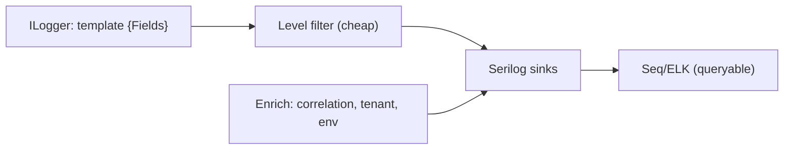
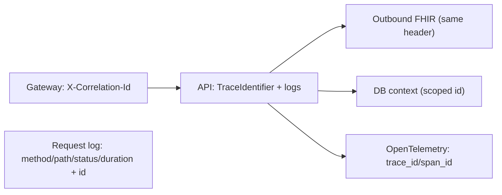
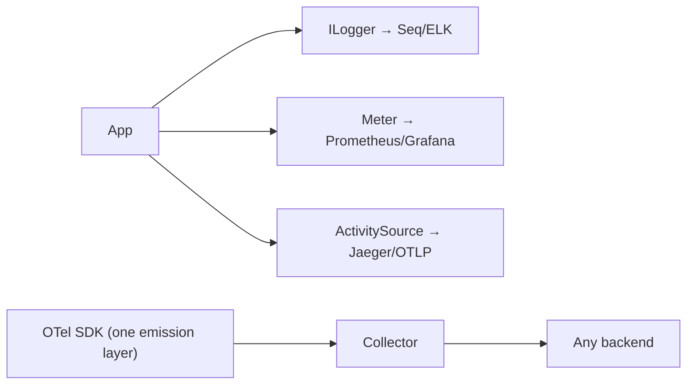
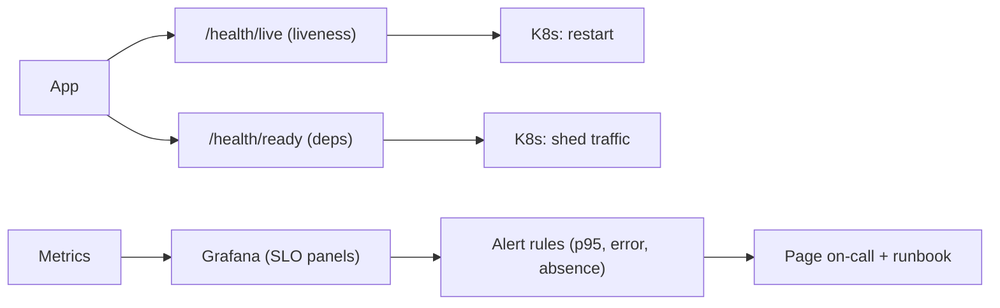
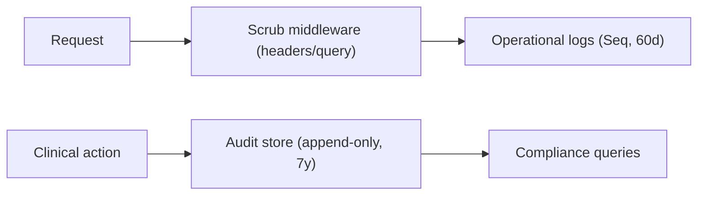
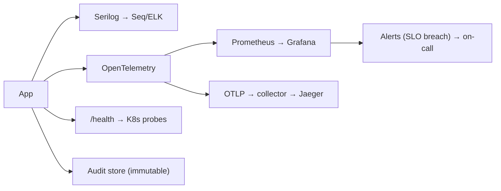

# Chapter 17: Logging & Monitoring

> **Audience:** Experienced .NET developers (5+ years) preparing for an L2 (Mid/Senior) interview at a Healthcare company.
> **Scope:** Structured logging with `ILogger` and Serilog, log levels and filtering, correlation IDs and scopes, request logging, logging vs. metrics vs. traces (OpenTelemetry), health checks and dashboards, alerting, log retention and the PHI/audit rules, and a production observability stack for a healthcare platform.

---

## 17.1 Structured Logging: Why Format Matters

### Interview Answer (30–45 seconds)

> "Structured logging means every event is a named object with typed fields — `Order {OrderId} submitted for patient {PatientId}` — not a formatted string. The fields are captured by the sink, so I can query `OrderId = 12345` across a million lines, build dashboards, and correlate. In .NET that's `ILogger<T>` with message templates plus a structured sink (Serilog writing to Seq/ELK/OpenTelemetry). The rules I enforce: **never interpolate** (`$"..."` defeats structure and allocates even when filtered), always use named placeholders, and include correlation/tenant/operation IDs on every log so a clinical incident is traceable end-to-end. For healthcare, structure also enables the audit story — knowing *what* happened is only useful if you can *search* what happened."

### Detailed Explanation

**Message templates:**

```csharp
// GOOD — structured: named fields captured as properties
_logger.LogInformation("Order {OrderId} for patient {PatientId} took {Ms}ms",
    orderId, patientId, ms);

// BAD — interpolation: renders immediately, no fields, allocates always
_logger.LogInformation($"Order {orderId} for patient {patientId} took {ms}ms");
```

**Why structure matters:**
- Queryability: `where OrderId = 12345` instead of grepping text.
- Dashboards: aggregate by status, tenant, duration.
- Correlation: the fields enable joining across services.
- Cost: filtered events skip rendering (zero cost when the level is off).

**Levels (Microsoft.Extensions.Logging):**
`Trace → Debug → Information → Warning → Error → Critical → None`

- `Information` — normal operational events.
- `Warning` — degraded but continuing.
- `Error` — a failure caught and handled.
- `Critical` — process/life-threatening failures.
- `Debug/Trace` — dev troubleshooting, filtered in prod.

**Sinks and enrichment:**
- Sinks: Console, Seq, Elasticsearch/OpenSearch, Loki, Application Insights, OpenTelemetry exporter.
- Enrichment: correlation ID, environment, host, tenant, user ID, version.
- Sinks are async/buffered (Chapter 15) so logging never taxes the request path.

### Real World Example (Healthcare)

A failed FHIR `Observation` write: the structured event `"Observation {ObservationId} write failed for patient {PatientId} in tenant {TenantId}: {ErrorCode}"` lets an engineer query *all* failures for a tenant in the last hour, grouped by `ErrorCode`, and drill into each — the classic debugging workflow that unstructured text can't deliver.

### Production Code Example

```csharp
// Registration (Serilog)
builder.Host.UseSerilog((ctx, cfg) => cfg
    .MinimumLevel.Information()
    .MinimumLevel.Override("Microsoft", LogEventLevel.Warning)
    .Enrich.WithProperty("Environment", ctx.HostingEnvironment.EnvironmentName)
    .Enrich.WithCorrelationId()
    .WriteTo.Console()
    .WriteTo.Async(a => a.Seq("http://seq:5341", batchPostingLimit: 100)));

// Usage
public sealed class ObservationWriter(ILogger<ObservationWriter> log)
{
    public async Task WriteAsync(Observation obs, CancellationToken ct)
    {
        var sw = Stopwatch.GetTimestamp();
        try
        {
            await _repo.SaveAsync(obs, ct);
            log.LogInformation("Observation {Id} saved for patient {PatientId} in {Ms}ms",
                obs.Id, obs.PatientId, Stopwatch.GetElapsedTime(sw).TotalMilliseconds);
        }
        catch (Exception ex) when (ex is not OperationCanceledException)
        {
            log.LogError(ex, "Observation {Id} save FAILED for patient {PatientId}",
                obs.Id, obs.PatientId);
            throw;
        }
    }
}
```

**Key lines explained:**

- Structured placeholders, not interpolation.
- Enrichment adds environment + correlation to every event.
- `MinimumLevel.Override("Microsoft", Warning)` filters framework noise in prod.

### Internal Working

- `ILogger<T>` resolves to a category-scoped logger that fans out to providers.
- Message templates are parsed into named properties; the sink stores them as fields (or renders text for console).
- Level checks happen before template parsing — a filtered `Information` call costs ~nothing.
- Serilog's `Async` wrapper drains to a background thread in batches (bounded buffer).

### Advantages

- Queryable, dashboards, correlation.
- Zero-cost when filtered (if structured).
- Swappable sinks without touching business code.

### Disadvantages

- Requires discipline (interpolation sneaks back in).
- Structured backends (Seq/ELK) cost infrastructure and money.
- Volume management needed at scale.

### Best Practices

- Always message templates; never `$"..."`.
- Include correlation, tenant, operation IDs in every event.
- Enrich globally (environment, host, version).
- Set production minimum levels deliberately (no Debug in prod).

### Common Mistakes

- String interpolation in log calls.
- Logging PHI bodies/payloads (compliance).
- Leaving Debug/Trace on in prod (cost + noise).
- No correlation ID → can't stitch a request together.

### Interview Follow-up Questions

1. Why is structured logging better than text?
2. What's the cost difference between the two log-call styles?
3. How do you enrich every log line?

### Senior Level Talking Points

- "A log line is a queryable fact, not prose. If it can't be searched by field and correlated, it's a string in a bucket."
- "Structured fields are also the audit enabler — the same event can feed dashboards and compliance review without a second code path."

### Diagram



### Comparison Table

| Style | Fields | Queryable | Cost when filtered |
|---|---|---|---|
| Interpolation | No | No | Allocates always |
| Structured template | Yes | Yes | ~zero |

### Memory Trick

**"Templates, not interpolation"** — the structured logging rule in four words.

### Summary

Structured logging captures typed fields, enabling query, dashboards, and correlation. Enforce message templates, global enrichment, and sane production levels.

### Interview Confidence Score

**High.** Structured logging is a guaranteed topic; the template-vs-interpolation and enrichment points are the differentiators.

---

## 17.2 Correlation IDs, Scopes, and Request Logging

### Interview Answer (30–45 seconds)

> "Correlation is how I stitch one logical operation across middleware, services, DB calls, and even other services. A **correlation ID** (usually `X-Correlation-Id` / `traceparent`) is accepted or generated at the edge, stored on the request, and attached to every log, metric, and outbound call. In ASP.NET Core, `HttpContext.TraceIdentifier` is the default; Serilog's `Enrich.WithCorrelationId()` makes it automatic. **Scopes** (`logger.BeginScope`) attach extra context (like a batch ID) to a group of events. **Request logging** (Serilog's `UseSerilogRequestLogging()` or a middleware) emits one structured line per request — method, path, status, duration, correlation — which becomes my primary troubleshooting surface."

### Detailed Explanation

**Correlation ID flow:**
1. Accept client's `X-Correlation-Id` (validate: length, charset — prevent log injection) or generate `Guid`.
2. Set it on `HttpContext.TraceIdentifier` and add to response headers.
3. Enrich all logs with it (Serilog `WithCorrelationId`).
4. Propagate to outbound HTTP (delegating handler sets the header) and to DB calls (logging context).
5. Distributed systems: OpenTelemetry `traceparent`/`trace-id` for cross-service stitching.

**Scopes:**
```csharp
using (log.BeginScope(new Dictionary<string, object>
       { ["TenantId"] = tenantId, ["BatchId"] = batchId }))
{
    // every log inside inherits TenantId + BatchId
}
```
- Nestable; useful for batch jobs and per-request context.
- Scope values are merged into the event properties.

**Request logging:**
- Serilog: `app.UseSerilogRequestLogging();` — one `RequestCompleted` event per request with `Method`, `Path`, `StatusCode`, `ElapsedMs`, plus correlation enrichment.
- Custom middleware (Chapter 10) when you need more (audit, headers).
- Must sit **after** correlation enrichment and **after** PHI scrub (Chapter 10 ordering).

**Distributed tracing (OpenTelemetry):**
- `ActivitySource`/`Activity` propagate trace + span IDs; logs get `trace_id`/`span_id` fields — full distributed correlation.

### Real World Example (Healthcare)

A FHIR request from the clinician portal: the gateway assigns `X-Correlation-Id: 7f3a...`, the API logs it on every event, the outbound FHIR server call carries the same header, and OpenTelemetry assigns `trace_id` spanning API → FHIR → DB. When a patient-chart load is slow, one query by correlation ID returns the entire journey with per-layer timings.

### Production Code Example

```csharp
// Correlation middleware (from Chapter 10) + Serilog enrichment
builder.Host.UseSerilog((ctx, cfg) => cfg.Enrich.WithCorrelationId());

public sealed class CorrelationIdMiddleware
{
    public async Task InvokeAsync(HttpContext context, RequestDelegate next)
    {
        var id = context.Request.Headers["X-Correlation-Id"].FirstOrDefault();
        if (string.IsNullOrWhiteSpace(id) || id.Length > 64 ||
            id.Any(ch => ch is '\n' or '\r'))          // log-injection guard
            id = Guid.NewGuid().ToString("N");

        context.TraceIdentifier = id;
        context.Response.Headers["X-Correlation-Id"] = id;
        await next(context);
    }
}

// Request logging + propagation to outbound calls
app.UseSerilogRequestLogging();

builder.Services.AddHttpClient<IFhirClient, FhirClient>()
    .AddHttpMessageHandler(sp => new CorrelationPropagationHandler());

// One log line per request:
// {Method:GET} {Path:/fhir/Patient/1234} responded {StatusCode:200} in {ElapsedMs:12.3}ms
```

**Key lines explained:**

- The middleware owns ID assignment + validation (no log injection).
- `WithCorrelationId` uses `TraceIdentifier` for every log.
- Request logging produces the primary operational surface.

### Internal Working

- `TraceIdentifier` is a per-request property on `HttpContext`; Serilog's enrichment reads it per event.
- `BeginScope` pushes a scope object onto the logger factory's async-local stack.
- OpenTelemetry `Activity` runs alongside `TraceIdentifier`; exporters attach `trace_id`/`span_id` to logs.

### Advantages

- One ID ties the whole request lifecycle together.
- Scopes attach contextual metadata without per-call parameters.
- Request-log middleware gives free per-endpoint telemetry.

### Disadvantages

- Propagation must be consistent (headers, handlers, DB context).
- Unvalidated IDs allow log injection/spoofing.
- Distributed correlation needs OpenTelemetry discipline.

### Best Practices

- Validate incoming correlation IDs (length/charset); generate otherwise.
- Enrich globally; propagate to outbound calls.
- Use scopes for batch/tenant context.
- Pair request logging with PHI scrubbing (Chapter 10 order).

### Common Mistakes

- Accepting arbitrary unvalidated IDs (injection, spoofing).
- Forgetting to propagate to outbound HTTP/DB.
- Request logging before the scrub middleware (PHI leaks into logs).

### Interview Follow-up Questions

1. How do you correlate logs across services?
2. What is a scope useful for?
3. Why validate the incoming correlation ID?

### Senior Level Talking Points

- "The correlation ID is the first question in every incident: 'what's the ID?' — so I make it impossible to lose by enriching at the host level and propagating on every outbound call."
- "Scopes let a batch job stamp every line with its batch ID without threading parameters through every method."

### Diagram



### Comparison Table

| Mechanism | Scope | Use |
|---|---|---|
| Correlation ID | Whole request | Log stitching |
| TraceIdentifier | Request property | Default id |
| Scope | Group of events | Batch/tenant context |
| trace_id/span_id | Distributed | Cross-service tracing |

### Memory Trick

**"One ID per request, stamped on everything"** — the correlation rule.

### Summary

Correlation IDs, scopes, and request logging give the full per-request story. Validate IDs, enrich globally, propagate outbound, and keep the ordering (scrub before request-log) correct.

### Interview Confidence Score

**High.** Correlation/request-logging is a common production-readiness question; the injection-validation and ordering details are the senior edge.

---

## 17.3 Logging vs. Metrics vs. Traces — and OpenTelemetry

### Interview Answer (30–45 seconds)

> "The three pillars are distinct tools for distinct questions: **logs** tell the story of an event ('what happened'), **metrics** are aggregated numbers over time ('how many, how fast, how healthy'), and **traces** show the path of a single request across services ('where did the time go'). **OpenTelemetry** is the vendor-neutral framework that emits all three — `ILogger` for logs, `Meter`/`Counter`/`Histogram` for metrics, and `ActivitySource` for traces — to any backend (Jaeger, Prometheus, Datadog, App Insights). For a healthcare platform I use metrics for SLOs (p95 latency, error rate, queue depth), traces for distributed debugging, and logs for the detailed event trail — and I prefer emitting OpenTelemetry from the app so I can switch backends without changing code."

### Detailed Explanation

**The three pillars:**

| Pillar | Question | Example | Backend |
|---|---|---|---|
| Logs | What happened? | "Order failed: code X" | Seq/ELK/Loki |
| Metrics | How much/fast/healthy? | p95 latency, RPS, error rate | Prometheus/Grafana |
| Traces | Where did time go? | Span across API→DB→FHIR | Jaeger/OTLP |

**Metrics in .NET:**
- `Meter` + `Counter<T>` (rate), `Histogram<T>` (latency distributions), `UpDownCounter` (queue depth/gauges).
- `IMeterFactory`/`Meter` registered via DI; tags (endpoint, status, tenant) give dimensions.
- **Best practice:** instrument with `.NET metrics API` (built-in) and let OpenTelemetry scrape/export.

**Traces:**
- `ActivitySource.StartActivity("fhir.call")` creates spans with timings + attributes.
- Automatic instrumentation: `AddHttpClientInstrumentation`, `AddAspNetCoreInstrumentation`, EF Core/Redis instrumentations.
- Distributed propagation via `traceparent` header.

**OpenTelemetry wiring:**
- `builder.Services.AddOpenTelemetry().WithTracing(...).WithMetrics(...)` and a `UseOpenTelemetry` exporter (`OtlpExporter` → collector).
- Keep the app emitting OTLP so backends are swappable.

### Real World Example (Healthcare)

The FHIR API emits: `Histogram<long>` "fhir.request.duration" tagged by endpoint/status (metric → p95 dashboards + alerts); an `Activity` "fhir.fanout" wrapping the 20 downstream calls (trace → where latency goes); and Serilog structured logs (the detailed event trail). One OpenTelemetry exporter pushes all three to the observability backend; the p95 alert page is the ops team's first stop.

### Production Code Example

```csharp
// Metrics — histogram for endpoint latency
public sealed class FhirMetrics(IMeterFactory factory)
{
    private readonly Histogram<double> _duration = factory
        .Create("FhirApi")
        .CreateHistogram<double>("fhir.request.duration", "ms", "Request duration");

    public void Record(string endpoint, int status, double ms) =>
        _duration.Record(ms, new KeyValuePair<string, object?>("endpoint", endpoint),
                            new("status", status));
}

// OpenTelemetry wiring
builder.Services.AddOpenTelemetry()
    .WithTracing(t => t
        .AddAspNetCoreInstrumentation()
        .AddHttpClientInstrumentation()
        .AddEntityFrameworkCoreInstrumentation()
        .AddOtlpExporter())
    .WithMetrics(m => m
        .AddMeter("FhirApi", "System.Runtime")
        .AddPrometheusExporter());       // or OTLP to a collector

app.UseOpenTelemetryPrometheusScrapingEndpoint();
```

**Key lines explained:**

- `.NET metrics API` is the instrumentation surface; OTel exports it.
- Auto-instrumentation (HTTP, HttpClient, EF) covers the common spans without code.
- Prometheus endpoint + Grafana for dashboards; logs still go to Seq.

### Internal Working

- OpenTelemetry SDK aggregates instruments and exports via configured exporters (OTLP, Prometheus, console).
- `Activity`/spans nest and propagate `traceparent`; exporters translate to backend formats.
- Auto-instrumentation hooks frameworks at library boundaries (listeners/interceptors).

### Advantages

- One emission layer for all three pillars.
- Vendor-neutral — swap backends freely.
- Auto-instrumentation covers a lot for free.

### Disadvantages

- Operational complexity (collector, exporters, sampling decisions).
- More moving parts than a single-vendor SDK.
- Trace sampling is needed at scale (cost).

### Best Practices

- Instrument with the built-in APIs (ILogger, Meter, ActivitySource); export via OTel.
- Use metrics for SLOs, traces for debugging, logs for detail.
- Sample traces strategically (head/tail sampling) to bound cost.
- Keep tenant/endpoint/status dimensions on metrics for slicing.

### Common Mistakes

- Logging everything and calling it observability (missing metrics/traces).
- Double-instrumenting (custom + auto) → duplicate spans.
- No sampling at scale → exporter/backend overload.

### Interview Follow-up Questions

1. When would you use a metric vs a log vs a trace?
2. How does OpenTelemetry differ from using App Insights directly?
3. What's auto-instrumentation?

### Senior Level Talking Points

- "The three pillars answer three different questions, and OpenTelemetry lets the app emit all three through one neutral interface — so a backend switch (Datadog → Grafana) is config, not code."
- "Metrics give the SLO picture, traces give the anatomy, logs give the evidence — an incident needs all three."

### Diagram



### Comparison Table

| Pillar | Question | Instrument | Backend |
|---|---|---|---|
| Log | What happened? | ILogger/Serilog | Seq/ELK |
| Metric | How much/fast? | Meter/Histogram | Prometheus |
| Trace | Where's the time? | ActivitySource | Jaeger/OTLP |

### Memory Trick

**"Logs tell, metrics count, traces trace"** — the pillar mnemonic.

### Summary

Logs, metrics, and traces answer different questions; OpenTelemetry unifies emission so backends are swappable. Instrument with built-in APIs, export via OTel, and sample traces at scale.

### Interview Confidence Score

**High.** The three-pillars/OpenTelemetry conversation is modern senior material; the neutral-emission argument is the differentiator.

---

## 17.4 Health Checks, Dashboards, and Alerting

### Interview Answer (30–45 seconds)

> "Monitoring isn't dashboards — it's a loop: **health checks** answer 'is this instance OK?', **metrics** answer 'how is the fleet doing?', and **alerts** decide 'do I wake someone?' In ASP.NET Core, `AddHealthChecks()` + `MapHealthChecks("/health")` report liveness (process up) and readiness (dependencies OK: DB, Redis, FHIR server) — Kubernetes uses these to restart/shed traffic. Dashboards (Grafana) turn the metrics into SLO views (p95, error rate, queue depth, GC). Alerts fire on *SLO breaches* (p95 > 300ms for 5 min) and *absence* (no metric received = dead), with severity and runbooks. For healthcare, the alert must beat the clinician noticing — so thresholds are set from the latency budget (Chapter 15), not from history."

### Detailed Explanation

**Health checks:**
- `builder.Services.AddHealthChecks().AddDbContextCheck<ClinicalDbContext>().AddRedis(...).AddUrlGroup(fhirUrl)`;
- Liveness (`/health/live`) — process up, no dependency checks.
- Readiness (`/health/ready`) — dependencies reachable; Kubernetes stops routing when not ready.
- Custom `IHealthCheck` for app-specific probes (e.g., "is the terminology sync lagging?").
- Response JSON with per-check status for debugging.

**Dashboards (metrics → Grafana):**
- Panels: request rate, p50/p95/p99 latency, error rate, GC collections, threadpool queue, Redis/DB saturation, queue depth.
- SLO view: target lines overlaid on latency; error budget remaining.

**Alerting principles:**
- Alert on **SLO breach** (measurable impact), not on every anomaly.
- Use **absence alerts** (`up == 0`, no metric) for dead instances.
- Severity ladder: page → escalate; every alert has a runbook.
- Avoid alert fatigue: dedupe, group by service.

**Alert examples:**
- p95 latency > budget for 5 min.
- Error rate > 1% for 5 min.
- Health-check readiness failing.
- Queue depth > threshold (backpressure).
- GC time > X% (sustained).

### Real World Example (Healthcare)

A Grafana dashboard shows the FHIR API SLO panel: p95 overlaid on the 300ms budget line. Alert rules: `p95 > 300ms for 5m` → page the on-call; `error_rate > 1% for 5m` → page; `up{job="fhir-api"} == 0` → page. Kubernetes probes use `/health/live` (restart) and `/health/ready` (drain) so a degraded dependency stops traffic before clinicians notice latency.

### Production Code Example

```csharp
builder.Services.AddHealthChecks()
    .AddDbContextCheck<ClinicalDbContext>("db")
    .AddCheck<FhirServerHealthCheck>("fhir-server")
    .AddCheck<RedisHealthCheck>("redis");

var app = builder.Build();

app.MapHealthChecks("/health/live", new HealthCheckOptions
{
    Predicate = _ => false                       // liveness: process only
});
app.MapHealthChecks("/health/ready", new HealthCheckOptions
{
    Predicate = c => c.Name is "db" or "fhir-server" or "redis"
});

// Custom check: is the terminology sync behind?
public sealed class TerminologyLagCheck(ITerminologySync sync) : IHealthCheck
{
    public async Task<HealthCheckResult> CheckHealthAsync(
        HealthCheckContext context, CancellationToken ct)
    {
        var lag = await sync.GetLagAsync(ct);
        return lag > TimeSpan.FromMinutes(30)
            ? HealthCheckResult.Unhealthy($"terminology sync lag {lag}")
            : HealthCheckResult.Healthy();
    }
}
```

**Key lines explained:**

- Liveness vs readiness split — Kubernetes semantics.
- Custom checks encode app-specific health (sync lag).
- Predicates select which checks feed which endpoint.

### Internal Working

- Health check middleware runs registered `IHealthCheck`s (optionally in parallel) and aggregates results.
- Kubernetes `livenessProbe`/`readinessProbe` hit the endpoints; failures restart (liveness) or stop routing (readiness).
- Alerting rules poll Prometheus/metrics and fire when conditions hold for a duration.

### Advantages

- Declarative, framework-provided probes.
- SLO-driven alerts are meaningful, not noisy.
- Dashboards make capacity/regression trends visible.

### Disadvantages

- Too many/over-detailed checks → slow readiness polls and false negatives.
- Alert thresholds drift without periodic review.
- Dashboards without alerts are just decoration.

### Best Practices

- Split liveness/readiness; keep liveness cheap.
- Alert on SLO breaches and absence; give every alert a runbook.
- Set thresholds from latency budgets, reviewed on change.
- Verify probes actually fail when dependencies fail (test them).

### Common Mistakes

- `/health` doing no real dependency check (green while dying).
- Alerts with no runbook or severity → ignored.
- Thresholds set from current numbers (alerts every spike).

### Interview Follow-up Questions

1. Liveness vs readiness — what's the difference?
2. How do you decide what to alert on?
3. What makes a dashboard useful vs decorative?

### Senior Level Talking Points

- "Readiness is a traffic decision, liveness is a restart decision — conflating them is how you shed traffic on a healthy node or keep a dying one in rotation."
- "An alert without a runbook is noise; I ship the threshold with the explanation of what to do."

### Diagram



### Comparison Table

| Concern | Health check | Metric | Alert |
|---|---|---|---|
| Question | Is it up? | How is it doing? | Do I act? |
| Consumer | K8s/LB | Dashboards | On-call |
| Granularity | Instance | Fleet | Threshold |

### Memory Trick

**"Probes keep it alive, metrics keep it visible, alerts keep it honest"** — the monitoring triad.

### Summary

Health checks keep orchestration informed; metrics build SLO dashboards; alerts act on breaches with runbooks. Set thresholds from budgets, and test that probes fail.

### Interview Confidence Score

**High.** Health checks and SLO alerting are standard production-readiness questions; the liveness/readiness split and runbook discipline are the senior answers.

---

## 17.5 Log Retention, PHI in Logs, and Audit Logging

### Interview Answer (30–45 seconds)

> "For healthcare, logging has a compliance dimension: what you keep, how long, and what's in it. The rules I enforce: **no PHI in logs beyond the minimum identifier needed** — never payloads, never full records, never tokens; **structured fields only** so we can redact/sanitize at the boundary; a **scrubbing middleware** (Chapter 10) that strips `Authorization` headers and sensitive query strings before anything reaches a sink; **retention policies** (e.g., application logs 30 days, audit logs 1–7 years per policy) with immutable, append-only audit storage; and **audit logging** as a separate, tamper-evident trail of *who did what when* — distinct from the high-volume operational logs."

### Detailed Explanation

**The PHI boundary:**
- Never log: full patient records, SSN, full DOB (in combination), bearer tokens, payloads.
- Acceptable: required identifiers (patient ID, MRN), clinical action names, outcomes.
- Rule of thumb: log *what happened and the outcome*, not *the data*.

**Enforcement:**
- Scrub middleware before sinks (strip `Authorization`, cookies, sensitive query params).
- `LogInformation` discipline: audit the log *content* in code review.
- Automated regression test: "no PHI in logs" (Chapter 10.6) feeding a memory sink with a sensitive request.

**Retention:**
- Operational logs: short (30–90 days) — high volume, queryable.
- Audit logs: long (1–7 years per policy), immutable, append-only (hash-chained or write-once store).
- Compliance: HIPAA requires audit of ePHI access; retention policy must be documented and followed.

**Audit logging (separate concern):**
- Events: who (user/system), what (action), which resource, when, from where, outcome.
- Written transactionally or via outbox (Chapter 13 interceptor pattern).
- Immutable: append-only table, restricted access, or external store.
- Purpose: accountability — "who accessed patient X's record and why?"

### Real World Example (Healthcare)

The FHIR API scrubs headers and never logs bodies. A clinician "viewed patient record" event writes to the `AuditLog` table: `{User, PatientId, Action: View, At, Tenant}` — append-only. Application logs retain 60 days in Seq; the audit log retains 7 years in an immutable store. A compliance reviewer queries the audit log for "who viewed patient X" and gets a complete, tamper-evident answer.

### Production Code Example

```csharp
// PHI-scrubbing middleware (sits before request logging)
public sealed class PhiScrubbingMiddleware
{
    public async Task InvokeAsync(HttpContext context, RequestDelegate next)
    {
        // Scrub what downstream loggers will read
        var originalAuth = context.Request.Headers.Authorization;
        if (!string.IsNullOrEmpty(originalAuth))
            context.Request.Headers["Authorization"] = "Bearer [REDACTED]";

        // Note: real implementations must not mutate shared state —
        // log a scrubbed copy or scrub at the sink via destructuring.
        await next(context);
    }
}

// Audit event (separate from operational logs)
public sealed record AuditEvent(string Actor, string Action, string ResourceId,
    DateTimeOffset At, string TenantId, string Outcome);

public async Task RecordAuditAsync(AuditEvent e) =>
    await _auditStore.AppendAsync(e);      // append-only, immutable

// Retention config (Seq): 
//   retention: application logs = 60 days
//   audit log table: 7 years, archive to cold storage
```

**Key lines explained:**

- Scrubbing happens before any sink — PHI never reaches logs.
- Audit events are structured, minimal, immutable, and separate.
- Retention is explicit and documented (policy → implementation).

### Internal Working

- Scrubbing middleware operates on the request before sinks; sinks (Seq/ELK) can also destructure/redact fields.
- Audit stores write append-only rows; immutability via DB triggers/permissions or hash-chaining.
- Retention is enforced by the backend (Seq retention policies) and DB archive jobs.

### Advantages

- Compliance posture is designed in (HIPAA-friendly).
- Minimal identifiers still enable diagnosis.
- Audit trail is separate from noisy operational logs.

### Disadvantages

- Scrub middleware must be kept in sync with new endpoints.
- Immutable audit storage is operationally heavier.
- Redaction edge cases (query strings, serialized bodies) need care.

### Best Practices

- Log minimum identifiers, not payloads.
- Scrub at the boundary; verify with a "no PHI in logs" regression test.
- Separate operational vs audit logs; different retention.
- Audit = append-only, access-restricted, retention-documented.

### Common Mistakes

- Logging full request/response bodies "for debugging."
- Retaining audit logs only 30 days (compliance failure).
- Storing tokens or PHI in plaintext logs.

### Interview Follow-up Questions

1. How do you keep PHI out of logs?
2. What's the difference between application logs and audit logs?
3. How do you enforce retention?

### Senior Level Talking Points

- "Operational logs answer 'what broke'; audit logs answer 'who did what' — mixing them fails both questions. Separate stores, separate retention, immutable audit."
- "The scrub middleware plus a regression test is how 'no PHI in logs' survives ten engineers' refactors."

### Diagram



### Comparison Table

| Concern | Operational logs | Audit logs |
|---|---|---|
| Purpose | Debug/observe | Accountability |
| Volume | High | Low |
| Retention | 30–90 days | Years (policy) |
| Mutability | Mutable | Append-only |
| Content | Fields, no PHI | Who/what/when |

### Memory Trick

**"Operational is disposable, audit is evidence"** — keep them separate.

### Summary

Keep PHI out of logs (scrub at the boundary, minimal identifiers), separate operational from audit logs, enforce documented retention, and treat the audit trail as immutable evidence.

### Interview Confidence Score

**High (healthcare).** The PHI/audit/retention discipline is exactly what a healthcare interview probes; the scrub-plus-regression-test and separate-stores story is the strong answer.

---

## 17.6 A Production Observability Stack for Healthcare

### Interview Answer (30–45 seconds)

> "A production healthcare observability stack composes the pieces: **Serilog → Seq/ELK** for structured operational logs (60–90d retention, no PHI); **OpenTelemetry → Prometheus/Grafana** for metrics and distributed traces (SLO dashboards, p95 vs budget); **health checks** feeding Kubernetes (liveness/readiness); **alerting** on SLO breaches with runbooks; and a separate **immutable audit store** for accountability (7y). Everything is correlation-tagged (tenant, endpoint, trace ID) so an incident is one query from 'which tenant is slow?' to 'exactly which FHIR call was slow and why.' The design principle: observability should cost the request almost nothing (async sinks, sampling) while making any incident answerable in minutes."

### Detailed Explanation

**The stack:**

```
App (ASP.NET Core)
 ├── Serilog → Seq/ELK        (structured logs, 60d, scrubbed)
 ├── OpenTelemetry SDK
 │    ├── Metrics → Prometheus → Grafana (SLO dashboards)
 │    ├── Traces → Jaeger/OTLP collector (distributed debugging)
 │    └── Auto-instrumentation (HTTP, HttpClient, EF, Redis)
 ├── Health checks → /health/live + /health/ready → K8s
 └── Audit store (immutable, 7y) — separate
Alerting: SLO breach (p95, error rate) + absence → on-call + runbook
```

**Operating principles:**
- **Cost-aware:** async/buffered logging sinks; trace sampling; filtered levels.
- **SLO-driven:** dashboards overlay budgets; alerts fire on breach.
- **Correlated:** one trace/correlation ID spans the whole request.
- **Compliant:** no PHI in operational logs; audit separate and immutable.
- **Tested:** probes fail when dependencies fail; "no PHI in logs" regression test in CI.

**Operational workflows:**
- Incident: alert → Grafana dashboard → trace (which span slow) → log query (details) → runbook.
- Capacity: metrics trends → scale out before SLO breach.
- Review: audit log answers access questions.

### Real World Example (Healthcare)

On-call receives "p95 > 300ms for FHIR API." The Grafana SLO panel shows it's the `$expand` endpoint. A trace for a slow request shows the terminology DB call (not the cache) is the culprit; the log query with the correlation ID shows cache misses after a value-set publish. The runbook says: verify the version key, evict stale cache, done. Total time to diagnosis: minutes, not hours — because the stack was built to answer exactly that.

### Production Code Example

```csharp
// The wiring, consolidated
builder.Host.UseSerilog((ctx, cfg) => cfg
    .MinimumLevel.Information()
    .MinimumLevel.Override("Microsoft.AspNetCore", LogEventLevel.Warning)
    .Enrich.WithCorrelationId()
    .Enrich.WithProperty("Environment", ctx.HostingEnvironment.EnvironmentName)
    .WriteTo.Async(a => a.Seq("http://seq:5341")));

builder.Services.AddOpenTelemetry()
    .WithTracing(t => t.AddAspNetCoreInstrumentation()
        .AddHttpClientInstrumentation()
        .AddEntityFrameworkCoreInstrumentation()
        .AddOtlpExporter(o => o.Endpoint = new Uri("http://otel-collector:4317")))
    .WithMetrics(m => m.AddMeter("FhirApi", "System.Runtime")
        .AddPrometheusExporter());

builder.Services.AddHealthChecks()
    .AddDbContextCheck<ClinicalDbContext>("db")
    .AddCheck<TerminologyLagCheck>("terminology-sync");

var app = builder.Build();
app.UseSerilogRequestLogging();
app.UseMiddleware<CorrelationIdMiddleware>();
app.MapHealthChecks("/health/live", o => o.Predicate = _ => false);
app.MapHealthChecks("/health/ready", o => o.Predicate = c => c.Name != "self");
app.UseOpenTelemetryPrometheusScrapingEndpoint();
app.Run();
```

**Key lines explained:**

- One composition root wires logs, metrics, traces, and probes.
- Auto-instrumentation covers the common spans; app meters cover domain metrics.
- Health endpoints split liveness/readiness for Kubernetes.

### Internal Working

- OTel SDK batches and exports via OTLP/Prometheus; the collector fans out to backends.
- Seq/ELK receive async-batched Serilog events with correlation enrichment.
- Alert rules live in Prometheus/Alertmanager; runbooks attached to alerts.
- Audit store is written separately, append-only.

### Advantages

- One coherent, cost-aware, answerable observability layer.
- Vendor-neutral (swap Seq → ELK, Jaeger → Tempo) without app changes.
- Compliance and operations share the same instrumentation.

### Disadvantages

- Real infrastructure to run (collector, backends, dashboards).
- Sampling and volume tuning require ongoing care.
- More moving parts than a single vendor's agent.

### Best Practices

- Wire logs/metrics/traces from one composition root.
- Sample traces; filter and async-buffer logs; keep cost flat.
- Alerts on SLO breach + absence, each with a runbook.
- Keep audit separate and immutable; no PHI in operational logs.

### Common Mistakes

- A dashboard with no alerts (watching, not operating).
- Full-fidelity logging with no sampling → cost explosion.
- Audit and operational logs mixed → retention/immutability impossible.

### Interview Follow-up Questions

1. Design observability for a multi-service healthcare platform.
2. How do you keep observability cost under control?
3. What's your incident workflow from alert to fix?

### Senior Level Talking Points

- "The stack's job is to make the median incident answerable in minutes: alert points to service, trace points to span, log provides detail, runbook provides the fix."
- "Observability that costs the request real latency is observability that lies under load — async sinks and sampling are how I keep it honest."

### Diagram



### Comparison Table

| Component | Tool | Role |
|---|---|---|
| Logs | Serilog → Seq/ELK | Event detail |
| Metrics | Prometheus/Grafana | SLO + trends |
| Traces | OTLP/Jaeger | Distributed anatomy |
| Probes | Health checks | K8s lifecycle |
| Audit | Immutable store | Accountability |

### Memory Trick

**"Logs for detail, metrics for SLOs, traces for paths, audit for answers"** — the four-question observability stack.

### Summary

A healthcare observability stack unifies logs, metrics, traces, health checks, and audit under one cost-aware, vendor-neutral layer, with SLO-driven alerting. The design goal is minute-scale incident diagnosis with compliance intact.

### Interview Confidence Score

**High (healthcare).** The composed observability + compliance story is a flagship senior answer for a clinical platform interview.

---

## Chapter 17 Wrap-Up

### Top 10 Questions You Should Be Ready For

1. Why structured logging over text logging?
2. What are message templates and why not interpolation?
3. How do you correlate logs across a request and across services?
4. Logs vs metrics vs traces — when each?
5. How does OpenTelemetry fit in?
6. Liveness vs readiness health checks?
7. What do you alert on, and how do you avoid alert fatigue?
8. How do you keep PHI out of logs?
9. Operational logs vs audit logs — and retention?
10. Design a monitoring stack for a healthcare platform.

### Revision Notes (1 page)

- **Structured logging:** message templates with named fields; never interpolation (breaks structure, allocates). Queryable by field; enrich globally (correlation, tenant, env).
- **Correlation:** one ID per request (validate incoming, generate otherwise); Serilog `WithCorrelationId`; propagate outbound; OpenTelemetry `trace_id`/`span_id` for distributed; scopes for batch context.
- **Pillars:** logs = what happened; metrics = how much/fast/healthy (Meter/Histogram, Prometheus); traces = where time went (ActivitySource, OTLP). OpenTelemetry = neutral emission; auto-instrumentation; sample traces.
- **Health/monitoring:** `/health/live` (liveness, cheap) vs `/health/ready` (deps) for K8s; Grafana SLO dashboards; alert on SLO breach + absence, each with a runbook; thresholds from budgets.
- **PHI/compliance:** never log payloads/tokens; scrub at the boundary; "no PHI in logs" regression test; operational logs 30–90d; audit logs years, append-only, separate, immutable.
- **Stack:** Serilog→Seq/ELK (logs), OTel→Prometheus/Grafana (metrics) + Jaeger (traces), health probes → K8s, immutable audit store, SLO alerting. Cost-aware (async sinks, sampling, filtered levels).

### Things Interviewers Expect From 5+ Years Experience

- Structured-logging fluency (template discipline, enrichment).
- Correlation as a first-class design (validation, propagation).
- The three-pillars + OpenTelemetry distinction.
- Liveness/readiness and SLO-alerting (with runbooks).
- PHI/audit/retention discipline without being told.
- A coherent, cost-aware observability architecture.

### Cheat Sheet

```
STRUCTURED LOGGING:
  message templates {Field} — NEVER $"" interpolation
  enrich: correlation id, tenant, environment, version
  prod levels: Information, Microsoft.* = Warning, no Debug

CORRELATION:
  validate incoming X-Correlation-Id (length/charset)
  TraceIdentifier + Enrich.WithCorrelationId()
  propagate to outbound calls (handler) · scopes for batches
  OpenTelemetry trace_id/span_id for cross-service

PILLARS: logs = what · metrics = how much (Meter/Histogram)
  traces = where (ActivitySource) · OTel = neutral emission
  auto-instrumentation (HTTP/HttpClient/EF/Redis) · sample traces

HEALTH: /health/live (process) vs /health/ready (deps)
  custom checks (sync lag, FHIR reachability)
  dashboards = SLO panels · alerts = breach + absence + runbook

PHI RULES:
  no payloads/tokens/full records · minimum identifiers only
  scrub middleware BEFORE sinks · regression test in CI
  operational logs 30-90d · audit append-only years, separate

STACK: Serilog→Seq/ELK · OTel→Prometheus/Grafana+Jaeger
  health→K8s · immutable audit · SLO alerts
  cost: async sinks, sampling, filtered levels
```

### Flash Cards

**Q1:** Structured vs interpolated log? **A:** Templates capture fields; interpolation renders text and allocates always.

**Q2:** Correlation ID? **A:** One ID per request stamped on all logs and propagated outbound.

**Q3:** Why validate incoming correlation ID? **A:** Prevent log injection/spoofing.

**Q4:** Scopes useful for? **A:** Attaching shared context (tenant/batch) to a group of events.

**Q5:** Logs vs metrics vs traces? **A:** What happened / how much / where the time went.

**Q6:** OpenTelemetry? **A:** Vendor-neutral emission of logs, metrics, traces.

**Q7:** Liveness vs readiness? **A:** Liveness = process up (restart); readiness = deps OK (traffic).

**Q8:** What to alert on? **A:** SLO breaches + absence of metrics, each with a runbook.

**Q9:** PHI in logs? **A:** Never — minimum identifiers, scrub at boundary, regression test.

**Q10:** Operational vs audit logs? **A:** Debug/observe (30–90d) vs accountability (years, immutable, separate).

**Q11:** Trace sampling? **A:** Bound cost at scale; keep logs/metrics full.

**Q12:** Why async log sinks? **A:** So observability doesn't tax the request path.

**Q13:** SLO thresholds from? **A:** The latency budget (clinical workflow), reviewed on change.

**Q14:** First step in an incident? **A:** The correlation/trace ID → dashboard → span → log → runbook.

### Interview Confidence Score

**High.** Logging and monitoring are asked everywhere, and the structured/correlated/compliant observability story is a flagship senior answer — especially for healthcare, where PHI, audit, and uptime are non-negotiable.

---

*Continue → Chapter 18: Docker*
