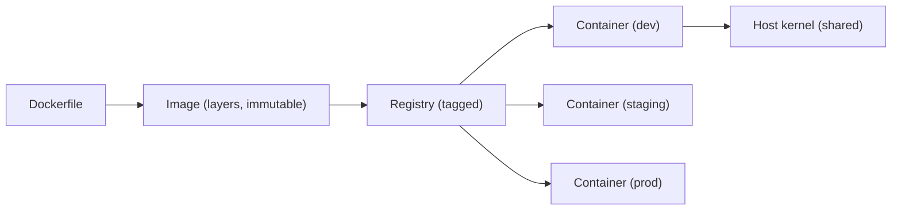
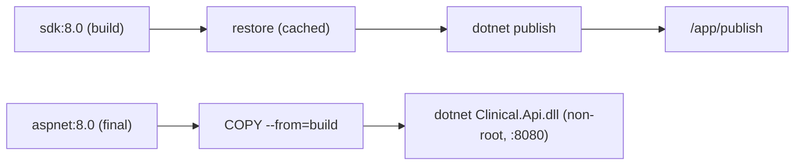
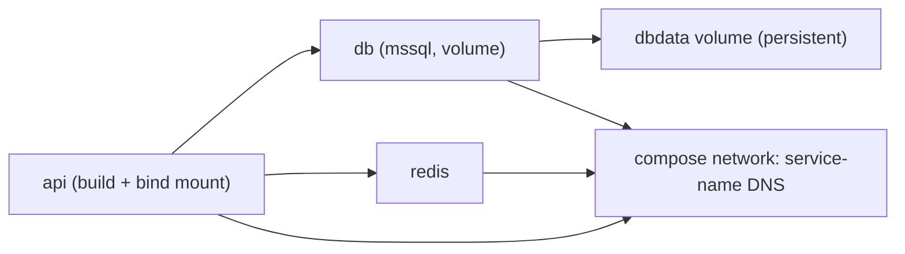
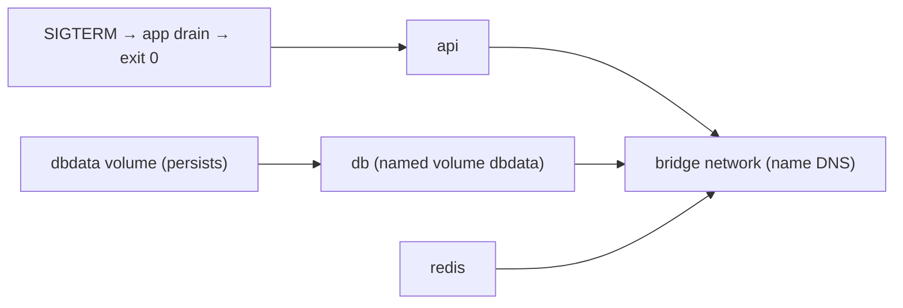
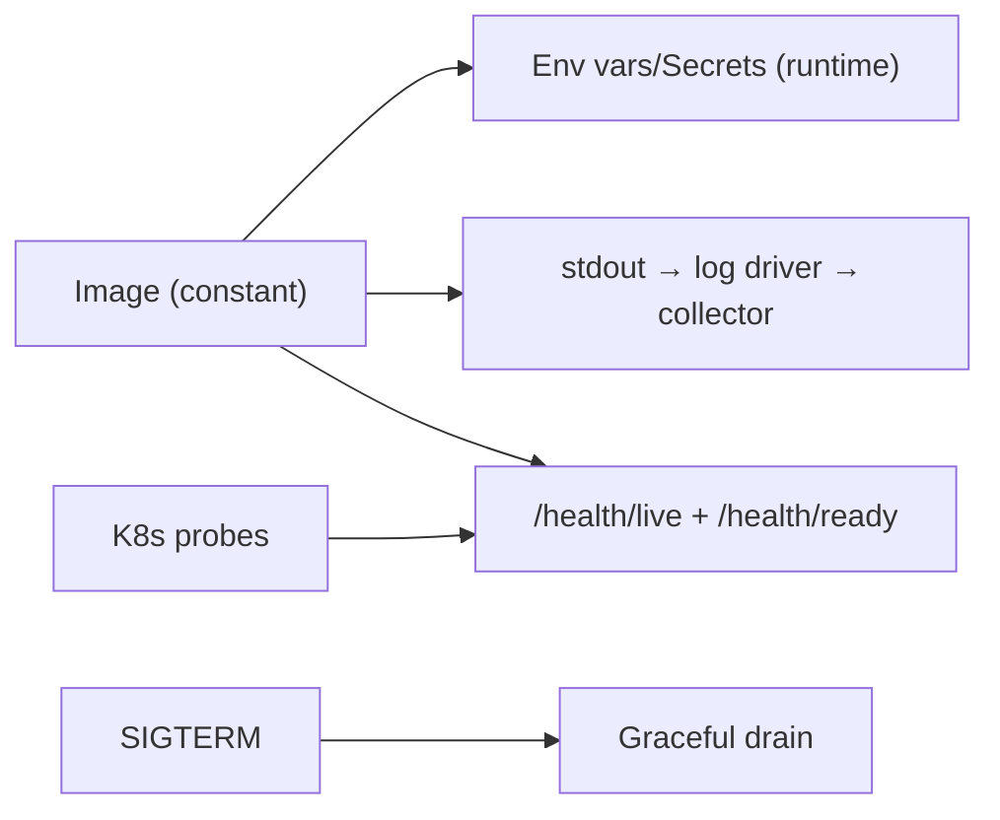

# Chapter 18: Docker

> **Audience:** Experienced .NET developers (5+ years) preparing for an L2 (Mid/Senior) interview at a Healthcare company.
> **Scope:** Containers vs VMs, images and layers, the `Dockerfile` for ASP.NET Core (multi-stage builds, SDK vs runtime base images), `docker-compose` for local development, image size and security (distroless, non-root, minimal packages), registries and tags, volumes and networking, container lifecycle (stop/graceful shutdown, health checks), and running .NET in containers — the healthcare angle being consistent, minimal, auditable, PHI-safe images.

---

## 18.1 Containers vs. VMs — What Docker Actually Is

### Interview Answer (30–45 seconds)

> "A container is an isolated process namespace: it shares the host's kernel but gets its own filesystem, process tree, network, and users via Linux namespaces and control groups (cgroups). A VM virtualizes hardware and runs a full OS; a container shares the OS and isolates the app — that's why containers boot in seconds and use a fraction of the resources. Docker packages an app plus its dependencies into an immutable image (a set of read-only layers) and runs it as a container. For .NET that means the same `mcr.microsoft.com/dotnet` image runs my app identically on a laptop, a CI server, and a production Linux host — the classic 'works everywhere' contract."

### Detailed Explanation

**Container vs VM:**

| Aspect | VM | Container |
|---|---|---|
| Virtualizes | Hardware | OS (kernel shared) |
| Isolation | Full guest OS | Process/namespace |
| Boot time | Minutes | Sub-second to seconds |
| Size | GBs | MBs–hundreds of MB |
| Density | Low (per-OS overhead) | High (one kernel) |
| Security boundary | Strong | Weaker (shared kernel) |

**Core concepts:**
- **Image** — immutable template: app + runtime + config (layers).
- **Container** — a running instance of an image.
- **Registry** — stores/distributes images (Docker Hub, ACR, GHCR).
- **Dockerfile** — declarative recipe for building an image.
- **Volume** — persistent storage outside the container's writable layer.
- **Network** — bridges between containers / host.

**Layers:**
- Each instruction adds a layer (union filesystem).
- Layers are cached and shared — rebuilds only re-run changed steps.
- Images are pull-once, run-many: identical bits across environments.

**Why .NET + containers:**
- Cross-platform self-contained runs unchanged on Linux hosts.
- Small images with trimming/self-contained or runtime base images.
- Consistency for CI/CD and reproducible deploys.

### Real World Example (Healthcare)

A FHIR API is built as a Linux container image from the `aspnet:8.0` runtime base, pushed to ACR, and run identically in local Docker Compose (dev), staging, and production Kubernetes. The DB and Redis are separate containers/services. Because the image is immutable, the bits that passed integration tests are exactly the bits that run in prod — a reproducibility guarantee that matters for a regulated clinical workload.

### Production Code Example

```bash
# Build a .NET container image
docker build -t clinical/fhir-api:1.2.0 .

# Run it (with a name, port mapping, and env config)
docker run --rm -d \
  -p 8080:8080 \
  -e ASPNETCORE_ENVIRONMENT=Production \
  -e ConnectionStrings__ClinicalDb="$DBCONN" \
  --name fhir-api \
  clinical/fhir-api:1.2.0

# Inspect running processes / logs
docker ps
docker logs -f fhir-api
```

**Key lines explained:**

- `-p 8080:8080` maps host port to container port.
- Environment variables feed ASP.NET Core config (Chapter 9) — no secrets baked into the image.
- The image tag (`1.2.0`) pins exactly what's running — auditable/reproducible.

### Internal Working

- Docker Engine uses `runc` (OCI runtime) + namespaces (`pid`, `net`, `mnt`, `uts`, `ipc`, `user`) + cgroups (CPU/memory limits).
- OverlayFS stacks image layers read-only; the container adds a thin writable top layer (discarded on `docker rm`).
- `docker run` forks an isolated process with its own root filesystem view.

### Advantages

- Reproducibility: same image everywhere.
- Resource efficiency vs VMs.
- Isolation for microservices (own deps, versions, config).

### Disadvantages

- Shared kernel = weaker isolation than VMs (use VMs/pod security for untrusted tenants).
- Storage/network abstractions add operational concepts.
- Image build/versioning discipline needed to avoid bloat.

### Best Practices

- Immutable images: build once, tag with version, never mutate running containers.
- Use specific tags (not `latest`) for auditable deploys.
- Prefer Linux images for production (smaller, cheaper, standard).

### Common Mistakes

- `latest` tags in prod (unknowable bits).
- Mutating a running container (rebuild, don't patch).
- Windows base images when Linux suffices.

### Interview Follow-up Questions

1. What actually isolates a container from the host?
2. Why are containers faster to start than VMs?
3. What makes images reproducible?

### Senior Level Talking Points

- "Containers give me immutable, bit-identical artifacts — the same image that passed tests is what runs in prod, which is the reproducibility a clinical platform needs."
- "I treat the image as the unit of deployment, and the tag as the audit trail."

### Diagram



### Comparison Table

| Concern | VM | Container |
|---|---|---|
| Kernel | Own OS | Shared |
| Boot | Minutes | Seconds |
| Footprint | GBs | MBs |
| Isolation | Hardware | Namespaces |
| Use | Untrusted tenants | App isolation |

### Memory Trick

**"Shared kernel, isolated app, immutable image"** — the container trio.

### Summary

Containers isolate apps over a shared kernel, images are immutable layered artifacts, and Docker makes .NET apps reproducible everywhere. Understand layers, tags, and when VMs are still needed.

### Interview Confidence Score

**High.** Container-vs-VM and image concepts are standard; the reproducibility/immutability framing is the senior angle.

---

## 18.2 The Dockerfile: Multi-Stage Builds for ASP.NET Core

### Interview Answer (30–45 seconds)

> "The canonical .NET `Dockerfile` is a **multi-stage build**: a first stage uses the full `sdk` image to `dotnet restore` (with the SDK lockfile) and `dotnet publish` (self-contained or framework-dependent), and a final stage copies only the published output into the small `aspnet` runtime image. This is key: the SDK (hundreds of MB, compilers) never ships; the runtime image is lean. I also set `EXPOSE`, run as a **non-root user** (`USER $APP_UID` is built into the `aspnet` images), configure `ASPNETCORE_URLS=http://+:8080`, and add a health check. The result is a small, secure, production-ready image."

### Detailed Explanation

**Multi-stage build anatomy:**

```dockerfile
# 1. Build stage — full SDK
FROM mcr.microsoft.com/dotnet/sdk:8.0 AS build
WORKDIR /src

# Restore once, cache layers
COPY src/Clinical.Api/Clinical.Api.csproj .
RUN dotnet restore

COPY src/Clinical.Api/ .
RUN dotnet publish -c Release -o /app/publish \
    --no-restore /p:UseAppHost=false

# 2. Runtime stage — lean aspnet image
FROM mcr.microsoft.com/dotnet/aspnet:8.0 AS final
WORKDIR /app
USER $APP_UID                        # non-root (built into aspnet images)
COPY --from=build /app/publish .
ENV ASPNETCORE_URLS=http://+:8080
EXPOSE 8080
HEALTHCHECK CMD curl -f http://localhost:8080/health/live || exit 1
ENTRYPOINT ["dotnet", "Clinical.Api.dll"]
```

**Why multi-stage:**
- The SDK image has compilers, NuGet cache, dev tools — big.
- The runtime (`aspnet`) image is minimal — only the runtime + ASP.NET Core.
- Only `publish` output (a few MB for the app + runtime deps) goes to the final image.

**Key details:**
- `--no-restore` after a prior `dotnet restore` stage speeds rebuilds and uses the SDK's cache.
- `/p:UseAppHost=false` avoids emitting the native host (not needed; saves size).
- `USER $APP_UID` — the `aspnet` image defines a non-root user; running as root in containers is a top security finding.
- `ASPNETCORE_URLS` binds to the container port; Kestrel on `+` (all interfaces).
- `HEALTHCHECK` feeds Docker's health state (Kubernetes uses its own probes).

**Trimming/self-contained:**
- `--self-contained true -r linux-x64` for no-runtime-needed images (bigger, fully static).
- Publish trimming (`PublishTrimmed`) can cut size but risks reflection issues (careful with EF/Newtonsoft).
- AOT (`PublishAot`) — smallest/fastest startup, but many APIs unsupported — evaluate before adopting.

### Real World Example (Healthcare)

The FHIR API image: build stage compiles with the SDK, final image is `aspnet:8.0` running as the built-in non-root user, exposing 8080, health-checking `/health/live`. Image size dropped from ~1.2GB (SDK-based single stage) to ~220MB; the image carries no compiler, no shell (where possible), and no secrets. It runs identically in Compose and in Kubernetes.

### Production Code Example

```dockerfile
FROM mcr.microsoft.com/dotnet/sdk:8.0 AS build
WORKDIR /src
COPY ["src/Clinical.Api/Clinical.Api.csproj", "Clinical.Api/"]
RUN dotnet restore "Clinical.Api/Clinical.Api.csproj"
COPY src/ .
WORKDIR "/src/Clinical.Api"
RUN dotnet publish -c Release -o /app/publish --no-restore /p:UseAppHost=false

FROM mcr.microsoft.com/dotnet/aspnet:8.0 AS final
WORKDIR /app
USER $APP_UID
COPY --from=build /app/publish .
ENV ASPNETCORE_URLS=http://+:8080
EXPOSE 8080
ENTRYPOINT ["dotnet", "Clinical.Api.dll"]
```

**Key lines explained:**

- Restore is its own cached layer — dependency-only changes rebuild fast.
- Publish output is the only thing copied into the final image.
- Non-root user + explicit URL binding are production defaults.

### Internal Working

- Docker executes stages sequentially; `COPY --from=build` pulls files from an earlier stage without carrying its layers into the final image.
- Layer caching: if a `COPY` input hash is unchanged, Docker reuses the cached layer — hence the csproj-first restore ordering.
- The `aspnet` image includes the runtime + ASP.NET Core shared framework; `USER $APP_UID` switches to uid 1654.

### Advantages

- Final image is small and secure (no SDK, no shell, non-root).
- Layer caching makes iterative builds fast.
- One `Dockerfile` builds for any target platform.

### Disadvantages

- Trimming/AOT add compatibility risk.
- Multi-stage is more complex to write than a naive single stage.
- Base image updates require rebuilds (track CVEs).

### Best Practices

- Multi-stage always; restore-first for cache.
- Non-root (`USER $APP_UID`), explicit `ASPNETCORE_URLS`, `EXPOSE`.
- Pin base image tags (patch-level) and update on a cadence.
- Add `HEALTHCHECK`; scan images for CVEs in CI.

### Common Mistakes

- Copying the whole project before restore (breaks layer caching).
- Single-stage SDK image shipped to prod (huge, includes compilers).
- Running as root; no health check; `latest` base tags.

### Interview Follow-up Questions

1. Why multi-stage for .NET?
2. What does `/p:UseAppHost=false` do?
3. When would you use AOT or trimming?

### Senior Level Talking Points

- "The SDK never ships — the publish output rides the runtime image, and the image runs non-root with a health check. That's the difference between a dev box and a deployable artifact."
- "Trimming and AOT are evaluated per-service: the size/startup win must beat the reflection-compat risk."

### Diagram



### Comparison Table

| Stage | Image | Contents | Ships? |
|---|---|---|---|
| build | sdk | compilers, NuGet | No |
| final | aspnet | runtime + publish output | Yes |

### Memory Trick

**"SDK builds, runtime ships"** — the multi-stage rule.

### Summary

Multi-stage builds keep the SDK out of production images: restore-first for cache, publish once, copy into the lean `aspnet` base running non-root with explicit URL binding and a health check.

### Interview Confidence Score

**High.** The Dockerfile multi-stage pattern is a top Docker question; non-root, cache ordering, and size reasoning are the senior points.

---

## 18.3 Docker Compose for Local Development

### Interview Answer (30–45 seconds)

> "`docker compose` defines a multi-container local stack in YAML: my API, SQL Server, Redis, and any sidecars — each as a service with image, ports, env, volumes, and dependencies. One `docker compose up` brings the whole clinical stack up reproducibly, so new developers get a working environment in minutes instead of installing databases by hand. I keep `compose.yaml` for dev (bind-mounted source + hot reload) and treat production as Kubernetes's job — Compose is a dev/test tool, not a prod orchestrator."

### Detailed Explanation

**The compose file shape:**

```yaml
services:
  api:
    build: .
    ports: ["8080:8080"]
    environment:
      ASPNETCORE_ENVIRONMENT: Development
      ConnectionStrings__ClinicalDb: "Server=db;Database=ClinicalDb;User Id=sa;Password=${DB_PASSWORD};TrustServerCertificate=true"
      ConnectionStrings__Redis: "redis:6379"
    depends_on:
      db: { condition: service_healthy }
      redis: { condition: service_healthy }
    volumes:
      - ./src:/app/src            # source bind-mount for hot reload (dev)
    healthcheck:
      test: ["CMD", "curl", "-f", "http://localhost:8080/health/live"]

  db:
    image: mcr.microsoft.com/mssql/server:2022-latest
    environment:
      ACCEPT_EULA: "Y"
      MSSQL_SA_PASSWORD: ${DB_PASSWORD}
    ports: ["1433:1433"]
    volumes:
      - dbdata:/var/opt/mssql        # named volume persists data
    healthcheck:
      test: ["CMD-SHELL", "/opt/mssql-tools18/bin/sqlcmd -S localhost -U sa -P $$MSSQL_SA_PASSWORD -Q 'SELECT 1'"]
      interval: 5s

  redis:
    image: redis:7-alpine
    ports: ["6379:6379"]

volumes:
  dbdata:
```

**Key concepts:**
- `services` — the containers; `build` (from Dockerfile) or `image` (prebuilt).
- `environment` — container env vars → ASP.NET Core config.
- `ports` — host→container mapping.
- `volumes` — named volumes (persistent data) vs bind mounts (source code, dev).
- `depends_on` with `condition: service_healthy` — start order + readiness.
- `${VAR}` — host env substitution; `$PASSWORD` from a local `.env` file (gitignored).
- `docker compose up -d` / `docker compose down`.

**Dev conveniences:**
- Bind-mount source + `dotnet watch` for hot reload.
- `docker compose logs -f api` for logs.
- Profiles to include/omit services (e.g., `--profile testing`).

### Real World Example (Healthcare)

A new engineer on the FHIR team runs `docker compose up`: SQL Server (with a `ClinicalDb` volume), Redis, and the API come up together; the API waits for healthy DB/Redis (`depends_on` conditions); migrations run at startup in dev; and `dotnet watch` hot-reloads source via a bind mount. No local DB installs, no guessing — a reproducible environment in minutes.

### Production Code Example

```bash
# Bring up the full dev stack
docker compose up -d

# Follow API logs
docker compose logs -f api

# Rebuild the API image after Dockerfile changes
docker compose build api && docker compose up -d api

# Tear down (keeps named volumes by default; -v removes them)
docker compose down
```

**Key lines explained:**

- `up -d` starts everything detached.
- `down` stops; `down -v` additionally removes volumes (destructive — data loss).
- Health-condition dependencies order startup correctly.

### Internal Working

- Compose creates a default network (`compose_default`) where services resolve by name (`db`, `redis`, `api`).
- Named volumes persist across `down`/`up`; bind mounts reflect host files live.
- `depends_on` waits for container start (or health when configured).

### Advantages

- Reproducible local environment for the whole team.
- Declarative; versioned with the repo.
- No per-dev machine setup.

### Disadvantages

- Not a production orchestrator (no scaling, no HA).
- Bind mounts + watch can be slower than native dev on some OSes.
- Image/db downloads are large initially.

### Best Practices

- Keep `compose.yaml` for dev/test; Kubernetes for prod.
- Use `depends_on: condition: service_healthy`.
- `.env` (gitignored) for secrets/passwords; reference with `${VAR}`.
- Named volumes for data; bind mounts for source in dev only.

### Common Mistakes

- Using Compose in production (no orchestration).
- Committing passwords into `compose.yaml`.
- `depends_on` without health conditions (start order race).

### Interview Follow-up Questions

1. How do you model start order in Compose?
2. Named volume vs bind mount?
3. Why not run Compose in production?

### Senior Level Talking Points

- "Compose is the developer experience; Kubernetes is the platform. The same image, the same env-var contract — only the orchestration differs."
- "A health-gated `depends_on` is the difference between 'it started' and 'it's ready'."

### Diagram



### Comparison Table

| Concern | Compose | Kubernetes |
|---|---|---|
| Scale | No | Yes |
| HA | No | Yes |
| Probes | healthcheck | liveness/readiness |
| Use | Dev/test | Production |

### Memory Trick

**"Compose for dev, K8s for prod"** — the orchestrator split.

### Summary

Compose gives a reproducible multi-container dev stack with health-gated startup, named volumes, and env config. Treat it as a dev/test tool; production belongs to an orchestrator.

### Interview Confidence Score

**Medium-High.** Compose is common in Docker discussions; the health-gating and dev/prod split are the senior points.

---

## 18.4 Image Size, Security, and Supply Chain

### Interview Answer (30–45 seconds)

> "Container security is layered. **Image hygiene**: multi-stage so only runtime ships; `aspnet` base (not `sdk`); consider distroless/`chiseled` images (no shell, non-root by default); scan for CVEs in CI (Trivy/Snyk) and fail the build on criticals; pin base tags and update on a cadence. **Runtime posture**: run non-root (`USER $APP_UID`), read-only root filesystem, no secrets in the image (env/vault only), resource limits, and a health check. **Supply chain**: signed images (cosign), digest-pinned deploys, private registry with access control. For healthcare, the image is part of the audit trail — knowing *exactly* what ran, with what base, scanned and signed."

### Detailed Explanation

**Size levers:**
- Multi-stage (SDK out).
- `aspnet` runtime base (smaller than `sdk`, smaller than full `dotnet` if you don't need ASP.NET).
- Distroless/chiseled: `mcr.microsoft.com/dotnet/aspnet:8.0-jammy-chiseled` — no shell, non-root, minimal attack surface.
- Self-contained + trimming/AOT where compatible.

**Security controls:**

| Layer | Control |
|---|---|
| Base image | Pinned, patched, minimal (chiseled) |
| Build | Non-root, no secrets in `COPY`/`ARG`, scan in CI |
| Image content | No SDK, no shell where possible, no package cache |
| Runtime | Non-root user, read-only root FS, resource limits, seccomp/AppArmor |
| Registry | Private, access-controlled, signed (cosign) |
| Deploy | Digest-pinned, not `latest` |

**Secret handling:**
- NEVER `ENV SECRET=...` or `COPY secret` into the image.
- Config via env vars at runtime / vault mounts.
- Build secrets via `--mount=type=secret` (don't bake into layers).
- Multi-stage: secrets used in build must not reach the final stage.

**Supply chain:**
- Pin base images by digest; update deliberately.
- SBOM generation (Syft) for vulnerability tracking.
- Sign images (cosign) and verify before deploy.
- Private registry + IAM/ACL.

### Real World Example (Healthcare)

The FHIR API image uses `aspnet:8.0-jammy-chiseled` (non-root, no shell), CI runs Trivy and fails on any critical CVE, images are signed with cosign, and deployments pin by digest. Secrets come from the orchestrator (K8s Secrets/vault), never the image. An audit can reconstruct exactly which base, which commit, and which digest ran in production on any date.

### Production Code Example

```dockerfile
FROM mcr.microsoft.com/dotnet/sdk:8.0 AS build
WORKDIR /src
COPY ["src/Clinical.Api/Clinical.Api.csproj", "Clinical.Api/"]
RUN dotnet restore "Clinical.Api/Clinical.Api.csproj"
COPY src/ .
RUN dotnet publish -c Release -o /app/publish --no-restore /p:UseAppHost=false

# Chiseled: no shell, non-root by default, minimal attack surface
FROM mcr.microsoft.com/dotnet/aspnet:8.0-jammy-chiseled AS final
WORKDIR /app
USER $APP_UID
COPY --from=build /app/publish .
ENV ASPNETCORE_URLS=http://+:8080
EXPOSE 8080
ENTRYPOINT ["dotnet", "Clinical.Api.dll"]
```

```bash
# CI: scan and sign
trivy image --severity HIGH,CRITICAL --fail-on-vulnerability clinical/fhir-api:1.2.0
cosign sign --key cosign.key clinical/fhir-api@sha256:...

# Deploy by digest (reproducible + verifiable)
docker pull clinical/fhir-api@sha256:abc123...
```

**Key lines explained:**

- Chiseled base = minimal, non-root, shell-less.
- Trivy gates the build on criticals; cosign signs the artifact.
- Digest-pinned deploys prevent tag drift.

### Internal Working

- Distroless/chiseled images strip the shell and package manager — fewer binaries to exploit.
- Read-only root FS (`--read-only`) forces writes to mounted volumes.
- CVE scanners map installed packages/binaries against vulnerability databases.

### Advantages

- Smaller, leaner, harder-to-exploit images.
- Non-root + read-only default posture.
- Supply chain verifiable (scan, sign, digest-pin).

### Disadvantages

- Chiseled/read-only complicates debugging (no shell to exec into).
- Trimming/AOT compat risk.
- Signing/scanning adds CI complexity.

### Best Practices

- Chiseled or minimal runtime bases; non-root; read-only FS.
- Scan in CI and fail on criticals; pin by digest.
- No secrets in images — env/vault only.
- Sign images; generate SBOMs.

### Common Mistakes

- Running as root (top container CVE finding).
- `latest` base tags (unpatchable drift).
- Baking secrets/`ARG`s into image layers.
- Shipping the SDK image to prod.

### Interview Follow-up Questions

1. How do you keep images small and secure?
2. What does 'chiseled' mean and why use it?
3. How do you handle secrets for containers?

### Senior Level Talking Points

- "The image is a supply-chain artifact: scanned, signed, digest-pinned, shell-less, non-root — so an auditor can reconstruct exactly what ran and prove nothing extraneous is in it."
- "Secrets never belong in the image; they arrive at runtime via the orchestrator's secret mechanism."

### Diagram


### Comparison Table

| Base | Shell | Non-root | Size |
|---|---|---|---|
| sdk | Yes | No | ~1GB |
| aspnet | Yes | Built-in UID | ~220MB |
| aspnet-chiseled | No | Yes | ~60–100MB |

### Memory Trick

**"Scan, sign, non-root, no shell, no secrets"** — the container security checklist.

### Summary

Container security is image hygiene + runtime posture + supply chain: chiseled bases, non-root read-only runs, CI scanning, cosign signing, digest-pinned deploys, and secrets via the orchestrator only.

### Interview Confidence Score

**High.** Image security/supply chain is a modern senior topic; the scan-sign-pin-non-root story is the differentiated answer.

---

## 18.5 Networking, Volumes, and Container Lifecycle

### Interview Answer (30–45 seconds)

> "Containers are ephemeral — the writable layer is discarded on removal, so **state lives in volumes**. I use named volumes for persistent data (DB files) and bind mounts for dev source code. Networking: containers on the same Docker network resolve each other by service name; published ports expose services to the host; internal services (DB, Redis) stay un-published. Lifecycle: containers get **SIGTERM on stop** — my app handles it for graceful shutdown (Chapter 9.8: drain in-flight requests), and Docker's `HEALTHCHECK` (or K8s probes) decides liveness. For healthcare, graceful shutdown matters: an un-drained deploy drops in-flight FHIR writes."

### Detailed Explanation

**Volumes:**
- **Named volume** (`vol:` in compose) — managed by Docker, persists across container recreation; the right choice for DB data.
- **Bind mount** (`./src:/app`) — host directory mounted in; dev hot-reload; not for prod state.
- **tmpfs** — in-memory, ephemeral scratch.
- Container's own writable layer — lost on `docker rm`; never store state there.

**Networking:**
- Default bridge network: containers reach each other by **service/container name** (built-in DNS).
- `-p host:container` publishes a port to the host.
- Internal services stay un-published (reachable only on the network).
- `--network host`/macvlan for special cases (rare).

**Lifecycle:**
- `docker stop` → sends **SIGTERM** → waits (default 10s, `--time`) → SIGKILL.
- Graceful handling: `IHostApplicationLifetime`/`stoppingToken` → drain requests → exit 0.
- `docker start/restart`, restart policies (`unless-stopped`, `on-failure`).
- Health: `HEALTHCHECK` (Docker) vs K8s probes (production).

**Graceful shutdown in .NET (recap Chapter 9.8):**
- `app.Lifetime.ApplicationStopping` + cancellation tokens in handlers/background services.
- `terminationGracePeriodSeconds` in K8s gives the drain window.

### Real World Example (Healthcare)

The `db` container's SQL Server data lives in a named volume (`dbdata`), so `docker compose down && up` preserves the clinical database. The API listens on the internal network (no host port in prod), fronted by an ingress. On deploy, K8s sends SIGTERM; the API stops accepting new requests, drains in-flight FHIR writes within the grace period, then exits — no dropped writes.

### Production Code Example

```yaml
# compose: state + networking + graceful lifecycle
services:
  api:
    build: .
    ports: ["8080:8080"]            # only the API is host-visible in dev
    restart: unless-stopped
    stop_grace_period: 30s          # time for graceful drain
    volumes:
      - ./src:/app/src              # bind mount (dev)
    environment:
      ConnectionStrings__ClinicalDb: "Server=db;...;TrustServerCertificate=true"
      ConnectionStrings__Redis: "redis:6379"

  db:
    image: mcr.microsoft.com/mssql/server:2022-latest
    volumes:
      - dbdata:/var/opt/mssql       # named volume = persistent state
    # no ports: not exposed to host

volumes:
  dbdata:
```

**Key lines explained:**

- Named volume persists DB data across container lifecycle.
- DB/Redis are internal-only (no `ports`) — reachable by name on the network.
- `stop_grace_period` gives the app time to drain on shutdown.

### Internal Working

- Docker creates a bridge network per Compose project; embedded DNS resolves service names.
- SIGTERM propagates as process termination signal to the container's PID 1; the .NET host intercepts it via `ApplicationStopping`.
- Named volumes are managed volumes under `/var/lib/docker/volumes`; bind mounts reference host paths directly.

### Advantages

- State decoupled from containers (survives recreation).
- Service-name networking is simple and static.
- Graceful lifecycle via signals.

### Disadvantages

- Ephemeral assumption means state is easy to lose if you forget volumes.
- Networking model differs from prod (K8s services/ingress).
- SIGTERM handling must be implemented in the app.

### Best Practices

- All persistent state in named volumes; nothing important in the writable layer.
- Keep internal services off host ports.
- Implement graceful shutdown (honor `stoppingToken`); set `stop_grace_period`.
- Use health checks to drive restart policies.

### Common Mistakes

- Storing DB files in the container (lost on recreate).
- Publishing DB/Redis ports to the host in prod.
- Ignoring SIGTERM → hard kills and dropped work.

### Interview Follow-up Questions

1. Named volume vs bind mount — when each?
2. How do containers on one network talk to each other?
3. How does graceful shutdown work with Docker/K8s signals?

### Senior Level Talking Points

- "Ephemerality is the design: stateless app containers, state in volumes, identity on the network — that's what makes restartable, scalable services possible."
- "Graceful shutdown is an SLA feature; honoring SIGTERM means deploys don't drop clinical writes."

### Diagram



### Comparison Table

| Storage | Persists? | Use |
|---|---|---|
| Writable layer | No (lost on rm) | Scratch only |
| Named volume | Yes | DB data, prod state |
| Bind mount | Host-owned | Dev source, config |
| tmpfs | No (memory) | Scratch, ephemeral |

### Memory Trick

**"State in volumes, names for DNS, SIGTERM for grace"** — the container lifecycle trio.

### Summary

Containers are ephemeral: put state in named volumes, keep internal services off host ports, and implement graceful shutdown so SIGTERM drains work instead of dropping it.

### Interview Confidence Score

**Medium-High.** Volumes/networking/lifecycle are common Docker topics; graceful-shutdown reasoning is the senior edge.

---

## 18.6 Running .NET in Containers — Configuration, Logs, and Health

### Interview Answer (30–45 seconds)

> "Running .NET well in a container means aligning the framework with container semantics. **Configuration** comes from env vars (Chapter 9) — `ConnectionStrings__ClinicalDb`, `Fhir__BaseUrl` — so one image serves all environments. **Logs** go to stdout/stderr (Serilog console sink) so the orchestrator's log driver collects them — never files in a container. **Health** via `/health/live` + `/health/ready` feeds probes. **Signals**: handle SIGTERM for graceful shutdown. And **Kestrel** binds to `ASPNETCORE_URLS=http://+:8080` (a non-privileged port; root isn't needed). The principle: the image is environment-agnostic; everything environment-specific arrives at runtime."

### Detailed Explanation

**Configuration in containers:**
- Env vars map to config keys: `ConnectionStrings__ClinicalDb` → `Configuration.GetConnectionString("ClinicalDb")`.
- Kubernetes: env from Secrets/ConfigMaps; `Secret` mounts for credentials.
- Never bake env-specific values into the image.

**Logging to stdout:**
- Containers have no persistent filesystem by default — log to console.
- Serilog console sink with JSON formatter → the log driver (Docker, K8s, cloud) ships to the collector.
- File sinks in containers = lost logs on recreate (unless a volume — but stdout is the standard).

**Health:**
- Kestrel serves `/health/live` (liveness) and `/health/ready` (readiness, Chapter 17.4).
- Docker `HEALTHCHECK`; K8s `livenessProbe`/`readinessProbe` with httpGet.
- Env-var-driven logging level (`Logging__LogLevel__Default=Information`).

**Process & signals:**
- `ENTRYPOINT ["dotnet", "Api.dll"]` — PID 1; .NET handles SIGTERM.
- Avoid init-overhead; `.NET 8` handles signals natively (no `init` needed).
- `UseAppHost=false` keeps it simple.

**Ports & privileges:**
- Bind to a non-privileged port (8080), not 80 — allows non-root.
- `ASPNETCORE_URLS=http://+:8080`.

### Real World Example (Healthcare)

One `fhir-api` image runs in dev (Compose, `ASPNETCORE_ENVIRONMENT=Development`) and prod (K8s, `Production` with secrets injected). Serilog writes JSON to stdout; the K8s cluster collects it to the logging backend. K8s probes hit `/health/ready`; on deploy, SIGTERM drains requests. There is no per-environment image — only per-environment config.

### Production Code Example

```dockerfile
FROM mcr.microsoft.com/dotnet/aspnet:8.0-jammy-chiseled AS final
WORKDIR /app
USER $APP_UID
COPY --from=build /app/publish .
ENV ASPNETCORE_URLS=http://+:8080
EXPOSE 8080
ENTRYPOINT ["dotnet", "Clinical.Api.dll"]
```

```yaml
# Kubernetes deployment excerpt
spec:
  containers:
    - name: fhir-api
      image: clinical/fhir-api@sha256:abc...
      ports: [{ containerPort: 8080 }]
      env:
        - name: ASPNETCORE_ENVIRONMENT
          value: "Production"
        - name: ConnectionStrings__ClinicalDb
          valueFrom:
            secretKeyRef: { name: clinical-db, key: connection }
      readinessProbe:
        httpGet: { path: /health/ready, port: 8080 }
        initialDelaySeconds: 10
      livenessProbe:
        httpGet: { path: /health/live, port: 8080 }
        periodSeconds: 30
      terminationGracePeriodSeconds: 60
```

**Key lines explained:**

- Env-var config drives behavior; secrets come from a K8s Secret.
- Probes map directly to the app's health endpoints.
- Grace period matches the app's drain window.

### Internal Working

- The .NET host reads env vars through the configuration providers at startup.
- Console logging writes structured lines to stdout (JSON via Serilog) — the orchestrator's log driver ships them.
- SIGTERM triggers `ApplicationStopping`; awaited `stoppingToken`s drain work.

### Advantages

- One image, any environment.
- Standard log/probe interfaces (orchestrator-native).
- Non-root, low-privilege port, graceful shutdown.

### Disadvantages

- Env-var sprawl needs naming discipline.
- JSON logs need a parser in the log backend.
- Wrong probe thresholds cause restart loops.

### Best Practices

- All env-specific config via env vars/Secrets.
- Log to stdout (JSON), never files.
- Expose `/health/live` + `/health/ready`; wire to probes.
- Graceful shutdown + matching grace period.

### Common Mistakes

- File-based logging in containers (lost logs).
- Binding port 80 (forces root) or a port the probe doesn't match.
- No readiness probe → traffic to a not-ready pod.
- Hard-coding environment values in the image.

### Interview Follow-up Questions

1. How do you pass config to a .NET container?
2. Why log to stdout in containers?
3. How do probes differ in Docker vs K8s?

### Senior Level Talking Points

- "The image is the constant; the environment is the variables. Config, secrets, and probes arrive at runtime — that's what makes a single immutable artifact deployable everywhere."
- "stdout logging plus health probes are the standard contract the orchestrator expects; anything else is reinventing it."

### Diagram



### Comparison Table

| Concern | In container | Wrong way |
|---|---|---|
| Config | Env vars/Secrets | Baked in image |
| Logs | stdout (JSON) | Files in writable layer |
| Health | HTTP probes | None |
| Signals | SIGTERM graceful | Ignore → hard kill |

### Memory Trick

**"Env for config, stdout for logs, probes for health, SIGTERM for grace"** — the container-native .NET contract.

### Summary

Run .NET in containers the container-native way: env-var config, stdout JSON logs, health probes, non-root port, and graceful SIGTERM handling. The image stays environment-agnostic.

### Interview Confidence Score

**High.** Running .NET in containers is a very common question; the environment-agnostic-image and stdout/probe contract are the senior answers.

---

## Chapter 18 Wrap-Up

### Top 10 Questions You Should Be Ready For

1. Containers vs VMs — what's isolated and what's shared?
2. Why multi-stage builds for .NET images?
3. How do you keep an image small and secure?
4. What is a chiseled/distroless image?
5. How do you handle secrets for containers?
6. Named volume vs bind mount?
7. How do containers on a network resolve each other?
8. How does graceful shutdown work with Docker/K8s?
9. How do you pass config and logs in a containerized .NET app?
10. What do liveness/readiness probes mean for a container?

### Revision Notes (1 page)

- **Containers:** isolated processes over a shared kernel (namespaces + cgroups); images are immutable layered artifacts; VMs virtualize hardware. Reproducibility: same image everywhere, tag = audit trail.
- **Dockerfile:** multi-stage — SDK builds (`restore` first for cache, `publish --no-restore`), final = `aspnet` runtime (non-root `USER $APP_UID`, `ASPNETCORE_URLS=http://+:8080`, `EXPOSE`, healthcheck). SDK never ships.
- **Compose:** dev/test only — services, health-gated `depends_on`, named volumes (data), bind mounts (dev source), `.env` secrets, service-name DNS.
- **Security/supply chain:** chiseled base (no shell, non-root), no secrets in image, CI CVE scan (Trivy), cosign signing, digest-pinned deploys, read-only FS.
- **Volumes/networking/lifecycle:** state in named volumes (writable layer is ephemeral); internal services un-published; SIGTERM → graceful drain; `stop_grace_period`.
- **.NET in containers:** env-var config, stdout JSON logs (never files), `/health/live`+`/health/ready`, non-privileged port, graceful shutdown. One image, env at runtime.

### Things Interviewers Expect From 5+ Years Experience

- The immutable-image/reproducibility mental model.
- Multi-stage + non-root + health check fluency.
- Security/supply chain awareness (scan, sign, digest).
- Graceful shutdown reasoning for zero-dropped-work deploys.
- Container-native .NET: env config, stdout logs, probes.
- Knowing Compose is dev-only and K8s is production.

### Cheat Sheet

```
CONTAINERS: isolated processes, shared kernel, immutable images
  VM = HW virtualization; container = namespace/cgroup isolation

DOCKERFILE (multi-stage):
  sdk: restore (csproj-first, cached) → publish -c Release --no-restore
  final: aspnet (chiseled) · USER $APP_UID · URLS=http://+:8080
  EXPOSE 8080 · HEALTHCHECK · ENTRYPOINT dotnet Api.dll
  /p:UseAppHost=false · SDK NEVER ships

COMPOSE: dev/test only
  depends_on: condition: service_healthy
  named volume = data (persist) · bind mount = dev source
  .env (gitignored) for secrets · service-name DNS

SECURITY: chiseled/no-shell · non-root · read-only FS
  scan (Trivy, fail on critical) · sign (cosign) · digest-pin
  secrets via env/vault — NEVER in image layers

LIFECYCLE: state in named volumes · SIGTERM = graceful drain
  stop_grace_period ~ drain window · health → restart policy

.NET IN CONTAINERS: env-var config · stdout JSON logs
  /health/live + /health/ready · non-root port 8080
  one image, environment at runtime
```

### Flash Cards

**Q1:** Container vs VM? **A:** Container shares the kernel (namespace/cgroup); VM virtualizes hardware.

**Q2:** Why multi-stage? **A:** SDK builds, only publish output ships in the lean runtime image.

**Q3:** Layer cache trick? **A:** `COPY` csproj + `restore` before the full source — dep-only changes reuse layers.

**Q4:** Chiseled image? **A:** No shell, non-root by default, minimal attack surface.

**Q5:** Secrets in images? **A:** Never — env vars/vault at runtime, build secrets via mounts.

**Q6:** Named volume vs bind mount? **A:** Named = persistent data; bind = host source (dev).

**Q7:** Internal container DNS? **A:** Service/container names on the same network.

**Q8:** SIGTERM handling? **A:** .NET host → ApplicationStopping → drain via cancellation tokens.

**Q9:** .NET logs in containers? **A:** stdout (JSON), collected by the log driver — not files.

**Q10:** Probes? **A:** /health/live (restart) and /health/ready (traffic) — wired to K8s probes.

**Q11:** Why port 8080 not 80? **A:** Non-privileged port allows non-root user.

**Q12:** Config for containers? **A:** Env vars (`ConnectionStrings__ClinicalDb`) / Secrets.

**Q13:** `latest` tag? **A:** Never in prod — digest-pin for auditable deploys.

**Q14:** Compose in production? **A:** No — dev/test only; Kubernetes orchestrates prod.

### Interview Confidence Score

**High.** Docker is a standard part of modern .NET interviews. Master multi-stage builds, security/supply chain, container-native .NET patterns, and graceful shutdown — the healthcare angle (reproducible, auditable, zero-dropped-work deploys) is a strong differentiator.

---

*Continue → Chapter 19: Kubernetes*
