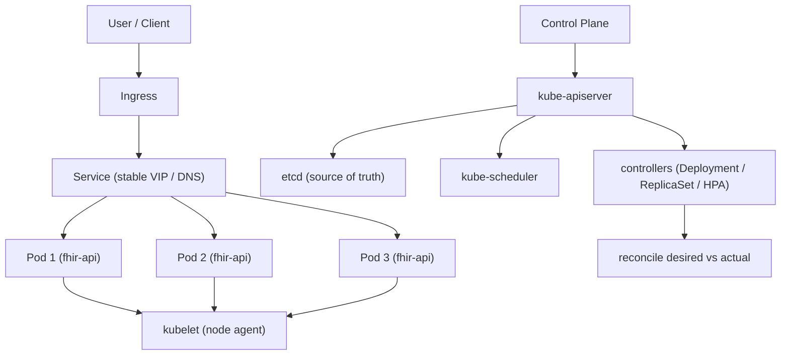

# Chapter 19: Kubernetes

> **Audience:** Experienced .NET developers (5+ years) preparing for an L2 (Mid/Senior) interview at a Healthcare company.
> **Scope:** Kubernetes fundamentals (pods, deployments, services, namespaces, configmaps, secrets, ingress), Deployments and rolling updates, probes (liveness/readiness/startup), horizontal autoscaling, affinity and taints/tolerations, resource requests/limits, Kubernetes for .NET apps (health checks wiring, graceful shutdown, configuration, secrets), StatefulSets vs Deployments, operators and CRDs (overview), and running ASP.NET Core in production clusters — the healthcare angle being availability, zero-downtime deploys, auditability, and PHI/PII isolation.

---

## 19.1 Kubernetes vs. Docker — What Problem Does Kubernetes Solve

### Interview Answer (30–45 seconds)

> "Docker gives you containers; Kubernetes gives you a platform to run them at scale. Kubernetes automates deployment, scaling, self-healing, service discovery, and rolling updates. I describe it as a distributed operating system for containers: you declare the desired state — how many replicas of a pod, what image, what resources — and the control plane continuously reconciles actual state to desired state. Docker is the packaging/runtime layer; Kubernetes is the orchestration layer that runs many containers across many machines. For a .NET service, Docker packages it into an image and Kubernetes schedules that image onto worker nodes, keeps it healthy, scales it, and routes traffic to it."

### Detailed Explanation

**The relationship:**

- **Docker** — builds and runs containers on a single host.
- **Kubernetes** — schedules and manages containers across a cluster of hosts.
- Kubernetes uses an OCI-compliant container runtime (containerd, CRI-O); Docker can even be the runtime in older clusters.

**Key components:**

- **Cluster** — a set of machines (nodes) running containerized apps.
- **Control plane** — the brain: `kube-apiserver` (all communication), `etcd` (the source-of-truth key-value store), `kube-scheduler` (picks nodes), `kube-controller-manager` (runs controllers).
- **Node (worker)** — runs `kubelet` (the agent), `kube-proxy` (networking), and the container runtime.
- **Pod** — the smallest deployable unit; one or more containers sharing a network namespace.
- **Deployment** — manages a set of identical pod replicas; handles rolling updates and rollbacks.
- **Service** — a stable network endpoint (virtual IP + DNS) in front of a set of pods.
- **Namespace** — a logical partition of the cluster (dev/staging/prod, or per-team).

**Declarative model:**

- You submit YAML describing the desired state (`kubectl apply`).
- Controllers in the control plane watch for drift and reconcile.
- Everything is stored in `etcd` — auditable, resumable.

**Why .NET teams adopt it:**

- Zero-downtime rolling deploys.
- Auto-healing (restart crashed pods, reschedule on node failure).
- Horizontal scaling (HPA).
- Declarative, Git-versioned infrastructure (GitOps).

### Real World Example (Healthcare)

A hospital FHIR API runs as a Deployment with 6 replicas behind a Service. Traffic spikes during shift handover; the Horizontal Pod Autoscaler adds replicas automatically. When a node fails, pods are rescheduled elsewhere within seconds. Deploys are rolling: a new ReplicaSet rolls out incrementally with zero downtime, and if the new version's readiness probe fails, Kubernetes rolls back automatically — critical for a clinical service that cannot go down.

### Production Code Example

```yaml
apiVersion: apps/v1
kind: Deployment
metadata:
  name: fhir-api
  namespace: clinical
spec:
  replicas: 6
  strategy:
    type: RollingUpdate
    rollingUpdate:
      maxUnavailable: 1
      maxSurge: 1
  selector:
    matchLabels:
      app: fhir-api
  template:
    metadata:
      labels:
        app: fhir-api
    spec:
      containers:
        - name: fhir-api
          image: clinical/fhir-api:1.2.0
          imagePullPolicy: IfNotPresent
          ports:
            - containerPort: 8080
          env:
            - name: ASPNETCORE_ENVIRONMENT
              value: "Production"
          envFrom:
            - configMapRef:
                name: fhir-api-config
            - secretRef:
                name: fhir-api-secrets
          resources:
            requests:
              cpu: 250m
              memory: 512Mi
            limits:
              cpu: "1"
              memory: 1Gi
          livenessProbe:
            httpGet:
              path: /health/live
              port: 8080
            initialDelaySeconds: 10
            periodSeconds: 10
          readinessProbe:
            httpGet:
              path: /health/ready
              port: 8080
            initialDelaySeconds: 5
            periodSeconds: 5
---
apiVersion: v1
kind: Service
metadata:
  name: fhir-api
  namespace: clinical
spec:
  selector:
    app: fhir-api
  ports:
    - port: 80
      targetPort: 8080
```

**Key lines explained:**

- `replicas: 6` + `RollingUpdate` — the desired-state contract.
- `requests`/`limits` — scheduler uses requests for placement; limits bound the pod (important on shared nodes).
- `livenessProbe`/`readinessProbe` — wired to the .NET Health Checks endpoints (Chapter 17).
- `envFrom` with ConfigMap + Secret — configuration and PHI-adjacent secrets stay out of the image.

### Internal Working

- `kubectl apply` → `kube-apiserver` validates and persists the desired state to `etcd`.
- The Deployment controller creates a new ReplicaSet; the ReplicaSet controller creates pods.
- `kube-scheduler` picks a node for each pending pod (fits based on requests, affinity, taints).
- `kubelet` on the node pulls the image and starts the container via the runtime.
- `kube-proxy` programs `iptables`/`IPVS` rules so the Service's virtual IP load-balances to pod IPs.
- Controllers continuously reconcile: desired state (etcd) vs. actual state (node reports).

### Advantages

- Self-healing: crashed pods restart; failed nodes reschedule work.
- Zero-downtime rolling updates with automatic rollback on probe failure.
- Horizontal and vertical autoscaling built in.
- Service discovery and load balancing for free via Services/DNS.
- Declarative, version-controlled infrastructure (GitOps-ready).
- Multi-tenant isolation via namespaces and RBAC.

### Disadvantages

- Significant operational complexity (control plane, etcd, networking, upgrades).
- Learning curve is steep; YAML sprawl and templating (Helm) add tooling overhead.
- Overkill for small/single-server workloads — a single Docker Compose host may suffice.
- Resource consumption: running a cluster (even managed) has fixed overhead.
- Debugging distributed state is harder than debugging a single host.

### Best Practices

- Always define `resources.requests` and `limits`; enforce with `LimitRange`/`ResourceQuota`.
- Wire liveness vs. readiness probes correctly (liveness = restart me; readiness = stop sending traffic). Do **not** make liveness depend on external dependencies (DB/Redis).
- Store configuration in ConfigMaps and secrets in Secrets (or an external secrets store); never bake them into images.
- Use `readOnlyRootFilesystem: true`, `runAsNonRoot: true`, and drop capabilities for containers.
- Pin image tags (or digests) and set `imagePullPolicy` deliberately; use a registry scan policy.
- Use `preStop` hooks + `terminationGracePeriodSeconds` so ASP.NET Core can drain gracefully.
- Put per-environment YAML in namespaces and use Helm/Kustomize to avoid duplication.

### Common Mistakes

- Putting DB connection-string secrets directly in the Deployment YAML or image.
- Readiness probe pointing to the same endpoint as liveness with no dependency check.
- Over/under-provisioning: no `limits` lets one pod starve the node; requests too high waste capacity.
- `maxUnavailable: 0, maxSurge: 0` in RollingUpdate (invalid — both can't be 0).
- Using `latest` image tags — non-reproducible.
- Long `terminationGracePeriodSeconds` combined with no graceful shutdown in the app (requests get killed mid-flight).
- Exposing internal Services with `ClusterIP` as `LoadBalancer`/`NodePort` without need.

### Interview Follow-up Questions

1. **"Liveness vs readiness vs startup probe?"** — Startup gates app initialization (slow first requests), readiness gates traffic, liveness gates restarts. Startup runs first and disables liveness until it succeeds.
2. **"How does a Service find pods?"** — Via a selector matching pod labels; endpoints controller tracks healthy endpoints.
3. **"What happens when a node dies?"** — `kubelet` heartbeat stops; after `node-monitor-grace-period` the node is marked `NotReady`; pods are deleted and rescheduled (time-based, not instant).
4. **"How does HPA decide to scale?"** — Watches metrics (CPU/memory/custom) via metrics-server or custom metric APIs; computes desired replica count from target utilization.
5. **"What's a StatefulSet?"** — For stateful workloads: stable network identity, stable persistent volumes, ordered rollout. .NET stateless APIs rarely need it (DBs handled outside or as operators).
6. **"Why would a pod be stuck in Pending?"** — Unschedulable: insufficient resources, unsatisfied affinity, tolerations missing for tainted nodes, or image pull issues.
7. **"How do you do a blue-green or canary deploy in Kubernetes?"** — Blue-green: two Deployments + Service selector flip. Canary: split traffic across two Deployments or use an ingress that weights.
8. **"What is a ConfigMap vs a Secret?"** — Both inject config; Secrets are base64-encoded (not encrypted by default) and intended for sensitive values; ConfigMaps for non-sensitive.
9. **"How does etcd fit in?"** — The cluster's source of truth; all desired state and cluster status; requires backup and quorum.
10. **"Can .NET run in Kubernetes on Windows nodes?"** — Yes, but Linux nodes are the norm for .NET; prefer Linux containers for consistency and cost.

### Senior Level Talking Points

- **Multi-tenancy in healthcare:** namespaces + `NetworkPolicy` + RBAC to isolate PHI/PII workloads; service mesh (Istio/Linkerd) for mTLS between services.
- **GitOps:** Argo CD/Flux reconcile the cluster to Git — auditability and rollback for regulated environments.
- **Cost/right-sizing:** requests vs. actual usage, VPA recommendations, cluster-autoscaler.
- **Reliability engineering:** pod disruption budgets (PDB) so voluntary disruptions never drop below a floor; topology spread zones.
- **Security hardening:** distroless images, `runAsNonRoot`, seccomp/AppArmor profiles, signed images (cosign), Policy-as-Code (OPA/Gatekeeper).
- **Kubernetes as a platform enabler** for the 12-factor app: stateless pods, config via env, graceful shutdown (Chapter 18), horizontal scale.

### Diagram



### Comparison Table

| Concern | Docker Compose | Kubernetes |
|---|---|---|
| Scope | Single host | Multi-node cluster |
| Rolling updates | Manual | Built-in, with rollback |
| Auto-healing | Manual restart | Self-healing controllers |
| Autoscaling | Not built-in | HPA/VPA |
| Service discovery | Manual links/networks | Services + DNS |
| Declarative desired state | `docker-compose.yml` (partial) | Full control-plane reconciliation |
| Secrets | `.env` / compose | Secrets + external stores |
| Operational overhead | Low | High |
| Use for .NET | Local dev, small deploys | Production microservices |

### Memory Trick

**"PODS → Deploy, Serve, Probe, Scale":** *Pods* are the unit; *Deploy*ments manage them; *Serve*ices route to them; *Probe*s keep them healthy; *Scale* (HPA) grows them. Desired state in etcd, controllers reconcile forever.

### Summary

Kubernetes is the orchestration layer that runs containerized .NET services reliably at scale. Know the pod/Deployment/Service triad, the probe trinity (startup/readiness/liveness), rolling-update semantics, and the declarative desired-state model. For healthcare interviews, stress availability and zero-downtime, PHI isolation via namespaces/network policies, and GitOps-driven auditability.

### Interview Confidence Score

**Confidence: High (after this chapter).** Kubernetes is frequently asked at L2 for platform/microservice roles. Master the declarative model, probe wiring for ASP.NET Core, resource management, and rolling update/rollback — and relate it to healthcare availability guarantees.

---

## Top 10 Interview Questions for This Chapter

1. Explain the difference between Kubernetes and Docker.
2. What is a Pod and why is it the smallest deployable unit?
3. Liveness, readiness, and startup probes — differences and when each runs.
4. How does a Kubernetes Deployment do a rolling update and rollback?
5. How does the Horizontal Pod Autoscaler decide to add replicas?
6. ConfigMap vs Secret — how would you pass a DB connection string in a healthcare cluster?
7. What happens when a worker node fails?
8. Requests vs limits — what happens when a pod exceeds its memory limit?
9. Why should .NET readiness probes not depend on the database?
10. How would you architect a PHI/PII microservice in a multi-tenant Kubernetes cluster?

## Revision Notes

- Containers = packaging/runtime (Docker); Kubernetes = orchestration/scale.
- Control plane: api-server → etcd, scheduler, controllers; workers: kubelet + runtime.
- Pod = one or more containers; Deployment manages replicas; Service = stable network endpoint.
- RollingUpdate with `maxUnavailable`/`maxSurge`; rollback on readiness failure.
- Probes: startup (init gate), readiness (traffic), liveness (restart). Keep liveness dependency-free.
- HPA scales on CPU/memory/custom metrics.
- `requests` for scheduling, `limits` for enforcement; OOMKill if limit exceeded.
- ConfigMaps for non-sensitive config; Secrets (base64, not encrypted) for sensitive; prefer external stores for PHI-adjacent secrets.
- `preStop` + `terminationGracePeriodSeconds` for graceful ASP.NET Core shutdown.
- Healthcare: namespaces + NetworkPolicy + RBAC + GitOps for auditability.

## Things Interviewers Expect from 5+ Years Experience

- You treat Kubernetes as a platform contract, not a script — declarative desired state, Git-versioned.
- You can design for zero-downtime deploys (probes, PDBs, rolling strategy) and explain trade-offs.
- You understand resource management and can diagnose unschedulable/restarting pods.
- You can articulate security isolation for PHI/PII (namespaces, network policies, RBAC, non-root images).
- You know when **not** to use Kubernetes (single host → Compose) — judgment over buzzwords.

## Cheat Sheet

```
kubectl get nodes | pods | deployments | services -n <ns>
kubectl apply -f deployment.yaml
kubectl rollout status deployment/fhir-api
kubectl rollout undo deployment/fhir-api
kubectl describe pod <pod>          # events, probes, image pull
kubectl logs <pod> -f --previous    # last container logs
kubectl get events --sort-by=.lastTimestamp
kubectl exec -it <pod> -- sh
kubectl scale deployment/fhir-api --replicas=6
kubectl set image deployment/fhir-api fhir-api=clinical/fhir-api:1.3.0
```

## Flash Cards

**Q:** What makes a pod restart? **A:** Liveness probe fails repeatedly, container exits, or node pressure evicts it.

**Q:** What's the difference between readiness and liveness? **A:** Readiness gates traffic (no restart); liveness triggers restart.

**Q:** How do I make an ASP.NET Core app drain gracefully? **A:** Use `IHostApplicationLifetime`/`StopAsync`, a `preStop` hook, and adequate `terminationGracePeriodSeconds`.

**Q:** Where does the scheduler put a pod? **A:** Node that satisfies requests, affinity, taints/tolerations; weighted by scoring.

**Q:** Why is `latest` a bad image tag? **A:** Non-reproducible; you can't audit exactly what is running.

**Q:** What happens if a pod exceeds its memory limit? **A:** The kernel OOM-kills the container; Kubernetes restarts it per restartPolicy.

**Q:** What is etcd? **A:** The cluster's distributed source-of-truth store for all desired state and status.

---

*Continue → Chapter 20: Redis*
