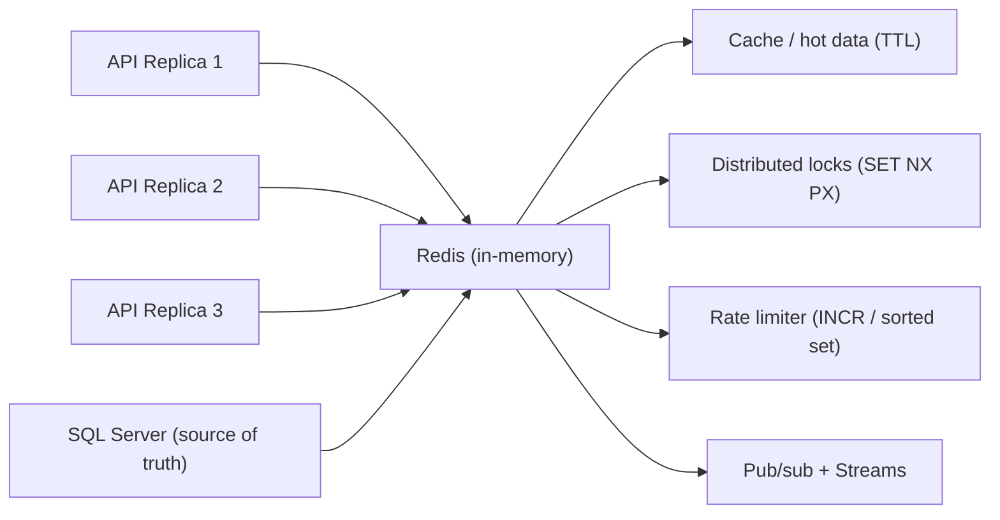

# Chapter 20: Redis

> **Audience:** Experienced .NET developers (5+ years) preparing for an L2 (Mid/Senior) interview at a Healthcare company.
> **Scope:** Redis fundamentals (data structures, persistence, clustering), the .NET clients (StackExchange.Redis, ConnectionMultiplexer, serialization, pooling), caching patterns (cache-aside, stampede protection, invalidation, TTLs), distributed locks, rate limiting, pub/sub and streams, and production concerns (monitoring, keyspace notifications, eviction) — the healthcare angle being cache consistency for PHI-adjacent data, distributed locking for shared clinical operations, and predictable latency.

---

## 20.1 What Is Redis and Why Use It

### Interview Answer (30–45 seconds)

> "Redis is an in-memory, key-value data store that's often used as a cache, a message broker, and a distributed-lock server. It holds all data in RAM, which gives sub-millisecond latency, and it supports rich data structures — strings, hashes, lists, sets, sorted sets, and streams — with atomic operations on each. It's single-threaded for command execution, which is what makes those operations atomic without locks. For .NET, we typically use StackExchange.Redis; you create one long-lived ConnectionMultiplexer per server and reuse it. In a healthcare stack I'd use it for caching FHIR resources, distributed locks around concurrent clinical updates, rate limiting API calls, and pub/sub for real-time notifications."

### Detailed Explanation

**What Redis is:**

- An in-memory key-value data store (BSD-licensed, written in C).
- Strengths: speed, rich types, atomic operations, pub/sub, Lua scripting, streams.
- Weaknesses: single-node memory bound (needs clustering for scale-out), no SQL, durability is a trade-off.

**Core data structures:**

| Type | Use case |
|---|---|
| String | Simple values, counters (`INCR`), JSON blobs |
| Hash | Object fields — maps a key to multiple field/value pairs |
| List | Queues, feed-like ordered data (`LPUSH`/`RPOP`) |
| Set | Unique membership, set math (union/intersect) |
| Sorted Set | Leaderboards, rate-limit sliding windows (score = timestamp) |
| Streams | Append-only event log, consumer groups |
| Geospatial | Location-based queries (healthcare: nearby providers) |

**Atomic operations & single-threaded model:**

- Commands run sequentially on one thread → `INCR`, `SET NX`, `LPUSH` are atomic by construction.
- Lua scripts execute atomically for multi-step logic.
- Distributed locks use `SET key value NX PX ttl`.

**Persistence options:**

- **RDB** — point-in-time snapshots; fast recovery, loses recent writes.
- **AOF** — append-only log; better durability, slower.
- Used as a cache → often no persistence (in-memory only).

**Clustering / high availability:**

- **Redis Sentinel** — monitoring + failover for a primary.
- **Redis Cluster** — sharding across masters + replication.

**.NET client:**

- `StackExchange.Redis` is the standard client.
- `ConnectionMultiplexer` is a single, long-lived, thread-safe connection pool.
- Serialization (JSON/MessagePack) is your responsibility; choose a binary serializer for high throughput.

### Real World Example (Healthcare)

A FHIR API caches frequently-read patient summaries with a TTL of 60 seconds. Because clinical data is sensitive, the cache holds only the resource identifier and a short-lived snapshot, and the cache key includes a tenant/hospital partition so PHI never crosses organizations. A shared cache key with `INCR` prevents the "thundering herd" when a popular resource expires. A Redis distributed lock serializes concurrent updates to a single patient record to avoid lost updates across API replicas.

### Production Code Example

```csharp
// Single long-lived multiplexer (registered as a singleton)
var mux = ConnectionMultiplexer.Connect("clinical-cache.redis:6379,abortConnect=false");
var db = mux.GetDatabase();

// Cache-aside with stampede protection
async Task<PatientSummary?> GetPatientSummaryAsync(string patientId)
{
    var key = $"patient:{patientId}:summary";
    var cached = await db.StringGetAsync(key);
    if (!cached.IsNull)
        return JsonSerializer.Deserialize<PatientSummary>(cached!);

    // Refresh lock: only one replica computes at a time
    var lockKey = $"{key}:lock";
    var lockToken = Guid.NewGuid().ToString("N");
    if (await db.StringSetAsync(lockKey, lockToken, TimeSpan.FromSeconds(10), When.NotExists))
    {
        try
        {
            var summary = await _fhirRepo.GetSummaryAsync(patientId);
            await db.StringSetAsync(key,
                JsonSerializer.SerializeToUtf8Bytes(summary),
                TimeSpan.FromSeconds(60));
            return summary;
        }
        finally
        {
            var t = (RedisValue)lockToken;
            await db.LuaEvaluateAsync(
                "if redis.call('get', KEYS[1]) == ARGV[1] then return redis.call('del', KEYS[1]) else return 0 end",
                new RedisKey[] { lockKey }, new RedisValue[] { t });
        }
    }

    // Another replica holds the lock; wait briefly then read
    await Task.Delay(50);
    cached = await db.StringGetAsync(key);
    return cached.IsNull ? null : JsonSerializer.Deserialize<PatientSummary>(cached!);
}
```

**Key lines explained:**

- One `ConnectionMultiplexer` per server, shared across requests (connection pooling).
- `SET ... NX PX` gives an atomic lock with TTL to avoid deadlock.
- The Lua unlock script deletes only if the token matches (prevents deleting someone else's lock).
- Stampede protection: only the lock holder recomputes the cache.

### Internal Working

- Redis keeps the dataset in memory (hashtable per DB) and serves commands on one event loop.
- `ConnectionMultiplexer` maintains a pool of connections and pipelines commands; callers share it safely.
- Keyspace events (`CONFIG SET notify-keyspace-events KEA`) notify subscribers on key expiry/eviction.
- Eviction policies (LRU/LFU/TTL) run when memory hits `maxmemory`.

### Advantages

- Sub-millisecond reads and writes — far faster than hitting SQL Server for hot data.
- Rich data structures eliminate bespoke coordination code (locks, queues, counters).
- Atomic operations are simple to reason about.
- Built-in TTL expiry keeps caches self-cleaning.
- Cross-platform, huge ecosystem, first-class .NET client.

### Disadvantages

- Data lives in RAM — memory is finite and expensive; large datasets need clustering.
- Not a SQL database: no ad-hoc relational queries, joins, or transactions across keys (unless using Lua/transactions).
- Durability is a design decision; default cache usage loses data on restart.
- Cache invalidation complexity: stale clinical data is a correctness risk.
- Distributed locks are tricky to get exactly right (clock, TTL, fencing).
- Another infrastructure component to operate, monitor, and secure.

### Best Practices

- Use one `ConnectionMultiplexer` per server and register it as a singleton; never create per-request connections.
- Always set a TTL on cache entries to prevent unbounded growth and stale data.
- Use cache-aside with stampede protection (lock + refresh).
- Pick a serialization strategy (JSON for debug, MessagePack/Protobuf for throughput) and version your schemas.
- For healthcare, cache only what's safe: short TTLs, tenant-scoped keys, PHI redaction, no persistence of raw PHI if avoidable.
- Use distributed locks via `SET NX PX` + Lua unlock; include a fencing token if you need strong correctness.
- Monitor memory, evictions, hit ratio, and latency; set `maxmemory` + a sane eviction policy.
- Use Sentinel/Cluster for production availability; enable TLS and `requirepass` (or mTLS) for PHI-adjacent workloads.

### Common Mistakes

- Creating a new `ConnectionMultiplexer` per request → connection exhaustion / timeouts.
- `When.NotExists` used without a TTL → lock held forever if the holder crashes.
- Deleting a lock with `DEL` without checking the token → clobbering another holder's lock.
- Caching PHI/PII without tenant scoping or with unbounded TTLs.
- Storing whole large FHIR resources and serializing with reflection-heavy serializers on hot paths.
- Ignoring eviction: cache grows until `maxmemory` triggers mass eviction and thundering-herd refills.
- Using Redis as a database-of-truth for data that must be durable and queryable (keep the source of truth in SQL Server).

### Interview Follow-up Questions

1. **"What eviction policies does Redis support?"** — `noeviction`, `allkeys-lru`, `allkeys-lfu`, `volatile-lru`, `volatile-ttl`, etc.; choose based on cache semantics.
2. **"How do you handle cache invalidation?"** — TTL-based expiry, event-driven invalidation (keyspace notifications / pub-sub) or manual deletion on write; combined with cache-aside.
3. **"What's the thundering herd and how do you prevent it?"** — Many requests hit a missing key at once; prevent with a lock/refresh or a short grace period while the stale value is served.
4. **"How does a Redis distributed lock work and what can go wrong?"** — `SET NX PX` + token + Lua delete; pitfalls are TTL too short, clock skew, and the "red lock" debate.
5. **"How do you scale Redis?"** — Replicas for reads, Cluster for sharding, Sentinel for failover.
6. **"What is a Redis stream vs pub/sub?"** — Pub/sub is fire-and-forget (no replay); streams persist messages with consumer groups and acknowledgments.
7. **"Can Redis transactions guarantee atomicity across keys?"** — `MULTI/EXEC` batches commands, and Lua scripts are atomic; neither gives SQL-style rollback.
8. **"How would you build a distributed rate limiter?"** — Fixed window with `INCR`+TTL, or sliding window with sorted set / `CL.THROTTLE` module.
9. **"How do you monitor Redis?"** — `INFO`, `MONITOR` (dev only), `redis-cli --stat`, Grafana/prometheus-redis-exporter; watch `used_memory`, `evicted_keys`, `rejected_connections`.
10. **"Would you use Redis for a patient's permanent medical record?"** — No — source of truth stays in a durable relational store; Redis is for hot, short-lived, cacheable data.

### Senior Level Talking Points

- **Consistency vs availability** for cached clinical data: define staleness bounds acceptable to the domain and encode them in TTLs + versioning.
- **Distributed lock correctness:** fencing tokens (Lamport timestamps) to reject stale writers — the classic Martin Kleppmann argument about Redis locks.
- **Multi-tenant isolation:** per-tenant key prefixes or separate Redis instances/DBs so PHI never mixes; audits and key scan policies.
- **Resilience:** `abortConnect=false`, retry/timeout tuning, circuit breakers when Redis is down so the app degrades gracefully instead of failing hard.
- **Operational hygiene:** connection pooling sizing, serialization benchmarks, keyspace event policy, and capacity planning (memory per replica).
- **Patterns beyond caching:** distributed locks, idempotency keys (dedupe webhooks), leader election, job queues (Redis Streams as a lightweight broker).

### Diagram



### Comparison Table

| Aspect | Redis | SQL Server (as cache) |
|---|---|---|
| Primary role | In-memory cache / coordinator | Durable source of truth |
| Latency | Sub-ms | ms+ (disk-backed) |
| Data model | Key-value / rich structures | Relational |
| Atomicity | Per-command / Lua | ACID transactions |
| Durability | Optional (RDB/AOF) | Strong |
| TTL expiry | First-class | Manual / scheduled |
| Scale | Shard + replicate | Partitions / read replicas |
| Best fit | Hot reads, locks, queues, rate limits | Canonical clinical records |

### Memory Trick

**"SET NX PX — lock; GET + TTL — cache; INCR — throttle; STREAM — queue."** One line per core capability. And remember: *one multiplexer, one TTL, one token, never cache the source of truth.*

### Summary

Redis is the in-memory workhorse for caching, distributed coordination, and real-time messaging. Master StackExchange.Redis usage (singleton multiplexer, cache-aside + stampede protection, atomic `SET NX PX` locks with token-safe Lua deletes, rate limiting), plus eviction, TTLs, and durability trade-offs. For healthcare, emphasize bounded staleness, tenant-scoped keys, and keeping Redis as a cache — never the source of truth for clinical data.

### Interview Confidence Score

**Confidence: High (after this chapter).** Redis questions are common at L2 for backend/platform roles. If you can explain cache-aside, distributed locking with its failure modes, and production monitoring, you'll stand out — especially with the healthcare angle on consistency and PHI isolation.

---

## Top 10 Interview Questions for This Chapter

1. What is Redis and what problems does it solve for a .NET backend?
2. How do you implement cache-aside and why do you need stampede protection?
3. How does a distributed lock with Redis work, and what can go wrong?
4. Explain the `SET key value NX PX` idiom and the Lua unlock script.
5. What eviction policies exist and how do you choose one?
6. Redis persistence: RDB vs AOF — when would you use each?
7. How would you build a distributed rate limiter in Redis?
8. Redis Streams vs pub/sub — what's the difference and when is each used?
9. How do you scale Redis (replicas, Sentinel, Cluster)?
10. Would you cache a patient's medical record in Redis? Defend your answer.

## Revision Notes

- Redis = in-memory, single-threaded command loop → atomic ops, sub-ms latency.
- Data types: String, Hash, List, Set, Sorted Set, Streams, Geospatial.
- `.NET` client: StackExchange.Redis; one long-lived `ConnectionMultiplexer` (singleton).
- Cache-aside: read → miss → compute → store with TTL; add refresh lock to stop stampedes.
- Distributed lock: `SET key token NX PX ttl`; unlock only if token matches (Lua); fencing token for strict correctness.
- Rate limit: `INCR` + TTL (fixed window) or sorted set (sliding window).
- Persistence: RDB (snapshot) vs AOF (log); cache mode often uses none.
- Eviction: `maxmemory` policies (LRU/LFU/TTL); watch `evicted_keys`.
- HA: Sentinel (failover) + Cluster (sharding).
- Healthcare: bounded staleness, tenant-scoped keys, PHI never persisted in cache without controls; SQL Server stays the source of truth.

## Things Interviewers Expect from 5+ Years Experience

- You treat Redis as a coordination primitive, not a magic cache — you can reason about consistency and failure modes.
- You can articulate distributed-lock pitfalls (TTL, token check, clock, fencing) rather than just quoting `SET NX`.
- You understand connection pooling and serialization choices that affect latency.
- You can design cache invalidation and eviction policy for correctness, not just speed.
- You know where Redis belongs (cache/locks/queues) and where it doesn't (durable clinical source of truth).

## Cheat Sheet

```
redis-cli -h host -p 6379
SET patient:123:summary "..." EX 60          # set with TTL
GET patient:123:summary                      # read
INCR api:user:rate                           # counter
SET lock:patient:123 <token> NX PX 10000     # distributed lock
DEL lock:patient:123                         # release (only with token in Lua)
LPUSH queue:jobs "job" / BRPOP queue:jobs    # list queue
ZADD scores 100 "user"                       # sorted set
XADD stream * field value                    # stream append
INFO memory / INFO stats                     # monitoring
```

## Flash Cards

**Q:** Why is Redis single-threaded yet fast? **A:** In-memory data + event loop; single-thread makes commands atomic without locks.

**Q:** How do you prevent cache stampede? **A:** Refresh lock (only one replica recomputes) or serve stale with short grace TTL.

**Q:** What's the difference between pub/sub and streams? **A:** Pub/sub is ephemeral fan-out; streams persist with consumer groups + ACKs.

**Q:** How do you release a Redis lock safely? **A:** Lua script: delete only if token matches; never plain `DEL`.

**Q:** Which eviction policy for a pure cache? **A:** `allkeys-lru` (or `allkeys-lfu`); keep `maxmemory` set.

**Q:** Is Redis durable? **A:** Only if configured (RDB/AOF); as a cache, treat data as disposable.

---

*Continue → Chapter 21: RabbitMQ*
