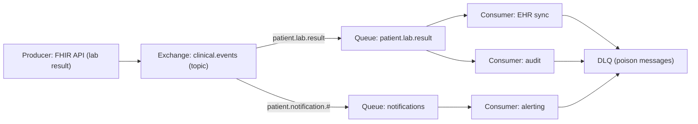

# Chapter 21: RabbitMQ

> **Audience:** Experienced .NET developers (5+ years) preparing for an L2 (Mid/Senior) interview at a Healthcare company.
> **Scope:** Message brokers and when to use them, RabbitMQ fundamentals (exchanges, queues, bindings, routing keys), publish/subscribe and work queues, acknowledgments and redelivery, message durability, `MassTransit`/`RabbitMQ.Client` usage in .NET, competing consumers and ordering, dead-letter queues, and idempotency — the healthcare angle being reliable clinical event delivery (orders, lab results, FHIR notifications) with exactly-once-ish semantics.

---

## 21.1 Why Use a Message Broker

### Interview Answer (30–45 seconds)

> "A message broker decouples producers from consumers. Instead of a service calling another service synchronously, it publishes an event or command to a broker, and consumers subscribe and process at their own pace. This gives you async processing, buffering under load spikes, and independent scaling — a producer can be up while a consumer is down. RabbitMQ is a broker that implements AMQP: producers publish to exchanges, exchanges route messages to queues via bindings and routing keys, and consumers pull from queues. In a healthcare system I'd use it for things like 'lab result received' events, medication-order processing, or audit notifications, so a temporary failure in one service doesn't block the clinical workflow."

### Detailed Explanation

**Message broker vs. direct call:**

| Concern | Synchronous call | Message broker |
|---|---|---|
| Coupling | Tight (must know endpoint) | Loose (via queues) |
| Availability | Both parties must be up | Producer/consumer can be down |
| Load spikes | Backpressure on caller | Queues buffer |
| Scaling | Coupled to request rate | Consumers scale independently |
| Traceability | Implicit | Auditable messages |

**Core AMQP concepts:**

- **Producer** — publishes messages.
- **Exchange** — receives messages and routes them. Types: direct, fanout, topic, headers.
- **Binding** — connects an exchange to a queue with a routing key.
- **Queue** — stores messages until consumed.
- **Consumer** — subscribes to a queue.
- **Routing key** — attribute used by the exchange to decide the destination.

**Exchange types:**

| Type | Routing |
|---|---|
| Direct | Exact routing-key match |
| Fanout | Broadcast to all bound queues |
| Topic | Pattern match on routing key (`patient.*`, `patient.lab.#`) |
| Headers | Match on header values |

**Delivery semantics:**

- **At-most-once** — fire and forget.
- **At-least-once** — ack-based; a crash before ack causes redelivery (duplicates possible).
- **Exactly-once** — not native in RabbitMQ; achieved by idempotent consumers + dedupe.

**.NET libraries:**

- `RabbitMQ.Client` — low-level AMQP client (no serialization, manual ack).
- `MassTransit` / `NServiceBus` — high-level frameworks (retries, sagas, Outbox, serialization built in).

### Real World Example (Healthcare)

When a lab result is posted, a FHIR API publishes an event to a fanout exchange (e.g., `clinical.events`) with a routing key like `patient.lab.result`. Multiple services subscribe: the notification service sends an alert, the audit service records it, and the EHR sync service updates the patient summary. If the notification service is down, the message stays queued and is delivered later — the clinical workflow isn't blocked. Consumers ack only after successful processing so messages aren't lost.

### Production Code Example

```csharp
// Producer — RabbitMQ.Client
await using var connection = await _factory.CreateConnectionAsync();
await using var channel = await connection.CreateChannelAsync();

await channel.ExchangeDeclareAsync("clinical.events", "topic", durable: true);
await channel.QueueDeclareAsync("patient.lab.result", durable: true, exclusive: false, autoDelete: false);

var message = JsonSerializer.SerializeToUtf8Bytes(new LabResultEvent(
    PatientId, EncounterId, ResultId, System: "LOINC", Code: "2339-0"));

var props = new BasicProperties { Persistent = true };

await channel.BasicPublishAsync(
    exchange: "clinical.events",
    routingKey: "patient.lab.result",
    mandatory: false,
    basicProperties: props,
    body: message);

// Consumer with manual acknowledgment
var consumer = new AsyncEventingBasicConsumer(channel);
consumer.ReceivedAsync += async (_, ea) =>
{
    try
    {
        var evt = JsonSerializer.Deserialize<LabResultEvent>(ea.Body.ToArray());
        await _handler.ProcessAsync(evt);          // ack only after success
        await channel.BasicAckAsync(ea.DeliveryTag, multiple: false);
    }
    catch
    {
        await channel.BasicNackAsync(ea.DeliveryTag, false, requeue: true);
    }
};
await channel.BasicConsumeAsync("patient.lab.result", autoAck: false, consumer: consumer);
```

**Key lines explained:**

- Durable exchange + queue + `Persistent=true` messages → survive a broker restart.
- Manual ack (`autoAck: false`) gives at-least-once delivery.
- `BasicNackAsync(requeue: true)` redelivers failed messages (watch for poison messages → DLQ).

### Internal Working

- The client opens a TCP connection and multiplexes channels over it.
- Publishing goes producer → exchange → (bindings/routing keys) → queue(s).
- Consumers use push (basic.consume) or pull (basic.get).
- Unacked messages stay in the queue until acked/nacked or the consumer dies (re-queued).
- Confirms (`publisher confirm` mode) notify producers that the broker received the message.

### Advantages

- Loose coupling and independent scaling of services.
- Buffering absorbs traffic spikes; consumers drain at their own rate.
- At-least-once delivery with ack semantics prevents loss.
- Multiple exchange types cover pub/sub, work queues, and topic routing.
- Durable messages survive broker restarts.
- Rich management UI, metrics, and dead-letter support.

### Disadvantages

- Not natively exactly-once; duplicates require idempotent consumers or dedupe stores.
- Ordering is per-queue, not global; redelivery and retries can reorder.
- Operational overhead: clustering, high-availability, monitoring.
- Messages are transient infra — schema evolution and versioning need discipline.
- Consumers must handle poison messages (dead-lettering, retry policies).
- Distributed systems complexity: eventual consistency, outbox pattern for atomic DB+message writes.

### Best Practices

- Prefer `MassTransit`/`NServiceBus` for business-critical events (retries, sagas, Outbox) over raw `RabbitMQ.Client`.
- Use durable queues + persistent messages for anything that must not be lost.
- Ack only after processing completes; nack-with-requeue carefully, and route repeated failures to a dead-letter queue.
- Make consumers idempotent (process by `MessageId`) to tolerate redelivery.
- Use the Outbox pattern to atomically persist the event with the DB transaction.
- Use topic exchanges with a naming convention for routing keys (`patient.lab.result`).
- Set `PrefetchCount` sensibly (e.g., 1 per consumer for slow jobs) to avoid unfair load.
- Handle poison messages: max-retry → DLQ → alert.

### Common Mistakes

- Using `autoAck: true` and losing messages when processing fails.
- Acknowledging before the side effects (DB write) complete — crash between ack and commit loses work.
- Blocking the consumer with slow synchronous work (use a bounded concurrency model).
- Ignoring idempotency — the same message delivered twice updates a clinical record twice.
- Not setting a prefetch count → one fast consumer hogs all messages.
- Publishing to a non-durable queue and losing everything on restart.
- No dead-letter queue → poison messages loop forever, blocking the queue.

### Interview Follow-up Questions

1. **"At-most-once vs at-least-once vs exactly-once?"** — At-least-once via acks is the RabbitMQ norm; exactly-once needs idempotent consumers/dedupe.
2. **"How do you guarantee ordering?"** — Per-queue ordering; use one queue per ordered key (e.g., per patient) or shard by key; never parallelize with multiple consumers on the same ordering stream.
3. **"What is the Outbox pattern?"** — Persist events in the same DB transaction as the business data; a relay publishes them — atomicity without distributed transactions.
4. **"What is a dead-letter queue?"** — A queue that receives rejected/expired/overflow messages for later inspection or alerting.
5. **"Fanout vs topic exchange?"** — Fanout broadcasts to all bound queues; topic routes by pattern on the routing key.
6. **"How do you deal with a poison message?"** — Retry with backoff up to a limit, then DLQ; alert on DLQ depth.
7. **"What is prefetch/`basic.qos`?"** — How many unacked messages a consumer may have in flight; 1 for slow/idempotent-safe processing.
8. **"Producer confirms vs consumer acks?"** — Confirms are producer-side (broker received it); acks are consumer-side (processing done).
9. **"Would you use RabbitMQ or a direct HTTP call for lab-result delivery?"** — RabbitMQ, because consumers can be down, load spikes, and multiple subscribers without coupling.
10. **"How do you ensure an event isn't lost between DB commit and publish?"** — The Outbox pattern; publish the event in the same transaction as the domain state.

### Senior Level Talking Points

- **Exactly-once semantics** in practice: consumer idempotency + dedupe store keyed by message ID.
- **Outbox pattern** to eliminate the dual-write problem (DB + broker atomicity).
- **Sagas** (MassTransit/NServiceBus) for long-running clinical workflows with compensation.
- **Consumer backpressure:** bounded concurrency, circuit breaking on the DB, queue-depth monitoring.
- **Ordering guarantees** for per-patient event sequences and how to shard.
- **Monitoring:** queue depth, consumer lag, redelivery rates, DLQ alerting — turn these into SLOs.
- **Security:** TLS, broker auth (RBAC in RabbitMQ), and never routing raw PHI through logs.

### Diagram



### Comparison Table

| Aspect | RabbitMQ | Direct HTTP / gRPC | Redis (Chapter 20) |
|---|---|---|---|
| Model | AMQP broker (exchanges/queues) | Sync request-response | Streams / pub-sub |
| Delivery guarantees | Acks, durable, at-least-once | None (caller must retry) | Configurable |
| Ordering | Per-queue | N/A | Per-stream |
| Durability | Strong (disk-backed queues) | N/A | Optional |
| Consumer groups | Yes (competing consumers) | N/A | Streams consumer groups |
| Routing | Exchanges/bindings | N/A | Channels |
| Best fit | Reliable async events/commands | Fast sync calls | Simple caching/queues, low latency |

### Memory Trick

**"Exchange routes, Queue stores, Ack confirms."** Producers publish to an *exchange*; it *routes* via bindings to *queues*; *consumers* process and *ack*. Durable = survive restart; idempotent = survive duplicates.

### Summary

RabbitMQ is the backbone of reliable async communication between .NET services. Know the exchange/binding/queue model, the four exchange types, ack/nack semantics, durability, the Outbox pattern, idempotency, and dead-lettering. For healthcare interviews, emphasize no-lost-messages for clinical events, per-patient ordering, and the Outbox pattern for atomic DB+event writes.

### Interview Confidence Score

**Confidence: High (after this chapter).** Async messaging is central to microservice interviews. If you can design a reliable event pipeline (durable, acked, idempotent, DLQ-protected) and explain the Outbox pattern, you'll cover the most commonly probed area.

---

## Top 10 Interview Questions for This Chapter

1. Why use a message broker instead of synchronous service calls?
2. Explain exchanges, queues, and bindings with the four exchange types.
3. At-most-once, at-least-once, exactly-once — which does RabbitMQ provide and how do you achieve the last?
4. How do acknowledgments work and what happens on consumer failure?
5. What is the Outbox pattern and why is it needed?
6. How do you guarantee message ordering for a patient's event stream?
7. What is a dead-letter queue and how do you configure one?
8. How do you make a consumer idempotent?
9. What is `basic.qos` (prefetch) and when should it be 1?
10. MassTransit vs raw RabbitMQ.Client — when would you use which?

## Revision Notes

- Broker decouples producer/consumer; queues buffer and scale independently.
- AMQP: producer → exchange → (binding + routing key) → queue → consumer.
- Exchanges: direct (exact), fanout (broadcast), topic (pattern), headers.
- At-least-once via manual ack; `autoAck:true` risks loss; duplicates need idempotency.
- Durable = queue + exchange durable, messages `Persistent:true`.
- Outbox pattern: event written in same DB transaction as data; relay publishes — avoids dual-write.
- Poison messages → retry with backoff → DLQ → alert.
- Ordering is per-queue; shard by key (per patient) for ordered streams.
- Prefetch (`basic.qos`) bounds in-flight unacked messages.
- MassTransit/NServiceBus add retries, sagas, Outbox, serialization.

## Things Interviewers Expect from 5+ Years Experience

- You reason about delivery guarantees and failure modes, not just happy paths.
- You can design idempotent consumers and defend the Outbox pattern.
- You know ordering is hard, and you can shard by business key.
- You handle poison messages and monitor queue health (lag, DLQ).
- You choose the right tool: broker for reliable async, HTTP for sync, Redis for low-latency cache.

## Cheat Sheet

```
# Management UI: http://localhost:15672
# Declare durable topic exchange + queue (RabbitMQ.Client)
channel.ExchangeDeclareAsync("clinical.events", "topic", durable: true);
channel.QueueDeclareAsync("patient.lab.result", durable: true, exclusive: false, autoDelete: false);
channel.QueueBindAsync("patient.lab.result", "clinical.events", "patient.lab.result");
# Publish persistent message
channel.BasicPublishAsync("clinical.events", "patient.lab.result", new BasicProperties { Persistent = true }, body);
# Consume with manual ack
channel.BasicConsumeAsync("patient.lab.result", autoAck: false, consumer);
# Ack / nack
channel.BasicAckAsync(ea.DeliveryTag, false);
channel.BasicNackAsync(ea.DeliveryTag, false, requeue: true);
```

## Flash Cards

**Q:** What happens to unacked messages when a consumer crashes? **A:** They're requeued and redelivered — at-least-once behavior.

**Q:** How do you achieve exactly-once in practice? **A:** Idempotent consumer + dedupe store keyed by message ID.

**Q:** Which exchange type for a broadcast? **A:** Fanout.

**Q:** What's the dual-write problem? **A:** DB commit and message publish aren't atomic; the Outbox pattern solves it.

**Q:** What is a poison message? **A:** A message that always fails processing; route to DLQ after retries.

**Q:** How do you preserve per-patient ordering? **A:** One queue per ordering key (patient), single consumer, or shard by key.

---

*Continue → Chapter 22: Kafka*
