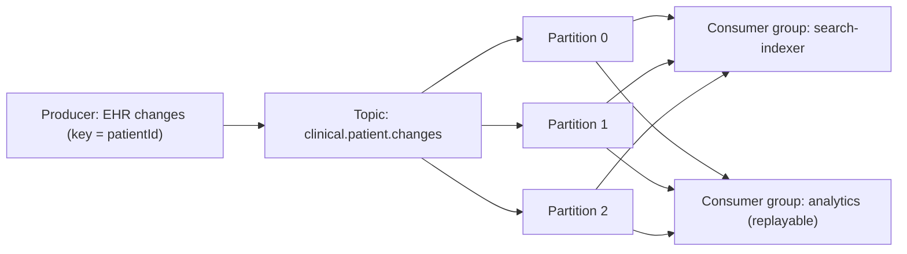

# Chapter 22: Apache Kafka

> **Audience:** Experienced .NET developers (5+ years) preparing for an L2 (Mid/Senior) interview at a Healthcare company.
> **Scope:** Kafka fundamentals (topics, partitions, offsets, brokers, consumer groups), log-based architecture and replay, ordering guarantees per partition, producers/consumers in .NET (Confluent.Kafka), exactly-once semantics, retention and compaction, Kafka vs RabbitMQ, and healthcare use cases (FHIR event streams, audit logs, CDC, analytics pipelines).

---

## 22.1 What Is Kafka and How Is It Different

### Interview Answer (30–45 seconds)

> "Apache Kafka is a distributed event-streaming platform built around an append-only commit log. Unlike a message queue that removes messages after consumption, Kafka retains events on disk with a configurable retention period and tracks consumer progress with offsets — so consumers can replay from any point. Data is organized into topics, and each topic is split into partitions, which are the unit of parallelism and ordering. Kafka shines for high-throughput streams, event sourcing, audit logs, and data pipelines; it's not a task queue like RabbitMQ. For .NET we use Confluent.Kafka; you produce and consume with precise control over offsets, which makes replay and exactly-once processing possible."

### Detailed Explanation

**Core concepts:**

- **Topic** — a named, ordered log of events; a category.
- **Partition** — a shard of a topic; the unit of parallelism and of ordering.
- **Broker** — a server in the cluster storing partitions.
- **Offset** — the position within a partition (a consumer's bookmark).
- **Producer** — writes events to a topic partition.
- **Consumer** — reads events at a chosen offset.
- **Consumer group** — a set of consumers that divide partitions among them (each partition to one consumer).
- **Replication** — partitions are replicated across brokers for fault tolerance (leader/follower).

**How it's a log:**

- Events are appended; nothing is deleted by consumption.
- Retention: time-based or size-based, or compacted (keep latest value per key).
- Replay: rewind the consumer's offset to reprocess history.

**Ordering guarantee:**

- Ordering is guaranteed **within a partition**, not across the topic.
- To preserve order for a key (e.g., a patient), route by key → same partition.

**Delivery semantics (producer → consumer):**

- **At-most-once** — no retries.
- **At-least-once** — retries; possible duplicates.
- **Exactly-once** — via idempotent producers + transactional consumers (KIP-447) or idempotent consumers.

**.NET client:**

- `Confluent.Kafka` is the standard .NET library (wraps `librdkafka`).
- Producer/consumer configs for acks, batching, and offset commit strategies.

### Real World Example (Healthcare)

A hospital's EHR publishes a FHIR `Patient` change stream to a Kafka topic `clinical.patient.changes` with `patientId` as the partition key. Analytics, search indexing, and the audit system all consume independently with their own offsets — each can replay from any point. Because events are retained (e.g., 7 days), a bug in the search indexer can be fixed and re-run from yesterday without losing data. This is also the backbone of a CDC pipeline: DB changes → Kafka → downstream systems.

### Production Code Example

```csharp
// Producer — Confluent.Kafka
var config = new ProducerConfig
{
    BootstrapServers = "kafka:9092",
    Acks = Acks.All,              // wait for all ISR replicas
    EnableIdempotence = true      // exactly-once on the produce side
};

using var producer = new ProducerBuilder<string, string>(config).Build();

await producer.ProduceAsync("clinical.patient.changes", new Message<string, string>
{
    Key = patientId,              // partition by patient → per-patient ordering
    Value = JsonSerializer.Serialize(new PatientChangedEvent(
        PatientId, ChangeType, FHIRBundle, OccurredAt))
});
```

```csharp
// Consumer — manual commit after processing
var config = new ConsumerConfig
{
    BootstrapServers = "kafka:9092",
    GroupId = "search-indexer",
    AutoOffsetReset = AutoOffsetReset.Earliest,
    EnableAutoCommit = false      // we control the offset
};

using var consumer = new ConsumerBuilder<string, string>(config).Build();
consumer.Subscribe("clinical.patient.changes");

while (true)
{
    var result = consumer.Consume(TimeSpan.FromSeconds(5));
    if (result is null) continue;

    try
    {
        var evt = JsonSerializer.Deserialize<PatientChangedEvent>(result.Message.Value);
        await _searchIndexer.UpsertAsync(evt);   // idempotent write
        consumer.Commit(result);                  // offset committed after success
    }
    catch
    {
        // leave the offset uncommitted → redelivery (at-least-once)
        // optionally send to a dead-letter topic after N failures
    }
}
```

**Key lines explained:**

- `Key = patientId` routes all events for one patient to the same partition (ordering).
- `Acks.All` + `EnableIdempotence` → at-least/exactly-once produce semantics.
- `EnableAutoCommit: false` + manual `Commit` → control when progress is saved; commit after processing for at-least-once.

### Internal Working

- Producers batch and send to the partition leader; followers replicate via ISR (in-sync replicas).
- Consumers poll in a loop; the broker hands them records in order per partition.
- A consumer group's rebalance reassigns partitions when members join/leave.
- `log.retention.hours` and `log.retention.bytes` bound the log; compaction keeps latest per key.
- Brokers store segments on disk; consumers read via page cache → very high throughput.

### Advantages

- Massive throughput (millions of events/sec with batching).
- Durable, replayable log — reprocess history anytime.
- Built-in ordering per partition.
- Multiple independent consumer groups (pub/sub with different semantics).
- Fault tolerance via replication and ISR.
- Ecosystem: Kafka Connect (CDC), Kafka Streams, Schema Registry.

### Disadvantages

- Operational complexity (ZooKeeper/KRaft, brokers, monitoring) — the heaviest broker option.
- Ordering only within a partition; cross-partition ordering requires careful key design.
- Not a task/command queue — removing single messages or per-message ack is awkward.
- At-least-once default; exactly-once end-to-end requires careful config and idempotent consumers.
- High memory/disk footprint; tuning is an art.
- Schema management (Schema Registry) needed to evolve event formats safely.

### Best Practices

- Choose the partition key to match ordering needs (patientId) — and size partition count for throughput and retention.
- Use a Schema Registry (Avro/Protobuf/JSON) for event versioning and contract enforcement.
- Enable idempotent producers; set `acks=all` for durable writes.
- Consumer: commit offsets after processing; make writes idempotent; use `EnableAutoCommit: false` for control.
- Handle rebalances: don't block in `Consume`; avoid expensive state in-memory per partition.
- Dead-letter to a separate topic after bounded retries.
- Monitor: consumer lag, under-replicated partitions, ISR shrank.

### Common Mistakes

- Assuming global ordering — Kafka orders within a partition only.
- Committing offsets before processing completes → events lost on crash.
- No retry/DLQ strategy → a poison event stalls a consumer group.
- Using one partition → no parallelism; too many partitions → rebalance overhead.
- Ignoring retention → unbounded disk usage, or data gone before replay is needed.
- Not handling rebalances (in-progress work lost, duplicate reprocessing).
- Serializing .NET types directly without a schema contract — versioning breaks consumers.

### Interview Follow-up Questions

1. **"What is a consumer group and how does it work?"** — Consumers in a group split partitions; each partition is consumed by exactly one member; rebalances reassign on membership change.
2. **"How does Kafka achieve ordering?"** — Per partition; key-based routing puts related events in the same partition.
3. **"Can Kafka lose data?"** — Yes if `acks=0/1` and the leader fails before replication; `acks=all` + `min.insync.replicas` mitigates.
4. **"What is an offset?"** — The consumer's position in a partition; committing saves progress for recovery.
5. **"How do you achieve exactly-once end-to-end?"** — Idempotent producer + transactional producer/consumer or idempotent consumer writing to a dedupe store.
6. **"What is log compaction?"** — Retention that keeps the latest value per key instead of all versions — ideal for state snapshots.
7. **"How would you build a CDC pipeline?"** — Kafka Connect Debezium tails the DB binlog/transaction log → Kafka → downstream.
8. **"What happens during a rebalance?"** — Partition ownership is redistributed; consumers may reprocess the tail of a partition (handle idempotently).
9. **"Kafka vs RabbitMQ — when do you pick which?"** — Kafka: high-throughput event streams, replay, audit logs, CDC. RabbitMQ: reliable task/command queues, complex routing, DLQ-centric.
10. **"How do you monitor consumer health?"** — Consumer lag (offsets vs latest), committed-offset speed, error rates, rebalance frequency.

### Senior Level Talking Points

- **Event sourcing / CQRS** on a Kafka log: the log is the source of truth; projections are consumer groups.
- **Exactly-once semantics** end-to-end and its real-world cost — know when at-least-once + idempotency suffices.
- **Backpressure and lag:** consumers slower than producers; scale consumers, partition count, or batch sizes.
- **Schema governance** with Schema Registry: backward/forward compatible event evolution for regulated healthcare data.
- **Security:** TLS, SASL/SCRAM auth, ACLs on topics — especially where PHI/FHIR bundles flow.
- **Reconciliation:** periodic full-refresh jobs that replay history to repair drift — a core pattern for clinical search/indexing.

### Diagram



### Comparison Table

| Aspect | Kafka | RabbitMQ |
|---|---|---|
| Model | Distributed commit log | AMQP broker (queues/exchanges) |
| Consumption | Offset-based, replayable | Destructive pull (ack removes) |
| Ordering | Per partition | Per queue |
| Throughput | Very high | Moderate |
| Routing | By partition key | Rich (topic/fanout/headers) |
| Retention | Time/size/compaction | Consumed = gone (or TTL) |
| Semantics | Configurable to exactly-once | At-least-once typical |
| Best fit | Event streams, audit logs, CDC, analytics | Task/command queues, workflows |

### Memory Trick

**"Topic → partitions → offsets; key chooses the partition; group shares the topic."** Ordering lives inside a partition. Replay by rewinding the offset. Log, not queue.

### Summary

Kafka is the high-throughput, replayable event log that powers event-driven and streaming architectures. Master topics/partitions/offsets, key-based ordering, consumer groups and rebalances, delivery semantics, and retention/compaction. For healthcare interviews, connect it to FHIR event streams, audit logging, CDC pipelines, and replay-based data repair.

### Interview Confidence Score

**Confidence: High (after this chapter).** Kafka is a differentiator for senior/platform roles. Knowing the log model, partition-level ordering, exactly-once nuances, and when Kafka beats RabbitMQ (and vice versa) signals strong distributed-systems depth.

---

## Top 10 Interview Questions for This Chapter

1. What is Kafka and how is it different from a traditional message queue?
2. Explain topics, partitions, offsets, and consumer groups.
3. How does Kafka guarantee ordering, and what are its limits?
4. What delivery semantics does Kafka support and how do you get exactly-once?
5. What happens during a consumer-group rebalance?
6. What is log compaction and when would you use it?
7. How do you pick a partition key?
8. Kafka vs RabbitMQ — how do you choose?
9. How would you build a CDC pipeline from a database to Kafka?
10. How do you monitor and debug consumer lag?

## Revision Notes

- Kafka = distributed append-only commit log; events retained and replayable.
- Topic → partitions (parallelism + ordering unit) → offsets (consumer position).
- Key-based routing → same partition → ordering per key (patient).
- Consumer groups split partitions; rebalances redistribute on membership change.
- Delivery: at-most-once / at-least-once / exactly-once (idempotent producer + transactions or idempotent consumer).
- `acks=all` + `min.insync.replicas` for durable writes; `EnableIdempotence=true`.
- Retention: time/size-based or compaction (latest value per key).
- Confluent.Kafka = standard .NET client; commit offsets after processing.
- Kafka: event streams, audit logs, CDC, replay. RabbitMQ: task queues, complex routing.
- Healthcare: FHIR change streams, audit trails, search-index rebuilding via replay.

## Things Interviewers Expect from 5+ Years Experience

- You understand the log model and its implications (replay, retention, compaction).
- You can reason about ordering, partitions, and key selection under real loads.
- You know exactly-once is hard and can articulate the practical (idempotency) alternative.
- You design consumers that survive rebalances and poison events (DLQ topics).
- You can choose Kafka vs RabbitMQ with defensible reasoning.

## Cheat Sheet

```
# Producer (Confluent.Kafka)
ProducerConfig: BootstrapServers, Acks=All, EnableIdempotence=true
producer.ProduceAsync(topic, new Message<K,V>{ Key=patientId, Value=json })

# Consumer
ConsumerConfig: BootstrapServers, GroupId, AutoOffsetReset=Earliest, EnableAutoCommit=false
consumer.Subscribe(topic)
consumer.Consume(5s) → process → consumer.Commit(result)

# CLI
kafka-topics --create --topic t --partitions 6 --replication-factor 3
kafka-console-producer / kafka-console-consumer --group g --from-beginning
kafka-consumer-groups --describe --group g    # consumer lag
```

## Flash Cards

**Q:** Where does Kafka guarantee ordering? **A:** Within a partition only, not across the topic.

**Q:** How do you get per-patient ordering? **A:** Use patientId as the message key → same partition.

**Q:** What is a rebalance? **A:** Partition reassignment when a group member joins/leaves; may cause reprocessing.

**Q:** Why replay? **A:** Rewind offsets to rebuild a search index or fix a bug from retained history.

**Q:** What is compaction? **A:** Keep the latest value per key — a log that acts like a state store.

**Q:** When Kafka over RabbitMQ? **A:** High throughput, replay, audit streams, CDC — not for simple task queues.

---

*Continue → Chapter 23: SignalR*
