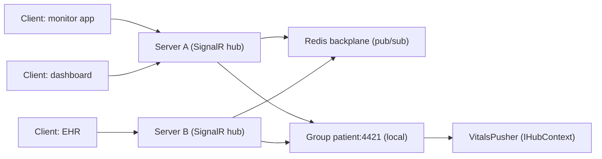

# Chapter 23: SignalR

> **Audience:** Experienced .NET developers (5+ years) preparing for an L2 (Mid/Senior) interview at a Healthcare company.
> **Scope:** Real-time communication, SignalR fundamentals (hubs, clients, groups, connections), transports (WebSocket, Server-Sent Events, Long Polling) and negotiation, scaling out with a backplane (Redis), authentication and authorization, reconnection handling, and healthcare use cases (live patient vitals, notification pushes, collaborative dashboards).

---

## 23.1 What Is SignalR and When to Use It

### Interview Answer (30–45 seconds)

> "SignalR is ASP.NET Core's library for adding real-time functionality to web applications. The server pushes content to connected clients instantly instead of clients polling. The central abstraction is the Hub — a high-level RPC endpoint where the client and server call each other's methods. SignalR handles connection management, grouping, and transport negotiation: it starts with WebSockets and transparently falls back to Server-Sent Events or Long Polling. For healthcare, SignalR is perfect for live vitals monitoring, lab-result notifications, or a shared clinical dashboard where new data must appear the moment it changes."

### Detailed Explanation

**Core concepts:**

- **Hub** — the endpoint class; server methods callable by clients and vice versa.
- **Connection** — a logical link between a client and the server.
- **Client** — a connected caller (`Clients.Client(id)`, `Clients.All`, `Clients.Group(name)`).
- **Group** — a named set of connections (e.g., "department:cardiology").
- **Message** — the serialized payload exchanged (JSON or MessagePack).
- **Transport** — the underlying channel: WebSocket (default), Server-Sent Events (SSE), Long Polling.

**Transport negotiation:**

- Client requests `/negotiate` → server returns supported transports + connection ID.
- WebSocket preferred; falls back automatically when unavailable (proxies, older browsers).

**Scalability — the backplane problem:**

- A single server can only push to the clients connected to *that* server.
- Multiple instances need a **backplane** to broadcast across servers:
  - **Redis backplane** — pub/sub: every server publishes and subscribes, forwarding messages to its local connections.
  - **Azure SignalR Service** — managed, offloads connections.

**Authentication/Authorization:**

- `[Authorize]` on hubs/methods; the authenticated identity is available in the hub context.
- JWT (Chapter 12) works with the WebSocket handshake via `access_token` query parameter.

**.NET client:** `Microsoft.AspNetCore.SignalR.Client` (`HubConnectionBuilder`).

### Real World Example (Healthcare)

A vitals-monitoring app: bedside monitors publish data to a service; the service pushes updates to the correct clients via a SignalR hub. Clients join a group per patient (`group("patient:4421")`), so only the doctor/nurse watching that patient receives the stream. When the service scales to multiple instances, a Redis backplane ensures a push on instance A reaches a client connected to instance B. Reconnection logic replays missed messages on resume.

### Production Code Example

```csharp
// Hub
[Authorize]
public class VitalsHub : Hub
{
    private readonly IHubContext<VitalsHub> _hubContext; // for pushing from services

    public override async Task OnConnectedAsync()
    {
        var patientId = Context.GetHttpContext()?.Request.Query["patientId"];
        if (!string.IsNullOrEmpty(patientId))
            await Groups.AddToGroupAsync(Context.ConnectionId, $"patient:{patientId}");
        await base.OnConnectedAsync();
    }

    public Task SendVitals(VitalsReading reading)
        => Clients.Group($"patient:{reading.PatientId}")
                  .SendAsync("VitalsUpdated", reading);
}
```

```csharp
// Pushing from a background service (outside the hub)
public class VitalsPusher
{
    public async Task PushAsync(VitalsReading reading)
        => await _hubContext.Clients
                .Group($"patient:{reading.PatientId}")
                .SendAsync("VitalsUpdated", reading);
}
```

```csharp
// Program.cs — add hub, CORS for the web client, Redis backplane
builder.Services.AddSignalR()
    .AddStackExchangeRedis(options =>
        options.Configuration = builder.Configuration.GetConnectionString("Redis"));

app.MapHub<VitalsHub>("/hubs/vitals");

// Client
var connection = new HubConnectionBuilder()
    .WithUrl("https://api.example.com/hubs/vitals?patientId=4421")
    .WithAutomaticReconnect(new[] { TimeSpan.Zero, TimeSpan.FromSeconds(2), TimeSpan.FromSeconds(10), TimeSpan.FromSeconds(30) })
    .AddJsonProtocol()
    .Build();

connection.On<VitalsReading>("VitalsUpdated", reading => UpdateChart(reading));
await connection.StartAsync();
```

**Key lines explained:**

- Groups scope pushes to the right patient's viewers.
- `IHubContext<T>` lets any service (not just a hub method) push to clients.
- `AddStackExchangeRedis` is the backplane for multi-instance scale-out.
- `WithAutomaticReconnect` resumes connections with backoff.

### Internal Working

- Negotiation: client hits `/negotiate`, gets a connection ID and transport list.
- WebSocket upgrade happens for real-time duplex; SSE for server→client only; Long Polling as last resort.
- Each message is serialized (JSON/MessagePack) and routed to target connection(s).
- Groups map connection IDs to group names in memory per server; the backplane broadcasts group membership across servers.
- With a Redis backplane, the server publishes the message to Redis pub/sub; every other server's subscriber forwards it to its local group members.

### Advantages

- True server-push → instant UI updates (no polling).
- Automatic transport fallback → works through most proxies/firewalls.
- Groups make scoping to users/departments trivial.
- Scales with a Redis backplane or Azure SignalR Service.
- Rich client libraries (.NET, JS, TS, Blazor).
- Built-in reconnection with automatic reconnect in .NET client.

### Disadvantages

- WebSockets/SSE not supported everywhere (some proxies strip upgrades).
- In-memory groups don't scale without a backplane.
- No guaranteed delivery or durable replay — messages sent while a client is offline are lost (need a store/queue for critical data).
- Long-lived connections complicate load balancing (sticky vs backplane).
- Security surface: hijacking connection IDs or groups requires careful authz.
- Complex to debug distributed real-time systems.

### Best Practices

- Use a backplane (Redis/Azure) as soon as you run more than one instance.
- Scope with groups, not broadcasts; add to groups only after authorization.
- Protect `connectionId` and group membership; use `[Authorize]` on hubs.
- Design for at-least-once UI state: combine pushes with a REST re-sync on reconnect.
- Use MessagePack protocol for high-throughput streams (vitals).
- Set `KeepAliveInterval` and `ClientTimeoutInterval`; handle server `close` codes.
- Use `WithAutomaticReconnect` and resync missed data after reconnect.
- Don't send PHI to `Clients.All` — always scope to groups and enforce authorization.

### Common Mistakes

- No backplane on multi-instance deploys → pushes reach only one instance's clients.
- Broadcasting to `Clients.All` for patient data → PHI leakage.
- Relying on SignalR for durable messaging (e.g., lab results) — it's real-time, not a queue.
- Not resyncing state on reconnect → stale dashboards.
- Missing `[Authorize]` on the hub → unauthenticated connections can join groups.
- Long-running blocking work inside hub methods (use `IHostedService` + `IHubContext`).
- Ignoring proxy/tunnel WebSocket limits → silent fallback to polling with added latency.

### Interview Follow-up Questions

1. **"How does transport negotiation work?"** — `/negotiate` returns a connection ID and transports; client picks the best available (WebSocket → SSE → Long Polling).
2. **"How do you scale SignalR beyond one server?"** — Redis backplane (pub/sub) or Azure SignalR Service; group membership broadcast across servers.
3. **"What happens to messages when a client is disconnected?"** — They're lost (real-time, no replay); resync via REST on reconnect.
4. **"Groups vs connections?"** — Groups are named sets of connections for scoped broadcasts; connections are individual links.
5. **"How do you authenticate a WebSocket connection?"** — JWT via the `access_token` query param during the handshake; authorize in `OnConnectedAsync`.
6. **"Can I push from a background service?"** — Yes, inject `IHubContext<T>` and call `Clients...`.
7. **"What's the difference between WebSocket and SSE?"** — WebSocket is full duplex; SSE is server→client only (EventSource). SignalR abstracts both.
8. **"How do you secure groups in a healthcare app?"** — Join groups only for authorized roles/relationships; re-check authz in hub methods.
9. **"What protocol options exist?"** — JSON (default, debuggable) and MessagePack (binary, faster).
10. **"When would you NOT use SignalR?"** — For durable/ordered delivery (use a broker, Chapters 21–22), or when clients don't need live push (plain REST).

### Senior Level Talking Points

- **Reliability:** SignalR is real-time, not durable — pair pushes with a persistent event stream (Kafka/RabbitMQ) for guaranteed clinical notifications and replay.
- **Scaling:** Redis backplane vs Azure SignalR Service — trade-offs of self-hosted control vs managed scale.
- **Backpressure:** high-frequency vitals → throttle or batch before pushing; use MessagePack; consider sampling.
- **Security:** per-connection authorization, PHI-scoped groups, token revocation, and audit logging of group joins.
- **Observability:** track connections, groups, message throughput, reconnect rates.
- **Client resilience:** automatic reconnect + idempotent resync so dropped messages don't corrupt UI state.

### Diagram



### Comparison Table

| Aspect | SignalR | Polling (HTTP) | WebSocket (raw) | Broker (RabbitMQ/Kafka) |
|---|---|---|---|---|
| Direction | Bidirectional push | Request/response | Bidirectional | Async, durable |
| Delivery guarantee | Best effort | Per request | Best effort | At-least-once/Exactly-once |
| Replay/durability | No | N/A | No | Yes (Kafka) |
| Transport fallback | Yes (WS→SSE→LP) | N/A | No | N/A |
| Scaling | Backplane needed | Stateless | Hard | Built-in |
| Best fit | Live UI updates | CRUD APIs | Custom protocols | Reliable events/pipelines |

### Memory Trick

**"Hub, Client, Group, Backplane."** The hub is the endpoint; clients connect; groups scope; the backplane makes many servers feel like one. Real-time means fast, not durable — resync on reconnect.

### Summary

SignalR brings instant server-push to ASP.NET Core apps. Know hubs, groups, transports and negotiation, the Redis backplane for scale-out, authentication, and reconnection. For healthcare interviews, emphasize PHI-safe group scoping, resync-after-reconnect, and the boundary between real-time (SignalR) and durable (broker) messaging.

### Interview Confidence Score

**Confidence: High (after this chapter).** SignalR is a common L2 question when real-time features are in scope. Understanding scaling, authz, and its limits (no durability) relative to brokers shows senior judgment.

---

## Top 10 Interview Questions for This Chapter

1. What is SignalR and how does it differ from REST polling?
2. Explain hubs, clients, connections, and groups.
3. How does transport negotiation work (WebSocket/SSE/Long Polling)?
4. How do you scale SignalR across multiple servers?
5. How do you push messages from a background service?
6. How do you authenticate and authorize SignalR connections?
7. What happens when a client disconnects mid-stream?
8. How do you scope pushes to a specific patient's viewers without PHI leaks?
9. JSON vs MessagePack protocol — when would you use each?
10. When would you avoid SignalR in favor of a message broker?

## Revision Notes

- SignalR = real-time push over ASP.NET Core; hub = RPC endpoint.
- Transports: WebSocket (preferred) → SSE → Long Polling via `/negotiate`.
- Clients: `All`, `Client(id)`, `Group(name)`; groups scope broadcasts.
- Multi-instance scaling requires a backplane: Redis (`AddStackExchangeRedis`) or Azure SignalR Service.
- Push from anywhere via `IHubContext<T>`.
- Authz: `[Authorize]` on hubs; JWT via `access_token` in handshake; check membership in `OnConnectedAsync`.
- No durable delivery — resync state on reconnect (`WithAutomaticReconnect`).
- MessagePack for high-throughput; JSON for debuggability.
- Security: never `Clients.All` for PHI; group by patient/department after authz.

## Things Interviewers Expect from 5+ Years Experience

- You know real-time is best-effort and plan resync/replay.
- You can design multi-instance scaling with a backplane.
- You secure group membership and PHI scope by authorization, not convention.
- You decouple heavy work from hub methods (background services + `IHubContext`).
- You choose SignalR vs brokers based on delivery semantics.

## Cheat Sheet

```csharp
// Server
builder.Services.AddSignalR().AddStackExchangeRedis(o => o.Configuration = "redis");
app.MapHub<VitalsHub>("/hubs/vitals");

public class VitalsHub : Hub
{
    public override async Task OnConnectedAsync() { /* join group after authz */ }
    public Task SendVitals(VitalsReading r) =>
        Clients.Group($"patient:{r.PatientId}").SendAsync("VitalsUpdated", r);
}

// Push from service
_hubContext.Clients.Group($"patient:{id}").SendAsync("VitalsUpdated", reading);

// Client
var c = new HubConnectionBuilder()
    .WithUrl(url, o => o.AccessTokenProvider = () => Task.FromResult(token))
    .WithAutomaticReconnect()
    .AddMessagePackProtocol()
    .Build();
c.On<VitalsReading>("VitalsUpdated", r => Update(r));
await c.StartAsync();
```

## Flash Cards

**Q:** How does a client reach a specific user? **A:** Add its connection ID to a group; push to `Clients.Group(name)`.

**Q:** What is the Redis backplane for? **A:** Broadcasting messages across multiple server instances via pub/sub.

**Q:** Why resync after reconnect? **A:** SignalR delivers no messages while disconnected; REST re-sync restores state.

**Q:** How do you secure a hub? **A:** `[Authorize]` + JWT handshake token + authz before joining groups.

**Q:** Best protocol for high-frequency vitals? **A:** MessagePack (binary), with throttling/batching.

**Q:** Can SignalR deliver lab results reliably? **A:** No — use a durable broker (Chapters 21–22); SignalR is for live UI.

---

*Continue → Chapter 24: gRPC*
