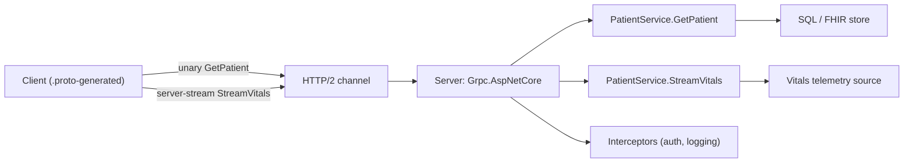

# Chapter 24: gRPC

> **Audience:** Experienced .NET developers (5+ years) preparing for an L2 (Mid/Senior) interview at a Healthcare company.
> **Scope:** gRPC fundamentals (protobuf, HTTP/2, RPC types), .NET gRPC server/client (`Grpc.AspNetCore`, `Grpc.Net.Client`), unary, server-streaming, client-streaming, and bidirectional streaming, integration with ASP.NET Core (auth, interceptors, deadlines), gRPC vs REST, and healthcare use cases (service-to-service FHIR-adjacent contracts, streaming telemetry, low-latency internal APIs).

---

## 24.1 What Is gRPC and Why Use It

### Interview Answer (30–45 seconds)

> "gRPC is a high-performance RPC framework by Google that uses Protocol Buffers as the interface definition and serialization, and HTTP/2 as the transport. You define the contract in a `.proto` file — messages and services — and the tooling generates strongly-typed clients and servers in many languages. It supports four call types: unary, server-streaming, client-streaming, and bidirectional streaming. Compared to REST, gRPC is faster (compact binary payloads, multiplexed HTTP/2), has first-class streaming, and enforces a strict contract via code generation. In a .NET healthcare system I'd use gRPC for internal service-to-service calls and streaming telemetry, while keeping public browser-facing APIs on REST/JSON."

### Detailed Explanation

**Core concepts:**

- **Protocol Buffers (protobuf)** — binary serialization with a schema; `.proto` defines messages and services.
- **HTTP/2** — multiplexed, binary transport; header compression; long-lived connections.
- **Service definition** — `service PatientService { rpc GetPatient(...) returns (...); }`.
- **Stub/generated code** — the compiler (`protoc` / `Grpc.Tools`) generates server base classes and client proxies.
- **Channel** — the client connection abstraction (`GrpcChannel`); long-lived and pooled.
- **Interceptors** — middleware for cross-cutting concerns (logging, auth, retries) on both sides.

**Four RPC types:**

| Type | Direction | Example |
|---|---|---|
| Unary | Request → Response | Fetch a patient by ID |
| Server-streaming | Request → many responses | Stream a vitals series |
| Client-streaming | Many requests → Response | Upload a batch of readings |
| Bidi-streaming | Both directions concurrently | Live telemetry chat |

**gRPC vs REST (decision):**

- gRPC wins for internal services, streaming, low latency, and contract safety.
- REST wins for browsers, public APIs, and when JSON/human-readable is needed.
- gRPC-Web exists to bridge browsers, with limitations.

**.NET support:**

- Server: `Grpc.AspNetCore` (hosted in ASP.NET Core Kestrel).
- Client: `Grpc.Net.Client` with `HttpClient`-based channels.
- Generated code via `Grpc.Tools` + `.proto` files.

### Real World Example (Healthcare)

A lab-results platform uses gRPC between internal microservices: the orders service calls the results service via a unary RPC (`GetResult`), and a monitoring service streams continuous vitals from devices via server-streaming. Contracts are defined once in `.proto` and shared across .NET services — versioning and correctness are enforced at compile time, and binary protobuf keeps PHI payloads small and fast over HTTP/2.

### Production Code Example

```proto
syntax = "proto3";
package clinical.v1;

option csharp_namespace = "Clinical.Contracts.V1";

message PatientId { string id = 1; }

message Patient {
  string id = 1;
  string name = 2;
  string mrn = 3;
  string loinc_snapshot = 4;   // example clinical payload
}

message VitalsRequest { string patient_id = 1; }
message VitalsReading { int64 timestamp = 1; double heart_rate = 2; double spO2 = 3; }

service PatientService {
  rpc GetPatient (PatientId) returns (Patient);
  rpc StreamVitals (VitalsRequest) returns (stream VitalsReading);
}
```

```csharp
// Server (generated base class)
public sealed class PatientService : PatientServiceBase
{
    public override Task<Patient> GetPatient(PatientId request, ServerCallContext context)
    {
        var patient = _repo.Find(request.Id);
        return Task.FromResult(patient ?? new Patient { Id = request.Id });
    }

    public override async Task StreamVitals(VitalsRequest request,
        IServerStreamWriter<VitalsReading> responseStream, ServerCallContext context)
    {
        await foreach (var reading in _vitalsSource.GetAsync(request.PatientId, context.CancellationToken))
        {
            await responseStream.WriteAsync(reading);
        }
    }
}
```

```csharp
// Program.cs — server
builder.Services.AddGrpc(options =>
{
    options.EnableDetailedErrors = true;
    options.Interceptors.Add<AuthInterceptor>();
});
app.MapGrpcService<PatientService>();
```

```csharp
// Client
using var channel = GrpcChannel.ForAddress("https://clinical-internal:5001",
    new GrpcChannelOptions { Credentials = ChannelCredentials.Ssl });
var client = new PatientService.PatientServiceClient(channel);

var patient = await client.GetPatientAsync(new PatientId { Id = "P-4421" });

await foreach (var reading in client.StreamVitals(new VitalsRequest { PatientId = "P-4421" })
                                    .ResponseStream.ReadAllAsync(ct))
{
    _chart.Add(reading);
}
```

**Key lines explained:**

- `.proto` is the single contract → generated strongly-typed code on both sides.
- Server-streaming pushes a sequence of readings until completion or cancellation.
- Interceptors apply authn/authz and logging across all RPCs.
- One `GrpcChannel` is long-lived and pooled; reuse it like a connection.

### Internal Working

- Client builds a request, serializes with protobuf, sends over HTTP/2 (multiplexed on a channel).
- Server deserializes, dispatches to the service method, streams/returns, serializes the reply.
- Deadlines propagate (`deadline`) to enforce time limits; `ServerCallContext` carries cancellation.
- HTTP/2 lets many concurrent RPCs share one connection — lower overhead than REST's one-connection-per-request model.
- Error handling via gRPC status codes (`Grpc.Core.StatusCode`), not HTTP codes.

### Advantages

- High performance: compact binary, HTTP/2 multiplexing, fewer round trips.
- Strong typed contracts generated from `.proto` — compile-time safety.
- Native streaming for all four RPC patterns.
- Polyglot: one `.proto` serves .NET, Go, Java, Python clients.
- Deadline + cancellation propagation built in.
- Interceptors give clean cross-cutting concerns.

### Disadvantages

- Browser clients need gRPC-Web (limited); not a replacement for public REST/JSON APIs.
- Not human-readable on the wire (harder to debug; use tools like `grpcurl`).
- HTTP/2 over TLS required for full features (h2c for plaintext only in internal/Dev).
- Tooling and versioning discipline needed; breaking `.proto` changes ripple to all consumers.
- Overhead for simple CRUD when REST/JSON would suffice.
- Load balancers/proxies must support HTTP/2 (not all do).

### Best Practices

- Use gRPC for **internal** service-to-service calls and streaming; keep public/browser APIs on REST.
- Design `.proto` for compatibility: never renumber/reuse field numbers; add fields, don't remove.
- Version services/messages (e.g., `clinical.v1`) rather than breaking changes.
- Set deadlines/timeouts on client calls; honor cancellation on the server.
- Use interceptors for auth, logging, retries, and deadlines.
- Enable TLS; use mTLS for sensitive internal traffic (PHI-adjacent).
- Reuse a single `GrpcChannel`; configure `MaxConcurrentStreams`/`InitialConnectionWindowSize` for throughput.
- Stream backpressure: respect `context.CancellationToken`; don't buffer unbounded streams.

### Common Mistakes

- Using gRPC for browser-facing APIs without gRPC-Web and hitting limitations.
- Breaking `.proto` contracts (renumbering fields) that silently corrupt data.
- No deadlines → hung calls hold resources forever.
- Creating a new `GrpcChannel` per call → socket/connection churn.
- Ignoring cancellation → streams keep running after the client disconnects.
- Treating gRPC status codes as HTTP status codes (mapping errors incorrectly).
- Exposing PHI over h2c/plaintext or without auth on the internal channel.

### Interview Follow-up Questions

1. **"gRPC vs REST — when would you pick each?"** — gRPC for internal, typed, streaming, low-latency; REST for public, browser, JSON-based APIs.
2. **"How do the four RPC types work?"** — Unary, server-streaming, client-streaming, bidi; map each to a real scenario.
3. **"Why is HTTP/2 important for gRPC?"** — Multiplexing, binary framing, header compression → many concurrent RPCs on one connection.
4. **"How do you handle gRPC errors?"** — gRPC status codes + trailers; map to client errors; interceptors can centralize.
5. **"How do you version a gRPC contract?"** — Package/version in `.proto`, additive field changes only; server supports multiple versions.
6. **"What is an interceptor?"** — Middleware for client/server handling auth, logging, deadlines, retries.
7. **"How does gRPC handle timeouts?"** — Client sets a deadline; propagated in the request; server honors via `ServerCallContext`.
8. **"What is gRPC-Web?"** — A bridge that lets browsers talk to gRPC servers (with streaming/duplex limitations).
9. **"How do you secure gRPC in a healthcare mesh?"** — TLS/mTLS, JWT or OAuth on the channel, interceptor authz, ACLs.
10. **"Streaming vs REST pagination for vitals?"** — Server-streaming is natural for continuous data; REST pagination for on-demand lists.

### Senior Level Talking Points

- **Contract governance:** `.proto` is the API contract — versioning, code generation in CI, breaking-change detection.
- **mTLS and service identity** for PHI-bearing internal traffic in Kubernetes (service mesh).
- **Resilience:** deadlines, retries with jitter, circuit breaking via interceptors.
- **Performance tuning:** HTTP/2 window sizes, message size limits, compression (gzip) for large FHIR bundles.
- **gRPC + event streaming:** combine gRPC streaming for live data with Kafka (Ch. 22) for durable history.
- **Observability:** trace correlation IDs through RPC metadata; metrics per method/status.

### Diagram



### Comparison Table

| Aspect | gRPC | REST/JSON | SignalR |
|---|---|---|---|
| Transport | HTTP/2 | HTTP/1.1 | WebSocket/SSE |
| Serialization | Protobuf (binary) | JSON | JSON/MessagePack |
| Contract | `.proto` (generated) | OpenAPI (loose) | Hub methods (loose) |
| Streaming | Native (4 types) | Chunked / SSE | Bidirectional |
| Browser support | gRPC-Web (limited) | Native | Native |
| Best fit | Internal typed APIs | Public APIs | Live UI push |

### Memory Trick

**"proto → generate → channel → call; unary, server, client, bidi."** One contract, both sides typed. HTTP/2 multiplexes; deadlines bound; interceptors cross-cut.

### Summary

gRPC is the high-performance, contract-driven framework for internal service-to-service communication. Know protobuf contracts, the four RPC types, HTTP/2 benefits, deadlines/cancellation, interceptors, and versioning. For healthcare interviews, position gRPC as the internal API layer (typed, fast, stream-friendly) with REST kept for the browser/public edge, and emphasize mTLS and deadline discipline for PHI traffic.

### Interview Confidence Score

**Confidence: High (after this chapter).** gRPC signals modern architecture depth. Understanding contract governance, streaming patterns, and when NOT to use it (browsers, public APIs) separates senior from junior answers.

---

## Top 10 Interview Questions for This Chapter

1. What is gRPC and what problems does it solve?
2. gRPC vs REST — how do you decide between them?
3. Explain the four gRPC call types with real examples.
4. Why does gRPC use HTTP/2?
5. How do deadlines and cancellation work in gRPC?
6. What are interceptors and what do you use them for?
7. How do you version `.proto` contracts safely?
8. How do you handle errors in gRPC?
9. What is gRPC-Web and what are its limits?
10. How do you secure gRPC calls between healthcare microservices?

## Revision Notes

- gRPC = protobuf contract + HTTP/2 transport; generated typed code.
- Four RPC types: unary, server-streaming, client-streaming, bidi-streaming.
- Server: `Grpc.AspNetCore`; client: `Grpc.Net.Client` with one pooled `GrpcChannel`.
- Interceptors = middleware for auth/logging/retries/deadlines.
- Deadlines propagate; cancellation via `ServerCallContext`.
- Errors via gRPC status codes (not HTTP).
- Versioning: package/version + additive field changes; never renumber fields.
- Browser needs gRPC-Web (streaming limited) → public APIs stay REST.
- Secure with TLS/mTLS + JWT/OAuth; internal PHI traffic in a service mesh.
- Performance: HTTP/2 multiplexing, compression, tuned windows/message limits.

## Things Interviewers Expect from 5+ Years Experience

- You treat `.proto` as a governed contract (versioning, CI code-gen, breaking-change checks).
- You reason about when gRPC vs REST — public edge vs internal typed APIs.
- You apply deadlines, retries, and interceptors as standard practice.
- You understand streaming backpressure and cancellation.
- You secure internal PHI traffic with mTLS and authorization.

## Cheat Sheet

```proto
syntax = "proto3";
package clinical.v1;
option csharp_namespace = "Clinical.Contracts.V1";
service PatientService {
  rpc GetPatient (PatientId) returns (Patient);
  rpc StreamVitals (VitalsRequest) returns (stream VitalsReading);
}
```

```csharp
// Server
builder.Services.AddGrpc(o => o.Interceptors.Add<AuthInterceptor>());
app.MapGrpcService<PatientService>();
public sealed class PatientService : PatientServiceBase
{
    public override Task<Patient> GetPatient(PatientId r, ServerCallContext ctx) { /* ... */ }
}

// Client
using var channel = GrpcChannel.ForAddress("https://internal:5001", new GrpcChannelOptions
{ Credentials = ChannelCredentials.Ssl });
var client = new PatientServiceClient(channel);
var p = await client.GetPatientAsync(new PatientId { Id = "P-1" });
await foreach (var r in client.StreamVitals(new VitalsRequest { PatientId = "P-1" })
                              .ResponseStream.ReadAllAsync(ct)) { /* ... */ }
```

## Flash Cards

**Q:** Which transport does gRPC use? **A:** HTTP/2 — multiplexed, binary, header-compressed.

**Q:** How do you define a gRPC contract? **A:** `.proto` file → code generation on both sides.

**Q:** What are the four RPC types? **A:** Unary, server-streaming, client-streaming, bidi-streaming.

**Q:** How do you bound a slow gRPC call? **A:** Set a client deadline; it propagates to the server.

**Q:** What's the catch with browsers? **A:** They need gRPC-Web with streaming limits — keep public APIs REST.

**Q:** How do you evolve a `.proto`? **A:** Additive field changes; never renumber or repurpose field numbers.

---

*Continue → Chapter 25: Background Services*
