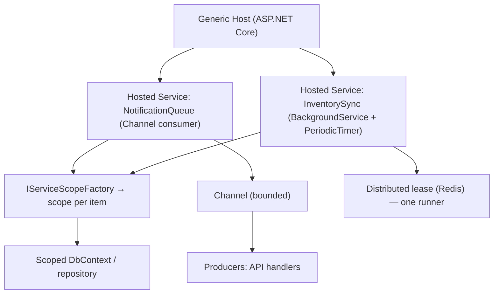

# Chapter 25: Background Services

> **Audience:** Experienced .NET developers (5+ years) preparing for an L2 (Mid/Senior) interview at a Healthcare company.
> **Scope:** `IHostedService` and `BackgroundService`, hosted services lifecycle, `IServiceScopeFactory` and scoped dependencies, periodic work (`PeriodicTimer` vs old timers), graceful shutdown, `Channel<T>` for in-process queues, `Quartz.NET` for cron scheduling, distributed job coordination (leases, idempotency), failure handling and retries, and healthcare use cases (scheduled report generation, data synchronization, notifications, batch processing).

---

## 25.1 What Are Background Services in ASP.NET Core

### Interview Answer (30–45 seconds)

> "A background service is a long-running task that lives inside an ASP.NET Core application and runs independently of incoming HTTP requests. It's built on `IHostedService`, which defines `StartAsync` and `StopAsync` for the host to manage; `BackgroundService` is an abstract base class that wraps that in a single `ExecuteAsync` method plus an easy way to cancel on shutdown. Background services share the host's DI container, but they're singletons by default, so you resolve scoped services via `IServiceScopeFactory`. I use them for things like scheduled data synchronization, report generation, or processing a channel-based job queue, and I rely on the host's graceful shutdown to drain work before the app exits."

### Detailed Explanation

**The hosting model:**

- The generic host (Chapter 9) manages an app's lifetime: configure → start hosted services → run → stop.
- `IHostedService`:
  - `StartAsync(CancellationToken)` — called once at startup.
  - `StopAsync(CancellationToken)` — called at shutdown to drain gracefully.
- `BackgroundService`:
  - `abstract Task ExecuteAsync(CancellationToken)` — your long-running loop.
  - The base class already handles the start/stop mechanics, including a `StopAsync` that signals cancellation and waits for `ExecuteAsync` to finish.

**Lifetime:**

- Services start in registration order; stop in reverse order.
- `CancellationToken` signals shutdown; you must observe it and exit cleanly.

**Dependency scope problem:**

- Hosted services are registered as singletons.
- Resolving a scoped `DbContext` (Chapter 13) directly would throw — scopes are per-request/per-work-item.
- Correct pattern: inject `IServiceScopeFactory`, create a scope per unit of work, resolve scoped services inside.

**Scheduling options:**

| Approach | Fit |
|---|---|
| `BackgroundService` + `Task.Delay`/`PeriodicTimer` | Simple recurring work |
| `Channel<T>` | In-process producer/consumer queue |
| `Quartz.NET` | Cron expressions, job persistence, misfire handling |
| `Hangfire` | Persistent job storage, retries, dashboard |
| Distributed lease (Redis lock, Ch. 20) | Exactly one instance runs the job in a cluster |

### Real World Example (Healthcare)

An EHR app runs a background service that every night synchronizes medication inventory with a supplier, generates shift reports, and pushes missed lab-result notifications. Because the app runs on several instances behind a load balancer, the job acquires a Redis distributed lease first so only one instance runs the scheduled work — otherwise the report would be generated once per instance. Each work item opens its own DI scope for a fresh `DbContext`, and graceful shutdown lets the current item finish before the host stops.

### Production Code Example

```csharp
// Periodic background job with graceful shutdown
public sealed class InventorySyncService : BackgroundService
{
    private readonly IServiceScopeFactory _scopeFactory;

    public InventorySyncService(IServiceScopeFactory scopeFactory) => _scopeFactory = scopeFactory;

    protected override async Task ExecuteAsync(CancellationToken stoppingToken)
    {
        using var timer = new PeriodicTimer(TimeSpan.FromHours(1));

        while (await timer.WaitForNextTickAsync(stoppingToken))
        {
            await RunSyncAsync(stoppingToken);
        }
    }

    private async Task RunSyncAsync(CancellationToken ct)
    {
        using var scope = _scopeFactory.CreateScope();
        var repo = scope.ServiceProvider.GetRequiredService<IInventoryRepository>();

        await foreach (var item in repo.GetPendingAsync(ct))
        {
            try
            {
                await _supplierClient.SyncAsync(item, ct);
                await repo.MarkSyncedAsync(item.Id, ct);
            }
            catch (Exception ex) when (ex is not OperationCanceledException)
            {
                _logger.LogError(ex, "Sync failed for {ItemId}", item.Id);
            }
        }
    }
}
```

```csharp
// In-process job queue with Channel<T>
public sealed class NotificationQueueService : BackgroundService
{
    private readonly Channel<NotificationJob> _channel;
    private readonly IServiceScopeFactory _scopeFactory;

    public NotificationQueueService(IServiceScopeFactory scopeFactory)
    {
        _scopeFactory = scopeFactory;
        _channel = Channel.CreateBounded<NotificationJob>(
            new BoundedChannelOptions(1000) { FullMode = BoundedChannelFullMode.Wait });
    }

    public ValueTask EnqueueAsync(NotificationJob job, CancellationToken ct)
        => _channel.Writer.WriteAsync(job, ct);

    protected override async Task ExecuteAsync(CancellationToken stoppingToken)
    {
        await foreach (var job in _channel.Reader.ReadAllAsync(stoppingToken))
        {
            using var scope = _scopeFactory.CreateScope();
            var sender = scope.ServiceProvider.GetRequiredService<INotificationSender>();
            await sender.SendAsync(job, stoppingToken);
        }
    }
}

// Program.cs
builder.Services.AddHostedService<InventorySyncService>();
builder.Services.AddHostedService<NotificationQueueService>();
```

**Key lines explained:**

- `PeriodicTimer` avoids overlapping runs and respects cancellation (better than `Task.Delay`).
- Scoped dependencies come from a fresh scope per work item — never from the singleton directly.
- `Channel<T>` decouples producers (API) from consumers (background workers) with backpressure.

### Internal Working

- The host calls `StartAsync` on each hosted service during startup; the app is ready to serve requests after they start.
- `ExecuteAsync` typically loops: wait for tick → do work → wait for next tick, checking `stoppingToken` each cycle.
- On `StopAsync`, the host signals `stoppingToken`, gives services a grace period (`HostOptions.ShutdownTimeout`, default 30s), then waits for `ExecuteAsync` to return.
- `PeriodicTimer.WaitForNextTickAsync` throws `OperationCanceledException` on cancel — the standard clean exit.

### Advantages

- Runs inside the app process — no separate worker service or scheduler to operate.
- Shares DI, configuration, logging, and the same environment as the API.
- Host-managed lifetime: start ordering and graceful shutdown handled for you.
- `Channel<T>` gives an in-process queue with bounded backpressure.
- Scales with the app (more instances → more workers, unless you coordinate).

### Disadvantages

- Tied to the app's lifetime — if the web app restarts, jobs may be interrupted (not durable).
- No built-in persistence, retry store, or cron misfire handling (needs Quartz/Hangfire).
- In-process queue is lost on restart (use a broker for durable jobs, Ch. 21–22).
- Multi-instance scheduling needs distributed coordination (lease/lock) or duplicate work.
- Failure inside a loop can stop the service if unhandled (wrap and recover).

### Best Practices

- Use `BackgroundService` + `PeriodicTimer` for recurring work; check `stoppingToken` every iteration.
- Resolve scoped services via `IServiceScopeFactory` per work item — never share a scoped `DbContext`.
- Catch per-item exceptions so one failure doesn't kill the loop.
- Set `HostOptions.ShutdownTimeout` deliberately; keep shutdown bounded.
- Use `Channel<T>` for producer/consumer work with bounded capacity and a `FullMode` policy.
- Use Quartz.NET/Hangfire when you need cron, persistence, retries, or a dashboard.
- Coordinate multi-instance schedules with a distributed lease (Redis lock, Ch. 20).
- Make workers idempotent so restart/reprocessing is safe.

### Common Mistakes

- Injecting `DbContext` directly into a singleton hosted service → `InvalidOperationException` for scoped services.
- Unhandled exceptions in `ExecuteAsync` → service silently stops.
- `Task.Delay` with cancellation ignored → shutdown hangs up to the timeout.
- Overlapping runs: the previous cycle still running when the next tick fires (use `PeriodicTimer` + single loop).
- In-process `Channel` job loss on restart → durable jobs must live in a broker/DB.
- No distributed lease → every instance runs the same scheduled report.
- Non-idempotent jobs → reprocessing after restart duplicates clinical side effects.

### Interview Follow-up Questions

1. **"`IHostedService` vs `BackgroundService`?"** — `BackgroundService` is a base class over `IHostedService` that simplifies the single-task case.
2. **"Why can't a hosted service inject scoped services?"** — It's a singleton; scopes are request/work-item-bound; use `IServiceScopeFactory`.
3. **"How does graceful shutdown work?"** — `StopAsync` signals the cancellation token and waits (`ShutdownTimeout` default 30s) for work to drain.
4. **"`PeriodicTimer` vs `Task.Delay`?"** — `PeriodicTimer` fires on schedule without overlap and integrates cleanly with cancellation; `Task.Delay` drifts and overlaps easily.
5. **"How do you schedule a job at 3 AM?"** — Quartz.NET cron (`0 0 3 * * ?`) or a computed next-run delay; with distributed lease for multi-instance.
6. **"How do you process a queue in-process?"** — `Channel<T>` with a bounded capacity and a consumer loop.
7. **"How do you avoid duplicate execution across instances?"** — Redis distributed lease (SET NX PX) or a database lease; also make jobs idempotent.
8. **"What happens if a job throws?"** — Catch per item; log; optionally push to a dead-letter queue and alert. Unhandled = service stops.
9. **"How would you make scheduled work durable?"** — Store jobs in a broker/DB, use Hangfire/Quartz with persistence, and retry with backoff.
10. **"Where does the cancellation token come from?"** — The host passes it to `StartAsync`/`ExecuteAsync`; it's signaled on shutdown.

### Senior Level Talking Points

- **Distributed scheduling:** lease-based single-runner guarantees + idempotency as the belt-and-suspenders for clinical jobs.
- **Durability vs in-process:** `Channel<T>` for transient work, broker-backed jobs (RabbitMQ/Kafka) for reliable delivery, Hangfire/Quartz for cron persistence.
- **Graceful shutdown design:** bounded drain, checkpoint progress, resume semantics.
- **Health integration:** expose worker status (last run, queue depth) via health checks (Ch. 35) and metrics.
- **Backpressure:** bounded channels, concurrency limits, and DB write batching for bulk clinical data.
- **Observability:** structured logs with job IDs, metrics per job, alerting on failure/starvation.

### Diagram



### Comparison Table

| Aspect | `BackgroundService` | Quartz.NET / Hangfire | `Channel<T>` | Broker jobs (Ch. 21–22) |
|---|---|---|---|---|
| Purpose | Recurring in-process work | Cron + persistent jobs | In-process queue | Durable async delivery |
| Durability | None | Persistent | None (in-memory) | Yes |
| Scheduling | Manual loop | Cron / calendar | N/A | N/A |
| Retries | Manual | Built-in | Manual | DLQ + retries |
| Distributed coordination | Manual lease | Quartz clustering / Hangfire | N/A | Consumer groups |
| Best fit | Simple periodic tasks | Scheduled reports, misfire handling | In-process async pipeline | Reliable cross-service events |

### Memory Trick

**"ExecuteAsync + stoppingToken + scope factory."** Your loop runs in `ExecuteAsync`; observe the token to stop cleanly; create a scope per unit of work to get scoped dependencies. `PeriodicTimer` for schedule, `Channel` for queue, lease for cluster.

### Summary

Background services let ASP.NET Core apps run long-lived work alongside HTTP traffic. Master `BackgroundService`/`IHostedService`, scoped-service resolution via `IServiceScopeFactory`, graceful shutdown, `PeriodicTimer` for scheduling, `Channel<T>` for in-process queues, and distributed leases for multi-instance safety. For healthcare interviews, emphasize durable-vs-transient jobs, idempotency, and never blocking shutdown.

### Interview Confidence Score

**Confidence: High (after this chapter).** Background processing is a recurring L2 topic. Knowing lifecycle, scoping traps, scheduling, and cluster-safe execution — with the healthcare twist of reliable reports and notifications — will cover the interviewers' favorite variations.

---

## Top 10 Interview Questions for This Chapter

1. What is the difference between `IHostedService` and `BackgroundService`?
2. Why can't a hosted service inject scoped services, and how do you fix it?
3. How does graceful shutdown work for background services?
4. `PeriodicTimer` vs `Task.Delay` — what's the difference?
5. How do you process an in-process work queue?
6. How would you schedule a job at 3 AM in .NET?
7. How do you stop duplicate job execution across instances?
8. What happens when an exception escapes `ExecuteAsync`?
9. How do you make background work durable?
10. How do you integrate worker status with health checks and monitoring?

## Revision Notes

- `IHostedService`: `StartAsync`/`StopAsync`; `BackgroundService`: single `ExecuteAsync(ct)`.
- Host starts services in order, stops in reverse; `stoppingToken` = shutdown signal.
- Hosted services are singletons → resolve scoped services via `IServiceScopeFactory` per work item.
- `PeriodicTimer` = non-overlapping, cancellation-aware scheduling; `Task.Delay` drifts/overlaps.
- `Channel<T>` = bounded in-process queue (producer/consumer, backpressure).
- Graceful shutdown: drain within `HostOptions.ShutdownTimeout` (default 30s).
- Durable/cron: Quartz.NET (cron, misfire) or Hangfire (persistence, dashboard).
- Multi-instance: Redis lease (`SET NX PX`) → single runner; make jobs idempotent.
- Catch per-item exceptions; unhandled exceptions kill the service.
- `Channel<T>` jobs lost on restart → durable jobs belong in a broker/DB.

## Things Interviewers Expect from 5+ Years Experience

- You know the singleton-vs-scope trap and always use `IServiceScopeFactory` correctly.
- You design for graceful shutdown and bounded drain.
- You distinguish transient (in-process) vs durable (broker/DB) work.
- You handle multi-instance execution with leases and idempotency.
- You add observability (health, metrics, structured logs) to workers.

## Cheat Sheet

```csharp
// BackgroundService
public sealed class SyncService : BackgroundService
{
    private readonly IServiceScopeFactory _scopeFactory;
    protected override async Task ExecuteAsync(CancellationToken stoppingToken)
    {
        using var timer = new PeriodicTimer(TimeSpan.FromHours(1));
        while (await timer.WaitForNextTickAsync(stoppingToken))
        {
            using var scope = _scopeFactory.CreateScope();
            var repo = scope.ServiceProvider.GetRequiredService<IInventoryRepository>();
            // do work with per-item try/catch
        }
    }
}

// Channel queue
var channel = Channel.CreateBounded<T>(new BoundedChannelOptions(1000)
    { FullMode = BoundedChannelFullMode.Wait });
await channel.Writer.WriteAsync(job, ct);
await foreach (var j in channel.Reader.ReadAllAsync(ct)) { /* consume */ }

// Registration
builder.Services.AddHostedService<SyncService>();
builder.Services.Configure<HostOptions>(o => o.ShutdownTimeout = TimeSpan.FromSeconds(45));
```

## Flash Cards

**Q:** Why does injecting `DbContext` into a hosted service fail? **A:** The service is a singleton; `DbContext` is scoped — resolve inside a per-item scope.

**Q:** What signals a background service to stop? **A:** The host cancels its `stoppingToken` on shutdown.

**Q:** What does `PeriodicTimer` guarantee that `Task.Delay` doesn't? **A:** Non-overlapping ticks and clean cancellation.

**Q:** How do you run a job only once across replicas? **A:** A distributed lease (Redis `SET NX PX`); make the job idempotent as a fallback.

**Q:** What happens to `Channel<T>` jobs on restart? **A:** They're lost — use a durable broker/DB for important jobs.

**Q:** How long does shutdown wait? **A:** `HostOptions.ShutdownTimeout` (default 30s) for `ExecuteAsync` to drain.

---

*Continue → Chapter 26: Clean Architecture*
