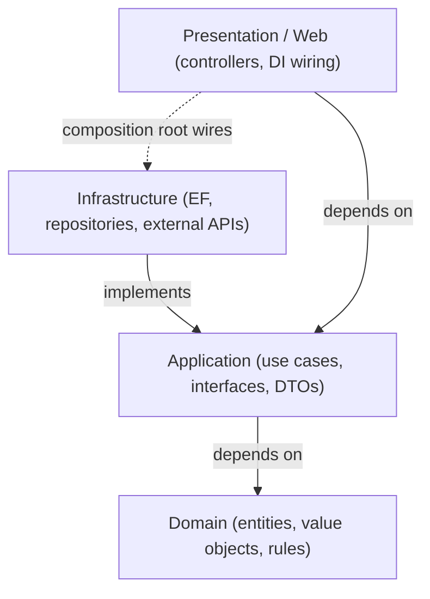

# Chapter 26: Clean Architecture

> **Audience:** Experienced .NET developers (5+ years) preparing for an L2 (Mid/Senior) interview at a Healthcare company.
> **Scope:** Clean/Onion architecture principles (dependency inversion, concentric layers), the four layers (Domain, Application, Infrastructure, Presentation), dependency direction and the Dependency Rule, project structure and references, benefits and trade-offs vs other architectures (traditional N-tier, vertical slice), and implementing it in ASP.NET Core with DI — the healthcare angle being testable, maintainable, regulation-friendly clinical systems.

---

## 26.1 What Is Clean Architecture and Why Does It Matter

### Interview Answer (30–45 seconds)

> "Clean Architecture is a way to structure an application around its business domain, with the dependency direction pointing inward. The core — Domain and Application layers — contains business rules and has zero knowledge of frameworks, databases, or UI; the outer layers — Infrastructure and Presentation — depend on the core, never the other way around. This is the Dependency Rule. In ASP.NET Core, Domain defines entities and domain services, Application defines interfaces and use cases, Infrastructure implements persistence and external integrations, and the Web layer wires everything together with DI. The payoff is testability, because you can test business logic without a database or HTTP, and maintainability, because framework changes stay at the edges."

### Detailed Explanation

**The Dependency Rule:**

- Source code dependencies point **inward** only.
- Outer layers (UI, Infrastructure) depend on inner layers (Application, Domain).
- Inner layers know nothing about outer layers.

**The four layers:**

| Layer | Contains | Depends on |
|---|---|---|
| Domain | Entities, value objects, domain events, domain services | Nothing external |
| Application | Use cases, DTOs, interfaces, business rules orchestration | Domain |
| Infrastructure | EF Core, repositories, external APIs, email, file storage | Application + Domain |
| Presentation (Web) | Controllers, Minimal APIs, middleware, DI wiring | Application |

**Key mechanics:**

- **Dependency Inversion (DIP, Ch. 8):** Application defines interfaces; Infrastructure implements them; DI binds them. The core controls the contracts.
- **References:** Application → Domain; Infrastructure → Application; Web → Application (+ Infrastructure at the composition root).
- **Models live inside:** Entities never leak to the UI; `DbCcontext`/EF never appears in Application.

**Why it's not just N-tier:**

- Traditional N-tier still lets the UI talk directly to data access.
- Clean Architecture forces a boundary at the **application/use-case** level — the business intent, not CRUD.

**Common structural flavors:** Clean Architecture (Ports & Adapters / Hexagonal), Onion, Vertical Slice (structuring by feature instead of by layer). Clean + vertical-slice features is a popular hybrid.

### Real World Example (Healthcare)

A medication-ordering system is structured with the ordering workflow and clinical rules (drug interactions, dose checks) in the Application layer. The UI calls an `IMedicationOrderService`; the Application defines `IMedicationRepository`; EF Core implements it in Infrastructure. The business logic is unit-tested with in-memory fake repositories — no database or HTTP in tests. When the team later swaps SQL Server for a different store or moves the UI to Blazor, the domain logic stays untouched.

### Production Code Example

```csharp
// Domain — pure, no dependencies
public sealed record MedicationOrder(
    string PatientId,
    string DrugCode,     // e.g., RxNorm / LOINC
    decimal DoseMg,
    DateTime OrderedAt);

public interface IMedicationOrderService { }   // (Domain-level domain service if needed)

// Application — interfaces + use cases
public interface IMedicationOrderRepository
{
    Task<MedicationOrder?> GetByIdAsync(Guid id, CancellationToken ct = default);
    Task AddAsync(MedicationOrder order, CancellationToken ct = default);
}

public sealed class PlaceMedicationOrderUseCase
{
    private readonly IMedicationOrderRepository _repo;
    private readonly IDrugInteractionChecker _checker;

    public PlaceMedicationOrderUseCase(IMedicationOrderRepository repo, IDrugInteractionChecker checker)
    {
        _repo = repo;
        _checker = checker;
    }

    public async Task<Result> ExecuteAsync(MedicationOrderDto dto, CancellationToken ct)
    {
        var order = dto.ToDomain();
        if (await _checker.HasContraindicationAsync(order, ct))
            return Result.Fail("Contraindication detected");

        await _repo.AddAsync(order, ct);
        return Result.Ok(order.Id);
    }
}
```

```csharp
// Infrastructure — implements Application interfaces
public sealed class EfMedicationOrderRepository : IMedicationOrderRepository
{
    private readonly ClinicalDbContext _db;
    public EfMedicationOrderRepository(ClinicalDbContext db) => _db = db;

    public Task<MedicationOrder?> GetByIdAsync(Guid id, CancellationToken ct)
        => _db.MedicationOrders.AsNoTracking()
              .FirstOrDefaultAsync(o => o.Id == id, ct);
}
```

```csharp
// Presentation / Composition root
builder.Services.AddScoped<IMedicationOrderRepository, EfMedicationOrderRepository>();
builder.Services.AddScoped<PlaceMedicationOrderUseCase>();
```

**Key lines explained:**

- Domain has no references to EF, ASP.NET, or serializers.
- Application depends on interfaces (`IMedicationOrderRepository`), not on EF.
- Infrastructure implements the interfaces; DI (composition root) binds them.
- The use case encodes the business rule (contraindication check) in one testable place.

### Internal Working

- At startup the composition root registers concrete implementations against Application interfaces.
- A controller injects a use case; the use case calls repository interfaces; at runtime DI resolves the EF implementation.
- Because Application only knows interfaces, unit tests swap in fakes — the same boundary that DI resolves at runtime.
- Compile-time enforcement: Infrastructure/Web reference Application/Domain, but Application references only Domain (enforced by project references).

### Advantages

- Business logic is framework-agnostic → unit-testable without DB/HTTP.
- Dependencies point inward → changing EF, the DB, or the UI doesn't ripple through the core.
- Clear boundaries scale with the team; each layer has a single responsibility.
- Parallel work: teams own layers without merge conflicts.
- Domain stays pure → domain events, invariants, and rules are explicit.

### Disadvantages

- More projects/abstraction → ceremony for simple CRUD apps (YAGNI risk).
- Over-abstraction: premature interfaces and mappings can hide the real work.
- Mapping overhead between DTOs and entities.
- Can become over-layered if misapplied (a "Big Ball of Mud" of small projects).
- Decisions about where a rule lives are still judgment calls.

### Best Practices

- Start clean only when the domain is rich; for CRUD-heavy apps consider vertical slice or minimal layering.
- Keep Domain persistence-ignorant: no EF, no attributes that leak storage concerns.
- Put use cases in Application; controllers stay thin.
- Define interfaces where the core needs them, not as a ritual for every class.
- Use the composition root (Program.cs) for wiring; never resolve services deep in code.
- Test the core with fakes; reserve integration tests for Infrastructure.
- Structure by feature (vertical slice) inside the layers for better cohesion.

### Common Mistakes

- Allowing Infrastructure types (`DbContext`, EF `IQueryable`) to leak into Application or controllers.
- Creating an interface for every class without a dependency-inversion reason (empty abstraction).
- Making Domain depend on serialization attributes or EF annotations.
- Giant Application layer doing CRUD passthrough (no business rules → layering is pointless).
- Resolving `IServiceProvider` inside Application (composition root only).
- Two-way references between layers (circular dependency).
- Skipping the use-case layer and letting controllers talk to repositories directly.

### Interview Follow-up Questions

1. **"What is the Dependency Rule?"** — Source dependencies point inward; inner layers never depend on outer ones.
2. **"How is this different from traditional N-tier?"** — N-tier is technical layering (UI/BLL/DAL); Clean Architecture is domain-centric with inverted dependencies and explicit boundaries.
3. **"Where does EF Core live and why?"** — Infrastructure; Application depends on repository interfaces so persistence is swappable and testable.
4. **"What goes in each layer?"** — Domain: entities/rules; Application: use cases/interfaces; Infrastructure: EF/external integrations; Presentation: controllers/wiring.
5. **"How do you test the core?"** — Fakes for repository interfaces; unit tests run without DB/HTTP.
6. **"Clean Architecture vs vertical slice?"** — Clean = layers; vertical slice = features. They combine: clean within a feature slice.
7. **"When is Clean Architecture overkill?"** — Small CRUD apps, prototypes; the abstraction cost exceeds the benefit.
8. **"What is the composition root?"** — The single place where concrete types are wired to interfaces (Program.cs).
9. **"How do you prevent dependency leakage?"** — Enforce project references and (optionally) architecture tests (e.g., NetArchTest).
10. **"Where do DTOs and mappings belong?"** — Application defines DTOs; mappings at the boundaries; keep entities out of the UI.

### Senior Level Talking Points

- **Enforcing the architecture:** project references + architecture tests (NetArchTest) to fail CI when dependencies leak.
- **Domain modeling depth:** rich domain with invariants vs anemic CRUD — the difference shows in regulated healthcare code.
- **CQRS/MediatR fit (Ch. 28):** use cases as commands/queries sit naturally in the Application layer.
- **Testing strategy:** unit-test the domain/use cases, integration-test infrastructure, contract-test boundaries.
- **Migration path:** refactor legacy N-tier incrementally — wrap legacy behind Application interfaces first.
- **Team scaling:** ownership by layer or by feature slice; consistency of naming across solutions.

### Diagram



### Comparison Table

| Aspect | Clean Architecture | N-tier (UI/BLL/DAL) | Vertical Slice |
|---|---|---|---|
| Organization | By layer + domain-centric | By technical layer | By feature |
| Dependency direction | Inward only | Top-down | Self-contained features |
| Core testability | High (fakes) | Medium | High |
| Abstraction cost | Higher | Low | Low–medium |
| Best for | Rich, long-lived domains | Simple CRUD | Feature-rich apps |
| Change impact | Isolated to layer | Ripples through layers | Isolated to feature |

### Memory Trick

**"Inward dependencies, outward knowledge."** The core knows business rules; the edges know frameworks. Interfaces face in; implementations face out; the composition root connects them.

### Summary

Clean Architecture keeps business logic pure and testable by making dependencies point inward and letting the outer layers adapt to frameworks. Know the four layers, the Dependency Rule, dependency inversion via interfaces, and where EF/DI live. For healthcare interviews, emphasize testability of clinical rules, swappable infrastructure, and the judgment to know when the structure pays off.

### Interview Confidence Score

**Confidence: High (after this chapter).** Architecture questions are almost guaranteed at L2. Demonstrating that you know both the pattern and when to skip it — plus how to enforce it in CI — reads as senior-level thinking.

---

## Top 10 Interview Questions for This Chapter

1. What is the Dependency Rule in Clean Architecture?
2. Describe the four layers and what each contains.
3. How does this differ from traditional N-tier architecture?
4. Why does EF Core live in Infrastructure and not Application?
5. How do you test the core without a database?
6. What is the composition root and why does it matter?
7. Clean Architecture vs vertical slice — when would you use each?
8. When is Clean Architecture overkill?
9. How do you enforce layer boundaries in a real codebase?
10. Where do DTOs and entity mappings belong?

## Revision Notes

- Dependency Rule: source dependencies point inward; outer → inner only.
- Layers: Domain (pure), Application (use cases/interfaces), Infrastructure (EF/external), Presentation (wiring/UI).
- Application defines interfaces; Infrastructure implements; DI binds at the composition root (Program.cs).
- EF types and `IQueryable` must not leak into Application/controllers.
- Domain is persistence-ignorant: no EF attributes, no serialization concerns.
- Test core with fakes; integration-test Infrastructure.
- Overkill for simple CRUD; combine with vertical slice for feature cohesion.
- Enforce with project references + architecture tests (NetArchTest).

## Things Interviewers Expect from 5+ Years Experience

- You can explain dependency inversion concretely, not just name the pattern.
- You know what belongs in each layer and can spot leaks (EF in controllers).
- You can justify when the architecture is worth it and when it isn't.
- You enforce boundaries with tools, not just discipline.
- You connect architecture to testability and team scaling.

## Cheat Sheet

```
Solution layout:
  Clinical.Domain/          # entities, value objects, domain events
  Clinical.Application/     # use cases, interfaces, DTOs, Result
  Clinical.Infrastructure/  # EF Core, repos, integrations (refs: Application, Domain)
  Clinical.Web/             # controllers, Program.cs (refs: Application, Infrastructure)

Rules:
  Domain -> (nothing)
  Application -> Domain
  Infrastructure -> Application, Domain
  Web -> Application, Infrastructure
  Wire in Program.cs (composition root) only
```

## Flash Cards

**Q:** What does the Domain layer reference? **A:** Nothing — it's the innermost, pure business layer.

**Q:** Where do repository interfaces live? **A:** Application (defined by the core); implementations in Infrastructure.

**Q:** How do you unit test a use case? **A:** Inject fake repository implementations — no DB or HTTP needed.

**Q:** What is the composition root? **A:** Program.cs — the one place interfaces are bound to implementations.

**Q:** What's the symptom of leaking EF into Application? **A:** `IQueryable`/`DbContext` appearing in use cases or controllers.

**Q:** When do you skip Clean Architecture? **A:** Simple CRUD/prototypes where abstraction cost outweighs value.

---

*Continue → Chapter 27: Repository & Unit of Work*
