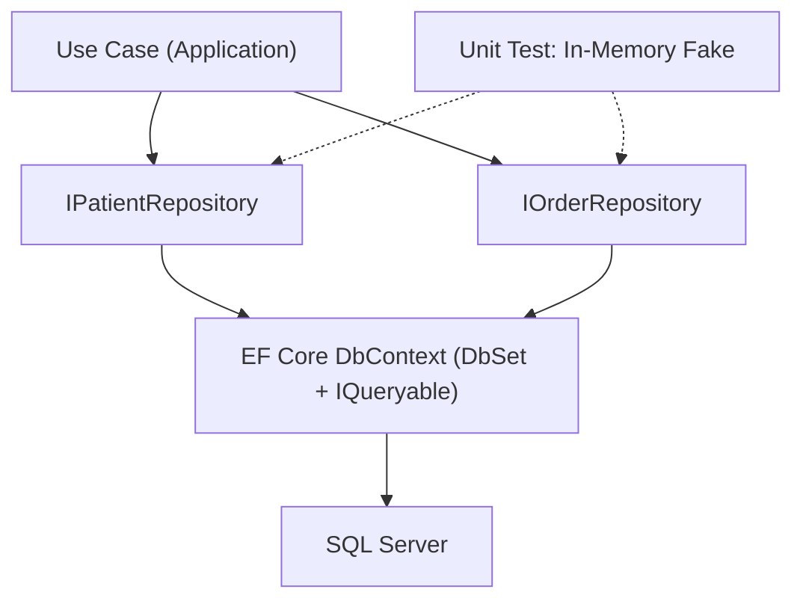

# Chapter 27: Repository Pattern

> **Audience:** Experienced .NET developers (5+ years) preparing for an L2 (Mid/Senior) interview at a Healthcare company.
> **Scope:** The Repository pattern — why it exists, what it abstracts, generic vs specific repositories, EF Core (`DbSet<T>` as a repository), async methods, tracking vs no-tracking, and when the pattern helps vs when it's an anti-pattern over EF Core — the healthcare angle being consistent, testable clinical query logic and a persistence-agnostic core.

---

## 27.1 What Is the Repository Pattern and Why Does It Exist

### Interview Answer (30–45 seconds)

> "The Repository pattern abstracts data access behind a collection-like interface so the application logic doesn't know whether data lives in SQL Server, an in-memory list, or a web service. It exposes persistence as a collection API — `GetByIdAsync`, `Add`, `Update`, `Remove` — and implementations wrap the real data store, usually EF Core. The payoff is testability, because I can swap in an in-memory fake for unit tests, and decoupling, because the Application layer depends on my interfaces instead of EF. But I'd also flag the trade-off: EF Core's `DbSet<T>` already is a repository, so the pattern is only worth its ceremony when there's a real need for abstraction or storage swap."

### Detailed Explanation

**What it is:**

- A layer between the domain/application and the data store.
- Exposes persistence operations as a collection-like API: `GetByIdAsync`, `AddAsync`, `Remove`, `FindAsync`, etc.
- The caller works against interfaces; implementations wrap EF Core.
- Benefits: testability (fake repositories), decoupling from EF, centralized query logic.

**Generic vs specific repositories:**

- Generic `IRepository<T>` handles common CRUD; specific repos (e.g., `IPatientRepository`) add domain queries.
- Trade-off: generic is DRY but can leak `IQueryable` (breaking the abstraction); specific is verbose but explicit.
- For healthcare domains with rich, entity-specific queries (active orders, patient by facility), specific repositories usually win.

**EF Core relationship:**

| Repository concept | EF Core equivalent |
|---|---|
| Repository | `DbSet<T>` + `IQueryable` |
| Collection API | `DbSet<T>` LINQ queries |

**Async:** All data access should be async (`FirstOrDefaultAsync`, `ToListAsync`, etc.) to avoid blocking thread-pool threads.

**Tracking vs no-tracking:**

- `AsNoTracking()` for reads (no change tracking overhead, no accidental updates).
- Tracking for updates where EF computes diffs on `SaveChangesAsync`.

### Real World Example (Healthcare)

A clinic dashboard needs "active orders for a patient" — a query that joins orders with encounter status and filters out voided items. Without a repository, that LINQ lives in controllers and gets copy-pasted. With an `IOrderRepository.GetActiveAsync(patientId)`, the query is defined once, tested against an in-memory fake, and swapped for a stored procedure or a read model later without touching the UI. Repository methods also enforce clinical rules centrally — e.g., never returning cancelled orders to a prescribing screen.

### Production Code Example

```csharp
// Abstraction (Application layer)
public interface IPatientRepository
{
    Task<Patient?> GetByIdAsync(Guid id, bool asNoTracking = false, CancellationToken ct = default);
    Task<IReadOnlyList<Patient>> GetByFacilityAsync(Guid facilityId, CancellationToken ct = default);
    void Add(Patient patient);
    void Update(Patient patient);
}

public interface IOrderRepository
{
    Task<IReadOnlyList<Order>> GetActiveAsync(Guid patientId, CancellationToken ct = default);
    Task<Encounter?> GetEncounterAsync(Guid encounterId, CancellationToken ct = default);
    void Add(Order order);
    void Update(Encounter encounter);
}
```

```csharp
// Implementation (Infrastructure)
public sealed class PatientRepository : IPatientRepository
{
    private readonly ClinicalDbContext _db;

    public PatientRepository(ClinicalDbContext db) => _db = db;

    public Task<Patient?> GetByIdAsync(Guid id, bool asNoTracking = false, CancellationToken ct = default)
        => (asNoTracking ? _db.Patients.AsNoTracking() : _db.Patients)
           .FirstOrDefaultAsync(p => p.Id == id, ct);

    public Task<IReadOnlyList<Patient>> GetByFacilityAsync(Guid facilityId, CancellationToken ct = default)
        => _db.Patients.AsNoTracking()
              .Where(p => p.FacilityId == facilityId)
              .OrderBy(p => p.FullName)
              .ToListAsync(ct);

    public void Add(Patient patient) => _db.Patients.Add(patient);
    public void Update(Patient patient) => _db.Patients.Update(patient);
}
```

**Key lines explained:**

- Repositories expose domain-oriented queries; callers never see `DbContext` or `IQueryable`.
- `asNoTracking` flag lets read paths opt out of change tracking.
- Add/Update just queue into the change tracker — nothing hits the DB until `SaveChangesAsync` (the Unit of Work, Ch. 28).

### Internal Working

- EF's `DbSet<T>` is itself a repository: it wraps the `DbContext` and exposes `IQueryable` for LINQ translation.
- Queries translate to SQL at execution time (`ToListAsync`, etc.), not at enumeration.
- When a repository method returns tracked entities, EF's change tracker records their state for the next `SaveChangesAsync`.
- The underlying implementation uses `DbSet<T>` plus `IQueryable`; no custom query pipeline unless you add one (specifications, paging helpers).

### Advantages

- Application code stays persistence-agnostic → testable with fakes.
- Centralizes query logic and naming — one place to find "how do we load patients."
- Makes swapping storage (or adding caching at the repository layer) feasible.
- Enforces domain query rules centrally (e.g., filter out voided orders everywhere).

### Disadvantages

- EF Core already IS a repository — the pattern adds ceremony without new capability.
- Generic repositories that expose `IQueryable` defeat the abstraction and risk leaking EF into callers.
- Can hide EF features (includes, projection, raw SQL) behind a restrictive API.
- N+1 query problems can hide behind repository methods.
- Over-use leads to boilerplate (an interface + implementation per entity).

### Best Practices

- Only abstract when you need it: swap-ability, testability, or a clean Application boundary (Ch. 26).
- Prefer specific repositories over generic `IQueryable`-exposing ones.
- Keep `AsNoTracking()` for reads; use tracking deliberately for updates.
- Make all operations async; respect `CancellationToken`.
- Let EF do the work: don't re-implement `Include`, `ThenInclude`, paging, or projection behind thin wrappers unless you provide equivalents.
- Put transaction boundaries in the use case, not in repository methods (see Ch. 28).

### Common Mistakes

- Exposing `IQueryable` from a generic repository → EF leaks into callers and the "abstraction" is a facade.
- Blocking calls (`ToList()`, `.Result`) in repositories → thread-pool starvation under load.
- Repositories returning entities when the caller only needs summaries → over-fetching.
- Ignoring change tracking: querying, mutating, then expecting EF to know (it does, if tracked).
- Pattern ceremony for simple apps where `DbContext` directly suffices.

### Interview Follow-up Questions

1. **"Is the Repository pattern an anti-pattern with EF Core?"** — It can be when it adds no value; many teams prefer `DbContext` directly. It earns its keep when the Application layer must not depend on EF (Clean Architecture) or when storage must be swappable/testable.
2. **"Generic vs specific repository?"** — Specific hides EF features but is explicit; generic is DRY but risks leaking `IQueryable`.
3. **"Tracking vs no-tracking?"** — No-tracking for reads; tracking for updates EF must diff.
4. **"How do you avoid the N+1 problem in a repository?"** — `Include`/`ThenInclude`, explicit loading, projections to DTOs, or split queries.
5. **"How do you unit test a repository?"** — Use fakes implementing the interface for unit tests; use the real EF in-memory/SQLite provider for integration tests of the LINQ itself.
6. **"What does `AddRange`/`UpdateRange` do?"** — Batch-queues multiple entities into the change tracker before a single save.
7. **"Scoped lifetime — why does it matter?"** — A scoped `DbContext` ensures one instance per request = one change tracker.
8. **"How do you handle soft deletes in a repository?"** — Encapsulate in the repository (a `GetActiveAsync` that filters `IsDeleted`), plus a global query filter.
9. **"What about the Specification pattern?"** — Encapsulates query criteria (filters, includes, paging) as reusable objects; a good complement when repositories grow many query methods.
10. **"Do you return entities or DTOs from repository methods?"** — DTOs/projections for read paths; entities only when the caller needs to mutate them through the change tracker.

### Senior Level Talking Points

- **Know when the pattern pays:** with Clean Architecture (Ch. 26) where Application must not depend on EF, repositories are the boundary. Without that need, prefer `DbContext` directly.
- **Keep the boundary honest:** never let `IQueryable`/`DbSet` cross the interface; provide paging, includes, and projections explicitly.
- **Performance discipline:** use projections (`Select` to DTO), paging, and `AsNoTracking` — and measure N+1 with query logging.
- **Read models over repositories for CQRS:** heavy read screens can bypass repositories entirely and query projections (Ch. 29).
- **Alternatives:** `IQueryable`-based abstractions, specifications (Specification pattern), or CQRS command handlers (Ch. 29) that use `DbContext` directly.

### Diagram



### Comparison Table

| Aspect | Specific Repository | Generic Repository | EF Core `DbSet<T>` |
|---|---|---|---|
| Abstraction | Domain queries, explicit | Common CRUD, DRY | Thin, leaks LINQ/EF |
| Testability | Fakes | Fakes | In-memory/SQLite (integration) |
| Hides EF features | Yes | Partially (if `IQueryable`) | No — it IS EF |
| Best for | Rich healthcare queries | Simple admin CRUD | Prototypes, simple apps |
| Pitfall | Boilerplate per entity | Leaking `IQueryable` | Coupling callers to EF |

### Memory Trick

**"Repo abstracts the store."** One interface per aggregate, domain queries in one place, reads with `AsNoTracking`. Don't wrap EF just to wrap it — justify the abstraction.

### Summary

The Repository pattern abstracts data access behind a collection-like interface so the core stays persistence-agnostic and testable. In EF Core, `DbSet<T>` already provides repository behavior — so the pattern is justified by a real need (persistence-agnostic core, testability, centralized clinical query rules), not ceremony. For healthcare interviews, emphasize honest boundaries (no leaking `IQueryable`), specific over generic repositories, and the judgment to use `DbContext` directly when abstraction adds nothing.

### Interview Confidence Score

**Confidence: High (after this chapter).** Repository is a classic L2 question that rewards nuance. Naming the anti-pattern and knowing exactly when the abstraction is worth it will impress more than blindly applying it.

---

## Top 10 Interview Questions for This Chapter

1. What is the Repository pattern and what problem does it solve?
2. How does EF Core relate to the Repository pattern?
3. When is the Repository pattern justified and when is it ceremony?
4. Generic vs specific repositories — which do you prefer and why?
5. Tracking vs no-tracking — how do you choose?
6. Why should repositories be async?
7. How do you avoid N+1 queries behind a repository?
8. How do you unit test code that uses a repository?
9. What's the risk of exposing `IQueryable` from a repository?
10. Do you return entities or DTOs from repository methods?

## Revision Notes

- Repository: collection-like data-access abstraction behind interfaces.
- `DbSet<T>` + `IQueryable` = EF Core's built-in repository.
- Specific repositories > generic `IQueryable`-exposing ones.
- `AsNoTracking()` for reads; tracking for updates.
- Queries centralize clinical rules (e.g., never return voided orders).
- N+1: use `Include`, projections, paging — don't hide it behind thin wrappers.
- Anti-pattern when it adds no value — `DbContext` directly is often right.
- Justify the pattern: persistence-agnostic core, testability, centralized query logic.

## Things Interviewers Expect from 5+ Years Experience

- You understand EF Core's built-in repository and don't re-implement it blindly.
- You keep boundaries honest — no `IQueryable`/`DbSet` leaking through interfaces.
- You apply tracking/no-tracking and projection consciously for performance.
- You can defend when the pattern is worth it and when it isn't.
- You know the Repository pattern's partner — Unit of Work — and where the transaction boundary lives (next chapter).

## Cheat Sheet

```csharp
// Abstraction
public interface IPatientRepository
{
    Task<Patient?> GetByIdAsync(Guid id, bool asNoTracking = false, CancellationToken ct = default);
    Task<IReadOnlyList<Patient>> GetByFacilityAsync(Guid facilityId, CancellationToken ct = default);
    void Add(Patient p); void Update(Patient p);
}

// Implementation wraps DbContext
public sealed class PatientRepository : IPatientRepository
{
    private readonly ClinicalDbContext _db;
    public PatientRepository(ClinicalDbContext db) => _db = db;
    // GetByIdAsync, GetByFacilityAsync -> _db.Patients.AsNoTracking()...ToListAsync(ct)
    public void Add(Patient p) => _db.Patients.Add(p);
    public void Update(Patient p) => _db.Patients.Update(p);
}

// Usage: reads are queryable + testable; writes queue to the change tracker
var patient = await _patients.GetByIdAsync(id, asNoTracking: true, ct);
```

## Flash Cards

**Q:** What is a Repository? **A:** A collection-like data-access abstraction behind an interface.

**Q:** What is EF Core's built-in repository? **A:** `DbSet<T>` + `IQueryable`.

**Q:** Tracking vs no-tracking for reads? **A:** Prefer `AsNoTracking()` for reads; use tracking when EF must detect updates.

**Q:** What's the danger of exposing `IQueryable`? **A:** EF leaks into callers and the abstraction becomes a facade.

**Q:** When is the Repository pattern an anti-pattern? **A:** When EF already suffices and no swap/testability boundary is needed.

**Q:** Generic or specific repository for healthcare? **A:** Specific — rich, entity-specific clinical queries are the norm.

---

*Continue → Chapter 28: Unit of Work*
