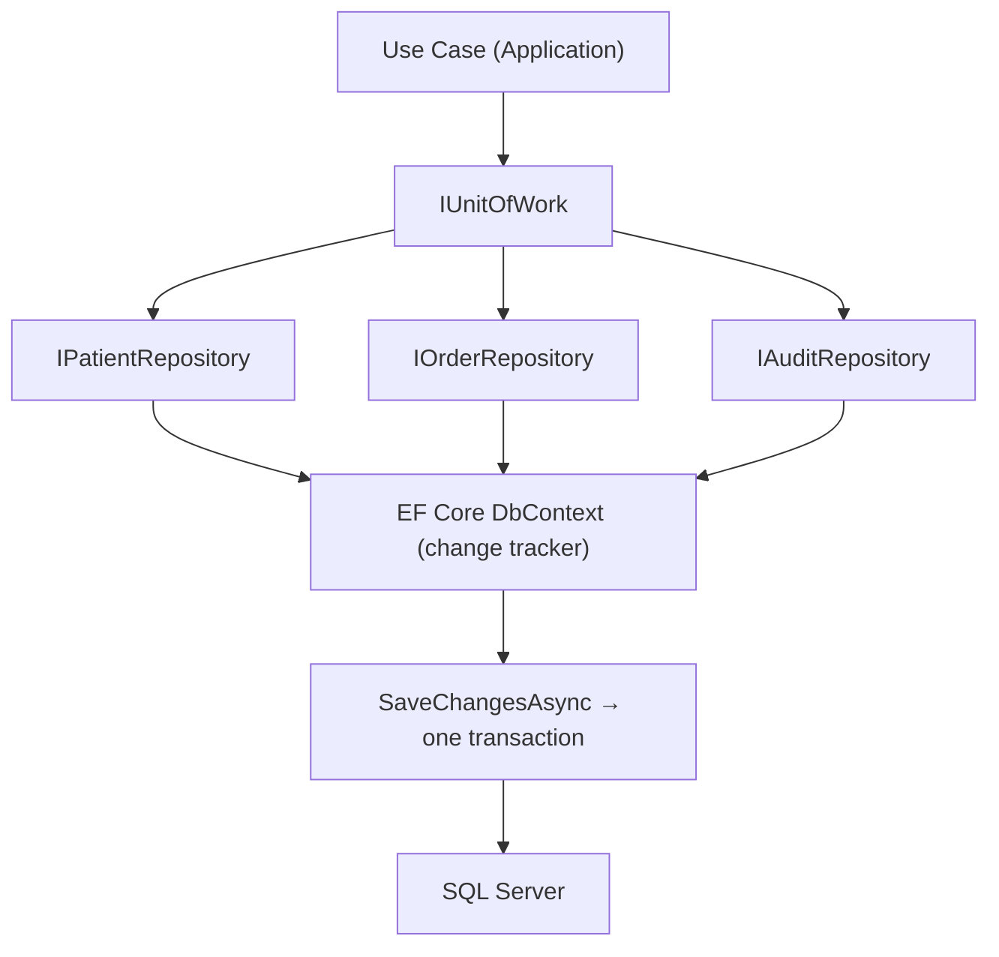

# Chapter 27: Repository & Unit of Work

> **Audience:** Experienced .NET developers (5+ years) preparing for an L2 (Mid/Senior) interview at a Healthcare company.
> **Scope:** The Repository pattern (why it exists, what it abstracts), Unit of Work and transactions, implementing both with EF Core (`DbContext` as UoW, generic vs specific repositories), async methods, tracking vs no-tracking, and when the patterns help vs when they're an anti-pattern over EF Core — the healthcare angle being consistent, transactional clinical writes and testable persistence.

---

## 27.1 Repository and Unit of Work — What Are They

### Interview Answer (30–45 seconds)

> "The Repository pattern abstracts data access behind a collection-like interface so the application logic doesn't know whether data lives in SQL Server, an in-memory list, or a web service. The Unit of Work pattern groups multiple operations into a single transaction so they either all succeed or all fail together. In EF Core, `DbContext` is effectively both: it tracks entities and `SaveChangesAsync` commits one transaction for all pending changes. The classic implementation adds `IRepository<T>` for queries and an `IUnitOfWork` exposing repositories plus a `SaveChangesAsync`. I'd use these to keep the core persistence-agnostic and testable — but I'd also note that EF Core already provides these capabilities, so the pattern is only worth its ceremony when there's a real need for abstraction or swapping storage."

### Detailed Explanation

**Repository pattern:**

- A layer between the domain/application and the data store.
- Exposes persistence operations as a collection-like API: `GetByIdAsync`, `AddAsync`, `Remove`, `FindAsync`, etc.
- The caller works against interfaces; implementations wrap EF Core.
- Benefits: testability (fake repositories), decoupling from EF, centralized query logic.

**Unit of Work (UoW):**

- Tracks changes across multiple repositories so they flush atomically.
- `SaveChangesAsync` = one transaction covering all tracked changes.
- In EF Core, the `DbContext` *is* the UoW: one change tracker, one transaction per save.

**EF Core relationship:**

| Pattern | EF Core equivalent |
|---|---|
| Repository | `DbSet<T>` + `IQueryable` |
| Unit of Work | `DbContext` (tracking + `SaveChangesAsync`) |

**Generic vs specific repositories:**

- Generic `IRepository<T>` handles common CRUD; specific repos (e.g., `IPatientRepository`) add domain queries.
- Trade-off: generic is DRY but can leak `IQueryable` (breaking the abstraction); specific is verbose but explicit.

**Async:** All data access should be async (`SaveChangesAsync`, `FirstOrDefaultAsync`, etc.) to avoid blocking thread-pool threads.

**Tracking vs no-tracking:**

- `AsNoTracking()` for reads (no change tracking overhead, no accidental updates).
- Tracking for updates where EF computes diffs on `SaveChangesAsync`.

### Real World Example (Healthcare)

A discharge workflow updates the encounter status, creates a follow-up order, and records an audit entry — three writes across two repositories. With a Unit of Work, `SaveChangesAsync` commits them in one transaction: if the audit insert fails, nothing is committed and the encounter isn't half-updated. Repositories keep clinical query logic (e.g., "active orders for a patient") in one place, and unit tests swap in in-memory fakes so the workflow is testable without a database.

### Production Code Example

```csharp
// Abstraction (Application layer)
public interface IPatientRepository
{
    Task<Patient?> GetByIdAsync(Guid id, bool asNoTracking = false, CancellationToken ct = default);
    Task<IReadOnlyList<Patient>> GetByFacilityAsync(Guid facilityId, CancellationToken ct = default);
    void Add(Patient patient);
    void Update(Patient patient);
}

public interface IUnitOfWork
{
    IPatientRepository Patients { get; }
    IOrderRepository Orders { get; }
    IAuditRepository AuditLog { get; }
    Task<int> SaveChangesAsync(CancellationToken ct = default);
}
```

```csharp
// Implementation (Infrastructure)
public sealed class PatientRepository : IPatientRepository
{
    private readonly ClinicalDbContext _db;

    public PatientRepository(ClinicalDbContext db) => _db = db;

    public Task<Patient?> GetByIdAsync(Guid id, bool asNoTracking = false, CancellationToken ct = default)
        => (asNoTracking ? _db.Patients.AsNoTracking() : _db.Patients)
           .FirstOrDefaultAsync(p => p.Id == id, ct);

    public Task<IReadOnlyList<Patient>> GetByFacilityAsync(Guid facilityId, CancellationToken ct = default)
        => _db.Patients.AsNoTracking()
              .Where(p => p.FacilityId == facilityId)
              .OrderBy(p => p.FullName)
              .ToListAsync(ct);

    public void Add(Patient patient) => _db.Patients.Add(patient);
    public void Update(Patient patient) => _db.Patients.Update(patient);
}

public sealed class UnitOfWork : IUnitOfWork
{
    private readonly ClinicalDbContext _db;

    public UnitOfWork(ClinicalDbContext db,
        IPatientRepository patients,
        IOrderRepository orders,
        IAuditRepository auditLog)
    {
        _db = db;
        Patients = patients;
        Orders = orders;
        AuditLog = auditLog;
    }

    public IPatientRepository Patients { get; }
    public IOrderRepository Orders { get; }
    public IAuditRepository AuditLog { get; }

    public Task<int> SaveChangesAsync(CancellationToken ct = default)
        => _db.SaveChangesAsync(ct);
}
```

```csharp
// Usage — one transaction across repositories
public async Task DischargeAsync(Guid encounterId, CancellationToken ct)
{
    var encounter = await _uow.Orders.GetEncounterAsync(encounterId, ct);
    encounter.MarkDischarged();
    _uow.Orders.Update(encounter);

    var order = new FollowUpOrder(encounter.PatientId, DateTime.UtcNow.AddDays(14));
    _uow.Orders.Add(order);

    _uow.AuditLog.Add(new AuditEntry(encounter.PatientId, "DISCHARGE", DateTime.UtcNow));

    await _uow.SaveChangesAsync(ct);   // one transaction for all three writes
}
```

**Key lines explained:**

- Repositories expose domain-oriented queries; callers never see `DbContext` or `IQueryable`.
- UoW aggregates repositories and exposes a single commit point.
- `SaveChangesAsync` wraps all pending changes in one DB transaction.
- Read queries use `AsNoTracking()` to reduce overhead.

### Internal Working

- EF's change tracker records entity states (Added/Modified/Deleted) as operations run.
- On `SaveChangesAsync`, EF starts a transaction (if multiple statements), applies changes, and commits atomically.
- One `DbContext` instance per scope (scoped lifetime) = one UoW per request.
- Underlying implementation uses `BeginTransaction`/`Commit` when needed; the default for a single `SaveChangesAsync` is an implicit transaction.

### Advantages

- Application code stays persistence-agnostic → testable with fakes.
- Centralizes query logic and naming.
- One transactional boundary for multi-repository workflows.
- Makes swapping storage (or adding caching at the repository layer) feasible.

### Disadvantages

- EF Core already IS a repository + UoW — the pattern adds ceremony without new capability.
- Generic repositories that expose `IQueryable` defeat the abstraction and risk leaking EF into callers.
- Can hide EF features (includes, projection, raw SQL) behind a restrictive API.
- N+1 query problems can hide behind repository methods.
- Over-use leads to boilerplate (an interface + implementation per entity).

### Best Practices

- Only abstract when you need it: swap-ability, testability, or a clean Application boundary (Ch. 26).
- Prefer specific repositories over generic `IQueryable`-exposing ones.
- Keep `AsNoTracking()` for reads; use tracking deliberately for updates.
- Make all operations async; respect `CancellationToken`.
- Let EF do the work: don't re-implement `Include`, `ThenInclude`, paging, or projection behind thin wrappers unless you provide equivalents.
- Ensure one `DbContext` (scoped) per request = one UoW per request.
- For multi-repository transactions, call `SaveChangesAsync` once at the end.

### Common Mistakes

- Exposing `IQueryable` from a generic repository → EF leaks into callers and the "abstraction" is a facade.
- `SaveChangesAsync` called in every repository method → each call is its own transaction (no atomicity across repos).
- Blocking calls (`ToList()`, `.Result`) in repositories → thread-pool starvation under load.
- Repositories returning entities when the caller only needs summaries → over-fetching.
- Ignoring change tracking: querying, mutating, then expecting EF to know (it does, if tracked).
- Pattern ceremony for simple apps where `DbContext` directly suffices.

### Interview Follow-up Questions

1. **"Why do you need a UoW if `DbContext` is one?"** — Often you don't; you might add it to keep Application dependent on your interfaces rather than EF, or to expose a stable boundary.
2. **"Generic vs specific repository?"** — Specific hides EF features but is explicit; generic is DRY but risks leaking `IQueryable`.
3. **"How do transactions work across multiple `SaveChangesAsync` calls?"** — Each call commits separately; use `db.Database.BeginTransactionAsync()` for explicit multi-save transactions.
4. **"Tracking vs no-tracking?"** — No-tracking for reads; tracking for updates EF must diff.
5. **"How do you avoid the N+1 problem in a repository?"** — `Include`/`ThenInclude`, explicit loading, projections to DTOs, or split queries.
6. **"Is the Repository pattern an anti-pattern with EF Core?"** — It can be when it adds no value; many teams prefer `DbContext` directly or use only a thin UoW.
7. **"How do you unit test a UoW?"** — Fake repositories implement the interfaces; test the workflow logic, not EF.
8. **"Where does the transaction boundary belong?"** — In the use case (Application layer): make all changes, then one `SaveChangesAsync`.
9. **"What does `AddRange`/`UpdateRange` do?"** — Batch-queues multiple entities into the change tracker before a single save.
10. **"Scoped lifetime — why does it matter?"** — A scoped `DbContext` ensures one instance per request = one change tracker = one UoW.

### Senior Level Talking Points

- **Know when the pattern pays:** with Clean Architecture (Ch. 26) where Application must not depend on EF, repositories are the boundary. Without that need, prefer `DbContext` directly.
- **Keep the boundary honest:** never let `IQueryable`/`DbSet` cross the interface; provide paging, includes, and projections explicitly.
- **Performance discipline:** use projections (`Select` to DTO), paging, and `AsNoTracking` — and measure N+1 with query logging.
- **Transactional integrity in healthcare:** one UoW per clinical workflow; avoid partial writes for audit + order + encounter.
- **Alternatives:** `IQueryable`-based abstractions, specifications (Specification pattern), or CQRS command handlers (Ch. 28) that use `DbContext` directly.

### Diagram



### Comparison Table

| Aspect | Repository | Unit of Work | EF Core `DbContext` |
|---|---|---|---|
| Role | Data-access abstraction | Transactional grouping | Both (tracking + save) |
| Provides | Query/add/update/remove API | Atomic commit across repos | Change tracker + transaction |
| Testable | With fakes | With fakes | In-memory/SQLite (integration) |
| Adds value when | Core must not know storage | Multi-write workflows | Default, no ceremony |
| Pitfall | Leaking `IQueryable` | Save per method = no UoW | Coupling callers to EF |

### Memory Trick

**"Repo abstracts the store; UoW batches the write."** One interface per aggregate, one transaction per workflow, one `SaveChangesAsync` at the end. Don't wrap EF just to wrap it.

### Summary

Repository abstracts data access; Unit of Work makes multiple writes atomic. In EF Core, `DbContext` already provides both — so the patterns are justified by a real need (persistence-agnostic core, testability, multi-repository transactions), not ceremony. For healthcare interviews, emphasize atomic clinical workflows, honest boundaries (no leaking `IQueryable`), and the judgment to use `DbContext` directly when abstraction adds nothing.

### Interview Confidence Score

**Confidence: High (after this chapter).** Repository/UoW is a classic L2 question that rewards nuance. Naming the anti-pattern and knowing exactly when the abstraction is worth it will impress more than blindly applying it.

---

## Top 10 Interview Questions for This Chapter

1. What are Repository and Unit of Work patterns?
2. How does EF Core relate to these patterns?
3. When is the Repository pattern justified and when is it ceremony?
4. Generic vs specific repositories — which do you prefer and why?
5. How do you make multi-repository writes atomic?
6. Tracking vs no-tracking — how do you choose?
7. Why should repositories be async?
8. How do you avoid N+1 queries behind a repository?
9. How do you unit test workflows that use a UoW?
10. What's the risk of exposing `IQueryable` from a repository?

## Revision Notes

- Repository: collection-like data-access abstraction behind interfaces.
- UoW: groups multiple writes into one transaction; commit once.
- EF Core: `DbContext` = change tracker (UoW) + `DbSet<T>` (repository).
- One scoped `DbContext` per request = one UoW per request.
- `SaveChangesAsync` per method = separate transactions (breaks UoW semantics).
- `AsNoTracking()` for reads; tracking for updates.
- Specific repositories > generic `IQueryable`-exposing ones.
- Justify the pattern: persistence-agnostic core, testability, atomic workflows.
- N+1: use `Include`, projections, paging — don't hide it behind thin wrappers.
- Anti-pattern when it adds no value — `DbContext` directly is often right.

## Things Interviewers Expect from 5+ Years Experience

- You understand EF Core's built-in UoW and don't re-implement it blindly.
- You keep boundaries honest — no `IQueryable`/`DbSet` leaking through interfaces.
- You manage transactions at the use-case level, not per repository method.
- You apply tracking/no-tracking and projection consciously for performance.
- You can defend when the pattern is worth it and when it isn't.

## Cheat Sheet

```csharp
// Abstraction
public interface IPatientRepository
{
    Task<Patient?> GetByIdAsync(Guid id, bool asNoTracking = false, CancellationToken ct = default);
    Task<IReadOnlyList<Patient>> GetByFacilityAsync(Guid facilityId, CancellationToken ct = default);
    void Add(Patient p); void Update(Patient p);
}
public interface IUnitOfWork
{
    IPatientRepository Patients { get; }
    Task<int> SaveChangesAsync(CancellationToken ct = default);
}

// Implementation wraps DbContext; SaveChangesAsync → _db.SaveChangesAsync(ct)

// Usage: mutate, then commit once
await _uow.Patients.AddAsync(p, ct);
await _uow.SaveChangesAsync(ct);
```

## Flash Cards

**Q:** What is a Unit of Work? **A:** Groups multiple operations into one atomic transaction.

**Q:** What is EF Core's built-in UoW? **A:** The `DbContext` change tracker + `SaveChangesAsync`.

**Q:** Why not call `SaveChangesAsync` in every repository method? **A:** Each call commits separately — you lose atomicity across repositories.

**Q:** Tracking vs no-tracking for reads? **A:** Prefer `AsNoTracking()` for reads; use tracking when EF must detect updates.

**Q:** What's the danger of exposing `IQueryable`? **A:** EF leaks into callers and the abstraction becomes a facade.

**Q:** When is the Repository pattern an anti-pattern? **A:** When EF already suffices and no swap/testability boundary is needed.

---

*Continue → Chapter 28: MediatR / CQRS*
