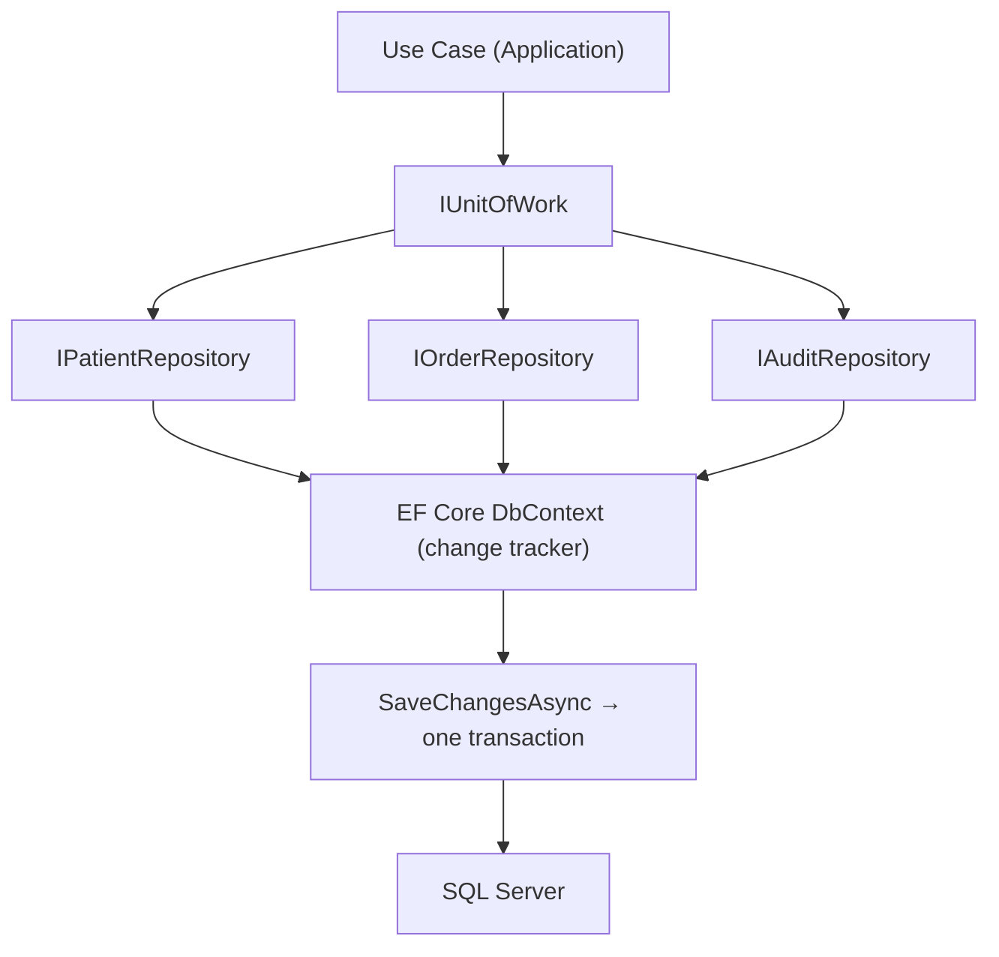

# Chapter 28: Unit of Work

> **Audience:** Experienced .NET developers (5+ years) preparing for an L2 (Mid/Senior) interview at a Healthcare company.
> **Scope:** The Unit of Work pattern — why it exists, `DbContext` as the built-in UoW, multi-repository transactions, explicit `BeginTransactionAsync`, scoped lifetimes, and when the pattern helps vs when it's ceremony — the healthcare angle being atomic, consistent clinical writes (audit + order + encounter committed together).

---

## 28.1 What Is a Unit of Work and Why Does It Matter

### Interview Answer (30–45 seconds)

> "The Unit of Work pattern groups multiple operations into a single transaction so they either all succeed or all fail together. In EF Core, the `DbContext` already is a Unit of Work: its change tracker records every entity state, and `SaveChangesAsync` commits all pending changes in one transaction. The classic implementation adds an `IUnitOfWork` that exposes repositories plus a single `SaveChangesAsync`. The value shows up in multi-repository workflows — say, marking an encounter discharged, creating a follow-up order, and writing an audit entry. If the audit insert fails, nothing is committed, so the encounter is never half-updated. I'd keep the transaction boundary in the use case, commit once at the end, and note that EF Core gives you this for free."

### Detailed Explanation

**What it is:**

- Tracks changes across multiple repositories so they flush atomically.
- `SaveChangesAsync` = one transaction covering all tracked changes.
- In EF Core, the `DbContext` *is* the UoW: one change tracker, one transaction per save.

**EF Core relationship:**

| Unit of Work concept | EF Core equivalent |
|---|---|
| Change tracking | `DbContext` change tracker |
| Commit | `SaveChangesAsync` (one implicit transaction) |
| Explicit multi-save transactions | `db.Database.BeginTransactionAsync()` |

**Why it matters for atomicity:**

- Without a UoW, calling `SaveChangesAsync` after every operation means each write commits separately — a failure midway leaves partial data.
- A clinical example: discharge workflow touches encounter, order, and audit. Partial commits = a discharged patient with no audit trail, which is a compliance problem.

**Transaction boundaries:**

- The UoW commit belongs in the use case (Application layer), not inside repository methods.
- Explicit multi-save transactions (`BeginTransactionAsync`) are for flows that must `SaveChangesAsync` more than once — e.g., interleaving reads/writes with domain events (Ch. 29).

**Scoped lifetime:**

- One `DbContext` per request (scoped) = one UoW per request = one change tracker.
- Registering `DbContext` as scoped (the default) guarantees all repositories in a request share the same tracker.

**Async:** `SaveChangesAsync` should always be awaited; blocking with `.Result` starves the thread pool.

### Real World Example (Healthcare)

A discharge workflow updates the encounter status, creates a follow-up order, and records an audit entry — three writes across two repositories. With a Unit of Work, `SaveChangesAsync` commits them in one transaction: if the audit insert fails, nothing is committed and the encounter isn't half-updated. The UoW also makes the workflow unit-testable — swap in fake repositories and verify a single `SaveChangesAsync` was called.

### Production Code Example

```csharp
// Abstraction (Application layer)
public interface IUnitOfWork
{
    IPatientRepository Patients { get; }
    IOrderRepository Orders { get; }
    IAuditRepository AuditLog { get; }
    Task<int> SaveChangesAsync(CancellationToken ct = default);
}
```

```csharp
// Implementation (Infrastructure) — wraps the scoped DbContext
public sealed class UnitOfWork : IUnitOfWork
{
    private readonly ClinicalDbContext _db;

    public UnitOfWork(ClinicalDbContext db,
        IPatientRepository patients,
        IOrderRepository orders,
        IAuditRepository auditLog)
    {
        _db = db;
        Patients = patients;
        Orders = orders;
        AuditLog = auditLog;
    }

    public IPatientRepository Patients { get; }
    public IOrderRepository Orders { get; }
    public IAuditRepository AuditLog { get; }

    public Task<int> SaveChangesAsync(CancellationToken ct = default)
        => _db.SaveChangesAsync(ct);
}
```

```csharp
// Usage — one transaction across repositories
public async Task DischargeAsync(Guid encounterId, CancellationToken ct)
{
    var encounter = await _uow.Orders.GetEncounterAsync(encounterId, ct);
    encounter.MarkDischarged();
    _uow.Orders.Update(encounter);

    var order = new FollowUpOrder(encounter.PatientId, DateTime.UtcNow.AddDays(14));
    _uow.Orders.Add(order);

    _uow.AuditLog.Add(new AuditEntry(encounter.PatientId, "DISCHARGE", DateTime.UtcNow));

    await _uow.SaveChangesAsync(ct);   // one transaction for all three writes
}
```

**Key lines explained:**

- UoW aggregates repositories and exposes a single commit point.
- `SaveChangesAsync` wraps all pending changes in one DB transaction.
- Repositories only queue changes into the change tracker; the UoW commits.

### Internal Working

- EF's change tracker records entity states (Added/Modified/Deleted) as operations run.
- On `SaveChangesAsync`, EF starts an implicit transaction (if multiple statements), applies changes, and commits atomically.
- One `DbContext` instance per scope (scoped lifetime) = one UoW per request.
- For explicit multi-save flows, `BeginTransactionAsync` returns a `IDbContextTransaction` you commit/rollback manually.

### Advantages

- Atomic, all-or-nothing writes across repositories — no partial clinical data.
- Single commit point = clear transaction boundary at the use-case level.
- Centralizes the "when do we persist?" decision.
- Makes multi-repository workflows unit-testable with fakes.

### Disadvantages

- EF Core already IS a UoW — `IUnitOfWork` adds ceremony without new capability.
- A UoW that saves per repository method defeats its own purpose.
- Long-lived UoW (per request by default) can hold change-tracked entities in memory.
- Can obscure explicit transaction needs when a workflow must `SaveChangesAsync` mid-flight (e.g., domain events).

### Best Practices

- Let EF be the UoW; add `IUnitOfWork` only when the Application must depend on your interfaces, not EF.
- Commit once, at the end of the use case — never inside repository methods.
- Ensure one scoped `DbContext` per request so all repositories share a tracker.
- Use `BeginTransactionAsync` only when you must `SaveChangesAsync` multiple times in one flow.
- Register repositories + UoW as scoped to match the `DbContext` lifetime.

### Common Mistakes

- `SaveChangesAsync` called in every repository method → each call is its own transaction (no atomicity across repos).
- Registering `DbContext` as transient or singleton → multiple trackers, no shared UoW, concurrency bugs.
- Blocking calls (`SaveChanges()`, `.Result`) → thread-pool starvation.
- Committing before domain validation completes → invalid data persisted.
- Adding `IUnitOfWork` ceremony where `DbContext` alone suffices.

### Interview Follow-up Questions

1. **"Why do you need a UoW if `DbContext` is one?"** — Often you don't; you might add it to keep Application dependent on your interfaces rather than EF, or to expose a stable boundary.
2. **"How do transactions work across multiple `SaveChangesAsync` calls?"** — Each call commits separately; use `db.Database.BeginTransactionAsync()` for explicit multi-save transactions.
3. **"What happens if `SaveChangesAsync` fails partway?"** — EF rolls back the implicit transaction; no partial changes are persisted.
4. **"Why scoped lifetime?"** — A scoped `DbContext` ensures one instance per request = one change tracker = one UoW.
5. **"What does `AddRange`/`UpdateRange` do?"** — Batch-queues multiple entities into the change tracker before a single save.
6. **"Where does the transaction boundary belong?"** — In the use case (Application layer): make all changes, then one `SaveChangesAsync`.
7. **"How do you unit test a UoW?"** — Fake repositories implement the interfaces; test the workflow logic, not EF. Verify `SaveChangesAsync` was called exactly once.
8. **"What's the difference between implicit and explicit transactions?"** — Implicit wraps one `SaveChangesAsync`; explicit lets you span multiple saves and include reads under one lock.
9. **"How do domain events affect the UoW?"** — Outbox/event dispatch often requires a `SaveChangesAsync` before dispatch — an explicit transaction spans both (Ch. 29, Ch. 30).
10. **"How do you handle concurrency with a UoW?"** — Rowversion/`IsConcurrencyToken`; retry on `DbUpdateConcurrencyException` (Ch. 37).

### Senior Level Talking Points

- **Transactional integrity in healthcare:** one UoW per clinical workflow; avoid partial writes for audit + order + encounter.
- **Transactional boundaries and domain events:** explicit transactions when events must be published atomically with data changes (outbox pattern).
- **Performance discipline:** keep the tracked graph small — no-tracking reads, commit once, avoid long-lived change trackers.
- **Distributed transactions:** cross-service atomicity is a lie — use sagas/outbox, not distributed transactions (Ch. 30).
- **Alternatives:** `IQueryable`-based abstractions, specifications, or CQRS command handlers (Ch. 29) that use `DbContext` directly.

### Diagram



### Comparison Table

| Aspect | Implicit Save | Explicit Transaction | No UoW |
|---|---|---|---|
| Scope | One `SaveChangesAsync` | Multiple saves/reads | Per-write |
| Atomicity | Yes (all tracked changes) | Yes (spanning saves) | No — partial possible |
| Use case | Standard workflow | Domain events, batch | Anti-pattern |
| Pitfall | Save per method | Forgot commit/rollback | Half-updated clinical data |

### Memory Trick

**"UoW batches the write."** One workflow, one change tracker, one `SaveChangesAsync` at the end — everything commits together or nothing does. In EF Core, `DbContext` already is your UoW.

### Summary

The Unit of Work pattern makes multiple writes atomic, and in EF Core the `DbContext` already provides it through its change tracker and `SaveChangesAsync`. The pattern is justified by a real need — atomic clinical workflows, a persistence-agnostic core, testability — not ceremony. For healthcare interviews, emphasize atomic clinical writes (audit + order + encounter committed together), the single commit point at the use-case level, and knowing when explicit transactions are required.

### Interview Confidence Score

**Confidence: High (after this chapter).** Unit of Work is a classic L2 question. Knowing that EF Core's `DbContext` already IS the UoW, where the transaction boundary belongs, and when to reach for explicit transactions will impress more than wrapping it blindly.

---

## Top 10 Interview Questions for This Chapter

1. What is the Unit of Work pattern?
2. How does EF Core implement a Unit of Work?
3. Why must multi-repository writes be atomic in healthcare?
4. Where does the transaction boundary belong?
5. Tracking vs no-tracking — how do you choose?
6. Why should `SaveChangesAsync` be async?
7. How do you unit test workflows that use a UoW?
8. When do you need `BeginTransactionAsync`?
9. Why does scoped lifetime matter for a UoW?
10. How do domain events interact with the UoW?

## Revision Notes

- UoW: groups multiple writes into one transaction; commit once.
- EF Core: `DbContext` = change tracker (UoW) + `DbSet<T>` (repository).
- One scoped `DbContext` per request = one UoW per request.
- `SaveChangesAsync` per method = separate transactions (breaks UoW semantics).
- `AsNoTracking()` for reads; tracking for updates.
- Explicit transactions (`BeginTransactionAsync`) for multi-save flows (domain events).
- Justify the pattern: persistence-agnostic core, testability, atomic workflows.
- Never let partial clinical data persist — commit all or nothing.

## Things Interviewers Expect from 5+ Years Experience

- You understand EF Core's built-in UoW and don't re-implement it blindly.
- You manage transactions at the use-case level, not per repository method.
- You apply tracking/no-tracking consciously for performance.
- You know when explicit transactions are required (domain events, batch).
- You can defend when the pattern is worth it and when it isn't.

## Cheat Sheet

```csharp
// Abstraction
public interface IUnitOfWork
{
    IPatientRepository Patients { get; }
    IOrderRepository Orders { get; }
    IAuditRepository AuditLog { get; }
    Task<int> SaveChangesAsync(CancellationToken ct = default);
}

// Implementation wraps the scoped DbContext
// SaveChangesAsync => _db.SaveChangesAsync(ct)

// Usage: mutate, then commit once
encounter.MarkDischarged();
_uow.Orders.Update(encounter);
_uow.Orders.Add(new FollowUpOrder(patientId, DateTime.UtcNow.AddDays(14)));
_uow.AuditLog.Add(new AuditEntry(patientId, "DISCHARGE", DateTime.UtcNow));
await _uow.SaveChangesAsync(ct);   // one transaction for all writes

// Explicit multi-save transaction
await using var tx = await db.Database.BeginTransactionAsync(ct);
// ... do work, maybe SaveChangesAsync ...
await tx.CommitAsync(ct);
```

## Flash Cards

**Q:** What is a Unit of Work? **A:** Groups multiple operations into one atomic transaction.

**Q:** What is EF Core's built-in UoW? **A:** The `DbContext` change tracker + `SaveChangesAsync`.

**Q:** Why not call `SaveChangesAsync` in every repository method? **A:** Each call commits separately — you lose atomicity across repositories.

**Q:** Tracking vs no-tracking for reads? **A:** Prefer `AsNoTracking()` for reads; use tracking when EF must detect updates.

**Q:** When do you need `BeginTransactionAsync`? **A:** When a flow must `SaveChangesAsync` more than once, e.g. domain events (outbox).

**Q:** What if `SaveChangesAsync` fails partway? **A:** EF rolls back the implicit transaction — nothing is partially persisted.

---

*Continue → Chapter 29: MediatR / CQRS*
