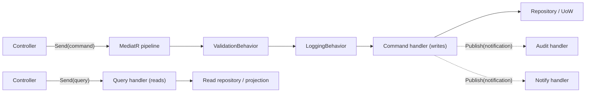

# Chapter 29: MediatR / CQRS

> **Audience:** Experienced .NET developers (5+ years) preparing for an L2 (Mid/Senior) interview at a Healthcare company.
> **Scope:** CQRS (Command Query Responsibility Segregation) principles, MediatR as the in-process mediator (requests, handlers, pipelines, notifications), separating commands from queries, when CQRS is worth it (separate read/write models, scaling reads), pipeline behaviors (validation, logging, transactions), and healthcare examples — clinical write commands vs read projections.

---

## 29.1 What Is CQRS and How Does MediatR Implement It

### Interview Answer (30–45 seconds)

> "CQRS splits the write model from the read model: commands change state, queries read state, and they're modeled separately instead of one bloated service doing both. MediatR is an in-process mediator library that implements this pattern for .NET — you send a request object, and MediatR routes it to the registered handler, so controllers stay thin and each operation is a small, focused class. It also supports pipeline behaviors, which let you wrap every request with cross-cutting concerns like validation, logging, or a transaction. In a healthcare app I'd use commands like `CreateMedicationOrderCommand` and queries like `GetPatientSummaryQuery`, with separate handlers, and often a different read model optimized for queries."

### Detailed Explanation

**CQRS core idea:**

- **Command** — an intent to change state (imperative, void-ish: returns success/result). Naming: `CreateX`, `CancelX`, `UpdateX`.
- **Query** — a read with no side effects (returns data). Naming: `GetX`, `FindX`.
- Commands and queries are distinct types; handlers are separate.
- Benefit: each handler is single-responsibility; you can optimize reads/writes differently.
- Full CQRS uses separate read stores (projections); "command/query separation" in one store is the lightweight version.

**MediatR mechanics:**

- `ISender.Send(IRequest<TResponse>)` → routes to a single `IRequestHandler<TRequest, TResponse>`.
- `IPublisher.Publish(INotification)` → routes to multiple `INotificationHandler<TNotification>` (events).
- `IPipelineBehavior<TRequest, TResponse>` wraps the request pipeline (like middleware for handlers).
- Handlers are registered automatically via `AddMediatR(cfg => cfg.RegisterServicesFromAssembly(...))`.

**Why teams adopt it:**

- Thin controllers; business operations as testable classes.
- Cross-cutting concerns via pipeline behaviors instead of duplicated code.
- Clean fit with Clean Architecture (Ch. 26): handlers live in Application.
- Ready-to-grow: notifications/events, outbox, retries slot into the pipeline.

**When NOT to use it:**

- Simple CRUD with no cross-cutting needs or split read/write models — MediatR adds indirection.

### Real World Example (Healthcare)

A controller for medication orders sends `CreateMedicationOrderCommand`. A validation behavior checks the dose range before the handler runs; the handler applies business rules (contraindications), saves via a repository, and publishes a `MedicationOrderPlaced` notification that the notification service and audit service handle. Meanwhile a separate `GetActiveOrdersQuery` handler runs an optimized read (projection with `AsNoTracking`). Reads and writes evolve independently.

### Production Code Example

```csharp
// Command + handler
public sealed record CreateMedicationOrderCommand(
    string PatientId, string DrugCode, decimal DoseMg) : IRequest<Guid>;

public sealed class CreateMedicationOrderHandler : IRequestHandler<CreateMedicationOrderCommand, Guid>
{
    private readonly IMedicationOrderRepository _repo;

    public CreateMedicationOrderHandler(IMedicationOrderRepository repo) => _repo = repo;

    public async Task<Guid> Handle(CreateMedicationOrderCommand request, CancellationToken ct)
    {
        var order = MedicationOrder.Create(request.PatientId, request.DrugCode, request.DoseMg);
        _repo.Add(order);
        await _repo.SaveChangesAsync(ct);
        return order.Id;
    }
}
```

```csharp
// Query + handler (separate read model)
public sealed record GetPatientSummaryQuery(string PatientId) : IRequest<PatientSummaryDto>;

public sealed class GetPatientSummaryHandler : IRequestHandler<GetPatientSummaryQuery, PatientSummaryDto>
{
    private readonly IPatientReadRepository _reads;

    public GetPatientSummaryHandler(IPatientReadRepository reads) => _reads = reads;

    public Task<PatientSummaryDto> Handle(GetPatientSummaryQuery request, CancellationToken ct)
        => _reads.GetSummaryAsync(request.PatientId, ct);
}
```

```csharp
// Pipeline behavior — validation for every command
public sealed class ValidationBehavior<TRequest, TResponse>
    : IPipelineBehavior<TRequest, TResponse> where TRequest : IRequest<TResponse>
{
    private readonly IEnumerable<IValidator<TRequest>> _validators;

    public ValidationBehavior(IEnumerable<IValidator<TRequest>> validators) => _validators = validators;

    public async Task<TResponse> Handle(TRequest request,
        RequestHandlerDelegate<TResponse> next, CancellationToken ct)
    {
        var failures = (await Task.WhenAll(
                _validators.Select(v => v.ValidateAsync(request, ct))))
            .SelectMany(r => r.Errors).Where(e => e != null).ToList();

        if (failures.Count > 0)
            throw new ValidationException(failures);

        return await next();
    }
}
```

```csharp
// Program.cs
builder.Services.AddMediatR(cfg => cfg.RegisterServicesFromAssembly(typeof(CreateMedicationOrderHandler).Assembly));
builder.Services.AddTransient(typeof(IPipelineBehavior<,>), typeof(ValidationBehavior<,>));

// Controller
[HttpPost]
public async Task<IActionResult> CreateOrder(CreateMedicationOrderCommand cmd)
    => Ok(await _sender.Send(cmd));
```

**Key lines explained:**

- Command/query are `IRequest<T>` records; one handler per request.
- `ValidationBehavior<TRequest,TResponse>` wraps every request (FluentValidation).
- `_sender.Send(cmd)` keeps the controller a thin dispatch layer.
- Read handler uses a dedicated read repository/projection.

### Internal Working

- `Send` looks up the handler registered for the request type and invokes it through the pipeline of behaviors (outermost first).
- Behaviors form a chain; the last delegate is the actual handler.
- `Publish` fans out to all registered notification handlers (no return value).
- Handlers and behaviors are resolved from the container (scoped/transient per your registration).

### Advantages

- Thin controllers; each operation is a small, named, testable class.
- Cross-cutting concerns live once in pipeline behaviors (validation, logging, transactions, retries).
- Read/write separation → independent optimization (projections for reads).
- Notifications/events decouple side effects (audit, email) from the main operation.
- Natural fit with Clean Architecture (Ch. 26) and vertical slicing.

### Disadvantages

- Indirection: tracing a request to its handler requires tooling.
- Magic dispatch hides the call graph (some find it harder to debug than direct calls).
- Overhead and ceremony for simple CRUD.
- Notifications run in-process — not a replacement for a broker (Ch. 21–22).
- Separate read/write models can drift without discipline (unless using events to build projections).

### Best Practices

- Use commands for writes and queries for reads; name them clearly.
- Keep handlers single-purpose and in the Application layer.
- Use pipeline behaviors for validation, logging, and transaction boundaries — not business logic.
- Use `Publish` for side effects (notifications); prefer a broker/outbox for reliability across services.
- Register via assembly scanning; keep `Program.cs` clean.
- Return explicit `Result` types from commands rather than throwing for expected failures.
- For full CQRS, build read projections from domain events (event-driven) to avoid drift.

### Common Mistakes

- Putting business logic in controllers instead of handlers.
- Using queries for writes (side effects in a query handler).
- Re-implementing validation per handler instead of one behavior.
- Long/transactional work inside a notification handler blocking the response.
- Using MediatR for trivial CRUD → indirection with no payoff.
- Treating `Publish` as reliable messaging (it's in-process fire-and-forget).
- Naming collisions: commands and queries with the same response shape confuse intent.

### Interview Follow-up Questions

1. **"CQRS vs MediatR?"** — CQRS is an architectural principle; MediatR is a library that implements in-process dispatch (commands/queries/notifications).
2. **"Command vs query?"** — Command mutates state (imperative); query reads (no side effects). Different types, different handlers.
3. **"What is a pipeline behavior?"** — Middleware wrapping handlers: validation, logging, transactions, retries.
4. **"MediatR `Send` vs `Publish`?"** — `Send` → one handler; `Publish` → many notification handlers.
5. **"When is full CQRS (separate stores) worth it?"** — High read/write asymmetry, scaling reads independently, complex queries vs writes.
6. **"How do you keep read and write models consistent?"** — Domain events → projections (event-driven) or the outbox for reliability.
7. **"Can you call MediatR from a background service?"** — Yes, inject `ISender`/`IPublisher`.
8. **"How do you test a handler?"** — Unit test the handler with fakes; test behaviors separately; integration-test the pipeline.
9. **"What's the downside of in-process notifications?"** — They die with the process and can duplicate — durable side effects belong in a broker.
10. **"Where do handlers live?"** — Application layer (Clean Architecture), one file per operation.

### Senior Level Talking Points

- **CQRS + event-driven read models:** domain events (MediatR `Publish`) feed projections in the read store; the outbox guarantees delivery.
- **Pipeline as the reliability layer:** add transaction behavior, retry behavior, and idempotency keys centrally.
- **Vertical slicing:** group each command/query with its handler, validator, and tests — a feature folder.
- **Performance:** queries use projections/`AsNoTracking`; commands write with tracked entities in one UoW.
- **Observability:** log request types in a behavior; correlate with a trace ID.
- **Judgment:** lightweight command/query separation for most apps; full CQRS only under real asymmetry.

### Diagram



### Comparison Table

| Aspect | Plain service | MediatR + CQRS |
|---|---|---|
| Controller | Fat (calls service methods) | Thin (sends requests) |
| Operation structure | Methods on services | One class per operation |
| Cross-cutting | Duplicated | Pipeline behaviors |
| Read/write models | Shared | Separated |
| Side effects | Inline | Notifications |
| Debuggability | Direct | Dispatch (tooling needed) |

### Memory Trick

**"Commands change, queries read, behaviors cross-cut."** One handler per intent; `Send` for one, `Publish` for many. If CRUD is simple, skip the mediator.

### Summary

CQRS separates commands (writes) from queries (reads); MediatR implements in-process dispatch with handlers, notifications, and pipeline behaviors. Master command/query naming, pipeline behaviors for validation/logging/transactions, and the judgment for when the pattern adds value. For healthcare interviews, emphasize testable operations, event-driven read projections, and not mistaking MediatR notifications for durable messaging.

### Interview Confidence Score

**Confidence: High (after this chapter).** MediatR/CQRS is a very common L2 topic. If you can explain pipeline behaviors, when full CQRS pays off, and the distinction from durable messaging, you'll handle the deepest variations.

---

## Top 10 Interview Questions for This Chapter

1. What is CQRS and what problem does it solve?
2. How does MediatR work under the hood?
3. Command vs query — what's the difference and how are they named?
4. What is a pipeline behavior and what do you use it for?
5. `Send` vs `Publish` in MediatR?
6. When do you need full CQRS with separate read/write stores?
7. How do you keep read projections in sync with writes?
8. Where should MediatR handlers live in Clean Architecture?
9. How do you test handlers and behaviors?
10. When should you NOT use MediatR?

## Revision Notes

- CQRS: separate write (commands) and read (queries) models.
- MediatR: in-process dispatcher — `IRequest`/`IRequestHandler`, `INotification`/`INotificationHandler`, `IPipelineBehavior`.
- `Send` → one handler; `Publish` → many notification handlers.
- Pipeline behaviors = middleware for validation, logging, transactions, retries.
- Controllers stay thin; handlers live in Application (Ch. 26).
- Full CQRS = separate read store built from domain events; lightweight = single store with separated handlers.
- Notifications are in-process — durable side effects belong in a broker (Ch. 21–22).
- Overkill for simple CRUD without cross-cutting needs.

## Things Interviewers Expect from 5+ Years Experience

- You distinguish the architectural principle (CQRS) from the library (MediatR).
- You use pipeline behaviors for cross-cutting concerns, not business logic.
- You design read models/events for consistency, not just separate folders.
- You know in-process notifications aren't reliable messaging.
- You apply the pattern with judgment (skip for trivial CRUD).

## Cheat Sheet

```csharp
// Register
builder.Services.AddMediatR(cfg =>
    cfg.RegisterServicesFromAssembly(typeof(CreateOrderHandler).Assembly));

// Command
public sealed record CreateOrderCommand(...) : IRequest<Guid>;
public sealed class CreateOrderHandler : IRequestHandler<CreateOrderCommand, Guid> { ... }

// Query
public sealed record GetOrderQuery(Guid Id) : IRequest<OrderDto>;
public sealed class GetOrderHandler : IRequestHandler<GetOrderQuery, OrderDto> { ... }

// Notification
public sealed record OrderCreated(Guid Id) : INotification;
public sealed class AuditHandler : INotificationHandler<OrderCreated> { ... }

// Behavior
public sealed class ValidationBehavior<TReq, TRes> : IPipelineBehavior<TReq, TRes> { ... }

// Use
await _sender.Send(new CreateOrderCommand(...));        // one handler
await _publisher.Publish(new OrderCreated(id));          // many handlers
```

## Flash Cards

**Q:** `Send` vs `Publish`? **A:** Send → one handler; Publish → all notification handlers.

**Q:** What do pipeline behaviors do? **A:** Wrap every request: validation, logging, transaction, retries.

**Q:** Where do handlers live? **A:** Application layer, one class per operation.

**Q:** Why not use MediatR notifications for cross-service messaging? **A:** They're in-process and non-durable — use a broker (Ch. 21–22).

**Q:** When is full CQRS justified? **A:** Asymmetric read/write loads, complex queries, need to scale reads independently.

**Q:** How do you keep read models fresh? **A:** Domain events feed projections (with an outbox for reliability).

---

*Continue → Chapter 30: Microservices*
