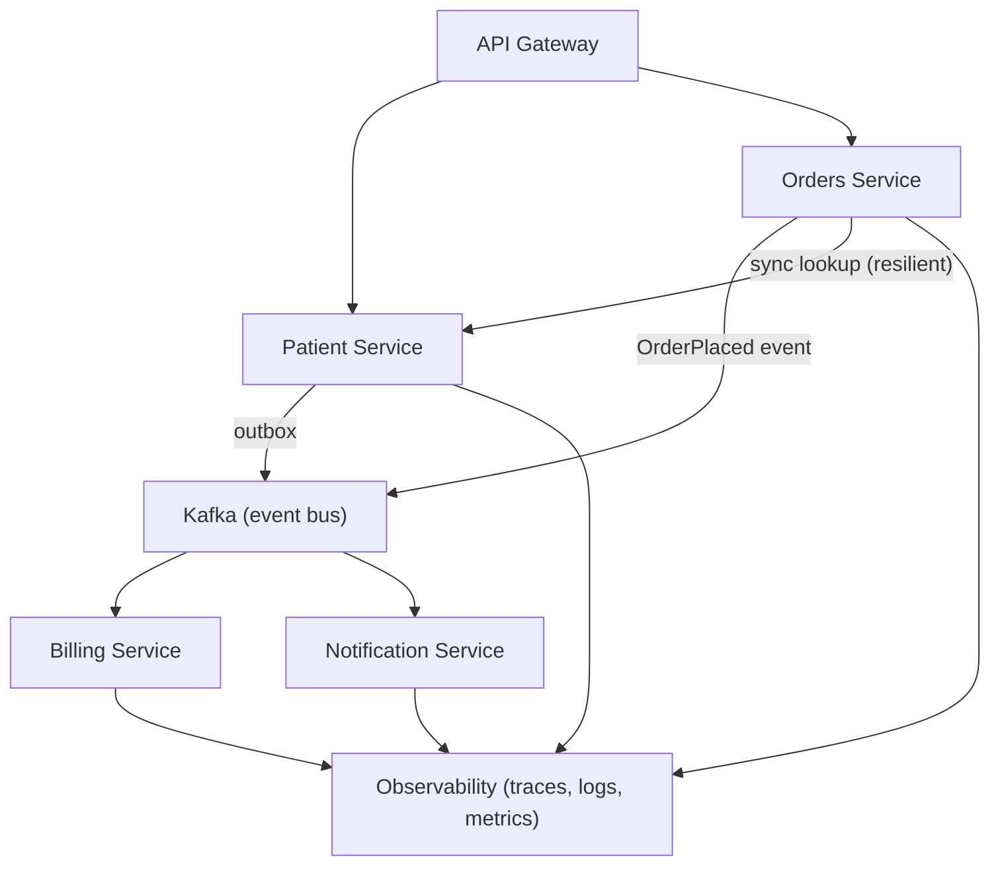

# Chapter 29: Microservices

> **Audience:** Experienced .NET developers (5+ years) preparing for an L2 (Mid/Senior) interview at a Healthcare company.
> **Scope:** Microservices fundamentals (bounded contexts, independent deployability, decentralized data), how to decompose a domain, service-to-service communication (sync vs async, Ch. 21–24), data consistency (sagas, outbox, Ch. 28), resilience patterns (circuit breaker, retries, Ch. 36), service discovery, API gateway, observability, monolith vs microservices trade-offs, and healthcare considerations (PHI boundaries, compliance).

---

## 29.1 What Are Microservices and When Do You Need Them

### Interview Answer (30–45 seconds)

> "Microservices is an architectural style where an application is composed of small, independently deployable services, each owning a business capability and its own data — a bounded context from Domain-Driven Design. Services communicate over the network via APIs or messaging, scale independently, and can be built with different stacks. The defining traits are independent deployability, decentralized data ownership, and failure isolation. But they're not free: you trade in-process complexity for distributed complexity — network calls, eventual consistency, observability, and DevOps overhead. For a healthcare platform, I'd decompose around clinical boundaries like orders, patients, billing, and notifications — but I'd start as a well-structured monolith and split only when a boundary is proven."

### Detailed Explanation

**Core principles:**

- **Bounded contexts** — each service models one domain slice with its own ubiquitous language.
- **Independent deployability** — a team can ship its service without coordinating with others.
- **Decentralized data** — each service owns its database (no shared schema).
- **Failure isolation** — a crash in one service doesn't take down the whole system.
- **Team alignment** — services map to small, autonomous teams (Conway's Law).

**Service communication:**

- **Synchronous:** REST/JSON or gRPC (Ch. 24) for request-response.
- **Asynchronous:** events/messages via RabbitMQ/Kafka (Ch. 21–22) for decoupling.
- Best practice: async for cross-service side effects; sync for direct queries when necessary.

**Consistency:**

- Distributed transactions (2PC) are avoided.
- **Sagas** — sequences of local transactions with compensation.
- **Outbox pattern** (Ch. 21) — atomic event publication.
- **Eventual consistency** accepted; read models catch up.

**Supporting infrastructure:**

- Service discovery / DNS-based load balancing.
- API gateway (edge: auth, routing, rate limiting).
- Config server / secrets management.
- Distributed tracing (OpenTelemetry), centralized logs, metrics.
- Container orchestration (Ch. 19), CI/CD per service.

**Monolith-first strategy:**

- Modular monolith: clear internal boundaries, one deployable.
- Split services when scaling, team autonomy, or deployment cadence demands it.
- Avoid "distributed monolith": many services sharing a DB, coordinated deploys, chatty sync calls.

### Real World Example (Healthcare)

A hospital platform has services: Patient Service (demographics, PHI), Orders Service (medication/lab orders), Billing Service, Notification Service. Orders publishes `OrderCreated` to Kafka; Billing and Notification consume independently. Each owns its own database. When Orders spikes during shift change, only Orders scales; Patient Service is untouched. A saga coordinates order placement → lab scheduling → result posting, compensating (cancelling) if scheduling fails. PHI isolation means Patient data never crosses other services' stores without explicit contracts.

### Production Code Example

```csharp
// Async integration — Orders publishes an event
public sealed class OrderPlacedHandler : INotificationHandler<OrderPlaced>
{
    private readonly IPublisher _outbox;

    public OrderPlacedHandler(IPublisher outbox) => _outbox = outbox;

    public async Task Handle(OrderPlaced notification, CancellationToken ct)
    {
        await _outbox.PublishAsync(new OrderPlacedIntegrationEvent(
            OrderId: notification.OrderId,
            PatientId: notification.PatientId,
            DrugCode: notification.DrugCode,
            PlacedAt: notification.PlacedAt), ct);
    }
}
```

```csharp
// Synchronous fallback — resilience wrapper (see also Ch. 36)
public sealed class PatientLookupClient
{
    private readonly HttpClient _http;
    private readonly AsyncCircuitBreakerPolicy _breaker;

    public async Task<PatientDto?> GetPatientAsync(string patientId, CancellationToken ct)
    {
        // Circuit breaker + retry with backoff (Polly)
        return await _breaker.ExecuteAsync(async token =>
        {
            var resp = await _http.GetAsync($"patients/{patientId}", token);
            resp.EnsureSuccessStatusCode();
            return await resp.Content.ReadFromJsonAsync<PatientDto>(ct);
        }, ct);
    }
}
```

```csharp
// Typical per-service bootstrap
builder.Services.AddOpenTelemetry()
    .WithTracing(t => t.AddAspNetCoreInstrumentation()
                       .AddHttpClientInstrumentation()
                       .AddOtlpExporter());

builder.Services.AddHealthChecks()   // Ch. 34
    .AddDbContextCheck<OrdersDbContext>();
```

**Key lines explained:**

- Cross-service side effects go through an outbox + broker (reliable, decoupled).
- Synchronous calls are wrapped with retry/circuit-breaker resilience (Ch. 36).
- Every service exposes health checks and OpenTelemetry traces for observability.

### Internal Working

- Each service is a separate process (container, Ch. 18) with its own DB.
- Service discovery resolves addresses; calls flow over HTTP/gRPC or through a broker.
- The outbox worker relays DB-persisted events to the broker (Ch. 21).
- Consumer groups (Ch. 22) ensure exactly one handler per partition for ordered work.
- Tracing correlates spans across services via propagated trace IDs.

### Advantages

- Independent deployability and scaling (team velocity).
- Fault isolation: a buggy service fails alone (with resilience).
- Technology freedom per service.
- Clear ownership — small codebases, focused teams.
- Scalability at the service level (scale only what's hot).

### Disadvantages

- Distributed systems complexity: network, latency, partial failure.
- Eventual consistency — designing for it is hard.
- Operations overhead: CI/CD, orchestration (Ch. 19), observability.
- Data fragmentation — cross-service joins need APIs or event projections.
- Testing and debugging are harder (tracing, contract tests needed).
- Can become a distributed monolith if boundaries are wrong.

### Best Practices

- Start as a modular monolith; split proven boundaries (never "divide and conquer" speculatively).
- One database per service; no shared tables (a smell of a distributed monolith).
- Prefer async events for cross-service workflows; keep sync calls bounded with resilience.
- Use sagas for multi-service transactions; use the outbox for reliable event publishing.
- Standardize observability: OpenTelemetry traces, structured logs, metrics, health checks.
- Contract-first: OpenAPI/gRPC `.proto` with consumer-driven contract tests.
- Deploy each service independently with feature flags and canary/rolling strategies.
- Put PHI boundaries first: explicit contracts, least-privilege access, per-service security.

### Common Mistakes

- Shared database across services → tight coupling, no independent deploys.
- Chatty synchronous call chains → latency and cascade failures.
- Distributed monolith: deploy everything together, one big release train.
- No saga/outbox → manual compensation and lost events.
- Ignoring eventual consistency → UI shows stale/corrupted state without reconciliation.
- No circuit breakers → one slow service takes down the call chain.
- Skipping tracing/centralized logs → impossible to debug cross-service issues.
- Splitting prematurely → microservice complexity without the benefits.

### Interview Follow-up Questions

1. **"How do you decide service boundaries?"** — Bounded contexts; team ownership; change rate and scaling profiles; data ownership. Split when a context is clear and stable.
2. **"Monolith vs microservices?"** — Monolith: simplicity, atomic deploys; Microservices: independence, scale, team velocity — at high ops cost. Start modular monolith.
3. **"How do services communicate?"** — Sync (REST/gRPC) for queries; async events (Kafka/RabbitMQ) for side effects and workflows.
4. **"How do you handle transactions across services?"** — Sagas with compensation, or outbox + eventual consistency; avoid 2PC.
5. **"What is a distributed monolith?"** — Many services sharing a DB/co-deployed with sync chattiness — the worst of both worlds.
6. **"How do you ensure consistency without transactions?"** — Outbox for publishing; idempotent consumers; read-model projections; reconciliation jobs.
7. **"What is service discovery?"** — How services find each other (DNS, registry); Kubernetes Service (Ch. 19) handles it.
8. **"Why an API gateway?"** — Edge concerns: auth, routing, rate limiting, aggregation; keeps clients decoupled from service topology.
9. **"How do you test microservices?"** — Unit + contract tests per service; integration tests with testcontainers; end-to-end for critical paths.
10. **"When would you stay monolithic?"** — Small team, tight budget, low scaling needs — the monolith is the pragmatic choice.

### Senior Level Talking Points

- **Domain-Driven Design:** bounded contexts and context mapping are the honest way to find boundaries.
- **Data ownership & PHI:** explicit data contracts, per-service stores, and audit boundaries for regulated healthcare data.
- **Reliability engineering:** circuit breakers, bulkheads, retries with jitter, and chaos testing.
- **Event-driven backbone:** Kafka as the integration layer, outbox for atomicity, sagas for workflows (Ch. 21, 22, 28).
- **Observability as a product:** trace IDs everywhere, SLOs, structured logs.
- **Migration path:** strangler-fig pattern, feature flags, contract-first API, incremental split.

### Diagram



### Comparison Table

| Aspect | Modular Monolith | Microservices |
|---|---|---|
| Deployability | One deployable | Per service |
| Data | Shared DB (internal modules) | One DB per service |
| Communication | In-process calls | Network (REST/gRPC/events) |
| Failure isolation | Process-level only | Service-level |
| Consistency | ACID within process | Eventual, sagas |
| Ops overhead | Low | High |
| Team scaling | Limited by codebase | Independent teams |
| Best for | Most apps, healthcare small/medium | Large platforms, hard scaling/velocity needs |

### Memory Trick

**"Bounded context, own data, deploy alone."** Split by domain, not by layers. Events for workflows, sagas for consistency, tracing for sanity — and a modular monolith until a boundary is proven.

### Summary

Microservices are independently deployable services owning their bounded contexts and data. Know how to find boundaries, sync vs async communication, sagas/outbox for consistency, resilience patterns, observability, and the monolith-first judgment call. For healthcare interviews, emphasize PHI data boundaries, event-driven integration, and avoiding the distributed monolith.

### Interview Confidence Score

**Confidence: High (after this chapter).** Microservices is a flagship L2 topic. Conveying when NOT to use them and how to split incrementally — not just buzzwords — is what interviewers at senior level reward.

---

## Top 10 Interview Questions for This Chapter

1. What are microservices and what are their defining characteristics?
2. How do you decompose a domain into services?
3. Monolith vs microservices — how do you choose?
4. How do services communicate (sync vs async)?
5. How do you handle transactions across services?
6. What is a distributed monolith and how do you avoid it?
7. What is the outbox pattern and why is it important?
8. What is a saga and how does compensation work?
9. Why do you need an API gateway and service discovery?
10. How do you ensure observability across services?

## Revision Notes

- Microservices: independent deployability, bounded contexts, decentralized data, failure isolation.
- Boundaries come from bounded contexts + ownership, not layers.
- Sync (REST/gRPC) for queries; async events (Kafka/RabbitMQ) for workflows/side effects.
- Consistency: outbox for publishing, sagas with compensation, eventual consistency, reconciliation.
- Avoid the distributed monolith: shared DB, co-deploy, chatty sync calls.
- API gateway = edge concerns; service discovery = finding services (DNS/Kubernetes).
- Resilience: retries, circuit breakers, bulkheads (Ch. 36).
- Observability: OpenTelemetry traces, structured logs, metrics, health checks.
- Start modular monolith; split proven boundaries (strangler fig).
- Healthcare: PHI boundaries, explicit data contracts, per-service security.

## Things Interviewers Expect from 5+ Years Experience

- You find boundaries from domain analysis, not gut feeling.
- You design for eventual consistency with outbox and sagas.
- You build resilience and observability in from day one.
- You know the costs and warn against premature splitting.
- You can articulate a migration path from monolith to services.

## Cheat Sheet

```
Per service:
  - Own repository + CI/CD
  - Own database (no shared tables)
  - Own health checks + OpenTelemetry exports
  - Contract: OpenAPI or .proto (consumer-driven tests)
  - Resilience: retries + circuit breaker (Polly) on sync calls
  - Events: publish via outbox -> Kafka/RabbitMQ

Golden rules:
  - No shared schema across services
  - No sync call chains deeper than 2-3 hops
  - Every cross-service workflow has a saga/compensation
  - Trace ID flows across every call
  - Split from a modular monolith, never speculatively
```

## Flash Cards

**Q:** What are the four defining traits of microservices? **A:** Independent deployability, bounded contexts, decentralized data, failure isolation.

**Q:** How do you make multi-service writes consistent? **A:** Outbox for publishing + sagas with compensation; not 2PC.

**Q:** What is a distributed monolith? **A:** Services sharing a DB/co-deployed with chatty sync calls.

**Q:** When is a monolith better? **A:** Small teams, low scale, simple domains — most apps start there.

**Q:** How do you find service boundaries? **A:** Bounded contexts, team ownership, change/scaling profiles.

**Q:** Why the outbox pattern? **A:** To publish events atomically with the DB write — no dual-write problem.

---

*Continue → Chapter 30: API Design*
