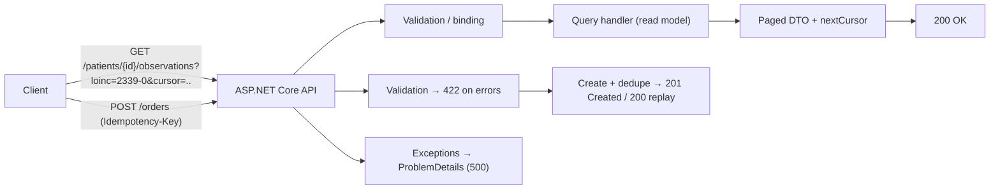

# Chapter 30: API Design

> **Audience:** Experienced .NET developers (5+ years) preparing for an L2 (Mid/Senior) interview at a Healthcare company.
> **Scope:** REST principles, resource modeling and naming, HTTP methods and status codes, request/response design, filtering/paging/sorting, error handling and problem details, versioning strategies (Ch. 31), idempotency, validation, security basics, OpenAPI documentation (Ch. 32), and healthcare-specific API concerns (FHIR, PHI, pagination of large clinical data, auditability).

---

## 30.1 What Makes a Well-Designed REST API

### Interview Answer (30–45 seconds)

> "A well-designed REST API models the domain as resources addressed by URLs, uses HTTP verbs to express actions, and returns meaningful, self-descriptive responses. Resources use nouns, not verbs — `/patients/{id}`, not `/getPatient` — and collections support filtering, paging, and sorting via query parameters. Every response uses the right HTTP status code, and errors return structured `ProblemDetails` with a machine-readable type and a human-readable message. For healthcare, the design must also handle pagination over large clinical datasets, be idempotent where mutations matter, version safely, and protect PHI at every layer. I'd also document it with OpenAPI so consumers get a self-describing contract."

### Detailed Explanation

**Core REST principles:**

- **Resources** — addressable nouns: `/patients`, `/orders/{id}`.
- **Verbs** — `GET` (read), `POST` (create), `PUT` (replace), `PATCH` (partial update), `DELETE` (remove).
- **Statelessness** — each request is self-contained; no server-side session for API state.
- **Uniform interface** — consistent URL + verb + status conventions.

**Naming conventions:**

- Plural nouns for collections: `/patients`, `/orders`.
- Singular for item: `/patients/{patientId}`.
- Sub-resources for relationships: `/patients/{id}/observations`.
- No verbs in URLs; no implementation details; use hyphens (`/lab-results`), not underscores.

**HTTP status codes:**

| Range | Meaning | Common codes |
|---|---|---|
| 2xx | Success | 200 OK, 201 Created, 204 No Content |
| 3xx | Redirection | 304 Not Modified |
| 4xx | Client error | 400 Bad Request, 401 Unauthorized, 403 Forbidden, 404 Not Found, 409 Conflict, 422 Unprocessable Entity, 429 Too Many Requests |
| 5xx | Server error | 500 Internal, 502/503, 504 Timeout |

**Request/response design:**

- Filtering: `?status=active&type=lab`.
- Paging: `?page=2&pageSize=50` or cursor `?cursor=...` (better for large sets).
- Sorting: `?sort=occurredAt,-status` (minus = descending).
- Projection: `?fields=id,name` when needed.
- `ETag`/`If-None-Match` for conditional reads (caching).

**Error handling:**

- `ProblemDetails` (RFC 7807): `{ type, title, status, detail, instance, extensions }`.
- `ValidationProblemDetails` for 400/422 with per-field errors.
- Never leak stack traces or internal identifiers.

**Idempotency:**

- `PUT`/`DELETE` are naturally idempotent (same effect on repeat).
- `POST` (create) is not — use an `Idempotency-Key` header or a client-supplied ID for safe retries.

**Versioning:** covered in Ch. 31 (URI, query, header, media type).

**Security basics:**

- AuthN/AuthZ (Ch. 11–12): OAuth2/JWT, scopes.
- HTTPS always; TLS for PHI in transit.
- Rate limiting (Ch. 33), input validation, CORS policies.

### Real World Example (Healthcare)

`GET /patients/{id}/observations?loinc=2339-0&pageSize=100&cursor=...` returns a paginated, filterable list of lab observations. A nurse's app pages through results with a cursor so responses stay fast even for patients with thousands of records. A failed validation returns `422 ValidationProblemDetails` naming the field; a conflict (order already cancelled) returns `409`; a create carries an `Idempotency-Key` so a network retry doesn't duplicate the order. Everything is HTTPS, JWT-scoped, and documented in OpenAPI.

### Production Code Example

```csharp
// Model with ProblemDetails + validation
app.MapGet("/patients/{patientId}/observations", async (
    string patientId,
    string? loinc,
    int? pageSize,
    string? cursor,
    IPatientObservationQuery query,
    CancellationToken ct) =>
{
    var result = await query.GetObservationsAsync(patientId, loinc, pageSize, cursor, ct);
    return result switch
    {
        { IsNotFound: true } => Results.Problem(statusCode: 404, detail: "Patient not found"),
        { IsEmpty: false } => Results.Ok(result.Page),  // includes nextCursor for paging
        _ => Results.Ok(new { items = Array.Empty<object>(), nextCursor = (string?)null })
    };
})
.WithName("GetObservations")
.WithOpenApi();

// Create with idempotency + validation
app.MapPost("/orders", async (CreateOrderRequest req, HttpRequest http, IOrderService svc, CancellationToken ct) =>
{
    var key = http.Headers["Idempotency-Key"].FirstOrDefault();
    var result = await svc.CreateAsync(req, key, ct);
    return result switch
    {
        { IsCreated: true } => Results.Created($"/orders/{result.Id}", result.Dto),
        { IsDuplicate: true } => Results.Ok(result.Dto),          // replay → same result
        { Errors.Count: > 0 } => Results.ValidationProblem(result.Errors),
        _ => Results.Problem(statusCode: 500)
    };
})
.WithOpenApi();
```

```csharp
// Global exception handling → ProblemDetails
app.UseExceptionHandler(handler => handler.Run(async ctx =>
{
    var ex = ctx.Features.Get<IExceptionHandlerFeature>()?.Error;
    await ctx.Response.WriteAsJsonAsync(new ProblemDetails
    {
        Status = StatusCodes.Status500InternalServerError,
        Title = "An unexpected error occurred",
        Detail = ctx.RequestServices.GetRequiredService<IHostEnvironment>().IsDevelopment()
            ? ex?.ToString() : null
    }, ct: CancellationToken.None);
}));
```

**Key lines explained:**

- Filtering/paging via query parameters; cursor-based paging for large datasets.
- `Results.Problem`/`Results.ValidationProblem` return standard RFC 7807 bodies.
- Idempotency key deduplicates retries.
- ProblemDetails on unhandled exceptions, details only in development.

### Internal Working

- Routing maps the URL to the endpoint (minimal API or controller).
- Model binding/validation runs before the handler.
- The handler queries the service; results map to response DTOs.
- Responses serialize to JSON; errors convert to `ProblemDetails`.
- ETags/Caching are handled at middleware level (output caching, response caching).

### Advantages

- Uniform, predictable contract → easy for clients to consume.
- Self-describing with OpenAPI → code generation, docs, and contract tests.
- Stateless → horizontal scaling and caching are simple.
- Standard status codes → clients can handle errors uniformly.
- ProblemDetails → structured, machine-readable failures.

### Disadvantages

- Designing good resources takes domain modeling (easy to get wrong).
- REST has no standard for complex operations (use actions/commands sub-resources).
- Chatty — sometimes needs multiple calls (mitigate with links/aggregation).
- Over-fetching/under-fetching without field selection (or GraphQL).
- Inconsistency risk across teams without a shared API guideline.
- Versioning (Ch. 31) adds long-term maintenance.

### Best Practices

- Model resources around the domain; use plural nouns and REST verbs.
- Return the right status codes consistently; use `201 Created` + `Location` for creates.
- Use `ProblemDetails`/`ValidationProblemDetails` for errors — never bare strings.
- Paginate with cursors for large clinical datasets; bound `pageSize`.
- Support filtering/sorting via query parameters with whitelisted fields.
- Use `Idempotency-Key` for creates; rely on `PUT`/`DELETE` idempotency.
- Version deliberately (Ch. 31); document with OpenAPI (Ch. 32).
- Secure: HTTPS, JWT/scopes, validation, rate limiting, CORS (Ch. 11–12, 33).
- Return DTOs, not entities; don't expose internal identifiers or PHI fields unnecessarily.
- Audit access to sensitive endpoints (who/when/what).

### Common Mistakes

- Verbs in URLs (`/getPatients`), mixed singular/plural, inconsistent casing.
- Returning 200 for everything (even errors) → clients can't detect failures.
- Exposing entities directly → leaks internal fields and coupling.
- No pagination → unbounded response for a patient with 10k observations.
- Leaking stack traces/exceptions to clients.
- Ignoring idempotency → duplicate orders on client retries.
- Not using `ProblemDetails` → ad-hoc error formats.
- Putting security logic only in the client (validate server-side too).

### Interview Follow-up Questions

1. **"Why not verbs in URLs?"** — Verbs should come from HTTP methods; resources are nouns. `/patients` + `POST` expresses "create patient" without inventing URLs.
2. **"PUT vs PATCH?"** — PUT replaces the whole resource; PATCH applies a partial update. PATCH avoids clobbering unknown fields.
3. **"Pagination strategies?"** — Offset (`page`) for small/simple sets; cursor (`cursor`) for large, frequently-changing sets (stable, efficient).
4. **"When do you use 422 vs 400?"** — 400 = malformed request (parse fails); 422 = valid syntax but semantically invalid (validation rules).
5. **"How do you make POST idempotent?"** — `Idempotency-Key` header or client-supplied `Id`; dedupe server-side and return the original result.
6. **"What is `ProblemDetails`?"** — RFC 7807 structured error format: type/title/status/detail/instance/extensions.
7. **"How do you handle large clinical datasets?"** — Cursor paging, filtering, projections, and read-model optimization.
8. **"How do you version an API?"** — Ch. 31: URL (`/v1`), query (`?api-version=1`), header, or media type; pick based on change policy.
9. **"ETag/conditional requests?"** — `If-None-Match` → `304 Not Modified`; reduces payloads and supports optimistic concurrency.
10. **"HATEOAS — do you use it?"** — Rarely in practice; links in responses can help discovery but add complexity.

### Senior Level Talking Points

- **API contracts as products:** OpenAPI + consumer-driven contract tests; breaking changes gated by a compatibility policy.
- **Domain-driven resources:** model APIs after bounded contexts (Ch. 29), not DB tables.
- **Reliability semantics:** idempotency keys, retries with `Retry-After`, rate-limit headers.
- **Healthcare specifics:** FHIR compliance where relevant, PHI redaction in logs, audit logging of sensitive reads, pagination of large result sets.
- **Performance:** DTO projections, response caching, conditional requests, and monitoring P95 latency.
- **Evolution strategy:** additive changes, versioning policy, and deprecation timelines.

### Diagram



### Comparison Table

| Aspect | Good API | Poor API |
|---|---|---|
| URLs | `/patients/{id}` (nouns) | `/getPatientById` (verbs) |
| Status codes | Correct (201/404/422/409) | 200 for everything |
| Errors | ProblemDetails | Random strings |
| Paging | Cursor, bounded pageSize | None / unbounded |
| Idempotency | Keys on creates | Duplicates on retry |
| Contract | OpenAPI, versioned | Undocumented, breaking |
| Security | JWT/scopes, HTTPS, validation | Implicit trust |

### Memory Trick

**"Nouns for URLs, verbs as methods, status codes tell the truth."** Resources plural, actions via HTTP, errors as ProblemDetails, paginate big collections, and make creates retry-safe.

### Summary

Good API design is resource modeling + consistent conventions: plural noun URLs, correct HTTP verbs and status codes, structured errors (ProblemDetails), filtering/paging/sorting, idempotency, versioning, and OpenAPI docs. For healthcare interviews, emphasize paginating large clinical datasets, PHI-safe contracts, idempotent mutations, and a documented, versioned, auditable contract.

### Interview Confidence Score

**Confidence: High (after this chapter).** API design is a core L2 topic with many probing questions. Covering the "why" behind conventions — plus idempotency, ProblemDetails, and healthcare-specific constraints — puts you well above pattern-recitation answers.

---

## Top 10 Interview Questions for This Chapter

1. What makes a good REST API?
2. How do you name resources and choose HTTP methods?
3. How do you design error responses?
4. Offset vs cursor pagination — which do you choose and why?
5. How do you make a create operation idempotent?
6. PUT vs PATCH — when would you use each?
7. When would you return 409 vs 422?
8. How do you handle large clinical datasets in an API?
9. How do you document and evolve an API contract?
10. How do you secure a healthcare API?

## Revision Notes

- REST: resources as nouns, verbs as HTTP methods, stateless, uniform interface.
- URLs: plural collections, item resources, sub-resources for relationships, no verbs.
- Status: 200/201/204; 400/401/403/404/409/422/429; 5xx reserved for server faults.
- Errors: `ProblemDetails` (RFC 7807) and `ValidationProblemDetails`.
- Filtering/sorting via query params; cursor paging for large sets; bound `pageSize`.
- Idempotency: `PUT`/`DELETE` inherent; `POST` needs an `Idempotency-Key`.
- Return DTOs, not entities; no stack traces; validation server-side.
- Version (Ch. 31), document with OpenAPI (Ch. 32), secure (Ch. 11–12, 33).
- Healthcare: FHIR conventions, PHI-safe logging, audit sensitive reads.

## Things Interviewers Expect from 5+ Years Experience

- You can justify conventions (verbs, status codes) with reasoning, not habit.
- You design for failure: idempotency, structured errors, retries.
- You handle scale: pagination, projection, caching.
- You treat the API as a versioned, documented contract.
- You apply healthcare constraints (PHI, FHIR, auditability) naturally.

## Cheat Sheet

```
GET    /patients                       -> list (filter, page, sort)
GET    /patients/{id}                  -> item
GET    /patients/{id}/observations     -> sub-resources (paginate!)
POST   /orders          (Idempotency-Key) -> 201 Created + Location
PUT    /orders/{id}                    -> replace (idempotent)
PATCH  /orders/{id}                    -> partial update
DELETE /orders/{id}                    -> 204 No Content

Paging:  ?cursor=<token>&pageSize=50   -> { items, nextCursor }
Errors:  ProblemDetails { type, title, status, detail, instance, errors? }
Filtering: ?loinc=2339-0&status=active
```

## Flash Cards

**Q:** Why nouns not verbs in URLs? **A:** HTTP methods already express the action; resources are nouns.

**Q:** How do you make POST idempotent? **A:** `Idempotency-Key` header or client ID; dedupe and return the original result.

**Q:** Cursor vs offset paging? **A:** Cursor: stable/efficient for large changing sets; offset: simple for small sets.

**Q:** What format are errors? **A:** RFC 7807 `ProblemDetails`.

**Q:** PUT vs PATCH? **A:** PUT replaces; PATCH partially updates.

**Q:** 422 vs 400? **A:** 422 = syntactically valid but fails validation; 400 = malformed request.

---

*Continue → Chapter 31: API Versioning*
