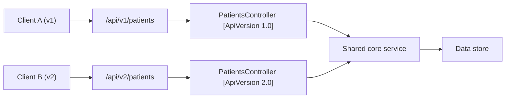

# Chapter 32: API Versioning

> **Audience:** Experienced .NET developers (5+ years) preparing for an L2 (Mid/Senior) interview at a Healthcare company.
> **Scope:** Why version an API, versioning strategies (URL path, query string, header, media type), `Asp.Versioning.Http`/`Asp.Versioning.Mvc` in ASP.NET Core, backward compatibility, additive vs breaking changes, deprecation lifecycle, and healthcare considerations (stable contracts for EHR integrations, regulated consumers, migration windows).

---

## 32.1 Why Version and How to Choose a Strategy

### Interview Answer (30–45 seconds)

> "Versioning lets you evolve an API without breaking existing consumers. Once an API is public — especially for healthcare partners — you can't change a contract overnight. The common strategies are URL path (`/api/v1/patients`), query string (`?api-version=1.0`), header, and media type. In ASP.NET Core the `Asp.Versioning` packages make this declarative with attributes and automatic routing. My rule: use URL path versioning for public-facing APIs because it's explicit, cacheable, and visible in logs, and add a clear deprecation lifecycle — a version is additive first, breaking changes come in a new version, and old versions are retired only after a published migration window."

### Detailed Explanation

**Why version:**

- Consumers (EHR systems, mobile apps, partners) integrate against a contract.
- Breaking changes (renaming fields, changing types, removing endpoints) must not silently break them.
- Versioning decouples change cadence: you evolve `v2` while `v1` keeps working.

**Strategies:**

| Strategy | Example | Pros | Cons |
|---|---|---|---|
| URL path | `/api/v1/patients` | Explicit, cacheable, visible | Pollutes URL; duplicates endpoints |
| Query string | `?api-version=1.0` | Simple, no URL change | Easy to omit/forget; caching issues |
| Header | `X-Api-Version: 1.0` | URL stays clean | Hidden; proxies may drop headers |
| Media type | `Accept: application/vnd.health.v2+json` | Semantic, content negotiation | Complex; client burden |

**Compatibility rules:**

- **Additive changes** (new fields, new endpoints, new optional params) can go in the same version.
- **Breaking changes** (rename/remove fields, change semantics, drop endpoints) require a new version.
- Old versions must keep working for a defined period; then deprecate and retire.

**ASP.NET Core implementation:**

- Packages: `Asp.Versioning.Mvc` (controllers) and `Asp.Versioning.Http` (Minimal APIs).
- Configure default version, API version reader (URL/query/header), and reporting.
- `[ApiVersion("1.0")]` and `[MapToApiVersion("2.0")]` attributes.
- OpenAPI: `Asp.Versioning.Mvc.ApiExplorer` exposes per-version documents.

**Version lifecycle:**

1. Release `v1`.
2. Develop `v2` additively; keep `v1`.
3. When breaking change is needed, ship `v2`; mark `v1` deprecated.
4. Publish deprecation notices with a retirement date; give consumers a migration window.
5. Remove `v1` only when traffic is gone (or by policy).

### Real World Example (Healthcare)

An EHR integration exposes `/api/v1/observations`. A regulatory update requires the observation payload to include a new `specimenType` field (additive — shipped in v1) and later renames `resultValue` to `numericResult` (breaking — requires `v2`). The team ships `/api/v2/observations`, keeps `v1` live, sends deprecation notices to integration owners, and plans removal after a 12-month migration window. Consumers upgrade on their schedule; nothing breaks.

### Production Code Example

```csharp
// Program.cs — configure versioning
builder.Services.AddApiVersioning(options =>
{
    options.DefaultApiVersion = new ApiVersion(1, 0);
    options.AssumeDefaultVersionWhenUnspecified = true;
    options.ReportApiVersions = true;               // sends api-supported-versions header
    options.ApiVersionReader = ApiVersionReader.Combine(
        new UrlSegmentApiVersionReader(),            // /api/v1/...
        new HeaderApiVersionReader("X-Api-Version"),
        new QueryStringApiVersionReader("api-version"));
})
.AddApiExplorer(options =>                            // per-version OpenAPI docs
{
    options.GroupNameFormat = "'v'VVV";
    options.SubstituteApiVersionInUrl = true;
});
```

```csharp
// Controller with two versions
[ApiController]
[Route("api/v{version:apiVersion}/patients")]
[ApiVersion("1.0")]
[ApiVersion("2.0")]
public sealed class PatientsController : ControllerBase
{
    // v1 returns the legacy shape
    [HttpGet("{id}")]
    public async Task<IActionResult> GetV1(string id, [FromServices] IPatientService svc)
    {
        var p = await svc.GetAsync(id);
        return Ok(new { p.Id, p.Name });            // v1 payload
    }

    // v2 returns the expanded shape (breaking change in a new version)
    [HttpGet("{id}")]
    [MapToApiVersion("2.0")]
    public async Task<IActionResult> GetV2(string id, [FromServices] IPatientService svc)
    {
        var p = await svc.GetAsync(id);
        return Ok(new { p.Id, p.Name, p.Mrn, p.SpecimenTypes });   // v2 payload
    }
}
```

```csharp
// Minimal API versioning (Asp.Versioning.Http)
var v1 = app.NewVersionedApi("patients");
v1.MapGet("/api/v{version:apiVersion}/patients/{id}", (string id, IPatientService svc) => svc.GetAsync(id))
  .HasApiVersion(1.0);
```

**Key lines explained:**

- Multiple `[ApiVersion]` attributes register the controller across versions.
- `[MapToApiVersion("2.0")]` distinguishes the v2 action from v1.
- `ReportApiVersions` advertises supported/deprecated versions via headers.
- URL + header + query readers let clients pick their style.

### Internal Working

- `ApiVersioning` reads the version from the configured readers (URL segment, header, query).
- It matches the request to the correct action: same route, different version attributes.
- `ApiExplorer` generates one OpenAPI document per version (v1, v2, …).
- The routing engine selects the action using the resolved version.

### Advantages

- Consumers are never silently broken.
- Teams evolve contracts independently of consumer upgrade cycles.
- Clear, documented lifecycle (supported/deprecated/retired).
- Multiple strategies work together for client convenience.
- OpenAPI documents per version aid discovery and codegen.

### Disadvantages

- More endpoints/controllers to maintain (duplication).
- Version sprawl if you version too eagerly.
- Old versions accrue legacy behavior and technical debt.
- Cache keys and proxies must be version-aware (URL path helps).
- Media-type versioning is complex for clients.

### Best Practices

- Prefer URL path versioning for public/partner APIs; header/query for internal or same-domain teams.
- Prefer additive changes; reserve new versions for true breaking changes.
- Enforce a documented deprecation policy (e.g., deprecate at least N months before removal).
- `ReportApiVersions` so clients see supported/deprecated versions.
- Generate per-version OpenAPI documents; contract-test each.
- Keep `v1` logic thin — a translation layer to the same core handler where possible.
- Log the API version used to aid support and migration tracking.

### Common Mistakes

- Versioning on every change (even additive) → version fatigue.
- Breaking changes inside a minor bump → consumers break silently.
- Removing a version without a migration window.
- No deprecation signaling → clients don't know v1 is ending.
- Versioning only the URL while forgetting query/header clients.
- Duplicating business logic across versions instead of a shared core + translation.

### Interview Follow-up Questions

1. **"Which versioning strategy do you prefer and why?"** — URL path for public APIs (explicit, cacheable); header/query for internal services; depends on consumer control.
2. **"What counts as a breaking change?"** — Renaming/removing fields or endpoints, changing types/semantics, stricter validation, reordering required params.
3. **"How do you avoid breaking consumers?"** — Additive evolution; new version for breaking changes; deprecation lifecycle; contract tests.
4. **"How does `Asp.Versioning` route to the right action?"** — Reads the version from configured readers and matches `[ApiVersion]`/`[MapToApiVersion]` attributes.
5. **"How do you deprecate a version?"** — `[ApiVersion("1.0", Deprecated = true)]` + `ReportApiVersions`; publish a retirement date; monitor traffic.
6. **"Do you support multiple version readers?"** — Yes; combine URL + header + query for client convenience.
7. **"How do you document versions?"** — `AddApiExplorer` generates per-version OpenAPI docs.
8. **"How long should an old version live?"** — Policy-driven; healthcare often 12–24 months for regulated EHR integrations.
9. **"What if you can't version (e.g., legacy)?** — Use an adapter/gateway to translate legacy contracts to the new shape.
10. **"Minimal APIs — how do you version them?"** — `NewVersionedApi` + `HasApiVersion` (Asp.Versioning.Http).

### Senior Level Talking Points

- **Contract governance:** version policy, semver for APIs, consumer-driven contract tests per version.
- **Migration strategy:** feature flags, canary consumers, dual-write/translation layers between versions.
- **Healthcare specifics:** regulated EHR/partner integrations need long, well-communicated migration windows and audit of which version each consumer uses.
- **Cost control:** retiring old versions aggressively once traffic drops below a threshold.
- **Observability:** track version in logs/metrics to guide deprecation decisions.

### Diagram



### Comparison Table

| Aspect | URL path | Query string | Header | Media type |
|---|---|---|---|---|
| Visibility | Explicit | Visible in URL | Hidden | Hidden in body |
| Cache/proxy friendly | Yes | Depends | May drop | No |
| Client effort | Low | Low | Medium | High |
| Discoverability | High | Medium | Low | Low |
| Common for | Public APIs | Internal | Internal | Content negotiation |

### Memory Trick

**"Additive stays, breaking bumps."** New fields = same version. Renames/removals = new version. Pick the visible strategy (URL) for public APIs; advertise supported/deprecated versions; retire with a published window.

### Summary

API versioning protects consumers from breaking changes while letting you evolve contracts. Know the four strategies, compatibility rules (additive vs breaking), `Asp.Versioning` wiring, per-version OpenAPI docs, and a deprecation lifecycle. For healthcare interviews, emphasize stable contracts for EHR/partner integrations and disciplined, well-communicated migration windows.

### Interview Confidence Score

**Confidence: High (after this chapter).** Versioning is a standard L2 API question. Demonstrating a lifecycle policy and the additive-vs-breaking rule — not just syntax — reads as production experience.

---

## Top 10 Interview Questions for This Chapter

1. Why is API versioning important?
2. Compare URL, query, header, and media-type versioning.
3. What counts as a breaking change?
4. How do you evolve an API without breaking consumers?
5. How does `Asp.Versioning` work in ASP.NET Core?
6. How do you deprecate an API version?
7. How do you document multiple versions?
8. When should you version vs keep additive changes?
9. How do you handle versioning with Minimal APIs?
10. How long should old versions stay live?

## Revision Notes

- Versioning lets APIs evolve without breaking consumers.
- Strategies: URL (`/v1`), query (`?api-version`), header, media type.
- Additive changes stay; breaking changes need a new version.
- `Asp.Versioning.Mvc`/`.Http`: `[ApiVersion]`, `[MapToApiVersion]`, `NewVersionedApi`.
- `ReportApiVersions` advertises supported/deprecated versions.
- `AddApiExplorer` → per-version OpenAPI documents.
- Deprecation lifecycle: deprecate → publish window → monitor → retire.
- Keep shared core logic; versions are thin translation layers.
- Healthcare: long migration windows for EHR/partner integrations.

## Things Interviewers Expect from 5+ Years Experience

- You define a clear compatibility policy, not just syntax.
- You choose the strategy based on consumer control, not habit.
- You manage a deprecation lifecycle with metrics and timelines.
- You keep version layers thin over a shared core.
- You contract-test each version and track usage.

## Cheat Sheet

```csharp
// Packages: Asp.Versioning.Mvc, Asp.Versioning.Mvc.ApiExplorer, Asp.Versioning.Http
builder.Services.AddApiVersioning(o =>
{
    o.DefaultApiVersion = new ApiVersion(1, 0);
    o.AssumeDefaultVersionWhenUnspecified = true;
    o.ReportApiVersions = true;
    o.ApiVersionReader = ApiVersionReader.Combine(
        new UrlSegmentApiVersionReader(),
        new QueryStringApiVersionReader("api-version"),
        new HeaderApiVersionReader("X-Api-Version"));
})
.AddApiExplorer(o => { o.GroupNameFormat = "'v'VVV"; o.SubstituteApiVersionInUrl = true; });

// Controller
[ApiController]
[Route("api/v{version:apiVersion}/patients")]
[ApiVersion("1.0")] [ApiVersion("2.0")]
[HttpGet("{id}")] [MapToApiVersion("2.0")]   // v2 action
[HttpGet("{id}")]                            // v1 action
```

## Flash Cards

**Q:** When do you need a new version? **A:** For breaking changes — renames, removals, semantic changes. Additive changes don't.

**Q:** Best strategy for public APIs? **A:** URL path (`/api/v1/...`) — explicit, cacheable, visible.

**Q:** How do you signal deprecation? **A:** `[ApiVersion(Deprecated = true)]` + `ReportApiVersions` headers.

**Q:** What does `MapToApiVersion` do? **A:** Maps an action to a specific version when multiple versions share a route.

**Q:** How do you document versions? **A:** `AddApiExplorer` generates a separate OpenAPI doc per version.

**Q:** Why keep v1 thin? **A:** Versions should translate to a shared core, not duplicate business logic.

---

*Continue → Chapter 33: Swagger / OpenAPI*
