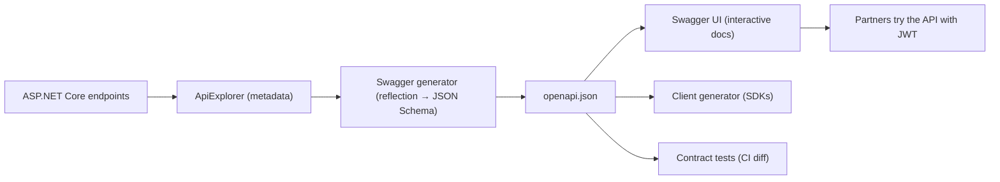

# Chapter 32: Swagger / OpenAPI

> **Audience:** Experienced .NET developers (5+ years) preparing for an L2 (Mid/Senior) interview at a Healthcare company.
> **Scope:** OpenAPI specification and Swagger tools, `Swashbuckle`/`Microsoft.AspNetCore.OpenApi` integration in ASP.NET Core, JSON Schema-based request/response docs, XML comments enrichment, security schemes (JWT), per-version documents, generating clients, contract testing, and healthcare value (FHIR-style self-describing contracts, partner onboarding).

---

## 32.1 What Are OpenAPI and Swagger

### Interview Answer (30–45 seconds)

> "OpenAPI is a machine-readable specification that describes a REST API: paths, operations, parameters, request/response schemas, security, and metadata. Swagger is the tooling ecosystem around it — Swagger UI renders it as interactive documentation, and Swagger Codegen/other generators produce client SDKs. In ASP.NET Core, Swashbuckle or the built-in `Microsoft.AspNetCore.OpenApi` introspects my endpoints and generates the document automatically from the C# types. That means my DTOs and annotations become a self-describing contract: partners can browse the interactive UI, generate clients, and write contract tests — which is especially valuable for healthcare integrations where the contract must be precise."

### Detailed Explanation

**Concepts:**

- **OpenAPI specification (OAS)** — the JSON/YAML contract (v3.x current). Defines: `info`, `paths`, `components/schemas`, `securitySchemes`, `parameters`, `responses`.
- **Swagger UI** — interactive HTML documentation; try-it buttons.
- **Swagger Editor/Codegen** — design/validate and generate client/server stubs.
- **JSON Schema** — OAS schemas are JSON-Schema-flavored descriptions of payloads.

**How ASP.NET Core generates it:**

- Endpoints are discovered (controllers or Minimal APIs via metadata).
- Request/response types are mapped to JSON Schema.
- Attributes (`[ProducesResponseType]`, `[ApiController]` conventions) enrich status codes.
- XML comments can enrich descriptions if enabled.

**Packages:**

| Package | Purpose |
|---|---|
| `Swashbuckle.AspNetCore` | Swagger generator + Swagger UI (most common) |
| `Microsoft.AspNetCore.OpenApi` | Built-in OAS 3.0 document generation (Minimal APIs, .NET 9+) |
| `Microsoft.AspNetCore.Swagger` / `SwaggerGen` / `SwaggerUI` | Middleware components |

**Why it matters:**

- Self-documenting contracts → less drift between code and docs.
- Client SDK generation → fast partner onboarding.
- Contract tests → catch breaking changes (with Ch. 31).
- Interactive debugging for developers.

**Security schemes:**

- Describe JWT bearer auth so the UI can attach tokens.

### Real World Example (Healthcare)

A FHIR-adjacent API is documented with OpenAPI. Partners open Swagger UI, click "Authorize", paste their JWT, and try `GET /patients/{id}` with example payloads. The doc shows required fields, error `ProblemDetails` schemas, and the auth scopes. CI runs a contract test that diffs the generated OpenAPI against the previous release, so a breaking change (Ch. 31) is caught before it ships — protecting the EHR integrations that consume the API.

### Production Code Example

```csharp
// Program.cs — Swashbuckle
builder.Services.AddEndpointsApiExplorer();
builder.Services.AddSwaggerGen(options =>
{
    options.SwaggerDoc("v1", new OpenApiInfo
    {
        Title = "Clinical API",
        Version = "v1",
        Description = "Patient observation and order API (healthcare)"
    });

    // Read XML comments for descriptions
    var xmlFile = $"{Assembly.GetExecutingAssembly().GetName().Name}.xml";
    var xmlPath = Path.Combine(AppContext.BaseDirectory, xmlFile);
    options.IncludeXmlComments(xmlPath);

    // Document the JWT bearer scheme (Ch. 12)
    options.AddSecurityDefinition("Bearer", new OpenApiSecurityScheme
    {
        Name = "Authorization",
        Type = SecuritySchemeType.Http,
        Scheme = "bearer",
        BearerFormat = "JWT",
        In = ParameterLocation.Header
    });
    options.AddSecurityRequirement(new OpenApiSecurityRequirement
    {
        {
            new OpenApiSecurityScheme { Reference = new OpenApiReference
                { Type = ReferenceType.SecurityScheme, Id = "Bearer" } },
            Array.Empty<string>()
        }
    });
});

app.UseSwagger();
app.UseSwaggerUI(o => o.SwaggerEndpoint("/swagger/v1/swagger.json", "Clinical API v1"));
```

```csharp
// Endpoint metadata enriches the document
app.MapGet("/patients/{id}", async (string id, IPatientService svc, CancellationToken ct) =>
    await svc.GetAsync(id, ct) is { } p ? Results.Ok(p) : Results.NotFound())
   .WithName("GetPatient")
   .WithOpenApi(operation => new(operation)
   {
       Summary = "Fetch a patient by ID",
       Description = "Returns the patient record for an authorized caller."
   })
   .Produces<PatientDto>(StatusCodes.Status200OK)
   .ProducesProblem(StatusCodes.Status404NotFound);
```

```csharp
// Built-in OpenAPI (Microsoft.AspNetCore.OpenApi)
builder.Services.AddOpenApi(options =>
{
    options.AddDocumentTransformer((document, context, ct) =>
    {
        document.Info.Title = "Clinical API";
        return Task.CompletedTask;
    });
});
app.MapOpenApi();   // serves /openapi/v1.json
```

**Key lines explained:**

- `AddSwaggerGen` builds the document from discovered endpoints.
- XML comments + `WithOpenApi` enrich descriptions in the UI.
- Security definition lets Swagger UI send the JWT.
- `Produces`/`ProducesProblem` declare the response shapes.

### Internal Working

- At startup, ApiExplorer enumerates endpoints with their metadata.
- Swashbuckle walks parameter/response types via reflection → JSON Schema.
- OpenAPI document is generated lazily when `/swagger/v1/swagger.json` is requested.
- Swagger UI loads the JSON and renders the interactive page.

### Advantages

- Live, accurate API documentation — code and docs stay in sync.
- Interactive testing in the browser (auth included).
- Client code generation for many languages.
- Contract tests against a machine-readable spec (Ch. 31).
- Self-describing onboarding for healthcare partners.
- Standard: tools across the ecosystem understand OpenAPI.

### Disadvantages

- Only as good as the metadata — weak types/attributes give weak docs.
- Can leak internal details if DTOs are shared with entities (Ch. 30).
- Extra middleware overhead in dev; disable/limit in production.
- Requires discipline to keep XML comments and annotations current.
- Codegen clients can be over/under-featured vs hand-written.

### Best Practices

- Use `Microsoft.AspNetCore.OpenApi` for Minimal APIs; Swashbuckle for controllers/large apps.
- Enrich docs: `WithOpenApi`, `Produces`, `ProducesProblem`, XML comments.
- Document security schemes (JWT bearer, OAuth scopes).
- Keep DTOs separate from entities so schemas stay clean.
- Enable docs in dev/staging; optionally expose a protected copy in prod.
- Version documents per API version (Ch. 31).
- Add contract tests that diff the generated spec across releases.
- Use `WithSummary`/`WithDescription` and consistent naming.

### Common Mistakes

- Exposing entity types directly → internal fields leak into the schema.
- No security definition → Swagger UI can't attach tokens.
- Forgetting `Produces` → docs show only 200 with unknown schema.
- Leaving Swagger UI public in production → info disclosure and attack surface.
- No XML comments or annotations → useless documentation.
- Generating clients from drifting docs → wrong SDKs.
- One unversioned doc for a versioned API → confusion.

### Interview Follow-up Questions

1. **"OpenAPI vs Swagger?"** — OpenAPI is the specification; Swagger is the tooling (UI, editor, codegen) around it.
2. **"Swashbuckle vs `Microsoft.AspNetCore.OpenApi`?"** — Swashbuckle: mature, controllers-friendly. Built-in: first-party, Minimal-API-focused, OAS 3.0 generation.
3. **"How does ASP.NET Core generate the schema?"** — Reflection over parameter/response types + endpoint metadata → JSON Schema in the document.
4. **"How do you secure Swagger UI?"** — Restrict to dev/staging or behind auth; never expose PHI-bearing endpoints publicly.
5. **"How do you document JWT auth?"** — `AddSecurityDefinition("Bearer", ...)` + `AddSecurityRequirement`.
6. **"How do you test the contract?"** — Generate the spec in CI and diff against the last release; run contract tests per consumer.
7. **"Can you generate a client?"** — Yes: Swagger Codegen, OpenAPI Generator, or `NSwag` for C# clients.
8. **"How do you document versions?"** — One SwaggerDoc per version (`v1`, `v2`) via ApiExplorer group names.
9. **"What's a JSON Schema?"** — The schema format OAS uses to describe payloads (types, required, enums).
10. **"Why disable Swagger in production?"** — Info disclosure and unused attack surface; docs live in dev/staging or an authenticated portal.

### Senior Level Talking Points

- **Contract-as-product:** OpenAPI is the single source of truth for consumers; codegen + contract tests in CI.
- **FHIR angle:** FHIR uses its own definitions, but a companion OpenAPI doc for custom operations improves developer experience.
- **Versioned docs** with a migration policy (Ch. 31).
- **Spec hygiene:** schema linting, naming conventions, and diffing in PRs.
- **Security:** scopes and bearer schemes documented; secrets never appear in examples.

### Diagram



### Comparison Table

| Aspect | Swashbuckle | Microsoft.AspNetCore.OpenApi |
|---|---|---|
| First-party | No | Yes |
| Controllers | Excellent | Good (9.0+ partial) |
| Minimal APIs | Good (metadata) | Native |
| Ecosystem | Mature (UI, filters) | Growing |
| OAS version | 2.0/3.0 | 3.0/3.1 |

### Memory Trick

**"OpenAPI is the contract, Swagger is the UI, XML comments make it human."** Endpoints become schemas via reflection; JWT gets documented; CI diff = contract safety.

### Summary

OpenAPI makes your API self-describing; Swagger renders it interactively. Know the spec/tooling distinction, how ASP.NET Core generates schemas, security documentation, versioned docs, and contract testing. For healthcare interviews, emphasize accurate, PHI-safe, versioned contracts that make partner onboarding safe and fast.

### Interview Confidence Score

**Confidence: High (after this chapter).** Swagger/OpenAPI is a near-certain L2 topic. Going beyond "it generates docs" to schema hygiene, contract tests, and security is what distinguishes experienced answers.

---

## Top 10 Interview Questions for This Chapter

1. What is OpenAPI and what is Swagger?
2. How does ASP.NET Core generate an OpenAPI document?
3. Swashbuckle vs `Microsoft.AspNetCore.OpenApi`?
4. How do you document JWT authentication in Swagger?
5. How do you enrich endpoint documentation (descriptions, status codes)?
6. How do you generate client SDKs?
7. How do you version OpenAPI documents?
8. How do you test API contracts in CI?
9. Why keep Swagger out of production?
10. How do you prevent entities from leaking into the schema?

## Revision Notes

- OpenAPI = machine-readable contract; Swagger = tooling (UI/editor/codegen).
- OAS v3 defines info, paths, schemas, securitySchemes, parameters, responses.
- Swashbuckle (`AddSwaggerGen`) + `Microsoft.AspNetCore.OpenApi` (built-in, Minimal APIs).
- Schemas come from C# types via reflection + endpoint metadata.
- Enrich with XML comments, `WithOpenApi`, `Produces`, `ProducesProblem`.
- Document JWT via `AddSecurityDefinition`/`AddSecurityRequirement`.
- Per-version docs via ApiExplorer group names (Ch. 31).
- Contract tests: generate + diff the spec in CI.
- Keep Swagger in dev/staging or behind auth; DTOs separate from entities.
- Clients: Swagger Codegen / OpenAPI Generator / NSwag.

## Things Interviewers Expect from 5+ Years Experience

- You treat the OpenAPI document as a governed contract, not a dev convenience.
- You document security, errors, and versions precisely.
- You use CI contract diffs to prevent breaking changes (Ch. 31).
- You keep internal details out of the schema.
- You decide when to generate clients vs hand-write them.

## Cheat Sheet

```csharp
// Swashbuckle
builder.Services.AddEndpointsApiExplorer();
builder.Services.AddSwaggerGen(o =>
{
    o.SwaggerDoc("v1", new OpenApiInfo { Title = "Clinical API", Version = "v1" });
    o.IncludeXmlComments(Path.Combine(AppContext.BaseDirectory, "Api.xml"));
    o.AddSecurityDefinition("Bearer", new OpenApiSecurityScheme { Type = SecuritySchemeType.Http, Scheme = "bearer", BearerFormat = "JWT" });
    o.AddSecurityRequirement(new OpenApiSecurityRequirement { { new OpenApiSecurityScheme { Reference = new OpenApiReference { Type = ReferenceType.SecurityScheme, Id = "Bearer" } }, Array.Empty<string>() } });
});
app.UseSwagger();
app.UseSwaggerUI(o => o.SwaggerEndpoint("/swagger/v1/swagger.json", "v1"));

// Minimal API metadata
app.MapGet("/patients/{id}", ...).WithName("GetPatient").Produces<PatientDto>().ProducesProblem(404);

// Built-in OpenAPI
builder.Services.AddOpenApi();
app.MapOpenApi();   // /openapi/v1.json
```

## Flash Cards

**Q:** OpenAPI vs Swagger? **A:** OpenAPI is the spec; Swagger is the tooling ecosystem.

**Q:** How are schemas generated? **A:** Reflection over parameter/response types + endpoint metadata.

**Q:** How do you add JWT to Swagger UI? **A:** `AddSecurityDefinition` + `AddSecurityRequirement`.

**Q:** Why version documents? **A:** Each API version (Ch. 31) needs its own spec for consumers.

**Q:** How do you catch breaking changes? **A:** Diff the generated OpenAPI in CI against the last release.

**Q:** Why not expose Swagger in production? **A:** Info disclosure + attack surface; docs belong in dev/staging or behind auth.

---

*Continue → Chapter 33: Rate Limiting*
