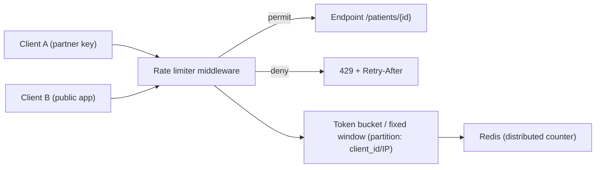

# Chapter 33: Rate Limiting

> **Audience:** Experienced .NET developers (5+ years) preparing for an L2 (Mid/Senior) interview at a Healthcare company.
> **Scope:** Why rate limit (protect resources, fairness, cost, abuse), algorithms (fixed window, sliding window, token bucket, sliding window log, concurrency), ASP.NET Core built-in rate limiter middleware, distributed rate limiting (Redis), `429 Too Many Requests` + `Retry-After` headers, and healthcare considerations (partner API quotas, protecting clinical systems from overload).

---

## 33.1 What Is Rate Limiting and Why Do It

### Interview Answer (30–45 seconds)

> "Rate limiting caps how many requests a client can make in a time window, protecting the API from overload, abuse, and runaway costs, and ensuring fair access for all consumers. The main algorithms are fixed window, sliding window, token bucket, and concurrency limiting. ASP.NET Core ships built-in rate limiting middleware (`AddRateLimiter`) with these policies; you apply a partition (like client ID or API key) and respond `429 Too Many Requests` with a `Retry-After` header when exceeded. For distributed apps you need a shared store like Redis so limits hold across instances (Ch. 20). In healthcare, rate limits are essential for partner API quotas and protecting clinical databases from spike traffic."

### Detailed Explanation

**Why rate limit:**

- Protect backend resources (DB connections, CPU, memory) from overload.
- Prevent abuse/DoS and scraping.
- Enforce fair usage across tenants/partners.
- Control cost (usage-based billing for API access).
- Provide predictable behavior under spikes.

**Algorithms:**

| Algorithm | Behavior | Notes |
|---|---|---|
| Fixed window | N requests per window; resets abruptly | Simple; bursty at boundaries |
| Sliding window | Window slides with time; smoother | Better than fixed, more state |
| Token bucket | Tokens replenish at a rate; burst capacity | Smooth, allows bursts |
| Sliding window log | Exact count within a sliding interval | Precise, memory-heavy |
| Concurrency | Limits simultaneous in-flight requests | Not time-based |

**HTTP semantics:**

- `429 Too Many Requests` when exceeded.
- `Retry-After` header: seconds or HTTP-date before retry.
- `X-RateLimit-Limit`, `X-RateLimit-Remaining`, `X-RateLimit-Reset` headers for transparency.

**ASP.NET Core implementation:**

- `builder.Services.AddRateLimiter(...)` — policies via `RateLimitPartition`.
- Algorithms: `FixedWindowLimiter`, `SlidingWindowLimiter`, `TokenBucketLimiter`, `ConcurrencyLimiter`.
- `RateLimiterOptions.OnRejected` to customize the 429 response.

**Distributed rate limiting:**

- Partition keys (client ID) + a shared limiter store (Redis) → consistent limits across instances.
- StackExchange.Redis provides a Redis-based limiter.

### Real World Example (Healthcare)

A lab API offers partner plans: 100 req/min for clinic partners, 10 req/min for the public app. A policy partitions by API key (`RateLimitPartition.GetTokenBucketLimiter`). When a partner exceeds their quota, the middleware returns `429` with `Retry-After`, and the client backs off. Because the API runs on multiple instances, the limiter uses a Redis store so a partner can't exceed the quota by hitting different instances. Logs capture quota usage for billing and abuse review.

### Production Code Example

```csharp
// Program.cs — built-in rate limiting
builder.Services.AddRateLimiter(options =>
{
    options.RejectionStatusCode = StatusCodes.Status429TooManyRequests;

    options.AddPolicy("partner", context =>
        RateLimitPartition.GetTokenBucketLimiter(
            partitionKey: context.User.FindFirstValue("client_id") ?? "anonymous",
            factory: _ => new TokenBucketRateLimiterOptions
            {
                TokenLimit = 100,
                QueueLimit = 10,
                ReplenishmentPeriod = TimeSpan.FromMinutes(1),
                TokensPerPeriod = 100,
                AutoReplenishment = true
            }));

    options.AddPolicy("public", context =>
        RateLimitPartition.GetFixedWindowLimiter(
            partitionKey: GetClientIp(context),
            factory: _ => new FixedWindowRateLimiterOptions
            {
                PermitLimit = 10,
                Window = TimeSpan.FromMinutes(1),
                QueueLimit = 0
            }));

    options.OnRejected = async (ctx, ct) =>
    {
        if (ctx.Lease.TryGetMetadata(MetadataName.RetryAfter, out var retryAfter))
            ctx.HttpContext.Response.Headers.RetryAfter =
                ((int)retryAfter.TotalSeconds).ToString();

        await ctx.HttpContext.Response.WriteAsync(
            "Too many requests. Please retry later.", ct);
    };
});

app.UseRateLimiter();

app.MapGet("/patients/{id}", async (HttpContext http, IPatientService svc, CancellationToken ct) =>
    await svc.GetAsync(http.User.FindFirstValue("client_id")!, id, ct))
   .RequireRateLimiting("partner");
```

```csharp
// Distributed limiting with Redis (requires per-client partition)
builder.Services.AddRateLimiter(options =>
{
    options.AddPolicy("partner-redis", context =>
        RateLimitPartition.GetRedisFixedWindowLimiter(
            partitionKey: context.User.FindFirstValue("client_id") ?? "anonymous",
            factory: _ => new RedisFixedWindowRateLimiterOptions
            {
                PermitLimit = 100,
                Window = TimeSpan.FromMinutes(1),
                ConnectionMultiplexerFactory = () => _multiplexer,
                ConnectionMultiplexerName = "main"
            }));
});
```

**Key lines explained:**

- Policies partition by client_id/IP; different plans get different limits.
- `TokenBucketRateLimiter` smooths bursts; `FixedWindowRateLimiter` is simple per-minute.
- `429` + `Retry-After` are set in `OnRejected`.
- `RequireRateLimiting("partner")` applies a policy to an endpoint.

### Internal Working

- Middleware runs per request; it acquires a lease from the configured limiter for the partition key.
- If the permit is granted, the request proceeds; the limiter decrements tokens/counters.
- If denied, middleware short-circuits with 429 and calls `OnRejected`.
- Distributed limiters use Redis counters with atomic `INCR`/expiry (Ch. 20) so the limit is global.

### Advantages

- Protects resources and prevents abuse.
- Enforces fair multi-tenant/partner usage.
- Built into ASP.NET Core — no extra package for basic needs.
- Policy-based: different limits per client/plan.
- Distributed option with Redis for consistent limits.
- Standard HTTP semantics (429, Retry-After, headers).

### Disadvantages

- Requires careful partitioning; a bad key (e.g., shared proxy IP) throttles innocent users.
- Distributed limiting adds a Redis dependency and latency.
- Can be bypassed/abused if partition keys are guessable.
- Needs client cooperation (backoff on 429) to be effective.
- Adds complexity: policy testing, monitoring, and tuning.

### Best Practices

- Partition by the most specific stable identity: API key, client ID, or authenticated user (Ch. 11–12).
- Choose the algorithm by shape: token bucket for smooth API quotas; fixed/sliding for simple windows; concurrency for expensive endpoints.
- Always return `429` + `Retry-After`; document headers in OpenAPI (Ch. 32).
- Use a distributed limiter (Redis) behind load balancers.
- Exempt health checks (Ch. 34) and internal endpoints.
- Monitor rejections, quota usage, and per-client patterns.
- Tune limits with real traffic; make them generous enough to avoid false positives.

### Common Mistakes

- Partitioning by IP only — corporate NATs get throttled together.
- No `Retry-After` → clients hammer at the wrong time.
- Applying one global limit regardless of client plan.
- Limiting health checks/readiness → orchestrators (Ch. 19) see failures.
- Ignoring queue limits → requests pile up behind `QueueLimit` and time out.
- Non-distributed limits behind multiple instances → effectively N× quota.
- Overly tight limits → legitimate clinical spikes get blocked.

### Interview Follow-up Questions

1. **"Fixed window vs token bucket?"** — Fixed window resets abruptly and allows boundary bursts; token bucket replenishes smoothly and allows controlled bursts.
2. **"How do you partition clients?"** — By API key/client ID (stable, per-tenant); IP only as a fallback.
3. **"What headers do you return?"** — 429, `Retry-After`, and optional `X-RateLimit-*` headers.
4. **"How do you make limits work across instances?"** — Distributed limiter with Redis (atomic counters) shared by all instances.
5. **"What is the concurrency limiter?"** — Limits simultaneous in-flight requests (not rate); good for expensive operations.
6. **"How do you rate limit in ASP.NET Core?"** — `AddRateLimiter` + policies + `RequireRateLimiting` middleware.
7. **"How do you handle retries after 429?"** — Exponential backoff honoring `Retry-After`.
8. **"Do you rate limit login endpoints?"** — Yes, more strictly (brute-force protection), e.g., per-IP + per-account.
9. **"What about WebSockets/SignalR?"** — Concurrency limiting applies; per-connection message limits too.
10. **"How do you test rate limits?"** — Integration tests hitting the limit, checking 429 and headers; load-test for tuning.

### Senior Level Talking Points

- **Multi-tier limits:** per-user + per-tenant + global to catch both hot users and systemic spikes.
- **Fairness and cost:** partner plans, billing telemetry from rate-limit metadata.
- **Backpressure to the whole stack:** rate limiting in the gateway (Ch. 29) plus per-service policies.
- **Distributed correctness:** Redis limiter consistency, partition-key cardinality, avoiding hotspot keys.
- **Monitoring:** rejection rates, quota utilization, alerts on abuse patterns.
- **Client SDK discipline:** built-in backoff honoring `Retry-After`.

### Diagram



### Comparison Table

| Algorithm | Smooth | Burst-capable | State | Best for |
|---|---|---|---|---|
| Fixed window | No | At boundaries | Low | Simple per-minute quotas |
| Sliding window | Yes | Limited | Medium | Smoother quotas |
| Token bucket | Yes | Yes | Medium | Partner API plans |
| Sliding window log | Yes | Yes | High | Precise enforcement |
| Concurrency | N/A | N/A | Low | Expensive endpoints |

### Memory Trick

**"429 + Retry-After, partition by key."** Pick an algorithm by burst shape, partition by client identity, share counters via Redis across instances, and give clients the backoff signal.

### Summary

Rate limiting protects APIs from overload and abuse while keeping usage fair. Know the algorithms, ASP.NET Core middleware, partitioning by client identity, 429/Retry-After semantics, and distributed (Redis) limiting. For healthcare interviews, emphasize partner quotas, protecting clinical backends, and not throttling health checks or legitimate clinical spikes.

### Interview Confidence Score

**Confidence: High (after this chapter).** Rate limiting is a solid L2 topic. Showing algorithm selection, partitioning wisdom, and distributed correctness signals production-grade API engineering.

---

## Top 10 Interview Questions for This Chapter

1. Why do you need rate limiting?
2. Compare fixed window, sliding window, token bucket, and concurrency limiters.
3. How do you partition clients fairly?
4. What HTTP semantics do you use for rejection?
5. How do you implement rate limiting in ASP.NET Core?
6. How do you make limits consistent across instances?
7. What is the concurrency limiter for?
8. Should you rate limit login endpoints?
9. How do clients handle 429 correctly?
10. How do you monitor and tune rate limits?

## Revision Notes

- Rate limiting = cap requests per window to protect resources, ensure fairness, control cost.
- Algorithms: fixed window, sliding window, token bucket, sliding window log, concurrency.
- HTTP: 429 + `Retry-After`; optional `X-RateLimit-*` headers.
- ASP.NET Core: `AddRateLimiter` + policies (`RateLimitPartition`) + `RequireRateLimiting`.
- Partition by API key/client ID/user; IP as fallback only.
- Distributed: Redis limiter (atomic counters) for multi-instance consistency.
- Exempt health checks; limit login endpoints strictly.
- Monitoring: rejection rate, quota utilization, per-client patterns.
- Client behavior: backoff honoring `Retry-After`.

## Things Interviewers Expect from 5+ Years Experience

- You choose the algorithm for the traffic shape, not by rote.
- You partition by stable identity and understand the pitfalls (NAT, shared keys).
- You make limits distributed-correct across instances.
- You design client SDKs to honor 429/Retry-After.
- You monitor and tune with data.

## Cheat Sheet

```csharp
builder.Services.AddRateLimiter(o =>
{
    o.RejectionStatusCode = 429;
    o.AddPolicy("partner", ctx => RateLimitPartition.GetTokenBucketLimiter(
        partitionKey: ctx.User.FindFirstValue("client_id") ?? "anon",
        factory: _ => new TokenBucketRateLimiterOptions
        {
            TokenLimit = 100, QueueLimit = 10,
            ReplenishmentPeriod = TimeSpan.FromMinutes(1),
            TokensPerPeriod = 100, AutoReplenishment = true
        }));
    o.OnRejected = async (ctx, ct) =>
    {
        if (ctx.Lease.TryGetMetadata(MetadataName.RetryAfter, out var ra))
            ctx.HttpContext.Response.Headers.RetryAfter = ((int)ra.TotalSeconds).ToString();
        await ctx.HttpContext.Response.WriteAsync("Too many requests", ct);
    };
});
app.UseRateLimiter();
app.MapGet("/x", ...).RequireRateLimiting("partner");
```

## Flash Cards

**Q:** Which algorithm smooths bursts? **A:** Token bucket (replenish rate + burst capacity).

**Q:** What status code for rejection? **A:** 429 Too Many Requests, with `Retry-After`.

**Q:** How do you partition fairly? **A:** By API key / client ID / user; IP only as a fallback.

**Q:** How do limits hold across instances? **A:** Distributed limiter backed by Redis counters (Ch. 20).

**Q:** What's a concurrency limiter? **A:** Caps simultaneous in-flight requests, not per-time rate.

**Q:** Why not rate limit health checks? **A:** Orchestrators (Ch. 19) poll them; limiting causes false failures.

---

*Continue → Chapter 34: Health Checks*
