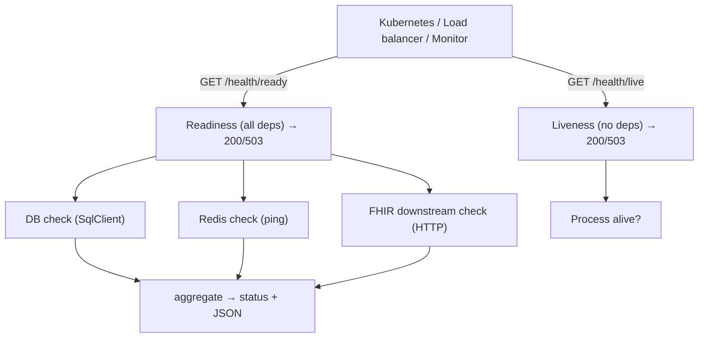

# Chapter 34: Health Checks

> **Audience:** Experienced .NET developers (5+ years) preparing for an L2 (Mid/Senior) interview at a Healthcare company.
> **Scope:** Why health checks matter (orchestrators, load balancers, monitoring), liveness vs readiness, `Microsoft.Extensions.Diagnostics.HealthChecks` built-in checks (DB, HTTP, URLs, custom), health check responses and status aggregation, publishing health data (EventSource / Prometheus), and healthcare use cases (DB connectivity, downstream FHIR services, cache health) with readiness wiring in Kubernetes (Ch. 19).

---

## 34.1 What Are Health Checks and Why Do They Matter

### Interview Answer (30–45 seconds)

> "Health checks expose the runtime state of an app so infrastructure can react: a load balancer stops routing traffic to a broken instance, Kubernetes restarts a dead pod or holds traffic during startup (Ch. 19), and monitoring alerts when a dependency is down. The key distinction is liveness vs readiness: liveness asks 'is the process alive — should it be restarted?', while readiness asks 'is this instance able to serve traffic right now?'. ASP.NET Core has built-in health checks (`AddHealthChecks`) with checks for databases, HTTP endpoints, and custom logic; I wire them to `/health/live` and `/health/ready` and make readiness depend on critical dependencies like the database and downstream services."

### Detailed Explanation

**Why health checks:**

- **Orchestrators (K8s)** use them for restart (liveness) and traffic gating (readiness).
- **Load balancers** drain traffic from unready instances.
- **Monitoring/alerting** detect degraded dependencies.
- **CI/CD** gate deployments (rollback if new instance isn't ready).

**Liveness vs readiness:**

| Check | Question | Failure action |
|---|---|---|
| Liveness | Is the process alive (not deadlocked)? | Restart the container |
| Readiness | Can it serve traffic now? | Stop sending traffic (no restart) |
| Startup (K8s) | Has it finished initializing? | Delay liveness until ready |

**ASP.NET Core health checks:**

- `builder.Services.AddHealthChecks()`.
- Built-in/community checks: `AddDbContextCheck<T>`, `AddCheck<T>` (custom `IHealthCheck`), `AddUrlGroup`/`AddHttp`.
- `MapHealthChecks("/health")` exposes endpoints with a status aggregator.
- Statuses: `Healthy`, `Degraded`, `Unhealthy` — aggregated from all registered checks.

**Response formats:**

- Plain `Healthy` text, JSON (`HealthCheckOptions.ResponseWriter`), or minimal detail.
- Customize via `ResultStatusCodes` and `ResponseWriter`.

**Publishing health data:**

- `AddHealthChecks` supports `HealthCheckPublisher` implementations → periodic reporting (e.g., to EventSource or Prometheus).

**Common checks:**

- Database connectivity (`CanConnectAsync`).
- Downstream HTTP services (FHIR server, other microservices).
- Cache (Redis ping), message broker, disk space, etc.

### Real World Example (Healthcare)

A clinical API exposes `/health/live` (always healthy unless deadlocked) and `/health/ready` (checks the SQL database, Redis, and the downstream FHIR service). Kubernetes liveness probe hits `/health/live` to restart hung pods; readiness probe hits `/health/ready` so a pod is only in rotation when its database and dependencies are reachable. When the database is briefly unavailable, readiness fails — the pod stops receiving traffic but isn't restarted; monitoring alerts on the degraded dependency.

### Production Code Example

```csharp
// Program.cs
builder.Services.AddHealthChecks()
    .AddDbContextCheck<ClinicalDbContext>("clinical-db")
    .AddCheck<RedisHealthCheck>("redis")
    .AddCheck<FhirServiceHealthCheck>("fhir-downstream")
    .AddUrlGroup(new Uri("https://auth.example.com/jwks"), "auth-jwks", timeout: TimeSpan.FromSeconds(3));

app.MapHealthChecks("/health/live", new HealthCheckOptions
{
    Predicate = _ => false,               // liveness: no dependency checks
    ResponseWriter = WriteJsonAsync
});

app.MapHealthChecks("/health/ready", new HealthCheckOptions
{
    Predicate = _ => true,                // readiness: all checks
    ResponseWriter = WriteJsonAsync
});
```

```csharp
// Custom check
public sealed class RedisHealthCheck : IHealthCheck
{
    private readonly IConnectionMultiplexer _mux;
    public RedisHealthCheck(IConnectionMultiplexer mux) => _mux = mux;

    public async Task<HealthCheckResult> CheckHealthAsync(
        HealthCheckContext context, CancellationToken ct)
    {
        try
        {
            await _mux.GetDatabase().PingAsync();
            return HealthCheckResult.Healthy("Redis reachable");
        }
        catch (Exception ex)
        {
            return HealthCheckResult.Unhealthy("Redis unreachable", ex);
        }
    }
}
```

```csharp
// JSON response writer
static async Task WriteJsonAsync(HttpContext ctx, HealthReport report)
{
    ctx.Response.ContentType = "application/json; charset=utf-8";
    var payload = new
    {
        status = report.Status.ToString(),
        checks = report.Entries.Select(e => new
        {
            name = e.Key,
            status = e.Value.Status.ToString(),
            description = e.Value.Description,
            durationMs = e.Value.Duration.TotalMilliseconds
        })
    };
    await ctx.Response.WriteAsJsonAsync(payload);
}
```

**Key lines explained:**

- `Predicate` selects which checks run for an endpoint: none for liveness, all for readiness.
- `AddDbContextCheck`, custom checks, and URL checks cover common dependencies.
- The JSON writer exposes per-check status and duration for dashboards.

### Internal Working

- On request, the framework runs each selected `IHealthCheck` (parallelized by default).
- Each returns `Healthy`/`Degraded`/`Unhealthy`; the report aggregates the worst status.
- The endpoint returns the aggregated status code (`200`/`503`) and body per `ResponseWriter`.
- Health data can be pushed periodically via `IHealthCheckPublisher` for metrics/alerting.

### Advantages

- Zero-dependency integration with orchestrators (K8s probes, Ch. 19).
- Explicit liveness/readiness lets infrastructure act correctly.
- Built-in and community checks cover DB, HTTP, cache, broker, disk.
- Custom `IHealthCheck` covers anything measurable.
- JSON responses feed dashboards and alerting.
- Small, standard, cheap to expose.

### Disadvantages

- Only as useful as the checks you write — shallow checks give false confidence.
- Readiness coupled to dependencies can flap under brief hiccups (needs hysteresis/retry).
- Adding checks adds latency to probe requests if they hit slow dependencies.
- Liveness checks with external deps cause restart loops.
- Distributed apps need aggregation (K8s + metrics) for the full picture.

### Best Practices

- Expose separate `/health/live` and `/health/ready` endpoints.
- Keep liveness dependency-free (process health only); put DB/downstream checks in readiness.
- Use timeouts on checks so a hung dependency doesn't hang probes.
- Add `Degraded` states for non-critical dependencies (e.g., telemetry) so they don't kill readiness.
- Aggregate status sensibly: critical deps → readiness; optional deps → degraded.
- Publish health metrics (via publisher or Prometheus) for dashboards/alerting.
- Add health checks to CI gates and deployment rollback logic.

### Common Mistakes

- Putting DB checks on the liveness probe → restart loops during DB blips.
- Checking a dependency with no timeout → hung probes and missed restarts.
- All checks on one endpoint → can't distinguish restart vs drain.
- Treating `Degraded` as `Unhealthy` for optional dependencies.
- No checks at all → orchestrator restarts blindly / load balancer routes to dead pods.
- Exposing health endpoints to the public with detailed internals.

### Interview Follow-up Questions

1. **"Liveness vs readiness?"** — Liveness: is it alive → restart. Readiness: can it serve → gate traffic. Startup delays liveness until initialized.
2. **"Why separate endpoints?"** — Different consumers and different actions (restart vs drain); dependency checks belong on readiness.
3. **"How do you check a database?"** — `AddDbContextCheck` or a custom check calling `CanConnectAsync` with a timeout.
4. **"What is `Degraded` used for?"** — Non-critical dependencies; the app still serves but at reduced capability.
5. **"How does Kubernetes use these?"** — `livenessProbe`/`readinessProbe`/`startupProbe` hit your endpoints (Ch. 19).
6. **"How do you aggregate health across services?"** — Service mesh/infrastructure probes each service; metrics + dashboards aggregate.
7. **"Can health checks publish data?"** — Yes: `IHealthCheckPublisher` reports periodically to EventSource/Prometheus.
8. **"How do you avoid readiness flapping?"** — Retry/backoff in checks, `Degraded` for optional deps, and short timeouts.
9. **"What's the JSON response format?"** — Custom via `ResponseWriter`; includes status, per-check status, duration.
10. **"Should health endpoints be public?"** — Internal/infrastructure only; restrict with auth or network policies.

### Senior Level Talking Points

- **Reliability design:** liveness = crash recovery, readiness = traffic safety, startup = slow warmup — wire all three.
- **Dependency philosophy:** readiness reflects critical path (DB, downstream clinical services); degraded for optional (telemetry).
- **Probe tuning:** `initialDelaySeconds`, `periodSeconds`, `failureThreshold` (Ch. 19) to avoid flapping.
- **Observability:** per-check durations, status distribution, alerting on readiness failures.
- **Deployment gating:** health checks in CI/CD to rollback failed releases automatically.

### Diagram



### Comparison Table

| Check type | Question | Failure action | Dependencies |
|---|---|---|---|
| Liveness | Process alive? | Restart container | None (process-level) |
| Readiness | Can serve traffic? | Stop sending traffic | Yes (DB, downstream) |
| Startup | Initialized? | Delay other probes | Init work |
| Degraded | Partial capability? | Alert, keep serving | Optional deps |

### Memory Trick

**"Live = restart, ready = route, startup = wait."** Liveness is process-only; readiness reflects dependencies; separate endpoints; timeout every check.

### Summary

Health checks let infrastructure act on app state: liveness for restarts, readiness for traffic routing, startup for warmup. Know the ASP.NET Core health check API, custom `IHealthCheck`, JSON reporting, and how K8s probes consume the endpoints (Ch. 19). For healthcare interviews, emphasize dependency-correct readiness and avoiding restart loops — protecting availability of clinical services.

### Interview Confidence Score

**Confidence: High (after this chapter).** Health checks are a practical, frequently-asked L2 topic. Understanding the liveness/readiness philosophy and how orchestrators consume it shows production operations maturity.

---

## Top 10 Interview Questions for This Chapter

1. What is the difference between liveness and readiness?
2. How do you implement health checks in ASP.NET Core?
3. Why keep liveness free of dependency checks?
4. How do you check database and downstream service health?
5. What is `Degraded` and when do you use it?
6. How does Kubernetes consume health endpoints?
7. How do you format the health check response?
8. How do you publish health data for monitoring?
9. How do you avoid readiness flapping?
10. Should health endpoints be public?

## Revision Notes

- Health checks expose runtime state for orchestrators, load balancers, monitoring.
- Liveness (restart), readiness (traffic gating), startup (warmup delay).
- `AddHealthChecks`: `AddDbContextCheck`, `AddCheck<T>`, `AddUrlGroup`, custom `IHealthCheck`.
- `MapHealthChecks` with `Predicate` and `ResponseWriter`.
- Statuses: `Healthy`, `Degraded`, `Unhealthy`; aggregate worst.
- `/health/live` = no deps; `/health/ready` = all critical deps.
- Timeouts on checks; `Degraded` for optional deps.
- K8s: `livenessProbe`, `readinessProbe`, `startupProbe` (Ch. 19).
- Publish via `IHealthCheckPublisher`/Prometheus for dashboards.

## Things Interviewers Expect from 5+ Years Experience

- You design liveness/readiness with dependency philosophy, not habit.
- You tune probe timeouts and thresholds to avoid flapping.
- You integrate health into deployment gating and rollback.
- You expose per-check metrics for dashboards and alerting.
- You protect health endpoints from public exposure.

## Cheat Sheet

```csharp
builder.Services.AddHealthChecks()
    .AddDbContextCheck<ClinicalDbContext>("clinical-db")
    .AddCheck<RedisHealthCheck>("redis")
    .AddUrlGroup(new Uri("https://auth/jwks"), "auth");

app.MapHealthChecks("/health/live", new HealthCheckOptions { Predicate = _ => false, ResponseWriter = JsonWriter });
app.MapHealthChecks("/health/ready", new HealthCheckOptions { Predicate = _ => true, ResponseWriter = JsonWriter });

public sealed class RedisHealthCheck : IHealthCheck
{
    public async Task<HealthCheckResult> CheckHealthAsync(HealthCheckContext ctx, CancellationToken ct)
    {
        try { await _mux.GetDatabase().PingAsync(); return HealthCheckResult.Healthy(); }
        catch (Exception ex) { return HealthCheckResult.Unhealthy("Redis down", ex); }
    }
}
```

## Flash Cards

**Q:** Liveness vs readiness? **A:** Liveness → restart if dead; readiness → stop traffic if not ready.

**Q:** Which endpoint carries DB checks? **A:** Readiness (`/health/ready`) — not liveness.

**Q:** What status indicates partial capability? **A:** `Degraded`.

**Q:** How do you stop a probe hanging? **A:** Give every check a timeout.

**Q:** How does K8s restart a dead pod? **A:** `livenessProbe` failure exceeds `failureThreshold`.

**Q:** What reads readiness? **A:** Load balancers and K8s — they stop routing traffic to unready pods.

---

*Continue → Chapter 35: Serilog*
