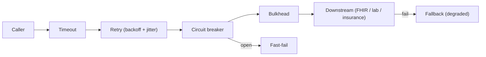

# Chapter 36: Polly (Resilience & Fault Handling)

> **Audience:** Experienced .NET developers (5+ years) preparing for an L2 (Mid/Senior) interview at a Healthcare company.
> **Scope:** Transient fault handling, Polly resilience strategies (retry, circuit breaker, timeout, bulkhead, rate limiter, fallback), `AddPolicyHandler` with `IHttpClientFactory`, `ResiliencePipeline` (Polly v8), exponential backoff with jitter, and healthcare use cases (resilient calls to FHIR, lab, and insurance services without cascading failures).

---

## 36.1 Why Resilient Calls and What Polly Gives You

### Interview Answer (30–45 seconds)

> "In distributed systems, failures are normal: a downstream service is briefly overloaded, a connection resets, a timeout occurs. Polly is a .NET resilience library that wraps your calls with strategies — retry with backoff for transient errors, circuit breaker to stop hammering a failing service, timeout to bound latency, bulkhead to isolate concurrency, and fallback to degrade gracefully. In ASP.NET Core you register them against typed `HttpClient`s via `AddPolicyHandler`, so every call to a dependency automatically follows the policy. In a healthcare system I'd add retries with exponential backoff and jitter to FHIR/lab calls, a circuit breaker so one failing downstream service can't cascade, and timeouts so a slow partner doesn't tie up threads."

### Detailed Explanation

**The resilience strategies:**

| Strategy | What it does |
|---|---|
| Retry | Retries transient failures with delay (backoff, jitter) |
| Circuit breaker | Trips open after N failures → fast-fail for a cooldown |
| Timeout | Bounds total time per attempt |
| Bulkhead | Limits concurrent calls to a dependency (isolation) |
| Rate limiter | Limits call rate (client-side courtesy) |
| Fallback | Returns an alternative result when the call fails |

**Polly v8 model:**

- `ResiliencePipeline` (and `ResiliencePipeline<T>`) replaces v7 `Policy` types.
- Build via `new ResiliencePipelineBuilder().AddRetry(...).AddCircuitBreaker(...)`.
- Async-first, DI-friendly (`AddResiliencePipeline<TKey, T>`, `AddStandardResilienceHandler`).

**`IHttpClientFactory` integration:**

- Typed/`HttpClient` clients get handler pipelines via `AddPolicyHandler` / `AddResilienceHandler`.
- Central place to define per-dependency policies (e.g., a fragile FHIR client vs a reliable internal one).

**Retry best practices:**

- Retry only idempotent/transient failures (network, 408, 429, 5xx), not 4xx.
- Exponential backoff (`2^n` seconds) + jitter to avoid thundering herds.
- Bound retries; combine with a circuit breaker and timeout.
- Honor `Retry-After` when present (Ch. 33).

**Circuit breaker states:**

- **Closed** — calls flow; failures counted.
- **Open** — fast-fail for a cooldown; no calls to a broken dependency.
- **Half-open** — after cooldown, allow a probe; success → Closed, failure → Open.

### Real World Example (Healthcare)

A claim-submission service calls an insurance gateway that is sometimes flaky. A Polly pipeline adds: timeout (10s), retry (3 attempts, exponential backoff + jitter, only on network errors and 503), and a circuit breaker (5 failures → open 30s). When the gateway degrades, requests fail fast instead of piling up, other services are unaffected (bulkhead isolation), and a fallback returns a "queued for retry" state so the clinical workflow continues.

### Production Code Example

```csharp
// Program.cs — resilient typed client
builder.Services.AddHttpClient<IFhirClient, FhirClient>(client =>
{
    client.BaseAddress = new Uri("https://fhir.example.com");
    client.Timeout = TimeSpan.FromSeconds(30);
})
.AddStandardResilienceHandler(retry =>
{
    retry.RetryCount = 3;
    retry.BackoffType = DelayBackoffType.Exponential;
    retry.MaxDelay = TimeSpan.FromSeconds(5);
    retry.UseJitter = true;
    retry.ShouldHandle = args =>
    {
        if (args.Outcome.Exception is HttpRequestException)
            return ValueTask.FromResult(true);
        if (args.Outcome.Result is HttpResponseMessage r && (int)r.StatusCode is 408 or 429 or >= 500)
        {
            if ((int)r.StatusCode == 429 && r.Headers.RetryAfter?.Delta is { } d)
                args.RetryDelay = d;            // honor Retry-After
            return ValueTask.FromResult(true);
        }
        return ValueTask.FromResult(false);     // don't retry 4xx
    };
});
```

```csharp
// Manual pipeline (Polly v8) with circuit breaker + fallback
var pipeline = new ResiliencePipeline<PatientDto?>.Builder()
    .AddTimeout(TimeSpan.FromSeconds(10))
    .AddRetry(new RetryStrategyOptions<PatientDto?>
    {
        MaxRetryAttempts = 3,
        Delay = TimeSpan.FromSeconds(1),
        BackoffType = DelayBackoffType.Exponential,
        UseJitter = true
    })
    .AddCircuitBreaker(new CircuitBreakerStrategyOptions<PatientDto?>
    {
        FailureRatio = 0.5,
        MinimumThroughput = 5,
        SamplingDuration = TimeSpan.FromSeconds(30),
        BreakDuration = TimeSpan.FromSeconds(30)
    })
    .AddFallback(new FallbackStrategyOptions<PatientDto?>
    {
        FallbackAction = _ => Outcome.FromResultAsValueTask<PatientDto?>(null)
    })
    .Build();

var patient = await pipeline.ExecuteAsync(ct => _fhir.GetAsync(id, ct), ct);
if (patient is null) return Results.StatusCode(503);   // degraded response
```

**Key lines explained:**

- `AddStandardResilienceHandler` wires retry + circuit breaker + timeout for HttpClients.
- `ShouldHandle` scopes retries to transient failures; honors `Retry-After` on 429.
- Manual pipeline composes timeout → retry → circuit breaker → fallback.
- Fallback returns a degraded result instead of throwing.

### Internal Working

- Polly wraps the delegate in a chain of handlers; each strategy observes/controls execution.
- Retry counts exceptions/status results and re-invokes with computed delays.
- Circuit breaker tracks a rolling window (sampling duration, failure ratio) and flips state.
- Timeout cancels via `CancellationToken` after the deadline.
- Pipelines are registered once in DI and reused (thread-safe).

### Advantages

- Handles transient failures transparently at the call site.
- Circuit breaker prevents cascading failure (a core microservices pattern, Ch. 29).
- Centralized, per-dependency policy configuration.
- Composability: retry + timeout + breaker + fallback together.
- Standard integration with `IHttpClientFactory`.
- Testable: policy outcomes are deterministic.

### Disadvantages

- Wrong configuration (retrying non-transient, unbounded retries) makes things worse.
- Circuit breakers add latency complexity and need tuning.
- Retrying non-idempotent POSTs can duplicate side effects (need idempotency, Ch. 30).
- Adds a layer to reason about; debugging policy behavior needs observability.
- Version differences (v7 `Policy` vs v8 `ResiliencePipeline`) cause migration friction.

### Best Practices

- Retry only transient, idempotent failures; never blind-retry 4xx.
- Add jitter to retry delays to avoid synchronized retry storms.
- Bound retries and combine with timeout + circuit breaker.
- Honor `Retry-After` on 429.
- Use `AddStandardResilienceHandler` for HttpClients; tune per dependency.
- Make writes idempotent so retried requests are safe (Ch. 30).
- Expose policy metrics (attempts, breaker state, failures).
- Test policies with fault injection (e.g., a fake flaky handler).

### Common Mistakes

- Retrying every error including 4xx and permanent failures.
- No jitter → thundering herd on the first retry wave.
- Infinite/unbounded retries → requests hang and pile up.
- Retrying non-idempotent POSTs → duplicate orders (Ch. 30).
- Timeout set longer than the HTTP timeout → timeout never fires.
- Circuit breaker sampling too small → trips on normal variance.
- Not observing breaker/retry metrics → can't tune.

### Interview Follow-up Questions

1. **"What is a transient fault?"** — A short-lived failure (connection reset, 503, timeout) that succeeds on retry.
2. **"Retry vs circuit breaker?"** — Retry handles blips per attempt; circuit breaker stops all calls to a failing dependency for a cooldown.
3. **"Why jitter?"** — Randomized delay avoids synchronized retry waves hitting a recovering service.
4. **"How do you decide what to retry?"** — Transient + idempotent only; network errors, 408/429/5xx; honor `Retry-After`.
5. **"What are circuit breaker states?"** — Closed (flow), Open (fast-fail), Half-open (probe) → Closed/Open.
6. **"Polly v7 vs v8?"** — v8 introduced `ResiliencePipeline`/`ResiliencePipelineBuilder` replacing v7 `Policy` classes.
7. **"How do you add Polly to HttpClient?"** — `AddStandardResilienceHandler` or `AddPolicyHandler` in `AddHttpClient<T>`.
8. **"What is a bulkhead?"** — Limits concurrent calls to a dependency; isolates failure to that pool.
9. **"When would you use a fallback?"** — Degrade gracefully (serve cache/stale or a queued state) when a dependency fails.
10. **"How do you test resilience?"** — Fault injection: simulated exceptions/status codes via a test handler; assert retry counts and breaker transitions.

### Senior Level Talking Points

- **Resilience design patterns:** retry + timeout + breaker + bulkhead + fallback compose into the "application resilience stack."
- **Cascading failure prevention:** circuit breakers and bulkheads protect the whole system (Ch. 29).
- **Idempotency as the enabler:** retries are only safe when writes are idempotent (Ch. 30).
- **Cost/queue behavior:** respect rate-limit headers; don't overwhelm a recovering partner.
- **Observability:** per-strategy metrics (attempts, breaker trips, timeout counts) in dashboards.
- **Trade-offs:** retries add latency; balance against SLOs.

### Diagram



### Comparison Table

| Strategy | Purpose | Prevents |
|---|---|---|
| Retry | Recover from blips | Lost requests on transient errors |
| Circuit breaker | Stop calling a failing dep | Cascading failure |
| Timeout | Bound latency | Thread/connection exhaustion |
| Bulkhead | Limit concurrency per dep | One dep starving the process |
| Fallback | Degrade gracefully | Hard failure for the user |
| Rate limiter | Client-side courtesy | Hammering a dep (Ch. 33) |

### Memory Trick

**"Retry the blip, break the cascade, bound the wait, cap the load, fallback for grace."** Retry transient + idempotent only; add jitter; circuit break to protect neighbors; timeout everything; fallback to a degraded result.

### Summary

Polly gives .NET resilient calls: retry, circuit breaker, timeout, bulkhead, fallback, and rate limiting. Master strategy selection, `IHttpClientFactory` integration, v8 `ResiliencePipeline`, backoff+jitter, and retrying only transient/idempotent work. For healthcare interviews, emphasize preventing cascading failure to clinical services and making retries safe via idempotency.

### Interview Confidence Score

**Confidence: High (after this chapter).** Resilience is a defining senior topic. Conveying "which strategy, when, and why" plus idempotency awareness separates you from developers who just copy retry config.

---

## Top 10 Interview Questions for This Chapter

1. What is a transient fault and how do you handle it?
2. Explain retry vs circuit breaker vs timeout.
3. Why do you add jitter to retry delays?
4. What should you NOT retry and why?
5. Describe the three circuit breaker states.
6. How do you integrate Polly with `IHttpClientFactory`?
7. What is a bulkhead and when is it useful?
8. What is a fallback strategy?
9. How do you make retries safe for writes?
10. How do you test resilience policies?

## Revision Notes

- Polly strategies: retry, circuit breaker, timeout, bulkhead, fallback, rate limiter.
- v8: `ResiliencePipeline`/`ResiliencePipelineBuilder` (replaces v7 `Policy`).
- `IHttpClientFactory`: `AddStandardResilienceHandler` / `AddPolicyHandler`.
- Retry transient + idempotent only; honor `Retry-After` (Ch. 33); use exponential backoff + jitter.
- Circuit breaker: Closed → Open (fast-fail) → Half-open (probe).
- Timeout bounds latency; bulkhead caps concurrency; fallback degrades gracefully.
- Safe retries for writes require idempotency (Ch. 30).
- Test with fault injection; expose strategy metrics.

## Things Interviewers Expect from 5+ Years Experience

- You choose strategies by failure mode, not by rote.
- You prevent cascading failure (breaker + bulkhead) in a service mesh.
- You know retry safety hinges on idempotency.
- You honor rate-limit semantics and avoid retry storms.
- You measure and tune policies with real data.

## Cheat Sheet

```csharp
// HttpClient integration
builder.Services.AddHttpClient<IFhirClient, FhirClient>(c => c.BaseAddress = new Uri("https://fhir"))
    .AddStandardResilienceHandler(r =>
    {
        r.RetryCount = 3;
        r.BackoffType = DelayBackoffType.Exponential;
        r.MaxDelay = TimeSpan.FromSeconds(5);
        r.UseJitter = true;
        r.ShouldHandle = args =>
            args.Outcome.Exception is HttpRequestException ||
            (args.Outcome.Result is HttpResponseMessage m && (int)m.StatusCode is 408 or 429 or >= 500);
    });

// Manual pipeline (v8)
var pipeline = new ResiliencePipelineBuilder()
    .AddTimeout(TimeSpan.FromSeconds(10))
    .AddRetry(new RetryStrategyOptions { MaxRetryAttempts = 3, Delay = TimeSpan.FromSeconds(1), UseJitter = true })
    .AddCircuitBreaker(new CircuitBreakerStrategyOptions { FailureRatio = 0.5, MinimumThroughput = 5, BreakDuration = TimeSpan.FromSeconds(30) })
    .Build();
await pipeline.ExecuteAsync(ct => call(ct));
```

## Flash Cards

**Q:** When should you NOT retry? **A:** Permanent errors (4xx), non-idempotent writes without dedupe.

**Q:** What does jitter do? **A:** Randomizes retry delay to avoid synchronized retry storms.

**Q:** Circuit breaker half-open state? **A:** Allows a probe after cooldown; success → Closed, failure → Open.

**Q:** What is a bulkhead? **A:** Caps concurrent calls to a dependency to isolate failure.

**Q:** What's the safest way to retry a POST? **A:** Make it idempotent (Idempotency-Key, Ch. 30) so replays are harmless.

**Q:** How do you honor a rate limiter? **A:** Retry after `Retry-After` header, with jitter.

---

*Continue → Chapter 37: Security*
