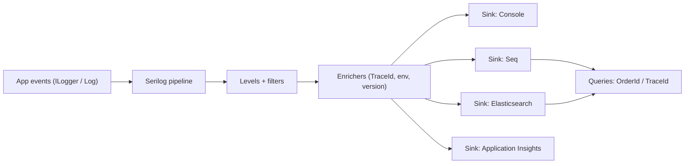

# Chapter 36: Serilog

> **Audience:** Experienced .NET developers (5+ years) preparing for an L2 (Mid/Senior) interview at a Healthcare company.
> **Scope:** Structured logging vs plain text, Serilog fundamentals (sinks, enrichers, log levels), config via code and `appsettings.json`, logging scopes and correlation, sensitive data (PHI) protection, filtering, and integration with OpenTelemetry/other sinks (Console, File, Seq, Elasticsearch, Application Insights) — the healthcare angle being searchable, PHI-safe, correlatable logs.

---

## 36.1 What Is Structured Logging and Why Serilog

### Interview Answer (30–45 seconds)

> "Structured logging stores log events as key-value properties rather than formatted strings, so you can query by fields — `ErrorCode=504`, `PatientId=...`, `OrderId=...` — instead of grep-ing text. Serilog is the de-facto .NET structured logging library: you configure a pipeline of sinks (Console, File, Seq, Elasticsearch, Application Insights), enrichers add context, and log levels control verbosity. The key API is `Log.Information("Order {OrderId} placed by {UserId}", id, user)` where `{OrderId}` and `{UserId}` become named properties, not string interpolation. In healthcare this is essential: logs become searchable for support and audits, and you can redact or omit PHI before data leaves the process."

### Detailed Explanation

**Structured vs plain text:**

| Plain text | Structured |
|---|---|
| `"Order 123 placed"` | `{ Level, Message, OrderId: 123, UserId: u9, Timestamp }` |
| Grep-reliant | Query by field |
| No aggregation | Metrics/dashboards easy |
| Context lost | Enrichers add context |

**Core concepts:**

- **Logger** — the root logger (static `Log` or injected `ILogger<T>`).
- **Sink** — where events go: Console, File, Seq, Elasticsearch, OpenTelemetry, Application Insights.
- **Enricher** — adds properties to every event (machine name, trace ID, version).
- **Levels** — `Verbose`, `Debug`, `Information`, `Warning`, `Error`, `Fatal`.
- **Message templates** — `{Property}` placeholders become structured properties.
- **Logging scopes** — `BeginScope` adds a shared property for a block (e.g., a request).

**Integration with ASP.NET Core:**

- `builder.Host.UseSerilog()` replaces the default logging.
- `ReadFrom.Configuration()` reads `appsettings.json`.
- `Enrich.WithRequestHeaders()`, `Enrich.WithExceptionDetails()`, `Enrich.FromLogContext()`.

**PHI/security concerns:**

- Never log PHI by default (Ch. 39).
- Use enrichers to add a masked or pseudonymous PatientId only when permitted.
- Sinks may carry data to external systems — enforce redaction/filtering.

### Real World Example (Healthcare)

A clinical API logs `Information` events with message templates: `"Order {OrderId} created for patient {PatientHashedId}"`. The PatientId is a one-way-hashed pseudonym, never the raw MRN. Enrichers add `TraceId`, environment, and app version to every event. Logs go to Seq and Elasticsearch, where support queries `OrderId = 123` and the audit team pulls `UserUid = u9` actions. PHI fields are filtered at the sink boundary so nothing sensitive leaves the process.

### Production Code Example

```csharp
// Program.cs — Serilog bootstrap
Log.Logger = new LoggerConfiguration()
    .MinimumLevel.Information()
    .Enrich.FromLogContext()
    .Enrich.WithMachineName()
    .Enrich.WithProperty("Application", "Clinical.Api")
    .Enrich.WithProperty("Environment", builder.Environment.EnvironmentName)
    .WriteTo.Console(outputTemplate:
        "[{Timestamp:HH:mm:ss} {Level:u3}] {Message:lj} {Properties:j}{NewLine}{Exception}")
    .WriteTo.Seq("http://seq.example.com", apiKey: seqKey)
    .WriteTo.Elasticsearch(new ElasticsearchSinkOptions(new Uri("http://es:9200"))
    {
        AutoRegisterTemplate = true
    })
    .Filter.ByExcluding(e =>
        e.Properties.TryGetValue("SourceContext", out var s) &&
        s.ToString().Contains("Microsoft.AspNetCore") &&
        e.Level < LogEventLevel.Warning)
    .CreateLogger();

builder.Host.UseSerilog();
```

```csharp
// Usage — message templates, scopes, and PHI-safe logging
app.Use(async (context, next) =>
{
    using (LogContext.PushProperty("TraceId", context.TraceIdentifier))
    using (LogContext.PushProperty("UserUid", context.User?.Identity?.Name))
    {
        await next();
    }
});

app.MapPost("/orders", async (CreateOrderRequest req, IOrderService svc, ILogger<Program> log, CancellationToken ct) =>
{
    var order = await svc.CreateAsync(req, ct);
    log.LogInformation("Order {OrderId} created for patient {PatientHashedId}",
        order.Id, HashPatientId(req.PatientId));    // no raw PHI
    return Results.Created($"/orders/{order.Id}", order);
});
```

**Key lines explained:**

- Sinks route events to multiple destinations; enrichers add global context.
- Message templates create structured properties (`{OrderId}`).
- `LogContext.PushProperty` scopes correlation fields per request.
- PHI is hashed/masked before logging — the property never carries raw PHI.

### Internal Working

- Serilog builds a logger pipeline: each event flows through minimum levels, filters, enrichers, then sinks.
- Message templates are parsed; named properties are stored in the event's property bag.
- Scopes (`LogContext`) stack properties for the duration of a scope.
- The ASP.NET Core integration routes `ILogger<T>` calls into the Serilog pipeline.

### Advantages

- Queryable, structured events → fast support and analysis.
- Rich context via enrichers and scopes.
- Many sinks — log anywhere without changing code.
- Level + filter control per environment.
- Excellent for correlation (TraceId, request scopes).
- PHI-safe with explicit property design.

### Disadvantages

- Learning curve: templates, scopes, filters, sinks.
- Over-collection if misconfigured (huge volumes, cost).
- External sinks can leak PHI if redaction is missed.
- Configuration sprawl across many sinks.
- Performance overhead (mitigate with async sinks, sampling).

### Best Practices

- Use message templates with named properties — never string interpolation for queryable fields.
- Structure from day one; define a logging policy for PHI (Ch. 39).
- Enrich every event with TraceId, environment, app version, machine.
- Scope per-request context via `LogContext`/`ILogger.BeginScope`.
- Choose sinks by environment (Console in dev, Seq/ES/AppInsights in prod).
- Use levels and filters to reduce noise; sample high-volume events.
- Log exceptions with `Log.Error(ex, "message {Prop}", ...)` to keep stack traces structured.
- Redact/mask PHI at the sink boundary; test with a PHI-check.

### Common Mistakes

- Interpolating strings instead of message templates → no queryable properties.
- Logging raw PHI/MRN by default → compliance risk.
- No enrichers → events lack correlation context.
- Logging at `Debug`/`Verbose` in prod → massive volume and cost.
- Forgetting scopes → unrelated events can't be correlated.
- Exceptions logged without the exception object → lost stack traces.
- Sink misconfiguration → sensitive data shipped to external tools.

### Interview Follow-up Questions

1. **"Structured vs plain logging?"** — Structured stores key-value properties, enabling field queries, aggregation, and correlation.
2. **"What is a message template?"** — `Log.Information("Order {Id} placed", id)` — `{Id}` becomes a structured property.
3. **"What are sinks and enrichers?"** — Sinks are destinations (Console/File/Seq/ES); enrichers add global properties.
4. **"What is a logging scope?"** — A block that adds shared properties (request TraceId) via `BeginScope`/`LogContext`.
5. **"How do you correlate logs across services?"** — Propagate a TraceId (OpenTelemetry); enrich events with it.
6. **"How do you avoid logging PHI?"** — Define fields to log, hash/pseudonymize IDs, filter at sinks, and test redaction.
7. **"How does Serilog integrate with ASP.NET Core?"** — `builder.Host.UseSerilog()`; `ILogger<T>` flows through the pipeline.
8. **"Levels and filters?"** — `MinimumLevel` + `Filter.ByExcluding/Including` per environment.
9. **"How do you reduce log volume?"** — Sampling, higher minimum levels, excluding noisy namespaces.
10. **"Serilog vs ILogger in ASP.NET Core?"** — `ILogger<T>` is the abstraction; Serilog is a provider/implementation behind it.

### Senior Level Talking Points

- **Logging as a product:** consistent schemas, correlation IDs, retention policies, dashboards.
- **Compliance:** audit trails (who/when/what), PHI redaction, no PHI in external sinks.
- **Performance:** async sinks, batching, sampling high-frequency clinical telemetry.
- **Observability stack:** Serilog sinks → Seq/Elasticsearch, plus OpenTelemetry traces (Ch. 17).
- **Error taxonomy:** structured exceptions with `ErrorCode` properties for alerting.

### Diagram



### Comparison Table

| Aspect | Serilog | Plain ILogger |
|---|---|---|
| Structure | Key-value properties | Text strings |
| Queryable | Yes | Grep only |
| Sinks | Many | Console/debug default |
| Enrichers/scopes | Rich | Limited |
| PHI control | Explicit, filterable | Manual |
| Best fit | Production observability | Minimal apps |

### Memory Trick

**"Templates structure, sinks deliver, enrichers enrich, scopes correlate."** Named `{Properties}` are queryable; never log raw PHI; add TraceId everywhere.

### Summary

Serilog brings structured, queryable, correlatable logging to .NET. Master message templates, sinks, enrichers, scopes, levels/filters, and PHI-safe design. For healthcare interviews, emphasize searchable support/audit logs and rigorous PHI redaction at the sink boundary.

### Interview Confidence Score

**Confidence: High (after this chapter).** Logging/observability is a standard L2 topic. Demonstrating structured templates, correlation, and PHI discipline — not just "it makes logs nice" — shows production maturity.

---

## Top 10 Interview Questions for This Chapter

1. What is structured logging and why is it better than plain text?
2. How do you configure Serilog in ASP.NET Core?
3. What are message templates and why not interpolate?
4. What are sinks, enrichers, and scopes?
5. How do you correlate logs across services?
6. How do you avoid logging PHI?
7. How do you control log volume?
8. What levels and filters do you use?
9. How do you log exceptions properly?
10. How does Serilog relate to `ILogger<T>`?

## Revision Notes

- Structured logging stores named properties → field-queryable.
- Message templates: `Log.Information("Order {Id} placed", id)`.
- Sinks: Console, File, Seq, Elasticsearch, AppInsights, OpenTelemetry.
- Enrichers: machine, env, version; scopes: per-request context.
- `builder.Host.UseSerilog()`; `ReadFrom.Configuration()`.
- Correlation: propagate TraceId; enrich every event.
- PHI: hash/pseudonymize IDs, filter at sinks, no raw MRN in logs.
- Levels: Verbose→Fatal; filters per environment; sample hot paths.
- Exceptions: `Log.Error(ex, "msg {Prop}", ...)` to keep stack traces.

## Things Interviewers Expect from 5+ Years Experience

- You design a logging schema and retention policy, not ad-hoc logs.
- You correlate across services with TraceId.
- You enforce PHI redaction by design and test it.
- You manage volume with levels, filters, and sampling.
- You route to the right sinks per environment.

## Cheat Sheet

```csharp
Log.Logger = new LoggerConfiguration()
    .MinimumLevel.Information()
    .Enrich.FromLogContext()
    .Enrich.WithMachineName()
    .Enrich.WithProperty("Application", "Clinical.Api")
    .WriteTo.Console()
    .WriteTo.Seq("http://seq:5341")
    .WriteTo.Elasticsearch(new ElasticsearchSinkOptions(new Uri("http://es:9200")))
    .CreateLogger();
builder.Host.UseSerilog();

// Usage
log.LogInformation("Order {OrderId} created for patient {PatientHashedId}", id, HashPatientId(pid));
using (LogContext.PushProperty("TraceId", context.TraceIdentifier)) { /* scoped */ }
log.LogError(ex, "Failed to place order {OrderId}", id);
```

## Flash Cards

**Q:** Why structured logging? **A:** Named properties → field queries, aggregation, correlation.

**Q:** What makes a message template structured? **A:** `{Name}` placeholders become queryable properties.

**Q:** What are sinks? **A:** Destinations for events: Console, File, Seq, Elasticsearch, etc.

**Q:** How do you correlate events? **A:** Enrich with a propagated TraceId via enrichers/scopes.

**Q:** How do you protect PHI in logs? **A:** Hash/pseudonymize IDs, whitelist fields, filter at sinks.

**Q:** How do you reduce volume? **A:** Higher minimum level, filters, sampling, async sinks.

---

*Continue → Chapter 37: Polly*
