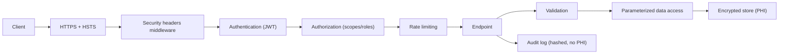

# Chapter 37: Security

> **Audience:** Experienced .NET developers (5+ years) preparing for an L2 (Mid/Senior) interview at a Healthcare company.
> **Scope:** Web application security fundamentals: OWASP Top 10, authentication/authorization (Ch. 11–12), input validation, SQL injection, XSS, CSRF, secrets management, HTTPS/TLS, data protection (at rest and in transit), logging PHI safely, security headers, and healthcare compliance (HIPAA, PHI/PII protection, least privilege, audit).

---

## 37.1 What Does a Secure ASP.NET Core App Look Like

### Interview Answer (30–45 seconds)

> "A secure ASP.NET Core app enforces security at every layer: authentication and authorization (Ch. 11–12) with least-privilege scopes; input validation to stop injection — especially SQL injection, which EF Core parameterization already prevents; output encoding and `Content-Security-Policy` headers to stop XSS; anti-CSRF tokens on state-changing requests; HTTPS/TLS everywhere with HSTS; secrets in the config system or Key Vault, never in code; and structured, PHI-safe logging. In healthcare, the stakes are higher because PHI is regulated (HIPAA): you add audit logging, encryption at rest and in transit, data minimization, and least-privilege access. Security isn't a feature — it's a set of cross-cutting practices baked into the pipeline."

### Detailed Explanation

**The OWASP Top 10 in an ASP.NET Core context:**

| Risk | Defense in .NET |
|---|---|
| Broken Access Control | Authorization policies, roles/claims, least privilege (Ch. 11) |
| Cryptographic Failures | Use ASP.NET Core Data Protection, `RSA`/`AES` correctly, secrets via config (Ch. 12) |
| Injection (SQL) | EF Core parameterization, LINQ, never string-concat SQL |
| Insecure Design | Threat modeling, validation-first design |
| Security Misconfiguration | Minimal permissions, no debug in prod, secure headers |
| Vulnerable Components | Keep packages patched; `dotnet list package --vulnerable` |
| Auth/ID Failures | ASP.NET Core Identity, password policies, lockout (Ch. 11–12) |
| Integrity Failures | Signed payloads (JWS), data integrity checks |
| Logging Failures | Audit logs without PHI, monitor anomalies (Ch. 35) |
| SSRF | Validate outbound URLs, deny internal redirects |

**Key areas in depth:**

- **Authentication & Authorization** — JWT bearer (Ch. 12), claims, policies, roles; enforce at endpoint level.
- **Input validation** — `[ApiController]` model validation (FluentValidation), data annotations, whitelist enums/ranges; reject unknown fields.
- **SQL injection** — Use LINQ/EF parameterization; never concatenate user input into SQL. Raw SQL via `FromSqlInterpolated` (parameterized).
- **XSS** — Output encoding, `Content-Security-Policy`, anti-XSS sanitization, avoid `Html.Raw`.
- **CSRF** — Anti-forgery tokens for cookie-based forms; JWT/bearer APIs are generally CSRF-safe when not cookie-authenticated.
- **HTTPS** — HTTPS redirection, HSTS, TLS 1.2+; certificates for all services.
- **Secrets management** — `appsettings.Development.json` (dev only), environment variables, Azure Key Vault; never commit secrets (Ch. 5, 38).
- **Data protection** — Encryption at rest for sensitive fields, at transit via TLS.
- **Security headers** — `X-Content-Type-Options`, `X-Frame-Options`, `Content-Security-Policy`, `Referrer-Policy`, HSTS.
- **Rate limiting** — Ch. 33 for brute-force/DoS.

**Healthcare specifics (HIPAA):**

- PHI/PII: minimize, encrypt, restrict, audit.
- Audit logs: who accessed what, when (Ch. 35).
- Least privilege + role-based access for clinical data.
- No PHI in logs, URLs, or error messages.
- Data retention and disposal policies.

### Real World Example (Healthcare)

A patient portal uses JWT bearer auth (Ch. 12) with scopes: `patient:read` for the portal, `clinician:read` for staff. All endpoints enforce authorization policies; `GET /patients/{id}` validates that the caller may access that tenant's data. The API validates all inputs (rejects invalid LOINC codes, out-of-range values). Raw SQL is never built by string concatenation. HTTPS + HSTS is forced, and a middleware sets security headers. Secrets live in Key Vault; connection strings reference the vault. Audit middleware logs every sensitive read with a hashed patient ID — no raw PHI in logs.

### Production Code Example

```csharp
// Program.cs — security hardening
builder.Services.AddHttpsRedirection(o => o.RedirectStatusCode = 307);

builder.Services.AddAntiforgery();
builder.Services.AddAuthorization(options =>
{
    options.AddPolicy("patient:read", p => p.RequireClaim("scope", "patient:read"));
    options.AddPolicy("clinician", p => p.RequireRole("clinician"));
});

app.UseHsts();
app.UseHttpsRedirection();
app.UseSecurityHeaders();        // e.g., NWebsec / manual middleware

app.Use(async (ctx, next) =>
{
    ctx.Response.Headers["X-Content-Type-Options"] = "nosniff";
    ctx.Response.Headers["X-Frame-Options"] = "DENY";
    ctx.Response.Headers["Content-Security-Policy"] = "default-src 'self'";
    ctx.Response.Headers["Referrer-Policy"] = "no-referrer";
    await next();
});
```

```csharp
// Parameterized data access — no injection
var results = await _db.Patients
    .Where(p => p.Mrn == input.Mrn)          // EF parameterizes
    .ToListAsync(ct);

var raw = await _db.Patients
    .FromSqlInterpolated($"SELECT * FROM Patients WHERE Mrn = {input.Mrn}")   // parameterized
    .ToListAsync(ct);
```

```csharp
// Secrets — config + Key Vault, never in code
builder.Configuration.AddAzureKeyVault(new Uri(vaultUri),
    new DefaultAzureCredential());

var conn = builder.Configuration.GetConnectionString("ClinicalDb");  // from vault, not code
```

**Key lines explained:**

- HTTPS/HSTS + security headers are set globally.
- Authorization policies map scopes/roles to endpoints (Ch. 11–12).
- All queries are parameterized (LINQ or `FromSqlInterpolated`).
- Connection strings come from config/Key Vault, never hardcoded.

### Internal Working

- Middleware pipeline: HTTPS redirect, security headers, authn, authz, antiforgery, rate limiting.
- The auth middleware resolves the principal; authz middleware checks policies per endpoint.
- Model validation runs during binding; invalid requests return 400/422 (Ch. 30).
- Data protection keys encrypt cookies/tokens at rest.
- EF Core parameterizes values so SQL injection is structurally prevented.

### Advantages

- Defense in depth: multiple layers fail closed.
- Framework provides battle-tested primitives (Identity, Data Protection, antiforgery).
- Standardized patterns (policies, scopes) are auditable and maintainable.
- PHI-safe design is testable and compliant-ready (HIPAA).

### Disadvantages

- Security is broad — easy to miss a vector (headers, SSRF, logging).
- Adds overhead: validation, policy setup, audits, key management.
- Misconfiguration can break legit flows (CSP, CORS, HSTS).
- Compliance (HIPAA) is ongoing: audits, training, policies, not just code.
- Dependency patching is continuous work.

### Best Practices

- Enforce authz per endpoint with scopes/policies (least privilege).
- Validate all inputs server-side; reject unknown fields (Ch. 30).
- Parameterize all SQL; never concatenate user input.
- Set security headers globally; force HTTPS + HSTS.
- Store secrets in config/Key Vault; never commit them.
- Encrypt PHI at rest and in transit; use modern ciphers.
- Log audit events without PHI; monitor for anomalies (Ch. 35).
- Keep dependencies patched (`dotnet list package --vulnerable`).
- Use Data Protection for cookies/tokens; validate JWT issuer/audience (Ch. 12).
- Rate limit auth endpoints (Ch. 33); add account lockout.

### Common Mistakes

- Relying on client-side validation only.
- String-concatenating SQL → injection.
- Committing secrets/connection strings to the repo.
- No HSTS/headers; exposing debug info in prod.
- Logging raw PHI/MRN in errors and logs.
- Missing authorization on endpoints (default-allow instead of default-deny).
- Not validating JWT issuer/audience or expiry.
- Overly permissive CORS (`Access-Control-Allow-Origin: *` with credentials).
- Ignoring dependency CVEs.

### Interview Follow-up Questions

1. **"How do you prevent SQL injection?"** — Parameterized queries (EF/LINQ or `FromSqlInterpolated`); never concatenate user input.
2. **"How do you protect against XSS?"** — Output encoding, CSP, avoid `Html.Raw`, sanitize rich input.
3. **"How does CSRF apply to APIs?"** — Cookie-based auth needs antiforgery tokens; JWT-bearer APIs are generally CSRF-safe.
4. **"Where should secrets live?"** — Config/environment for non-secret, Key Vault (or secret manager) for secrets; never in code.
5. **"What are the most important security headers?"** — HSTS, CSP, `X-Frame-Options`, `X-Content-Type-Options`, `Referrer-Policy`.
6. **"How do you enforce least privilege?"** — Scopes/roles per endpoint, tenant-aware authorization, deny-by-default.
7. **"How do you audit access to PHI?"** — Middleware logs sensitive reads with hashed IDs (no raw PHI), who/when/what.
8. **"How do you keep dependencies secure?"** — Patch cadence, `dotnet list package --vulnerable`, Dependabot/Snyk in CI.
9. **"What is SSRF and how do you prevent it?"** — Server-side request forgery: validate/allowlist outbound URLs; block internal redirects.
10. **"What does HIPAA require technically?"** — Encryption in transit/at rest, access controls, audit logs, data minimization, incident response.

### Senior Level Talking Points

- **Threat modeling** per feature (STRIDE) — design with security, not bolt-on.
- **Zero trust:** authenticate and authorize every call, encrypt in transit, least privilege.
- **Compliance program:** technical controls + policy, audits, training, incident response.
- **PHI minimization:** data flow diagrams, redaction at boundaries, retention schedules.
- **Security observability:** audit logs, alerting on anomalies, secrets rotation.
- **Supply chain:** signed images (Ch. 18–19), pinned dependencies, SAST/DAST in CI.

### Diagram



### Comparison Table

| Control | Threat | .NET mechanism |
|---|---|---|
| AuthN/AuthZ | Unauthorized access | JWT, policies, scopes (Ch. 11–12) |
| Parameterization | SQL injection | EF Core LINQ, `FromSqlInterpolated` |
| CSP/encoding | XSS | CSP header, output encoding |
| Antiforgery | CSRF | `AddAntiforgery` |
| HTTPS/HSTS | Eavesdropping | `UseHttpsRedirection`, `UseHsts` |
| Secrets mgmt | Credential leak | Config/Key Vault |
| Data protection | Token/cookie theft | `AddDataProtection` |
| Rate limiting | Brute force/DoS | Ch. 33 |
| PHI-safe logging | Data breach | Structured hashed logs (Ch. 35) |

### Memory Trick

**"AuthN, AuthZ, Validate, Encrypt, Log, Patch."** Authenticate and authorize by default; validate everything; parameterize SQL; encrypt at rest and transit; log without PHI; patch dependencies relentlessly.

### Summary

Security is a cross-cutting discipline: auth, validation, injection defense, XSS/CSRF protection, secrets management, TLS/HSTS, headers, and PHI-safe logging. For healthcare interviews, anchor answers in HIPAA-driven controls — least privilege, encryption, audit, and data minimization — and show you know the framework's built-in defenses.

### Interview Confidence Score

**Confidence: High (after this chapter).** Security questions are common at L2, especially in healthcare. Being able to map threats to framework defenses — and to compliance requirements — strongly signals senior readiness.

---

## Top 10 Interview Questions for This Chapter

1. What are the most important web application security risks and how do you defend them?
2. How do you prevent SQL injection in .NET?
3. How do you protect against XSS and CSRF?
4. Where should secrets live and why?
5. What security headers do you set and why?
6. How do you enforce least-privilege access to PHI?
7. How do you audit access without logging raw PHI?
8. How do you keep dependencies secure?
9. What is SSRF and how do you prevent it?
10. What does HIPAA require of your application?

## Revision Notes

- OWASP Top 10 mapped to .NET defenses (injection, authz, misconfig, etc.).
- SQL injection: parameterize via EF/LINQ/`FromSqlInterpolated`; never concat.
- XSS: output encoding + CSP; CSRF: antiforgery for cookie auth.
- Secrets: config/env + Key Vault; never in code.
- Headers: HSTS, CSP, `X-Frame-Options`, `X-Content-Type-Options`, `Referrer-Policy`.
- HTTPS everywhere; TLS 1.2+.
- Least privilege via scopes/roles; deny-by-default.
- Audit logs with hashed IDs (no raw PHI).
- Patch deps: `dotnet list package --vulnerable`, Dependabot.
- HIPAA: encryption, access control, audit, minimization, incident response.

## Things Interviewers Expect from 5+ Years Experience

- You threat-model features, not just apply headers.
- You defend PHI end-to-end with auditability.
- You know the framework's security primitives and their limits.
- You handle secrets, patching, and CORS deliberately.
- You can explain compliance (HIPAA) in technical terms.

## Cheat Sheet

```csharp
// HTTPS + HSTS
app.UseHsts(); app.UseHttpsRedirection();

// Headers (manual or NWebsec)
ctx.Response.Headers["X-Content-Type-Options"] = "nosniff";
ctx.Response.Headers["X-Frame-Options"] = "DENY";
ctx.Response.Headers["Content-Security-Policy"] = "default-src 'self'";

// Authz policies
options.AddPolicy("patient:read", p => p.RequireClaim("scope", "patient:read"));

// Safe SQL
_db.Patients.Where(p => p.Mrn == input.Mrn);                 // parameterized
_db.Patients.FromSqlInterpolated($"SELECT * FROM Patients WHERE Mrn = {input.Mrn}");

// Secrets
builder.Configuration.AddAzureKeyVault(new Uri(vaultUri), new DefaultAzureCredential());
```

## Flash Cards

**Q:** How do you stop SQL injection? **A:** Parameterized queries via EF/LINQ/`FromSqlInterpolated`; never concat input.

**Q:** What stops XSS? **A:** Output encoding + Content-Security-Policy.

**Q:** Where do secrets live? **A:** Config/env for non-secrets; Key Vault for secrets; never in code.

**Q:** How do you audit PHI reads? **A:** Log hashed patient IDs, who/when/what — no raw PHI.

**Q:** What does HSTS do? **A:** Tells browsers to only use HTTPS for a domain.

**Q:** CSRF with JWT bearer APIs? **A:** Generally CSRF-safe; cookie-auth forms need antiforgery tokens.

---

*Continue → Chapter 38: Healthcare Best Practices*
