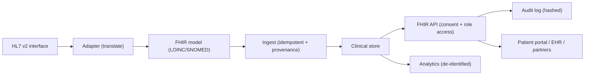

# Chapter 39: Healthcare Best Practices

> **Audience:** Experienced .NET developers (5+ years) preparing for an L2 (Mid/Senior) interview at a Healthcare company.
> **Scope:** Healthcare domain fundamentals: PHI/PII and HIPAA (US), HL7 and FHIR (interoperability), terminologies (LOINC, SNOMED CT, RxNorm, ICD-10), regulated software concerns (audit trails, data integrity, availability), privacy-preserving design (data minimization, consent, masking), healthcare integration patterns (HL7 v2, FHIR REST), and engineering practices that matter in clinical systems — the "healthcare angle" across every chapter.

---

## 39.1 What Makes Healthcare Software Different

### Interview Answer (30–45 seconds)

> "Healthcare software deals with protected health information, so privacy, security, correctness, and auditability are non-negotiable. In the US, HIPAA sets requirements: encrypt data at rest and in transit, enforce access controls, log access to PHI, and minimize the data you collect. Interoperability is driven by standards — FHIR (REST-based resources like Patient, Observation, MedicationOrder) and HL7 v2 for legacy interfaces — and by clinical terminologies like LOINC, SNOMED CT, RxNorm, and ICD-10 so data is machine-readable and comparable. And because lives are at stake, clinical data must be correct, available, and auditable: no silent data loss, strong availability (Ch. 19, 34), and a complete audit trail. As a developer I apply these as engineering practices: PHI-safe logging (Ch. 36), tenant/consent-aware access (Ch. 11), idempotent clinical writes (Ch. 31), and standards-based data modeling."

### Detailed Explanation

**PHI/PII and HIPAA (US context):**

- **PHI** — Protected Health Information: any health info linked to an individual.
- **HIPAA** — Health Insurance Portability and Accountability Act:
  - Privacy Rule: minimum necessary, patient access.
  - Security Rule: administrative, physical, technical safeguards.
  - Technical controls: encryption (in transit/at rest), access control, audit controls.
- Design implications: data minimization, least privilege, audit logs, incident response.

**Interoperability standards:**

- **HL7 v2** — legacy message standard (ADT, ORM, ORU) over TCP/MLLP.
- **FHIR (HL7)** — modern REST API standard: resources (`Patient`, `Observation`, `MedicationRequest`), operations (`$everything`, `$validate`), bundles, search.
- **IHE** — integration profiles (XDS, PIX/PDQ) for document sharing.

**Clinical terminologies:**

| Terminology | Purpose |
|---|---|
| LOINC | Lab test codes (e.g., 2339-0 = glucose) |
| SNOMED CT | Clinical concepts/terms |
| RxNorm | Medications |
| ICD-10 | Diagnosis codes |
| CPT | Procedures |

**Regulated software concerns:**

- **Audit trails** — who accessed what/when; tamper-evident logs (Ch. 36).
- **Data integrity** — no silent corruption; transactions, versioning, validation.
- **Availability** — clinical systems must be up; redundancy, health checks, failover (Ch. 19, 34).
- **Traceability** — each record has provenance (who/when/system).

**Privacy-preserving design:**

- Data minimization — only collect/retain what's needed.
- Consent — model patient consent and honor it in access logic.
- Masking/pseudonymization — hash IDs in logs, mask SSN/MRN in UI.
- De-identification for analytics.

**Healthcare integration patterns:**

- FHIR REST for modern systems; HL7 v2 adapters for legacy.
- Message brokers for async clinical events (Ch. 21–22).
- Idempotent, auditable writes.

### Real World Example (Healthcare)

A lab results system ingests HL7 v2 ORU messages from a legacy interface, translates them into FHIR `Observation` resources (mapping LOINC codes), and stores them. The API exposes FHIR search (`GET /Observation?patient=...&code=2339-0`). Access is role-based and consent-aware: a clinician can read observations only for patients in their care context. Every read of a patient resource is audit-logged with a hashed patient ID. The system is deployed as a Kubernetes Deployment with health checks (Ch. 35), and all PHI is encrypted at rest and in transit.

### Production Code Example

```csharp
// Consent-aware data access
public sealed class ObservationQueryService
{
    private readonly ClinicalDbContext _db;
    private readonly IAuthorizationService _auth;

    public async Task<IReadOnlyList<ObservationDto>> GetObservationsAsync(
        string patientId, string userId, CancellationToken ct)
    {
        var canAccess = await _auth.HasAccessAsync(userId, patientId, AccessKind.Read);
        if (!canAccess)
            return Array.Empty<ObservationDto>();      // deny without leaking existence

        var rows = await _db.Observations
            .AsNoTracking()
            .Where(o => o.PatientId == patientId)
            .OrderByDescending(o => o.EffectiveTime)
            .Select(o => new ObservationDto(o.Code, o.CodeSystem, o.Value, o.Unit, o.EffectiveTime))
            .ToListAsync(ct);

        _audit.LogAccess(new AuditEntry(userId, "Observation.Read",
            HashPatientId(patientId), rows.Count));    // hashed, no raw PHI
        return rows;
    }
}
```

```csharp
// Idempotent, standards-based create with provenance
public sealed class ObservationIngestService
{
    public async Task IngestAsync(Hl7V2Message msg, CancellationToken ct)
    {
        var fhir = Translate(msg);                     // HL7 v2 → FHIR Observation
        var key = fhir.Identifier.FirstOrDefault()?.Value;   // unique message ID

        var exists = await _db.Observations
            .AnyAsync(o => o.ExternalId == key, ct);
        if (exists) return;                            // idempotent — no duplicate

        _db.Observations.Add(new ObservationRecord
        {
            ExternalId = key,
            PatientId = fhir.Subject.Reference,
            Code = fhir.Code.Coding.First().Code,      // LOINC
            CodeSystem = "http://loinc.org",
            Provenance = new Provenance(user: "HL7-interface", source: msg.SendingFacility)
        });
        await _db.SaveChangesAsync(ct);
    }
}
```

**Key lines explained:**

- Access is consent- and role-aware; denial doesn't leak existence.
- Audit logs carry hashed IDs only.
- Translation keeps standards (FHIR) as the internal model.
- Idempotency key prevents duplicate ingest from retried messages.

### Internal Working

- Interoperability requires mapping between representations (HL7 → FHIR) with code-system translations.
- Access control sits before data access and checks role + consent + tenant context.
- Audit events are written transactionally with the data change (outbox-style, Ch. 21).
- Terminologies enable cross-system queries and analytics.

### Advantages

- Standards (FHIR/LOINC) make data interoperable and future-proof.
- Consent + audit design satisfies compliance and patient trust.
- Idempotent, provenance-tracked writes protect data integrity.
- Availability patterns keep clinical systems up.
- Clear domain vocabulary helps teams and vendors communicate.

### Disadvantages

- Compliance (HIPAA) adds process, audits, and documentation overhead.
- Terminology mapping and legacy HL7 adapters are complex.
- Availability/audit requirements raise infrastructure costs.
- Privacy constraints complicate analytics and debugging.
- Domain expertise is scarce and rules vary by region (GDPR vs HIPAA).

### Best Practices

- Model PHI boundaries explicitly: tenant, consent, role.
- Adopt FHIR as the canonical model where possible; translate legacy formats.
- Use standard terminologies (LOINC, SNOMED, RxNorm, ICD-10) for codes.
- Log audits without raw PHI; hash identifiers (Ch. 36).
- Make clinical writes idempotent with provenance (Ch. 31).
- Encrypt PHI at rest and in transit; enforce TLS (Ch. 38).
- Design for availability: health checks, redundancy, graceful degradation (Ch. 19, 34).
- Keep data minimization: don't store what you don't need.
- Maintain traceability: every record has who/when/system.

### Common Mistakes

- Logging raw PHI/MRN in errors and logs (Ch. 36, 37).
- Ignoring consent in data access — assume it's checked in the UI only.
- Storing clinical codes as free text instead of standard terminologies.
- Non-idempotent ingest → duplicates from retried messages (Ch. 21).
- No audit trail for sensitive reads.
- Treating healthcare like ordinary CRUD (availability/integrity slack).
- Using shared databases/tenants without isolation (Ch. 30).

### Interview Follow-up Questions

1. **"What is PHI and what does HIPAA require?"** — Protected health information; HIPAA requires encryption, access controls, audit, minimum necessary.
2. **"What is FHIR?"** — HL7's REST API standard: resources (Patient, Observation), search, operations.
3. **"FHIR vs HL7 v2?"** — FHIR: modern REST/JSON; HL7 v2: legacy pipe-delimited messages over MLLP. You bridge with adapters.
4. **"What are LOINC/SNOMED/RxNorm/ICD-10?"** — Standard terminologies for labs, clinical concepts, medications, diagnoses.
5. **"How do you make clinical writes safe on retry?"** — Idempotency keys + provenance; dedupe by external message ID.
6. **"How do you audit PHI access?"** — Transactional audit logs with hashed IDs; who/when/what; no raw PHI.
7. **"How do you enforce consent?"** — Model consent as data; check in access logic (not just UI) with role + tenant + consent.
8. **"How do you protect PHI in transit and at rest?"** — TLS everywhere; encryption at rest; Key Vault for secrets (Ch. 38).
9. **"How do you handle legacy HL7 interfaces?"** — Adapter services translate to FHIR internally; brokers for async (Ch. 21–22).
10. **"What engineering practices differ in healthcare?"** — Auditability, idempotency, availability, data integrity, PHI-safe logging.

### Senior Level Talking Points

- **Domain-driven, standards-based modeling:** FHIR resources as the ubiquitous language; mapping layers for legacy.
- **Compliance engineering:** controls mapped to HIPAA requirements; evidence (audits, tests) over assertions.
- **Privacy by design:** minimization, consent as a first-class concept, de-identification for analytics.
- **Reliability for clinical workflows:** availability SLOs, zero-downtime deploys, graceful degradation (Ch. 19, 34).
- **Interop strategy:** phased adoption of FHIR with HL7 adapters; terminology governance.
- **Data lifecycle:** retention, disposal, and regional regulation (HIPAA vs GDPR).

### Diagram



### Comparison Table

| Concern | Healthcare requirement | Engineering response |
|---|---|---|
| Privacy | PHI protection (HIPAA) | Encryption, least privilege, minimization |
| Interoperability | HL7/FHIR, terminologies | FHIR model, LOINC/SNOMED mapping |
| Integrity | No silent data loss | Transactions, idempotency, provenance |
| Audit | Who/when/what | Transactional audit logs, hashed IDs |
| Availability | Clinical systems must be up | Health checks, redundancy, graceful degradation |
| Consent | Patient-directed access | Consent model enforced in access logic |

### Memory Trick

**"PHI-safe, standards-based, idempotent, auditable, available."** Five pillars of healthcare engineering: protect the data, speak the standards (FHIR/LOINC), never duplicate a clinical write, log who touched what (hashed), and keep the system up.

### Summary

Healthcare software adds hard requirements: PHI protection (HIPAA), interoperability (HL7/FHIR + terminologies), data integrity, auditability, and availability. For interviews, show how you translate these into engineering practice: consent-aware access, idempotent provenance-tracked writes, PHI-safe logging, encryption, and reliability patterns.

### Interview Confidence Score

**Confidence: High (after this chapter).** For a healthcare company interview, this is your differentiator. Speaking fluently about FHIR, LOINC, HIPAA controls, and consent/audit engineering will resonate strongly.

---

## Top 10 Interview Questions for This Chapter

1. What is PHI and what does HIPAA require technically?
2. What is FHIR and how is it different from HL7 v2?
3. What are LOINC, SNOMED CT, RxNorm, and ICD-10?
4. How do you protect PHI in your application?
5. How do you make clinical data ingestion idempotent?
6. How do you audit access to patient data without leaking PHI?
7. How do you model and enforce patient consent?
8. How do you integrate with legacy HL7 interfaces?
9. What availability guarantees do clinical systems need?
10. How do you handle data minimization and retention?

## Revision Notes

- PHI = protected health information; HIPAA: privacy + security rules.
- Controls: encryption (transit/at rest), access control, audit, minimum necessary.
- Interoperability: FHIR (REST resources), HL7 v2 (legacy messages), IHE profiles.
- Terminologies: LOINC (labs), SNOMED CT (concepts), RxNorm (meds), ICD-10 (diagnoses).
- Consent-aware, role-based, tenant-scoped access — enforced server-side.
- Idempotent ingest (external message ID) + provenance on every record.
- Audit logs with hashed identifiers; transactional with data changes.
- Availability: health checks, redundancy, graceful degradation (Ch. 19, 34).
- Data minimization, de-identification for analytics, retention policies.
- Encrypt PHI everywhere; never log raw PHI.

## Things Interviewers Expect from 5+ Years Experience

- You translate compliance into concrete engineering (controls, tests, evidence).
- You speak standards: FHIR resources, terminology mapping, legacy adapters.
- You design privacy-in by default (consent, minimization, masking).
- You treat clinical data integrity and availability as first-class.
- You can articulate regional differences (HIPAA vs GDPR).

## Cheat Sheet

```
Standards:
  FHIR      -> resources (Patient, Observation, MedicationRequest), REST search
  HL7 v2    -> legacy pipe messages (ADT/ORM/ORU) over MLLP; bridge with adapters
  LOINC     -> lab test codes        (2339-0 = glucose)
  SNOMED CT -> clinical concepts
  RxNorm    -> medications
  ICD-10    -> diagnoses

Practices:
  - Access = role + consent + tenant, enforced in service code
  - Writes  = idempotent (external ID) + provenance (who/when/system)
  - Audits  = transactional, hashed patient ID, no raw PHI
  - Data    = encrypt at rest/transit; minimize; retain per policy
  - Ops     = health checks, redundancy, graceful degradation
```

## Flash Cards

**Q:** What does HIPAA require technically? **A:** Encryption, access control, audit controls, minimum necessary.

**Q:** What is FHIR? **A:** HL7's REST/JSON standard for clinical resources (Patient, Observation...).

**Q:** What is LOINC used for? **A:** Lab test codes — machine-readable test identification.

**Q:** How do you make ingest idempotent? **A:** Dedupe by external message ID; add provenance.

**Q:** How do you audit without leaking PHI? **A:** Hash the patient ID in logs; record who/when/what.

**Q:** Why standards/terminologies? **A:** Interoperability — data is comparable and shareable across systems.

---

*Continue → Chapter 40: Common Interview Coding Problems*
