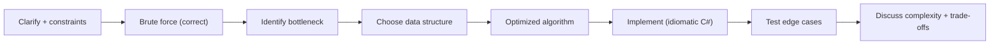

# Chapter 40: Common Interview Coding Problems

> **Audience:** Experienced .NET developers (5+ years) preparing for an L2 (Mid/Senior) interview at a Healthcare company.
> **Scope:** The coding-interview format (think → brute force → optimize → test), classic algorithms in C# (two pointers, sliding window, hashing, recursion/backtracking, dynamic programming, binary search, graph traversals, trees), .NET-specific problem areas (string/`StringBuilder`, LINQ performance, `Span<T>`, collections, Ch. 5), and healthcare-flavored problems (scheduling, triage queues, HL7 parsing, FHIR search pagination). Each problem: Problem Statement → Approach & Complexity → Production-Grade C# Solution → Edge Cases → Follow-up.

---

## 40.1 How to Approach a Coding Interview Problem

### Interview Answer (30–45 seconds)

> "My approach is: restate the problem and clarify assumptions; start with a brute-force solution to show I understand the problem; then optimize with the right data structure or algorithm, explaining the complexity trade-off; implement cleanly in C# using idiomatic constructs; and finally test with edge cases — empty input, duplicates, large inputs, and the constraints in the problem. I also think aloud about correctness and complexity as I go, since the interviewer wants to see the reasoning, not just the final code."

### Detailed Explanation

**The structured process:**

1. **Clarify** — inputs, constraints, edge cases, expected output format.
2. **Brute force** — the simplest correct solution; state its complexity.
3. **Optimize** — identify the bottleneck; pick a data structure/algorithm.
4. **Implement** — clean, idiomatic C#, named variables, small helpers.
5. **Test** — run through examples and edge cases; verify invariants.
6. **Discuss** — time/space complexity, trade-offs, follow-ups.

**Common techniques in C#:**

| Technique | Use | C# tools |
|---|---|---|
| Two pointers | Sorted arrays, palindromes, linked lists | arrays, `Span<T>` |
| Sliding window | Subarrays/substrings with constraints | `Queue`, indices |
| Hash map/set | Lookup, dedupe, frequency | `Dictionary<TKey,TValue>`, `HashSet<T>` |
| Sorting | Preprocessing | `Array.Sort`, LINQ `OrderBy` |
| Binary search | Sorted data, search boundaries | `Array.BinarySearch` |
| Recursion/backtracking | Permutations, subsets, trees | recursion, `Stack` |
| Dynamic programming | Overlapping subproblems | arrays/memoization |
| Graph BFS/DFS | Connectivity, shortest path | `Queue`, `Stack`, `HashSet` |
| Trees | Hierarchy, traversal | `TreeNode`, recursion/stack |
| Priority queue | Top-K, scheduling, triage | `PriorityQueue<TElement,TPriority>` |

**.NET performance notes:**

- Prefer `StringBuilder` over repeated string concatenation.
- Use `Span<T>`/`Memory<T>` for hot string/byte processing (Ch. 3).
- Avoid LINQ in tight loops when micro-optimizing; it allocates.
- Prefer `foreach` over indexed loops unless you need the index.

**Healthcare-flavored problems** often map to these patterns:

- Triage/priority scheduling → priority queue.
- Appointment conflict detection → interval/overlap.
- HL7 message parsing → string/`Span` processing.
- FHIR search pagination → window/partition.

---

## Problem 1: Triage Queue (Priority Queue)

### Problem Statement

Given a stream of patients with a severity score (1–5, higher = more urgent) and arrival time, implement a system that processes patients in severity order, breaking ties by earliest arrival (FIFO). Return the processing order.

**Expected:** O(n log n) time, O(n) space.

### Approach & Complexity

- Brute force: sort by (severity desc, arrival asc) — O(n log n), fine offline.
- Streaming/online: `PriorityQueue<Patient, (int Severity, long Seq)>` with a monotonically increasing sequence as the FIFO tie-breaker — O(log n) per enqueue/dequeue.
- Complexity: enqueue O(log n), dequeue O(log n), space O(n).

### Production-Grade C# Solution

```csharp
public sealed class TriageQueue
{
    private readonly PriorityQueue<Patient, (int Severity, long Seq)> _queue = new();
    private long _seq;

    public void Enqueue(Patient patient)
    {
        // Higher severity first; earlier arrival (lower seq) first within the same severity
        _queue.Enqueue(patient, (-patient.Severity, _seq++));
    }

    public Patient? Dequeue()
        => _queue.TryDequeue(out var p, out _) ? p : null;

    public record Patient(string Id, int Severity, DateTime ArrivedAt);
}

// Usage
var triage = new TriageQueue();
triage.Enqueue(new("P-1", 2, now));
triage.Enqueue(new("P-2", 5, now.AddSeconds(1)));   // most urgent
triage.Enqueue(new("P-3", 5, now.AddSeconds(2)));   // same severity, after P-2
var next = triage.Dequeue();   // P-2
```

### Edge Cases

- Empty queue → `Dequeue` returns null.
- Ties in severity → FIFO via the sequence number.
- Very large streams → bounded by queue capacity; consider limits (Ch. 34).

### Follow-up

- "How would you scale this across instances?" — A distributed queue/broker (Ch. 21–22) with a priority field.
- "What if severity changes after enqueue?" — Re-enqueue with a new key, or use a lazy-deletion pattern.

---

## Problem 2: Merge Appointment Intervals (Sorting + Sweep)

### Problem Statement

Given a list of `[start, end]` appointment intervals (already per clinician), merge overlapping intervals and return the merged list. Example: `[1,3],[2,6],[8,10],[15,18]` → `[1,6],[8,10],[15,18]`.

**Expected:** O(n log n) time, O(n) space (or O(1) in-place).

### Approach & Complexity

- Brute force: for each interval check all others — O(n²).
- Optimized: sort by start; sweep, merging when `next.start <= current.end`.
- Complexity: O(n log n) for sorting + O(n) sweep; space O(n) for result.

### Production-Grade C# Solution

```csharp
public static int[][] Merge(int[][] intervals)
{
    if (intervals.Length <= 1) return intervals;

    Array.Sort(intervals, (a, b) => a[0].CompareTo(b[0]));
    var result = new List<int[]> { intervals[0] };

    foreach (var interval in intervals[1..])
    {
        var last = result[^1];
        if (interval[0] <= last[1])                 // overlap → extend
            last[1] = Math.Max(last[1], interval[1]);
        else
            result.Add(interval);                   // disjoint → new interval
    }
    return result.ToArray();
}
```

### Edge Cases

- Empty or single interval.
- One interval fully contained in another.
- Touching boundaries (`[1,3],[3,5]`) — decide policy (merge if `<=`, keep separate if `<`).
- Unsorted input.

### Follow-up

- "What if you need to check appointment conflicts, not merge?" — Sort by start; check `next.start < current.end`.
- "How would you find free slots?" — Sweep gaps between merged intervals.

---

## Problem 3: Longest Substring Without Repeating Characters (Sliding Window)

### Problem Statement

Given a string `s`, return the length of the longest substring without repeating characters. Example: `"abcabcbb"` → `3` (`"abc"`).

**Expected:** O(n) time, O(min(n, charset)) space.

### Approach & Complexity

- Brute force: all substrings, check uniqueness — O(n²).
- Optimized: sliding window with a `Dictionary<char, int>` tracking the last index of each char; shrink the window when a repeat is found.
- Complexity: O(n); space O(k) where k = distinct characters.

### Production-Grade C# Solution

```csharp
public static int LengthOfLongestSubstring(string s)
{
    var lastSeen = new Dictionary<char, int>();
    var left = 0;
    var max = 0;

    for (var right = 0; right < s.Length; right++)
    {
        var c = s[right];
        if (lastSeen.TryGetValue(c, out var prev) && prev >= left)
            left = prev + 1;                        // move window past the duplicate

        lastSeen[c] = right;
        max = Math.Max(max, right - left + 1);
    }
    return max;
}
```

### Edge Cases

- Empty string → 0.
- All unique characters → full length.
- Single repeated character → 1.
- Very large strings → O(n), no nested loops.

### Follow-up

- "How would you also return the substring?" — Track `(left, right)` at max.
- "What about counting distinct windows or k-distinct variants?" — Extend the window to allow k distinct characters.

---

## Problem 4: Binary Search on Sorted Data (Search & Bounds)

### Problem Statement

Given a sorted array of integers, implement `IndexIfExists` returning the index or `-1`, and `FirstGreaterOrEqual` returning the first index whose value is ≥ target (lower bound).

**Expected:** O(log n) time, O(1) space.

### Approach & Complexity

- Brute force: linear scan — O(n).
- Optimized: binary search narrowing `[lo, hi]`.
- Complexity: O(log n), O(1).

### Production-Grade C# Solution

```csharp
public static int IndexIfExists(int[] arr, int target)
{
    var lo = 0; var hi = arr.Length - 1;
    while (lo <= hi)
    {
        var mid = lo + (hi - lo) / 2;       // avoid overflow
        if (arr[mid] == target) return mid;
        if (arr[mid] < target) lo = mid + 1;
        else hi = mid - 1;
    }
    return -1;
}

public static int FirstGreaterOrEqual(int[] arr, int target)
{
    var lo = 0; var hi = arr.Length;
    while (lo < hi)
    {
        var mid = lo + (hi - lo) / 2;
        if (arr[mid] < target) lo = mid + 1;
        else hi = mid;
    }
    return lo;                              // arr.Length if none
}
```

### Edge Cases

- Empty array → `-1` / `0`.
- Target smaller than all → lower bound = 0; larger than all → arr.Length.
- Duplicates → lower bound finds the first occurrence.

### Follow-up

- "Why `lo + (hi - lo) / 2`?" — Prevents `int` overflow for large arrays.
- "How do you find the last occurrence?" — Upper bound variant (`arr[mid] <= target`).

---

## Problem 5: Top-K Frequent Elements (Hash Map + Heap)

### Problem Statement

Given an integer array, return the `k` most frequent elements. Example: `[1,1,1,2,2,3]`, `k=2` → `[1,2]`.

**Expected:** O(n log k) time, O(n) space.

### Approach & Complexity

- Brute force: count then sort by frequency — O(n log n).
- Optimized: `Dictionary` counts + a min-`PriorityQueue` of size k.
- Complexity: O(n log k); space O(n).

### Production-Grade C# Solution

```csharp
public static int[] TopKFrequent(int[] nums, int k)
{
    var counts = new Dictionary<int, int>();
    foreach (var n in nums)
        counts[n] = counts.GetValueOrDefault(n) + 1;

    var minHeap = new PriorityQueue<int, int>();
    foreach (var (num, count) in counts)
    {
        minHeap.Enqueue(num, count);                 // min-heap by frequency
        if (minHeap.Count > k) minHeap.Dequeue();    // keep only the k largest
    }
    return minHeap.UnorderedItems.Select(e => e.Element).ToArray();
}
```

### Edge Cases

- `k == counts.Count` → all elements.
- All same frequency → any k is valid.
- Large n → O(n log k) avoids full sort.

### Follow-up

- "How would you do this in O(n)?" — Quickselect (partition) — average O(n).
- "What if values are huge/strings?" — The dictionary works for any hashable type.

---

## Problem 6: Validate a Binary Search Tree (Tree + Recursion)

### Problem Statement

Given the root of a binary tree, determine if it is a valid BST: for every node, all left values < node and all right values > node, recursively.

**Expected:** O(n) time, O(height) space.

### Approach & Complexity

- Naive: check subtrees only against the parent — fails for nested constraints.
- Correct: pass down `min`/`max` bounds from the ancestors (or use in-order traversal expecting sorted order).
- Complexity: O(n); space O(h) for recursion.

### Production-Grade C# Solution

```csharp
public static bool IsValidBst(TreeNode? root)
    => IsValidBst(root, long.MinValue, long.MaxValue);

private static bool IsValidBst(TreeNode? node, long lo, long hi)
{
    if (node is null) return true;
    if (node.Val <= lo || node.Val >= hi) return false;
    return IsValidBst(node.Left, lo, node.Val) &&
           IsValidBst(node.Right, node.Val, hi);
}

public sealed class TreeNode
{
    public int Val;
    public TreeNode? Left;
    public TreeNode? Right;
    public TreeNode(int val) => Val = val;
}
```

### Edge Cases

- `int.MinValue`/`int.MaxValue` nodes → use `long` bounds to avoid overflow.
- Duplicates → invalid if strict BST (`<=`/`>=` reject).
- Skewed (linked-list-like) trees → deep recursion (consider an iterative stack).

### Follow-up

- "In-order traversal approach?" — Collect values in-order and verify strictly increasing — O(n).
- "How do you handle very deep trees?" — Iterative traversal with an explicit stack.

---

## Interview Follow-up Questions

1. **"How do you approach an unfamiliar problem?"** — Clarify, brute force, optimize, implement, test — always state complexity.
2. **"When do you use a priority queue?"** — Top-K, scheduling, triage, anytime you need the min/max repeatedly (Ch. 5).
3. **"When is a hash map the right choice?"** — Lookup/dedupe/frequency; when you trade space for O(1) access.
4. **"How do you choose between recursion and iteration?"** — Recursion for tree/graph clarity; iteration (stack/queue) when depth is unbounded or stack overflow is a risk.
5. **"How do you handle large inputs in C#?"** — Avoid O(n²); use `StringBuilder`, `Span<T>`, minimal allocations, and the right collections.
6. **"How would you test your solution?"** — Example cases, edge cases (empty, duplicates, bounds), and invariants.

## Senior Level Talking Points

- **Explain trade-offs aloud:** memory vs time, sorting vs heap, recursion vs iteration.
- **Production considerations:** allocations, `Span<T>` for hot parsing, `PriorityQueue` in .NET 6+.
- **Domain mapping:** map patterns to healthcare (triage = heap, appointment conflicts = intervals, HL7 parsing = sliding window/`Span`).
- **Testing mindset:** boundary and invariant testing, not just happy path.

## Diagram



## Comparison Table

| Pattern | Data structure | Complexity | Healthcare example |
|---|---|---|---|
| Two pointers | Array/`Span` | O(n) | Palindrome checks |
| Sliding window | Indices/queue | O(n) | HL7 segment parsing |
| Hashing | `Dictionary`/`HashSet` | O(n) | Dedupe clinical messages |
| Sorting | Array | O(n log n) | Merge appointments |
| Binary search | Array | O(log n) | FHIR code lookup |
| Heap | `PriorityQueue` | O(n log k) | Triage queue |
| Tree traversal | Stack/recursion | O(n) | Diagnosis hierarchy |
| DP/memo | Array | O(n·k) | Scheduling optimization |

## Memory Trick

**"Clarify → brute → optimize → code → test."** Pick the pattern from the shape of the problem: uniqueness → hash, ordering → sort/binary search, urgency → heap, subarray constraints → sliding window, hierarchy → tree.

## Summary

Coding interviews test problem-solving as much as syntax. Master the core patterns in C# (two pointers, sliding window, hashing, sorting, binary search, heaps, trees, DP) with clean, idiomatic implementations, always stating complexity and testing edge cases. For healthcare, map patterns to clinical problems — triage, appointment conflicts, HL7 parsing, FHIR search.

### Interview Confidence Score

**Confidence: Medium→High (with practice).** Coding problems are formulaic once you've drilled the patterns. Practicing each pattern with the C# idioms in this chapter will make live interviews feel routine.

---

## Top 10 Practice Problems (in order of frequency)

1. Two Sum (hash map) — O(n).
2. Valid Parentheses (stack).
3. Merge Intervals (sort + sweep).
4. Longest Substring Without Repeating Characters (sliding window).
5. Top-K Frequent Elements (heap).
6. Validate Binary Search Tree (tree recursion with bounds).
7. Binary Search / Lower Bound (search patterns).
8. Reverse a Linked List (in-place pointers).
9. Clone Graph (BFS/DFS with visited map).
10. Fibonacci / Climbing Stairs (DP memo).

## Revision Notes

- Process: clarify → brute force → optimize → implement → test → discuss.
- Key patterns: two pointers, sliding window, hashing, sorting, binary search, heap, trees, DP, graph.
- State time/space complexity after every solution.
- Idiomatic C#: `StringBuilder`, `Span<T>`, `PriorityQueue`, LINQ judiciously.
- Edge cases: empty, single element, duplicates, overflow, deep recursion.
- Healthcare mapping: triage (heap), intervals (merge), HL7 (parsing), FHIR (search).

## Things Interviewers Expect from 5+ Years Experience

- You think aloud and iterate from brute force to optimal.
- You know your language's idioms and can discuss allocation/performance.
- You test edge cases and invariants without prompting.
- You connect patterns to real (healthcare) problems.
- You discuss trade-offs (space vs time, heap vs sort).

## Cheat Sheet

```csharp
// Hash map lookup
var map = new Dictionary<int, int>();
map.TryGetValue(k, out var v);

// Sliding window template
int left = 0;
for (int right = 0; right < s.Length; right++)
{
    // expand
    while (invalid) left++;       // shrink
    best = Math.Max(best, right - left + 1);
}

// Binary search template (lower bound)
int lo = 0, hi = arr.Length;
while (lo < hi) { int mid = lo + (hi - lo) / 2;
    if (arr[mid] < target) lo = mid + 1; else hi = mid; }

// Priority queue (min-heap by priority)
var pq = new PriorityQueue<int, int>();   // key, priority
pq.Enqueue(item, priority); pq.TryDequeue(out var item, out _);
```

## Flash Cards

**Q:** When is a hash map the right tool? **A:** O(1) lookup, dedupe, frequency counting — trade space for time.

**Q:** Two Sum optimal approach? **A:** One pass; store complement in a `Dictionary`.

**Q:** When do you use a priority queue? **A:** Repeated min/max: top-K, triage, scheduling.

**Q:** Why `lo + (hi - lo) / 2`? **A:** Avoids integer overflow on `(lo + hi)`.

**Q:** BST validation key idea? **A:** Propagate min/max bounds down; not just parent comparison.

**Q:** What's the sliding window cost? **A:** O(n) with two pointers; each element visited once.

---

*Continue → Chapter 41: System Design*
