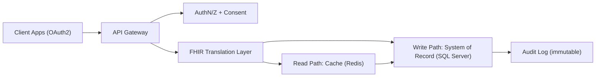
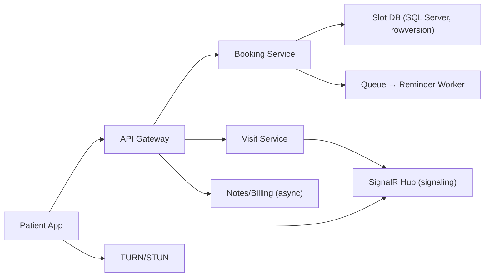
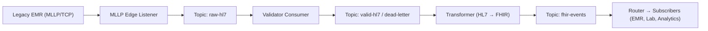
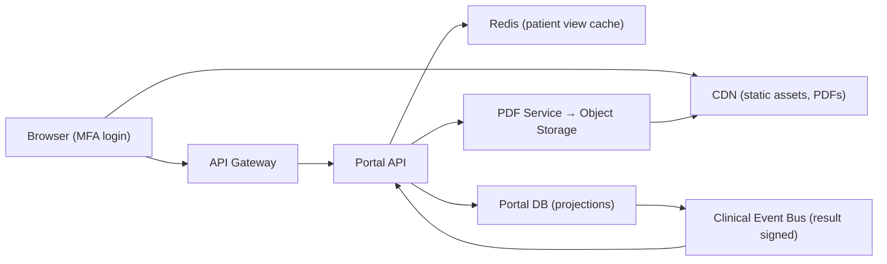
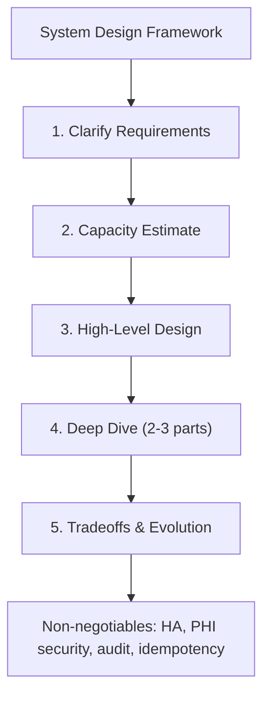

# Chapter 41: System Design

> **Audience:** Experienced .NET developers (5+ years) preparing for an L2 (Mid/Senior) interview at a Healthcare company.
> **Scope:** The system design interview — a structured framework (requirements, capacity, APIs, data, scaling, tradeoffs), the classic patterns (vertical/horizontal scaling, caching, queues, database choices, CDN, monitoring), and full worked examples of healthcare-relevant designs (FHIR API gateway, telemedicine platform, HL7 message pipeline, patient portal) with back-of-envelope math and tradeoff analysis.

---

## 41.1 How to Approach a System Design Interview

### Interview Answer (30–45 seconds)

> "I treat system design as a structured conversation, not a trivia answer. First I clarify functional and non-functional requirements — what the system must do, and what it must achieve in scale, latency, availability, and compliance. Healthcare always adds non-functional constraints: HIPAA, auditability, and patient safety. Then I do back-of-envelope capacity math to size the design. From there I sketch the high-level architecture — clients, API gateway, services, databases, caches, queues — and go deep on the 2–3 components that matter most. Finally I discuss tradeoffs: what we gave up, how we'd evolve it, and how it fails. The goal is a clear, defensible architecture with explicit decisions."

### Detailed Explanation

**The framework (memorize it):**

1. **Clarify requirements** — functional (what it does) and non-functional (scale, latency, availability, security, compliance).
2. **Estimate capacity** — users, requests per second, data volume, storage growth, bandwidth.
3. **High-level design** — components and their responsibilities; draw the data flow.
4. **Deep dive** — the 2–3 hardest parts (the ones the interviewer hints at).
5. **Tradeoffs & evolution** — what you'd change at 10x scale, failure modes, cost.

**What interviewers look for:**

- Structured thinking over a "correct" answer (there is no single answer).
- Back-of-envelope math that drives real decisions (cache size, shard count).
- Awareness of tradeoffs — every choice costs something.
- Operational maturity: monitoring, alerting, retries, graceful degradation.
- In healthcare: compliance (HIPAA/GDPR), audit, and safety framing.

**Key sizing heuristics:**

- 1 request/day → per-second rate = daily / 86,400.
- DAU ≈ MAU × 0.2–0.3; concurrent online ≈ DAU × 0.1–0.2.
- Read-heavy vs write-heavy ratio (typical: 10:1 reads).
- Storage: rows × bytes per row; add index overhead (~1.5–2x).
- Cache hit rate target: 80–95% for hot reads.

**Component vocabulary:**

| Component | Role | When you need it |
|---|---|---|
| Load balancer | Distribute traffic | >1 server, HA required |
| API gateway | Auth, routing, rate limiting | Microservices, external exposure |
| CDN | Cache static/edge content | Global users, static assets |
| Cache (Redis) | Fast reads | Hot data, high read QPS |
| Message queue | Async decoupling | Bursty writes, slow downstream |
| Database | Durable storage | Always |
| Object storage | Blobs/files | Images, PDFs, DICOM |
| Search index | Full-text | Text search at scale |

---

## Problem 1: FHIR API Gateway (Patient Data API)

### Problem Statement

Design an API platform that lets clinics, apps, and third parties read and write patient data via FHIR (Fast Healthcare Interoperability Resources) — `Patient`, `Observation`, `Condition`, `Encounter` resources — backed by a hospital system of record.

### Requirements

- **Functional:** CRUD on FHIR resources, search (`?patient=...&code=LOINC-1234`), OAuth2 client credentials for apps, audit every request.
- **Non-functional:** 5k authenticated reads/sec peak, p95 latency < 200 ms, 99.95% availability, PHI at rest and in transit encrypted, full audit trail (who accessed whose record).

### Approach & Complexity

- Map FHIR to internal domain: gateway translates external FHIR to internal contracts and back (FHIR is a wire format, not your domain model).
- Reads are cacheable when authorized per-patient; writes go to the system of record.
- OAuth2 + scopes gate every resource; consent management (patient grants) filters access.
- Audit: every read/write logged with user, patient, resource, timestamp — immutable log.

### Back-of-Envelope

- 5k reads/sec × 8 KB avg response = 40 MB/s egress at peak.
- 30M patient records × 4 KB core = 120 GB core table + indexes ≈ 250 GB.
- Audit: 5k reads/sec × 1.5 KB = 7.5 MB/s → 650 GB/day → needs a log sink (Kafka → cold storage), not a relational DB.

### High-Level Architecture



### Deep Dive: Read Path with Consent + Audit

- Request carries JWT (Ch. 12) with scopes (`patient/Observation.read`).
- Consent service checks the patient hasn't revoked access; deny before hitting cache.
- Hot resources served from Redis (TTL 60s) keyed by `patientId + resource + version` — cache invalidation on write via direct Redis delete.
- Miss → system of record → translate → cache → audit asynchronously via queue.

### Tradeoffs

- **Synchronous vs async audit:** async audit (queue) keeps p95 low but risks losing entries on crash → compensate with a Kafka producer + at-least-once and a reconciliation job.
- **Cache vs freshness:** clinical data must be current — short TTL + write-through deletion beats long TTLs; document a maximum staleness SLA.
- **FHIR versioning:** support R4 primary, translate legacy DSTU2 → R4 at the gateway.

---

## Problem 2: Telemedicine / Video Visit Platform

### Problem Statement

Design a platform for patients to book, join, and complete video visits with clinicians, including scheduling, reminders, chat, notes, and billing events.

### Requirements

- **Functional:** appointment booking, video/audio session, pre-visit questionnaires, provider notes (structured), billing codes generated, patient reminders (SMS/email).
- **Non-functional:** 10k concurrent video sessions, 1M MAU, visit latency < 300 ms end-to-end for signaling, PHI everywhere, 99.99% availability (a broken visit is a missed consult).

### Approach & Complexity

- **Real-time plane** (WebRTC signaling via SignalR, Ch. 23) vs **async plane** (booking, notes, billing via queues).
- WebRTC handles media peer-to-peer (TURN relay for NAT traversal); your servers only do signaling + session lifecycle.
- Booking is a distributed scheduling problem — a slot is a scarce resource → optimistic concurrency on the slot row (rowversion) + retry.
- Reminders and follow-ups are background jobs (Ch. 25) with idempotent delivery.

### Back-of-Envelope

- 1M MAU, 5% book per day = 50k bookings/day ≈ 0.6/sec sustained, 5/sec peak.
- 10k concurrent sessions × ~1 kbps signaling = trivial; the heavy plane is WebRTC media which flows P2P, not through your servers (TURN only when NAT blocks).
- Notes: 50k/day × 20 KB = 1 GB/day → object storage + a search index.

### High-Level Architecture



### Deep Dive: Slot Booking Concurrency

- Two patients grab the last 9:00 slot simultaneously → race.
- Solution: `UPDATE Slot SET BookedBy=@p WHERE Id=@id AND BookedBy IS NULL` (atomic conditional update). Rowcount 0 = lost → return "slot taken" and suggest alternatives.
- Alternatively optimistic concurrency via rowversion on the slot row + `DbUpdateConcurrencyException` retry (Ch. 28, Ch. 37).

### Tradeoffs

- **P2P media vs SFU (Selective Forwarding Unit):** P2P is cheap but dies on some networks; SFU relays media through servers — reliable but bandwidth-costly. Start P2P + TURN, graduate to SFU at scale.
- **Synchronous booking vs queue:** booking must be synchronous (user waits for confirmation); notes/billing can be async — split the planes.
- **Consent for recording:** if visits are recorded, storage is PHI → encrypt, tag retention (e.g., 30 days then purge per policy).

---

## Problem 3: HL7 v2 Message Pipeline (Integration Hub)

### Problem Statement

Design an integration hub that ingests HL7 v2 messages (ADT admit/discharge/transfer, ORM orders, ORU results) from legacy hospital systems, validates, transforms, and routes them to subscribers (EMR, lab, analytics), at hospital throughput.

### Requirements

- **Functional:** accept HL7 v2 over MLLP/TCP and HTTPS, validate (syntax + business rules), transform to FHIR or internal models, route to N subscribers, dead-letter unprocessable messages.
- **Non-functional:** 2k messages/sec peak, each message delivered exactly-once-ish (at-least-once + idempotency), 99.95% availability, no message loss (clinical results!).

### Approach & Complexity

- **Kafka (Ch. 22) as the backbone** — durable log, replayable, partitioned by `MSH-10` (message control ID) for ordering per patient.
- Ingest → validate → transform → route is a pipeline of consumers; each stage is a Kafka topic boundary.
- MLLP is TCP with a block framing — a connection-oriented listener that must ack (MSA segment) synchronously; use it only at the edge, convert to Kafka immediately.
- **Idempotency:** consumers dedupe by `MSH-10` + sending system in a state store to make at-least-once delivery feel like exactly-once.

### Back-of-Envelope

- 2k msg/sec × 2 KB avg = 4 MB/s ingress ≈ 340 GB/day → 7-day retention ≈ 2.4 TB in Kafka; compress (lz4/gzip) to ~30–40% → ~1 TB.
- Partition count: 2k/sec ÷ 50 MB/s per partition throughput → well under a dozen partitions; size for 2–3x growth → 16 partitions.
- Dead-letter backlog: assume 0.5% bad → 10/sec to DLQ, replayable manually.

### High-Level Architecture



### Deep Dive: Exactly-Once Semantics

- Kafka gives at-least-once by default; consumers must be idempotent.
- Store processed `MSH-10` keys (compact Kafka topic or a dedupe cache with TTL) — on message replay, check-and-skip.
- Transformers write output with the same message key so retries don't duplicate downstream side effects (idempotent POST to subscribers).

### Tradeoffs

- **Kafka vs RabbitMQ (Ch. 21):** Kafka wins for replayable, ordered, high-throughput event logs; RabbitMQ suits low-latency, complex routing. For an integration hub, Kafka.
- **Synchronous ack vs async pipeline:** MLLP requires an ack to the sender — the edge listener acks once the message is durably in Kafka (not after subscribers process) to avoid blocking the legacy system.
- **Transform at edge vs downstream:** translate to FHIR once centrally (canonical model) so subscribers get one format; subscribers that need raw HL7 consume the raw topic directly.

---

## Problem 4: Patient Portal (Read-Heavy Web App)

### Problem Statement

Design a patient portal where patients log in, view results, labs, medications, messages from providers, and download visit summaries as PDFs.

### Requirements

- **Functional:** secure login (MFA), view test results with clinician comments, download PDFs, receive notifications, message providers.
- **Non-functional:** 5M patients, 50M portal visits/month, reads 50:1 over writes, p95 < 300 ms, PHI, results visible per release policy (never leak a lab before the clinician signs it).

### Approach & Complexity

- **Read-heavy** → cache aggressively, denormalize the portal view, use projections rather than hitting the clinical OLTP.
- **Release policy is the hard part:** a lab result becomes visible only after a clinician reviews/signs it — model that as a domain event that triggers cache refresh + notification.
- PDFs are generated once (template + data), cached, served from object storage via CDN with signed URLs.

### Back-of-Envelope

- 50M visits/month ÷ 30 days ÷ 86,400 sec ≈ 19 req/sec average; peak (evening) ~5x → ~100 req/sec. Trivial for one app tier — the win is cache hit rate, not raw throughput.
- Portal view per patient ≈ 50 KB → caching 1M active patients' views ≈ 50 GB → fits in a Redis cluster.
- PDFs: 1M downloads/month × 300 KB = 300 GB/month → CDN edge caching cuts origin load.

### High-Level Architecture



### Deep Dive: Result Release Policy

- Lab posts result → `ResultAvailable` event → clinician must sign → `ResultSigned` event → only then does the portal cache refresh and the patient see it.
- Implement as a state machine on the result row: `Pending → Signed → Released`; the portal query filters `Signed`/`Released` and the cache is invalidated by the signing event (not by a polling job).

### Tradeoffs

- **Cached projection vs live OLTP:** freshness window (e.g., 60s TTL) is acceptable for a portal; never let the portal query hammer the clinical OLTP.
- **CQRS read model (Ch. 29):** the portal is the textbook CQRS read side — separate projection store, event-driven refresh.
- **Signed PDF URLs:** never expose the PDF bucket directly; short-lived signed URLs + audit logging of downloads.

---

## Interview Follow-up Questions

1. **"Where would you put the cache, and why there?"** — At the API tier (Redis) for hot patient views; CDN for static/PDF. Cache at the layer nearest the bottleneck with explicit invalidation.
2. **"How do you make a design survive a 10x load spike?"** — Horizontal scale stateless tiers, add queue buffers for bursts, pre-warm caches, and use autoscaling with a hard cap before degradation.
3. **"How do you keep PHI secure in this design?"** — Encryption in transit (TLS 1.2+) and at rest (AES-256), field-level access via scopes, audit of every PHI access, key management via a KMS, and PII minimization in logs.
4. **"What happens when the database goes down?"** — Read replicas + cache absorb reads; writes queue or fail fast with a friendly retry; the design must state the failure mode and RTO/RPO.
5. **"Why Kafka for the pipeline and not a database table?"** — A table polling is coupling, lossy on crash, and gives no replay/ordering guarantees; Kafka is a durable, replayable, ordered log.
6. **"How do you estimate the number of servers?"** — Back-of-envelope: req/sec × latency ÷ parallelism per node, then headroom (2–3x) for failover and spikes.
7. **"How do you measure success in production?"** — Latency percentiles (p95/p99), error rates, cache hit ratio, queue depth, and SLOs with error budgets.
8. **"What's your database choice and why?"** — Relational (SQL Server) for transactional clinical data; document/blob store for PDFs; search index for text; Redis for cache. Justify per workload.

## Senior Level Talking Points

- **Start with constraints, not components:** requirements (esp. compliance) drive every choice; don't pattern-match a generic "load balancer + cache + queue" stack.
- **Know your numbers:** back-of-envelope math that changes design decisions (partition count, cache size) is the strongest signal.
- **Name the tradeoff explicitly:** every architecture is a set of concessions; articulating them (freshness vs consistency, cost vs latency) is senior behavior.
- **Failure is the default:** state what breaks, how it degrades, and how you recover (retries, DLQs, idempotency, replicas).
- **Healthcare framing:** safety, audit, and consent aren't optional features — they're architectural constraints that shape data flows.

## Diagram



## Comparison Table

| Concern | Naive answer | Senior answer |
|---|---|---|
| Scaling | "Add more servers" | "Which tier is the bottleneck; scale that tier; buffer with queues" |
| Database | "Use a big SQL box" | "Shard by tenant/patient, replicas for reads, projections for hot reads" |
| Caching | "Cache everything" | "Cache the hot read path with explicit invalidation + bounded TTL" |
| Reliability | "It'll be fine" | "At-least-once + idempotency, DLQs, retries with backoff, circuit breakers" |
| Security | "Add auth" | "OAuth2 scopes, consent, encryption at rest/in transit, audit, key management" |

## Memory Trick

**"CARDS" — C**larify, **A**rchitect, **R**ate (capacity math), **D**eep-dive, **S**ummarize tradeoffs. Healthcare adds the three "A"s: **A**udit, **A**vailability, **A**uthorization (consent). Everything you draw must answer: how does it scale, how does it fail, how is PHI protected?

## Summary

System design interviews reward a structured framework, defensible back-of-envelope math, explicit tradeoffs, and operational maturity. Master the CARDS framework, the component vocabulary, and the three healthcare architectural constraints — audit, availability, consent/authorization. Practice by working through these four designs (FHIR gateway, telemedicine, HL7 pipeline, patient portal) until you can reproduce each architecture, its math, and its failure modes from memory.

### Interview Confidence Score

**Confidence: High (after this chapter).** System design is practice, not trivia. If you can walk through these four healthcare designs with capacity math and named tradeoffs, you'll handle nearly any healthcare-focused system design interview.

---

## Top 10 Interview Questions for This Chapter

1. Design a FHIR API gateway for patient data.
2. Design a telemedicine/video visit platform.
3. Design an HL7 v2 integration hub.
4. Design a read-heavy patient portal.
5. How do you estimate capacity for a system?
6. When would you choose Kafka over RabbitMQ in a pipeline?
7. How do you make a system survive a 10x traffic spike?
8. How do you keep PHI secure in a distributed design?
9. What are the failure modes of your design, and how do you recover?
10. How do you choose between relational DB, cache, and object storage?

## Revision Notes

- Framework: Clarify → Architect → Rate → Deep-dive → Summarize (CARDS).
- Back-of-envelope: daily→RPS, DAU→concurrency, storage growth, cache size.
- Every component answers: scale, failure, security.
- Healthcare constraints: audit (immutable log), availability (safety), consent/authorization (scopes).
- Read-heavy: cache + projections; write-heavy: queues + idempotency.
- Ordering/replay: Kafka; low-latency routing: RabbitMQ.
- At-least-once + idempotency ≈ exactly-once for subscribers.
- DLQ every pipeline; make bad messages replayable.
- Signed URLs + object storage + CDN for PDFs/files.
- State machine for clinical release policies (Pending → Signed → Released).

## Things Interviewers Expect from 5+ Years Experience

- Structured framework, not random component dumping.
- Capacity math that changes decisions.
- Explicit tradeoffs with justification.
- Failure-mode thinking (DLQs, retries, replicas, circuit breakers).
- Healthcare compliance (HIPAA, audit, consent) treated as architecture, not afterthought.

## Cheat Sheet

```text
CARDS framework:
  Clarify  - functional + non-functional requirements
  Architect- components + data flow (draw it)
  Rate     - RPS, storage, cache size (back-of-envelope)
  Deep-dive- hardest 2-3 components
  Summarize- tradeoffs, failure modes, evolution path

Key numbers:
  DAU ~= MAU * 0.2-0.3 ; concurrent ~= DAU * 0.1-0.2
  RPS = daily_requests / 86400
  Cache size = hot_users * avg_view_bytes
  Kafka partitions = peak_msg/s / per-partition_throughput * headroom

Healthcare invariants:
  - Audit every PHI access (immutable log)
  - At-least-once + idempotency for clinical messages
  - Release policy = state machine (Pending -> Signed -> Released)
  - Encryption: TLS in transit, AES-256 at rest, KMS-managed keys
```

## Flash Cards

**Q:** What's the first thing you do in a system design interview? **A:** Clarify functional and non-functional requirements — especially compliance in healthcare.

**Q:** How do you convert 50M requests/day to RPS? **A:** 50M / 86,400 ≈ 580 req/sec average; multiply by peak factor.

**Q:** Kafka or RabbitMQ for a clinical integration hub? **A:** Kafka — durable, replayable, ordered log; RabbitMQ for low-latency complex routing.

**Q:** How do you get exactly-once from at-least-once? **A:** Idempotent consumers + dedupe keys (e.g., MSH-10) + idempotent side effects.

**Q:** What are the three healthcare architectural constraints? **A:** Audit, availability, authorization/consent.

**Q:** How does a patient see a lab result? **A:** Only after the clinician signs it — a state machine event (Signed) triggers cache refresh + notification.

---

*Continue → Chapter 42: Behavioral Questions*
