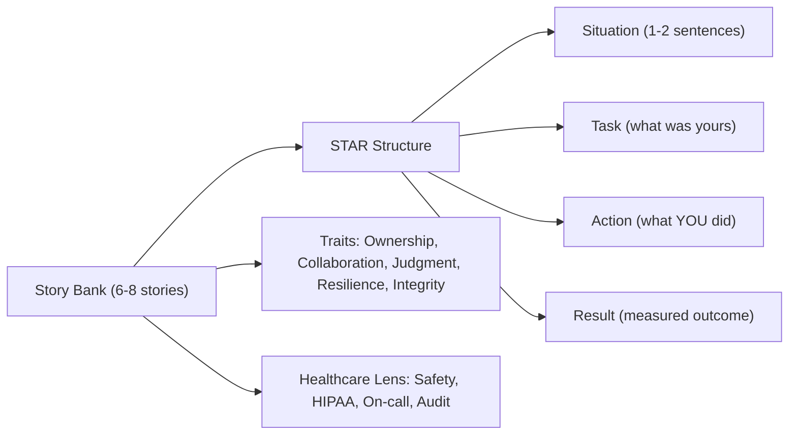

# Chapter 42: Behavioral Questions

> **Audience:** Experienced .NET developers (5+ years) preparing for an L2 (Mid/Senior) interview at a Healthcare company.
> **Scope:** The behavioral interview — the STAR method, the questions you'll actually get (conflict, failure, ownership, disagreement, ambiguity, feedback), how to prepare a story bank mapped to real experience, and how to frame healthcare-specific scenarios (patient-safety incidents, HIPAA, on-call, regulated change). Includes full worked answers.

---

## 42.1 How to Ace the Behavioral Interview

### Interview Answer (30–45 seconds)

> "Behavioral interviews are about proving how you operate, not what you know. I prepare by building a story bank — six to eight real situations mapped to the traits this role needs: ownership, collaboration, handling ambiguity, dealing with failure, and pushing back respectfully. I tell every story with STAR: Situation, Task, Action, Result. Crucially, I make the Action about me — what I personally did, with 'we' only when the situation demands it — and I always land the Result with numbers or a measurable outcome. For a healthcare company I add stories that show safety-first judgment: how I handled an incident, how I worked under HIPAA constraints, and how I escalate when patient data or a release is at risk."

### Detailed Explanation

**Why behavioral questions matter:**

- Past behavior predicts future behavior; interviewers probe for the traits a senior dev must have.
- They test self-awareness, honesty, and how you handle adversity — harder to fake than a technical answer.
- Healthcare companies weigh safety, compliance, and collaboration heavily: one reckless decision can breach PHI or harm a patient.

**The STAR method (memorize it):**

1. **Situation** — set the context in 1–2 sentences (project, constraint, stakes).
2. **Task** — your specific responsibility (what was yours, not the team's).
3. **Action** — what YOU did, step by step; name the decisions and reasoning.
4. **Result** — measurable outcome + what you learned. Quantify when possible.

**Build a story bank before the interview:**

- Prepare 6–8 stories; each maps to a trait. Reuse them across questions — interviewers rarely hear the same story twice from one candidate if you vary the emphasis.
- Stories to have ready: a technical failure you fixed; a conflict with a peer; an ambiguous requirement you shaped; a time you led/owned something beyond your role; a time you said no to a bad idea; a time you worked under compliance pressure; a time you coached someone.

**Traits to demonstrate:**

- Ownership — "I owned it to resolution," not "the team did."
- Collaboration — you pull people in, share credit.
- Judgment — you escalate when needed, and you know when NOT to.
- Resilience — you recover from failure with a lesson.
- Integrity — especially in healthcare: you don't cut corners on patient data or compliance.

**The "we" trap:**

- Replace "we did X" with "I did X; my teammate did Y" — interviewers want your specific contribution.
- If a story is genuinely team effort, say "the team decided X; I implemented the validator and pushed for the rollback plan."

**Healthcare-specific framing:**

- Choose safety/compliance stories: an incident where you caught a PHI leak, an audit you passed, a production issue where you chose patient-safety over speed.
- Show you treat HIPAA/audit as part of engineering, not overhead.
- On-call and incident response stories score well — clinical systems are high-stakes operations.

### Real World Example (Healthcare)

Question: "Tell me about a time you had to push back on a decision."

STAR answer: "On a patient-portal release, our product manager wanted results visible the moment the lab posted, to hit a launch date (Situation). My job was the portal data layer (Task). I pushed back with data: our consent and review workflow required a clinician to sign results first — releasing early would expose unsigned, potentially erroneous labs to patients, a safety and compliance risk. I proposed the compromise: ship the portal but gate visibility behind the existing Signed state machine, and run a shadow of both behaviors in staging to prove the latency impact was negligible (Action). We shipped on time with the gate, and the compliance review passed first pass — the release got a 'safety-first' callout from leadership (Result). I learned to frame pushback around risk and a workable alternative, not just 'no.'"

### Production Answer Templates

**Template for "Tell me about yourself" (90 seconds):**

> "I've spent the last N years as a .NET developer, the last X in healthcare. I've built [one anchor project], where I [specific contribution + number]. What I care about is [ownership/reliability/simple design], and I've been sharpening that on [recent work]. Why I'm here: this role is [specific reason], and I can contribute [specific strength] from day one."

**Template for "A failure" — the ownership arc:**

> "Situation: [project + deadline pressure]. Task: [what I owned]. What went wrong: [the concrete mistake — own it, don't blame]. What I did next: [fix + prevent recurrence, e.g., tests, checklists, monitoring]. Result: [outcome] — and the lesson I carry is [one-line takeaway]."

**Template for "A conflict":**

> "Situation: [disagreement, technical or people]. Task: [my role]. Action: [listened to their position, stated mine with evidence, found common ground / escalated with a recommendation]. Result: [resolved + relationship intact]. Lesson: [e.g., separate the person from the position, lead with data]."

### Common Mistakes

- Vague, unpracticed stories that ramble — rehearse aloud, time yourself.
- Over-using "we" so the interviewer can't see your contribution.
- Blaming others in failure stories — it signals low ownership.
- No measurable result — "it worked out" is weak; "incident count dropped from 12 to 2" is strong.
- Choosing a weak story because it's easy, not because it shows the trait.
- Bad-mouthing a previous employer or teammate — instant red flag.

### Interview Follow-up Questions

1. **"Tell me about a time you disagreed with a teammate."** — Use the conflict template; end with the relationship intact and a lesson.
2. **"What's your biggest professional failure?"** — Own it, show the fix and the system change so it can't recur.
3. **"Describe a time you had to work under ambiguity."** — Show how you reduced ambiguity (questions, prototypes, scoping) and still delivered.
4. **"Tell me about a time you improved something without being asked."** — Ownership story: you saw a problem, fixed it, and it had a measurable effect.
5. **"How do you handle being wrong in public?"** — Honesty, quick correction, no defensiveness; healthcare example if possible (caught a wrong assumption before release).
6. **"Describe a time you had to prioritize under pressure."** — Name your criteria (patient safety, user impact, deadline), what you deferred, and who you told.
7. **"Why do you want to work here?"** — Tie to the company's mission (healthcare impact) and to your strengths; specific, not generic.
8. **"Tell me about a time you received difficult feedback."** — How you responded, what you changed, and the outcome.
9. **"Describe a time you had to learn something fast."** — A concrete ramp-up with evidence you landed it (shipped it, taught it).
10. **"Where do you see yourself in five years?"** — Growth aligned with the role and company; senior/lead trajectory, not a title grab.

### Senior Level Talking Points

- **Lead with outcomes:** numbers, percentages, time saved — quantify everything.
- **Show systems thinking:** when something failed, you didn't just fix it — you changed the process, added the test, wrote the runbook.
- **Show how you make others better:** mentoring, review culture, documentation — senior engineers scale through others.
- **Frame healthcare values naturally:** safety, compliance, patient trust — these appear in your stories without being forced.
- **Be concise:** a 2-minute STAR story beats a 5-minute ramble; practice the trim.

### Diagram



### Comparison Table

| Weak answer | Strong answer |
|---|---|
| "We had a big incident." | "A results feed went down at 2am; I owned the rollback and postmortem." |
| "It worked out fine." | "Recovery went from 40 minutes to 6, and we added the failing test." |
| "My manager made a bad call." | "I disagreed with the deadline, proposed a phased release, and shipped the safe subset on time." |
| "I'm a team player." | "I reviewed my teammate's PR and flagged a PHI field leaking into logs." |
| "I learn fast." | "I picked up gRPC for the integration and shipped the contract in two weeks." |

### Memory Trick

**"STAR + OWN IT."** Tell stories with Situation–Task–Action–Result, always in first person, always with a number. In healthcare, add the safety lens: every story should show you treat patient data and patient safety as non-negotiable.

### Summary

Behavioral interviews are won before the interview — by building a story bank mapped to the traits this role needs, and by telling those stories with STAR discipline: Situation, Task, Action, Result, in first person, with measured outcomes. For a healthcare company, weave safety, compliance, and ownership into your narratives naturally. Practice aloud, time yourself, and let the stories show who you are rather than telling.

### Interview Confidence Score

**Confidence: High (after this chapter).** Behavioral interviews are preparation, not luck. With a rehearsed story bank, STAR structure, and healthcare framing, you can turn even a hard question into a demonstration of the exact traits this role rewards.

---

## Top 10 Interview Questions for This Chapter

1. Tell me about yourself.
2. Tell me about a time you failed at work.
3. Tell me about a time you disagreed with a teammate.
4. Tell me about a time you had to work under ambiguity.
5. Describe a time you improved something without being asked.
6. How do you prioritize when everything is urgent?
7. Tell me about a time you received difficult feedback.
8. Why do you want to work in healthcare?
9. Describe a time you had to learn something fast.
10. Where do you see yourself in five years?

## Revision Notes

- STAR: Situation, Task, Action, Result — the only structure you need.
- Story bank of 6–8 real stories, each mapped to a trait (ownership, collaboration, judgment, resilience, integrity).
- First person only — eliminate the "we" that hides your contribution.
- End every story with a measurable result and a one-line lesson.
- Healthcare lens: safety, HIPAA, audit, on-call — show these as engineering values.
- Never blame others in failure stories; own it, then show the systemic fix.
- Rehearse aloud; time yourself; keep the strong answer under 2 minutes.

## Things Interviewers Expect from 5+ Years Experience

- Concrete, measurable stories — not vague claims about "teamwork."
- Ownership language: "I owned it," "I drove it," "I fixed it."
- Honest failure with a preventive fix, not blame.
- Senior behavior: mentoring, systems thinking, process changes.
- Healthcare values woven in naturally: safety, compliance, patient trust.

## Cheat Sheet

```text
STAR story skeleton:
  S: "On [project], we were [constraint/stakes]."
  T: "My job was [specific responsibility]."
  A: "I did [step 1], [step 2], [decision + why]."
  R: "[Measured outcome]; the lesson I carry is [one line]."

Story bank (have these ready):
  1. Failure owned & fixed       6. Said no to a bad idea
  2. Conflict with a peer        7. Compliance/HIPAA pressure
  3. Ambiguous requirement       8. On-call / incident response
  4. Led beyond your role        9. Mentored / grew someone
  5. Improved without being asked

Voice rules:
  - First person ("I"), share credit with specifics
  - Lead with outcomes and numbers
  - Never blame teammates or past employers
```

## Flash Cards

**Q:** What does STAR stand for? **A:** Situation, Task, Action, Result.

**Q:** How long should a strong STAR answer be? **A:** About 90 seconds to 2 minutes, rehearsed and trimmed.

**Q:** Why avoid "we did it"? **A:** Interviewers need YOUR contribution; assign actions specifically.

**Q:** How do you answer a failure question well? **A:** Own the mistake, show the fix, and describe the system change that prevents recurrence.

**Q:** What's the healthcare twist in behavioral answers? **A:** Show safety, compliance, and audit as engineering values — not overhead.

**Q:** How many stories should you prepare? **A:** Six to eight, each mapping to a different trait, reusable across questions.

---

*You've reached the end of The Complete .NET Interview Handbook. Review the Cheat Sheets and Flash Cards from every chapter before your interview. Good luck!*
